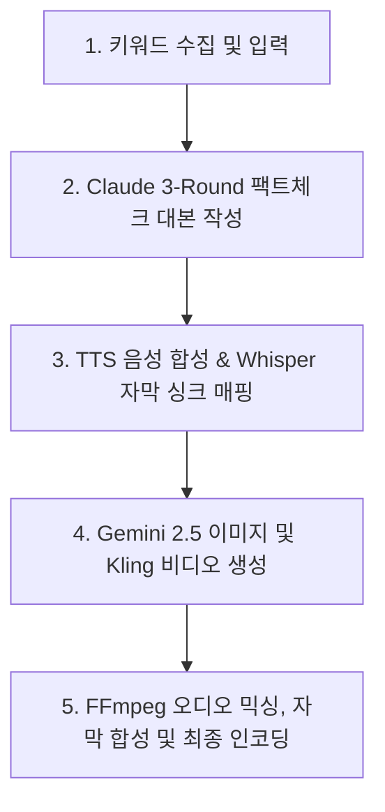

# AI 비디오 자동 생성 파이프라인 개발 현황 및 로드맵 보고서
**작성일자**: 2026년 7월 8일  
**대상**: 개발 팀 및 프로젝트 의사결정권자  

본 문서는 주식/금융 트렌드 분석 영상(레퍼런스 채널: "경제사냥꾼")을 무인(Auto)으로 자동 기획, 음성 합성, 이미지 생성 및 최종 영상 조립까지 완주하는 AI 비디오 파이프라인의 현재 개발 상태, 핵심 성과, 기술적 병목(걸림돌) 및 해결 방안을 상세히 기술합니다.

---

## 1. 프로젝트 목표 및 아키텍처 개요
본 프로젝트는 특정 금융 키워드를 입력하거나 트렌드가 감지되면 아래의 파이프라인 단계를 거쳐 YouTube 롱폼 규격(1080p, 16:9, 자막 및 BGM 탑재)의 최종 영상을 자동으로 조립·출력하는 것을 목표로 합니다.

현재 파이프라인은 브라우저 개입 없이 백엔드 오케스트레이터(`WorkflowOrchestrator`)에 의해 **완전 자동 모드(AUTO)로 끝까지 완주 가능한 상태로 세팅 완료**되어 있습니다.

---

## 2. 최근 핵심 개발 성과 (구현 완료 사항)

### ① 음성 및 자막 1.5배속 가속 및 동기화 구현 완료
* **이슈**: 기존 나레이션 음성 템포가 너무 느려 시청 몰입도가 저해되는 문제가 있었습니다.
* **해결**: `tts_worker.py` 내부에서 음성 합성 즉시 `ffmpeg` 오디오 필터(`atempo=1.5`)를 사용해 속도를 1.5배속 가속했습니다.
* **싱크 연동**: 가속된 최종 오디오를 기준으로 Whisper AI를 기동시켜 정밀 타임스탬프를 다시 추출하고, 자막 변환(ASS subtitle) 싱크를 이에 완벽히 맞추도록 구현하여 자막이 밀리거나 어긋나는 증상을 해결했습니다.

### ② 1.5배속 압축에 따른 분량 감소 보정 설계 완료
* **이슈**: 5분(300초) 분량의 영상을 요청했으나 1.5배속 가속 인코딩으로 인해 결과물이 3분 미만으로 단축되는 현상이 발생했습니다.
* **해결**: 
  1. `ScriptService.java`에서 사용자 요청 시간(예: 5분)에 **1.5배의 가속 가중치**를 곱해 LLM에 최초 대본 작성을 요청할 때 **7.5분 분량의 대본**을 쓰도록 분량 기준을 상향했습니다.
  2. 실제 TTS 엔진의 한글 독해 속도를 분석하여 기존 공식(분당 300자)에서 **현실적인 TTS 속도(분당 470자)**로 글자 수 추정 공식을 보정했습니다.
  3. **결과**: 5분 영상을 요청하면 약 3,500자의 대본을 생성한 뒤 1.5배속 압축을 거쳐 **최종 결과물 영상의 길이가 5분 내외에 정확하게 수렴**하게 됩니다.

### ③ Google AI Studio 이미지 모델 마이그레이션 및 429 우회 큐 구축
* **이슈**: 구글 공식 정책으로 기존 Imagen 3 독립 모델(`imagen-3.0-generate-002`) API가 Deprecated(중단)되어 이미지 생성 오류 및 Fallback(저화질 Matplotlib 차트)이 발생했습니다.
* **해결**: 
  1. 최신 구글 공식 이미지 생성 모델인 **`gemini-2.5-flash-image` (Nano Banana)** API 및 페이로드 규격으로 연동부를 전면 마이그레이션 완료했습니다.
  2. **429 Rate Limit 자동 대기 큐 탑재**: 개발자 무료 API Key의 엄격한 할당량(분당 2회)으로 인해 대량 이미지 생성 시 즉시 차단되던 한계를 극복하기 위해, **429 HTTP 에러 감지 시 즉시 끊어지지 않고 35초간 Sleep 후 최대 5회 자동 재시도**하는 재시도 루프를 구현했습니다.

---

## 3. 기술적 병목 사항 및 해결 방안 (걸림돌)

현재 완벽한 퀄리티의 결과물을 얻기 위해 반드시 해결해야 하는 시스템 외적 병목 사항(API 권한 및 결제)들입니다.

### 🔴 1. Kling AI API 키 권한 및 잔액 부족 (401 Unauthorized)
* **현상**: 비디오 클립 생성을 위해 제공된 Kling API Key가 글로벌/중국 도메인 및 JWT/Bearer 모든 인증 Permutation에서 `401 Unauthorized` (인증 실패 및 잔액 없음) 에러를 반환합니다.
* **영향**: 모션 비디오 클립 생성이 차단되고, FFmpeg을 통한 이미지 정적 줌인/줌아웃(Zoompan) 연출로 자동 폴백(Fallback)되어 구동 중입니다.
* **해결 방안**: 
  * **방안 A**: Kling AI Developer Platform 콘솔([https://open.klingai.com/](https://open.klingai.com/))에 접속하여 비즈니스 카드로 API 전용 크레딧을 충전해야 합니다. 해외 결제가 막혀있을 경우 Kling Sales 측에 이메일로 인보이스(Invoice) 발행을 요청하여 송금 처리해야 합니다.
  * **방안 B (강력 추천)**: Kling 공식 API의 복잡한 충전 절차를 피하기 위해, 개발자용 글로벌 대행 API 플랫폼인 **[Fal.ai](https://fal.ai/)**에 신용카드를 연동하여 Kling 비디오 생성 API를 대행 호출하는 구조로 전환합니다. (셋업 즉시 작동 가능)

### 🟡 2. Google AI Studio API 무료 플랜 한도 (Rate Limit 2 RPM)
* **현상**: 현재 적용된 이미지 자동 대기 큐(35초 대기) 덕분에 무료 키로도 고화질 이미지 생성이 끊기지 않고 완료는 되나, 씬이 많은 긴 영상(예: 80개 씬)의 경우 이미지 생성 단계에서만 **40분 이상의 강제 대기 시간(Sleep)**이 발생합니다.
* **영향**: 전체 비디오 파이프라인의 완성 시간이 극도로 늘어나 상용화 및 실시간 테스트가 불가능합니다.
* **해결 방안**: Google AI Studio 콘솔([https://aistudio.google.com/](https://aistudio.google.com/))의 **Billing** 메뉴에서 결제 카드 등록을 통한 **종량제(Pay-as-you-go) 결제 계정 연동**이 필수적입니다. 유료 전환 시 분당 처리량이 **360 RPM**으로 대폭 늘어나 수십 장의 이미지가 수 초 이내에 실시간으로 완성됩니다. (예상 비용: 이미지 960장 기준 월 약 $28.80)

### 🟡 3. ElevenLabs API 발음 사전 쓰기 권한 에러 (401 Forbidden)
* **현상**: 금융 전문 용어(FOMC, MACD 등)의 정확한 발음을 사전 정의하는 `Pronunciation Dictionary` 생성 API 호출 시 `missing_permissions` (쓰기 권한 누락) 에러가 발생합니다.
* **영향**: 일부 복잡한 영문 금융 약어의 TTS 발음이 원어민식 직독으로 나와 한국어 흐름에서 이질감이 발생할 수 있습니다.
* **해결 방안**: ElevenLabs 개발자 콘솔에서 발급한 API Key의 권한 설정 항목 중 **`pronunciation_dictionaries_write`** 옵션이 체크되어 활성화되어 있는지 확인하고 권한을 갱신해야 합니다.

---

## 4. 단계별 상태 리포트

| 단계 (Phase) | 담당 모듈 | 개발 상태 | 최근 개선점 | 걸림돌 / 특이사항 |
| :--- | :--- | :---: | :--- | :--- |
| **1. 키워드 추출** | `market_data_collector.py` | **완료 (OK)** | KOSPI/KOSDAQ 데이터 수집 연동 | - |
| **2. 대본 생성** | `script_worker.py` (Claude 3.5) | **완료 (OK)** | 팩트체크 로직 작동 및 1.5배속 압축 보정 공식 탑재 | - |
| **3. 음성 합성** | `tts_worker.py` (gTTS/Elevenlabs) | **완료 (OK)** | `atempo=1.5` 배속 변환 및 Whisper 자막 동기화 연동 | ElevenLabs API 발음 사전 쓰기 권한 누락 (`401`) |
| **4. 에셋 생성** | `image.py` (Gemini 2.5 Flash Image) | **완료 (OK)** | `gemini-2.5-flash-image` 마이그레이션 및 429 대기 큐 탑재 | 무료 티어 Quota 제한 (2 RPM) $\rightarrow$ **유료 결제 등록 필요** |
| **4. 에셋 생성** | `video.py` (Kling AI) | **폴백 작동** | 싱가포르/중국 하이브리드 도메인 인증 매핑 완료 | Kling API Key 인증 만료/미활성화 $\rightarrow$ **Fal.ai 등 대행 API 연동 필요** |
| **5. 롱폼 조립** | `longform_worker.py` (FFmpeg) | **완료 (OK)** | 1.5배속 자막, 씬 전환 싱크, BGM 볼륨 믹싱 자동화 | - |

---

## 5. Next Action Items (개발자 권장 실행 로드맵)

1. **Google AI Studio 결제 카드 등록**:
   * API Key를 유료 요금제(Pay-as-you-go)로 업그레이드하여 이미지 생성 시 발생하는 35초 대기 딜레이를 0초로 단축시킵니다.
2. **비디오 생성 API를 Fal.ai 대행 플랫폼으로 전환**:
   * Kling AI 본사와의 직접 결제 송금 대기 일정을 피하기 위해, `video.py` 내부 엔진에 `fal.ai`를 통한 Kling API 호출 래퍼를 이식하고 API Key를 등록하여 줌인 정적 이미지 연출을 진짜 모션 비디오 클립으로 즉시 승격시킵니다.
3. **ElevenLabs Key 권한 변경**:
   * ElevenLabs 계정 설정 페이지로 이동하여 발급된 API 토큰에 발음 사전 읽기/쓰기 권한(`pronunciation_dictionaries_write`)을 부여하여 금융 용어 발음 완성도를 강화합니다.
