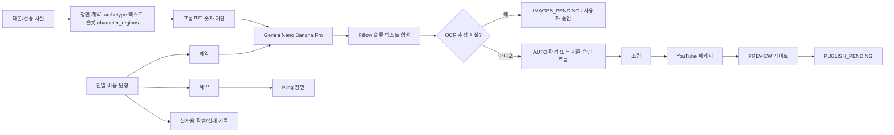

# Three Goals Pipeline 실제 구현 계획

작성일: 2026-08-02  
기준 커밋: `4c01a7894c85de8a3cfae73df6ea11bcdebf4739` (`main`, `origin/main`과 동일)  
입력 문서: `C:/Users/song/Downloads/CODEX_WORKORDER_THREE_GOALS_PIPELINE_2026-08-02.md`  
사전 진단: `docs/CODEX_DEVELOPER_AUDIT_THREE_GOALS_PIPELINE_2026-08-02.md`

## 1. 계획의 목적과 구현 원칙

이 문서는 작업지시서의 목표를 현재 코드에 대입해, **실제로 수정할 파일·인터페이스·상태 전이·테스트 순서**로 바꾼 구현 계획이다. 이 문서 작성 시점에는 제품 코드를 변경하지 않았다.

다음 원칙을 고정한다.

- 검증 사실과 금액/등락률 등 수치 데이터는 모델 프롬프트에 넣지 않고 Pillow/FFmpeg의 결정론적 경로에서만 렌더링한다.
- 이미지 생성 경로는 Gemini Nano Banana Pro만 사용한다. 이미지 품질 저하를 위한 Flash 또는 hybrid 자동 전환은 만들지 않는다.
- 실제 외부 API 호출은 예산 예약 후에만 실행하며, 실패·재시도·부분 성공도 단일 원장에 남긴다.
- AUTO 모드라 하더라도 OCR 추정 사실은 이미지 자동 확정을 금지하고 기존 이미지 승인 게이트로 보낸다.
- 아직 연결되지 않은 유튜브 실제 게시 기능은 성공처럼 보이게 하지 않는다.

## 2. 코드 검증 결과와 작업지시서 보정

| 작업지시 요구 | 현재 코드 근거 | 실제 구현 판단 |
|---|---|---|
| 기존 `composite_planar`/`render_data_cutaway` 제거 | `backend/fastapi-workers/app/workers/images_worker.py`의 `_apply_info_surface_plan()`이 두 함수를 import하고, 약 2051행에서 합성한다. | 이미지 워커의 생산 경로에서 제거한다. 다만 대체 경로는 단순 함수 연결이 아니라 새 슬롯 기반 Pillow 렌더러여야 한다. |
| `apply_verified_scene_facts` 재사용 | `backend/fastapi-workers/app/v5/overlay/diegetic_fact_overlay.py`의 `apply_facts_to_surfaces()`는 `rounded_rectangle(..., fill=...)`로 불투명/반투명 카드 배경을 실제로 그린다. | 현재 구현을 그대로 연결하면 “UI 박스 없음” 요구를 위반한다. 해당 모듈을 슬롯 텍스트 렌더러로 개편한 뒤 사용한다. |
| OCR 추정치는 GUIDED | FastAPI `ImagesGenerateRequest`에는 autonomy가 없고, Spring `ImagesService.generate()`는 `isAuto(job)`이면 무조건 `confirm()`한다. | FastAPI 응답에 `requires_manual_review`와 사유를 추가하고, Spring에서 AUTO confirm을 막는다. 이미 존재하는 `IMAGES_PENDING`/`GateName.IMAGES`를 재사용한다. |
| 패키지 오류를 승인으로 전환 | `JobService.generateYoutubePackage()`는 개별 오류를 로그만 남긴 후 `null` 메타데이터를 저장한다. `LongformService`도 예외를 삼킨다. | 새 범용 `APPROVAL_REQUIRED` 상태는 현재 GateService/Temporal 전이에 없다. 패키지 실패 에셋을 저장하고 기존 `PREVIEW_PENDING`/`PREVIEW` 게이트에서 재시도·승인하도록 한다. |
| mock publish 제거 | `JobService.publishVideo()`가 `mock_youtube_video_...` URL을 만들고 상태를 `PUBLISHED`로 저장한다. | `PUBLISH_PENDING`을 추가하고 URL을 만들지 않는다. 실제 YouTube 업로드 구현 전에는 명시적 미구현 응답만 제공한다. |
| 20분 이상 장문 예산 ₩70,000 | 전역 지침이 20분 미만 ₩40,000 / 20분 이상 ₩70,000으로 개정됐다. | `PricingConfig.java`가 길이별 상한과 정책 버전의 단일 진입점이 되고, Spring이 작업별 상한을 FastAPI에 전달한다. |

## 3. 목표 아키텍처

### 3.1 경계와 계약

1. **Spring은 작업 상태·게이트·사용자 승인 권한의 소유자**이고, FastAPI는 이미지·모션·썸네일의 비용 발생 작업과 원장 이벤트의 소유자다.
2. FastAPI의 JSON 비용 원장(`app/data/jobs/{job_id}/cost_ledger.json`)을 해당 외부 호출의 canonical ledger로 삼는다. Spring `CostService`의 `GEMINI_IMAGE`/`FAL_KLING_INTRO` 추정 기록은 제거하고, 화면/DB에는 원장의 동기화 값만 읽기 모델로 저장한다.
3. 장면 계약에는 다음이 명시돼야 한다: `scene_type`, `v5_verified_overlays`, `verified_facts`, `character_regions`, `text_slots`, `fact_confidence`, `requires_manual_review`.
4. “하단 10%”는 자막이 쓸 안전 영역과 충돌할 수 있으므로 고정 좌표가 아니라 `subtitle_safe_area`와 함께 계산한다. 캐릭터 보호도 “오른쪽 40%” 같은 고정 영역이 아니라 생성된 `character_regions` 실제 좌표로 판정한다.

## 4. 선행 결정 및 완료 정의

### 4.1 구현 전에 확정할 정책

- **예산:** 20분 미만은 ₩40,000, 20분 이상은 ₩70,000을 적용한다. 작업 생성 시 확정한 상한은 이후 provider 요청 전체에 유지한다.
- **기본 장면 수:** 45초/60초/600자는 런타임 기본값으로 바꾸되, 기존 환경 변수 명칭과 배포 설정을 함께 마이그레이션한다. 숨은 기본값 40/60/660이 남으면 안 된다.
- **아티클 캡처:** 외부 문서의 HTML·스크린샷 구조가 바뀔 수 있으므로, 첫 실사용 E2E는 별도 API 승인/비용 확인 후 실행한다. 구현 단위 테스트에서는 저장한 fixture HTML/PNG만 쓴다.

### 4.2 최종 완료 기준

- production 이미지 워커가 `composite_planar`, `render_data_cutaway`, FAL/Gemini harmonizer 경로를 호출하지 않는다.
- 검증 수치가 최종 이미지 생성 프롬프트에 없고, 검증 실패 시 생성 요청 자체가 보내지지 않는다.
- Flash/hybrid 이미지 자동 저하와 Fal billing preflight가 없다.
- OCR 추정 장면은 AUTO에서도 `IMAGES_PENDING`에 남아 사용자 승인 없이는 조립으로 진행하지 않는다.
- 비용 제한을 넘는 예약은 외부 API 호출 전에 거절되며, 원장과 Spring 표시 비용이 일치한다.
- 메타데이터/썸네일 실패가 성공 에셋 또는 빈 성공처럼 저장되지 않는다.
- mock URL 및 `PUBLISHED` 오표기가 없다.

## 5. 구현 단계

## WP-0 — 비용 없는 정책·안전성 정합화

### WP-0A. V5 결정론적 오버레이로 교체

**수정 대상**

- `backend/fastapi-workers/app/workers/images_worker.py`
- `backend/fastapi-workers/app/v5/overlay/diegetic_fact_overlay.py`
- 새 파일: `backend/fastapi-workers/app/v5/overlay/text_slot_renderer.py`
- 새 파일: `backend/fastapi-workers/app/v5/overlay/scene_text_slots.py`
- `backend/fastapi-workers/tests/test_v5_diegetic_fact_overlay.py`
- 새 파일: `backend/fastapi-workers/tests/test_v5_text_slot_renderer.py`
- `backend/fastapi-workers/tests/test_info_surface_compositor.py` (이미지 워커 경로에서 빠진 legacy 기능만 분리/표시)

**구현 순서**

1. `scene_text_slots.py`에 10개 scene archetype의 허용 슬롯을 선언한다. 슬롯은 정규화 좌표, 최대 줄 수, 최소 글자 크기, 허용 `SurfaceKind`, 자막 안전 영역 여부를 가진다.
2. `text_slot_renderer.py`에서 `VerifiedFact`를 배경 카드 없이 텍스트·외곽선·필요 최소 대비만으로 그린다. 새 사각형, 그리드, 패널, 임의 차트는 그리지 않는다.
3. 렌더 전에 슬롯 사각형과 `character_regions`의 교집합을 검사한다. 교집합이 있거나 글자가 최소 크기보다 작아지면 해당 슬롯은 실패다. 축소로 억지로 통과시키지 않는다.
4. 우선순위는 (a) archetype의 소품/텍스트 슬롯, (b) 자막 안전 영역을 제외한 하단 10%의 캡션 슬롯, (c) 새 `full_frame_fact_scene` 결정론 경로 순이다. (c)는 `render_data_cutaway`를 재사용하지 않으며, 장면 전체를 정보 장면으로 바꾸는 별도 Pillow 함수다.
5. `diegetic_fact_overlay.py`의 기존 `_surface_style()`와 `rounded_rectangle` 렌더링은 legacy 카드 경로에서 제거한다. `apply_verified_scene_facts()`는 새 슬롯 렌더러 호출의 얇은 호환 래퍼로 유지하거나, 모든 호출처를 바꾼 뒤 삭제한다.
6. `images_worker.py::_apply_info_surface_plan()`을 삭제/축소한다. `composite_planar`, `render_data_cutaway`, harmonizer provider import와 생산 호출을 제거하고, V5 검증 장면에서만 새 renderer를 호출한다.

**필수 테스트**

- 각 archetype의 정상 슬롯 렌더링, 긴 텍스트 거절, 캐릭터 교차 거절, 하단 fallback, full-frame fallback.
- PNG 전후 비교에서 `character_regions` 픽셀이 변하지 않는지 검사한다.
- 이미지 워커 production import/call graph에 금지 함수가 없는 정적 검사.
- 한글 폰트 누락 시 조용히 영문/깨진 문자로 진행하지 않고 명시 오류.

### WP-0A-1. 프롬프트 수치 차단과 fact 검증

**수정 대상**

- `backend/fastapi-workers/app/workers/images_worker.py`
- `backend/fastapi-workers/app/v5/runtime_contract.py` 및 실제 프롬프트 조립 모듈
- 새 파일: `backend/fastapi-workers/app/v5/prompt_fact_guard.py`
- 새 파일: `backend/fastapi-workers/tests/test_v5_prompt_fact_guard.py`

**구현 순서**

1. `VerifiedFact`의 `value`에서 숫자 토큰(소수점, 쉼표, %, 통화/단위 접미 포함)을 정규화한다. 단일 숫자 `1`처럼 일반 프롬프트에서 오탐이 큰 값은 단독 문자열 포함 검사 대신 숫자 경계 토큰 비교를 사용한다.
2. 최종 프롬프트가 완성된 **직후, provider 호출 직전**에 guard를 실행한다. 중간 프롬프트만 검사하면 후처리 템플릿에서 다시 유입될 수 있다.
3. 일치하면 `PromptContainsVerifiedDataError`에 장면 번호·문제 토큰·source reference를 담아 즉시 실패한다. `continue`, fallback 이미지, 자동 숫자 삭제는 금지한다.
4. `v5_verified_overlays`의 모든 항목은 `facts[n]` 또는 `verified_facts[n]`의 유효 source reference를 가져야 하며, 누락/범위 초과/값 불일치는 `OverlayFactValidationError`로 실패한다.

### WP-0A-2. OCR 추정 사실의 승인 강제

**수정 대상**

- `backend/fastapi-workers/app/main.py`
- `backend/fastapi-workers/app/workers/images_worker.py`
- `backend/spring-app/src/main/java/com/pipeline/video/service/FastApiClient.java`
- `backend/spring-app/src/main/java/com/pipeline/video/dto/ImagesGenerateResponse.java`
- `backend/spring-app/src/main/java/com/pipeline/video/service/ImagesService.java`
- 관련 Spring/FastAPI 테스트

**구현 순서**

1. Spring 호출 본문에 `autonomy_mode`를 추가하고 FastAPI `ImagesGenerateRequest`에 명시적으로 모델링한다. 현재 요청에는 이 값이 없다.
2. FastAPI가 `ocr_estimate` fact를 발견하면 응답에 `requires_manual_review=true`, `review_reasons=["OCR_ESTIMATE"]`, 해당 scene index를 기록한다. 이는 500 예외가 아니라 정상적인 생성 결과의 승인 요구다.
3. Spring DTO에 위 필드를 추가하고 `ImagesService.generate()` 및 batch 완료 경로에서 AUTO `confirm()` 조건을 `!requiresManualReview`로 제한한다.
4. 승인 요구 시 job은 이미 이미지 단계에 있으므로 `IMAGES_PENDING`을 유지하고, 이미지 에셋의 meta JSON에 사유를 저장한다. 사용자는 기존 `GateName.IMAGES` 승인 UI로 진행한다.
5. UI에는 “OCR 추정 사실 포함 — 자동 확정 불가”라는 한국어 사유와 재생성/승인 선택지를 표시한다.

### WP-0B. 장면 기본값 정합화

**수정 대상**

- `backend/fastapi-workers/app/config.py`
- `backend/fastapi-workers/app/workers/longform_worker.py`
- `backend/fastapi-workers/tests/test_longform_worker*.py`
- 배포 환경 예시 파일 및 운영 문서

**구현 순서**

1. short 기본 45초, long 기본 60초, long 판정 600자로 변경한다.
2. 환경 변수 override는 유지하되 이름·설명·테스트 기본값을 모두 같은 값으로 맞춘다.
3. 600자 경계의 599/600/601자 테스트와 45/60초 motion clip 계획 테스트를 추가한다.

### WP-0C. Fal billing preflight 제거

**수정 대상**

- `backend/fastapi-workers/app/workers/longform_worker.py`
- `backend/fastapi-workers/app/utils/fal_billing.py` (Kling 전용이면 삭제, 다른 실제 사용처가 있으면 호출 분리)
- `backend/fastapi-workers/tests/test_longform_worker*.py`

**구현 순서**

1. `get_fal_credit_status()`와 자동 downgrade 분기를 Kling 생성 전에 호출하지 않도록 제거한다.
2. 403을 usable credit으로 간주하는 우회 로직을 삭제한다.
3. 실제 Fal 생성 응답의 401/402/403/429/5xx를 provider error code로 분류하고, 비용 원장의 예약을 release 또는 failed로 확정한다.
4. 호출 전 허용 여부는 아래 WP-1A의 원장 잔액으로만 판단한다.

### WP-0D. Gemini Pro 고정 및 strict budget

**수정 대상**

- `backend/fastapi-workers/app/config.py`
- `backend/fastapi-workers/app/utils/budget.py`
- `backend/fastapi-workers/app/providers/`의 Gemini 선택 경계
- `backend/fastapi-workers/app/workers/images_worker.py`
- 이미지 provider/budget 테스트

**구현 순서**

1. 이미지 품질 tier를 `pro` 단일값으로 축소하고, 환경 값이 `flash`/`hybrid`면 시작 단계에서 한국어 설정 오류로 실패한다.
2. 실제 Gemini provider 요청에서 Nano Banana Pro의 검증된 모델 식별자만 사용하도록 한 곳에 pin한다. API 식별자는 배포 전 공식 문서/계정 콘솔로 재검증한다.
3. `plan_preflight()`의 “예산 초과 → Pro 장면 수 축소 → Flash/hybrid” 논리를 삭제한다.
4. 예상 비용이 한도를 넘으면 `BudgetExceededError`를 반환하고 어떠한 이미지 API 요청도 보내지 않는다.
5. 이미지/썸네일/재생성 모두 같은 provider 선택 정책을 사용하도록 단일 factory로 묶는다. LoRA의 Fal Flux 경로는 “이미지 생성은 Pro only” 요구와 충돌하므로, Pro로 대체하거나 기능을 명시적으로 비활성화하는 별도 결정이 필요하다.

## WP-1 — 비용·패키지·게시의 운영 정합화

### WP-1A. 단일 비용 원장과 정책 중앙화

**수정 대상**

- 새 파일: `backend/spring-app/src/main/java/com/pipeline/video/config/PricingConfig.java`
- `backend/fastapi-workers/app/utils/budget.py`
- `backend/fastapi-workers/app/workers/images_worker.py`
- `backend/fastapi-workers/app/workers/longform_worker.py`
- `backend/spring-app/src/main/java/com/pipeline/video/service/ImagesService.java`
- Spring `CostService` 및 비용 조회 DTO/화면
- 원장 단위·통합 테스트

**구현 순서**

1. `PricingConfig.java`를 비용 상수의 Spring 단일 진입점으로 만들고, 20분 미만 ₩40,000 / 20분 이상 ₩70,000을 계산한다. FastAPI에는 Spring이 계산한 job별 `budget_limit_krw`와 가격표 버전을 전달한다. FastAPI의 독자적인 max budget은 70,000원 초과 차단용 안전 상한으로만 둔다.
2. FastAPI에 원장 API/서비스를 만든다: `reserve(operation, estimate)`, `commit(reservation, actual)`, `release(reservation, reason)`, `record_zero_cost(operation)`. 각 이벤트는 idempotency key와 provider request id를 갖는다.
3. 이미지, Kling, 썸네일, 재생성에서 provider 호출 직전에 reserve하고, 성공/실패/타임아웃에 맞춰 commit/release한다. 기사 캡처와 Pillow 합성은 zero-cost로 기록한다.
4. `ImagesService`의 `CostEstimator.geminiImages()` 사후 추정 record를 제거한다. 현재 코드는 article capture까지 새 씬 수에 포함시킬 수 있어 원장과 불일치한다.
5. Spring은 FastAPI 원장 요약을 읽어 DB/UI용 read model에 동기화한다. 두 곳에서 비용을 독립 계산하지 않는다.
6. 금액 단위는 KRW 정수(또는 최소 통화 단위 Decimal)로 통일한다. USD 추정과 KRW 한도를 섞어 비교하지 않는다.

**정책 충돌 처리**

- 작업 생성 시 `PricingConfig.budgetCapForTargetMinutes()`로 duration tier를 확정한다.
- 작업별 상한과 `policy_version`은 FastAPI preflight 및 provider request audit에 남겨 재현 가능하게 한다.

### WP-1B. YouTube 패키지 실패를 실제 승인 흐름으로 전환

**수정 대상**

- `backend/spring-app/src/main/java/com/pipeline/video/service/JobService.java`
- `backend/spring-app/src/main/java/com/pipeline/video/service/LongformService.java`
- `backend/spring-app/src/main/java/com/pipeline/video/domain/AssetType.java` (예: `YOUTUBE_PACKAGE_FAILURE`)
- preview API/UI 및 GateService 테스트

**구현 순서**

1. `generateYoutubePackage()`가 메타데이터 또는 썸네일 실패를 catch-and-continue하지 않고 `YoutubePackageResult`(성공 payload, 실패 단계, retryable, 원인)을 반환하게 한다.
2. 실패 시 기존 성공 `YOUTUBE_METADATA`를 삭제하지 않는다. 별도 실패 에셋에 오류 요약·시도 시각·재시도 가능 여부를 저장한다.
3. `LongformService`는 영상 조립 완료 후 패키지 실패가 나더라도 `PREVIEW_PENDING`을 유지한다. 따라서 현재 GateService/Temporal에 존재하는 `PREVIEW` signal로 사용자가 영상 검토, 패키지 재생성, 패키지 없이 승인 중 하나를 선택할 수 있다.
4. 재생성 endpoint는 실패 에셋을 새 시도로 남기고 성공했을 때만 `YOUTUBE_METADATA`를 교체한다. “패키지 없이 진행”은 명시적 audit event를 남긴다.
5. 패키지가 필요한 publish 요청에서는 성공 패키지가 없으면 HTTP 409과 한국어 원인을 반환한다.

### WP-1C. mock publish 제거

**수정 대상**

- `backend/spring-app/src/main/java/com/pipeline/video/domain/JobStatus.java`
- `backend/spring-app/src/main/java/com/pipeline/video/service/JobService.java`
- `backend/spring-app/src/main/java/com/pipeline/video/controller/JobController.java`
- Job status UI/DTO/테스트

**구현 순서**

1. `PUBLISH_PENDING` 상태를 추가하고 DB enum 저장 방식, UI label, 상태 필터를 함께 점검한다.
2. `publishVideo()`에서 mock URL 생성과 `PUBLISHED` 저장을 제거한다. 실제 OAuth·YouTube upload가 구성되지 않은 경우 상태를 `PUBLISH_PENDING`으로 남기고 `youtubeUrl=null`, `publishConfigured=false`를 반환한다.
3. 실제 업로드는 별도 인증·재시도·idempotency·업로드 결과 검증 설계가 승인된 뒤 구현한다. 성공 응답에서 받은 실제 video id가 확인된 때만 `PUBLISHED`가 된다.

### WP-1D. Kling 모션 프롬프트의 실제 사용

**수정 대상**

- `backend/fastapi-workers/app/workers/longform_worker.py`
- `backend/fastapi-workers/app/providers/real/video.py`
- `backend/fastapi-workers/tests/test_longform_worker*.py`

**구현 순서**

1. 현재 provider 호출에 전달되는 `build_kling_motion_prompt(scene.get("motion_type"))`를 scene 전체를 받는 builder로 교체한다.
2. 이미 존재하지만 미사용인 `_build_kling_motion_prompt(scene)`의 `emotion`, `action`, `edit` 필드를 정규화하고, 없는 경우에만 `motion_type` fallback을 쓴다.
3. positive prompt와 negative prompt를 구조체/별도 인자로 유지한다. 단순 문자열 교체로 negative prompt가 사라지지 않게 한다.
4. `start_image_url`, `generate_audio=false`, 실제 적용 prompt를 provider request audit에 남긴다. 문서의 Kling 모델/파라미터는 실제 계정에서 재검증 후 변경한다.

### WP-1D-1. 길이별 초반 Kling 구간 정책

- Kling은 별도 E2E 파일럿이 아니라 롱폼 조립 단계에서만 사용한다.
- 기본 정책은 영상 길이 600초 이하일 때 `0~45초`, 600초 초과일 때 `0~60초`의 연속 초반 구간이다. 장면이 5초보다 짧거나 남은 구간에 완전히 들어가지 않으면 부분 모션을 만들지 않고 제외한다.
- `INTRO_MOTION_SECONDS_SHORT`, `INTRO_MOTION_SECONDS_LONG`, `INTRO_MOTION_SHORT_THRESHOLD`, `INTRO_MOTION_CLIP_COUNT`, `INTRO_MOTION_CLIP_SECONDS`를 프로젝트 루트 `.env`에서 조절한다. Docker Compose가 이 값을 FastAPI worker로 전달한다.
- 검증 수치 오버레이가 있는 V5 장면은 글자·숫자 변형을 막기 위해 항상 제외하며, 비어 있는 예산을 채우려고 뒤쪽 장면을 추가하지 않는다.

## WP-2 — API 승인 뒤 실행하는 E2E 파일럿

이 단계는 코드 변경과 별개로 이미지·Kling·기사 캡처 API 비용/권한을 실제로 사용한다. 따라서 승인 전에는 mock/fixture 테스트만 실행한다.

### WP-2A. 4장면 이미지 E2E

새 스크립트 `backend/fastapi-workers/scripts/run_three_goals_images_preflight.py`와 `run_three_goals_images_e2e.py`를 추가한다.

- preflight: 환경 변수 존재, Nano Banana Pro provider 연결, 가격표/잔액, 원장 예산 예약 가능 여부, 한글 폰트를 검사한다.
- execute: `--execute`가 없으면 외부 호출을 하지 않는다. 입력은 `graph`, `diagram`, `metric`, `general` 순서의 4개 장면이며, 앞의 3개는 검증 사실과 V5 오버레이를 반드시 가진다.
- 산출물: `backend/fastapi-workers/out/three_goals_e2e/report.json`, 합성 PNG, 원문을 제외한 prompt SHA-256/guard 결과가 담긴 cost ledger snapshot.
- 통과: `article_capture` 비용 0, 숫자 프롬프트 차단 0건 위반, OCR 장면은 승인 요구, 이미지 provider가 Pro 하나임.

### WP-2B. Kling 4장면 E2E

`run_three_goals_kling_preflight.py`와 `run_three_goals_kling_e2e.py`를 추가한다.

- `run_three_goals_kling_preflight.py`는 구현됐다. 키 존재, 4장면 예산, `action`/`emotion`/`edit` 및 negative prompt가 실제 motion prompt 계약에 반영되는지 검사하며 외부 요청은 하지 않는다.
- 공식 Kling Open Platform 문서는 현재 자동 추출로 모델별 요청 파라미터를 검증할 수 없었다. 따라서 `run_three_goals_kling_e2e.py`와 유료 호출은 계정 콘솔의 모델·duration·endpoint 재검증 전까지 보류한다.
- 이미지 E2E가 통과한 동일 입력 이미지만 사용한다.
- 실 API 호출 전 원장 예약이 남은 한도 이내인지 확인한다.
- 각 scene의 action/emotion/edit가 request audit에 반영됐는지 검증한다.
- 1장면 실패는 원장/오류 보고서에 남기되 전체 결과가 성공인 것처럼 표시하지 않는다.

### WP-2C. 썸네일 3종 E2E

- 기존 `backend/fastapi-workers/app/workers/thumbnail_worker.py`와 Spring `JobService`의 썸네일 후보 조립을 이용한다.
- 장면 후보가 없을 때의 fallback도 Pro-only 및 원장 예약 규칙을 통과해야 한다.
- 3개 결과와 선택 사유·cost breakdown·한글 렌더링 검증 이미지를 동일 run 폴더에 저장한다.

## 6. 권장 PR 분할과 순서

| PR | 범위 | 선행 조건 | 핵심 검증 |
|---|---|---|---|
| 1 | WP-0B, 0C, 0D | 없음 | 설정/예산 단위 테스트, 금지 경로 정적 검사 |
| 2 | WP-0A, 0A-1 | PR 1 | 슬롯 PNG golden test, 숫자 프롬프트 hard fail |
| 3 | WP-0A-2 | PR 2 | AUTO + OCR이 이미지 게이트에서 멈춤 |
| 4 | WP-1A | PR 1 | reserve/commit/release와 ₩40,000 hard cap |
| 5 | WP-1B, 1C, 1D | PR 3 | 패키지 실패/게시 미구현/motion prompt 회귀 |
| 6 | WP-2 E2E harness | PR 2~5 | `--execute` 없는 dry run, 승인 뒤 실제 파일럿 |

## 7. 검증 명령과 배포 게이트

구체 명령은 각 모듈의 기존 test runner에 맞춰 PR에서 확정한다. 최소 게이트는 다음과 같다.

1. FastAPI unit test: overlay, prompt guard, budget ledger, longform provider error 분류.
2. Spring unit/integration test: `ImagesService` AUTO 승인 조건, package failure asset, `PUBLISH_PENDING`, 비용 read model.
3. 코드 검색 gate: 이미지 워커의 production import/call에 `composite_planar`, `render_data_cutaway`, Flash/hybrid image tier, Fal billing preflight가 없는지 확인한다.
4. fixture E2E: standard/chart/diagram/text/article 각 1개 장면, OCR estimate 1개, 긴 한글 fact 1개를 포함한다.
5. API 승인 후에만 WP-2의 `--execute`를 사용한다. 그 결과 원장 합계가 `PricingConfig`의 ₩40,000 이하이고 report의 모든 상태가 명시적으로 성공/실패/승인대기 중 하나인지 확인한다.

## 8. 구현 중 금지 사항

- provider 오류를 `continue`하거나 빈 메타데이터/가짜 URL로 성공 처리하지 않는다.
- 숫자 사실을 “더 자연스럽게 보이게” 하기 위해 이미지 모델 프롬프트에 넣지 않는다.
- 예산 초과 때 저품질 모델, 씬 수 축소, hidden fallback으로 바꾸지 않는다.
- 새 gate/status를 추가하면서 GateService와 Temporal workflow signal/wait를 동기화하지 않는 변경을 하지 않는다.
- API 키, OAuth token, billing 정보, JWT secret을 코드·fixture·report에 기록하지 않는다.

## 9. 구현 현황 (2026-08-02)

상세 진행률과 다음 작업은 `docs/CODEX_PROGRESS_THREE_GOALS_PIPELINE_2026-08-02.md`에서 계속 갱신한다.

완료한 항목:

- Pro-only 이미지 정책, strict preflight, 프롬프트 검증 수치 hard-fail, V5 결정론 오버레이, OCR 승인 강제.
- Fal billing 사전조회 제거 및 scene metadata 기반 Kling motion prompt.
- `PUBLISH_PENDING`, mock URL 제거, YouTube metadata 실패 에셋 기록.
- FastAPI `GET /workers/jobs/{job_id}/cost-ledger`와 Spring 비용 요약의 KRW 원장 조회 연결.
- 비용 없는 4장면 preflight 스크립트 `scripts/run_three_goals_images_preflight.py`. 로컬 직접 실행 시에도 프로젝트 루트 `.env`의 `GEMINI_API_KEY`를 읽는다.
- `scripts/run_three_goals_images_e2e.py`: 기본 dry run에서 입력 계약·Pro-only·수치 프롬프트 guard·예산을 검증하고, `--execute`가 있어야만 Gemini Pro 요청과 결과/원장 저장을 수행한다.

보류한 항목:

- 실제 Gemini/Kling/기사 캡처 E2E는 아직 실행하지 않았다. Gemini 이미지 preflight는 `GEMINI_API_KEY`가 설정된 현재 환경에서 통과했으며, 유료 실행은 별도 명시적 `--execute` 승인 뒤에만 수행한다.
