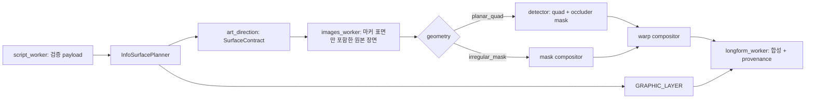

# Codex 작업지침서 — 장면 내재형 수치·글씨 합성 v2

- 작성일: 2026-07-25
- 대상: `backend/fastapi-workers`의 장면 지시, 이미지 생성, 수치 렌더, 롱폼 합성 계층
- 선행 문서: `CODEX_WORKORDER_DIEGETIC_INFO_SURFACE_V1.md`
- 배포 기본값: `DIEGETIC_WARP` 활성, `BAKED_LABEL` 비활성

## 1. 목표와 비목표

목표는 검증된 숫자와 한글이 **장면 위에 뜬 카드**가 아니라, 저울의 표찰·점검 클립보드·지도 위 구름·모니터·운송 태그처럼 장면 안의 물건에 실제로 쓰인 것으로 보이게 하는 것이다. 수치는 계속 수집/검증 payload만 사용한다.

이 작업은 다른 채널의 로고, 워터마크, 캐릭터, 고유 문구나 특정 프레임을 복제하지 않는다. 참고 대상은 16:9 카툰 경제 영상에서 관찰되는 정보 구조뿐이며, 캐릭터와 배경은 우리 채널의 노란 코인 캐릭터와 독자적인 2D 카툰 세계를 유지한다.

현재 예시의 실패는 다음 세 가지로 고정해서 다룬다.

1. 베이지 직사각형·시스템 폰트·기본 matplotlib 차트가 배경 카툰과 다른 그래픽 언어다.
2. 실제 표면의 위치·기울기·가림을 모른 채 축 정렬 사각형을 얹는다.
3. 모든 표면을 하나의 ‘보드’로 취급한다. 항만·저울·지도·연구실에 각각 어울리는 정보 매체가 달라야 한다.

## 2. 3가지 렌더 모드와 표면 기하 분리

| 모드 | 대상 | 기본 상태 | 합성 방식 |
| --- | --- | --- | --- |
| `DIEGETIC_WARP` | 한글 문구, 차트, 다자리 수치, 검증 설명 | 기본 사용 | 표면 검출 후 원근/질감/가림을 적용해 그 표면 내부에만 합성 |
| `GRAPHIC_LAYER` | 자막, 상단 제목, 반응 말풍선, 불규칙 구름 라벨 | 사용 | 카툰 타이포·불규칙 윤곽·충돌 회피를 적용한 투명 레이어 |
| `BAKED_LABEL` | 12자 이하의 짧은 영문/숫자 소품 각인 | 기본 비활성 | 이미지 모델 생성 + OCR 정확성 게이트, 실패 시 `DIEGETIC_WARP`/`GRAPHIC_LAYER`로 강등 |

`DIEGETIC_WARP` 표면은 반드시 아래 기하 유형을 먼저 선언한다. 이것이 v1의 `map_cloud`까지 사각 quad로 검출하려는 문제를 막는다.

| 기하 유형 | 표면 예 | P0 처리 |
| --- | --- | --- |
| `planar_quad` | 클립보드, 종이 태그, 계약서, 저울 표찰, 모니터, 점수표 | 색 마커 기반 quad 검출 + 원근 워프 |
| `irregular_mask` | 지도 구름, 말풍선, 버스트, 찢어진 종이 | 실루엣 마스크 안에만 평면 카툰 레이어. quad 워프 금지 |
| `curved_surface` | 우산, 금속 추, 원통형 컨테이너 | P0에서는 수치 본문 금지. `GRAPHIC_LAYER` 또는 P1 baked 검증 후만 허용 |

## 3. 현재 코드에서 교체할 경로

현재 경로는 `script_worker.py → art_direction.py → images_worker.py → longform_worker.py`다. `longform_worker._resolve_market_chart_surface()`가 검출 결과를 bbox로 축소하고 `_apply_market_chart_overlay()`가 FFmpeg `overlay=x:y`를 수행하므로, 기울기·체인 가림이 사라진다. 이 경로를 다음과 같이 교체한다.



**삭제 대상:** 데이터 차트에 대한 고정 `x/y/width/height` 사각형 카드 폴백. 표면 검출 실패 시 ‘대충 근처에 배치’하지 않는다. `GRAPHIC_LAYER`의 적절한 말풍선/라벨로 강등하고 이유를 기록한다.

## 4. 새 계약

신규 경로: `app/services/info_surface/contracts.py`

```python
class SurfaceContract(BaseModel):
    surface_kind: Literal[
        "monitor", "inspection_clipboard", "trading_ticket", "ledger_card",
        "desk_report", "product_label", "hanging_tag", "map_cloud"
    ]
    geometry: Literal["planar_quad", "irregular_mask", "curved_surface"]
    marker_rgb: tuple[int, int, int] | None  # planar_quad만 필수
    marker_delta_e_max: float = 12.0
    area_ratio_min: float = 0.06
    area_ratio_max: float = 0.30
    preferred_side: Literal["left", "right", "center"]
    tilt_hint: str
    inset_ratio: float = 0.06

class InfoItem(BaseModel):
    item_id: str
    role: Literal["metric", "chart", "label", "speech", "burst", "title", "subtitle"]
    text: str | None = None
    chart_payload_ref: str | None = None
    source_refs: list[str] = []

class InfoSurfacePlan(BaseModel):
    scene_id: str
    render_mode: Literal["DIEGETIC_WARP", "GRAPHIC_LAYER", "BAKED_LABEL"]
    surface: SurfaceContract | None = None
    items: list[InfoItem]
    fallback_chain: list[str] = []
    detection: dict | None = None
```

`art_direction.DATA_SURFACE_BY_FAMILY`는 문자열 설명만 반환하지 말고 위 계약을 함께 반환한다. 마커 색은 이미지 모델이 엄밀히 재현하지 못할 수 있으므로 RGB exact-match가 아니라 Lab ΔE 기준으로 검출한다. 마커는 형광색이 아니라 장면에 자연스러운 무광 크림/청회색/먹색이다.

## 5. P0 구현 순서

### 5.1 표면 계약과 프롬프트

수정 파일: `app/utils/art_direction.py`

- `monitor`, `inspection_clipboard`, `trading_ticket`, `ledger_card`, `desk_report`, `product_label`, `hanging_tag`, `map_cloud`에 `SurfaceContract`를 연결한다.
- 프롬프트는 ‘큰 빈 보드’ 대신 실제 소품을 요구한다. 예: `a blank matte cream hanging paper tag with dark brown hand-inked border, suspended from the scale pan, slightly tilted, no writing`.
- 생성 모델에는 읽을 한글·정확한 수치·차트를 요구하지 않는다. `BAKED_LABEL`만 화이트리스트된 짧은 ASCII 라벨을 예외로 한다.
- 서술 내용과 표면을 매칭한다. 물류=운송장/검사 태그, 지도/정책=지역 구름, 분석=책상 보고서, 매장=영수증/가격표, 시장=거래표, 공장=점검 클립보드. 소품의 인과관계가 없으면 정보 표면을 만들지 않는다.

### 5.2 검출기

신규: `app/services/info_surface/detector.py`

1. OpenCV로 BGR→Lab 변환 후 계약 마커와의 ΔE 맵을 만든다.
2. `ΔE < marker_delta_e_max` 마스크에 close/open morphology를 적용한다.
3. 외곽 contour를 `area_ratio`, 화면 측, 기대 위치로 필터한다.
4. `planar_quad`는 `approxPolyDP` 4점 또는 충분한 fill ratio의 `minAreaRect`만 승인한다.
5. 반환값은 정렬된 4점, 표면 마스크, 가림 마스크, 색 순도, 위치 점수, confidence다.

승인 기준은 `confidence >= 0.55`, 표면 면적 범위 충족, inset 후 가용 면적 60% 이상이다. 실패하면 `quad_not_found`, `surface_occluded`, `surface_too_small` 중 하나를 manifest에 기록하고 `GRAPHIC_LAYER`로 강등한다.

### 5.3 가림과 워프 합성

신규: `app/services/info_surface/warp_compositor.py`

- 논리 캔버스에는 **투명 배경**으로 한글·값·막대·축만 그린다. 크림색 사각 배경을 새로 만들지 않는다.
- quad의 테두리를 보존하도록 6% inset한 `quad_inset`에 `cv2.getPerspectiveTransform`/`warpPerspective`를 적용한다.
- `occluder_mask = quad_interior & (delta_e > threshold)`로 체인·손·포인터 같은 전경을 판정한다. 합성 알파는 `quad_interior & ~dilate(occluder_mask, 2px)` 안에서만 허용한다.
- 원본 표면의 L* 평균에 따라 잉크 명도를 보정하고, 고주파 종이/금속 질감을 15~25% soft-light로 글자 위에 다시 통과시킨다.
- 테두리 바로 안쪽에 3~5px 접촉 음영만 추가한다. 별도 드롭섀도 카드나 균일 라운드 테두리를 만들지 않는다.
- `irregular_mask`는 shape mask를 그대로 사용하고, 구름/버스트 내부의 text box는 윤곽 inset과 충돌 회피만 적용한다. 사각 투시 워프를 적용하지 않는다.

### 5.4 카툰 데이터 그래프

신규: `app/services/info_surface/channel_chart_style.py`, 수정: `app/utils/market_charts.py`

- matplotlib의 figure 배경·기본 축·기본 그리드를 제거한다. 출력은 RGBA 투명 PNG다.
- 막대, 축, 화살표, 값 라벨은 Black Han Sans 계열과 2~4px 잉크선으로 그린다. 글자 외곽선은 필요한 강조에만 최소로 사용한다.
- 한 표면에는 질문 하나만 둔다. 제목/값/의미는 3층으로 하되, 표면 크기에 따라 한 층을 생략할 수 있다.
- 비교값은 공통 기준과 단위를 표시하고, 시계열은 수집된 날짜 순서가 있을 때만 사용한다.
- 색은 장면의 팔레트에서 하나의 강조색만 쓴다. 단, 긍/부호 비교가 필요하면 상승·하락 두 색을 예외로 허용한다. 무지개색 범례와 네온 UI는 금지한다.

### 5.5 조립과 provenance

수정: `app/workers/longform_worker.py`, `app/workers/images_worker.py`

- `_apply_market_chart_overlay()`의 FFmpeg 직사각형 합성 경로를 신규 compositor가 만든 최종 RGBA 프레임 합성으로 바꾼다.
- 원본 장면, `InfoSurfacePlan`, quad 좌표, confidence, fallback chain, 렌더된 수치의 source refs를 씬 `metaJson`에 저장한다.
- 이전 생성 캐시의 fingerprint에는 `surface contract`, 검출 버전, chart style 버전을 포함한다. 이 값이 바뀌면 기존 축 정렬 카드 결과를 재사용하면 안 된다.

### 5.6 그래픽 레이어

수정: `app/services/bubble_overlay.py`, `app/services/overlay/editorial_overlay.py`

- 자막과 상단 타이틀은 정면 유지하되, 기타 한글 반응은 `speech`, `burst`, `cloud_label`, `wooden_sign`, `paper_note` 중 의미에 맞는 프리셋으로만 렌더한다.
- `paper_note`도 임의 공간에 떠 있게 쓰지 않는다. `DIEGETIC_WARP` 표면이 없고 장면상 소품을 만들 근거가 있을 때만 사용한다.
- 기존 플랫 `rounded_rectangle` 데이터 카드 호출은 금지한다. 자막 바는 예외다.

## 6. BAKED_LABEL (P1, 기본 비활성)

이 모드는 대표 승인 전까지 구현하거나 실행하지 않는다. 한글은 항상 금지한다. 허용 문자열은 `[A-Z0-9%$+.,\- ]`, 12자 이하, 소수 첫째 자리 이하, 씬당 최대 2개다.

1. 이미지 프롬프트에 검증 문자열만 리터럴로 주고, 그 외 텍스트/숫자는 금지한다.
2. Tesseract 영어 OCR로 요청 라벨 exact-match와 프레임 전체의 화이트리스트 외 숫자열을 검사한다.
3. 실패 시 한 번만 재생성하고, 다시 실패하면 텍스트 없는 `DIEGETIC_WARP` 씬으로 재생성한다.
4. 장면당 기대 재시도 계수 1.3을 예산에 반영한다. 동영상 상한 ₩40,000 초과 시 후보를 자동으로 Mode B로 강등한다.

## 7. 런타임 플래그

`app/runtime_config.py`에 다음 키를 추가한다.

```text
info_surface_enabled=true
info_surface_mode_default=diegetic
info_surface_quad_min_confidence=0.55
info_surface_texture_strength=0.20
info_surface_baked_enabled=false
```

`/pipeline/config`에서 변경 가능하되, `info_surface_baked_enabled=true`는 명시적 운영 승인 후에만 설정한다.

## 8. 필수 테스트

신규 fixture는 합성 이미지로 만들고, 외부 이미지 모델 호출 없이 결정론적으로 검증한다.

1. `test_info_surface_detector.py`: 기울기 0~25°, 좌/우 배치, 체인 가림을 포함한 20개 fixture에서 quad IoU ≥ 0.90, 가림 mask F1 ≥ 0.95.
2. `test_warp_compositor.py`: 종이 태그·클립보드·모니터·불규칙 구름의 골든 이미지. 원근·가림·알파 범위를 비교한다.
3. `test_info_surface_plan.py`: 한글/차트/긴 수치→Mode B, 말풍선/자막→Mode C, baked 플래그 off→Mode A 미선택을 검증한다.
4. 기존 `market_charts`, `validate_verbatim`, 단위 검증 전체 회귀를 유지한다. 렌더 전후 숫자/문자열은 payload와 byte-for-byte 동일해야 한다.
5. grep 게이트: 데이터 합성 경로에서 고정 베이지 카드의 `rounded_rectangle`/`shade.rectangle` 호출이 남으면 실패한다. 자막 바와 명시적 `paper_note`는 allowlist로 분리한다.

## 9. 완료 기준과 시연

P0 완료 시 다음 4개 장면을 실제로 생성/합성해 검수한다.

- 저울: 매달린 표찰에 기준값이 원근을 따라 쓰이고 체인이 표찰/글자 앞을 지나면 가린다.
- 항만: 컨테이너 검사 태그 또는 운송장에 비용 비교가 들어간다.
- 지도: 구름 라벨 안에 정책 수치가 들어가며, 사각 카드가 지도 위에 뜨지 않는다.
- 분석 책상: 보고서 종이 위에 차트가 들어가며, 종이의 기울기·질감이 글자에 전달된다.

사람 검수는 장면당 다음을 0~2점으로 평가한다: 소품 일체감, 가림 자연스러움, 원근 일치, 카툰 타이포 일관성, 수치 payload 일치. 평균 8/10 이상이고 ‘소품 일체감’ 또는 ‘수치 일치’가 0점이면 불합격이다.

## 10. 배포 순서

1. P0 코드·fixture·Docker OpenCV 의존성을 추가한다.
2. `python -m pytest backend/fastapi-workers/tests -q` 통과.
3. 워커와 프론트엔드 빌드 후 Docker 재기동, `/health` 및 `http://localhost:3000` 확인.
4. 실영상 1편의 8~12개 장면을 생성해 manifest의 모드 비율·검출 confidence·강등률·추가 비용을 기록한다.
5. P0 검수 통과 뒤에만 P1 baked OCR 게이트를 구현한다. 기본값은 계속 `false`다.
