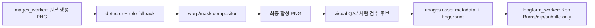

# Codex 작업지침서 보완 — Diegetic Info Surface v2.1

이 문서는 `CODEX_WORKORDER_DIEGETIC_INFO_SURFACE_V2.md`의 실행 보완본이다. v2의 평면/불규칙/곡면 기하 분리는 유지하되, 차트 강등·마커 오검출·합성 시점·Ken Burns·불규칙 표면 배치의 빈틈을 닫는다.

## A. 역할별 강등 계약 — 차트 정보는 사라지면 안 된다

`InfoSurfacePlan`에는 하나의 공통 `fallback_chain`만 두지 말고, 각 `InfoItem`의 역할별 강등 결과와 비용을 기록한다. `chart`를 일반 말풍선으로 바꾸는 것은 금지한다.

| 원래 역할 | 표면 검출 성공 | 검출/가림 실패 시 1차 강등 | 2차 강등 | 금지 |
| --- | --- | --- | --- | --- |
| `chart` | `DIEGETIC_WARP` 그래프 | `DATA_CUTAWAY`: 장면 전체를 쓰는 독립 카툰 데이터 인서트, 검증된 축·계열 유지 | `METRIC_SUMMARY`: 제목/핵심값/의미의 3층 요약, 원 차트 source ref 표시 | 말풍선에 축·계열을 압축, 무근거 재생성 |
| `metric` | 표찰/문서/모니터에 워프 | `GRAPHIC_LAYER`의 구름/버스트/소품 라벨 | 자막 바 위의 검증 metric chip | 임의 카드 배경 |
| `label` | 워프 또는 baked | 구름/나무 표지 그래픽 레이어 | 생략 가능(정보 중복일 때만) | 가짜 수치 |
| `speech`, `burst`, `title`, `subtitle` | `GRAPHIC_LAYER` | 충돌 없는 다른 슬롯 | 생략 | 이미지 모델 한글 생성 |

`DATA_CUTAWAY`는 비용 없는 재생성이 아니다. 기존 생성 장면을 다시 쓰지 않고, 검증 데이터 표면만을 중심으로 한 독립 1920×1080 카툰 데이터 프레임을 결정론적으로 렌더한다. 배경은 단색 UI가 아니라 해당 씬의 팔레트·종이결·소품 윤곽을 재사용한다. 따라서 원 차트와 값·축·단위는 유지되고, 캐릭터를 반드시 넣을 필요는 없다.

```python
FALLBACK_BY_ROLE = {
    "chart": ["DATA_CUTAWAY", "METRIC_SUMMARY"],
    "metric": ["GRAPHIC_LAYER_PROP", "CAPTION_METRIC"],
    "label": ["GRAPHIC_LAYER_PROP", "OMIT_IF_REDUNDANT"],
    "speech": ["RELOCATE", "OMIT"],
}
```

`InfoSurfacePlan.items[*]`에는 `requested_mode`, `resolved_mode`, `fallback_reason`, `fallback_cost_krw`를 남긴다. chart가 `METRIC_SUMMARY`로 축약되면 manifest에 `chart_semantics_reduced=true`를 기록해 반자동 검수에서 숨지 않게 한다.

## B. 마커 대비·다중 후보 검출 계약

v2의 `marker_rgb`는 검출 기준일 뿐, 장면과 충분히 분리되지 않으면 크림색 종이·양피지·포스터 중 잘못된 후보를 잡는다. `SurfaceContract`에 아래 항목을 추가한다.

```python
class SurfaceContract(BaseModel):
    # v2 필드 생략
    marker_scene_delta_e_min: float = 20.0
    border_rgb: tuple[int, int, int] | None = None
    border_delta_e_max: float = 18.0
    preferred_region: dict[str, float]  # normalized x/y/w/h
    candidate_iou_min: float = 0.30
```

### B.1 생성 전 색 선정

1. `art_direction`이 장면 팔레트의 지배색 3개를 선택한다.
2. 허용 표면색 후보(크림, 청회색, 무광 먹색, 옅은 황갈색) 중 모든 지배색과 CIEDE2000 ΔE ≥ 20인 색을 선택한다.
3. 같은 톤의 종이/포스터가 이미 핵심 소품으로 예정된 장면에서는 다른 허용 후보를 고른다. 조건을 만족하지 못하면 해당 씬은 워프 후보가 아니라 `DATA_CUTAWAY` 후보로 계획한다.
4. 프롬프트에는 표면 내부의 무광 marker 색과, marker와 다른 어두운 테두리를 함께 요구한다. 형광 키잉 색은 금지한다.

### B.2 검출 후 후보 선택

`detector.py`는 모든 contour 후보를 평가하고 최고 점수 하나만 승인한다. 점수는 다음과 같이 계산한다.

```text
score = 0.40 * color_purity
      + 0.20 * border_match
      + 0.25 * IoU(candidate_bbox, preferred_region)
      + 0.15 * area_score
```

- `border_match`는 marker contour 외곽 3~8px ring에서 `border_rgb`와의 ΔE를 평가한다.
- 다중 후보의 1·2위 점수 차가 0.08 미만이면 모호한 검출로 실패 처리한다.
- 후보가 자막 안전영역과 15% 초과로 겹치면 후보 탈락이다.

필수 fixture에는 **세피아 장면의 크림 표면 4개 이상**과, 우측에만 진짜 표면이 있는 경우를 포함한다. 허위 크림 포스터를 선택하면 테스트가 실패해야 한다.

## C. 합성 시점 — images_worker에서 최종 스틸을 확정한다

워프·가림 합성은 `longform_worker`가 아니라 `images_worker`의 이미지 품질 게이트 **직전**에 실행한다. 롱폼 조립 단계는 이미 합성된 PNG를 움직이고 자막/음성만 결합한다.



구체적인 변경:

1. `images_worker.py`에 `_apply_info_surface_plan(scene, image_path)`를 추가한다. 이는 원본 PNG를 읽고 detector → compositor → fallback을 수행한 뒤 **같은 최종 PNG**에 저장한다.
2. `visual_qa`와 이미지 승인 게이트는 `final_info_surface_path`를 입력으로 받아야 한다. 빈 태그 원본은 승인 대상이 아니다.
3. `longform_worker._apply_verified_market_chart_overlay()`와 `_apply_market_chart_overlay()`의 차트 카드 FFmpeg 합성은 제거한다. 기존 자산의 호환 경로는 `info_surface_plan`이 없을 때만 로그 경고와 함께 한 릴리스 유지한다.
4. asset metaJson에 `source_image_path`, `final_image_path`, `InfoSurfacePlan`, detector 버전, style 버전을 기록한다.
5. 이미지 캐시 fingerprint에 `info_surface_plan`, marker 계약, compositor 버전, chart style 버전을 포함한다.

## D. Ken Burns·인코딩 QA

워프 결과는 zoompan 이전의 최종 PNG에 구워야 한다. 영상 위에 좌표 고정 오버레이를 올리면 카메라가 배경만 움직여 다시 플랜카드처럼 보인다.

- `images_worker`가 워프를 끝낸 `final_image_path`만 scene clip의 입력으로 허용한다.
- 동일 transform(zoom/pan/rotate)은 표면과 글자에 함께 적용된다. longform 단계에서 정보 표면만 별도 transform하는 것은 금지한다.
- 1080p 최종 기준: 일반 한글 획은 최소 3px, 숫자/축의 가는 선은 최소 2px, 숫자 x-height는 최소 24px을 QA 하한으로 둔다.
- 크로마 서브샘플링 후에도 빨강/노랑의 얇은 글자가 번지지 않게, 작은 글자는 흰색/짙은 남색/검정 중 고대비 조합을 우선한다.
- `zoompan`은 정수/반정수 좌표 반올림과 단일 transform 체인을 사용한다. 합성 후 PNG의 표면 모서리와 텍스트 모서리의 상대 좌표가 프레임 3개 표본에서 1px 이상 달라지면 실패한다.

신규 QA: `test_info_surface_motion.py`에서 합성된 1080p PNG에 실제 zoompan 설정을 3프레임 적용하고, 작은 글씨의 connected-component 높이와 텍스트/표면 동시 이동을 측정한다.

## E. irregular_mask의 정확한 배치 규칙

`map_cloud`, `speech`, `burst`는 사각형이 아니다. mask 내부의 글자 상자를 임의로 가운데 놓지 않는다.

1. 후보 mask에서 하단 자막 밴드(기본 화면 하단 14%)를 먼저 뺀다.
2. `cv2.distanceTransform(available_mask)`를 계산한다.
3. distance map의 최대점에서 시작하여, mask 내부에 완전히 들어가는 최대 축 정렬 직사각형을 탐색한다.
4. text box는 그 직사각형의 82% 이내, 최소 여백은 mask local radius의 12%로 둔다.
5. 가용 면적이 글자 최소 크기를 만족하지 못하면 후보를 탈락시키고 역할별 fallback을 적용한다.

```python
def largest_inscribed_text_box(mask, subtitle_mask, min_font_px):
    available = mask & ~subtitle_mask
    distance = cv2.distanceTransform(available, cv2.DIST_L2, 5)
    # 최대 거리점에서 상자 확장; 모든 픽셀이 available인 최대 상자만 반환
    # min_font_px에 필요한 높이를 못 만들면 None
```

말풍선 꼬리는 캐릭터 bbox를 향해야 하며, 꼬리·글자·자막 밴드가 서로 겹치면 재배치 후에도 해결되지 않을 때만 생략한다.

## F. 예산·재생성·CI 게이트 완결

모든 실패는 비용/품질 로그에 남는다. ‘검출 실패 후 재생성’은 P0의 기본 동작이 아니다. P0은 비용 0인 deterministic fallback을 우선한다.

| 지점 | 기본 동작 | 추가 이미지 생성 | 예산 처리 |
| --- | --- | --- | --- |
| quad/mask 검출 실패 | 역할별 fallback | 없음 | ₩0 |
| 가림 면적 부족 | `DATA_CUTAWAY` 또는 `METRIC_SUMMARY` | 없음 | ₩0 |
| visual QA 불합격 | 해당 장면 검수 대기 | 없음 | ₩0 |
| P1 baked OCR 1차 실패 | 재생성 1회 | 최대 1회 | 기대계수 1.3 사전 반영 |
| P1 baked 2차 실패 | 텍스트 없는 Mode B로 강등 | 최대 1회 | P1 상한 내에서만 |

preflight는 `baked_candidate_count * image_generation_cost * 1.3`을 포함해 ₩40,000을 계산한다. 초과 시 baked 후보를 Mode B로 바꾸고 재견적한다. P0의 `DATA_CUTAWAY`은 새 이미지 API 호출이 아닌 결정론적 카툰 데이터 인서트이므로 이 계수에 넣지 않는다.

CI grep 게이트는 아래를 보장한다.

```powershell
# 자막 바와 명시적 그래픽 프리셋 allowlist 외의 데이터 플랫 카드는 금지
rg -n "_apply_market_chart_overlay|overlay=.*chart|rounded_rectangle" backend/fastapi-workers/app |
  Select-String -NotMatch "caption|subtitle|editorial_overlay|allowed_preset"
```

실제 CI는 단순 grep 대신 allowlist 파일로 구현한다. 구형 `_apply_market_chart_overlay()`가 호환 릴리스 뒤에도 남아 있으면 CI 실패다.

## G. v2.1 완료 조건

다음이 모두 만족되어야 P0을 완료로 표시한다.

1. 저울 장면에서 체인이 표찰과 글자 앞을 지나가며, 글자가 체인 뒤로 가려진 최종 PNG가 visual QA를 통과한다.
2. 크림 표면 4개 fixture에서 올바른 표면만 선택한다.
3. 차트 표면 검출 실패 시 `DATA_CUTAWAY` 또는 `METRIC_SUMMARY`가 생성되고, chart source refs가 metaJson에 남는다.
4. Ken Burns 3프레임 검사에서 글자와 표면의 상대 위치가 유지된다.
5. 최종 1080p 인코딩 후 모든 필수 글자의 획/높이 하한을 통과한다.
6. 전체 회귀 테스트, 기존 수치 검증, 예산 preflight, 구형 카드 경로 grep 게이트가 모두 통과한다.
