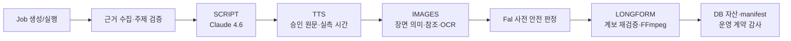

# 2026-08-20 이후 영상 파이프라인 공통 반영 감사

- 작성일: 2026-08-28 KST
- 대상: 2026-08-20 14:22 이후 현재까지의 시행착오·구현·실 API/오프라인 검증
- 운영 범위: 모든 주제, 신규/재개 Job, AUTO/GUIDED/MANUAL, 전체/단일 장면 생성
- 공통 계약 버전: `video-button-global-v1-20260828`
- 핵심 원칙: Job52와 scene 번호는 품질 기준과 회귀 fixture이며 운영 분기 조건이 아니다.

## 1. 결론

지금까지의 작업은 Job52 이미지를 몇 장 고치는 작업으로 끝내지 않았다. 확정된 결론은 영상 생성 버튼이 도달하는 공통 경계에 반영했고, 대본·TTS·이미지·조립 산출물에는 `operational_contract_audit`를 남기도록 했다. 따라서 앞으로는 새 주제에서도 다음을 DB 자산과 manifest에서 확인할 수 있다.

- 어떤 공통 계약 버전을 사용했는가
- 승인 대본과 TTS·자막·장면 의미가 이어졌는가
- 이미지가 공통 텍스트·사실·캐릭터·Fal 사전 게이트를 탔는가
- 조립이 같은 계약 버전과 승인 계보를 다시 검증했는가
- 수동 단일 장면 재생성이 전체 생성보다 느슨한 경로를 타지 않았는가

이번 감사에서 실제 운영 누락도 발견했다. UI의 단일 장면 재생성은 과거에 완전한 장면 메타데이터와 공통 QA를 건너뛰고 실패 시 Matplotlib 차트로 조용히 대체할 수 있었다. 이를 `ImagesWorker.generate_single_scene()`의 공통 운영 경로로 통합해, 실제 Gemini 요청·참조 계약·OCR·결정론 오버레이·최종 시각 QA·Fal 사전 판정까지 전체 생성과 같은 계약을 적용했다.

## 2. 감사 범위와 증거 한계

Git에는 2026-08-20~25의 작업이 개별 커밋으로 모두 분리돼 있지 않다. 당시 변경은 2026-08-26의 대형 기준 커밋 `6fa5e79`에 묶여 들어왔다. 따라서 “8월 20일부터”의 초기 과정은 다음 자료를 교차해 복원했다.

1. `DEVELOPER_HANDOFF_FULL_PIPELINE_2026-08-18.md`의 날짜별 최신 절
2. `docs/UNCOMMITTED_CHANGESET_SUMMARY_2026-08-26.md`
3. Job52/54 산출물 원장·콘택트시트·실제 payload/해시 증거
4. `6fa5e79` 이후의 red→green→evidence 커밋
5. 현재 UI→Spring→FastAPI→공급자→QA→조립 코드의 정적 추적과 회귀 테스트

따라서 초기의 모든 대화 문장을 그대로 역사적 사실로 단정하지 않고, 실제 코드·원장·테스트로 채택된 최종 결론만 운영 계약으로 분류했다.

## 3. 영상 생성 버튼이 타는 공통 경로

| 단계 | 실제 운영 경계 | 이번 감사에서 보장하는 것 |
|---|---|---|
| Job/Workflow | `JobNew.jsx`, `JobDetail.jsx`, Spring Gate/Service | AUTO/GUIDED/MANUAL과 재개 경로가 같은 단계 계약을 사용 |
| SCRIPT | `ScriptService` → `script_worker.py` | Claude 고정, 검증 사실/기사 근거, Flow QA, 내레이션 계약, 검수 필요 여부 |
| TTS | `TtsService` → `tts_worker.py` | 승인 원문·SHA-256, 실제 음성 길이, 자막 청크 품질/정렬 모드 |
| 전체 이미지 | `ImagesService` → `/workers/images/generate` → `ImagesWorker.generate()` | TTS 동기화, 장면 메타, 문구·수치·얼굴·표면 QA, Fal 사전 판정 |
| 단일 이미지 | `JobDetail` → Spring → `/workers/images/generate-single` → `generate_single_scene()` | 전체 메타 전달, 동일 프롬프트/참조/QA, 무음 차트 폴백 금지 |
| Gemini POST | `NanaBananaProvider._generate_gemini_api()` | 실제 전송 직전 얼굴/스타일 참조 의미 계약, payload hash, 요청 통제 |
| LONGFORM | `LongformService` → `longform_worker.py` | SCRIPT/TTS/장면 계보, 실제 모션 수, 출력 QC, 운영 계약 버전이 assembly fingerprint에 포함 |

Spring 응답 DTO도 네 단계의 `operational_contract_audit`를 보존한다. Python이 검사를 실행해도 Java가 알 수 없는 필드로 버리는 운영 단절을 막기 위한 조치다.

## 4. 항목별 시행착오와 최종 운영 반영

| 항목 | 초기 문제/잘못된 가설 | 실제 검증으로 확정된 결론 | 공통 운영 반영 | Job52에서 개선되는 예 | 상태 |
|---|---|---|---|---|---|
| 목표 시간·대본 분량 | 38단어 문장, 목표 글자 수만 맞추면 된다고 봄 | 같은 음성 설정의 실제 CPM과 최종 TTS 길이로 보정해야 함 | 목표 길이 계약, 실제 TTS 길이 fail-closed, 보정값 재사용 | 3:25 결과를 억지로 늘리지 않고 다음 5분 대본 자체를 적정 분량으로 생성 | 반영, 신규 5분 실측 E2E 필요 |
| 문장·자막·이미지 청크 | 문장/자막/이미지를 서로 나눔 | 승인 내레이션 원문과 TTS chunk가 장면 경계의 SSOT | 원문 SHA·청크·장면 계보를 이미지와 조립 직전 재검증 | 한 이미지가 지나치게 긴 38단어 설명을 떠안거나 자막과 다른 그림을 보이는 문제 차단 | 반영 |
| Job52 스타일 | “같은 얼굴·같은 진행자 의상”을 고정하려 함 | 만족한 것은 고정 구도가 아니라 편집 일러스트의 밀도·색감·비유·캐릭터 종 범위 | 주제별 맥락 참조 + 얼굴 범위 + 역할 기준점, 의상/배경/구도는 장면별 선택 | scene03/04/05/09/13/14의 얼굴 범위를 쓰되 새 장면의 복장과 장소는 복제하지 않음 | 공통 POST까지 반영, 실 API 표본 확대 필요 |
| 텍스트 정책 | 의사문자를 피하려고 무문자화를 시도 | 영어·한국어·숫자 자체가 문제가 아님. 대본/검증 사실에 있는 승인 정보는 정확히 보여야 함 | 정보 문자열은 정확 계약, 금융 수치는 Pillow/FFmpeg, 장식 문자는 짧은 승인 레인만 허용 | `KOSPI`, `PER 4배`, `영업이익 143조` 같은 정보는 유지하되 가짜 문자는 거절 | 반영 |
| Gold/Silver 오염 | 마스코트 색이나 모델 습관으로 추정 | `금`·`은` 한 글자 substring이 `현금`, `지금`, `기업은` 등에 걸린 엔티티 바인더 결함 | 독립 경계가 없는 금/은 엔티티 바인딩 금지 | scene02/03/12/46/47의 무관한 Silver, scene04/10/17/39의 Gold 오염 제거 | 반영 |
| 사실값 절단/확장 | OCR이 비슷하면 통과시킴 | `4배⊂14배`, `영업이익⊂비영업이익`, `143조⊂143조5000억` substring 검사가 근본 결함 | 숫자·날짜·단위를 완전 토큰으로 대조하고 값/단위 분리 형식만 명시적으로 허용 | 틀린 값이 정확히 렌더돼 최종 승인되는 조용한 금융 오류 차단 | 반영 |
| 최종 OCR | 전역 OCR 한 번이면 충분 | 축소/배경/도형/경계 때문에 정상 문자열도 누락·오독됨 | 표면별 bbox, 원본 해상도 로컬·겹침 타일, 역할별 PSM, exact match | scene35 `전망치`, scene47 `질문` 판독 회복; 접두/접미 의사문자 거절 | 반영, scene15 시각 QA 진행 중 |
| 물리 표면 | `has_surface=true` 같은 자체 선언을 신뢰 | 텍스트가 실제 단색/평면 표면에 놓였다는 픽셀 증거가 필요 | OpenCV quad/bbox/패딩/내부 분산 attestation | 글씨가 배경 위에 떠 있거나 도형과 겹치는 장면 차단 | 반영, 다양한 실사 배경 성공률 측정 필요 |
| 얼굴·캐릭터 | v1 참조가 맞는데 모델이 무시한다고 추정 | v1 자체가 승인 장면이 아닌 06/18/29로 구성됐고, 실제 POST에서 참조 역할 설명도 누락 | 승인 scene03/04/05/09/13/14 얼굴 v2 + POST 직전 의미 계약 | scene07의 검은 타원 눈, scene02/35의 경찰 인상, scene08 이질 얼굴 감소 | 코드 반영, 503로 실 API 최종 승인 미완 |
| 해부/소품 수 | 프롬프트를 간소화하면 안정된다고 봄 | 문자 제거 sanitizer가 소품 수와 얼굴 기준점까지 삭제할 수 있음 | 문자 토큰만 제거하고 팔 2개·소품 수·장면 객체 계약 보존 | scene11 세 번째 손, 두 칩/저울/생산라인 누락 방지 | 반영 |
| 말풍선 | 모든 텍스트 문제를 말풍선 금지로 해결 | 말풍선은 장면별 허용 정책이며, 갑작스러운 비승인 말풍선만 실패 | `bubble_policy`를 장면 메타로 전달하고 최종 OCR/시각 QA에서 검사 | scene47의 갑작스러운 말풍선 재발 차단 | 반영 |
| 이미지 재생성 | 개별 버튼은 편의 기능이라 느슨한 경로 사용 | 단일 재생성도 사용자가 받는 최종 자산이므로 전체 생성과 동일한 계약 필요 | 전체 `scene_meta` 전달, 공통 provider/QA/Fal preflight, 원자적 교체, Matplotlib 폴백 제거 | 고친 한 장만 전혀 다른 화풍/정보 구조가 되는 회귀 차단 | 이번 감사에서 반영 |
| Gemini 503 | 시간대/등급/우리 동시성만의 문제로 추정 | 공급자 high-demand 503이며 재시도 계층 중첩과 카운터 초기화는 우리 쪽 증폭 요인 | 단일 재시도 소유자, 영속 failure_n, jitter/cooldown, 명시 재도전, 공식 상태 attestation | scene21 47회 폭주 같은 비용·시간 낭비 차단 | 반영 |
| Gemini 비용 | 예약액을 실제 청구액처럼 사용, thinking 누락 | 예약·성공 응답 usage·청구 확정을 분리하고 thinking 토큰 포함 | usageMetadata 원문/파생 비용/예약을 원장에 분리 | 실패 이미지를 성공 비용으로 오해하지 않음 | 반영 |
| Fal 모션 | 화면 전체 zoom/jitter도 “움직임”으로 취급 | 수치·문자·그래프 표면은 절대 움직이면 안 되고 국소 대상만 허용 | 텍스트 잠금, 활성 타일/가장자리 변화, 카메라 고정, 모션 계획과 실제 전달 수 감사 | 전체 화면 지글링 대신 팔·캐릭터·컨베이어·조명 같은 국소 움직임만 후보 | 안전 경계 반영, 실제 자연스러움 검증 대기 |
| 조립/캐시 | 파일이 있으면 과거 조립을 재사용 | 계약이 바뀌면 과거 캐시를 새 계약 결과로 오인하면 안 됨 | 운영 계약 버전을 assembly fingerprint에 포함, 조립 직전 계보 재검증 | 수정 전 영상이 새 정책 통과본처럼 재사용되는 문제 차단 | 반영 |

## 5. Job52의 만족한 부분이 보존되는 방식

Job52에서 유지할 것은 특정 문구·복장·배경을 복사하는 것이 아니다.

- 장면마다 교실, 관제실, 시장, 실험실, 무대 등 공간이 달라지는 시각적 다양성
- 그래프만 띄우지 않고 저울·컨베이어·절벽·트로피·경보 같은 물리 비유를 쓰는 구성
- 밝은 금색 마스코트와 청색/적색/녹색 경제 정보 색조의 2D 편집 일러스트
- 정보 밀도가 있으면서 전경·중경·배경이 나뉘는 구도
- scene03/04/05/09/13/14에서 확인한 큰 갈색 홍채, 흰자, 이마 하이라이트, 완만한 눈썹의 얼굴 범위
- 장면 의미에 따라 정장·탐정·연구자·안전요원 등 의상이 달라지는 다양성

운영 코드는 이를 `select_contextual_reference_paths()`와 실제 Gemini POST 직전의 참조 역할 계약으로 적용한다. 따라서 반도체가 아닌 환율·금리·AI·무역 주제에서도 동일한 품질 문법을 사용하되, Job52의 `KOSPI 6860`이나 은 통 같은 사물을 무관하게 복제하지 않는다.

## 6. Job52의 불만족 부분과 현재 위치

| 관찰 | 현재 위치 |
|---|---|
| scene00/01처럼 숫자판만 얻은 듯한 조잡한 구성 | 의미형 장면/물리 비유/정보 표면 계약에 반영. 새로운 주제의 실 API 분포 검증 필요 |
| scene02/07/15/35/40의 오탈자·이탈자·의사문자 | exact text, 사실 토큰, 로컬 OCR, 비승인 문자 게이트 반영. scene15 시각 QA가 남음 |
| scene08/02/07/35 얼굴 차이 | v2 참조와 POST 계약 반영. 공급자 503 때문에 성공 이미지 2~3장 검증 미완 |
| scene11 손 3개 | 해부 계약과 최종 시각 QA에 반영. 다양한 포즈 실표본 필요 |
| scene47 갑작스러운 말풍선 | 장면별 bubble policy 및 겹침 타일 OCR 반영 |
| Gold/Silver·가짜 영문·가짜 수치 | 엔티티 경계, 승인 문자열, 결정론 수치 렌더에 반영 |
| Fal 전체 화면 지글링 | text-lock/local-motion 안전 계약 반영. Fal 실 API 자연스러움 검증은 정지 이미지 승인 뒤 진행 |

## 7. 세 가지 큰 목표와 현재 진행률

진행률은 기능 개수 비율이 아니라 “다양한 신규 주제의 실제 완성 영상으로 입증됐는가”를 포함한 보수적 추정이다.

### 목표 1 — YouTube 근거부터 5분 분량·TTS·자막·이미지 의미 동기화: 약 68%

- 완료/반영: Claude 4.6 고정, 검색/기사/검증 사실 계보, Flow QA, 실제 CPM 기반 길이 계약, 승인 원문 SSOT, TTS/자막/장면 해시, 조립 재검증
- 왜 했는가: 팩트가 맞아도 음성 길이와 이미지 경계가 어긋나면 자막이 설명하는 대상과 화면이 달라지기 때문
- 남음: 서로 다른 주제의 신규 약 5분 Job을 SCRIPT→TTS→IMAGES까지 실행해 실제 길이와 의미 싱크를 반복 입증

### 목표 2 — Fal의 자연스러운 국소 모션: 약 38%

- 완료/반영: 텍스트·수치·그래프 잠금, 카메라/가장자리 지글링 차단, 안전한 캐릭터·사물·배경 후보, 계획/전달 수 감사
- 왜 했는가: 틀린 정지 이미지나 정보 표면을 움직이면 오류가 더 커지고, 화면 전체 지글링은 의미 있는 모션이 아니기 때문
- 남음: 승인된 정지 이미지로 1분 파일럿에서 팔·컨베이어·조명 등 국소 움직임의 자연스러움을 실 API 검증

### 목표 3 — 이미지 의미·화풍·텍스트·수치·캐릭터 정확성: 약 82%

- 완료/반영: Gold/Silver 경계, 정확 사실 토큰, 결정론 수치, 표면별 OCR, 물리 표면, 얼굴 v2, 해부/소품/말풍선, 단일 재생성 경로, 공급자 요청 통제
- 왜 했는가: Job52 실패들은 하나의 “프롬프트가 나쁨”이 아니라 서로 다른 계층의 계약 결함이었기 때문
- 남음: scene15 의사문자, 실제 v2 얼굴 성공 표본, 다양한 배경의 물리 표면 성공률, 다주제 이미지 분포 검증

목표 1은 목표 3의 입력 경계를 정하고, 목표 3을 통과한 정지 이미지가 목표 2의 전제다. 따라서 순서는 `대본/TTS/자막 싱크 → 정지 이미지 승인 → Fal → 조립`이며, 결과를 빨리 보기 위해 이 순서를 뒤집지 않는다.

## 8. 이번 감사의 red→green 증거

### 8.1 단일 장면 운영 우회

- red `ffd8130`: 전체 scene metadata 없음, 공통 worker 메서드 없음, Matplotlib 폴백 존재 — 3 failed
- green `cbe75f8`: 전체 메타·provider audit·OCR·결정론 overlay·최종 QA·Fal preflight 통합 — 집중 FastAPI 89 passed, Spring 이미지 서비스 6 passed
- 결과: 전체 생성과 단일 장면 재생성의 품질 계약이 하나로 합쳐짐

### 8.2 단계별 공통 계약 감사

- red `4484687`: 공통 감사 레지스트리가 없어 테스트 수집 단계에서 실패
- green: SCRIPT/TTS/IMAGES/LONGFORM 결과와 TTS/assembly manifest, Spring DTO에 공통 계약 버전과 실행 판정 보존
- 조립 fingerprint에도 계약 버전을 넣어 과거 캐시와 구분

### 8.3 최종 회귀

- FastAPI 전체 오프라인: 1,115 passed, 1 deselected, 0 failed
- Spring 전체: 54 passed, 0 failed
- Python 변경 파일 `py_compile`: 통과
- 제품 코드 특정 번호 분기 검색: `job_id == 52` 및 문제 scene 번호 운영 분기 0건
- `git diff --check`: 통과

증거 파일은 `docs/evidence/wo_pipeline_globalization_20260828/`에 보존한다.

## 9. 운영 판정 기준

앞으로 어떤 개선도 다음 조건을 모두 충족해야 “실제 파이프라인 반영”으로 표시한다.

1. 개별 Job 문제인지 공통 문제인지 입력/해시/인접 장면/새 Job 증거로 분류한다.
2. 특정 번호 분기 없이 가장 이른 공통 경계에 구현한다.
3. 신규·재개, 자동·수동, 전체·단일 경로를 모두 추적한다.
4. 선행 실패와 수정 후 회귀가 있다.
5. 실제 단계 자산 또는 manifest에 적용 계약과 판정이 남는다.
6. 공급자/비용/품질 특성에 비례해 실제 API 또는 E2E로 검증한다.
7. 실패를 조용히 폴백하거나 게이트를 낮춰 성공처럼 만들지 않는다.

이 기준은 루트 `AGENTS.md`의 `공통 운영 반영 강제 원칙`에도 영구 작업 규칙으로 추가했다.

## 10. 다음 작업

1. scene15 의사문자와 다양한 물리 표면을 오프라인으로 보완한다.
2. 허용된 Gemini canary를 중간에 섞되, 공급자 200과 품질 통과를 별도 판정한다.
3. v2 얼굴·정보 표면·OCR가 통과한 뒤 서로 다른 주제의 신규 약 5분 Job을 실행한다.
4. 정지 이미지 승인 후 1분 Fal 파일럿, 그 다음 전체 조립을 검증한다.
5. 각 신규 Job의 DB 자산에서 `operational_contract_audit.version == video-button-global-v1-20260828`와 단계별 `checks`를 확인한다.

이번 감사 자체에서는 유료 API, TTS, Fal, MP4 조립을 실행하지 않았다.
