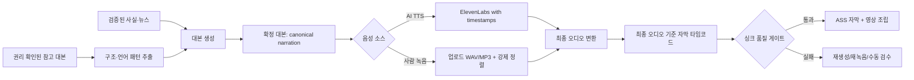

# 개발자 공유: TTS 자연스러움 · 자막 싱크 · 대본 패턴 분석 개선안

> 작성일: 2026-07-27  
> 대상: 최근 1분 테스트 영상에서 제기된 `목소리의 AI스러움`, `TTS-자막 싱크 불일치`, `초반 후킹/재미 부족` 피드백  
> 원칙: 사실·수치·출처는 검증된 데이터 경계를 넘지 않으며, 특정 채널의 문장·말투·브랜딩을 복제하지 않는다. 영상 1건 총비용은 ₩40,000 이하를 유지한다.

## 결론과 우선순위

영상의 사용 가능 여부를 좌우하는 것은 이미지보다 **내레이션과 자막**이다. 다음 순서로 처리한다.

1. **즉시 테스트:** 현재 TTS의 불필요한 문장별 무음 삽입을 끄고, 한 명의 한국어 화자/한 가지 속도/한 가지 짧은 대본으로 음성 A/B 테스트를 한다.
2. **출고 차단:** 최종 오디오를 기준으로 자막 오프셋을 측정하고, 기준을 넘으면 영상 조립을 실패 처리한다. 현재의 “자막이 존재함” 검사는 실제 싱크 오차를 판정하지 못한다.
3. **사람 녹음 경로 추가:** 지인의 실제 녹음 파일을 `TTS_AUDIO`와 동일한 메타데이터 계약으로 수용한다. 이 경로가 가장 자연스럽고, 타임코드 생성은 강제 정렬(forced alignment)로 처리한다.
4. **대본 병행 개선:** 경제사냥꾼·지식 한입을 “그대로 따라 쓰는” 대신, 허가/출처가 확보된 샘플에서 후킹·전환·반전·결말의 **추상 패턴**만 점수화해 자체 하우스 스타일에 반영한다.



## 1. 현재 구현 구조

### 1.1 전체 데이터 흐름

| 단계 | 현재 구현 | 산출물/책임 |
| --- | --- | --- |
| 대본 | `backend/fastapi-workers/app/workers/script_worker.py` | 검증된 사실을 바탕으로 `[대사]` 중심의 스크립트와 씬을 생성한다. 길이는 음성별 분당 문자수(CPM) 계약으로 맞춘다. |
| 대본 전달 메타데이터 | `app/utils/script_delivery.py` | Hook/Context/Twist/Resolution 구간, 감정·편집 힌트, `text_for_tts`를 붙인다. 이 단계는 원문을 재작성하지 않는다. |
| TTS 요청 | `app/workers/tts_worker.py` | `[대사]`만 추출하고 숫자/금융 약어의 낭독용 표기를 전처리한다. 화면 대본 표기는 유지한다. |
| AI 음성 | ElevenLabs `/with-timestamps` | 오디오와 문자별 시작/끝 타임코드를 한 번의 응답으로 받는다. 현재 기본 모델은 `eleven_v3`이다. |
| 자막 큐 | `TtsWorker._extract_timestamps_from_elevenlabs_response()` | 원본 표시용 텍스트를 16자 기준으로 분할하고, 제공된 문자 타임코드에 매핑한다. 실패 시 Forced Alignment → stable-ts → faster-whisper → 글자수 비례 순서로 폴백한다. |
| 영상 조립 | `app/workers/longform_worker.py` | TTS의 `chunks`로 ASS 자막을 만들고 FFmpeg로 최종 MP4에 입힌다. |
| 품질 리포트 | `app/utils/quality_gate.py`, `app/utils/output_qc.py` | 자막 범위/공백/길이, 오디오 길이, 첫 문장·선행 무음 등을 기록한다. |

Spring Boot는 `TtsService`에서 확정 SCRIPT 에셋의 씬 본문만 이어 붙여 TTS에 전달하고, 반환된 `audio_path`, `chunks`, 품질 메타데이터를 `TTS_AUDIO` 에셋으로 저장한다. Longform 조립은 이 메타데이터를 다시 FastAPI에 전달한다.

### 1.2 현재 대본 스타일 구현

`app/utils/script_style.py`의 `original_finance_storyteller_v1`이 유일한 허용 스타일이다. 현재 구현은 특정 채널을 직접 모사하지 않고 다음을 요구한다.

- 첫 10%: 시청자의 상황/긴장/질문으로 시작
- 중간: “무슨 일이 있었나 → 왜 그랬나 → 해석이 바뀌는 조건”을 교대
- 후반: 관찰 사실과 해석을 분리하고, 매수·매도 지시 대신 확인할 조건 제시
- 끝: 처음 질문으로 돌아와 다음 확인 포인트를 남김

또한 대본 품질 리포트는 훅 유무, 전환어 수, 수치의 의미 설명, 마지막 모니터링 포인트를 신호로 점검한다. 즉, `경제사냥꾼`이라는 내부 스타일 믹스 이름이 일부 남아 있지만, 현재는 해당 채널의 대본 코퍼스·문체 임베딩·직접 모사 기능이 연결되어 있지 않다.

## 2. 진단: 왜 목소리가 어색하게 들릴 수 있는가

실제 테스트 영상의 오디오/메타데이터가 이 문서에 첨부되지는 않았으므로 단일 원인을 확정할 수는 없다. 다만 현재 코드에서 아래 항목은 재현·검증 우선순위가 높다.

| 위험 지점 | 코드상 관찰 | 청감 영향 | 조치 우선순위 |
| --- | --- | --- | --- |
| 문장마다 추가 무음 | `TTS_SENTENCE_PAUSE_MS=350`, `TTS_PARAGRAPH_PAUSE_MS=400`이 기본값이고 0보다 크면 FFmpeg로 무음을 삽입한다. | 문장 끝이 매번 과하게 끊겨 뉴스 낭독기/AI 같은 리듬이 된다. | P0 |
| 3문장 단위 강제 그룹 | `_soften_korean_delivery_cadence()`가 문장 마침표 일부를 쉼표로 바꾼다. | 논리 단위와 무관하게 쉼·강세가 바뀔 수 있다. | P0 |
| 모델 한도 불일치 가능성 | 코드의 v3 단일 요청 상한은 8,000자지만, 공식 문서는 Eleven v3의 입력 한도를 5,000자로 표시한다. | 긴 대본에서 400 오류, 분할, 폴백 또는 문단 간 톤 단절 위험이 있다. | P0 |
| 기본 화자 고정 | UI placeholder가 전달되면 고정된 기본 voice ID로 해석된다. | 채널에 맞지 않는 음색/억양을 반복 사용할 수 있다. | P1 |
| TTS 후 MP3 재인코딩 | 속도 변경, 무음 삽입, 마스터링, 선행 무음 추가가 합성 뒤에 수행된다. | 인코더 지연과 변환 순서가 타임코드 기준점과 달라질 수 있다. | P1 |
| 감정 제어의 실제 적용 범위 | v3 자연 모드에서만 태그를 허용하고, 본문은 대부분 태그 없이 처리한다. | 훅·반전·결론의 대비가 약하고 평평하게 들릴 수 있다. | P1 |

### 2.1 즉시 적용할 AI TTS 설정 실험

먼저 코드를 바꾸기 전에 `/pipeline/config`의 런타임 값으로 아래 두 세트를 같은 45~60초 확정 대본에 적용하고, 동일 청취자 3명 이상에게 블라인드 평가를 받는다. 이 값들은 프로세스 메모리 설정이므로 컨테이너 재시작 시 환경변수 기본값으로 돌아간다.

| 항목 | A: 자연스러운 기본안 | B: 약간 더 또렷한 정보 전달안 | 공통 원칙 |
| --- | --- | --- | --- |
| `tts_speed` | `0.98`~`1.00` | `1.03`~`1.06` | 1.10 이상으로 후처리 가속하지 않는다. |
| `tts_sentence_pause_ms` | `0` | `0` | 제공자 자체 호흡을 우선한다. |
| `tts_paragraph_pause_ms` | `0` | `0` | 문단 전환은 대본의 문장·쉼표·씬 구성으로 만든다. |
| `tts_postprocess_enabled` | `true` | `true` | 마스터링은 유지하되, 최종 파일 기준 재정렬을 추가한다. |
| `tts_stability_intro/body` | `0.5 / 0.5` | `0.5 / 0.5` | v3의 허용 값만 사용한다. 임의 실수값을 넣지 않는다. |
| 화자 | 한국어 학습/사용 이력이 확인된 단일 후보 | 다른 단일 후보 | 한 영상 안에서 화자를 섞지 않는다. |

평가 문항은 “사람이 읽은 것처럼 들리는가”, “문장 끝이 끊기는가”, “숫자/영문 약어가 자연스러운가”, “첫 10초가 평평한가” 네 가지로 고정한다. ElevenLabs 공식 문서도 모델별 특성을 구분한다. v3는 표현력이 강하지만, Multilingual v2는 긴 형식에서 가장 안정적이라고 안내하므로, 긴 영상은 같은 화자/같은 대본으로 `eleven_v3`와 `eleven_multilingual_v2`를 실제 비교해야 한다. [ElevenLabs TTS 모델 안내](https://elevenlabs.io/docs/overview/capabilities/text-to-speech)

### 2.2 사람 녹음 파일을 받을 경우의 권장 경로

사람 녹음은 가장 추천하는 품질 경로다. 현재 저장 구조에는 외부 녹음 업로드 전용 API가 없으므로, 지금은 AI TTS를 생성해야만 `TTS_AUDIO` 에셋이 만들어진다. 아래 기능을 추가한다.

1. 확정 대본의 버전 ID와 SHA-256 해시를 먼저 고정한다. 대본이 바뀌면 녹음/자막도 무효화한다.
2. `POST /api/jobs/{jobId}/narration-upload`를 추가한다. 파일, 대본 버전, 화자 동의/사용 권한 확인값을 받는다.
3. 원본은 보관하고, FFmpeg로 작업용 WAV(48 kHz 또는 44.1 kHz PCM, mono/stereo 허용)를 만든다. MP3를 여러 번 재인코딩하지 않는다.
4. 확정 대본과 **최종 작업용 오디오**를 Forced Alignment에 넣어 단어/문자 타임코드를 생성한다. 발화 누락·추가·순서 변경 시 CER/WER 게이트를 실패시킨다.
5. AI TTS와 동일하게 `audio_path`, `total_duration`, `chunks`, `voice_source: "human_upload"`, `alignment_source: "forced_alignment"`, `script_sha256`, `quality_report`를 `TTS_AUDIO` 메타데이터에 저장한다.
6. Longform은 음성의 출처를 몰라도 동일한 `chunks`로 ASS를 생성한다. 이로써 사람 녹음과 AI TTS의 영상 조립 경로가 하나가 된다.

녹음 가이드: 대본을 변경하지 않고, 문단 사이에 0.3~0.6초 정도만 자연스럽게 쉰다. 숫자·회사명·약어의 읽는 법이 애매하면 대본 옆에 **낭독 메모**를 별도 제공한다. 낭독 메모는 화면 자막에 표시하지 않는다. 녹음자의 명시적 동의·이용 범위·철회 절차는 파일 메타데이터와 별도 계약으로 남긴다.

## 3. 자막과 TTS 싱크: 현재 방식과 보완 설계

### 3.1 현재 방식

현재 ElevenLabs 경로는 `/v1/text-to-speech/{voice_id}/with-timestamps`를 사용한다. 이 응답에는 `audio_base64`와 원문/정규화 원문 문자별 alignment가 포함되므로, 재전사보다 정확한 1차 타임라인 소스다. [ElevenLabs Create speech with timing](https://elevenlabs.io/docs/api-reference/text-to-speech/convert-with-timestamps)

기본 성공 경로는 다음과 같다.

```text
확정 대본(화면 표기)
  → 낭독용 숫자·약어 전처리
  → ElevenLabs 오디오 + 문자별 타임코드
  → 표시용 원문을 16자 내외 cue로 분할
  → 문자 타임코드에 cue를 매핑
  → ASS 자막 생성
  → 최종 MP4에 오디오·ASS 결합
```

실패 시 Forced Alignment, stable-ts, faster-whisper, 글자 수 비례 순으로 대체한다. 마지막 글자 수 비례 방식은 “자막이 아예 없는 것”보다 낫지만, 숫자·영문 약어·쉼 구간에서 실제 말소리와 다를 수 있으므로 출고용으로 허용하면 안 된다.

### 3.2 싱크가 틀어질 수 있는 구조적 이유

- 제공자 타임코드는 합성 직후 오디오 기준이다. 이후 속도 변경, 무음 삽입, MP3 재인코딩, 선행 무음 추가가 있으면 **최종 오디오 기준 타임라인**과 달라질 수 있다.
- 화면 자막은 원문 표기(`52,300포인트`, `FOMC`)를 유지하지만, 음성은 발음용 표기(`오만 이천삼백 포인트`, `에프오엠씨`)를 쓴다. 현재 매핑은 전처리된 글자 수를 이용하지만, 문장 단위가 아닌 cue 단위의 실제 경계 검증은 없다.
- ASS는 TTS `chunks`를 직접 사용하지만, 씬 길이는 cue/씬 간 문자수 비율로 다시 보간한다. 따라서 자막보다 이미지·오버레이 전환이 말의 실제 논리 단위와 어긋날 수 있다.
- 현재 `assess_subtitles()`는 커버리지, 0.5초 초과 공백, cue 길이만 검사한다. **실제 발화 대비 자막 시작/끝 오차(ms)**는 측정하지 않는다.
- ASS/BGM 합성 실패 시 안전 폴백 경로는 자막 없는 영상도 만들 수 있다. `has_subtitles=false`가 단순 메타데이터로 남지 않도록 출고 게이트에서 막아야 한다.

### 3.3 목표 아키텍처: 최종 오디오 단일 기준

원칙은 간단하다. **자막 타임코드는 항상 최종 영상에 들어갈 오디오 파일에서 한 번 확정한다.**

1. 대본의 `canonical_display_text`와 `tts_spoken_text`를 명시적으로 분리해 함께 저장한다.
2. TTS/사람 녹음으로 원본 오디오를 만든다.
3. 속도·선행 무음·마스터링·BGM을 제외한 내레이션 변환을 모두 완료한다. 가능하면 중간 포맷은 WAV/PCM으로 유지한다.
4. 변환이 시간축을 바꾸면 정확한 변환 ledger를 적용한다. 시간축이 불확실한 변환이 있거나 사람이 녹음한 경우에는 **변환이 끝난 최종 내레이션**을 Forced Alignment로 다시 정렬한다.
5. Alignment의 단어/문자 타임코드에서 1~2줄 cue를 만든다. cue 분할은 글자수뿐 아니라 조사·숫자·호흡·문장 종결을 존중한다.
6. ASS, 씬 전환, 효과 텍스트 모두 같은 `timeline.v1.json`만 사용한다. 각 소비자가 각자 문자수 비례 시간을 계산하지 않는다.
7. 최종 MP4를 디코드해 자막 시간과 오디오 음성 구간의 오프셋을 측정한 뒤, 기준 미달이면 `PREVIEW_PENDING`으로 보내지 않는다.

권장 `timeline.v1.json` 최소 형태:

```json
{
  "script_sha256": "...",
  "audio_sha256": "...",
  "audio_duration_ms": 61234,
  "source": "elevenlabs_native_alignment",
  "transforms": [{"kind": "leading_silence", "milliseconds": 200}],
  "cues": [
    {
      "id": "cue-001",
      "display_text": "금리가 내려가면 주식은 무조건 오를까요?",
      "spoken_text": "금리가 내려가면 주식은 무조건 오를까요?",
      "start_ms": 200,
      "end_ms": 3080,
      "confidence": 0.98
    }
  ]
}
```

### 3.4 출고 품질 게이트

다음은 초기 운영 기준이다. 실제 A/B 결과를 2주 수집한 뒤 조정한다.

| 항목 | 통과 기준 | 실패 시 처리 |
| --- | --- | --- |
| 자막 존재 | ASS가 생성되고 FFmpeg 렌더링 성공 | 자막 없는 폴백 MP4를 출고하지 않음 |
| 타임라인 출처 | `elevenlabs_native_alignment` 또는 최종 오디오 Forced Alignment | stable-ts/Whisper/글자수 비례는 검토용 표시, 자동 출고 금지 |
| 자막 시작 오차 | p95 ≤ 120 ms, 최대 ≤ 250 ms | 최종 오디오 재정렬 → 재렌더 |
| 자막 끝 오차 | p95 ≤ 160 ms, 최대 ≤ 300 ms | cue 재분할 또는 재정렬 |
| 텍스트 일치 | canonical 대본 대비 CER/WER 기준 충족, cue 누락/중복 0 | TTS 재생성 또는 사람 녹음 재요청 |
| 총 길이 | 내레이션/영상 길이 차이 ≤ 0.2초 | 영상 패딩/조립 재실행 |
| 수동 샘플 | 첫 15초, 숫자/약어 구간, 마지막 15초 | 검수자가 음성·자막·화면 전환을 동시에 확인 |

검증 도구는 다음을 저장해야 한다.

- `tts_text_diff.log`: 원문, 추출 내레이션, 낭독용 전처리 텍스트
- `timeline.v1.json`: 최종 cue 타임라인과 출처
- `alignment_report.json`: CER/WER, cue별 start/end 오차, p50/p95/max
- `subtitles.ass`와 비교용 SRT/VTT
- 최종 오디오/MP4의 SHA-256 및 `ffprobe` duration

## 4. 구현 작업 목록

### P0 — 다음 테스트 영상 전

1. `TTS_SENTENCE_PAUSE_MS=0`, `TTS_PARAGRAPH_PAUSE_MS=0`으로 설정하고, `_soften_korean_delivery_cadence()`의 강제 3문장 그룹도 feature flag로 끈다.
2. `eleven_v3` 입력 분할 상한을 공식 문서 한도에 맞춰 5,000자로 낮추거나, 긴 내레이션에는 `eleven_multilingual_v2`를 선택하는 명시적 정책을 둔다. 추측으로 8,000자를 계속 사용하지 않는다.
3. `/with-timestamps` 성공 후에는 문자수 비례 자막 폴백으로 출고하지 않는다. 네이티브 alignment 실패 시 최종 오디오 Forced Alignment를 수행하고, 그것도 실패하면 TTS 게이트로 되돌린다.
4. `has_subtitles=false`, `alignment_source=fallback_ratio`, `subtitle_quality.score<100`인 결과는 자동 확정하지 않는다.
5. 1분 고정 대본으로 AI 화자 2명 + 사람 녹음 1개를 생성해 A/B/C 평가한다. 화자/모델/속도/전처리 옵션/점수를 한 CSV에 기록한다.

### P1 — 사람 녹음과 최종 오디오 재정렬

1. 사람 녹음 업로드 API, 권한 동의 필드, 바이러스 검사/파일 크기 제한, 원본·정규화 파일 보관 정책을 구현한다.
2. `NarrationAsset` 또는 기존 `TTS_AUDIO.metaJson`에 `voice_source`, `script_sha256`, `alignment_source`, `alignment_confidence`, `timeline_path`를 추가한다.
3. 모든 시간축 변경 후 final narration WAV에 Forced Alignment를 수행한다. AI TTS의 native alignment와 재정렬 결과가 모두 있으면 차이를 로그로 남기고 기준을 넘을 때만 재정렬 결과를 채택한다.
4. `_assign_scene_durations_from_chunks()`의 문자수 보간을 cue 경계 기반 씬 매핑으로 교체한다. 대본/씬 생성 시 `scene_id → canonical character range` 또는 `cue_ids`를 저장해 비율 추정을 없앤다.
5. 재생성 버튼이 대본/오디오/타임라인 중 무엇을 무효화하는지 명확히 한다. `caption_only` 편집은 오디오 타임라인을 바꾸지 않는 별도 오버라이드로 유지한다.

### P2 — 운영·관측성

1. Job 화면에 `음성 소스`, `화자`, `모델`, `속도`, `정렬 출처`, `p95 오차`, `자막 수`, `출고 가능 여부`를 표시한다.
2. 10초 미리듣기를 훅/숫자·약어/결말 세 구간으로 제공한다.
3. 샘플 20건에 대해 사람 평가와 자동 오차를 쌓아, 어떤 화자·모델·대본 길이에서 실패하는지 대시보드화한다.
4. TTS 실패 시 다른 화자·gTTS·무음으로 조용히 바꾸지 않는다. 현재 ElevenLabs 키가 있을 때 다른 엔진 폴백을 막는 방향은 유지하고, UI에 재시도 원인을 보여 준다.

## 5. 대본: 잘된 영상의 구조를 반영하는 안전한 방법

### 5.1 “학습”과 “패턴 분석”을 병행하는 방식

추천 방식은 모델 재학습보다 먼저, 20개 내외의 참고 대본을 **구조화된 편집 데이터**로 바꾸는 것이다. 이유는 작은 코퍼스로는 모델 파인튜닝보다 명시적 체크리스트·few-shot 예시가 통제와 검증이 쉽기 때문이다.

각 참고 영상에서 원문 표현을 보관하더라도 생성 프롬프트에는 그대로 넣지 않는다. 다음처럼 추상 특성만 추출한다.

| 항목 | 추출 예시 | 생성에 쓰는 방법 |
| --- | --- | --- |
| 첫 3초 훅 | 질문/반전/손실 회피/통념 반박 중 무엇인가 | 주제별 훅 유형을 선택하되, 문장은 새로 쓴다. |
| 정보 공개 순서 | 결론 지연 여부, 첫 근거가 나오는 시점 | 0~8%에 긴장, 8~25%에 최소 배경을 둔다. |
| 미니 루프 | 질문 → 근거 일부 → 조건/반전 → 답 | 1분에는 2~3회, 롱폼에는 약 2~3분마다 배치한다. |
| 문장 리듬 | 짧은 강조문과 설명문의 비율 | 6~18자 강조문 뒤 25~55자 설명문을 섞는다. |
| 전환 장치 | “그런데”, 비교, 예외 조건, 시간 점프 | 같은 전환어를 연속 사용하지 않도록 제한한다. |
| 재미 요소 | 비유, 일상 상황, 예상 뒤집기 | 검증된 사실의 의미를 설명할 때만 사용하고, 공포 조장/과장 예측은 금지한다. |
| 결말 | 체크할 지표/다음 질문 | 매수·매도 지시 대신 조건부 확인 포인트로 끝낸다. |

### 5.2 1분 숏폼 구조 제안

현재 4단계(Hook/Context/Twist/Resolution)는 유효하지만, 1분에는 더 촘촘한 전환이 필요하다.

| 시간 | 역할 | 반드시 포함할 것 |
| --- | --- | --- |
| 0~3초 | 훅 | 통념과 실제의 차이 또는 시청자가 바로 답하고 싶은 질문 |
| 3~10초 | 약속 | 이 영상을 보면 판단할 수 있는 한 가지를 제시 |
| 10~25초 | 첫 근거 | 숫자 하나 + 그 숫자가 중요한 이유 |
| 25~40초 | 반전/예외 | “하지만 이 조건이면 해석이 달라진다” |
| 40~52초 | 실전 프레임 | 시청자가 다음에 볼 지표/시점 |
| 52~60초 | 회수 | 처음 질문에 답하고 다음 영상으로 자연스럽게 연결 |

생성 검수 기준은 다음으로 추가한다.

- 첫 3초 안에 질문·대조·손실/기회 중 하나가 있는가?
- 8초 내에 “왜 끝까지 봐야 하는지”가 설명되는가?
- 20초 안에 첫 번째 검증 근거가 있는가?
- 적어도 한 번은 해석을 바꾸는 조건/반전이 있는가?
- 같은 접속어와 문장 종결이 3회 이상 연속되지 않는가?
- 대본의 모든 수치·날짜·인과관계가 검증된 사실 묶음에 있는가?

### 5.3 법적·품질 경계

- 특정 채널을 이름으로 지정해 “똑같이 써라”, 특정 대본의 문장을 바꾸어 쓰라, 고유한 말버릇/오프닝을 재현하라는 프롬프트는 사용하지 않는다.
- 참조 대본은 권리자 허가, 자체 제작, 또는 이용 범위가 확인된 자료만 사용한다. 원문을 장기 저장하거나 외부 모델에 전송하기 전에는 별도 법무 확인이 필요하다.
- 출력 후에는 n-gram/의미 유사도 검사로 참조 원문과의 과도한 중복을 막고, 유사도가 높으면 새로 생성한다.
- 참고 채널의 성과 데이터는 “이 구조가 그 영상의 성공 원인”이라는 인과 증명이 아니다. 조회수·업로드 시점·주제·썸네일·채널 규모를 함께 기록해 가설로만 사용한다.

## 6. YouTube API 키와 참고 스크립트 제공 방식

### 답변

**YouTube Data API v3 키만으로는 경제사냥꾼·지식 한입 같은 제3자 채널의 실제 자막/스크립트를 자동 추출하는 기능을 만들 수 없다.**

- API 키로는 채널/영상의 공개 메타데이터, 검색 결과, 통계, 댓글 등은 수집할 수 있다. 현재 저장소의 `trending.py`도 이 목적의 `search.list`, `videos.list`, `channels.list`, `commentThreads.list`만 사용한다.
- `captions.list`는 자막 트랙 목록만 돌려주며 실제 자막 본문은 포함하지 않는다. [YouTube Captions: list](https://developers.google.com/youtube/v3/docs/captions/list)
- 실제 자막 다운로드는 OAuth 권한(`youtube.force-ssl` 또는 `youtubepartner`)을 요구한다. 공개 영상이라도 API 키 단독으로 제3자 자막을 가져오는 경로로 보면 안 된다. [YouTube Captions: download](https://developers.google.com/youtube/v3/docs/captions/download)
- API 사용 및 API 데이터 이용에는 YouTube API 서비스 약관·개발자 정책을 따라야 한다. [YouTube API Services Terms](https://developers.google.com/youtube/terms/api-services-terms-of-service)

따라서 참고 대본은 다음 중 하나로 받는 것을 권장한다.

1. **권장:** 권리/이용 범위를 확인한 대본을 사람이 `CSV`, `JSONL`, `Markdown`으로 제공한다.
2. 자사 소유 채널이라면 OAuth 연결 후 해당 채널의 caption track을 공식 API로 가져온다.
3. 권리자가 영상 파일과 분석 허가를 제공한 경우에만 내부 STT로 전사하고, 이 파일은 패턴 분석 목적과 보관 기간을 제한한다.

권장 업로드 형식(JSONL 예시):

```json
{"source_id":"econ-001","source_url":"https://www.youtube.com/watch?v=...","rights_basis":"internal_review_or_permission","format":"short","duration_sec":58,"title":"...","transcript":"...","notes":"첫 3초 반전형 훅"}
```

이 데이터에서 생성 파이프라인이 저장/사용할 값은 다음처럼 최소화한다.

```json
{"source_id":"econ-001","hook_type":"belief_reversal","hook_seconds":2.8,"first_evidence_seconds":11.4,"open_loops":2,"twist_count":1,"transition_types":["contrast","condition"],"closing_type":"watch_metric"}
```

원문 대본을 생성 모델에 넣는 대신, 두 번째 JSON 같은 패턴 카드와 사내에서 승인한 **완전히 새로 쓴** 예시만 프롬프트에 사용한다.

## 7. 테스트 및 수용 기준

### 7.1 회귀 테스트

- ElevenLabs native alignment이 있는 경우, ASS cue 시작/끝이 leading silence·속도 변환·무음 변환 후에도 최종 오디오 기준으로 맞는지 테스트한다.
- 문장별 무음이 0일 때에도 자연 호흡이 제거되지 않는지 오디오 파형/청취 샘플로 확인한다.
- 숫자(`52,300`, `16.5`, `%`), 약어(`FOMC`, `ETF`), 영문 회사명, 질문문, 문단 전환을 포함한 대본 fixture를 둔다.
- 5,000자 경계, 모델별 입력 한도, 긴 대본 분할 후 청크 간 타임라인 연속성을 테스트한다.
- 사람이 녹음한 오디오에서 대본 누락·순서 변경·추가 발화를 넣어 alignment gate가 실제로 실패하는지 테스트한다.
- ASS 렌더 실패 시 자막 없는 MP4가 성공 결과로 반환되지 않는지 테스트한다.

### 7.2 사람 검수 체크리스트

- 첫 문장 첫 음절과 첫 자막이 동시에 시작하는가?
- 자막이 말보다 먼저/늦게 보이는 cue가 있는가? 숫자·약어 cue에서 특히 확인한다.
- 문장 끝의 호흡이 자연스러운가, 0.35초 단위로 규칙적으로 끊기는가?
- 한 cue가 끝나기 전에 다음 cue가 겹치거나 0.5초 이상 비는가?
- 대본의 훅이 호기심을 만들고, 15~40초 구간에 새로운 정보/반전이 있는가?
- 결말이 확인할 조건을 남기되 과장된 투자 권유로 끝나지 않는가?

## 8. 파일별 수정 후보

| 파일 | 변경 방향 |
| --- | --- |
| `backend/fastapi-workers/app/config.py` | 문장/문단 무음 기본값을 0으로 조정하고, v3 입력 한도를 검증된 사양으로 분리한다. |
| `backend/fastapi-workers/app/runtime_config.py` | cadence feature flag, alignment 출고 임계값, 사람 녹음 정렬 설정을 추가한다. |
| `backend/fastapi-workers/app/workers/tts_worker.py` | 최종 오디오 기준 alignment, 명시적 fallback 상태, transform ledger, 원문/낭독문 매핑을 구현한다. |
| `backend/fastapi-workers/app/workers/longform_worker.py` | 문자수 비례 씬 시간 배정을 cue/대본 범위 기반으로 교체하고, ASS 실패를 출고 실패로 처리한다. |
| `backend/fastapi-workers/app/utils/quality_gate.py` | coverage뿐 아니라 cue별 오프셋, alignment 출처, 출고 차단 판정을 추가한다. |
| `backend/spring-app/.../TtsService.java` | 사람 녹음 업로드 결과도 `TTS_AUDIO` 계약으로 저장하도록 확장한다. |
| `backend/spring-app/.../LongformService.java` | 사람 녹음 업로드/재정렬 후의 TTS 메타데이터를 동일 경로로 전달한다. |
| `backend/fastapi-workers/app/workers/script_worker.py` | 참고 패턴 카드 선택, 1분용 미니 루프 검증, 유사 문구 차단을 추가한다. |
| `backend/fastapi-workers/app/utils/script_style.py` | 채널 모사 없이 승인된 자체 패턴 프로필과 정량 QA를 추가한다. |

## 9. 의사결정 요청

개발 착수 전 다음 세 가지만 확정하면 된다.

1. 다음 테스트는 AI TTS A/B만 할지, 지인 녹음까지 포함한 A/B/C로 할지
2. 사람 녹음 파일의 사용 권한·보관 기간·삭제 정책
3. 참고 대본 20개에 대한 권리/이용 범위와 제공 형식(JSONL 권장)

그 외에는 P0 설정 변경과 싱크 출고 게이트부터 독립적으로 진행할 수 있다.

## 부록 A. 관련 실제 코드 파일

아래는 이 문서에서 설명한 기능의 실제 구현 파일이다. `...` 축약 경로는 사용하지 않는다.

| 역할 | 실제 파일 |
| --- | --- |
| TTS 합성, ElevenLabs 타임코드, 발음 전처리, 폴백 정렬 | `backend/fastapi-workers/app/workers/tts_worker.py` |
| 스크립트 생성, 검증 사실 경계, 길이 계약 적용 | `backend/fastapi-workers/app/workers/script_worker.py` |
| 하우스 스타일 가이드 및 스토리텔링 QA | `backend/fastapi-workers/app/utils/script_style.py` |
| Hook/Context/Twist/Resolution 메타데이터와 감정 힌트 | `backend/fastapi-workers/app/utils/script_delivery.py` |
| 대본-음성 길이 계약 및 음성별 CPM 보정 | `backend/fastapi-workers/app/utils/script_length.py` |
| 숫자·약어의 낭독용 한국어 변환 | `backend/fastapi-workers/app/utils/korean_tts.py` |
| 금융 용어 ElevenLabs 발음 사전 | `backend/fastapi-workers/app/workers/pronunciation_manager.py` |
| 문장 경계 보존 분할기 | `backend/fastapi-workers/app/utils/sentence_splitter.py` |
| 자막/이미지 품질 게이트와 품질 리포트 저장 | `backend/fastapi-workers/app/utils/quality_gate.py` |
| 최종 MP4 오디오·첫 문장·자막 관련 출력 QC | `backend/fastapi-workers/app/utils/output_qc.py` |
| ASS 자막 생성, 씬 시간 배정, 롱폼 FFmpeg 조립 | `backend/fastapi-workers/app/workers/longform_worker.py` |
| FastAPI TTS/스크립트/런타임 설정 엔드포인트 | `backend/fastapi-workers/app/main.py` |
| 컨테이너 시작 기본값과 TTS/자막 환경변수 | `backend/fastapi-workers/app/config.py` |
| 무중단 런타임 TTS/자막 파라미터 상태 | `backend/fastapi-workers/app/runtime_config.py` |
| YouTube 공개 메타데이터·통계·댓글 수집 | `backend/fastapi-workers/app/providers/real/trending.py` |
| Spring TTS 에셋 저장 및 TTS 게이트 | `backend/spring-app/src/main/java/com/pipeline/video/service/TtsService.java` |
| Spring 스크립트 생성·확정·SCRIPT 에셋 저장 | `backend/spring-app/src/main/java/com/pipeline/video/service/ScriptService.java` |
| Spring 롱폼 조립 요청 및 재조립 처리 | `backend/spring-app/src/main/java/com/pipeline/video/service/LongformService.java` |
| FastAPI 호출 클라이언트 | `backend/spring-app/src/main/java/com/pipeline/video/service/FastApiClient.java` |
| TTS 응답 DTO와 자막 청크 DTO | `backend/spring-app/src/main/java/com/pipeline/video/dto/TtsGenerateResponse.java`, `backend/spring-app/src/main/java/com/pipeline/video/dto/TtsChunkDto.java` |
| TTS 오디오 에셋 타입 정의 | `backend/spring-app/src/main/java/com/pipeline/video/domain/AssetType.java` |
| TTS 타임코드 회귀 테스트 | `backend/fastapi-workers/tests/test_tts_timing.py` |
| 최종 출력 TTS 메타데이터 QC 테스트 | `backend/fastapi-workers/tests/test_output_qc_tts_metadata.py` |
