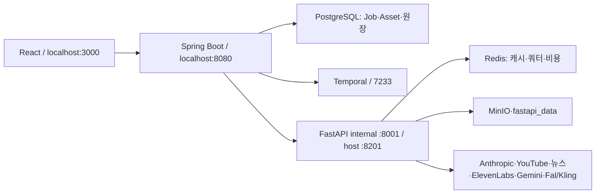

# Video Pipeline 개발자 업무 인수인계서

- 작성일: 2026-08-18 KST
- 저장소: `https://github.com/sth00619/video_pipeline.git`
- 브랜치: `main`
- 제품 코드 기준 커밋: `04a6e78b96fdbb02260a133ee703791f1aaf65e8`
- 기준 영상: `final plan/final (6).mp4` / Job 181 품질을 **최저 품질선**으로 사용
- 현재 자동 테스트 기준: FastAPI `679 passed, 0 failed, 13 warnings`; Spring `51 passed, 0 failed`; Frontend production build 성공
- 대상 독자: 기존 대화 기록 없이 다른 노트북에서 개발을 이어받는 개발자 또는 Codex

> 이 문서는 2026-08-18 현재 상태의 단일 핸드오프 문서다. 과거 문서는 배경 자료이고,
> 실제 작업 전에는 반드시 `AGENTS.md`, 현재 코드, 현재 테스트를 다시 읽는다. 이 문서에
> 적힌 Job 번호는 재현 사례이지 Job 전용 분기 조건이 아니다. 모든 수정은 앞으로 생성될
> 모든 영상에 적용되는 공통 계약이어야 한다.

> **2026-08-28 운영 경로 갱신:** 아래 2026-08-18 시점의 “즉시 이어서 할 작업”보다
> `docs/PIPELINE_PRODUCTION_INTEGRATION_CONTRACT_2026-08-28.md`를 우선한다. Job52와
> scene02/07/35/47은 회귀 fixture일 뿐이며, 얼굴·텍스트·수치·OCR·Fal 안전 수정은
> UI 영상 생성 버튼이 타는 신규 Job/재개/병렬/순차/단일 장면 공통 경로에 적용한다.
> 특히 얼굴 참조 의미 계약은 파일럿 래퍼가 아니라 실제 Gemini POST 직전 계층에
> `job52-range-v2-operational-v1` 버전으로 연결돼 있다.

---

## 1. 가장 먼저 읽을 결론

이 프로젝트의 큰 개선 목표는 다음 세 가지이며, **한 번에 섞어서 처리하지 않는다.**

1. **YouTube 기능 개선**
   - YouTube 검색, 쿼터, 롱폼 필터, 레퍼런스 채널, 후보 점수, 뉴스 근거 계보를 고쳤다.
   - 이 작업은 현재 **스크립트 근거·품질 게이트 개선**으로 이어져 있다.
   - 구조 구현은 상당 부분 끝났지만, 실제 신규 Job에서 YouTube 점수·23개 언론사 기사 URL·
     검증 사실·주제 일관성·Flow QA를 동시에 통과하는 최종 E2E가 아직 남아 있다.
   - 따라서 목표 1은 **완료 선언 금지** 상태다.
2. **Fal/Kling 모션 개선**
   - 텍스트·숫자·기사·그래프·정보 표면에는 Fal을 적용하지 않는 fail-closed 안전 게이트가 구현됐다.
   - 남은 방향은 숫자/텍스트가 없는 캐릭터나 사물의 표정·신체·배경 움직임을 자연스럽게 만드는 것.
   - 안전 게이트를 제거하거나 우회하면서 자연스러움을 높이면 안 된다.
3. **이미지의 숫자·텍스트 오탈자/이탈자 제거**
   - 생성 모델에 정확한 금융 숫자·한글을 맡기지 않고, `verified_facts`에서 Pillow/FFmpeg로
     결정론적으로 합성하는 기반은 있다.
   - 그러나 최종 프레임의 OCR·철자·숫자 대조와 잘못된 배경 글자 재생성까지 묶은 전용 작업은 아직 남아 있다.

현재 즉시 이어서 할 작업은 **WO-Script-09-B: Flow QA 반복 문장 수리**다. 그 다음 실제
신규 5분 GUIDED Job을 SCRIPT 승인 직전까지만 실행해 목표 1의 최종 E2E를 판정한다.
TTS·이미지·Fal·영상 조립은 이 E2E 범위에 포함하지 않는다.

---

## 2. SSOT와 충돌 해결 순서

문서나 코드가 서로 다를 때 다음 우선순위를 사용한다.

1. 루트 `AGENTS.md`의 안전·범위 규칙
2. 현재 `main` 코드와 자동 테스트
3. 이 핸드오프 문서
4. `final plan/` 및 `docs/`의 과거 설계 문서
5. 과거 채팅 설명

현재 확인된 충돌은 숨기지 않는다.

### 2.1 예산 상한 충돌

- `AGENTS.md`: 20분 미만 4만원, 20분 이상 7만원
- 현재 `PricingConfig.java`: 20분 미만 4만원, 20분 이상 8만원
- 일부 과거 문서와 `.env.example`도 7만원/8만원이 혼재한다.

새 노트북에서 임의로 어느 한쪽을 고치지 않는다. 별도 정책 WO에서 SONG의 최종 결정을 받은 뒤
`AGENTS.md`, `PricingConfig.java`, FastAPI 상한, `.env.example`, UI 문구, 테스트를 한 번에 정렬한다.
결정 전 실제 운영은 더 보수적인 7만원을 넘기지 않는다.

### 2.2 자격증명처럼 보이는 기본값

`docker-compose.yml`과 `.env.example`에 실제 키처럼 보이는 Finnhub 기본값이 남아 있었으며,
이번 인계 문서 커밋에서 빈 placeholder로 제거했다.
이 문서에는 값을 복사하지 않았다. 새 노트북에서는 해당 값을 신뢰하거나 재사용하지 말고:

1. 공급자 콘솔에서 기존 키를 회전한다.
2. 실제 키는 로컬 `.env` 또는 비밀 관리 도구로만 주입한다.
3. 과거 키는 공급자 콘솔에서 회전하고 Compose와 `.env.example`은 계속 빈 placeholder로 유지한다.

---

## 3. 절대 작업 원칙

### 3.1 기존 파이프라인을 리셋하지 않는다

- Job 181이나 `final (6).mp4`에만 맞춘 조건문을 만들지 않는다.
- Job 181은 공통 파이프라인의 품질 하한을 판단하는 레퍼런스다.
- 새 기능은 기존 단계의 대체가 아니라 입력/출력 계약과 안전 게이트를 추가하는 방식으로 구현한다.
- 수정 파일을 열기 전에 직전 단계 입력, 현재 단계 출력, 다음 단계 소비 필드를 모두 확인한다.
- 제품 코드 변경 없이 테스트 기대값만 바꾸는 경우에는 실제 제품 계약과 SSOT가 맞다는 증거가 필요하다.

### 3.2 대본·TTS·자막의 단일 기준

- 승인된 SCRIPT의 내레이션 원문이 TTS와 자막의 SSOT다.
- 표시 줄바꿈 외에 문자, 숫자, 단위, 문장 순서를 바꾸지 않는다.
- `narration`, `script`, `text_for_tts`, 과거 `content/text` 입력을 인식하는 기존 폴백을 제거하지 않는다.
- TTS 속도 기본값은 `0.9`, 문장 쉼은 `350ms`, 문단 쉼은 `400ms`다.
- 자막은 문자 비율 임의 보간이 아니라 TTS chunk 경계에 스냅한다.

### 3.3 금융 사실과 수치

- LLM은 금융 숫자를 새로 만들거나 바꾸지 않는다.
- YouTube는 주제 수요·관심도·포맷 문맥용이지 금융 사실의 검증원이 아니다.
- 금융 수치는 뉴스 원문, 공시, 거래소, 중앙은행 등 추적 가능한 근거에서 온다.
- `verified_facts=[]`인데 대본에 금융 수치가 있으면 hard-fail한다.
- `contradiction_detected=true` 사실은 `verified_facts`에서 제외하고 `suspect_facts`에 감사용으로 보존한다.
- 화면 숫자는 `verified_facts` 원문에 그대로 존재해야 하며 Pillow/FFmpeg가 렌더링한다.

### 3.4 실패 처리

- API/파싱/OCR/품질 검사 실패를 mock이나 저품질 폴백으로 조용히 통과시키지 않는다.
- `used_real_llm=false` SCRIPT는 승인 불가다.
- `flow_qa.passed=false` 또는 `requires_manual_review=true` SCRIPT는 AUTO도 자동 확정하지 않는다.
- SCRIPT 에셋이 없거나 품질 필드가 불충분하면 UI 승인 버튼도 노출하지 않는다.
- Fal 안전 OCR을 실행할 수 없거나 실패하면 모션을 허용하지 않는다.

### 3.5 범위 제한

- SCRIPT E2E를 검증할 때 TTS·이미지·Fal·조립을 실행하지 않는다.
- Fal을 고칠 때 승인 대본, TTS, 자막 계약을 바꾸지 않는다.
- 이미지 문자/숫자를 고칠 때 일반형 이미지, V5, archetype, 캐릭터 스타일을 전역 교체하지 않는다.
- 현재 작업과 무관한 dirty file은 되돌리거나 커밋하지 않는다.

---

## 4. 현재 실행 구조



### 4.1 서비스와 포트

| 서비스 | 컨테이너 | 호스트 포트 | 비고 |
|---|---|---:|---|
| Frontend | `pipeline_frontend` | 3000 | Nginx가 Spring `/api`로 프록시 |
| Spring | `pipeline_spring` | 8080 | 공개 헬스는 `/api/health` |
| FastAPI | `pipeline_fastapi` | 8201 | 컨테이너 내부는 8001 |
| PostgreSQL | `pipeline_postgres` | 5432 | Job/Asset/비용 원장 |
| Redis | `pipeline_redis` | 6379 | 캐시·YouTube 쿼터 |
| MinIO | `pipeline_minio` | 9000/9001 | 객체 저장/콘솔 |
| Temporal | `pipeline_temporal` | 7233 | Workflow gRPC |
| Temporal UI | `pipeline_temporal_ui` | 8233 | Workflow 조회 |

`/actuator/health`는 Spring Security 때문에 인증 없이 `401`이 정상이다. 로컬 공개 헬스는
`http://localhost:8080/api/health`를 사용한다.

### 4.2 기준 런타임

| 계층 | 현재 호스트 | Docker 기준 |
|---|---|---|
| Docker Engine | 28.0.4 | 동일 |
| Docker Compose | 2.34.0 Desktop | Compose v2 사용 |
| Python | 3.13.5 | `python:3.12-slim`이 실제 FastAPI 기준 |
| Java | Corretto 17.0.7 | builder JDK17, runtime `amazoncorretto:17-alpine` |
| Gradle | wrapper 8.14.5 | Docker builder 이미지 표기는 8.7-jdk17, wrapper가 실제 빌드 수행 |
| Node | 22.17.0 | Frontend builder `node:20-alpine` |
| npm | 10.9.2 | Docker build를 재현 기준으로 우선 |

호스트 버전을 억지로 맞추기보다 Docker 이미지를 사용한다. 단, MinIO가 `latest`, 일부 Python
의존성이 `>=` 범위이므로 장기적으로 lock/digest 고정이 필요하다.

주요 프레임워크:

- FastAPI 0.115.0, Uvicorn 0.32.0, Pydantic 2.9.2, Anthropic SDK 0.40.0
- Spring Boot 3.5.1, Temporal Spring Boot Starter 1.32.0, Java 17
- React 18.3, React Router 6.28, React Query 5.62, Vite 5.4, Tailwind 3.4

---

## 5. 실제 Workflow 순서와 게이트

`VideoPipelineWorkflowImpl`의 현재 순서는 다음과 같다.

```text
Job 생성
  → KEYWORD 검색·후보 저장
  → KEYWORD 승인 대기
  → SCRIPT 생성
     └─ 근거 부족이면 TOPIC_EVIDENCE_REQUIRED로 돌아가 새 KEYWORD 승인 대기(최대 5회)
  → SCRIPT 승인 대기
  → GUIDED이면 TTS voice 선택/TTS 게이트 선승인
  → TTS 생성
  → AUTO이면 TTS 승인 대기
  → IMAGES 생성
  → IMAGES 승인 대기
  → 롱폼 조립
  → PREVIEW 승인 대기
  → 완료
```

주요 상태 전이:

- KEYWORD 승인 → `SCRIPT_PENDING`
- SCRIPT 승인 → `TTS_PENDING`
- TTS 승인 → `IMAGES_PENDING`
- IMAGES 승인 → 조립/미리보기 단계

Spring `GateService`는 DB 커밋 뒤 Temporal signal을 보내도록 설계돼 있다. Job 184에서 보였던
DB/Temporal 불일치는 SCRIPT 에셋 없이 UI 승인이 가능했던 것이 직접 원인이며, 현재 UI 품질
게이트로 해당 경로를 막았다.

---

## 6. 단계별 현재 계약

### 6.1 KEYWORD / YouTube / 뉴스 후보

FastAPI 핵심:

- `app/providers/real/trending.py`
- `app/workers/keyword_worker.py`
- `app/utils/candidate_scoring.py`
- `app/workers/news_keyword_extractor.py`

Spring 핵심:

- `KeywordService.java`
- `KeywordItemDto.java`
- `FastApiClient.java`

현재 계약:

- `recent_hours=None`은 최근 7일(168시간)로 정규화한다.
- `search.list`는 공유 10,000-unit 원장과 분리된 일일 100-call Redis 버킷으로 센다.
- 롱폼 검색은 `videoDuration=long`과 `medium` 두 번 호출해 병합한다.
- 병합 후 `duration_seconds >= 240`만 유지하며 video ID로 중복 제거한다.
- 한국 카테고리는 `regionCode=KR`, `relevanceLanguage=ko`; US_STOCKS는 `US/en`을 유지한다.
- 후보의 YouTube 근거 연결은 LLM이 다듬은 키워드가 아니라 원본 영상 제목까지 사용한다.
- 최근 영상 표본이 10개 이상이면 채널 최근 평균 조회수의 1.5배를 outperformer 기준으로 사용한다.
- 표본이 부족하면 기존 tiered ratio 기준으로 폴백한다. large-channel 경로는 독립 계약을 유지한다.
- 후보 점수와 SCRIPT 뉴스 수집 모두 `outlet_filter=True`를 사용해 같은 23개 언론사 기준을 공유한다.
- 후보 dict는 `news_articles`, `source_videos`, `evidence_video_ids`, `youtube_score`, `evidence`를 보존한다.

승인된 금융 언론사 23개:

`연합뉴스, 뉴스1, 뉴시스, 한국경제, 매일경제, 조선비즈, 이데일리, 머니투데이,
파이낸셜뉴스, 헤럴드경제, 서울경제, 아시아경제, 인베스트조선, 글로벌이코노믹,
비즈워치, 조선일보, 중앙일보, 동아일보, 한국일보, 전자신문, 뉴스핌, 더벨, 한국금융신문`

`sports.chosun.com`은 명시적으로 제외한다. `biz.chosun.com`을 `chosun.com`보다 먼저 판정해
조선비즈가 조선일보로 잘못 표시되지 않게 한다.

### 6.2 SCRIPT

핵심 파일:

- `backend/fastapi-workers/app/workers/script_worker.py`
- `backend/spring-app/src/main/java/com/pipeline/video/service/ScriptService.java`
- `backend/spring-app/src/main/java/com/pipeline/video/dto/ScriptGenerateResponse.java`
- `frontend/src/pages/JobDetail.jsx`

현재 입력 계보:

```text
선택 KEYWORD 후보
  ├─ news_articles (제목·URL·언론사·발행시각)
  ├─ source_videos / evidence_video_ids / youtube_score
  ├─ evidence (뉴스 건수·출처·시장 지표)
  └─ market_snapshot
       ↓ Spring ScriptService
candidate_evidence + market_snapshot
       ↓ FastAPI ScriptWorker
23개 언론사 재검색 + 후보 근거 병합 + Claude 생성/검증
       ↓ SCRIPT Asset
verified_facts / suspect_facts / fact_check_summary / news_articles /
source_ref / source_videos / news_cross_check_status / flow_qa /
used_real_llm / requires_manual_review / llm_call_count / llm_provider_log
```

현재 안전 계약:

- Claude 모델은 `claude-sonnet-4-6` 고정이다.
- Claude 호출 실패 시 mock SCRIPT로 통과시키지 않고 hard-fail한다.
- verified facts JSON은 원본 → trailing comma 제거 → 닫는 괄호 보완 순으로 복구한다.
- 세 단계 파싱이 모두 실패하거나 최상위가 list가 아니면 RuntimeError다.
- 모든 모순 사실은 `suspect_facts`로 분리하며 clean `verified_facts`에서 제외한다.
- 검증 사실이 없는데 금융 숫자가 있으면 RuntimeError다.
- `flow_qa.passed=false`는 AUTO/GUIDED와 무관하게 `requires_manual_review=true`다.
- AUTO도 `requires_manual_review=true`이면 `confirm()`을 호출하지 않고 `SCRIPT_PENDING`에 남는다.
- UI는 SCRIPT 에셋이 있고 `used_real_llm=true`, `requires_manual_review!=true`일 때만 승인 버튼을 허용한다.
- 주제 범위 검사는 복합 키워드 분해와 별칭을 사용하고 단일 15% 문단 기준을 쓴다.
- YouTube 근거는 주제/관심도 문맥에만 사용하며 금융 숫자 검증 출처로 쓰지 않는다.
- SCRIPT 저장·confirm 재조립·Longform 재조립의 세 경로 모두 감사 필드를 보존한다.

### 6.3 TTS와 자막

핵심 파일:

- `app/workers/tts_worker.py`
- `app/tts/forced_alignment_srt.py`
- `app/workers/longform_worker.py`
- Spring `TtsService.java`

보호해야 할 완료 계약:

- `TTS_SPEED=0.9`
- `TTS_SENTENCE_PAUSE_MS=350`
- `TTS_PARAGRAPH_PAUSE_MS=400`
- 승인 내레이션과 TTS 입력·자막 텍스트가 동일해야 한다.
- 빠르게 이어 읽지 않도록 문장 사이 잡음을 제거하고 짧은 쉼을 유지한다.
- 자막 cue는 너무 짧거나 길지 않도록 단어/문자 정렬 결과를 읽기 단위로 묶는다.
- 씬 경계는 임의 mid-subtitle 컷이 아니라 TTS chunk 경계에 스냅한다.
- 현재 SCRIPT E2E 작업 중에는 이 단계에 진입하지 않는다.

### 6.4 이미지 / V5 / archetype

핵심 파일:

- `app/workers/images_worker.py`
- `app/v5/scene/runtime_contract.py`
- `app/v5/scene/prompt_builder.py`
- `app/v5/scene/verified_overlay_planner.py`
- `app/v5/overlay/diegetic_fact_overlay.py`
- `app/services/verbatim_guard.py`
- `app/services/info_surface/*`

보호해야 할 완료 계약:

- 대본 키는 `narration`, `script`, `text_for_tts`까지 인식한다.
- 스크립트 장면과 이미지가 의미적으로 연결돼야 한다.
- V5/archetype 스타일, 캐릭터 인상착의, 노란 코인 캐릭터, 의상·포즈·구도 다양성을 유지한다.
- 캐릭터 포즈는 scene index 기반 결정론적 순환이다.
- entity 영어명은 `entity_english_map`을 통해 V5 프롬프트에 전달한다.
- KOSPI/KOSDAQ/earnings_stage 전용 archetype을 일반 경로로 퇴행시키지 않는다.
- 일반형·기사형·정보형은 같은 승인 대본 장면 위의 선택적 시각 모드다.
- 생성 모델 배경은 기본적으로 `strict_textless`다.
- 정확한 숫자·날짜·금액은 `verified_facts` 원문 값만 overlay로 만들 수 있다.
- `source_ref`가 가리키는 fact 원문에 값이 없으면 overlay를 거절한다.
- Pillow의 한국어 타이포그래피와 결정론적 graph/diagram 합성을 사용한다.
- 기사 표면과 정보 표면은 UI 카드처럼 공중에 띄우지 않고 장면 속 물리적 표면에 합성한다.

### 6.5 Fal/Kling 모션

핵심 파일:

- `app/services/fal_motion_safety.py`
- `app/workers/images_worker.py`
- `app/workers/longform_worker.py`
- `app/services/kling_prompt_builder.py`

현재 안전 게이트는 다음 장면을 차단한다.

- 기사 캡처 또는 `article_evidence`
- `scene_type`이 `metric`, `graph`, `diagram`, `text`
- `visual_text_policy != strict_textless`
- `motion_contract.eligible=false`
- `core_figures`, `market_chart`, `index_data`, `v5_verified_overlays`, `info_surface_plan`, `final_image_path`
- 최종 PNG OCR에서 의미 있는 글자 또는 숫자 검출
- OCR 도구 없음, OCR 실패, 원본 이미지 없음

안전 판정은 최종 이미지의 size/mtime뿐 아니라 SHA-256까지 저장한다. 이미지가 바뀌면 이전 안전
판정을 재사용하지 않는다. 수동 `use_kling=true`도 안전 게이트를 우회할 수 없다. 허용 장면의
`motion_target`은 캐릭터 또는 글자 없는 사물이다.

남은 Goal 2는 이 안전 계약을 유지한 채 다음을 개선하는 일이다.

- 캐릭터 표정·눈·고개·손·몸의 자연스러운 미세 움직임
- RAM 불빛, 비문자 장치, 연기, 날씨, 조명 등 배경의 자연스러운 움직임
- 숫자판·차트·기사·자막·한글 표면은 완전히 고정
- 장면 사이 포즈·카메라·동작 반복 감소

### 6.6 영상 조립

- TTS 실측 chunk로 씬 duration을 재계산한다.
- 정지 이미지와 허용된 Kling 클립만 씬 MP4로 만든 뒤 FFmpeg concat한다.
- ASS 자막, TTS, BGM을 마지막에 합성한다.
- Shorts는 파괴적 center crop 대신 blur-background fit-content를 사용한다.
- Windows ASS 경로 escaping 수정은 유지한다.

---

## 7. 3대 목표 상태표

| 목표 | 구현된 기반 | 아직 필요한 완료 조건 | 상태 |
|---|---|---|---|
| YouTube + Script | 7일 검색, medium+long, KR/US, 전용 쿼터, DB 레퍼런스 채널, 자기평균×1.5, 후보 YouTube 점수, 23개 뉴스, SCRIPT 근거 계보, hard-fail/UI gate | WO-Script-09-B 후 신규 실제 Job에서 YouTube 근거·뉴스 URL·facts·Flow QA 동시 통과 | **진행 중** |
| Fal/Kling | 텍스트/숫자/기사/정보 표면 metadata+OCR fail-closed, SHA-256 캐시, intro 대상 제한 | 안전한 캐릭터·비문자 사물 모션의 실제 E2E 자연스러움 검증 | **안전 기반 완료, 품질 개선 대기** |
| 이미지 숫자/텍스트 | strict_textless, verified_facts→V5 surface, verbatim guard, Pillow/FFmpeg 합성 | 최종 프레임 OCR·철자·숫자 대조, 오탈자 자동 거절/재생성, 실제 E2E | **전용 작업 대기** |

목표 순서는 유지한다: `Goal 1 최종 E2E → Goal 2 자연스러움 → Goal 3 정확도`.

---

## 8. 주요 커밋 계보

### 8.1 Job 181 품질 기반과 WO-1~6C

| 커밋 | 내용 |
|---|---|
| `7af8ee8` | narration 키 인식 + 자막 chunk 경계 스냅 |
| `bf627b3` | 캐릭터 위치 다양화 + 주식 archetype 라우팅 |
| `928a8c1` | `급등` 방향 토큰 보완 |
| `41d4c75` | earnings_stage 구현 |
| `509ac16` | images worker narration fallback 3곳 |
| `32ac8eb` | TTS 기본값 통일 |
| `63fbe5b` | Kling eligible scene 자동 활성화 + emotion→motion |
| `c38b5bf` | 포즈 결정론적 순환 |
| `b35a1d7` | entity_english_map V5 연결 |
| `d5e2026` | Shorts hover 잔존 버그 |
| `93f4e92` | WO-5 테스트 계약 정렬 |
| `758dd18` | V5 정책 테스트·비용 기대값 정렬 |
| `2d4e838` | Google RSS fallback·3클립 정책 테스트 |
| `02de6a7` | verified_facts→V5 surface overlay 자동 주입 |

WO-6C 당시 공식 FastAPI 기준선은 `526 passed, 0 failed`였다.

### 8.2 YouTube WO-7 계열

| 커밋 | 내용 |
|---|---|
| `3602985` | recent_hours None→168시간 |
| `f72089e` | search.list 전용 일일 쿼터 버킷 |
| `c1da785` | long 검색 + 4분 경계 필터 |
| `64a21fa` | medium+long 병합·중복 제거·partial failure |
| `70492e0` | KR/US region 계약 고정 |
| `a94c1ee` | benchmark 실패 명시 + 채널 resolve/search 기반 |
| `b09a70f` | Spring reference channel CRUD + DB 연결 |
| `4ebce15` | search-candidates HTTP 노출 |
| `4f4f219` | 관리자 레퍼런스 채널 UI |
| `0bd5f1a` | 한글 채널 검색 UTF-8 JSON |
| `191e8fd` | 채널 자기평균×1.5 성과 정책 |
| `f8a5a1c` | Spring trending DTO 정렬 |
| `b621552` | 디스커버리 영상 중복 제거 + mindmap fit |
| `754e290` | flat 1% 제거 + mindmap 정책/UI 정렬 |
| `6df30fb` | mindmap 글자 가독성 |
| `c8340c3` | mindmap zoom 제거·크기 고정 |
| `37d526c` | 후보 점수에 YouTube evidence 연결(49→57 재현) |
| `e43086b` | 23개 언론사 긴급뉴스 1h/3h/24h |

### 8.3 유지보수 및 UI

| 커밋 | 내용 |
|---|---|
| `8ee171e` | Spring 이미지 수동 승인 테스트 계약 정렬 |
| `7237b27` | FastAPI lifespan 마이그레이션 |
| `2f94135` | `frontend/dist` git 추적 제거 |
| `8451fc6` | mindmap·pagination 가시성 |

### 8.4 Script grounding, QA, Fal safety

| 커밋 | 내용 |
|---|---|
| `8788d83` | 문자·숫자 표면 Fal 모션 차단 |
| `6afaafb` | Fal 안전 캐시 이미지 identity에 SHA-256 추가 |
| `a9c7068` | Claude 실패 시 mock SCRIPT 통과 금지 |
| `5e7a858` | YouTube evidence를 다듬은 keyword가 아닌 원본 title로 매칭 |
| `9b92c1c` | SCRIPT 뉴스에 23개 언론사 필터 |
| `0879abe` | KEYWORD 후보 근거를 Script 단계로 전달 |
| `e9e39bf` | SCRIPT 감사 필드를 재조립 경로에서 보존 |
| `c9b2fdc` | verified facts JSON 복구 + 미검증 숫자 hard-fail + Flow QA manual review |
| `b6035ed` | UI SCRIPT 승인 품질 게이트 |
| `19ca44b` | 모순 facts 분리 + SCRIPT news_articles 감사 계보 |
| `63ac0e4` | revision_instruction 합성 + 주제 범위 검사 |
| `e6d83e5` | Spring DTO에 news/suspect/fact summary 감사 필드 |
| `1b37c33` | AUTO manual-review 자동 확정 차단 |
| `646d003` | 주제 범위 임계 15% + 복합 키워드 범용화 |
| `a7264d6` | 후보 뉴스와 SCRIPT 뉴스의 23개 outlet 기준 통일 |
| `04a6e78` | KEYWORD `news_articles` DTO 역직렬화 + 선택 확정 에셋 보존 |

현재 제품 코드 기준은 `04a6e78`이다.

---

## 9. 실제 E2E 사례와 배운 점

| Job | 관측 | 판정/수정 |
|---|---|---|
| 181 | 이미지 스타일·대본 연관성·TTS/자막 전반이 만족스러운 결과 | `final (6).mp4`와 함께 품질 하한으로 유지. Job 전용 코드 금지 |
| 184 | SCRIPT 에셋/품질 확인 없이 승인 가능, Temporal은 다음 단계로 진행 | UI SCRIPT gate와 hard-fail 추가 |
| 186 | real Claude 호출 성공이나 `verified_facts=[]`, 미검증 `640억 달러`, Flow QA 실패 | JSON 복구, 미검증 숫자 차단, manual review 연동, 모순 facts 분리 |
| 187 | 삼성전자 계열 YouTube 8/15, 실제 주제는 맞지만 21/122=17.2% | 고정 30%를 범용 15%로 수정. Job 186 이탈형 3%는 계속 차단 |
| 188 | 후보 뉴스는 비승인 매체, SCRIPT 23개 필터 결과 0건 | mock 없이 SCRIPT 미저장·FAILED·TTS 미실행. 안전 게이트 성공 |
| 189 | 후보 뉴스는 승인 매체였으나 실행 Spring이 구버전 DTO라 URL 유실, Flow QA rhythm repair 2/2 실패 | Spring 재빌드 + `04a6e78`; 다음은 WO-Script-09-B |

기존 Job 에셋은 코드나 컨테이너를 재빌드해도 소급 변경되지 않는다. Job 189의 저장 JSON이
자동으로 `news_articles`를 얻는다고 기대하지 않는다. 수정 검증은 반드시 신규 Job으로 한다.

---

## 10. 현재 정확한 진행점

### 10.1 방금 완료한 WO-Script-09-A

문제 체인:

```text
candidate_scoring.py가 news_articles 생성
  → KeywordItemDto에 필드 없음
  → Jackson @JsonIgnoreProperties가 조용히 폐기
  → KeywordService 선택 에셋도 score/evidence만 복사
  → ScriptService candidate.get("news_articles") == null
```

수정:

- `KeywordItemDto.newsArticles: List<Map<String,Object>>`
- `KeywordService.attachCandidateScore()`가 `news_articles` 복사
- 실제 `confirm()`을 거쳐 선택 KEYWORD Asset JSON에 URL이 남는 테스트

검증:

- Spring `51 passed, 0 failed` (`47+4`)
- FastAPI `679 passed, 0 failed`
- 현재 Spring Docker 이미지: `sha256:1aa20277a55c...`
- `/api/health`: `200 {"service":"video-pipeline","status":"ok"}`

### 10.2 다음 작업: WO-Script-09-B

현재 `_synthesize_revision_instruction()`은 반복을 발견하면 다음처럼 모호하게 지시한다.

```text
다음 반복 표현을 제거하거나 다르게 표현하세요
```

리듬 재작성 시스템은 사실 삭제 금지 성격이 강해서 같은 문장을 다시 표현하고, Job 189에서는
수리 2회를 모두 사용한 뒤에도 Flow QA가 실패했다.

수정 방향:

1. 반복 그룹별 실제 횟수와 sentence indexes를 사용한다.
2. `마지막 1회만 남기고 나머지는 삭제`라고 명시한다.
3. 이 삭제는 금융 사실 삭제가 아니라 중복 구조 정리임을 명시한다.
4. rhythm repair 시스템 프롬프트에 다음 예외를 추가한다.
   - `revision_instruction`에 `삭제하세요`가 명시된 경우, 동일 반복 문장 중 지정 개수만 남기고 제거 가능.
5. 숫자·날짜·회사명·검증 facts는 변경할 수 없다.
6. 반복 수리 뒤 문장 길이·주제 범위·Flow QA를 다시 검사한다.

권장 수정 파일:

- `backend/fastapi-workers/app/workers/script_worker.py`
- 신규 또는 기존 `tests/test_script_*flow*qa*.py`

필수 테스트:

- 3회 동일 문장 → 1회만 남기는 지시 생성
- repetition이 없으면 삭제 지시 없음
- 숫자/회사명 변경 금지 문구 유지
- Job 189형 반복 재현이 2회 이내 수리되거나, 수리 실패 시 승인 불가 상태 유지
- 기존 Script-01~09-A 인접 회귀
- FastAPI 전체 `679 + N`, 실패 0

WO-Script-09-B에서는 Spring, TTS, 이미지, Fal 코드를 수정하지 않는다.

### 10.3 09-B 이후 즉시 실행: Goal 1 최종 E2E

권장 설정:

- 주제: 당일 23개 금융 언론사 기사와 YouTube 영상이 모두 있는 삼성전자/SK하이닉스/반도체 계열
- 카테고리: 개별 종목 또는 명확한 반도체 테마
- 길이: 5분
- 모드: GUIDED
- 중단: SCRIPT 승인 전

후보 화면에서 먼저 확인:

- YouTube가 `미수집`이 아니며 점수 또는 evidence video가 존재
- 뉴스 점수의 기사가 23개 언론사 중 하나
- 후보 상세/KEYWORD 에셋의 `news_articles[*].link`가 비어 있지 않음

SCRIPT 에셋 최종 수용 기준:

```text
□ used_real_llm == true
□ verified_facts 길이 >= 1
□ contradiction_detected facts는 suspect_facts에만 존재
□ flow_qa.passed == true
□ requires_manual_review == false
□ news_articles 길이 >= 1, 각 기사에 link 존재
□ 후보 뉴스 출처가 승인 23개 언론사 중 하나
□ source_videos/evidence_video_ids가 있고 YouTube 근거가 실제 후보와 연결
□ 대본이 선택 주제로 시작해 선택 주제로 끝나며 무관한 ETF·부동산·기기 소재로 이탈하지 않음
□ 대본의 금융 숫자가 verified_facts의 원문 값과 대응
□ SCRIPT 승인 전 멈춤, TTS/IMAGES 에셋 없음
```

이 항목을 모두 통과해야 Goal 1을 완료로 표시한다.

---

## 11. 새 노트북 초기 설정

### 11.1 Clone과 기준 커밋 확인

```powershell
git clone https://github.com/sth00619/video_pipeline.git
cd video_pipeline
git switch main
git pull --ff-only origin main
git log --oneline -8
git merge-base --is-ancestor 04a6e78 HEAD
```

마지막 명령 exit code가 0이어야 한다. 문서 커밋은 `04a6e78` 뒤에 있으므로 HEAD가 정확히
`04a6e78`일 필요는 없지만 이 제품 커밋이 반드시 조상이어야 한다.

### 11.2 비밀값과 실행 설정 이전: `.env` 한 파일이 SSOT

#### 11.2.1 어떤 파일을 옮기고 어떤 파일을 수정하는가

실제 API 키·비밀번호·현재 품질 튜닝값의 단일 원본은 저장소 루트의 `.env`다.

| 대상 | 실제 값을 넣는가 | 새 노트북에서 할 일 |
|---|---:|---|
| `<repo>/.env` | **예** | 기존 노트북의 파일 전체를 암호화해 같은 위치에 복원 |
| `<repo>/.env.example` | 아니오 | 변수명 참고용. 실제 값을 입력하거나 신뢰하지 않음 |
| `<repo>/docker-compose.yml` | 아니오 | `${변수명}` 참조만 유지. 실제 키 하드코딩 금지 |
| Spring `application.properties` | 아니오 | `${변수명}` 참조만 유지 |
| FastAPI `app/config.py` | 아니오 | `os.getenv()` 참조만 유지 |
| `frontend/*` | **절대 아니오** | 공급자 키를 프론트 번들에 넣지 않음 |
| README/인계 문서/로그/스크린샷 | **절대 아니오** | 변수명과 configured/missing 상태만 기록 |

따라서 SONG이 직접 변경하거나 복원할 파일은 원칙적으로 **루트 `.env` 하나**다. 이번 인계
커밋에서는 새 데이터베이스의 관리자 초기 계정도 같은 `.env`를 사용하도록
`docker-compose.yml`에 `ADMIN_SEED_PASSWORD: ${ADMIN_SEED_PASSWORD:-}` 참조만 추가했다.
실제 비밀번호는 Compose 파일에 쓰지 않는다.

> 중요: `.env`만 옮기면 API와 파이프라인 설정은 같아지지만 Job/Asset/사용자/레퍼런스 채널
> 데이터는 옮겨지지 않는다. 해당 데이터는 PostgreSQL Docker volume 또는 별도의 암호화 DB
> 백업으로 이전해야 한다. 미디어 파일은 MinIO/FastAPI data volume의 별도 이전 대상이다.

#### 11.2.2 권장 전달 방식

가장 안전한 순서는 다음과 같다.

1. 비밀번호 관리자에 `.env`를 보안 메모 또는 파일 첨부로 저장한다.
2. 다른 노트북에서 동일 계정의 비밀번호 관리자로 내려받는다.
3. 개인 메신저를 써야 한다면 `.env` 원문이나 복사한 키 문자열을 메시지 본문에 보내지 않는다.
4. 암호화된 7-Zip 파일만 전송하고, 압축 암호는 다른 채널로 전달한다.
5. 새 노트북에서 저장소 루트에 `.env`로 복원한 뒤 암호화 파일과 메신저 다운로드 사본을 삭제한다.

7-Zip이 설치된 기존 Windows 노트북에서 저장소 루트 PowerShell을 연다.

```powershell
# -p 뒤에 암호를 쓰지 않으면 7-Zip이 대화형으로 묻는다.
# 명령 기록에 암호를 남기지 않는다. -mhe=on은 파일명도 암호화한다.
7z a -t7z -p -mhe=on `
  "$env:USERPROFILE\Desktop\video_pipeline_private_env.7z" `
  ".env"
```

새 노트북에서는 Git clone을 먼저 한 뒤 저장소 루트에서 복원한다.

```powershell
7z x -p "$env:USERPROFILE\Downloads\video_pipeline_private_env.7z" -o"$PWD"
Test-Path .env
git check-ignore -v .env
```

두 번째 명령은 `True`, 세 번째 명령은 루트 `.gitignore`의 `.env` 규칙을 보여야 한다.
Windows 기본 `Compress-Archive`는 암호화 기능이 없으므로 비밀 이전에 사용하지 않는다.

#### 11.2.3 그대로 옮겨야 하는 현재 설정 범주

`.env` 전체를 옮기는 이유는 API 키뿐 아니라 Job 181 이상의 품질을 유지하는 아래 튜닝값도
같이 보존하기 위해서다. 값을 문서로 다시 타이핑하면 누락·초기화될 위험이 있다.

| 범주 | 주요 변수명 | 필요한 단계 |
|---|---|---|
| 기반 보안/DB | `SPRING_DATASOURCE_PASSWORD`, `APP_SECRET_KEY`, `ADMIN_SEED_PASSWORD` | Spring 시작·JWT·신규 admin seed |
| Claude/대본 | `ANTHROPIC_API_KEY`, `ANTHROPIC_PROMPT_CACHE_ENABLED`, `ANTHROPIC_PROMPT_CACHE_TTL` | 후보·대본·팩트체크 |
| YouTube | `YOUTUBE_API_KEY` | 검색·후보 점수·벤치마크·디스커버리 |
| 한국 뉴스 | `NAVER_API_HUB_ENABLED`, `NAVER_API_HUB_CLIENT_ID`, `NAVER_API_HUB_CLIENT_SECRET` | NAVER Hub 사용 시 |
| 시장/공시 | `FINNHUB_API_KEY`, `FRED_API_KEY`, `DART_API_KEY` | 선택한 시장 데이터 경로 |
| TTS | `ELEVENLABS_API_KEY`, `TTS_SPEED`, `TTS_SENTENCE_PAUSE_MS`, `TTS_PARAGRAPH_PAUSE_MS`, `TTS_MODEL_*`, `TTS_STABILITY_*` | Goal 1 E2E 이후 음성 단계 |
| 이미지 | `GEMINI_API_KEY`, `BFL_API_KEY`, `IMAGE_QUALITY_TIER`, `FX_USD_KRW`, `V5_GEMINI_PRO_IMAGE_2K_ESTIMATE_USD` | V5/archetype 이미지 생성 |
| 모션 | `FAL_KEY`, `KLING_API_KEY`, `INTRO_MOTION_*` | Fal/Kling 허용 장면만 |
| 렌더/표면 | `RENDER_SPEECH_BUBBLES`, `EVIDENCE_MAX_SCENES`, `THUMBNAIL_V2_ENABLED` | 결정론적 텍스트·근거 표면 |

현재 `.env`에 존재하는 변수명은 값이 아니라 **이름만** 비교한다. 새 노트북에서 아래 명령은
configured/missing만 출력하고 값은 출력하지 않는다.

```powershell
$requiredForCurrentScriptE2E = @(
  'SPRING_DATASOURCE_PASSWORD',
  'APP_SECRET_KEY',
  'ANTHROPIC_API_KEY',
  'YOUTUBE_API_KEY'
)

$configured = @{}
Get-Content -LiteralPath .env | ForEach-Object {
  if ($_ -match '^\s*([^#=\s]+)\s*=\s*(.*)\s*$') {
    $configured[$matches[1]] = -not [string]::IsNullOrWhiteSpace($matches[2])
  }
}

$requiredForCurrentScriptE2E | ForEach-Object {
  $state = if ($configured[$_]) { 'configured' } else { 'MISSING' }
  "$_=$state"
}
```

현재 WO-Script E2E는 SCRIPT 승인 전에 중단하므로 ElevenLabs/Gemini/Fal/Kling 키가 없어도 된다.
TTS·이미지·모션 단계로 넘어갈 때만 각 범주의 키를 검증한다.

#### 11.2.4 Docker 반영과 값 비노출 검증

`.env`를 복원한 뒤 키를 읽는 컨테이너는 반드시 재생성한다. 단순 브라우저 새로고침만으로는
환경 변수가 바뀌지 않는다.

```powershell
docker compose up -d --build --force-recreate spring-app fastapi-workers
docker compose ps

# 값 자체가 아닌 provider configured 여부만 확인한다.
Invoke-RestMethod http://localhost:8201/providers/status
Invoke-RestMethod http://localhost:8080/api/health
```

금지 명령/행동:

- `docker compose config` 전체 출력을 채팅이나 이슈에 붙이지 않는다. 치환된 비밀값이 보일 수 있다.
- `Get-Content .env`, `type .env`, `cat .env` 출력을 공유하지 않는다.
- 공급자 상태 확인을 위해 키의 앞/뒤 글자를 출력하지 않는다.
- `.env`를 Git에 강제 추가하지 않는다: `git add -f .env` 금지.
- 메신저에 평문으로 보낸 적이 있는 키는 이전 완료 후 공급자 콘솔에서 회전한다.

#### 11.2.5 과거 Finnhub 기본값 보안 조치

인계 문서 커밋에서 `.env.example`과 `docker-compose.yml`에 남아 있던 실제 Finnhub 키처럼 보이는
과거 fallback을 빈 값으로 제거했다. 그러나 Git 이력이나 과거 공유물에 존재했을 가능성이 있으므로
그 값은 유효 여부와 무관하게 **노출된 키로 간주**한다.

1. 과거 값을 새 노트북으로 복사하거나 신뢰하지 않는다.
2. Finnhub 콘솔에서 과거 키를 폐기하고 새 키를 발급한다.
3. 새 값은 루트 `.env`의 `FINNHUB_API_KEY`에만 넣는다.
4. `docker-compose.yml`과 `.env.example`에는 빈 placeholder만 유지한다.

`CLAUDE_MODEL`은 환경별로 임의 변경하지 않는다. 코드와 운영 모두
`claude-sonnet-4-6` 계약을 유지한다.

### 11.3 Docker 기동

```powershell
docker version
docker compose version
docker compose build spring-app fastapi-workers frontend
docker compose up -d
docker compose ps
Invoke-WebRequest -UseBasicParsing http://localhost:8080/api/health
Invoke-WebRequest -UseBasicParsing http://localhost:8201/health
```

FastAPI 호스트 포트는 8001이 아니라 **8201**이다. Spring은 Docker network 안에서
`http://fastapi-workers:8001`을 사용한다.

로그:

```powershell
docker compose logs --tail 200 spring-app
docker compose logs --tail 200 fastapi-workers
```

### 11.4 공식 회귀 기준선

FastAPI:

```powershell
cd backend/fastapi-workers
python -m pytest tests/ -q --tb=short
# 기대: 679 passed, 0 failed, Pillow warning 13
```

Spring:

```powershell
cd ../spring-app
.\gradlew.bat test --rerun-tasks
# XML 합계 기대: 51 tests, 0 failures, 0 errors
```

Frontend:

```powershell
cd ../../frontend
npm install
npm run build
# 현재 기준: 1708 modules transformed, build 성공
```

`frontend/dist`는 ignore 대상이며 커밋하지 않는다.

### 11.5 현재 UI

- 로그인: `http://localhost:3000/login`
- Dashboard: `http://localhost:3000/dashboard`
- 롱폼 목록/기회 지도: `http://localhost:3000/longform`
- 신규 롱폼: `http://localhost:3000/longform/new`
- 관리자 레퍼런스 채널: `http://localhost:3000/admin`
- Temporal UI: `http://localhost:8233`

---

## 12. DB/Asset 감사 방법

테이블명은 `assets`가 아니라 **`asset`**이다. 주요 컬럼은 `job_id`, `asset_type`, `meta_json`이다.

최근 SCRIPT 에셋:

```powershell
docker compose exec -T postgres psql -U pipeline_user -d ai_video_pipeline -c @'
SELECT id,
       meta_json::jsonb->>'used_real_llm' AS used_real_llm,
       jsonb_array_length(COALESCE(meta_json::jsonb->'verified_facts', '[]'::jsonb)) AS verified_count,
       jsonb_array_length(COALESCE(meta_json::jsonb->'suspect_facts', '[]'::jsonb)) AS suspect_count,
       jsonb_array_length(COALESCE(meta_json::jsonb->'news_articles', '[]'::jsonb)) AS news_count,
       meta_json::jsonb->'flow_qa'->>'passed' AS flow_passed,
       meta_json::jsonb->>'requires_manual_review' AS manual_review
FROM asset
WHERE job_id = JOB_ID AND asset_type = 'SCRIPT'
ORDER BY created_at DESC LIMIT 1;
'@
```

KEYWORD 선택 에셋 기사 URL:

```sql
SELECT id,
       meta_json::jsonb->>'selected' AS selected_keyword,
       meta_json::jsonb->'news_articles' AS news_articles,
       meta_json::jsonb->'evidence' AS evidence
FROM asset
WHERE job_id = JOB_ID AND asset_type = 'KEYWORD'
ORDER BY created_at DESC;
```

파이프라인 범위 확인:

```sql
SELECT asset_type, count(*)
FROM asset
WHERE job_id = JOB_ID
GROUP BY asset_type
ORDER BY asset_type;
```

SCRIPT E2E에서는 SCRIPT 이후 `TTS`, `SCENE_IMAGE`, `VIDEO`가 생기면 범위를 넘긴 것이다.

---

## 13. Git으로 이동되는 것과 이동되지 않는 것

### 13.1 Git에 포함됨

- 전체 소스·테스트·문서
- `final plan/final (6).mp4`
- final plan의 이미지·음성·Fal 레퍼런스 파일
- 이 핸드오프 문서

### 13.2 Git에 포함되지 않음

- `.env`와 API 키
- PostgreSQL의 Job/Asset/비용 원장
- Redis 캐시·YouTube 일일 쿼터 카운터
- MinIO 및 `fastapi_data` 볼륨의 생성 산출물
- 브라우저 로그인 세션
- Codex 채팅 기록에만 있던 설명

다른 노트북에서 과거 Job 181/184/186~189 DB를 직접 열어야 한다면 별도 DB dump와 생성 파일
백업이 필요하다. 코드 개발만 이어갈 경우 Git의 `final (6).mp4`와 이 문서의 E2E 기록으로 충분하다.

선택적 DB 백업 예시:

```powershell
docker compose exec -T postgres pg_dump -U pipeline_user -d ai_video_pipeline -Fc > video_pipeline_20260818.dump
```

백업 파일에는 운영 데이터가 있으므로 공개 Git에 커밋하지 않는다.

---

## 14. 알려진 미해결 항목

우선순위 순서:

1. **WO-Script-09-B**: Flow QA 반복 문장 수리 지시 구체화
2. **Goal 1 실제 E2E**: YouTube + 23개 뉴스 + SCRIPT facts/QA 동시 통과
3. **WO-Script-07-E 후보**: UI의 `편집 리듬 100점`과 `flow_qa.passed=false` 표시 불일치가 재현되면 수정
4. **WO-Script-07-F 후보**: 실제 Anthropic HTTP 호출 수와 Spring 비용 원장 집계 차이 감사
5. **Goal 2 품질**: 안전 장면의 Fal 캐릭터/비문자 사물 자연스러운 모션
6. **Goal 3 정확도**: 최종 이미지 OCR·철자·숫자 대조와 오탈자 거절/재생성
7. **Pillow 13**: 2026-10-15 전 `material_fx.py`, `warp_compositor.py`의 deprecated mode 인자 제거
8. **보안**: Finnhub 기본 키처럼 보이는 값 제거·회전
9. **정책 SSOT**: 20분 이상 예산 7만원/8만원 충돌 해결
10. **재현성**: MinIO `latest`와 Python 범위 의존성 lock/digest 고정
11. **Frontend**: 번들 약 527KB 경고; 기능 blocker는 아니나 code splitting 후보
12. **WO-7H**: `/longform/new`에서 등록 레퍼런스 채널 우선 노출은 추가 기능으로 대기

---

## 15. 다음 개발자가 하지 말아야 할 것

- 목표 1 E2E 통과 전에 Goal 2·3 코드를 한 커밋에 섞지 않는다.
- `used_real_llm=false`를 테스트 편의를 위해 승인 가능하게 만들지 않는다.
- `requires_manual_review`를 AUTO에서 무시하지 않는다.
- 후보 점수는 23개 outlet, SCRIPT는 raw 뉴스처럼 서로 다른 필터를 다시 사용하지 않는다.
- YouTube 조회수·영상 제목을 금융 사실 검증 근거로 승격하지 않는다.
- `verified_facts`가 비었는데 대본 숫자를 허용하지 않는다.
- 모순 fact를 삭제만 하고 감사 계보를 잃지 않는다.
- `news_articles`를 count/source 문자열로 축약해 URL을 버리지 않는다.
- Job 189를 재저장해서 소급 성공처럼 만들지 않는다. 신규 Job으로 검증한다.
- Flow QA 통과를 위해 검사 자체를 끄거나 임계값을 무조건 낮추지 않는다.
- Fal 자연스러움을 높이려고 숫자·텍스트 표면 안전 게이트를 제거하지 않는다.
- 이미지 생성 프롬프트에 정확한 한국어·금융 숫자를 직접 맡기지 않는다.
- 승인 대본과 TTS/자막 문자를 다르게 만들지 않는다.
- `frontend/dist`, `.env`, 로그, DB dump, 실제 API 키를 커밋하지 않는다.
- 관련 없는 dirty file을 reset하거나 커밋하지 않는다.

---

## 16. 핵심 파일 지도

| 영역 | 파일 |
|---|---|
| 규칙 | `AGENTS.md`, `final plan/00_작업원칙_보완우선.md` |
| 전체 workflow | `backend/spring-app/.../workflow/VideoPipelineWorkflowImpl.java` |
| 게이트/상태 | `GateService.java`, `JobDetail.jsx` |
| YouTube 수집 | `backend/fastapi-workers/app/providers/real/trending.py` |
| 후보 생성 | `app/workers/keyword_worker.py` |
| 후보 점수/기사 URL | `app/utils/candidate_scoring.py` |
| 뉴스 outlet | `app/workers/news_keyword_extractor.py` |
| KEYWORD 저장 | `KeywordService.java`, `KeywordItemDto.java` |
| 스크립트 생성/QA | `app/workers/script_worker.py`, `app/utils/flow_qa.py` |
| SCRIPT 저장 | `ScriptService.java`, `ScriptGenerateResponse.java` |
| TTS | `app/workers/tts_worker.py`, `app/tts/forced_alignment_srt.py` |
| 이미지 | `app/workers/images_worker.py` |
| V5 계약 | `app/v5/scene/runtime_contract.py`, `prompt_builder.py` |
| 숫자 합성 | `app/v5/overlay/diegetic_fact_overlay.py`, `app/services/verbatim_guard.py` |
| 정보 표면 | `app/services/info_surface/` |
| Fal 안전 | `app/services/fal_motion_safety.py`, `app/services/kling_prompt_builder.py` |
| 조립/ASS | `app/workers/longform_worker.py` |
| 비용 SSOT | `backend/spring-app/.../config/PricingConfig.java` |

---

## 17. 연관 문서 읽기 순서

1. 이 문서
2. `AGENTS.md`
3. `final plan/README.md`
4. `final plan/00_작업원칙_보완우선.md`
5. `final plan/01_롱폼_파이프라인_개요.md`
6. `final plan/02_TTS_자막싱크.md`
7. `final plan/03_이미지_생성_3종.md`
8. `final plan/04_모션_fal_kling.md`
9. `docs/DEVELOPER_BRIEF_YOUTUBE_LONGFORM_RESEARCH_REDESIGN_2026-08-14.md`
10. `docs/WO-7F_DEVELOPER_IMPLEMENTATION_REFERENCE_CHANNELS_2026-08-15.md`
11. `docs/CURRENT_PIPELINE_STRUCTURE_2026-07-30.md`

과거 문서의 “현재 상태” 수치는 낡을 수 있다. 설계 의도만 참고하고 현재 코드/테스트로 재확인한다.

---

## 18. 인수인계 체크리스트

새 노트북에서 아래를 순서대로 완료한다.

```text
□ main pull 및 04a6e78 ancestor 확인
□ 실제 비밀값을 로컬 .env에만 설정
□ Spring/FastAPI/Frontend Docker build
□ /api/health와 FastAPI /health 확인
□ FastAPI 679, Spring 51, Frontend build 기준선 재현
□ WO-Script-09-B만 구현
□ 변경 파일·diff·신규/인접/전체 테스트 제출
□ FastAPI 컨테이너 재빌드
□ 삼성전자/SK하이닉스/반도체 계열 신규 5분 GUIDED Job 생성
□ 후보 YouTube 점수와 23개 기사 URL 확인
□ SCRIPT 승인 전 10개 E2E 수용 기준 확인
□ TTS/이미지 미실행 확인
□ Goal 1 완료 여부 판정
□ 통과 후에만 Goal 2 Fal 자연스러움 작업 시작
□ Goal 2 승인 후 Goal 3 이미지 문자·숫자 정확도 작업 시작
```

이 순서를 지키면 Job 181 이상의 품질과 계보를 유지하면서, 파이프라인을 초기화하지 않고
세 가지 큰 목표를 같은 방향으로 이어갈 수 있다.
