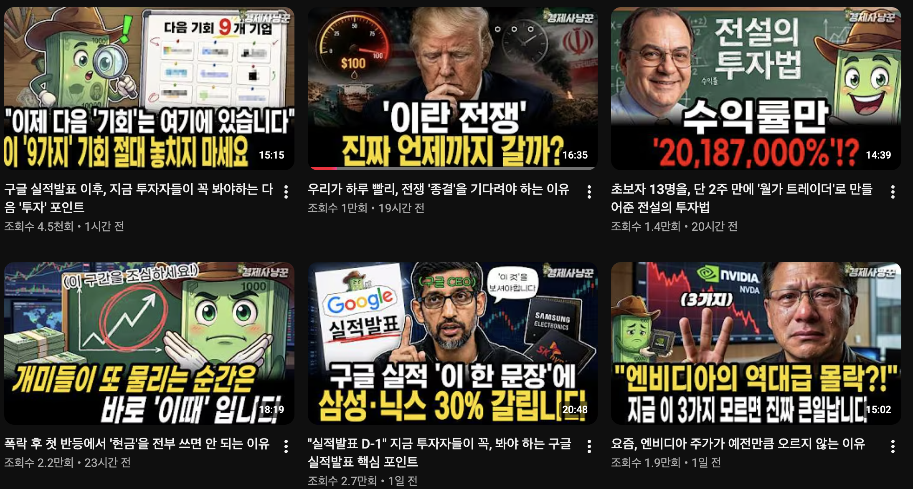
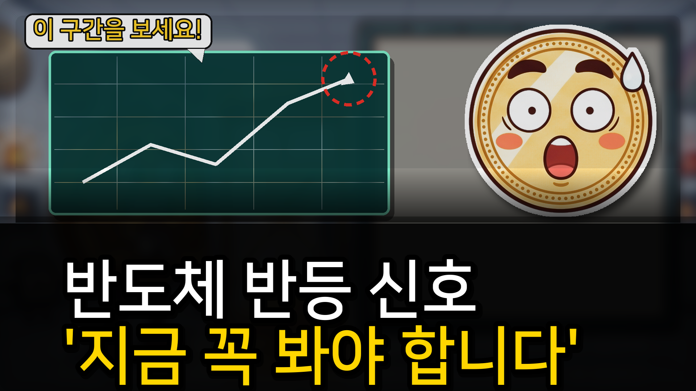
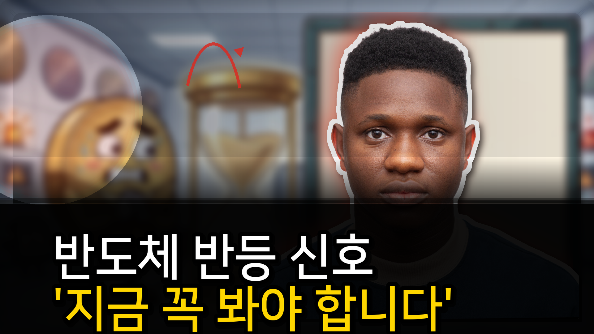
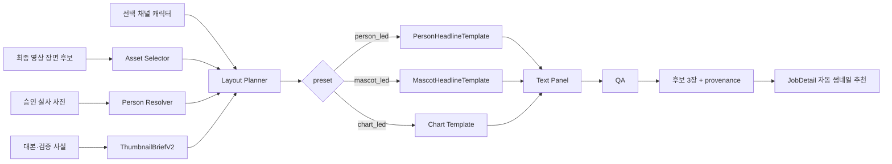

# 자동 썸네일 개발 현황·레퍼런스 격차 분석

- 작성일: 2026-07-24
- 문서 목적: 재구현 전 개발자 회의용 현황 공유 및 의사결정
- 평가 대상: 자동 썸네일 추천의 `캐릭터 단독` / `실사 인물 단독` 모드
- 기준 화면: `http://localhost:3000/longform/48`
- 결론 상태: **기술 파이프라인은 동작하지만 미술·편집 품질은 승인 불가**

---

## 1. 결론 요약

현재 구현은 다음 기반 기능까지는 갖췄다.

1. 캐릭터형과 실사형이 서로 다른 템플릿으로 렌더링된다.
2. 선택한 채널 캐릭터를 썸네일에 사용할 수 있다.
3. 실사형은 승인된 권리확인 사진만 사용할 수 있다.
4. 후보 3장, 선택 UI, provenance, 모바일 글자 크기와 겹침 QA가 있다.
5. 전체 FastAPI 테스트는 `110 passed` 상태다.

그러나 사용자가 지적한 것처럼, 현재 결과는 레퍼런스 수준에 도달하지 못했다. 특히 다음 세 항목은 명확한 실패다.

- **화살표와 그래픽 강조가 의미 없는 장식처럼 보인다.**
- **한글 폰트, 자간, 행간, 외곽선, 하단 여백이 레퍼런스와 크게 다르다.**
- **이미지·인물·캐릭터 위치가 대본의 사건과 관계없이 고정 배치된다.**

가장 중요한 원인은 현재 QA가 `글자 폭`, `얼굴 선명도`, `겹침 여부` 같은 기계적 조건만 검사하고, `의미`, `시각적 위계`, `맥락 적합성`, `활자 완성도`를 검사하지 않는다는 점이다. 따라서 자동 QA는 통과하지만 사람이 보면 이상한 **false positive**가 발생한다.

---

## 2. 비교에 사용한 이미지

### 2.1 사용자가 원하는 레퍼런스



- 원본: `/Users/songtaeho/Downloads/사용자 첨부 파일 (4).png`
- 저장 사본: `.artifacts/reference_channel_thumbnail_grid.png`
- SHA-256: `ddb3e3ba7591ca9cbf3cc33bcd5860fd9f7911936fc20b4f6f8b6aa8a86b9373`

### 2.2 현재 캐릭터형 결과



- 파일: `.artifacts/mascot_reference_v8_v1.png`
- SHA-256: `d8a201f7736d3f8b4f9d0916fc2367ee1d46176863ecf604f35df3d7e5ae6795`

### 2.3 현재 실사형 결과



- 파일: `.artifacts/person_reference_v8_v1.png`
- 테스트 인물은 레이아웃 검증용 Pexels 스톡 모델이며 실제 대본 등장인물이 아니다.
- SHA-256: `8810552b77005d65470d7b599134da9cb092cc9a6861d94cfbc66dd3d27c0041`

---

## 3. 레퍼런스 썸네일의 시각 문법

레퍼런스 6개를 공통 구조로 분석하면 다음과 같다.

### 3.1 주 피사체

- 유명인 얼굴, 채널 캐릭터, 차트 중 **하나가 가장 먼저 보인다.**
- 실사 인물은 얼굴 표정과 손 제스처가 메시지 역할을 한다.
- 캐릭터는 작은 장식이 아니라 사건에 반응하는 주연이다.
- 주 피사체의 실루엣이 배경과 명확히 분리된다.

### 3.2 텍스트

- 일반 본문용 폰트가 아니라 폭이 좁고 획이 강한 **디스플레이용 한글 고딕**에 가깝다.
- 흰색, 노란색, 빨간색을 역할별로 사용한다.
- 2줄이 기본이며, 한 줄 안에서도 중요한 단어가 색상으로 분리된다.
- 글자 외곽선과 그림자는 보조 수단이고 글자 자체의 획 두께가 우선이다.
- 하단 검은 면적에 글자가 들어가지만, 아래쪽 획이 프레임에 닿거나 잘리지 않는다.

### 3.3 이미지 배치

- 배경은 단순한 흐림 장면이 아니라 주제에 직접 연결되는 뉴스 사진, 차트, 기업 이미지다.
- 인물은 화면 중앙이나 우측에 배치되더라도 시선 방향, 손 방향, 텍스트 위치와 연결된다.
- 정보가 많은 이미지에서도 얼굴 → 핵심 물체 → 문구 순서가 유지된다.

### 3.4 강조 표시

- 빨간 원, 밑줄, 작은 말풍선은 **실제 핵심 구간이나 문장**을 가리킨다.
- 원, 밑줄, 화살표를 무조건 동시에 쓰지 않는다.
- 화살표는 장식이 아니라 `출발점 → 목표점` 관계가 화면에서 이해된다.
- 손으로 그린 듯한 불균일한 선이 사용되며, 완전한 기하학 도형 느낌이 약하다.

### 3.5 화면 밀도

- 여백이 적지만 피사체와 문구의 역할이 겹치지 않는다.
- 각 요소는 크지만, 동시에 모든 요소가 크지는 않다.
- 작은 화면에서도 얼굴과 핵심 단어가 남도록 단순화돼 있다.

---

## 4. 레퍼런스와 현재 결과 비교

| 평가 항목 | 레퍼런스 | 현재 캐릭터형 | 현재 실사형 | 판정 |
| --- | --- | --- | --- | --- |
| 주 피사체 | 사건과 연결된 캐릭터·인물 | 캐릭터는 크지만 사건 맥락이 약함 | 얼굴은 크지만 실제 대본 인물이 아님 | 미달 |
| 배경 | 뉴스·기업·차트와 직접 연결 | 흐린 기존 장면 위에 일반 상승 그래프 | 기존 코인 장면과 무관한 스톡 얼굴 조합 | 미달 |
| 폰트 | 좁고 두꺼운 디스플레이 고딕 | NanumSquareB 기반, 넓고 둔한 인상 | 동일 | 미달 |
| 행간·여백 | 빽빽하지만 프레임과 안전거리 확보 | 두 번째 줄이 화면 하단에 지나치게 가까움 | 동일 | 미달 |
| 카피 위계 | 단어 단위 흰색·노랑·빨강 | 문장 전체 단위 색상 | 문장 전체 단위 색상 | 부분 구현 |
| 화살표 | 특정 대상과 의미 관계 존재 | 일반 상승 그래프의 끝점 강조 | 얼굴 옆에 목적 없는 곡선 화살표 | 실패 |
| 말풍선 | 작고 상황에 맞는 보조 역할 | 너무 크고 상단 공간을 과점유 | 없음 | 미달 |
| 캐릭터 표정 | 맥락과 연결된 포즈 | 표정은 개선됐으나 포즈 선택 규칙이 단순 | 해당 없음 | 부분 구현 |
| 실사 인물 컷아웃 | 표정·손·시선이 메시지에 기여 | 해당 없음 | 정면 증명사진형으로 정적임 | 미달 |
| 모바일 식별성 | 핵심 단어와 얼굴이 즉시 식별 | 글자는 읽히지만 디자인은 자동 템플릿 느낌 | 동일 | 기술 통과 / 미술 실패 |
| 저작권·출처 | 외부에서 확인 불가 | 채널 소유 캐릭터 | 승인·라이선스 게이트 구현 | 구현됨 |

### 회의용 임시 점수

이 점수는 자동 QA 결과가 아니라, 레퍼런스 대비 미술적 간극을 논의하기 위한 휴리스틱이다.

| 항목 | 가중치 | 캐릭터형 | 실사형 |
| --- | ---: | ---: | ---: |
| 주제·대본 연관성 | 25 | 10 | 5 |
| 주 피사체 선택·표현 | 20 | 13 | 10 |
| 한글 타이포그래피 | 20 | 8 | 8 |
| 레이아웃·시선 흐름 | 15 | 8 | 7 |
| 강조 표시 의미성 | 10 | 3 | 1 |
| 모바일 가독성 | 10 | 8 | 8 |
| 합계 | 100 | **50** | **39** |

---

## 5. 사용자가 지적한 세부 문제와 직접 원인

## 5.1 화살표가 이상한 이유

### 캐릭터형

`MascotHeadlineTemplate`은 대본이나 실제 그래프 데이터와 관계없이 항상 동일한 상승 그래프를 그린다.

파일: `backend/fastapi-workers/app/services/thumbnail/v2/templates/mascot_headline.py:44, 77-124`

```python
self._draw_analysis_board(canvas, plan.mascot.side)

points = [
    (... .10, ... .20),
    (... .30, ... .43),
    (... .49, ... .31),
    (... .70, ... .68),
    (... .88, ... .83),
]
draw.line(points, fill=(255, 255, 255, 255), ...)
draw.polygon(...)
for start in range(0, 360, 28):
    draw.arc(ring, start, start + 16, fill=(239, 48, 38, 255), width=9)
```

문제점:

- 상승 여부가 검증된 사실과 연결되지 않는다.
- 실제 강조 대상의 좌표가 아니라 미리 정한 끝점을 가리킨다.
- 그래프 모양, 화살촉, 점선 원이 모든 주제에서 반복된다.
- 레퍼런스의 손그림 강조와 달리 프레젠테이션 도형처럼 보인다.

### 실사형

`draw_person_accent`는 실사 인물 옆에 항상 곡선과 화살촉을 그린다.

파일: `backend/fastapi-workers/app/services/thumbnail/v2/editorial_effects.py:61-77`

```python
draw.arc((left, top, right, bottom), 208, 334,
         fill=(239, 48, 38, 220), width=10)
draw.polygon(
    [(right - 2, top + 15),
     (right - 34, top + 23),
     (right - 11, top + 47)],
    fill=(239, 48, 38, 220),
)
```

문제점:

- 화살표의 target이 없다.
- 얼굴을 강조하는지 배경 물체를 강조하는지 의미를 해석할 수 없다.
- 화살표가 필요한 장면인지 판단하는 조건이 없다.

### 필요한 수정 방향

화살표는 다음 계약이 있을 때만 렌더링해야 한다.

```json
{
  "kind": "arrow",
  "from": {"anchor": "character_hand"},
  "to": {"asset_id": "verified_chart", "bbox": [0.58, 0.18, 0.21, 0.28]},
  "reason": "script_fact: semiconductor_index_rebound",
  "style": "hand_drawn_red"
}
```

`to.bbox`나 검증 대상이 없으면 화살표를 그리지 않는 것이 기본값이어야 한다.

---

## 5.2 폰트가 이상한 이유

현재 폰트 후보는 다음과 같다.

파일: `backend/fastapi-workers/app/services/thumbnail/v2/text_panel.py:11-20`

```python
FONT_PATHS = (
    "/usr/share/fonts/truetype/nanum/NanumSquareB.ttf",
    "/usr/share/fonts/truetype/nanum/NanumGothicBold.ttf",
    "/app/assets/fonts/NanumGothicBold.ttf",
    "/System/Library/Fonts/AppleSDGothicNeo.ttc",
)
```

직접 원인:

1. `NanumSquareB`는 레퍼런스의 압축된 디스플레이 고딕보다 글자 폭이 넓다.
2. 폰트 크기는 전체 zone 높이와 줄 수만으로 결정한다.
3. 줄 간 이동이 실제 glyph bbox가 아니라 `font_px * 1.04`로 고정돼 있다.
4. 줄별 문구가 아니라 문장 전체에 한 색을 적용한다.
5. 획 두께를 폰트 weight보다 큰 검은 stroke로 보완해 글자가 뭉쳐 보인다.
6. 마지막 줄의 실제 하단 bbox와 캔버스 safe bottom을 비교하지 않는다.

현재 계산:

```python
font_px = min(
    int(zone.height / max(1.0, line_count * 1.04 + .55)),
    zone.width // 5,
)

y = zone.top + zone.pad
for line in brief.headline:
    ...
    y += int(font_px * 1.04)
```

필요한 수정 방향:

- 라이선스가 확인된 디스플레이용 한글 폰트를 프로젝트 에셋으로 고정한다.
- `font.getbbox()`의 ascent/descent를 기준으로 baseline을 계산한다.
- 전체 문장을 줄 단위 이미지로 만든 후, 실제 alpha bbox 기준으로 상·하단을 재정렬한다.
- 마지막 줄 alpha bbox가 `canvas.height - safe_bottom`을 넘으면 실패시킨다.
- 문장 단위 tone이 아니라 span 단위 스타일을 지원한다.

예시 계약:

```json
{
  "lines": [
    {
      "spans": [
        {"text": "구글 실적 ", "tone": "white"},
        {"text": "이 한 문장", "tone": "yellow"},
        {"text": "에", "tone": "white"}
      ]
    },
    {
      "spans": [
        {"text": "삼성·닉스 30% 갈립니다", "tone": "yellow"}
      ]
    }
  ]
}
```

---

## 5.3 이미지 위치가 이상한 이유

`ThumbnailLayoutPlanner`는 실제 이미지의 얼굴·빈 공간·시선 방향을 보지 않고 세 가지 고정 배치를 만든다.

파일: `backend/fastapi-workers/app/services/thumbnail/v2/layout_planner.py:194-277`

현재 규칙:

```python
# 후보 1
subject=SubjectSpec(kind=kind, side="right")
mascot=MascotSpec(... side="right", emotion="worried")
bubble=BubbleSpec(... side="left")

# 후보 2
subject=SubjectSpec(kind=kind, side="right")
mascot=MascotSpec(... side="right", emotion="neutral")

# 후보 3
subject=SubjectSpec(kind=kind, side="left")
mascot=MascotSpec(... side="left", emotion="happy")
```

문제점:

- 얼굴의 실제 위치와 시선 방향을 분석하지 않는다.
- 손을 들거나 가리키는 포즈와 target 관계가 없다.
- 텍스트가 놓일 negative space를 계산하지 않는다.
- 이미지마다 피사체가 차지해야 하는 비율이 달라도 동일 비율을 적용한다.
- 배경에서 이미 존재하는 캐릭터나 물체를 완전히 제거하지 못할 수 있다.

특히 작업 48처럼 과거에 생성된 이미지에는 `background_path` 또는 `character_regions`가 없을 수 있다. 이 경우 아래 fallback이 원본 전체를 그대로 사용한다.

파일: `backend/fastapi-workers/app/services/thumbnail/v2/templates/base.py:94-120`

```python
if not regions:
    return (
        ImageOps.fit(image, size, Image.Resampling.LANCZOS),
        {"kind": "scene_no_character_region"},
    )
```

그 결과 현재 실사형 배경에 과거 코인 캐릭터가 흐릿하게 남아, 새 실사 인물과 의미 없는 조합이 만들어졌다.

필요한 수정 방향:

1. 새 작업은 캐릭터 합성 전 `clean background plate`를 필수 저장한다.
2. 구 작업은 배경판이 없으면 인물/캐릭터 전용 템플릿에서 사용하지 않는다.
3. 얼굴 bbox, 시선 방향, 손 bbox, saliency map을 asset metadata에 저장한다.
4. planner는 `텍스트 영역`, `피사체 영역`, `강조 target`을 동시에 푸는 constraint solver가 되어야 한다.

---

## 6. 현재 QA가 잘못 통과시키는 이유

파일: `backend/fastapi-workers/app/services/thumbnail/v2/layout_planner.py:128-172`

현재 검사 항목:

```python
if requires_face and face_sharpness < 120:
    failures.append("face_sharpness")
if subject_area < .16:
    failures.append("subject_area")
if copy_fill < .58:
    failures.append("copy_fill")
if minimum_copy_fill < .34:
    failures.append("short_copy_line")
if text_scale < .74:
    failures.append("text_distortion")
if mobile_font_px < 18:
    failures.append("mobile_legibility")
if overlaps:
    failures.append("overlaps")
```

### 현재 검사하지 않는 항목

- 글자 alpha bbox가 화면 하단에서 잘리는가
- 실제 폰트가 디자인 사양에 등록된 폰트인가
- 문구의 중요 단어에 색상 위계가 있는가
- 화살표의 target과 source가 존재하는가
- 그래프 방향과 검증된 데이터 방향이 일치하는가
- 실사 인물이 실제 대본 등장인물인가
- 인물의 표정/포즈가 문구 tone과 맞는가
- 배경과 주 피사체가 같은 사건을 설명하는가
- 말풍선이 주 피사체보다 먼저 보이는가
- 이전 캐릭터가 배경에 잔존하는가
- 레퍼런스 대비 화면 밀도와 시선 흐름이 유사한가

### QA 확장 제안

```python
class EditorialQA(BaseModel):
    text_safe_bottom: bool
    font_profile_id: str
    emphasis_target_valid: bool
    direction_claim_verified: bool
    subject_script_match: float
    backdrop_subject_coherence: float
    duplicate_character_count: int
    bubble_dominance_ratio: float
    visual_hierarchy_score: float
```

초기에는 자동 비전 모델 없이도 다음을 하드 규칙으로 만들 수 있다.

- `emphasis.kind == arrow`이면 `from`과 `to.bbox` 필수
- `direction == up`이면 검증된 fact에 상승 방향 필수
- 실사 모드이면 `person_id`가 대본 인물 매칭 결과에 존재해야 함
- `clean background plate`가 없으면 실사/캐릭터 주연 템플릿 사용 금지
- 텍스트 alpha bbox의 bottom이 `canvas.height - 32px` 이하
- 말풍선 면적이 전체의 12% 초과 시 실패

---

## 7. 현재 구현된 아키텍처



### 정상 구현된 부분

- `person_led`, `mascot_led`, `chart_led` preset 분리
- 실사와 캐릭터를 같은 후보에 섞지 않는 추천 규칙
- 인물 사진 권리 승인 게이트
- 로컬 `rembg` 배경 제거와 캐시
- 후보 3개 생성 및 UI 선택
- 얼굴 선명도, 피사체 면적, 글자 폭, 모바일 크기, 겹침 QA
- 결과물별 provenance 저장

### 아직 미완성인 부분

- 썸네일 전용 art direction planner
- 의미 기반 강조 target 결정
- 유명인/기업/뉴스 사건과 실제 대본의 정확한 asset matching
- 포즈·시선·손 위치 기반 배치
- 디스플레이용 한글 typography profile
- 레퍼런스 비교 기반 visual QA
- 과거 작업의 clean background plate 재생성
- 기존 저장 썸네일만 빠르게 다시 만드는 전용 API/UI

---

## 8. 자동 추천 UI와 연결 상태

파일: `frontend/src/pages/JobDetail.jsx:223-240, 700-750`

현재 UI는 후보를 다음처럼 구분해 표시한다.

```javascript
const thumbnailPresetLabels = {
  person_led: '실사 인물 단독',
  chart_led: '차트 중심',
  mascot_led: '캐릭터 단독',
}
```

후보별 이미지 URL:

```jsx

```

현재 제약:

- 코드 변경은 새로 생성되는 후보에 적용된다.
- 작업 48에 이미 저장된 과거 썸네일은 코드 배포만으로 자동 덮어쓰기되지 않는다.
- 썸네일만 재생성하는 독립 버튼/API가 없어 전체 재생성 흐름과 분리할 필요가 있다.

---

## 9. 실사 이미지 권리 처리 현황

### 구현된 정책

파일:

- `backend/spring-app/src/main/java/com/pipeline/video/service/PersonAssetService.java`
- `backend/spring-app/src/main/java/com/pipeline/video/controller/PersonAssetController.java`
- `backend/fastapi-workers/app/services/thumbnail/person_compositor.py`
- `frontend/src/pages/Admin.jsx:549-691`

허용 타입:

```python
ALLOWED_LICENSES = {
    "PRESS_KIT", "KOGL_TYPE1", "CC_BY", "CC_BY_SA", "OWNED",
    "STOCK_LICENSED", "AGENCY_LICENSED",
}
```

구현 상태:

- 관리자에서 인물·별칭 등록
- 사진 업로드 시 라이선스, 출처/계약, 크레딧, 권리자 입력
- 검토 대기 → 승인/반려
- 승인 사진만 FastAPI 렌더러에 전달
- 실사 얼굴 픽셀은 생성형으로 변경하지 않음
- 결과 provenance에 license type, ref, credit, author, 승인 상태 기록

주의:

> 누끼, 블러, 색보정, 외곽선은 저작권이나 초상권을 제거하지 않는다. 현재 구현은 효과 처리로 위험을 회피하는 방식이 아니라, 이용 권한이 확인된 사진만 렌더러에 진입시키는 방식이다.

---

## 10. 코드 파일별 역할과 회의 검토 포인트

| 파일 | 현재 역할 | 회의에서 볼 핵심 |
| --- | --- | --- |
| `thumbnail/v2/compose.py` | 후보 3개 생성, 모드 분리, provenance | 인물/캐릭터 후보 조합 정책 |
| `thumbnail/v2/layout_planner.py` | 좌우 배치와 QA | 고정 위치를 constraint 기반으로 교체 |
| `thumbnail/v2/text_panel.py` | 한글 문구 렌더 | 폰트 프로파일, baseline, span 색상 |
| `thumbnail/v2/templates/base.py` | 배경·패널·공통 합성 | clean plate가 없을 때 fail/대체 정책 |
| `thumbnail/v2/templates/mascot_headline.py` | 캐릭터형 | 가짜 일반 그래프 제거, 검증 데이터 연동 |
| `thumbnail/v2/templates/person_headline.py` | 실사형 | 시선·포즈·대본 인물 matching |
| `thumbnail/v2/editorial_effects.py` | 흐림, 색보정, 화살표 | 무조건 화살표 제거 |
| `thumbnail/v2/mascot_compositor.py` | 캐릭터 sprite crop·배치 | 포즈 메타데이터와 손/시선 anchor |
| `thumbnail/person_compositor.py` | 권리확인 인물 누끼·효과 | 인물 crop profile과 표정/포즈 선택 |
| `tests/test_thumbnail_v2.py` | 회귀 테스트 | 미술적 false positive를 잡는 golden test 추가 |
| `frontend/src/pages/JobDetail.jsx` | 자동 추천/선택 | 썸네일만 다시 생성 버튼 |
| `frontend/src/pages/Admin.jsx` | 실사 에셋 승인 | 사용 목적·만료·영역별 권리 필드 보강 |

---

## 11. 현재 테스트와 운영 상태

### 테스트

- FastAPI 전체: `110 passed, 19 warnings`
- 캐릭터형 샘플 QA:
  - subject area: 약 `0.18`
  - copy fill: `0.9128`
  - minimum line fill: `0.7403`
  - text scale: `1.0`
  - mobile font: `29.33px`
  - overlaps: `0`
- 실사형 샘플 QA:
  - face sharpness: `322.718`
  - subject area: `0.502`
  - copy fill: `0.8299`
  - minimum line fill: `0.6731`
  - text scale: `1.0`
  - mobile font: `26.67px`
  - overlaps: `0`

### 해석

두 결과 모두 자동 QA를 통과했지만 사용자 평가에서는 실패했다. 즉 현재 QA score는 미술적 완성도를 대표하지 않는다.

### Docker

현재 실행 상태:

- frontend: `localhost:3000`
- spring-app: `localhost:8080`
- fastapi-workers: `localhost:8001`, healthy
- postgres, redis, minio, temporal: running

### 작업 트리 주의

현재 작업 트리에는 썸네일뿐 아니라 기사 캡처, 대본, TTS, 트렌딩 UI 등 여러 변경이 함께 존재한다. 재구현 전에 썸네일 파일만 별도 브랜치 또는 별도 커밋으로 격리하는 것이 필요하다.

---

## 12. 재구현 우선순위 제안

### P0. 잘못된 장식을 없애기

### 작업

- target 없는 화살표를 렌더하지 않는다.
- verified chart 없이 일반 상승 그래프를 그리지 않는다.
- clean background plate 없는 구 작업 장면을 실사/캐릭터 주연 배경으로 쓰지 않는다.
- 하단 잘림 검사와 실제 alpha bbox 검사를 추가한다.

### 완료 기준

- 화살표가 나타난 모든 결과물에 source/target/reason provenance가 존재한다.
- 대본에 상승 근거가 없으면 상승 그래프가 나타나지 않는다.
- 배경에 두 번째 캐릭터가 검출되면 후보가 탈락한다.
- 글자 alpha bbox가 사방 safe margin을 침범하지 않는다.

### P0. 타이포그래피 엔진 교체

### 작업

- 라이선스 확인된 썸네일 전용 한글 폰트 2~3개를 프로파일로 등록한다.
- span 단위 색상과 크기 조절을 지원한다.
- baseline/ascent/descent 기반 행 배치를 구현한다.
- 문구별 optical size를 계산한다.

### 완료 기준

- 320px, 480px, 1280px 미리보기에서 글자 잘림 0건
- 레퍼런스와 동일한 2줄 밀도 범위
- 한 줄 내부에서 핵심 단어만 노랑/빨강 적용 가능
- 글자 폭 강제 stretch/condense가 기본값이 아님

### P1. 의미 기반 레이아웃

### 작업

- asset에 face, eyes, hands, gaze, saliency, negative-space metadata를 추가한다.
- 시선이나 손이 강조 target을 향하는 후보를 우선 선택한다.
- 말풍선은 얼굴과 target 사이의 시선 흐름을 방해하지 않을 때만 사용한다.

### 완료 기준

- 인물 시선과 문구/target 관계가 설명 가능하다.
- 말풍선 면적 12% 이하, 주 피사체보다 visual saliency가 낮다.
- 레이아웃 선택 이유가 provenance에 기록된다.

### P1. 대본·사건과 에셋의 일치

### 작업

- 실사 모드의 person ID를 대본의 named entity와 하드 매칭한다.
- 기업/뉴스/차트 배경도 source fact와 연결한다.
- 관련 실사 에셋이 없으면 무관한 스톡 얼굴을 쓰지 않고 캐릭터형으로 강등한다.

### 완료 기준

- 실사 인물 후보 100%가 대본 등장인물이다.
- 배경 asset에 source scene/fact가 존재한다.
- 일반 스톡 모델은 운영 자동 추천에서 사용하지 않는다.

### P2. 레퍼런스 기반 시각 회귀

### 작업

- 캐릭터형/실사형 각각 10개 golden fixture를 만든다.
- 모바일 축소 이미지를 snapshot으로 저장한다.
- 사람 평가 rubric을 CI 결과와 함께 기록한다.

### 완료 기준

- 각 후보가 typography, hierarchy, relevance, emphasis에서 최소 기준 통과
- 자동 QA 통과 + 개발자 시각 승인 두 단계 적용
- 3회 연속 생성에서 레이아웃 붕괴 없음

---

## 13. 회의에서 반드시 결정할 항목

1. 프로젝트에 포함할 디스플레이용 한글 폰트와 라이선스
2. 레퍼런스의 어떤 요소를 고정 템플릿으로 만들고 어떤 요소를 동적으로 만들지
3. 유명인 사진의 허용 소스와 승인 책임자
4. 화살표·원·밑줄을 자동으로 결정할지, 기획 단계에서 명시할지
5. 과거 작업의 배경판을 다시 만들지, 신규 작업부터만 지원할지
6. 썸네일 전용 재생성 API를 전체 영상 재생성과 분리할지
7. 최종 승인 기준을 자동 점수로 할지, 사람 검수까지 요구할지
8. 사용자가 선택한 레퍼런스 스타일을 채널별 style profile로 저장할지

---

## 14. 권장 테스트 매트릭스

| 케이스 | 입력 | 기대 결과 |
| --- | --- | --- |
| 캐릭터 + 상승 근거 있음 | 검증 차트 bbox, 상승 fact | target을 감싼 원 또는 방향 화살표 1개 |
| 캐릭터 + 상승 근거 없음 | 일반 시장 대본 | 가짜 상승 그래프 없음 |
| 실사 + 대본 등장인물 | 승인 사진, person match | 실사형 후보 생성 |
| 실사 + 무관한 스톡 모델 | person match 없음 | 실사형 생성 금지, 캐릭터형 fallback |
| 배경판 없음 | 구 작업 장면 | 실사/캐릭터형 배경으로 사용 금지 또는 명시적 재생성 |
| 2줄 짧은 문구 | 8~12자 + 10~16자 | 자연 폭 유지, 하단 안전거리 확보 |
| 한 줄 내부 강조 | 핵심 단어 1개 | span만 노란색, 나머지 흰색 |
| 말풍선 과대 | 긴 문장 | 축약 또는 말풍선 제거 |
| 화살표 target 없음 | arrow kind, bbox 없음 | validation error |
| 얼굴과 텍스트 충돌 | 피사체 중앙 | mirrored layout 또는 후보 탈락 |

---

## 15. 개발자용 핵심 판단

현재 구현을 폐기할 필요는 없다. 다음 기반은 유지할 가치가 있다.

- 모드 분리
- 권리 승인 게이트
- provenance
- 후보 3개와 선택 UI
- deterministic Pillow 합성
- 기본 크기·겹침 QA

그러나 `고정 위치 + 일반 그래프 + NanumSquareB + 수치 QA`를 계속 미세 조정하는 방식으로는 레퍼런스에 도달하기 어렵다. 다음 단계는 효과 수치 조정이 아니라 아래 세 계약을 새로 도입하는 작업이어야 한다.

1. `TypographyProfile`: 폰트·baseline·span·safe margin
2. `SemanticEmphasisPlan`: 강조의 source·target·근거
3. `AssetLayoutMetadata`: 얼굴·손·시선·negative space·clean plate

이 세 계약이 없으면 화살표 위치, 이미지 위치, 폰트 문제는 매번 새로운 예외 처리로 반복될 가능성이 높다.

---

## 16. 관련 문서

- 외부 원본 계획: `/Users/songtaeho/Downloads/DEV_PLAN_thumbnail_v2_rebuild.md`
- `docs/DEVELOPER_REVIEW_THUMBNAIL_AND_ARTICLE_EVIDENCE_GAP.md`
- `docs/V3_IMPLEMENTATION_VALIDATION_REPORT.md`
- `docs/DEVELOPER_MEETING_VISUAL_PARITY_ARTICLE_EVIDENCE_V3.md`

이 문서는 위 문서 이후 실제 구현과 최신 V8 출력물을 기준으로 다시 작성한 현재 상태 보고서다.
