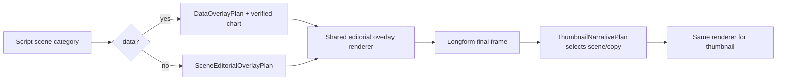
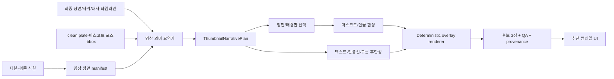

# 완성 영상 기반 썸네일 서사·말풍선 구성 설계안

- 작성일: 2026-07-24
- 목적: 개발자 회의에서 **완성 영상 → 추천 썸네일** 연결 방식을 결정하기 위한 구현 설계
- 범위: 노란색 채널 마스코트 중심 썸네일, 말풍선/구름/강조 문구, 영상·사실 관계, 추천 후보 UI
- 비범위: 특정 레퍼런스 채널의 로고·고유 문구·고유 캐릭터를 복제하는 작업. 아래 내용은 관찰된 **정보 위계와 후합성 방식**을 독자적인 채널 규칙으로 재구성한다.

---

## 1. 이번 회의의 결론

현재 파이프라인으로도 말풍선, 구름형 박스, 정확한 한글 문구, 강조 색상은 만들 수 있다. 다만 이 요소를 **이미지 생성 모델에게 그리라고 하면 안 된다.** 현재 이미지 프롬프트가 `NO text, NO letters, NO words, NO numbers`를 강제하는 것은 결함이 아니라, 텍스트 왜곡을 피하기 위한 올바른 정책이다.

문제는 생성 능력이 아니라 연결 계약이다.

1. 영상 장면 생성은 대사별 은유 장면을 잘 만든다.
2. 영상용 말풍선은 `bubble_overlay.py`에서 생성 모델 밖의 정확한 글자로 이미 후합성한다.
3. 반면 썸네일 브리프는 현재 `키워드 + 지금 확인할 핵심`에 가깝다.
4. 따라서 썸네일이 영상의 **갈등, 핵심 수치, 시청자 결정, 인물/캐릭터 역할**을 선택하지 못하고, 일반적인 차트 배경 위의 마스코트 포스터가 된다.

권장 결정은 다음과 같다.

> 영상 조립이 끝난 뒤 `ThumbnailNarrativePlan`을 생성하고, 이 계획이 장면 선택·문구·말풍선/구름·강조 대상·후합성 좌표를 함께 결정한다. 생성 모델은 텍스트 없는 배경판과 캐릭터/소품만 만들고, 모든 읽히는 한글과 수치는 Pillow 기반 렌더러가 그린다.

이 방식이면 레퍼런스에서 보이는 “말풍선 안의 짧은 반응”, “구름 속의 검증 수치”, “배경과 관계가 있는 메인 문구”를 구현하면서도 숫자·문구가 깨지지 않고 출처를 남길 수 있다.

---

## 2. 제공 자료에서 읽은 영상 ↔ 썸네일 관계

### 2.1 현재 생성 영상: `KakaoTalk_20260724_154659505.mp4`

- 기술 정보: 60.04초, 1280×720, 24fps
- 표본 시점: 3초 / 18초 / 35초 / 52초
- 관찰한 흐름: 노란 코인 마스코트가 왕관·망토로 주목받는 장면 → 무대 스포트라이트 → 갈림길 표지판 앞의 선택 → 레드카펫 성과 장면으로 이동한다.

이 영상의 시각 자산은 단순히 “노란 캐릭터”가 아니다. 아래 세 가지가 이미 있다.

| 영상 서사 자산 | 썸네일에서 맡아야 할 역할 | 피해야 할 사용 |
| --- | --- | --- |
| 스포트라이트/무대 | 시장의 시선이 모이는 **한 변수** | 무관한 하락 차트 배경 |
| 갈림길/지도/결정 포즈 | 시청자가 판단해야 할 **타이밍 질문** | 내용과 관계 없는 ‘핵심’ 문구 |
| 왕관·레드카펫/표정 변화 | 결과 또는 기대의 감정 신호 | 모든 주제에 동일한 걱정 표정 |

즉 이 영상의 후보는 “캐릭터만 크게”가 아니라 `갈림길 + 결정 문구 + 반응 말풍선`처럼, 영상이 실제로 설명한 선택을 압축해야 한다. 영상의 실제 대본과 검증 사실을 읽지 않은 상태에서 “매수”, “폭등” 같은 문구를 새로 만들면 안 된다.

### 2.2 레퍼런스 영상: `YTDown_YouTube_Media_bJL7rnH66Ig_001_1080p.mp4`

- 기술 정보: 17분 8초, 1920×1080, 약 29.97fps
- 표본 시점: 5초 / 4분 10초 / 8분 40초 / 14분 40초
- 관찰한 흐름: 가격/가치 비교 반응 말풍선, 업황 은유(빵), 공급 계약/기업 장면, 장기 시장 규모라는 서로 다른 설명 장면을 하나의 마스코트 연기로 연결한다.

제공된 다섯 번째 이미지의 썸네일은 영상의 모든 사실을 나열하지 않는다. 대신 다음처럼 압축한다.

```text
영상의 다수 장면: 가격·수요·공급·기업·장기 시장 규모
             ↓
시청자 질문: 지금 하락을 위험으로 볼까, 판단 시점으로 볼까?
             ↓
썸네일: 관련 인물/마스코트 + 종목 묶음 + ‘타이밍’이라는 행동 질문
```

참고할 것은 화면을 그대로 베끼는 것이 아니라 아래의 구성 문법이다.

| 관찰된 문법 | 독자적 구현 규칙 |
| --- | --- |
| 장면에서는 말풍선·구름을 써서 한 개의 수치/반응을 빠르게 읽힌다 | `scene.speech_bubble` 또는 `OverlaySlot(kind=cloud)`에 한 메시지만 둔다 |
| 썸네일은 영상의 설명 순서가 아니라 시청자의 결정 질문을 앞에 둔다 | `decision_hook`을 8~16자, `resolution_hint`를 8~18자로 제한한다 |
| 인물/캐릭터는 텍스트를 읽게 하거나 반응한다 | 포즈/시선/손 anchor가 문구 또는 강조 target과 연결될 때만 사용한다 |
| 색은 역할을 나눈다 | 기본 흰색, 행동/핵심은 노랑, 위험·손실·마감은 빨강으로 제한한다 |

### 2.3 제공된 1~4번 이미지에서의 추가 규칙

1. 항만 폭풍 장면의 `비상사태!`: 배경 위의 큰 burst 말풍선은 ‘사건 경보’ 하나만 말한다.
2. 매장 장면의 `헐! 너무 비싸`: 캐릭터 감정과 결제 금액을 하나의 반응으로 묶는다.
3. 지도 장면의 구름: 수치를 배경 장식이 아니라 지리/정책 대상에 붙인다.
4. 기사 캡처 장면: 원문 인용과 설명용 붉은 박스는 정확한 문장 좌표에 붙는다.

따라서 “말풍선 사용”은 장식 기능이 아니라 `사실/반응/행동 질문 중 무엇을 짧게 읽게 할지`를 결정하는 편집 기능이다.

---

## 3. 현재 코드의 실제 상태

### 이미 가능한 것

| 기능 | 현재 코드 | 상태 |
| --- | --- | --- |
| 생성 모델에 텍스트를 금지 | `providers/real/prompt_builder.py`의 `STYLE_LOCK` | 구현됨. 유지해야 함 |
| 장면용 말풍선/구름/버스트 | `services/bubble_overlay.py` | 구현됨. `round`, `burst`, `warning`, `positive`, `cloud`, `shout` 지원 |
| 영상 조립 후 말풍선 합성 | `workers/longform_worker.py::_apply_speech_bubble_overlay` | 구현됨. `validate_verbatim`으로 수치 검증 |
| 썸네일용 큰 제목의 span 색상 | `thumbnail/v2/brief.py`, `typography.py` | 구현됨 |
| 썸네일용 간단 말풍선 | `thumbnail/v2/templates/chart_warning.py::_speech_bubble` | 구현됨이나 기능이 단순하고 중복됨 |
| clean plate + 마스코트 합성 | `thumbnail/v2/templates/base.py`, `mascot_headline.py` | 구현됨 |
| 후보 3장, provenance, UI 선택 | `thumbnail/v2/compose.py`, `frontend/src/pages/JobDetail.jsx` | 구현됨 |

### 현재 병목

```python
# backend/fastapi-workers/app/workers/script_worker.py
"headline": [
    {"text": hook[:16], ...},
    {"text": "지금 확인할 핵심", ...},
]
```

이 브리프는 최종 영상의 무엇이 중요한지 모르고, `speech_bubble`도 채우지 않는다. `ThumbnailLayoutPlanner` 역시 좌/우/표정의 변형은 만들지만, “왜 이 장면의 갈림길이 이 타이밍 문구와 맞는가”를 판단하지 않는다.

또한 썸네일 템플릿은 영상용 `bubble_overlay.py`를 재사용하지 않고 별도 `_speech_bubble()`을 갖는다. 그래서 구름형·burst형·충돌 회피·반응형 텍스트가 썸네일에는 전달되지 않는다.

### 3.1 이번 작업은 두 축을 함께 포함한다

이 문서의 구현 범위는 아래 두 가지다. 둘 중 하나만 구현하면 사용자가 원하는 화면 문법이 완성되지 않는다.

| 작업 축 | 대상 | 목표 | 완료 기준 |
| --- | --- | --- | --- |
| A. 완성 영상 기반 **썸네일 추천** | 영상 완료 후 후보 3장 | 영상의 사건·핵심 수치·시청자 질문을 제목/말풍선/구름으로 압축 | 각 후보가 source scene·근거·카피 역할을 provenance에 남김 |
| B. 장면별 **정확한 한글·수치 오버레이** | 롱폼의 `data` 및 비-data 장면 | data 장면은 검증 수치, 다른 장면은 배경 설명/반응/행동 문구를 정확한 한글로 후합성 | 이미지 생성 모델에 텍스트를 넣지 않고 카테고리별 overlay 계약을 렌더링 |

썸네일은 B에서 생성된 장면 metadata와 정확한 데이터/문구를 다시 사용한다. 반대로 B가 없는 썸네일은 결국 제목만 있는 일반 포스터가 된다.

### 3.2 현재 `data` 카테고리: 구현 상태와 보완점

현재 `section == "data"` 장면은 일반 카툰 장면과 다르게 동작한다.

```text
script_worker._attach_verified_market_charts()
  → market_charts.extract_market_chart()
  → market_chart payload (verified=True, source=market_snapshot.chart_series)
  → 빈 chalkboard / paper poster / factory panel 배경 생성
  → longform_worker가 matplotlib chart를 정확한 숫자로 후합성
```

현재 데이터 시각화 유형은 다음 네 가지다.

| 현재 `visual_kind` | 선택 조건 | 현재 표시 방식 | 보완할 점 |
| --- | --- | --- | --- |
| `change_arrow` | 상승/하락/등락 문장 | 최신 값, 변화율, 방향 화살표 | “어떤 기간 대비인가”, “왜 이 방향을 봐야 하는가”를 한 줄 callout으로 연결 |
| `composition_pie` | 비중/점유/구성 | 상위 종목 비중 도넛 | 구성 기준·분모·수집 기준일을 카드 안에서 더 명료하게 표시 |
| `comparison` | 비교/대비 | 두 항목 막대 비교 | 비교 대상과 단위를 명시하고, 서로 다른 단위를 비교하지 못하게 검증 |
| `trend_dashboard` | 그 외 data 장면 | 추세선, 최근 변화 막대, 최신 값 | 수치가 많은데 결론이 약함. `latest_verified_point`에 한 개의 짧은 해석 callout을 붙임 |

관련 현재 파일은 다음과 같다.

- 분류/선택: `backend/fastapi-workers/app/workers/script_worker.py::_attach_verified_market_charts`
- 데이터 계약: `backend/fastapi-workers/app/utils/market_charts.py::extract_market_chart`
- 렌더링: `backend/fastapi-workers/app/utils/market_charts.py::render_market_chart`
- 빈 데이터 표면 생성: `backend/fastapi-workers/app/utils/art_direction.py::compile_editorial_prompt`
- 최종 합성: `backend/fastapi-workers/app/workers/longform_worker.py`

#### data 카테고리의 신규 계약

`market_chart`와 별도로, 숫자 자체를 설명하는 `DataOverlayPlan`을 둔다. 차트에 숫자를 더 많이 넣자는 뜻이 아니라, **차트가 답하는 질문을 한 개로 제한**하자는 뜻이다.

```python
class DataOverlayPlan(BaseModel):
    chart_kind: Literal["trend", "change", "composition", "comparison"]
    primary_metric: str                 # 예: KOSPI 종가, 외국인 순매수
    unit: str                           # pt, %, 원, 주, 조원 등
    source_refs: list[str]              # collector field / verified fact
    comparison_basis: str | None = None # 전일, 1개월, 두 기업 등
    focus_target: Literal["latest_point", "largest_slice", "larger_bar"]
    callout: CopyClaim | None = None    # 최대 16자, 숫자와 중복 금지
    callout_anchor: Literal["target", "upper_left", "lower_right"] = "target"
```

예시:

```json
{
  "chart_kind": "change",
  "primary_metric": "KOSPI 종가",
  "unit": "pt",
  "comparison_basis": "전일 종가 대비",
  "focus_target": "latest_point",
  "callout": {
    "text": "이 흐름이 핵심",
    "claim_type": "derived_hook",
    "source_refs": ["facts[2]", "market_snapshot.kr.index.kospi"]
  }
}
```

렌더링 규칙:

1. **정확 수치**는 chart renderer만 쓴다. 이미지 모델/LLM이 숫자를 그리지 않는다.
2. `callout`은 값의 재진술이 아니라 해석의 방향만 말한다. 예: `+2.1% 상승` 옆에 다시 `2.1% 급등`을 쓰지 않는다.
3. `comparison`은 단위·기간·분모가 같을 때만 허용한다.
4. 수치 하나당 강조 도형은 최대 하나다. 화살표와 원, 말풍선을 동시에 붙이지 않는다.
5. `callout`에는 `source_refs`가 있어야 하며, target 좌표는 최종 chart renderer가 반환한다.

### 3.3 비-data 카테고리: 배경 설명형 한글/말풍선의 신규 계약

현재 `intro`, `background`, `scenario`, `action`, `conclusion` 장면은 `bubble_text` 문자열을 대본에서 파싱해 영상 마지막에 합성할 수 있다. 하지만 카테고리별 역할, 길이, 근거 수준, 반복 제한이 없기 때문에 실제로는 비어 있거나 일반적인 문구가 되기 쉽다.

이를 `SceneEditorialOverlayPlan`으로 명시한다.

```python
class SceneEditorialOverlayPlan(BaseModel):
    section: Literal["intro", "background", "scenario", "action", "conclusion"]
    message_role: Literal[
        "hook", "reaction", "cause", "decision", "takeaway", "evidence_quote"
    ]
    copy: CopyClaim
    overlay_kind: Literal["speech", "burst", "cloud", "caption_chip", "article_callout"]
    anchor: Literal["subject_gaze", "subject_hand", "prop", "background_zone", "article_quote"]
    target_id: str | None = None
    target_bbox: tuple[float, float, float, float] | None = None
    max_chars: int = Field(default=14, ge=2, le=20)
```

카테고리별 사용 규칙:

| 장면 카테고리 | 허용 역할 | 권장 도형 | 예시 성격 | 금지 |
| --- | --- | --- | --- | --- |
| `intro` | `hook`, `reaction` | burst, speech | “왜 지금 봐야 하지?” | 정확 수치 나열 |
| `background` | `cause`, `evidence_quote` | cloud, caption chip | 정책/공급/환경의 배경 설명 | 결론을 미리 단정 |
| `scenario` | `cause`, `reaction` | speech, cloud | 갈림길·위험·기회 조건 | 투자 행동 지시 |
| `action` | `decision` | speech, caption chip | “확인할 것은 이것” | 근거 없는 매수/매도 단정 |
| `conclusion` | `takeaway` | burst, caption chip | 영상의 한 줄 요약 | 새 숫자/새 주장 |
| `article_scene` | `evidence_quote` | article callout | 실제 기사 문장/밑줄 | 원문 밖의 의역을 인용처럼 표시 |

`reaction`은 캐릭터가 말하는 짧은 감정 문구라서 외부 사실을 새로 주장하지 않는다. `cause`, `decision`, `takeaway`, `evidence_quote`는 대본 또는 verified facts의 `source_refs`를 반드시 가져야 한다.

### 3.4 이미지 생성 프롬프트의 카테고리별 변화

생성 프롬프트에는 한글을 넣지 않는다. 대신 각 카테고리에 후합성 가능한 자연스러운 자리를 남긴다.

| 카테고리 | 생성 프롬프트에 추가할 affordance | 후합성 레이어 |
| --- | --- | --- |
| `data` | 실제 소품처럼 보이는 빈 차트 표면 + 마스코트 반대편 여백 | chart + target callout |
| `intro` | 하늘/벽/무대처럼 저밀도인 상단 영역 | burst/speech hook |
| `background` | 지도·항만·공장처럼 대상 주변 여백 | cloud cause 설명 |
| `scenario` | 갈림길 표지, 열려 있는 문, 두 선택지 같은 물리적 target | target-bound speech/cloud |
| `action` | 손/포인터/돋보기 등 행동 소품 | 손/시선과 연결한 decision chip |
| `conclusion` | 스포트라이트·결승선·무대 같은 단일 focal area | 작은 takeaway, 큰 제목은 자막 shelf |

`SceneDirector`가 반환할 affordance 예시는 다음과 같다.

```json
{
  "scene_id": "scene-06",
  "thumbnail_anchor": "crossroads_sign",
  "overlay_zone": "upper_left",
  "overlay_target": {"id": "right_path_sign", "bbox_hint": [0.58, 0.22, 0.18, 0.22]},
  "pose_intent": "mascot looks toward the right path sign"
}
```

이 metadata는 생성 모델의 좌표 지시가 아니다. 최종 이미지/clean plate의 object detector 또는 정해진 composite asset 좌표가 실제 bbox를 확정하고, 확정하지 못하면 target-bound overlay는 생성하지 않는다.

### 3.5 공통 흐름과 중복 방지



공통 renderer가 반드시 지켜야 할 우선순위는 `기사 원문/검증 데이터 > 장면 설명 > 캐릭터 반응 > 자막`이다. 현재 `images_worker._apply_bubble_only()`처럼 still 이미지 단계에서 다시 말풍선을 굽는 경로는 최종 조립 단계와 중복될 위험이 있으므로, 사용처를 제거하거나 공통 plan을 소비하는 한 경로로 통합한다.

---

## 4. 목표 아키텍처



### 핵심 원칙

1. **최종 영상 후 생성**: 썸네일 계획은 대본 단계의 막연한 키워드가 아니라 실제 완성된 장면 manifest와 선택 가능한 clean plate를 읽는다.
2. **배경은 영상 근거를 가진다**: 기본은 최종 영상 장면/clean plate. 필요한 경우에만 해당 `scene_id`와 `SceneSpec`에서 파생한 `thumbnail_plate`를 만들고, `derived_from_scene_ids`를 provenance에 남긴다.
3. **텍스트는 항상 결정론적 렌더러**: 이미지/영상 생성 프롬프트에는 한국어·숫자·말풍선 문구를 넣지 않는다.
4. **카피는 세 역할로 분리**: `decision_hook`(시청자 질문), `fact_anchor`(검증된 수치/사실), `reaction`(비주장 감정 반응).
5. **한 후보 = 한 편집 주장**: 큰 제목, 말풍선, 구름, 화살표가 서로 다른 이야기를 하면 탈락한다.

---

## 5. 새 데이터 계약: `ThumbnailNarrativePlan`

### 5.1 제안 모델

신규 파일: `backend/fastapi-workers/app/services/thumbnail/v2/narrative_plan.py`

```python
from typing import Literal
from pydantic import BaseModel, Field

class CopyClaim(BaseModel):
    text: str = Field(min_length=2, max_length=24)
    claim_type: Literal["reaction", "derived_hook", "verbatim_fact"]
    source_refs: list[str] = Field(default_factory=list)

class OverlaySlot(BaseModel):
    kind: Literal["speech", "burst", "cloud", "badge", "article_callout"]
    copy: CopyClaim
    anchor: Literal["upper_left", "upper_right", "subject_gaze", "subject_hand", "target"]
    target_asset_id: str | None = None
    target_bbox: tuple[float, float, float, float] | None = None
    tone: Literal["alert", "warning", "positive", "neutral"] = "neutral"
    max_area_ratio: float = Field(default=.12, ge=.04, le=.16)

class ThumbnailNarrativePlan(BaseModel):
    schema_version: Literal[1] = 1
    source_scene_ids: list[str] = Field(min_length=1, max_length=3)
    visual_anchor: Literal["spotlight", "crossroads", "price_compare", "supply_map", "article_quote"]
    decision_hook: CopyClaim
    resolution_hint: CopyClaim | None = None
    fact_anchor: CopyClaim | None = None
    overlays: list[OverlaySlot] = Field(default_factory=list, max_length=2)
    mascot_emotion: Literal["worried", "surprised", "thinking", "happy", "explaining"]
    mascot_pose_key: str | None = None
    rationale: str = Field(min_length=12, max_length=240)
```

### 5.2 검증 규칙

```python
def validate_narrative_plan(plan: ThumbnailNarrativePlan, facts: list[dict]) -> list[str]:
    errors: list[str] = []
    for copy in [plan.decision_hook, plan.resolution_hint, plan.fact_anchor]:
        if copy and copy.claim_type != "reaction" and not copy.source_refs:
            errors.append("grounded copy requires source_refs")
    for overlay in plan.overlays:
        if overlay.kind in {"cloud", "article_callout"} and not overlay.target_bbox:
            errors.append("target-bound overlay requires target_bbox")
        if overlay.copy.claim_type == "verbatim_fact" and not overlay.copy.source_refs:
            errors.append("verbatim fact requires source")
    return errors
```

- `reaction`: “헐!”, “지금이야?”처럼 검증 가능한 외부 사실을 새로 주장하지 않는 감정 문구. 출처는 선택 사항이다.
- `derived_hook`: 영상/사실에서 요약한 판단 문구. 최소 하나의 source ref가 필요하다.
- `verbatim_fact`: 정확한 수치, 날짜, 기사 문장. 모든 숫자와 출처를 검증한다.

이 분리를 하지 않으면 안전을 위해 모든 말풍선이 막히거나, 반대로 근거 없는 투자 조언이 썸네일에 들어갈 수 있다.

---

## 6. 프롬프트와 이미지 생성 단계의 변경 방향

### 6.1 유지할 것

현재 `prompt_builder.py`의 텍스트 금지 규칙은 유지한다.

```text
NO text, NO letters, NO words, NO numbers, NO captions, NO logo, NO watermark
```

이는 말풍선/구름을 만들 수 없다는 뜻이 아니다. 말풍선의 **하얀 외곽 형태와 한글**도 생성 모델에 맡기지 않고, 투명 PNG 레이어로 그린다는 뜻이다.

### 6.2 추가할 것: 썸네일용 시각 affordance

`SceneSpec`에 아래 필드를 추가한다. 영상 생성은 그대로 두고, clean plate와 후보 선택에 필요한 ‘붙일 자리’를 metadata로 남긴다.

```python
@dataclass
class SceneSpec:
    # existing fields ...
    thumbnail_anchor: str = ""
    thumbnail_copy_zone: str = "auto"      # left_top/right_top/lower_shelf/auto
    thumbnail_overlay_zone: str = "auto"   # bubble/cloud/none/auto
    thumbnail_target: str = ""             # prop id, article quote, map region
```

`SceneDirector._SYSTEM`에는 다음 의미를 추가한다.

```text
For each scene, return a thumbnail affordance only: the single visual object
that best represents the narration, a safe side for a future overlay, and a
character pose that can look toward or point to that object. Never generate
text, labels, a speech bubble, or a blank white panel.
```

`build_prompt()`에는 판넬을 강제하지 말고, 텍스트가 얹힐 수 있는 질감 낮은 영역을 지시한다.

```python
if spec.thumbnail_overlay_zone == "left_top":
    affordance = (
        "Keep the upper-left quarter as simple continuous illustrated sky, wall, or"
        " atmosphere with low-detail texture; leave no signboard, panel, text, or bubble there."
    )
```

이 차이는 중요하다. “빈 흰 사각형을 생성하라”는 프롬프트는 모델이 가짜 UI/글자를 만들게 한다. “저밀도 연속 배경을 남겨라”는 프롬프트는 후합성 공간만 제공한다.

### 6.3 썸네일 전용 파생 배경판

최종 영상 장면이 말풍선/자막으로 이미 복잡하거나 썸네일 safe zone이 없으면 `ThumbnailPlateJob`을 허용한다.

```text
입력: source_scene_id, SceneSpec, clean_plate, 선택한 마스코트 포즈, overlay zone
출력: 텍스트 없는 16:9 illustration plate
제한: 원본 영상과 동일한 사건/소품/감정만 사용, source_scene_id 필수 기록
```

이것은 ‘무관한 포스터 이미지를 새로 생성’하는 기능이 아니라, 이미 만들어진 영상 사건을 16:9 썸네일 구도에 맞게 재구성하는 제한된 fallback이다. 기본 후보는 여전히 최종 영상의 clean plate를 우선한다.

---

## 7. 후합성 렌더러 통합

### 현재 문제

- 영상: `services/bubble_overlay.py`는 cloud/burst/shout과 충돌 회피를 제공한다.
- 썸네일: `ChartWarningTemplate._speech_bubble()`이 별도 사각 말풍선만 그린다.
- 결과: 같은 채널인데 영상과 썸네일의 말풍선 문법이 다르고, thumbnail에는 구름/버스트가 없다.

### 권장 변경

`bubble_overlay.py`를 범용 `editorial_overlay.py`로 확장하거나, 기존 모듈 API를 다음처럼 확장한다.

```python
@dataclass
class OverlayRenderResult:
    image: Image.Image
    bbox: dict[str, int]
    style: str
    skipped_reason: str | None = None

def render_editorial_overlay(
    slot: OverlaySlot,
    *,
    canvas_size: tuple[int, int],
    subject_regions: list[dict],
    copy_regions: list[dict],
    watermark_region: dict | None,
) -> OverlayRenderResult | None:
    ...
```

이후 `ChartWarningTemplate`과 `MascotHeadlineTemplate`은 직접 사각형을 그리지 않고 같은 renderer를 호출한다.

```python
result = render_editorial_overlay(
    plan.overlays[0],
    canvas_size=canvas.size,
    subject_regions=self.last_protected_regions,
    copy_regions=[headline_zone],
    watermark_region=watermark_bbox,
)
if result:
    canvas.alpha_composite(result.image)
    self.last_protected_regions.append(result.bbox)
```

### 스타일 매핑

| 서사 역할 | 도형 | 예시 | 제한 |
| --- | --- | --- | --- |
| 즉시 경보 | `burst` | “주의!”, “비상” | 2~8자, 상단 1개 |
| 캐릭터 반응 | `speech`/`shout` | “너무 비싸!”, “지금?” | 2~12자, 캐릭터 입/손 방향 |
| 수치/정책 대상 | `cloud` | “12.5%”, “150일” | target bbox + 사실 출처 필수 |
| 확인된 기사 문장 | `article_callout` | 실제 원문 한 줄 | 기사 캡처 bbox + 출처 필수 |
| 제목 | text shelf / free headline | 의사결정 질문 | 최대 2줄, overlay와 중복 금지 |

---

## 8. 추천 후보 생성 규칙

후보 3장을 단순히 좌우 반전/표정 변경으로 만들지 않는다. 같은 영상에서 서로 다른 편집 가설을 만든다.

| 후보 | 영상에서 고르는 것 | 메인 카피 | 보조 오버레이 | 적합한 예 |
| --- | --- | --- | --- | --- |
| A: 질문형 | 갈림길/고민/가격 비교 장면 | `지금은 기다릴까?` | 캐릭터 반응 말풍선 | 판단이 핵심인 영상 |
| B: 사실형 | 지도/공급/기사/차트 장면 | `이 숫자가 바꿉니다` | 구름형 검증 수치 | 수치가 결론을 좌우하는 영상 |
| C: 결과형 | 스포트라이트/성과/반전 장면 | `시장은 여기 봤다` | 작은 행동 힌트 | 결론·반전이 강한 영상 |

`KakaoTalk_20260724`의 표본에서는 A가 갈림길 장면, C가 스포트라이트/레드카펫 장면과 자연스럽다. 정확한 문구는 최종 대본과 fact 검증 후에만 결정한다.

### 추천 점수

기존의 피사체 면적/글자 크기 QA에 아래를 더한다.

```python
class NarrativeQA(BaseModel):
    source_scene_present: bool
    hook_source_grounded: bool
    overlay_claim_grounded: bool
    overlay_target_valid: bool
    visual_anchor_present: bool
    mascot_pose_matches_hook: bool
    thumbnail_video_coherence: float  # 0..1
    duplicate_message_count: int
```

하드 탈락:

- `source_scene_present == false`
- 사실/수치 문구인데 `source_refs == []`
- `cloud`/`article_callout`인데 target bbox 없음
- 제목과 말풍선이 같은 문장을 반복
- 배경의 사건과 카피의 `visual_anchor`가 다름
- clean plate가 없는데 마스코트/인물 합성 후보를 생성

---

## 9. 파일별 구현 작업

| 우선순위 | 파일 | 변경 |
| --- | --- | --- |
| P0 | `services/thumbnail/v2/narrative_plan.py` | 위 데이터 모델·검증·선정 규칙 신설 |
| P0 | `workers/longform_worker.py` | 최종 scene manifest, subtitle/timing, clean plate를 입력으로 narrative plan 생성 호출 추가 |
| P0 | `workers/script_worker.py` | `_build_thumbnail_brief()`의 고정 `지금 확인할 핵심` 제거. 대본 초안용 후보만 만들고 최종 plan이 덮어쓰도록 분리 |
| P0 | `services/bubble_overlay.py` | 썸네일과 영상이 공유 가능한 위치/꼬리/도형/geometry 반환 API로 확장 |
| P0 | `thumbnail/v2/brief.py` | 문자열 `speech_bubble`을 `overlays: list[OverlaySlot]`로 마이그레이션. 구 계약은 한 릴리스만 호환 |
| P1 | `thumbnail/v2/layout_planner.py` | 좌/우 고정 후보 대신 `visual_anchor`, subject bbox, copy zone, overlay zone을 제약조건으로 풀이 |
| P1 | `thumbnail/v2/compose.py` | 후보별 narrative rationale·overlay bbox·source scene·claim source를 provenance에 기록 |
| P1 | `thumbnail/v2/templates/chart_warning.py` | 중복 `_speech_bubble()` 제거 후 공통 renderer 사용 |
| P1 | `thumbnail/v2/templates/mascot_headline.py` | 마스코트의 pose/hand/gaze anchor를 overlay target과 연결 |
| P1 | `frontend/src/pages/JobDetail.jsx` | 후보 카드에 `왜 이 장면인가`, `근거`, `말풍선/구름`을 표시하고 스타일 기준 카드의 재생성 결과만 선택 가능하게 유지 |
| P2 | `tests/test_thumbnail_narrative_plan.py` | 문구 근거/overlay target/중복 메시지/후보 다양성 회귀 테스트 |
| P2 | `tests/fixtures/thumbnail_narrative/` | 실장면/clean plate의 golden metadata와 320px 축소 검수 fixture |

### API 초안

기존 `POST /jobs/{id}/thumbnail/regenerate`를 유지하되 선택적으로 plan 전략을 받는다.

```http
POST /jobs/48/thumbnail/regenerate?format=longform&preset=mascot_led&strategy=narrative
```

응답/asset metadata:

```json
{
  "selected_variant": 1,
  "variants": [
    {
      "preset": "mascot_led",
      "narrative": {
        "visual_anchor": "crossroads",
        "rationale": "결정 시점 장면이 대본의 행동 질문과 일치",
        "source_scene_ids": ["scene-06"],
        "overlays": [{"kind": "speech", "bbox": {"x": 76, "y": 74, "width": 420, "height": 184}}]
      }
    }
  ]
}
```

---

## 10. 테스트와 승인 기준

### 자동 테스트

| 케이스 | 기대 결과 |
| --- | --- |
| 검증 수치가 있는 공급/정책 장면 | `cloud`이 target bbox와 source ref를 갖고 생성 |
| 수치 없는 감정 장면 | `reaction` 말풍선만 허용, 가짜 수치 없음 |
| 갈림길 장면 + 행동 질문 | `decision_hook`이 1개, 마스코트가 문구/표지판 쪽을 봄 |
| 기사 캡처 | 원문 bbox에만 callout, 설명 문구와 중복 없음 |
| 말풍선이 headline 또는 watermark와 충돌 | overlay를 이동하거나 후보 탈락 |
| 텍스트가 너무 길다 | 축약 plan 재시도, 실패 시 overlay 제거; 글자 축소로 통과시키지 않음 |
| clean plate 없음 | `mascot_led`/`person_led` 강등 또는 thumbnail plate 작업 요구 |

### 사람 검수 rubric (후보당 0~2점)

1. 이 썸네일만 보고 영상의 질문/갈등을 한 문장으로 말할 수 있는가?
2. 메인 문구가 영상의 실제 장면 또는 검증된 사실과 연결되는가?
3. 마스코트 표정·포즈가 그 질문에 반응하는가?
4. 말풍선/구름이 정보를 보조하고 제목을 이기지 않는가?
5. 320px 폭에서 제목, 표정, 핵심 수치가 식별되는가?

승인 기준: 자동 hard gate 통과 + 사람 검수 평균 8/10 이상. 단, 1번 또는 2번이 0점이면 총점과 무관하게 탈락한다.

---

## 11. 단계별 출시안

### 1단계 (P0, 약 1~2일): 기존 기능을 연결

- `ThumbnailNarrativePlan` 계약과 fixture 작성
- 고정 카피 제거, 최종 영상 manifest에서 후보 장면 선택
- 영상용 `bubble_overlay.py`를 썸네일에 재사용
- 말풍선/구름 1개까지, 제목 2줄까지
- UI에 rationale/provenance 표시

성공 기준: 현재 영상의 장면 하나와 문구 하나의 관계를 provenance로 설명할 수 있다.

### 2단계 (P1, 약 2~4일): 구도와 포즈를 연결

- character library pose metadata에 hand/gaze anchor 추가
- clean plate의 negative space/target bbox 분석
- `ThumbnailPlateJob` 제한적 fallback
- 후보 A/B/C를 편집 가설로 다변화

성공 기준: “말풍선은 왼쪽, 캐릭터는 오른쪽” 같은 고정 규칙이 아니라 실제 장면 metadata로 배치가 결정된다.

### 3단계 (P2): 품질 회귀 방지

- 실제 승인 가능 영상 20개 golden fixture
- 축소 이미지 snapshot
- 사람 검수 점수와 자동 QA를 후보 metadata에 저장
- 채널별 독자 `referenceStyleProfile`에 색·도형·폰트·밀도만 저장

성공 기준: 새 영상도 레퍼런스의 구조적 장점(한 질문, 한 감정, 한 근거)을 유지하면서 채널 고유 디자인으로 생성된다.

---

## 12. 회의에서 결정할 사항

1. 썸네일 전용 파생 배경판(`ThumbnailPlateJob`)을 허용할지, 영상 clean plate만 사용할지
2. `reaction` 카피의 허용 범위와 검수 책임자
3. 구름/버스트/말풍선의 채널별 팔레트와 최대 면적
4. 마스코트 포즈 라이브러리에 필요한 최소 anchor(눈, 손, 입, 들고 있는 소품)
5. 최종 영상 생성 완료 후 썸네일 plan을 자동 생성할지, 추천 버튼 시점에 지연 생성할지
6. `KakaoTalk_20260724`를 P0 첫 golden fixture로 채택할지

---

## 13. 개발 판단

현재 구현을 새 이미지 생성 모델로 교체할 필요는 없다. 오히려 다음을 유지하는 편이 정확도와 비용 면에서 낫다.

- 텍스트 없는 2D 배경/캐릭터 생성
- 채널 소유 노란 마스코트 합성
- clean plate와 provenance
- Pillow/FFmpeg 기반의 정확한 한글/숫자 오버레이

필요한 변화는 프롬프트에 “말풍선을 그려 달라”고 추가하는 것이 아니라, **완성 영상에서 어떤 장면과 어떤 문장을 고를지 결정하는 기획 계약**을 썸네일 파이프라인에 넣는 것이다. 이 계약이 도입되면 캐릭터 단독 썸네일도 영상과 직접 관계된 내용 중심의 후보가 된다.
