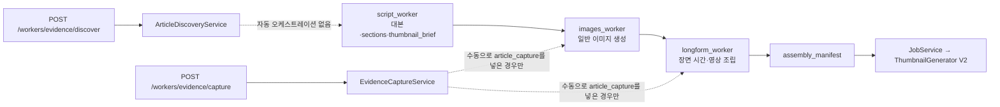
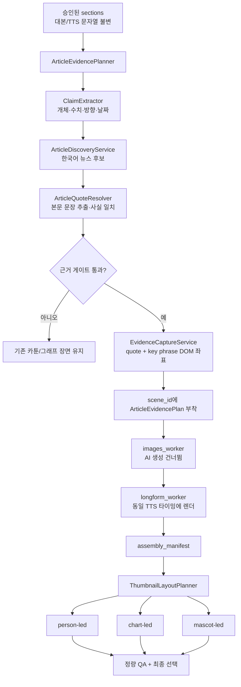

# 개발자 회의 자료: 기사 근거 장면·레퍼런스형 썸네일 V3

작성 기준일: 2026-07-23  
분석 대상: 현재 워킹 트리(아직 커밋되지 않은 변경 포함)  
비교 입력:

- 현재 기사 결과: `/Users/songtaeho/Downloads/실제 한국어 기사 강조 장면.png`
- 현재 썸네일 결과: `/Users/songtaeho/Downloads/레퍼런스형 썸네일.png`
- 썸네일 도달점: `/var/folders/2t/97vrh06x4t5c6tb1bc6_jb_c0000gn/T/codex-clipboard-e5bf7be6-d27b-4471-8322-cd20b3be4311.png`

이 문서는 재구현 전 합의를 위한 분석 문서다. 이 문서 생성 자체는 렌더러, 대본, TTS, 배포 동작을 변경하지 않는다.

## 1. 결론

현재 구현은 “한국어 기사 원문 픽셀을 캡처하고 DOM 좌표로 강조한다”와 “완성 영상에 사용된 장면을 썸네일 소재로 선택한다”는 기반까지는 도달했다. 그러나 사용자가 요구한 자동 완성 흐름과 레퍼런스 수준의 조형 품질에는 다음 네 가지 구조적 공백이 있다.

1. 기사 강조 규칙이 정책 객체가 아니라 렌더러에 하드코딩되어 있다. 현재 `article_scene.py`는 본문에 형광펜, 빨간 밑줄, 빨간 사각형을 한꺼번에 적용한다. 구형 `article_evidence` 경로의 기본값도 밑줄과 사각형을 동시에 추가한다.
2. 뉴스 검색과 캡처 API는 있으나 자동 파이프라인에 연결되어 있지 않다. 대본 장면에서 관련 한국어 기사를 찾아 `article_capture`를 생성하는 호출자는 현재 없다.
3. 썸네일 V2는 레이아웃 뼈대만 구현되어 있다. 피사체 품질·인물 선명도·레이어 역할·카피 폭·표정·그래프 의미 좌표를 계획하지 않고 밝기와 에지 점수로 영상 장면을 고른다.
4. 기사 근거 장면, 썸네일, 대본/TTS의 책임 경계가 계약으로 고정되지 않았다. 올바른 방향은 대본 문장을 변경하는 것이 아니라, 승인된 대본의 `scene_id`에 근거 캡처와 썸네일용 시각 메타데이터를 붙이는 것이다.

따라서 다음 구현의 핵심은 “더 강한 이미지 생성 프롬프트”가 아니라 아래 두 개의 결정론적 계획 계층이다.

- `ArticleEvidencePlanner`: 장면 주장 → 한국어 뉴스 후보 → 원문 문장 → DOM 캡처 → 강조 정책 → 같은 장면 타이밍
- `ThumbnailLayoutPlanner`: 영상에 실제 사용된 고품질 소재 → 역할별 레이어 → 카피 계층 → 3개 변형 → 정량 QA

## 2. 사용자가 확정한 편집 규칙

### 2.1 기사 제목과 본문

| 영역 | 허용 | 금지 |
|---|---|---|
| 제목 | 실제 텍스트 범위만 빨간 사각형 | 제목 여백 전체를 과도하게 감싸기 |
| 본문 A | 빨간 밑줄만 | 같은 대상에 빨간 밑줄과 빨간 사각형 동시 적용 |
| 본문 B | 빨간 사각형만 | 같은 대상에 빨간 밑줄과 빨간 사각형 동시 적용 |
| 본문 C | 형광펜만 | 근거 문장 외 영역 강조 |
| 본문 D | 형광펜 + 빨간 밑줄 | 형광펜 + 밑줄 + 빨간 사각형 |

“빨간 줄”은 이 문서에서 `underline`으로 정의한다. “빨간 테두리”는 `rect`로 정의한다. 둘은 같은 본문 대상에 함께 쓰지 않는다. 형광펜은 `underline`과 함께 쓸 수 있다. 제목의 `rect`는 본문 규칙과 독립적이다.

### 2.2 기사와 대본의 관계

- 기사 선택은 승인된 대본 장면의 주장과 수치에 근거해야 한다.
- 기사 원문에 실제로 존재하는 문장만 표시한다.
- 기사 장면을 넣기 위해 대본 문장, TTS 문자열, 음성 속도, 문장부호를 바꾸지 않는다.
- 선택된 근거 장면은 해당 주장을 읽는 `scene_id`에 붙인다.
- 적합한 기사가 없거나 원문 문장을 검증하지 못하면 일반 카툰/그래프 장면을 유지한다. 가짜 기사 카드로 대체하지 않는다.

### 2.3 썸네일과 기사 장면의 관계

둘은 별개다. 기사 캡처가 존재한다고 해서 썸네일이 기사 캡처를 사용해야 하는 것은 아니다. 썸네일은 클릭을 위한 별도 시각 편집물이고, 기사 장면은 영상 내부의 근거 제시물이다. 공통으로 사용할 수 있는 것은 `verified_facts`와 출처 메타데이터뿐이다.

## 3. 현재 파이프라인의 실제 상태



### 3.1 이미 되는 것

- Naver 뉴스 검색 API 래퍼가 있다.
- 허용 언론사 정책과 공개 URL 검증이 있다.
- Playwright `Range.getClientRects()` 기반 기사 문장 좌표 캡처가 있다.
- 캡처 원문은 Gemini/Kling으로 보내지 않고 비용 0의 결정론적 장면으로 유지할 수 있다.
- 롱폼 조립은 `article_scene`을 정적 장면으로 렌더링하고 Kling을 비활성화한다.
- 기사 장면은 현재 장면의 길이를 그대로 사용하므로, `scene_id`에 제대로 붙기만 하면 TTS 타이밍을 보존할 수 있다.
- 썸네일은 `assembly_manifest`에 기록된 실제 영상 장면을 후보로 받을 수 있다.
- 승인된 실제 인물 사진은 라이선스 확인 후 `rembg` 컷아웃으로 합성할 수 있다.
- 선택된 캐릭터 경로가 있으면 기본 캐릭터 대신 해당 자산을 사용할 수 있다.

### 3.2 아직 안 되는 것

- 대본에서 기사 검색용 주장과 검색어를 자동 생성하지 않는다.
- 검색 후보에서 기사 본문의 정확한 문장을 자동 추출·검증하지 않는다.
- 검색 → 캡처 → `scene["article_capture"]` 주입을 실행하는 오케스트레이터가 없다.
- 기사 선택 결과와 장면 ID를 연결한 감사 로그가 없다.
- DOM 캡처에서 `key_phrase`의 별도 좌표를 저장하지 않는다.
- 기사 강조 스타일을 장면별로 선택할 계약이 없다.
- 썸네일 V2는 한 개 변형만 반환한다.
- 썸네일 카피가 대부분 `키워드 + 지금 확인할 핵심`으로 고정되어 있다.
- 썸네일 소재 선택은 사람 얼굴·마스코트·차트의 의미를 이해하지 않고 픽셀 밝기/에지만 본다.
- Spring 호출부는 FastAPI가 지원하는 `watermark_path`를 보내지 않는다.

## 4. 기사 결과가 아직 다른 직접 원인

### 4.1 강조 효과가 세 겹으로 중첩된다

`ArticleSceneRenderer.render()`는 현재 다음 순서로 항상 실행한다.

1. `highlight_multiply(canvas, quote_boxes)`
2. 제목 `rect`
3. 모든 `key_boxes`에 `rect`
4. 모든 본문 `quote_boxes`에 `underline`
5. DOM 경로에서는 `key_boxes=[]`이므로 첫 번째 본문 줄에 다시 `rect`

즉 현재 샘플의 “초록 형광펜 + 빨간 밑줄 + 빨간 사각형”은 우연한 렌더링 오류가 아니라 코드에 명시된 결과다. 특히 실제 DOM 캡처 경로에서는 `key_phrase` 좌표를 구하지 못해 첫 줄 전체를 임의로 사각형 처리한다.

구형 `article_evidence` 오버레이 경로도 `_default_capture_annotations()`에서 `quote_bboxes`에는 밑줄, `target_bbox`에는 사각형을 동시에 넣는다. 따라서 두 렌더 경로 모두 같은 사용자 규칙을 위반한다.

### 4.2 실제 DOM 좌표와 편집 좌표의 의미가 섞여 있다

현재 `ArticleCapture`에는 다음 좌표만 있다.

- `target_bbox`: 전체 인용문 합집합
- `quote_bboxes`: 줄별 DOM Range 사각형

하지만 편집자가 필요로 하는 좌표는 서로 다르다.

- 제목 실제 글자 영역
- 본문 전체 인용문
- 강조할 핵심 구절
- 출처/날짜 영역

`target_bbox`를 핵심 구절처럼 사용하면 전체 문장에 사각형이 생긴다. `key_phrase`를 정확히 감싸려면 캡처 시 DOM Range를 한 번 더 계산해 `key_phrase_bboxes`로 저장해야 한다.

### 4.3 기사 검색은 API 섬으로 남아 있다

`main.py`에는 `/workers/evidence/discover`와 `/workers/evidence/capture`가 있지만 Spring `FastApiClient`, `JobService`, `script_worker`, `images_worker` 어느 곳에도 discover/capture 호출이 없다. 현재 자동 생성은 `article_capture`가 외부에서 이미 들어온 경우만 통과시킨다.

### 4.4 검색 점수는 기사 제목·요약의 단순 토큰 포함률이다

현재 점수는 `matched terms / tokens`와 제목 길이의 작은 가산점뿐이다. 다음을 검증하지 않는다.

- 대본과 기사의 수치 일치
- 상승/하락, 증가/감소 방향 일치
- 회사·인물·국가 등 핵심 개체 일치
- 기사 본문에 캡처 가능한 정확한 문장이 존재하는지
- 대본 장면과 기사 발행일의 관계

이 상태에서 자동화를 바로 연결하면 “관련 키워드가 들어간 다른 사건”을 캡처할 위험이 있다.

### 4.5 캡처 CSS가 기사 사이트의 인상을 과도하게 평준화한다

허용 언론사 컨테이너의 모든 `p, div`에 46px 글꼴과 동일한 행간을 적용한다. 원문 가독성을 높이는 장점은 있지만, 사이트 고유의 제목/본문 계층과 문단 간격이 사라지고 “실제 기사 캡처”보다 재편집된 문서처럼 보일 수 있다. 다음 버전은 선택된 본문 문단만 확대하고 사이트 제목·메타 영역은 보존해야 한다.

## 5. 썸네일 결과가 레퍼런스와 아직 다른 직접 원인

### 5.1 현재 결과의 구성

- 흐릿한 영상 프레임 한 장을 상단 주 배경으로 사용
- 상단 오른쪽에 큰 원형 마스코트
- 고정 좌표의 점선 원
- 왼쪽 상단 말풍선
- 화면 높이의 46%를 차지하는 검정 텍스트 선반
- 세 줄의 균일한 흰색/노란색 카피

이 구성은 “썸네일다운 큰 글자”에는 도달했지만, 레퍼런스가 반복해서 사용하는 “선명한 실제 인물 + 관련 그래프/로고/사건 배경 + 작은 채널 캐릭터 + 두 단계 카피”와는 소재와 역할 배치가 다르다.

### 5.2 소스 선택이 시각적 역할이 아니라 밝기·에지 점수다

`asset_selector._score()`는 160×90 그레이스케일의 평균 밝기와 에지 분산만 계산한다. 얼굴이 흐리거나 인물이 작아도 에지가 많으면 선택될 수 있다. `source_scene_ids`와 대본 훅의 연관성도 V2 선택 점수에 반영되지 않는다.

필요한 점수는 최소한 다음과 같이 분리돼야 한다.

- `relevance_score`: 훅/핵심 수치/대상과 장면 메타데이터 일치
- `person_score`: 얼굴 크기, 선명도, 가림 여부, 표정
- `chart_score`: 차트 영역 크기와 검증 데이터 존재 여부
- `mascot_score`: 선택 캐릭터 ID와 표정 자산 일치
- `composition_score`: 텍스트 안전 영역과 피사체 충돌
- `quality_score`: 원본 해상도, 블러, JPEG 열화

### 5.3 실제 콜라주가 아니라 “주 배경 + 보조 이미지 한 장 페이드”다

`BaseTemplate.collage_background()`는 주 이미지와 보조 이미지 최대 한 장만 합성한다. 레퍼런스는 인물 컷아웃, 차트, 기업 로고, 사건 배경, 마스코트가 각각 독립 레이어로 배치된다. 현재는 이 역할 모델과 z-order가 없다.

### 5.4 인물과 템플릿 선택이 지나치게 강제적이다

`ThumbnailGenerator.render()`는 `person_photos`가 하나라도 있으면 원래 브리프를 무조건 `person_headline`으로 바꾼다. 그러면 “인물 + 차트 + 작은 마스코트” 같은 레퍼런스 조합을 만들 수 없다. 반대로 인물 사진이 없으면 흐린 영상 프레임 속 얼굴을 그대로 쓰기 쉽다.

### 5.5 마스코트가 커서 주요 정보와 경쟁한다

현재 V2 마스코트 최대 높이는 화면의 55%, 폭은 36%다. 레퍼런스의 마스코트는 주인공인 경우도 있지만, 실제 인물이 주인공인 썸네일에서는 대개 더 작은 보조 역할이다. 역할에 따라 `hero`, `support`, `badge` 크기를 달리해야 한다.

### 5.6 점선 원과 말풍선이 의미 좌표가 아니다

`ChartWarningTemplate`의 점선 원은 마스코트 유무에 따라 고정 좌표 두 개 중 하나를 사용한다. 실제 그래프 급등점이나 숫자의 DOM/렌더 좌표를 사용하지 않는다. 말풍선도 항상 왼쪽 상단이며 꼬리가 실제 발화자/그래프를 가리키지 않는다.

### 5.7 카피 기획이 약하고 변형 생성이 없다

`_build_thumbnail_brief()`는 대부분 다음 두 줄을 만든다.

- `<keyword>`
- `지금 확인할 핵심`

레퍼런스의 카피는 구체적인 사건, 긴장, 숫자, 질문을 사용한다. 예: “이란 전쟁 / 진짜 언제까지 갈까?”, “역대급 몰락?! / 지금 이 3가지 모르면…”. 이를 그대로 복사할 필요는 없지만 같은 정보 계층은 필요하다.

또한 `ThumbnailV2Composer`는 호출 인터페이스의 `variants`와 무관하게 항상 한 장만 저장한다. 서로 다른 구도를 비교·선택하는 품질 루프가 없다.

### 5.8 브리프의 출처 참조 문자열이 서로 다르다

브리프 생성기는 배지에 `verified_facts[n]`를 넣지만 `validate_brief()`는 `facts[n]`만 유효한 참조로 만든다. 검증된 수치가 있는 작업에서 배지 검증 실패를 일으킬 수 있는 계약 불일치다.

### 5.9 워터마크 전달이 끊겨 있다

FastAPI `ThumbnailRequest`와 `ThumbnailGenerator`는 `watermark_path`를 지원하지만 Spring의 `generateThumbnailImage()` 요청 본문에는 필드가 없다. 샘플이나 수동 호출에서는 보일 수 있어도 정상 제품 호출 경로에서는 워터마크가 전달되지 않는다.

## 6. 목표 아키텍처



## 7. 제안 데이터 계약

### 7.1 기사 강조 정책

```python
from typing import Literal
from pydantic import BaseModel, Field, model_validator

BodyEmphasisMode = Literal[
    "underline",
    "rect",
    "highlighter",
    "highlighter_underline",
]

class ArticleEmphasisPolicy(BaseModel):
    headline_mode: Literal["rect", "none"] = "rect"
    body_mode: BodyEmphasisMode
    body_target: Literal["quote", "key_phrase"] = "quote"
    red: str = "#E60023"
    highlighter: str = "#39E65A"

    @model_validator(mode="after")
    def reject_red_primitive_stacking(self):
        # body_mode에 underline+rect 조합 자체가 존재하지 않는다.
        return self

class ArticleEvidencePlan(BaseModel):
    scene_id: str
    claim_text: str
    query: str
    query_terms: list[str]
    source_url: str
    publisher: str
    published_at: str | None
    quote: str
    key_phrase: str | None = None
    capture: ArticleCapture
    emphasis: ArticleEmphasisPolicy
    match_score: float = Field(ge=0, le=100)
    match_reasons: list[str]
    tts_text_sha256: str
```

권장 기본값:

- 제목: `rect`
- 본문: `highlighter_underline`
- 핵심 구절을 박스로 보여줄 필요가 있는 경우: `rect`만 사용하고 밑줄은 끈다.
- 형광펜 없는 단순 기사 느낌이 필요한 경우: `underline`

### 7.2 DOM 좌표 계약 확장

```python
class ArticleCapture(BaseModel):
    # 기존 필드 유지
    quote_bboxes: list[NormalizedBBox]
    target_bbox: NormalizedBBox

    # 추가
    key_phrase: str | None = None
    key_phrase_bboxes: list[NormalizedBBox] = []
    source_headline_bbox: NormalizedBBox | None = None
    article_container_bbox: NormalizedBBox | None = None
```

`key_phrase_bboxes`는 Pillow에서 추정하지 않고 브라우저 DOM Range로 얻는다. 핵심 구절이 기사 원문에 정확히 없으면 박스 모드를 거부한다.

### 7.3 썸네일 레이아웃 계약

```python
class ThumbnailLayer(BaseModel):
    role: Literal[
        "hero_person", "hero_mascot", "support_mascot",
        "chart", "logo", "event_background", "speech_bubble",
    ]
    asset_id: str
    source_scene_id: str
    z_index: int
    anchor: Literal["left", "center", "right"]
    max_width_ratio: float
    max_height_ratio: float

class ThumbnailCopyLine(BaseModel):
    text: str
    tone: Literal["white", "yellow", "red"]
    importance: int
    target_width_ratio: float = 0.90

class ThumbnailLayoutPlan(BaseModel):
    preset: Literal["person_led", "chart_led", "mascot_led"]
    layers: list[ThumbnailLayer]
    copy: list[ThumbnailCopyLine]
    focus_target: dict | None
    character_identity_hash: str | None
    source_scene_ids: list[str]
```

## 8. 기사 자동 탐색·삽입 알고리즘

### 8.1 장면 후보 선택

대본 전체에 기사를 남발하지 않는다. 다음 조건을 만족하는 장면만 후보로 한다.

- 회사, 인물, 국가, 정책, 지수 중 하나 이상의 명시적 개체
- 날짜, 비율, 금액, 지수 중 하나 이상의 검증 가능한 사실
- `verified_facts` 또는 `market_snapshot`으로 교차 검증 가능한 문장
- 도입 감탄사나 개인 의견만 있는 장면은 제외

권장 빈도는 60~90초당 최대 1개, 전체 영상 최대 3~5개다.

### 8.2 검색 질의

장면 원문을 그대로 긴 질의로 보내지 않는다.

```text
핵심 개체 1~2개 + 정책/사건 + 핵심 수치 또는 날짜
예: 코스피 반도체 7000 2026 7월
```

제목·요약 후보 점수:

| 항목 | 가중치 |
|---|---:|
| 핵심 개체 일치 | 20 |
| 핵심 수치 일치 | 30 |
| 상승/하락·증가/감소 방향 일치 | 15 |
| 사건/정책 용어 일치 | 15 |
| 발행일 적합성 | 10 |
| 허용 언론사/원문 URL | 10 |

수치 또는 방향이 충돌하면 가중치 차감이 아니라 즉시 탈락시킨다.

### 8.3 원문 문장 선택

상위 3개 후보의 허용 컨테이너 본문을 읽고 문장 단위로 분리한다. `rapidfuzz`와 현재 설치된 `scikit-learn`을 사용할 수 있지만, 최종 게이트는 의미 유사도보다 명시 사실 일치가 우선이다.

```python
def resolve_quote(scene_claim, article_sentences, required_entities, required_numbers):
    candidates = []
    for sentence in article_sentences:
        if not required_entities <= entities(sentence):
            continue
        if not required_numbers <= normalized_numbers(sentence):
            continue
        if direction(sentence) != direction(scene_claim):
            continue
        score = lexical_score(scene_claim, sentence)
        candidates.append((score, sentence))
    return max(candidates, default=None)
```

선택 문장은 최대 두 문장이다. 캡처 전 `request.quote`가 DOM에 정확히 존재하는지 현재 `capture_dom()`이 다시 검증한다.

### 8.4 장면 주입

`sections`의 순서나 `content`를 바꾸지 않고 같은 딕셔너리에 시각 정보만 붙인다.

```python
scene["visual_kind"] = "article_scene"
scene["visual_type"] = "article_evidence"
scene["article_capture"] = capture.model_dump(mode="json")
scene["article_emphasis"] = policy.model_dump()
scene["evidence_match"] = {
    "claim": claim,
    "score": score,
    "reasons": reasons,
}
```

`content`, `sentences`, `duration`, `elevenlabs_hint`는 변경하지 않는다. 주입 전후 `tts_text_sha256`가 다르면 작업을 중단한다.

### 8.5 타이밍

현재 롱폼 워커는 TTS 청크를 기준으로 장면 `duration/start_time/end_time`을 계산한다. 기사 장면을 새 대본 장면으로 삽입하지 않고 기존 `scene_id`의 시각 종류만 교체하면 해당 문장을 읽는 시간에 정확히 표시된다.

더 세밀한 구간이 필요하면 TTS 문자열을 자르는 대신 아래 메타데이터만 추가한다.

```json
{
  "evidence_reveal": {
    "start_ratio": 0.18,
    "emphasis_ratio": 0.42,
    "end_ratio": 0.95
  }
}
```

## 9. 기사 렌더러 수정안

`ArticleSceneSpec`에 정책을 넣고 하드코딩된 중첩을 제거한다.

```python
@dataclass(frozen=True)
class ArticleSceneSpec:
    evidence_quote: str
    key_phrase: str = ""
    emphasis: ArticleEmphasisPolicy = ArticleEmphasisPolicy(
        headline_mode="rect",
        body_mode="highlighter_underline",
    )
    channel_watermark_path: str | None = None

def _apply_body_emphasis(image, boxes, policy):
    if policy.body_mode == "underline":
        underline(image, boxes)
    elif policy.body_mode == "rect":
        for box in boxes:
            rect(image, box)
    elif policy.body_mode == "highlighter":
        image = highlight_multiply(image, boxes)
    elif policy.body_mode == "highlighter_underline":
        image = highlight_multiply(image, boxes)
        underline(image, boxes)
    return image
```

중요: `rect` 대상이 `key_phrase`이면 `capture.key_phrase_bboxes`가 반드시 있어야 한다. 없으면 `quote` 전체로 조용히 폴백하지 말고 검증 오류를 내야 한다.

구형 `_default_capture_annotations()`도 정책을 받아 아래 중 하나만 반환해야 한다.

```python
{"type": "underline", "bboxes": quote_bboxes}
```

또는

```python
{"type": "rect", "bboxes": key_phrase_bboxes}
```

형광펜은 별도 투명 레이어이므로 `underline`과 같이 허용한다.

## 10. 썸네일 재구현안

### 10.1 3개 프리셋

| 프리셋 | 주 피사체 | 보조 요소 | 적합한 주제 |
|---|---|---|---|
| `person_led` | 선명한 실제 인물 컷아웃 45~60% | 작은 차트/로고/마스코트 | 기업 CEO, 정치·정책, 유명 투자자 |
| `chart_led` | 검증 그래프/핵심 숫자 | 선택 캐릭터 18~28% | 지수 돌파, 급락/급등, 실적 |
| `mascot_led` | 선택 캐릭터 35~48% | 차트/기업 로고/사건 배경 | 교육형, 행동 지침, 일반 시장 해설 |

인물과 마스코트를 같이 쓸 수는 있지만 `person_led`에서는 마스코트를 보조 크기로 제한한다. 현재처럼 `person_photos`가 있다는 이유만으로 템플릿을 강제 교체하지 않는다.

### 10.2 레이어 구성

1. 배경: 사건/시장 맥락을 주는 영상 내 장면
2. 그래프·로고: 검증된 자산, 별도 레이어
3. 실제 인물 또는 선택 캐릭터: 투명 컷아웃과 외곽광
4. 의미 강조: 실제 그래프 좌표 기반 점선 원/화살표
5. 카피: 2~3줄, 흰색/노란색/빨간색 최대 3색
6. 워터마크: 항상 마지막

상단 이미지를 단순 한 장 크롭으로 만들지 않고 각 역할 레이어가 별도 안전 영역과 z-order를 가진다.

### 10.3 카피 플래너

카피는 기사 캡처 문장이 아니라 대본의 훅과 검증 사실에서 독립적으로 만든다.

```text
1행: 사건/대상 — 흰색
2행: 긴장 또는 핵심 수치 — 노란색/빨간색
3행(선택): 시청 이유/질문 — 흰색
```

제약:

- 한 줄 6~16자
- 2줄 우선, 최대 3줄
- 숫자가 핵심이면 한 줄을 빨간색으로 허용
- “지금 확인할 핵심” 같은 범용 문구는 구체적 사실이 없을 때만 폴백
- 레퍼런스 문구의 정확한 내용을 복제하지 않는다.

### 10.4 소재 품질 게이트

권장 최소 기준:

- 원본 가로 1280px 이상, 인물 컷아웃 세로 700px 이상
- 얼굴 높이 220px 이상(1280×720 기준)
- 얼굴 영역 Laplacian variance 또는 동등 블러 점수 하한
- 피사체가 텍스트 안전 영역을 10% 이상 침범하면 탈락
- 선택 캐릭터 `identity_hash`가 작업의 캐릭터 해시와 일치
- 승인되지 않은 실제 인물 사진은 렌더 이전에 탈락
- 그래프 강조 좌표는 차트 렌더러가 제공하고 고정 좌표 사용 금지

### 10.5 변형과 선택

동일 카피로 세 장을 만든다.

1. `person_led`
2. `chart_led`
3. `mascot_led`

사용 가능한 자산이 없는 프리셋은 생략한다. 각 결과에 아래 점수를 저장한다.

- copy legibility 25
- subject prominence 20
- relevance 20
- contrast 15
- identity consistency 10
- clutter penalty 10

자동 최고점을 기본 선택하되 UI에서 세 변형을 바꿀 수 있게 한다.

### 10.6 “영상에 실제 사용된 이미지” 조건

썸네일용 실제 인물 사진을 사용하려면 그 사진 또는 동일 컷아웃이 영상의 한 장면에도 실제로 사용되어 `assembly_manifest`에 기록되어야 한다. 썸네일 전용으로만 외부 사진을 가져오지 않는다. 이를 위해 승인된 인물 사진을 선택한 경우 이미지 단계에서 `person_composite` 장면 하나를 결정론적으로 생성하고, 그 장면 ID를 썸네일 브리프에 넣는다.

## 11. 구현 순서

### P0 — 의미·정합성 오류 제거

1. `ArticleEmphasisPolicy` 추가
2. `ArticleSceneRenderer`의 하드코딩된 삼중 강조 제거
3. `_default_capture_annotations()`의 밑줄+사각형 동시 기본값 제거
4. `key_phrase_bboxes` DOM 캡처 추가
5. `images_worker._article_evidence_path()`가 `visual_kind=article_scene`도 인식하도록 통일
6. 썸네일 `verified_facts[n]` / `facts[n]` 참조 문자열 통일
7. Spring → FastAPI `watermark_path` 전달

### P1 — 자동 기사 파이프라인

1. `ClaimExtractor`
2. `ArticleEvidencePlanner`
3. 기사 본문 문장 추출 및 사실 일치 게이트
4. capture 호출과 `scene_id` 주입
5. TTS 해시 불변 검증
6. 검색·선택·탈락 이유를 `evidence_plan.json`에 저장

### P1 — 썸네일 역할 기반 재구성

1. `ThumbnailLayoutPlan`
2. 역할별 자산 선택기
3. 얼굴/블러/해상도 품질 게이트
4. 다중 레이어 콜라주
5. 의미 좌표 기반 점선 원
6. 3개 변형 생성·채점

### P2 — 편집 UI와 운영

1. 기사 강조 모드 선택 UI
2. 기사 후보/원문 문장/장면 위치 미리보기
3. 썸네일 3개 변형 선택 UI
4. 실패 사유 및 출처 감사 로그 노출

## 12. 테스트 계획

### 12.1 기사 강조 단위 테스트

| 테스트 | 기대 결과 |
|---|---|
| `underline` | 본문 빨간 밑줄만 |
| `rect` | 본문 빨간 사각형만 |
| `highlighter` | 본문 형광펜만 |
| `highlighter_underline` | 형광펜과 빨간 밑줄 |
| 제목 `rect` | 실제 제목 글자 bbox만 |
| key phrase 누락 + rect | 명시적 검증 실패 |
| underline + rect 직접 입력 | 스키마 검증 실패 |

### 12.2 자동 기사 E2E

1. 고정된 한국어 기사 HTML fixture와 Naver 응답 fixture를 사용한다.
2. 대본 장면의 회사명·수치·방향이 일치하는 기사만 선택되는지 확인한다.
3. 수치가 다른 기사는 탈락하는지 확인한다.
4. 선택 문장이 DOM에 정확히 있어야 캡처되는지 확인한다.
5. 전후 `content`와 TTS 해시가 같은지 확인한다.
6. `article_capture`가 같은 `scene_id`에 붙는지 확인한다.
7. 기사 장면이 Gemini/Kling 호출 횟수를 늘리지 않는지 확인한다.
8. assembly manifest의 시작/종료 시간이 기존 TTS 타이밍과 일치하는지 확인한다.

### 12.3 썸네일 테스트

- 세 변형이 실제로 서로 다른 프리셋인지
- 모든 레이어 `source_scene_id`가 assembly manifest에 있는지
- 인물 사진 권리 검증이 실패하면 렌더되지 않는지
- 선택 캐릭터 외 자산이 섞이지 않는지
- 얼굴/캐릭터와 카피 bbox가 충돌하지 않는지
- 카피가 2~3줄, 줄당 16자 이내인지
- 워터마크가 정상 제품 호출 경로에서도 전달되는지
- 1280×720 축소본(320×180)에서도 카피 OCR/대비 기준을 통과하는지

### 12.4 골든 이미지 비교

픽셀 완전 일치는 운영체제 글꼴 차이 때문에 부적절하다. 다음을 골든 기준으로 사용한다.

- 레이어 bbox와 역할
- 색상 비율
- 텍스트 줄 수·점유율
- 얼굴/캐릭터 점유율
- perceptual hash 거리
- SSIM은 같은 런타임 내부 회귀에만 사용

## 13. 완료 기준

### 기사 장면

- 같은 본문 대상에 빨간 밑줄과 빨간 사각형이 함께 나오지 않는다.
- 형광펜 + 밑줄은 정책으로 선택 가능하다.
- 제목 사각형은 실제 제목 글자 영역까지만 감싼다.
- 모든 기사 장면은 대본 장면과 연결된 `scene_id`, 원문 URL, 언론사, 발행일, 정확한 인용문을 가진다.
- 기사 선택 실패 시 원래 카툰/그래프 장면을 보존한다.
- 대본/TTS 텍스트 해시가 시각 계획 전후 동일하다.

### 썸네일

- 한 장의 흐린 영상 캡처에 의존하지 않는다.
- 실제 인물, 선택 캐릭터, 차트가 역할 기반으로 배치된다.
- 인물 주도 썸네일에서는 얼굴이 선명하고 화면의 핵심이 된다.
- 선택 캐릭터의 identity hash가 일치한다.
- 카피는 2~3줄이고 흰색/노란색/빨간색 계층이 명확하다.
- 점선 원은 검증된 그래프 좌표를 가리킨다.
- 최소 2개, 가능하면 3개 변형을 생성한다.
- 최종 사용 자산은 영상 assembly manifest와 권리 레지스트리로 추적 가능하다.

## 14. 회의에서 결정할 항목

1. 기사 장면 기본 본문 모드: `highlighter_underline` 권장
2. 기사 장면 최대 빈도: 60~90초당 1개 권장
3. 기사 자동 선택 점수 하한: 80/100 권장
4. 적합 기사 없음 시 정책: 기존 장면 유지 권장
5. 썸네일 기본 프리셋: 자산이 있으면 `person_led`, 없으면 `chart_led`
6. 썸네일 변형 수: 3개 권장
7. 실제 인물 사진을 영상 장면에도 반드시 사용할지: 기존 요구를 기준으로 “예” 권장

## 15. 핵심 코드 위치 빠른 색인

| 관심사 | 파일/현재 위치 |
|---|---|
| 기사 검색 API | `app/main.py:236-255` |
| 기사 후보 점수 | `services/article_discovery.py:28-80` |
| DOM 캡처 | `services/evidence_capture.py:165-288` |
| 기사 좌표 모델 | `models/article_evidence.py` |
| 기사 프레임 크롭 | `services/article/frame_editor.py` |
| 삼중 강조 직접 원인 | `services/scene_frames/article_scene.py:47-74` |
| 구형 기본 밑줄+박스 | `workers/longform_worker.py:_default_capture_annotations` |
| 기사 장면 조립 | `workers/longform_worker.py:_prepare_deterministic_scene_asset` |
| 썸네일 범용 브리프 | `workers/script_worker.py:_build_thumbnail_brief` |
| V2 소재 점수 | `services/thumbnail/v2/asset_selector.py` |
| V2 콜라주 | `services/thumbnail/v2/templates/base.py` |
| 고정 점선 원/말풍선 | `services/thumbnail/v2/templates/chart_warning.py` |
| 실제 인물 컷아웃 | `services/thumbnail/person_compositor.py` |
| 제품 호출 누락 | `FastApiClient.java:generateThumbnailImage` |

---

# 전체 코드 부록

아래 코드는 문서 생성 시점의 현재 워킹 트리를 파일 단위로 그대로 포함한다. 각 파일 제목에 SHA-256을 기록해 회의 중 코드가 바뀌었는지 확인할 수 있다. 대형 워커도 관련 오케스트레이션 누락 여부를 검증하기 위해 축약하지 않았다.

## 부록 1. `backend/fastapi-workers/app/main.py`

SHA-256: `e86da4c62d4d733091b9012d649b137e6a2e0511e3d8f91cf917cdf2f7c5596c`

````python
import os
import json
import logging
import hashlib
from pathlib import Path
from typing import Any, Dict, List, Optional

from fastapi import FastAPI, UploadFile, File, Form, HTTPException, Query
from fastapi.responses import FileResponse, Response, JSONResponse
from pydantic import BaseModel, Field

from app.workers.shorts_worker import ShortsWorker
from app.workers.keyword_worker import KeywordWorker
from app.workers.script_worker import ScriptWorker, ScriptResearchRequiredError
from app.workers.tts_worker import TtsWorker
from app.workers.images_worker import ImagesWorker, ImageProviderCreditRequiredError
from app.workers.longform_worker import LongformWorker
from app.workers.sfx_worker import SfxWorker
from app.workers.bgm_worker import BgmWorker
from app.workers.pronunciation_manager import PronunciationManager
from app.config import APP_MODE, CLAUDE_MODEL
from app import runtime_config
from app.utils.fal_billing import get_fal_credit_status
from app.utils.art_direction import compile_editorial_prompt
from app.models.article_evidence import EvidenceCaptureRequest, QuoteCardRequest
from app.services.article_discovery import ArticleDiscoveryService, ArticleDiscoveryUnavailable
from app.services.evidence_capture import EvidenceCaptureError, EvidenceCaptureService

logging.basicConfig(level=logging.INFO)
logger = logging.getLogger(__name__)

app = FastAPI(title="AI Video Pipeline Workers", version="0.5.0")

DATA_DIR = Path("/app/data")
DATA_DIR.mkdir(parents=True, exist_ok=True)

shorts_worker = None
keyword_worker = None
script_worker = None
tts_worker = None
images_worker = None
longform_worker = None
sfx_worker = None
bgm_worker = None
evidence_capture_service = None


def get_shorts_worker():
    global shorts_worker
    if shorts_worker is None:
        shorts_worker = ShortsWorker()
    return shorts_worker

def get_keyword_worker():
    global keyword_worker
    if keyword_worker is None:
        keyword_worker = KeywordWorker()
    return keyword_worker

def get_script_worker():
    global script_worker
    if script_worker is None:
        script_worker = ScriptWorker()
    return script_worker

def get_tts_worker():
    global tts_worker
    if tts_worker is None:
        tts_worker = TtsWorker()
    return tts_worker

def get_images_worker():
    global images_worker
    if images_worker is None:
        images_worker = ImagesWorker()
    return images_worker

def get_longform_worker():
    global longform_worker
    if longform_worker is None:
        longform_worker = LongformWorker()
    return longform_worker

def get_sfx_worker():
    global sfx_worker
    if sfx_worker is None:
        sfx_worker = SfxWorker()
    return sfx_worker

def get_bgm_worker():
    global bgm_worker
    if bgm_worker is None:
        bgm_worker = BgmWorker()
    return bgm_worker


def get_evidence_capture_service() -> EvidenceCaptureService:
    global evidence_capture_service
    if evidence_capture_service is None:
        evidence_capture_service = EvidenceCaptureService()
    return evidence_capture_service


@app.on_event("startup")
async def startup_event():
    """서버 시작 시 발음 사전 초기화"""
    try:
        result = PronunciationManager.get_instance().initialize()
        logger.info(f"발음 사전 초기화: {result}")
    except Exception as e:
        logger.warning(f"발음 사전 초기화 실패 (TTS는 정상 작동): {e}")


@app.on_event("shutdown")
async def shutdown_event():
    """Gracefully release the worker-lifetime Chromium process."""
    EvidenceCaptureService.shutdown()


@app.get("/health")
def health():
    return {"status": "ok", "mode": APP_MODE, "claude_model": CLAUDE_MODEL}


@app.get("/providers/status")
def provider_status():
    return {
        "youtube": {"configured": bool(os.environ.get("YOUTUBE_API_KEY", "").strip()), "provider": "YouTube Data API v3"},
        "anthropic": {"configured": bool(os.environ.get("ANTHROPIC_API_KEY", "").strip())},
        "elevenlabs": {"configured": bool(os.environ.get("ELEVENLABS_API_KEY", "").strip())},
        "gemini": {
            "image_model": "gemini-3-pro-image",
            "quality_tier": runtime_config.value("image_quality_tier"),
        },
        "fal": get_fal_credit_status(),
    }


# ============================
# 신규 — 파이프라인 파라미터 실시간 조정 API
#
# TTS 속도, ElevenLabs 목소리 설정, BGM 볼륨, 자막 크기, Kling 인트로
# 길이 등을 여기로 GET/POST하면 코드 수정이나 Docker 재빌드 없이
# 다음 Job부터 바로 반영됩니다.
# ============================
class PipelineConfigUpdate(BaseModel):
    tts_speed: Optional[float] = None
    chars_per_minute: Optional[int] = None
    scene_duration_sec: Optional[float] = None
    subtitle_max_chars: Optional[int] = None
    subtitle_font_size: Optional[int] = None
    subtitle_theme: Optional[str] = None
    image_headline_overlay: Optional[bool] = None
    image_provider: Optional[str] = None
    image_quality_tier: Optional[str] = None
    pro_image_max_scenes: Optional[int] = None
    gemini_pro_batch_enabled: Optional[bool] = None
    gemini_pro_batch_fallback_enabled: Optional[bool] = None
    gemini_service_tier: Optional[str] = None
    gemini_pro_max_attempts: Optional[int] = None
    gemini_pro_retry_base_seconds: Optional[float] = None
    gemini_pro_request_delay_seconds: Optional[float] = None
    gemini_parallel_enabled: Optional[bool] = None
    gemini_max_concurrency: Optional[int] = None
    gemini_retry_max: Optional[int] = None
    gemini_rpm_soft_cap: Optional[int] = None
    gemini_adaptive_backoff_enabled: Optional[bool] = None
    longform_scene_max_workers: Optional[int] = None
    visual_qa_enabled: Optional[bool] = None
    visual_qa_max_scenes: Optional[int] = None
    elevenlabs_voice_id: Optional[str] = None
    elevenlabs_stability: Optional[float] = None
    elevenlabs_similarity_boost: Optional[float] = None
    elevenlabs_style: Optional[float] = None
    tts_model_intro: Optional[str] = None
    tts_model_body: Optional[str] = None
    tts_stability_intro: Optional[float] = None
    tts_stability_body: Optional[float] = None
    tts_cer_threshold: Optional[float] = None
    tts_max_retries: Optional[int] = None
    tts_postprocess_enabled: Optional[bool] = None
    tts_sentence_pause_ms: Optional[int] = None
    tts_paragraph_pause_ms: Optional[int] = None
    bgm_volume: Optional[float] = None
    intro_motion_seconds_short: Optional[float] = None
    intro_motion_seconds_long: Optional[float] = None
    intro_motion_short_threshold: Optional[float] = None
    intro_kling_max_clips: Optional[int] = None
    img_cost_flash_1k_usd: Optional[float] = None
    img_cost_pro_2k_usd: Optional[float] = None
    kling_cost_per_clip_usd: Optional[float] = None
    usd_krw: Optional[float] = None
    max_budget_per_video_krw: Optional[int] = None
    budget_retry_buffer_pct: Optional[float] = None
    keyword_score_weight_multiple: Optional[float] = None
    keyword_score_weight_velocity: Optional[float] = None
    keyword_score_weight_like: Optional[float] = None
    keyword_score_weight_comment: Optional[float] = None
    keyword_like_rate_benchmark: Optional[float] = None
    keyword_comment_rate_benchmark: Optional[float] = None
    render_speech_bubbles: Optional[bool] = None
    render_article_evidence: Optional[bool] = None
    bubble_font_max_px: Optional[int] = None
    bubble_font_min_px: Optional[int] = None
    subtitle_safe_area_pct: Optional[float] = None


@app.get("/pipeline/config")
def get_pipeline_config():
    """현재 적용 중인 파이프라인 파라미터 전체를 반환합니다."""
    return runtime_config.get()


@app.post("/pipeline/config")
def update_pipeline_config(update: PipelineConfigUpdate):
    """전달된 파라미터만 즉시 갱신합니다. (다음 Job부터 바로 반영, 재빌드 불필요)"""
    try:
        updated = runtime_config.update(**update.dict(exclude_none=True))
        return {"status": "ok", "config": updated}
    except (KeyError, ValueError) as e:
        raise HTTPException(400, str(e))


@app.post("/pipeline/config/reset")
def reset_pipeline_config():
    """환경변수 기본값으로 되돌립니다."""
    return {"status": "ok", "config": runtime_config.reset_to_env_defaults()}


class ArticleDiscoveryRequest(BaseModel):
    query: str
    terms: List[str] = []
    limit: int = 10


@app.post("/workers/evidence/discover")
def discover_article_candidates(request: ArticleDiscoveryRequest):
    """Return attributable public-news candidates; this does not capture them."""
    try:
        candidates = ArticleDiscoveryService().discover(request.query, request.terms, request.limit)
        return {"query": request.query, "candidates": [item.model_dump() for item in candidates]}
    except ArticleDiscoveryUnavailable as exc:
        raise HTTPException(503, str(exc))
    except Exception as exc:
        logger.exception("article discovery failed")
        raise HTTPException(502, f"article discovery failed: {exc}")


@app.post("/workers/evidence/capture")
def capture_article_evidence(request: EvidenceCaptureRequest):
    """Capture one public HTML article quote using DOM text coordinates."""
    try:
        return get_evidence_capture_service().capture_dom(request).model_dump(mode="json")
    except EvidenceCaptureError as exc:
        raise HTTPException(exc.status_code, str(exc))


@app.post("/workers/evidence/render-quote-card")
def render_quote_card(request: QuoteCardRequest):
    """Render a clearly labelled editorial quote card, never a fake article."""
    try:
        return get_evidence_capture_service().render_quote_card(request).model_dump(mode="json")
    except EvidenceCaptureError as exc:
        raise HTTPException(exc.status_code, str(exc))


@app.get("/workers/quality/{job_id}")
def get_quality_report(job_id: int, stage: Optional[str] = None):
    """Return persisted deterministic quality-gate results for a job."""
    quality_dir = DATA_DIR / "jobs" / str(job_id) / "quality"
    if not quality_dir.exists():
        raise HTTPException(404, "quality report not found")
    allowed = {"tts", "images", "longform"}
    stages = [stage] if stage else sorted(allowed)
    if stage and stage not in allowed:
        raise HTTPException(400, "invalid quality report stage")
    reports = {}
    for name in stages:
        path = quality_dir / f"{name}.json"
        if path.exists():
            try:
                reports[name] = json.loads(path.read_text(encoding="utf-8"))
            except (OSError, json.JSONDecodeError):
                reports[name] = {"error": "unreadable quality report"}
    if not reports:
        raise HTTPException(404, "quality report not found")
    return {"job_id": job_id, "reports": reports}


# ============================
# Phase 2 — 쇼츠
# ============================
class ShortsSegment(BaseModel):
    index: int
    text: Optional[str] = None
    start: float
    end: float
    reason: Optional[str] = None

class ShortsCutRequest(BaseModel):
    source_video_path: str
    segments: List[ShortsSegment]
    job_id: Optional[int] = 0

@app.post("/workers/shorts/analyze")
async def analyze_shorts(file: UploadFile = File(...), shorts_count: int = Query(default=3), job_id: int = Query(default=0)):
    if not file.filename or not file.filename.lower().endswith((".mp4", ".mov", ".avi", ".mkv")):
        raise HTTPException(400, "지원하지 않는 형식.")
    job_dir = DATA_DIR / "jobs" / str(job_id)
    job_dir.mkdir(parents=True, exist_ok=True)
    ext = os.path.splitext(file.filename)[1].lower() or ".mp4"
    source_path = job_dir / f"source{ext}"
    content = await file.read()
    with open(source_path, "wb") as f: f.write(content)
    try:
        analysis = get_shorts_worker().analyze(str(source_path), shorts_count=shorts_count)
        # Whisper provides timestamps; the LLM turns each timestamped chunk
        # into a concise, readable scene script without changing its range.
        analysis["transcript_segments"] = get_shorts_worker().enhance_scene_script(
            analysis["transcript_segments"]
        )
        analysis["transcript"] = " ".join(
            scene.get("text", "") for scene in analysis["transcript_segments"]
        )
    except Exception as e:
        raise HTTPException(500, f"분석 실패: {str(e)}")
    return {
        "job_id": job_id,
        "source_video_path": str(source_path),
        "transcript": analysis["transcript"],
        "transcript_segments": analysis["transcript_segments"],
        "words": analysis["words"],
        "suggested_segments": analysis["suggested_segments"],
        "total_duration": analysis["total_duration"],
    }

class ShortsScene(BaseModel):
    index: int
    text: str
    start: float
    duration: float

class ShortsExtractScenariosRequest(BaseModel):
    job_id: int
    scenes: List[ShortsScene]

class ShortsNormalizeScenesRequest(BaseModel):
    source_video_path: str
    scenes: List[ShortsScene]

@app.post("/workers/shorts/normalize-scenes")
async def normalize_shorts_scenes(request: ShortsNormalizeScenesRequest):
    source = Path(request.source_video_path)
    if not source.exists():
        raise HTTPException(404, f"Source video not found: {source}")
    try:
        normalized = get_shorts_worker().normalize_scenes(
            [scene.dict() for scene in request.scenes], str(source)
        )
        return {"source_video_path": str(source), "scenes": normalized}
    except Exception as e:
        raise HTTPException(500, f"Scene timeline normalization failed: {str(e)}")

class ShortsCutMergeRequest(BaseModel):
    source_video_path: str
    segments: List[ShortsSegment]
    job_id: Optional[int] = 0
    output_path: str

@app.post("/workers/shorts/extract-scenarios")
async def extract_scenarios(request: ShortsExtractScenariosRequest):
    try:
        scenes_list = [s.dict() for s in request.scenes]
        analysis = get_shorts_worker().extract_scenarios(scenes_list, job_id=request.job_id)
        return analysis
    except Exception as e:
        raise HTTPException(500, f"시나리오 추출 실패: {str(e)}")

@app.post("/workers/shorts/cut-merge")
async def cut_merge_shorts(request: ShortsCutMergeRequest):
    source = Path(request.source_video_path)
    if not source.exists():
        raise HTTPException(404, f"원본 영상 없음: {source}")
    try:
        segments_list = [s.dict() for s in request.segments]
        clip = get_shorts_worker().cut_and_merge(str(source), segments_list, request.output_path)
        return {"job_id": request.job_id, "clip": clip}
    except Exception as e:
        raise HTTPException(500, f"병합 자르기 실패: {str(e)}")

@app.post("/workers/shorts/cut")
async def cut_shorts(request: ShortsCutRequest):
    source = Path(request.source_video_path)
    if not source.exists(): raise HTTPException(404, f"원본 영상 없음: {source}")
    job_id = request.job_id or 0
    output_dir = DATA_DIR / "jobs" / str(job_id) / "shorts"
    output_dir.mkdir(parents=True, exist_ok=True)
    try:
        clips = get_shorts_worker().cut(str(source), [s.dict() for s in request.segments], str(output_dir))
    except Exception as e:
        raise HTTPException(500, f"자르기 실패: {str(e)}")
    return {"job_id": job_id, "clips": clips}

@app.get("/workers/shorts/download")
def download_clip(path: str):
    if not os.path.exists(path): raise HTTPException(404, "파일 없음")
    return FileResponse(path, media_type="video/mp4", filename=os.path.basename(path))


# ============================
# Phase 3-1 — 키워드
# ============================
class KeywordSearchRequest(BaseModel):
    seed: str = ""
    limit: int = 5
    category: str = "CUSTOM"
    outperformer_count: int = 1
    job_id: Optional[int] = 0

@app.post("/workers/keyword/search")
def keyword_search(request: KeywordSearchRequest):
    try:
        return get_keyword_worker().search(category=request.category, seed=request.seed, limit=request.limit, outperformer_count=request.outperformer_count, job_id=request.job_id or 0)
    except Exception as e:
        raise HTTPException(500, f"키워드 탐색 실패: {str(e)}")


class TrendingRequest(BaseModel):
    keyword: str = ""
    limit: int = 10
    recent_hours: Optional[int] = None
    ranking: str = "evidence"
    min_subscribers: Optional[int] = None

@app.post("/workers/trending/youtube")
def trending_youtube(request: TrendingRequest):
    try:
        from app.providers.factory import get_trending_video_analyzer
        analyzer = get_trending_video_analyzer()
        if request.ranking not in {"evidence", "outperformer", "large_channel"}:
            raise HTTPException(400, "ranking must be evidence, outperformer, or large_channel")
        if request.min_subscribers is not None and request.min_subscribers < 0:
            raise HTTPException(400, "min_subscribers must be zero or greater")
        videos = analyzer.collect(
            category="",
            seed=request.keyword,
            limit=max(1, min(request.limit, 20)),
            recent_hours=request.recent_hours,
            ranking=request.ranking,
            min_subscribers=request.min_subscribers,
        )
        return {"videos": [v.__dict__ for v in videos]}
    except Exception as e:
        raise HTTPException(500, f"트렌딩 비디오 검색 실패: {str(e)}")


class ManualKeywordContextRequest(BaseModel):
    keyword: str
    recent_hours: int = 2


@app.post("/workers/keyword/manual-context")
def manual_keyword_context(request: ManualKeywordContextRequest):
    """Fresh public evidence that lets an operator validate a manual topic."""
    keyword = request.keyword.strip()
    if not keyword:
        raise HTTPException(400, "keyword is required")
    hours = max(1, min(request.recent_hours, 24))
    try:
        from app.providers.factory import get_trending_video_analyzer
        from app.workers.news_keyword_extractor import NewsKeywordExtractor

        videos = get_trending_video_analyzer().collect(category="", seed=keyword, limit=12, recent_hours=hours)
        recent_videos = [video.__dict__ for video in videos if (video.hours_since_publish or 999) <= hours]
        news = NewsKeywordExtractor().search_recent_news(keyword, max_age_hours=hours)
        return {
            "keyword": keyword,
            "windowHours": hours,
            "recentNews": news,
            "recentVideos": recent_videos,
            "evidenceStatus": "confirmed" if news or recent_videos else "not_found",
            "disclaimer": "뉴스와 공개 영상은 최신성 확인용 근거이며, 특정 뉴스가 시장 움직임을 유발했다는 인과관계는 표시하지 않습니다.",
        }
    except Exception as e:
        raise HTTPException(500, f"수동 키워드 최신 근거 조회 실패: {str(e)}")


class KeywordMindMapRequest(BaseModel):
    keyword: str
    videos: List[Dict[str, Any]] = []


class KeywordPlanRequest(BaseModel):
    mode: str = "MANUAL"
    keywords: List[str]
    metrics: List[Dict[str, Any]] = []
    market: str = "KR"


@app.post("/ai/keyword-mindmap")
def keyword_mindmap(request: KeywordMindMapRequest):
    """태그·제목 기반 1차 링과 캐시된 Claude 확장 2차 링을 돌려준다."""
    try:
        from app.workers.keyword_planning import build_mindmap
        return build_mindmap(request.keyword, request.videos)
    except ValueError as exc:
        raise HTTPException(400, str(exc))
    except Exception as exc:
        raise HTTPException(500, f"키워드 마인드맵 생성 실패: {str(exc)}")


@app.post("/ai/keyword-plan")
def keyword_plan(request: KeywordPlanRequest):
    """선택 키워드와 원본 지표를 토대로 정확히 3개의 기획안을 반환한다."""
    try:
        from app.workers.keyword_planning import build_keyword_plans
        return build_keyword_plans(request.mode, request.keywords, request.metrics, request.market)
    except ValueError as exc:
        raise HTTPException(400, str(exc))
    except Exception as exc:
        raise HTTPException(500, f"키워드 기획 생성 실패: {str(exc)}")


@app.post("/workers/overlay/preview")
async def overlay_preview(
    image: UploadFile = File(...),
    name: str = Form("코스피"),
    value: float = Form(...),
    change: float = Form(...),
    change_pct: float = Form(...),
    market: str = Form("kr"),
    placement_mode: str = Form("anchor"),
    anchor: str = Form("top_right"),
    margin: int = Form(40),
    x: int = Form(0),
    y: int = Form(0),
):
    """Render a verified data card over a supplied image for local QA."""
    from app.utils.stock_overlay import Anchor, IndexData, Market, compose_on_image, render_index_card

    raw = await image.read()
    if len(raw) > 20 * 1024 * 1024:
        raise HTTPException(413, "image is larger than 20MB")
    preview_dir = DATA_DIR / "overlay_previews"
    preview_dir.mkdir(parents=True, exist_ok=True)
    token = hashlib.sha256(raw).hexdigest()[:16]
    base_path = preview_dir / f"{token}_base.png"
    card_path = preview_dir / f"{token}_card.png"
    output_path = preview_dir / f"{token}_composited.png"
    base_path.write_bytes(raw)
    try:
        data = IndexData(name=name, value=value, change=change, change_pct=change_pct, market=Market(market.lower()))
        render_index_card(data, str(card_path), scale=2)
        if placement_mode.lower() == "pixel":
            compose_on_image(str(base_path), str(card_path), str(output_path), xy=(x, y))
        else:
            compose_on_image(
                str(base_path), str(card_path), str(output_path),
                anchor=Anchor(anchor.lower()), margin=max(0, margin),
            )
        return FileResponse(str(output_path), media_type="image/png", filename="overlay_preview.png")
    except (ValueError, OSError) as exc:
        raise HTTPException(400, f"overlay preview failed: {exc}") from exc


# ============================
# Phase 3-2 — 스크립트
# ============================
class ScriptGenerateRequest(BaseModel):
    keyword: str
    target_minutes: int = 20
    category: str = "CUSTOM"
    job_id: Optional[int] = 0
    voice_id: Optional[str] = None
    market_data: Optional[dict] = None  # KeywordWorker에서 전달된 market_snapshot

    data_visuals_enabled: bool = True
    # Uses the product's original house style.  Named-channel imitation is not
    # accepted as a profile; future approved profiles remain opt-in here.
    storytelling_profile: str = "original_finance_storyteller_v1"

@app.post("/workers/script/generate")
def script_generate(request: ScriptGenerateRequest):
    try:
        return get_script_worker().generate(
            keyword=request.keyword,
            target_minutes=request.target_minutes,
            category=request.category,
            market_data=request.market_data,
            job_id=request.job_id or 0,
            data_visuals_enabled=request.data_visuals_enabled,
            storytelling_profile=request.storytelling_profile,
            voice_id=request.voice_id,
        )
    except ScriptResearchRequiredError as exc:
        return JSONResponse(status_code=422, content={
            "error_code": "SCRIPT_RESEARCH_REQUIRED",
            "message": str(exc),
            "missing_terms": exc.missing_terms,
            "recoverable": True,
        })
    except Exception as e:
        raise HTTPException(500, f"스크립트 생성 실패: {str(e)}")


# ============================
# Phase 3-3 — TTS
# ============================
class TtsGenerateRequest(BaseModel):
    script: str
    voice_id: str = "default_ko"
    job_id: Optional[int] = 0
    tts_speed: Optional[float] = None  # 생략 시 runtime_config의 현재 기본값 사용
    target_seconds: Optional[float] = None


class TtsPreviewRequest(BaseModel):
    voice_id: str
    text: str

@app.post("/workers/tts/generate")
def tts_generate(request: TtsGenerateRequest):
    try:
        return get_tts_worker().synthesize(
            request.script, request.voice_id, request.job_id or 0,
            tts_speed=request.tts_speed,
            target_seconds=request.target_seconds,
        )
    except Exception as e:
        raise HTTPException(500, f"TTS 생성 실패: {str(e)}")

@app.get("/workers/tts/download")
def download_tts(path: str):
    if not os.path.exists(path): raise HTTPException(404, "파일 없음")
    return FileResponse(path, media_type="audio/mpeg", filename=os.path.basename(path))


@app.get("/workers/tts/voices")
def get_elevenlabs_voices():
    """ElevenLabs 계정에서 사용 가능한 모든 성우 목소리 목록 조회"""
    # Keep a stable 21-voice catalog visible in the UI even before an API key is configured.
    fallback = [
        {"voice_id": "21m00Tcm4TlvDq8ikWAM", "name": "Rachel (여성 · 차분한 설명)", "category": "premade"},
        {"voice_id": "AZnzlk1XvdvUeBnXmlld", "name": "Domi (여성 · 자신감 있는 진행)", "category": "premade"},
        {"voice_id": "EXAVITQu4vr4xnSDxMaL", "name": "Bella (여성 · 따뜻한 내레이션)", "category": "premade"},
        {"voice_id": "MF3mGyEYCl7XYWbV9V6O", "name": "Elli (여성 · 친근한 교육)", "category": "premade"},
        {"voice_id": "ThT5KcBeYPX3keUQqHPh", "name": "Dorothy (여성 · 밝은 뉴스)", "category": "premade"},
        {"voice_id": "XrExE9yKIg1WjnnlVkGX", "name": "Matilda (여성 · 안정적인 해설)", "category": "premade"},
        {"voice_id": "jBpfuIE2acCO8z3wKNLl", "name": "Gigi (여성 · 활기찬 진행)", "category": "premade"},
        {"voice_id": "jsCqWAovK2LkecY7zXl4", "name": "Freya (여성 · 부드러운 시사)", "category": "premade"},
        {"voice_id": "ErXwobaYiN019PkySvjV", "name": "Antoni (남성 · 신뢰감 있는 해설)", "category": "premade"},
        {"voice_id": "TxGEqnHWrfWFTfGW9XjX", "name": "Josh (남성 · 깊은 저음)", "category": "premade"},
        {"voice_id": "VR6AewLTigWG4xSOukaG", "name": "Arnold (남성 · 다큐멘터리)", "category": "premade"},
        {"voice_id": "pNInz6obpgDQGcFmaJgB", "name": "Adam (남성 · 금융 뉴스)", "category": "premade"},
        {"voice_id": "yoZ06aMxZJJ28mfd3POQ", "name": "Sam (남성 · 차분한 분석)", "category": "premade"},
        {"voice_id": "flq6f7yk4E4fJM5XTYuZ", "name": "Michael (남성 · 전문 해설)", "category": "premade"},
        {"voice_id": "onwK4e9ZLuTAKqWW03F9", "name": "Daniel (남성 · 영국식 뉴스)", "category": "premade"},
        {"voice_id": "N2lVS1w4EtoT3dr4eOWO", "name": "Callum (남성 · 시사 토론)", "category": "premade"},
        {"voice_id": "IKne3meq5aSn9XLyUdCD", "name": "Charlie (남성 · 선명한 전달)", "category": "premade"},
        {"voice_id": "SAz9YHcvj6GT2YYXdXww", "name": "River (중성 · 차분한 정보)", "category": "premade"},
        {"voice_id": "JBFqnCBsd6RMkjVDRZzb", "name": "George (남성 · 따뜻한 스토리텔러)", "category": "premade"},
        {"voice_id": "Xb7hH8MSUJpSbSDYk0k2", "name": "Alice (여성 · 몰입감 있는 교육)", "category": "premade"},
        {"voice_id": "pFZP5JQG7iQjIQuC4Bku", "name": "Liam (남성 · 또렷한 금융 해설)", "category": "premade"},
    ]
    api_key = os.environ.get("ELEVENLABS_API_KEY", "")
    if not api_key:
        return fallback
    try:
        import requests
        resp = requests.get(
            "https://api.elevenlabs.io/v1/voices",
            headers={"xi-api-key": api_key},
            timeout=10
        )
        if resp.status_code == 200:
            data = resp.json()
            voices = data.get("voices", [])
            return [
                {
                    "voice_id": v.get("voice_id"),
                    "name": v.get("name"),
                    "category": v.get("category"),
                    "description": v.get("description") or f"{v.get('labels', {}).get('accent', '')} {v.get('labels', {}).get('gender', '')}",
                    "preview_url": v.get("preview_url")
                }
                for v in voices
            ]
        else:
            logger.warning(f"ElevenLabs Voices API 실패: {resp.status_code} {resp.text}")
            return fallback
    except Exception as e:
        logger.error(f"ElevenLabs 목소리 조회 중 오류: {e}")
        return fallback


@app.post("/workers/tts/preview")
def preview_elevenlabs_voice(request: TtsPreviewRequest):
    """Render one short audition sentence, cached by voice and exact text."""
    text = (request.text or "").strip()
    voice_id = (request.voice_id or "").strip()
    if not voice_id or voice_id in {"default_ko", "gtts_ko", "default"}:
        raise HTTPException(400, "ElevenLabs voice_id가 필요합니다")
    if not text:
        raise HTTPException(400, "미리듣기 문장을 입력하세요")
    if len(text) > 100:
        raise HTTPException(422, "미리듣기는 100자 이내만 가능합니다")

    api_key = os.environ.get("ELEVENLABS_API_KEY", "")
    if not api_key:
        raise HTTPException(503, "ELEVENLABS_API_KEY가 설정되지 않았습니다")

    digest = hashlib.sha256(f"{voice_id}\0{text}".encode("utf-8")).hexdigest()
    cache_key = f"tts:preview:v1:{digest}"
    redis_client = None
    try:
        import redis
        redis_client = redis.Redis(
            host=os.getenv("REDIS_HOST", "redis"),
            port=int(os.getenv("REDIS_PORT", "6379")),
        )
        cached = redis_client.get(cache_key)
        if cached:
            logger.info("TTS preview cache hit: voice_id=%s hash=%s", voice_id, digest[:12])
            return Response(content=cached, media_type="audio/mpeg", headers={"X-Preview-Cache": "HIT"})
    except Exception as exc:
        logger.warning("TTS preview Redis unavailable; rendering uncached: %s", exc)

    import requests
    from app.config import ELEVENLABS_TTS_MODEL
    response = requests.post(
        f"https://api.elevenlabs.io/v1/text-to-speech/{voice_id}",
        headers={"xi-api-key": api_key, "Content-Type": "application/json", "Accept": "audio/mpeg"},
        json={
            "text": text,
            "model_id": ELEVENLABS_TTS_MODEL,
            "language_code": "ko",
            "voice_settings": {
                "stability": runtime_config.value("elevenlabs_stability"),
                "similarity_boost": runtime_config.value("elevenlabs_similarity_boost"),
                "style": 0.0,
                "use_speaker_boost": True,
            },
            "apply_text_normalization": "off",
        },
        timeout=40,
    )
    if response.status_code != 200:
        logger.warning("TTS preview failed: voice_id=%s status=%s", voice_id, response.status_code)
        raise HTTPException(response.status_code, "ElevenLabs 미리듣기 생성에 실패했습니다")
    if redis_client is not None:
        try:
            redis_client.setex(cache_key, 7 * 24 * 60 * 60, response.content)
            logger.info("TTS preview cache write: voice_id=%s hash=%s", voice_id, digest[:12])
        except Exception as exc:
            logger.warning("TTS preview cache write failed: %s", exc)
    return Response(content=response.content, media_type="audio/mpeg", headers={"X-Preview-Cache": "MISS"})


# ============================
# Phase 3-4 — 이미지 + GIF
# ============================
class ImagesGenerateRequest(BaseModel):
    tts_meta: str      # TTS 결과 JSON 문자열
    script_meta: str   # 스크립트 결과 JSON 문자열
    job_id: Optional[int] = 0
    character_image_path: Optional[str] = None
    character_style_prompt: Optional[str] = None
    character_poses_dir: Optional[str] = None  # [S2-4] 이중 레이어 합성용 포즈 디렉토리
    # [Sprint 3] LoRA 캐릭터 파인튜닝 파라미터
    lora_model_id: Optional[str] = None        # safetensors CDN URL (Fal.ai flux-lora)
    lora_trigger_word: Optional[str] = None    # LoRA 활성화 트리거 단어
    lora_scale: Optional[float] = 1.0          # LoRA 적용 강도 (0.8~1.2)


@app.post("/workers/images/generate")
def images_generate(request: ImagesGenerateRequest):
    try:
        return get_images_worker().generate(
            tts_meta_json=request.tts_meta,
            script_meta_json=request.script_meta,
            job_id=request.job_id or 0,
            character_image_path=request.character_image_path,
            character_style_prompt=request.character_style_prompt,
            character_poses_dir=request.character_poses_dir,
            # [Sprint 3] LoRA 파라미터 전달
            lora_model_id=request.lora_model_id,
            lora_trigger_word=request.lora_trigger_word,
            lora_scale=request.lora_scale,
        )
    except ImageProviderCreditRequiredError as e:
        logger.warning("이미지 생성 중단: 공급자 크레딧/쿼터 필요: %s", e)
        raise HTTPException(
            status_code=422,
            detail={
                "error_code": "IMAGE_PROVIDER_CREDIT_REQUIRED",
                "message": str(e),
                "retryable": False,
            },
        )
    except Exception as e:
        logger.exception("이미지 생성 실패")
        raise HTTPException(500, f"이미지 생성 실패: {str(e)}")
class ImagesBatchStatusRequest(BaseModel):
    job_id: int


@app.post("/workers/images/batch-status")
def images_batch_status(request: ImagesBatchStatusRequest):
    try:
        from app.utils.gemini_batch import poll
        return poll(request.job_id)
    except Exception as e:
        logger.exception("Gemini Pro Batch status failed")
        raise HTTPException(500, f"Gemini Pro Batch status failed: {str(e)}")


@app.get("/workers/images/download")
def download_image(path: str):
    if not os.path.exists(path): raise HTTPException(404, "파일 없음")
    media = "image/png" if path.endswith(".png") else "image/gif"
    return FileResponse(path, media_type=media, filename=os.path.basename(path))


# ============================
# Phase 3-5A — 롱폼 조립
# ============================
class LongformGenerateRequest(BaseModel):
    tts_meta: str
    scenes_meta: str
    gifs_meta: str
    job_id: Optional[int] = 0

@app.post("/workers/longform/generate")
def longform_generate(request: LongformGenerateRequest):
    try:
        # A new generate/rebuild request is an explicit retry, so clear a prior
        # user/error stop marker before starting fresh worker processes.
        from app.utils.process_manager import clear_job_stop
        clear_job_stop(request.job_id or 0)
        return get_longform_worker().assemble(
            tts_meta_json=request.tts_meta,
            scenes_meta_json=request.scenes_meta,
            gifs_meta_json=request.gifs_meta,
            job_id=request.job_id or 0,
        )
    except Exception as e:
        logger.exception("롱폼 조립 실패")
        raise HTTPException(500, f"롱폼 조립 실패: {str(e)}")

@app.get("/workers/longform/download")
def download_longform(path: str):
    if not os.path.exists(path): raise HTTPException(404, "파일 없음")
    return FileResponse(path, media_type="video/mp4", filename=os.path.basename(path))

class SingleImageGenerateRequest(BaseModel):
    index: int
    # text remains for older Spring containers. New requests keep the Korean
    # source sentence and the reviewed English image prompt separate.
    text: Optional[str] = None
    source_text: Optional[str] = None
    prompt_en: Optional[str] = None
    section: str
    job_id: int
    character_image_path: Optional[str] = None
    character_style_prompt: Optional[str] = None
    character_poses_dir: Optional[str] = None  # [S2-4]

@app.post("/workers/images/generate-single")
async def generate_single_image(request: SingleImageGenerateRequest):
    try:
        job_dir = DATA_DIR / "jobs" / str(request.job_id) / "images"
        job_dir.mkdir(parents=True, exist_ok=True)
        img_path = str(job_dir / f"scene_{request.index:03d}.png")

        images_worker = get_images_worker()
        source_text = (request.source_text or request.text or "").strip()
        if not source_text:
            raise HTTPException(422, "source_text is required")
        prompt_en = (request.prompt_en or "").strip()
        if not prompt_en:
            # The source sentence is preserved inside an otherwise-English
            # editorial prompt. This keeps the model grounded in the Korean
            # narration while giving the UI a stable prompt to review/reuse.
            prompt_en = compile_editorial_prompt(
                {
                    "content": source_text,
                    "section": request.section,
                    "art_direction": {
                        "family": "character_role",
                        "setting": "Korean finance editorial scene",
                        "camera": "wide 16:9 editorial composition",
                        "palette": {"colors": "clear teal, warm gold, and confident coral accents"},
                        "lighting": "clean broadcast-studio lighting",
                        "character_required": True,
                    },
                },
                f'Visually explain this Korean financial narration: "{source_text}"',
            )

        # [S2-3] 이중 레이어 합성 모드 (poses_dir 제공 시)
        if request.character_poses_dir and Path(request.character_poses_dir).exists():
            ai_provider = None
            try:
                from app.providers.factory import get_image_provider
                ai_provider = get_image_provider()
            except Exception:
                pass
            if ai_provider:
                bg_path = str(job_dir / f"scene_{request.index:03d}_bg.png")
                images_worker._generate_background_layer(
                    ai_provider, prompt_en, bg_path, request.section, "neutral"
                )
                images_worker._composite_character(
                    bg_path, request.character_poses_dir, "neutral", img_path, request.job_id
                )
                return {"status": "ok", "index": request.index, "image_path": img_path,
                        "prompt_en": prompt_en, "prompt_ko": source_text}

        # AI 이미지 생성 시도 (일러스트 모드)
        ai_provider = None
        try:
            from app.providers.factory import get_image_provider
            ai_provider = get_image_provider()
        except Exception:
            pass

        if ai_provider:
            try:
                ai_provider.generate_image(
                    prompt=prompt_en,
                    output_path=img_path,
                    section=request.section,
                    keyword=source_text[:30],
                    character_image_path=request.character_image_path,
                    character_style_prompt=request.character_style_prompt,
                    image_provider=runtime_config.value("image_provider"),
                    gemini_model="gemini-3-pro-image",
                    gemini_image_size="2K",
                    gemini_service_tier=runtime_config.value("gemini_service_tier"),
                    gemini_max_attempts=runtime_config.value("gemini_pro_max_attempts"),
                    gemini_retry_base_seconds=runtime_config.value("gemini_pro_retry_base_seconds"),
                    style_locked=True,
                )
                return {"status": "ok", "index": request.index, "image_path": img_path,
                        "prompt_en": prompt_en, "prompt_ko": source_text}
            except Exception as e:
                logger.warning(f"단일 AI 이미지 생성 실패, Matplotlib 폴백: {e}")

        # Matplotlib 차트 폴백
        import matplotlib
        matplotlib.use("Agg")
        import matplotlib.pyplot as plt
        images_worker._render_section(request.section, source_text, img_path, plt)
        return {"status": "ok", "index": request.index, "image_path": img_path,
                "prompt_en": prompt_en, "prompt_ko": source_text}
    except Exception as e:
        logger.exception("단일 이미지 생성 실패")
        raise HTTPException(500, f"단일 이미지 생성 실패: {str(e)}")

# ============================
# [S2-2] 캐릭터 포즈 라이브러리 생성
# ============================
class CharacterLibraryRequest(BaseModel):
    channel_id: str
    character_description: str
    regenerate: bool = False

@app.post("/workers/character-library/generate")
async def generate_character_library(request: CharacterLibraryRequest):
    """
    [S2-2] 주어진 캐릭터 설명으로 7개 포즈(neutral/happy/surprised/worried/thinking/explaining/pointing)를
    배치 생성하고 배경 제거 후 /app/data/characters/<channel_id>/poses/ 에 저장합니다.
    """
    try:
        from app.workers.character_library_worker import CharacterLibraryWorker
        worker = CharacterLibraryWorker()
        result = worker.generate_library(
            channel_id=request.channel_id,
            character_description=request.character_description,
            regenerate=request.regenerate
        )
        return result
    except Exception as e:
        logger.exception("캐릭터 라이브러리 생성 실패")
        raise HTTPException(500, f"생성 실패: {str(e)}")

@app.get("/workers/character-library/list")
async def list_character_libraries():
    """[S2-2] 구성된 모든 칔널 라이브러리 목록 조회"""
    try:
        from app.workers.character_library_worker import CharacterLibraryWorker
        return {"channels": CharacterLibraryWorker().list_channels()}
    except Exception as e:
        raise HTTPException(500, str(e))

@app.get("/workers/character-library/{channel_id}")
async def get_character_library_status(channel_id: str):
    """Return the usable pose names and metadata for one channel library."""
    try:
        from app.workers.character_library_worker import CharacterLibraryWorker
        return CharacterLibraryWorker().get_library_status(channel_id)
    except Exception as e:
        raise HTTPException(500, str(e))

@app.get("/workers/character-library/{channel_id}/pose/{pose}")
async def get_pose_image(channel_id: str, pose: str):
    """[S2-2] 특정 칔널의 포즈 이미지 다운로드"""
    try:
        from app.workers.character_library_worker import CharacterLibraryWorker
        path = CharacterLibraryWorker().get_pose_path(channel_id, pose)
        if not path:
            raise HTTPException(404, f"포즈 이미지 없음: channel={channel_id}, pose={pose}")
        return FileResponse(path, media_type="image/png", filename=f"{channel_id}_{pose}.png")
    except HTTPException:
        raise
    except Exception as e:
        raise HTTPException(500, str(e))


# ============================
# [Sprint 3] LoRA 캐릭터 파인튜닝
# ============================

@app.post("/workers/lora/train")
async def lora_train(
    channel_id: str = Query(..., description="채널 고유 ID"),
    trigger_word: str = Query(default="mycoin", description="LoRA 활성화 트리거 단어 (영문+숫자만)"),
    steps: int = Query(default=1000, description="학습 스텝 수 (권장: 1000~2000)"),
    is_style: bool = Query(default=False, description="스타일 LoRA 여부 (False=캐릭터/주제 LoRA)"),
    zip_file: UploadFile = File(..., description="캐릭터 레퍼런스 이미지 ZIP 파일"),
):
    """
    [Sprint 3] 채널 마스코트 캐릭터 LoRA 파인튜닝 학습 시작.

    캐릭터 이미지(최소 10~20장)를 ZIP으로 묶어 업로드하면
    Fal.ai flux-lora-fast-training 으로 개인화 LoRA 모델을 학습합니다.

    - 학습 비용: ~$3~5 / 1회
    - 소요 시간: 약 5~15분
    - 완료 후 GET /workers/lora/status/{request_id} 로 상태 조회
    - COMPLETED 시 반환된 lora_model_url 을 채널 프로필 loraModelId에 저장
    """
    try:
        from app.workers.lora_trainer_worker import LoraTrainerWorker

        # ZIP 파일 임시 저장
        zip_data = await zip_file.read()
        lora_dir = DATA_DIR / "lora" / channel_id
        lora_dir.mkdir(parents=True, exist_ok=True)
        zip_path = str(lora_dir / "reference_images.zip")
        with open(zip_path, "wb") as f:
            f.write(zip_data)
        logger.info(f"LoRA 학습 ZIP 저장: {zip_path} ({len(zip_data)//1024}KB)")

        worker = LoraTrainerWorker()
        result = worker.train(
            channel_id=channel_id,
            zip_path=zip_path,
            trigger_word=trigger_word,
            steps=steps,
            is_style=is_style,
        )
        return result
    except Exception as e:
        logger.exception("LoRA 학습 시작 실패")
        raise HTTPException(500, f"LoRA 학습 시작 실패: {str(e)}")


@app.get("/workers/lora/status/{request_id}")
async def lora_status(request_id: str):
    """
    [Sprint 3] LoRA 학습 진행 상태 조회.

    응답 status:
      - IN_QUEUE: 큐 대기 중
      - IN_PROGRESS: 학습 진행 중
      - COMPLETED: 완료 (lora_model_url 포함)
      - FAILED / ERROR: 실패
    """
    try:
        from app.workers.lora_trainer_worker import LoraTrainerWorker
        worker = LoraTrainerWorker()
        return worker.get_status(request_id)
    except Exception as e:
        logger.exception("LoRA 상태 조회 실패")
        raise HTTPException(500, f"LoRA 상태 조회 실패: {str(e)}")


@app.get("/workers/lora/channel/{channel_id}")
async def lora_channel_meta(channel_id: str):
    """[Sprint 3] 채널의 LoRA 학습 메타데이터 조회"""
    try:
        from app.workers.lora_trainer_worker import LoraTrainerWorker
        meta = LoraTrainerWorker().get_channel_training_meta(channel_id)
        if not meta:
            raise HTTPException(404, f"채널 '{channel_id}'의 LoRA 학습 이력 없음")
        return meta
    except HTTPException:
        raise
    except Exception as e:
        raise HTTPException(500, str(e))

# ============================
# 디버깅
# ============================
@app.post("/workers/transcribe")
async def transcribe(file: UploadFile = File(...)):
    from app.providers.factory import get_transcript_provider
    import tempfile
    tmp = tempfile.mktemp(suffix=".mp4")
    try:
        content = await file.read()
        with open(tmp, "wb") as f: f.write(content)
        segments = get_transcript_provider().transcribe(tmp)
        return {"segments": [{"text": s.text, "start": s.start, "end": s.end, "words": s.words} for s in segments]}
    finally:
        if os.path.exists(tmp): os.remove(tmp)


# ============================
# Phase 2+ — 효과음 / BGM / 발음 사전
# ============================
class SfxRequest(BaseModel):
    job_id: int
    sections: list = []

class BgmRequest(BaseModel):
    job_id: int
    category: str = "CUSTOM"
    duration_seconds: int = 60


@app.post("/workers/sfx/generate")
def sfx_generate(req: SfxRequest):
    """효과음 자동 생성 (ElevenLabs Sound Effects API)"""
    try:
        worker = get_sfx_worker()
        result = worker.generate(job_id=req.job_id, sections=req.sections)
        return result
    except Exception as e:
        logger.error(f"SFX 생성 실패: {e}")
        raise HTTPException(status_code=500, detail=f"효과음 생성 실패: {e}")


@app.post("/workers/bgm/generate")
def bgm_generate(req: BgmRequest):
    """BGM 자동 생성 (ElevenLabs Music Generation API)"""
    try:
        worker = get_bgm_worker()
        result = worker.generate(
            job_id=req.job_id,
            category=req.category,
            duration_seconds=req.duration_seconds
        )
        return result
    except Exception as e:
        logger.error(f"BGM 생성 실패: {e}")
        raise HTTPException(status_code=500, detail=f"BGM 생성 실패: {e}")


class YoutubeMetadataRequest(BaseModel):
    script_text: str
    is_shorts: bool = False


@app.post("/workers/youtube/metadata")
async def generate_youtube_metadata(request: YoutubeMetadataRequest):
    """유튜브 업로드용 메타데이터(제목 3안, 설명글, 태그) 자동 생성"""
    api_key = os.environ.get("ANTHROPIC_API_KEY", "")
    if not api_key:
        logger.warning("ANTHROPIC_API_KEY 미설정 — Mock 유튜브 메타데이터 폴백")
        return {
            "titles": [
                f"[Mock] {'쇼츠 - ' if request.is_shorts else ''}주식 트렌드 긴급 분석",
                f"[Mock] {'쇼츠 - ' if request.is_shorts else ''}시장 변동성과 향후 전망",
                f"[Mock] {'쇼츠 - ' if request.is_shorts else ''}반도체 및 주요 테마 요약"
            ],
            "description": f"[Mock 설명글]\n오늘의 주요 시장 이슈 브리핑입니다.\n\n#주식 #재테크 #금융 {'#Shorts' if request.is_shorts else ''}",
            "tags": ["주식", "투자", "경제", "재테크", "뉴스"]
        }

    try:
        from anthropic import Anthropic
        from app.utils.anthropic_cache import cached_system, log_cache_usage
        client = Anthropic(api_key=api_key)

        system_prompt = """You are a YouTube SEO and financial content editor.
Create accurate Korean metadata from the supplied script only. Do not invent
market facts, prices, percentages, dates, companies, or guarantees. Produce
three distinct but faithful title candidates, one useful description with a
brief summary and hashtags, and 5-8 search tags. Avoid misleading investment
advice, guaranteed returns, or claims not present in the script. Return only
valid JSON with exactly these keys: titles (array of 3 strings), description
(string), tags (array of strings)."""
        prompt = f"<script>\n{request.script_text}\n</script>"

        response = client.messages.create(
            model=CLAUDE_MODEL,
            max_tokens=1000,
            system=cached_system(system_prompt),
            messages=[{"role": "user", "content": prompt}]
        )
        log_cache_usage(response, "youtube_metadata")
        content_text = response.content[0].text.strip()
        
        # Clean potential markdown wrapping
        if content_text.startswith("```json"):
            content_text = content_text[7:]
        if content_text.endswith("```"):
            content_text = content_text[:-3]
        content_text = content_text.strip()
        
        import json
        metadata = json.loads(content_text)
        return metadata
    except Exception as e:
        logger.error(f"유튜브 메타데이터 생성 오류: {e}")
        raise HTTPException(status_code=500, detail=f"유튜브 메타데이터 생성 오류: {e}")


class ThumbnailRequest(BaseModel):
    job_id: int
    title: str
    format: str # "longform" | "shorts"
    output_path: str
    character_image_path: Optional[str] = None
    character_style_prompt: Optional[str] = None
    lora_model_id: Optional[str] = None
    lora_trigger_word: Optional[str] = None
    lora_scale: Optional[float] = 1.0
    # v2 keeps thumbnail provenance tied to a scene that is actually present
    # in the final longform.  The legacy title-only route remains available as
    # an explicit provider fallback while Spring is rolled out incrementally.
    scene_candidates: List[Dict[str, Any]] = Field(default_factory=list)
    thumbnail_brief: Dict[str, Any] = Field(default_factory=dict)
    character_identity: Dict[str, Any] = Field(default_factory=dict)
    person_photos: List[Dict[str, Any]] = Field(default_factory=list)
    watermark_path: Optional[str] = None
    variants: int = 3


@app.post("/workers/youtube/thumbnail")
def generate_thumbnail(req: ThumbnailRequest):
    """유튜브 업로드용 썸네일 생성.

    Scene candidates are rendered locally to ensure the image really appears
    in the video.  The old generated-poster path is only a compatibility
    fallback for jobs produced before assembly manifests existed.
    """
    try:
        if req.scene_candidates:
            from app.services.thumbnail import ThumbnailGenerator
            return ThumbnailGenerator().render(
                job_id=req.job_id,
                format_name=req.format,
                output_path=req.output_path,
                candidates=req.scene_candidates,
                brief=req.thumbnail_brief,
                character_asset_path=req.character_image_path,
                character_identity=req.character_identity,
                person_photos=req.person_photos,
                watermark_path=req.watermark_path,
                variants=req.variants,
            )
        from app.providers.factory import get_image_provider
        provider = get_image_provider()
        
        theme_style = (
            "bold finance poster style, vibrant stock market charts, "
            "neon blue and gold accents, high contrast, professional digital art, 8k, cinematic lighting"
        )
        prompt = f"YouTube Video Thumbnail: {req.title}. {theme_style}"
        
        # A custom YouTube longform thumbnail must be 16:9; the previous
        # conditional produced a square for both formats.
        width, height = (1080, 1920) if req.format == "shorts" else (1280, 720)
        
        provider.width = width
        provider.height = height
        provider.generate_image(
            prompt=prompt,
            output_path=req.output_path,
            section="intro",
            keyword=req.title[:30],
            character_image_path=req.character_image_path,
            character_style_prompt=req.character_style_prompt,
            lora_model_id=req.lora_model_id,
            lora_trigger_word=req.lora_trigger_word,
            lora_scale=req.lora_scale,
            gemini_model="gemini-3-pro-image",
            gemini_image_size="2K",
            gemini_service_tier="standard"
        )
        return {"status": "ok", "mode": "ai_fallback", "output_path": req.output_path, "variants": []}
    except Exception as e:
        from app.services.thumbnail import PhotoLicenseError
        from app.services.thumbnail.generator import ThumbnailRenderError
        if isinstance(e, (PhotoLicenseError, ThumbnailRenderError)):
            # These are actionable inputs/provenance errors, not an opaque
            # provider failure.  Spring keeps the job usable and surfaces the
            # concrete reason rather than claiming a successful thumbnail.
            logger.warning("썸네일 생성 입력 검증 실패: %s", e)
            raise HTTPException(status_code=422, detail={"code": str(e).split(":", 1)[0], "message": str(e)})
        if isinstance(e, ValueError) and str(e).split(":", 1)[0] in {
            "BRIEF_VALIDATION_FAILED", "HEADLINE_OVERFLOW", "THUMBNAIL_SOURCE_NOT_IN_VIDEO",
        }:
            logger.warning("썸네일 v2 게이트 거부: %s", e)
            raise HTTPException(status_code=422, detail={"code": str(e).split(":", 1)[0], "message": str(e)})
        logger.error(f"썸네일 생성 실패: {e}")
        raise HTTPException(status_code=500, detail=f"썸네일 생성 실패: {e}")


@app.post("/workers/pronunciation/init")
def pronunciation_init():
    """발음 사전 초기화/확인"""
    try:
        result = PronunciationManager.get_instance().initialize()
        return result
    except Exception as e:
        logger.error(f"발음 사전 초기화 실패: {e}")
        raise HTTPException(status_code=500, detail=f"발음 사전 초기화 실패: {e}")


# ============================
# 작업 제어 및 연쇄 삭제 기능
# ============================
import shutil

class StopJobRequest(BaseModel):
    job_id: int

@app.post("/workers/jobs/{job_id}/stop")
def stop_worker_job(job_id: int):
    """작업의 모든 백그라운드 연산을 즉시 중단"""
    try:
        from app.utils.process_manager import stop_job_processes
        stop_job_processes(job_id)
        return {"status": "ok", "message": f"Job {job_id} stopped"}
    except Exception as e:
        logger.error(f"Job {job_id} 중지 오류: {e}")
        raise HTTPException(status_code=500, detail=str(e))


@app.delete("/workers/jobs/{job_id}")
def delete_worker_job(job_id: int):
    """작업 미디어 데이터 디렉토리를 물리적으로 삭제"""
    try:
        job_dir = DATA_DIR / f"jobs/{job_id}"
        if job_dir.exists() and job_dir.is_dir():
            shutil.rmtree(job_dir)
            logger.info(f"Job {job_id} 미디어 디렉토리 삭제 완료: {job_dir}")
            return {"status": "ok", "message": f"Job {job_id} directory deleted"}
        else:
            logger.info(f"Job {job_id} 미디어 디렉토리가 존재하지 않음: {job_dir}")
            return {"status": "ok", "message": f"Job {job_id} directory not found"}
    except Exception as e:
        logger.error(f"Job {job_id} 디렉토리 삭제 오류: {e}")
        raise HTTPException(status_code=500, detail=str(e))
````

## 부록 2. `backend/fastapi-workers/app/models/article_evidence.py`

SHA-256: `6474301e87c7b49b85c4f39e357374db8ad276bfdef1d407674be0b008987906`

````python
"""Pydantic contracts for captured, attributable article evidence.

Coordinates are always normalised to the rendered image (0..1).  Keeping this
contract separate from the scene prompt prevents an LLM from inventing pixel
positions or financial labels.
"""
from __future__ import annotations

from datetime import datetime
from typing import Any, Literal

from pydantic import BaseModel, Field, field_validator, model_validator


class NormalizedBBox(BaseModel):
    x: float = Field(ge=0, le=1)
    y: float = Field(ge=0, le=1)
    width: float = Field(gt=0, le=1)
    height: float = Field(gt=0, le=1)

    @model_validator(mode="after")
    def stays_inside_canvas(self) -> "NormalizedBBox":
        if self.x + self.width > 1.000001 or self.y + self.height > 1.000001:
            raise ValueError("normalized bbox must remain inside the canvas")
        return self

    def as_list(self) -> list[float]:
        return [self.x, self.y, self.width, self.height]

    @classmethod
    def from_list(cls, value: list[float] | tuple[float, float, float, float]) -> "NormalizedBBox":
        if len(value) != 4:
            raise ValueError("bbox must contain x, y, width, height")
        return cls(x=value[0], y=value[1], width=value[2], height=value[3])


class ArticleCapture(BaseModel):
    source_url: str
    source_title: str = ""
    publisher: str = ""
    published_at: str | None = None
    captured_at: datetime
    capture_mode: Literal["dom", "pdf", "user_image"]
    quote: str = Field(min_length=1)
    image_sha256: str = Field(min_length=64, max_length=64)
    target_bbox: NormalizedBBox
    quote_bboxes: list[NormalizedBBox] = Field(default_factory=list)
    bbox_source: Literal["dom_range", "pdf_text", "ocr_estimate"] = "dom_range"
    approval_required: bool = False
    local_path: str | None = None
    object_key: str | None = None


class EvidenceAnnotation(BaseModel):
    type: Literal["underline", "ellipse", "rect", "dashed_ellipse", "arrow", "highlighter"]
    bbox: NormalizedBBox | None = None
    bboxes: list[NormalizedBBox] = Field(default_factory=list)
    from_xy: tuple[float, float] | None = None
    to_xy: tuple[float, float] | None = None
    color: str = "#E60023"
    stroke_width: int = Field(default=8, ge=1, le=48)

    @model_validator(mode="after")
    def validate_geometry(self) -> "EvidenceAnnotation":
        if self.type == "underline" and not (self.bboxes or self.bbox):
            raise ValueError("underline requires bbox or bboxes")
        if self.type == "arrow" and (self.from_xy is None or self.to_xy is None):
            raise ValueError("arrow requires from_xy and to_xy")
        if self.type not in {"underline", "arrow"} and self.bbox is None:
            raise ValueError(f"{self.type} requires bbox")
        return self


class CalloutSpec(BaseModel):
    text: str = Field(min_length=1, max_length=120)
    style: Literal["red_block"] = "red_block"
    placement: Literal["auto", "top_left", "top_right", "bottom_left", "bottom_right"] = "auto"
    anchor: tuple[float, float] | None = None


class EvidenceCaptureRequest(BaseModel):
    job_id: int = Field(ge=0)
    source_url: str = Field(min_length=8, max_length=2048)
    quote: str = Field(min_length=2, max_length=1000)
    source_title: str = ""
    publisher: str = ""
    published_at: str | None = None
    # v2 keeps the legacy URL fields readable while requiring an attributable
    # Korean publisher whenever the allow-list policy is enabled.
    source: "ArticleSource | None" = None

    @field_validator("source_url")
    @classmethod
    def http_url_only(cls, value: str) -> str:
        if not value.startswith(("http://", "https://")):
            raise ValueError("source_url must use http or https")
        return value


class ArticleSource(BaseModel):
    url: str = Field(min_length=8, max_length=2048)
    publisher: str = Field(min_length=1, max_length=120)
    language: Literal["ko"] = "ko"


class QuoteCardRequest(BaseModel):
    job_id: int = Field(ge=0)
    quote: str = Field(min_length=2, max_length=1000)
    publisher: str = Field(min_length=1, max_length=200)
    published_at: str = Field(min_length=4, max_length=40)
    source_url: str = ""
    canvas_size: tuple[int, int] = (1920, 1080)


class ArticleCandidate(BaseModel):
    title: str
    url: str
    publisher: str = ""
    published_at: str | None = None
    summary: str = ""
    score: float = 0.0
    matched_terms: list[str] = Field(default_factory=list)
    raw: dict[str, Any] = Field(default_factory=dict)
````

## 부록 3. `backend/fastapi-workers/app/services/article_discovery.py`

SHA-256: `1bef21f931207d07d1f665c60caf02d650de578da0fea64a05aeedc3ae1b1846`

````python
"""Search public news candidates without scraping or bypassing access controls."""
from __future__ import annotations

import html
import logging
import re
from datetime import datetime
from typing import Iterable

import httpx

from app.config import NAVER_CLIENT_ID, NAVER_CLIENT_SECRET
from app.models.article_evidence import ArticleCandidate
from app import runtime_config
from app.services.article.source_policy import publisher_for_url

logger = logging.getLogger(__name__)


class ArticleDiscoveryUnavailable(RuntimeError):
    """Raised when no configured public-news search provider is available."""


def _clean(value: str) -> str:
    return re.sub(r"\s+", " ", re.sub(r"<[^>]+>", "", html.unescape(value or ""))).strip()


class ArticleDiscoveryService:
    """Naver News API adapter; credentials remain entirely environment-owned."""

    endpoint = "https://openapi.naver.com/v1/search/news.json"

    def discover(self, query: str, terms: Iterable[str] = (), limit: int = 10) -> list[ArticleCandidate]:
        if not NAVER_CLIENT_ID or not NAVER_CLIENT_SECRET:
            raise ArticleDiscoveryUnavailable("NAVER_CLIENT_ID/NAVER_CLIENT_SECRET are not configured")
        query = _clean(query)
        if not query:
            return []
        limit = max(1, min(int(limit), 30))
        response = httpx.get(
            self.endpoint,
            params={"query": query, "display": limit, "sort": "date"},
            headers={"X-Naver-Client-Id": NAVER_CLIENT_ID, "X-Naver-Client-Secret": NAVER_CLIENT_SECRET},
            timeout=12,
            follow_redirects=False,
        )
        response.raise_for_status()
        tokens = [term.lower() for term in terms if _clean(term)] or [query.lower()]
        results: list[ArticleCandidate] = []
        for item in response.json().get("items", []):
            title = _clean(item.get("title", ""))
            summary = _clean(item.get("description", ""))
            url = str(item.get("originallink") or item.get("link") or "").strip()
            if not url.startswith(("https://", "http://")):
                continue
            rule = publisher_for_url(url)
            # Search result links may point to a portal redirect.  In Phase 1
            # do not guess a Korean publisher from it; evidence simply stays
            # unavailable until a reviewed original URL is found.
            if bool(runtime_config.value("article_allowed_publishers_only")) and rule is None:
                continue
            corpus = f"{title} {summary}".lower()
            matched = [term for term in tokens if term in corpus]
            score = round((len(matched) / max(len(tokens), 1)) * 100 + min(len(title), 80) / 100, 3)
            published = item.get("pubDate")
            try:
                published = datetime.strptime(published, "%a, %d %b %Y %H:%M:%S %z").date().isoformat()
            except (TypeError, ValueError):
                published = None
            results.append(ArticleCandidate(
                title=title,
                url=url,
                publisher=rule.name if rule else "",
                published_at=published,
                summary=summary,
                score=score,
                matched_terms=matched,
                raw={"naver_link": item.get("link", "")},
            ))
        return sorted(results, key=lambda item: (-item.score, item.title))
````

## 부록 4. `backend/fastapi-workers/app/services/article/source_policy.py`

SHA-256: `0467556547798b4d674cd1874d8e1c0ab667b95838db3c2ee8019fff14f0ac1b`

````python
"""Phase-1 source guard: attributable Korean articles from reviewed domains."""
from __future__ import annotations

import re
from dataclasses import dataclass
from urllib.parse import urlparse

from app import runtime_config
from app.models.article_evidence import ArticleSource, EvidenceCaptureRequest

HANGUL = re.compile(r"[가-힣]")


class NonKoreanArticleError(ValueError):
    code = "NON_KOREAN_ARTICLE"


class PublisherNotAllowedError(ValueError):
    code = "PUBLISHER_NOT_ALLOWED"


@dataclass(frozen=True)
class PublisherRule:
    key: str
    name: str
    containers: tuple[str, ...]
    excludes: tuple[str, ...]
    ko_mirror_from: str | None = None
    ko_mirror_to: str | None = None


# Parsed at import time on purpose: this is a small, reviewed policy surface.
# PyYAML is intentionally not a runtime dependency for this worker.
PUBLISHERS: dict[str, PublisherRule] = {
    "yna.co.kr": PublisherRule("yna.co.kr", "연합뉴스", ("article.story-news", "div#articleWrap", "article"), ("header", "nav", "aside", ".share", ".related", ".ad", "footer", ".comment"), "en.yna.co.kr", "www.yna.co.kr"),
    "mk.co.kr": PublisherRule("mk.co.kr", "매일경제", ("div.news_cnt_detail_wrap", "article"), ("header", "nav", ".sns_area", ".ad_boundary", "aside", "footer")),
    "yonhapnewstv.co.kr": PublisherRule("yonhapnewstv.co.kr", "연합뉴스TV", ("article", ".article-content"), ("header", "nav", "aside", ".ad", "footer")),
}


def publisher_for_url(url: str) -> PublisherRule | None:
    host = (urlparse(url).hostname or "").lower().removeprefix("www.")
    for domain, rule in PUBLISHERS.items():
        if host == domain or host.endswith("." + domain):
            return rule
    return None


def korean_mirror_url(url: str) -> str:
    host = (urlparse(url).hostname or "").lower()
    for rule in PUBLISHERS.values():
        if rule.ko_mirror_from and host == rule.ko_mirror_from:
            return url.replace(rule.ko_mirror_from, rule.ko_mirror_to or rule.ko_mirror_from, 1)
    return url


def assert_korean(html: str, title: str, body_sample: str) -> None:
    lang_match = re.search(r"<html[^>]+lang=[\"']([^\"']+)", html or "", flags=re.I)
    lang = (lang_match.group(1) if lang_match else "").lower()
    sample = f"{title} {body_sample}"
    hangul_ratio = len(HANGUL.findall(sample)) / max(len(sample), 1)
    if not (lang.startswith("ko") or hangul_ratio >= .30):
        raise NonKoreanArticleError(f"NON_KOREAN_ARTICLE: lang={lang or 'none'}, hangul_ratio={hangul_ratio:.2f}")


def assert_article_source(request: EvidenceCaptureRequest, *, html: str = "", title: str = "", body_sample: str = "") -> PublisherRule | None:
    """Validate request metadata and, when supplied, rendered page language."""
    source: ArticleSource | None = request.source
    url = source.url if source else request.source_url
    rule = publisher_for_url(url)
    if bool(runtime_config.value("article_allowed_publishers_only")) and rule is None:
        raise PublisherNotAllowedError(f"PUBLISHER_NOT_ALLOWED: {urlparse(url).hostname or 'unknown'}")
    if source and source.language != "ko":
        raise NonKoreanArticleError("NON_KOREAN_ARTICLE: source.language must be ko")
    if html or title or body_sample:
        assert_korean(html, title, body_sample)
    return rule
````

## 부록 5. `backend/fastapi-workers/app/services/evidence_capture.py`

SHA-256: `cc9efdf3e380b96b60f61f53816f0a3e553d2d9926a663d085340e60fbc4da51`

````python
"""Public article capture with DOM-grounded quote coordinates.

This service deliberately does not authenticate, solve challenges, or bypass a
paywall.  It creates a disposable browser context for each request so cookies,
storage and login state cannot leak between jobs, while reusing Chromium for
the worker's lifetime.
"""
from __future__ import annotations

import hashlib
import io
import ipaddress
import json
import logging
import os
import socket
import tempfile
import threading
from datetime import datetime, timezone
from pathlib import Path
from urllib.parse import urlparse

from PIL import Image, ImageDraw, ImageFont

from app.config import S3_ACCESS_KEY, S3_BUCKET, S3_ENDPOINT, S3_SECRET_KEY
from app.models.article_evidence import (
    ArticleCapture,
    EvidenceCaptureRequest,
    NormalizedBBox,
    QuoteCardRequest,
)
from app.services.article.source_policy import assert_article_source, korean_mirror_url

logger = logging.getLogger(__name__)
DATA_DIR = Path(os.getenv("DATA_DIR", "/app/data"))
VIEWPORT = {"width": 1920, "height": 1080}
DEVICE_SCALE_FACTOR = 2


class EvidenceCaptureError(RuntimeError):
    def __init__(self, message: str, status_code: int = 422):
        super().__init__(message)
        self.status_code = status_code


def _is_public_host(hostname: str) -> bool:
    """Resolve every address and reject loopback/private/link-local targets."""
    if not hostname or hostname.lower() == "localhost":
        return False
    try:
        addresses = {entry[4][0] for entry in socket.getaddrinfo(hostname, None, type=socket.SOCK_STREAM)}
    except socket.gaierror:
        return False
    if not addresses:
        return False
    try:
        return all(ipaddress.ip_address(address).is_global for address in addresses)
    except ValueError:
        return False


def validate_public_http_url(raw_url: str) -> str:
    parsed = urlparse(raw_url)
    if parsed.scheme not in {"http", "https"} or not parsed.hostname:
        raise EvidenceCaptureError("only public http(s) article URLs are supported", 400)
    if parsed.username or parsed.password:
        raise EvidenceCaptureError("URLs with embedded credentials are not accepted", 400)
    if parsed.port not in {None, 80, 443}:
        raise EvidenceCaptureError("non-standard article ports are not accepted", 400)
    if not _is_public_host(parsed.hostname):
        raise EvidenceCaptureError("private, loopback, or unresolved hosts are not accepted", 400)
    return raw_url


def _font(size: int) -> ImageFont.ImageFont:
    for path in (
        "/app/assets/fonts/GmarketSansTTFBold.ttf",
        "/app/assets/fonts/Jalnan2TTF.ttf",
        "/usr/share/fonts/truetype/nanum/NanumGothicBold.ttf",
        "/usr/share/fonts/truetype/nanum/NanumBarunGothicBold.ttf",
        "DejaVuSans-Bold.ttf",
    ):
        try:
            return ImageFont.truetype(path, size)
        except OSError:
            continue
    return ImageFont.load_default()


_DOM_QUOTE_RECTS = r"""
(quote) => {
  const skipped = new Set(['SCRIPT', 'STYLE', 'NOSCRIPT', 'SVG']);
  const walker = document.createTreeWalker(document.body, NodeFilter.SHOW_TEXT, {
    acceptNode(node) {
      if (!node.nodeValue || !node.nodeValue.trim() || skipped.has(node.parentElement?.tagName)) return NodeFilter.FILTER_REJECT;
      return NodeFilter.FILTER_ACCEPT;
    }
  });
  const nodes = []; let joined = ''; let node;
  while ((node = walker.nextNode())) { nodes.push({node, start: joined.length, end: joined.length + node.nodeValue.length}); joined += node.nodeValue; }
  const escape = value => value.replace(/[.*+?^${}()|[\]\\]/g, '\\$&');
  // Prefer an exact Unicode match. This preserves Korean text exactly and
  // avoids a browser-specific RegExp edge case observed for multi-line Hangul
  // captures. Whitespace-flexible matching remains the fallback for article
  // DOMs which insert line breaks between words.
  const exactQuote = quote.trim();
  const exactIndex = joined.indexOf(exactQuote);
  const pattern = exactQuote.split(/\s+/).map(escape).join('\\s+');
  const match = exactIndex >= 0 ? {index: exactIndex, 0: exactQuote} : new RegExp(pattern).exec(joined);
  if (!match) return {found: false, title: document.title, bodyText: document.body.innerText.slice(0, 4000)};
  const offsetToNode = (offset) => {
    const item = nodes.find(entry => offset >= entry.start && offset <= entry.end);
    if (!item) return null;
    return {node: item.node, offset: Math.min(item.node.nodeValue.length, Math.max(0, offset - item.start))};
  };
  const start = offsetToNode(match.index), end = offsetToNode(match.index + match[0].length);
  if (!start || !end) return {found: false, title: document.title, bodyText: document.body.innerText.slice(0, 4000)};
  const range = document.createRange(); range.setStart(start.node, start.offset); range.setEnd(end.node, end.offset);
  const rects = Array.from(range.getClientRects()).filter(rect => rect.width > 1 && rect.height > 1).map(rect => ({x: rect.x, y: rect.y, width: rect.width, height: rect.height}));
  const published = document.querySelector('meta[property="article:published_time"], meta[name="date"], time')?.getAttribute('content') || document.querySelector('time')?.dateTime || '';
  const publisher = document.querySelector('meta[property="og:site_name"], meta[name="author"]')?.getAttribute('content') || '';
  return {found: rects.length > 0, rects, title: document.title, published, publisher, viewport: {width: innerWidth, height: innerHeight}};
}
"""


class EvidenceCaptureService:
    _lock = threading.RLock()
    _playwright = None
    _browser = None

    @classmethod
    def _browser_instance(cls):
        with cls._lock:
            if cls._browser is not None:
                return cls._browser
            try:
                from playwright.sync_api import sync_playwright
            except ImportError as exc:
                raise EvidenceCaptureError("Playwright is not installed in this worker image", 503) from exc
            cls._playwright = sync_playwright().start()
            cls._browser = cls._playwright.chromium.launch(headless=True)
            return cls._browser

    @classmethod
    def shutdown(cls) -> None:
        with cls._lock:
            if cls._browser is not None:
                cls._browser.close()
                cls._browser = None
            if cls._playwright is not None:
                cls._playwright.stop()
                cls._playwright = None

    def _route_public_only(self, route) -> None:
        parsed = urlparse(route.request.url)
        if parsed.scheme in {"data", "blob", "about"}:
            route.continue_()
            return
        if parsed.scheme not in {"http", "https"} or not _is_public_host(parsed.hostname or ""):
            route.abort()
            return
        route.continue_()

    def capture_dom(self, request: EvidenceCaptureRequest) -> ArticleCapture:
        # Legacy callers may still send source_url alone.  New v2 callers send
        # ArticleSource and therefore enter the domestic-Korean source policy.
        source_url = request.source.url if request.source else request.source_url
        source_url = korean_mirror_url(source_url)
        source_url = validate_public_http_url(source_url)
        publisher_rule = assert_article_source(request) if request.source else None
        browser = self._browser_instance()
        context = browser.new_context(
            viewport=VIEWPORT,
            device_scale_factor=DEVICE_SCALE_FACTOR,
            locale="ko-KR",
            color_scheme="light",
            user_agent="Mozilla/5.0 (compatible; VideoPipelineEvidence/1.0; public-source-capture)",
        )
        try:
            context.route("**/*", self._route_public_only)
            page = context.new_page()
            page.set_default_timeout(15_000)
            response = page.goto(source_url, wait_until="domcontentloaded", timeout=20_000)
            if response is None or response.status >= 400:
                raise EvidenceCaptureError(f"article could not be loaded (HTTP {getattr(response, 'status', 'unknown')})")
            validate_public_http_url(page.url)
            try:
                page.wait_for_load_state("networkidle", timeout=4_000)
            except Exception:
                pass
            page_text = page.locator("body").inner_text(timeout=4_000)
            if page.locator("input[type=password]").count() or any(marker in page_text for marker in ("로그인 후 이용", "구독 후 이용", "결제 후 이용", "회원 전용")):
                raise EvidenceCaptureError("login- or subscription-restricted pages are not captured", 403)
            if request.source:
                try:
                    assert_article_source(
                        request,
                        html=page.locator("html").evaluate("node => node.outerHTML.slice(0, 2000)"),
                        title=page.title(),
                        body_sample=page_text[:4000],
                    )
                except ValueError as exc:
                    raise EvidenceCaptureError(str(exc), 422) from exc
            if publisher_rule:
                # Editorial-frame mode is intentionally confined to reviewed
                # publishers.  Reflow the article body before measuring the
                # Range, yielding legible source pixels rather than a generic
                # browser-page crop.  The quote itself is never rewritten.
                selectors = ",".join(publisher_rule.containers)
                excluded = ",".join(publisher_rule.excludes)
                page.add_style_tag(content=(
                    f"{excluded}{{display:none!important}}"
                    f"{selectors}{{max-width:1180px!important;margin:42px auto!important;padding:34px 44px!important;"
                    "font-size:46px!important;line-height:1.58!important;background:#fff!important;color:#111!important}}"
                    f"{selectors} p,{selectors} div{{font-size:46px!important;line-height:1.58!important;color:#111!important}}"
                ))
                page.wait_for_timeout(150)
            found = page.evaluate(_DOM_QUOTE_RECTS, request.quote)
            if not found.get("found"):
                raise EvidenceCaptureError("the requested quote was not found in the public article DOM")
            rects = found["rects"]
            min_x = min(rect["x"] for rect in rects); max_x = max(rect["x"] + rect["width"] for rect in rects)
            min_y = min(rect["y"] for rect in rects); max_y = max(rect["y"] + rect["height"] for rect in rects)
            page.evaluate("([x, y]) => window.scrollTo(Math.max(0, x), Math.max(0, y))", [0, max(0, min_y - 180)])
            # The range geometry changes after scrolling, so obtain final viewport coordinates.
            found = page.evaluate(_DOM_QUOTE_RECTS, request.quote)
            rects = found["rects"]
            png = page.screenshot(animations="disabled", caret="hide", type="png")
            image = Image.open(io.BytesIO(png)).convert("RGBA")
            viewport = found.get("viewport") or VIEWPORT
            sx, sy = image.width / viewport["width"], image.height / viewport["height"]
            min_x = min(rect["x"] for rect in rects); max_x = max(rect["x"] + rect["width"] for rect in rects)
            min_y = min(rect["y"] for rect in rects); max_y = max(rect["y"] + rect["height"] for rect in rects)
            left = max(0, round((min_x - 110) * sx)); top = max(0, round((min_y - 120) * sy))
            right = min(image.width, round((max_x + 110) * sx)); bottom = min(image.height, round((max_y + 130) * sy))
            cropped = image.crop((left, top, right, bottom))
            quote_bboxes = [NormalizedBBox(
                x=max(0, rect["x"] * sx - left) / cropped.width,
                y=max(0, rect["y"] * sy - top) / cropped.height,
                width=min(rect["width"] * sx, cropped.width) / cropped.width,
                height=min(rect["height"] * sy, cropped.height) / cropped.height,
            ) for rect in rects]
            union = NormalizedBBox(
                x=min(item.x for item in quote_bboxes), y=min(item.y for item in quote_bboxes),
                width=max(item.x + item.width for item in quote_bboxes) - min(item.x for item in quote_bboxes),
                height=max(item.y + item.height for item in quote_bboxes) - min(item.y for item in quote_bboxes),
            )
            image_bytes = io.BytesIO(); cropped.save(image_bytes, "PNG")
            return self._persist_capture(
                request.job_id, image_bytes.getvalue(), request, found, union, quote_bboxes,
            )
        except EvidenceCaptureError:
            raise
        except Exception as exc:
            logger.exception("DOM article capture failed")
            raise EvidenceCaptureError(f"DOM article capture failed: {exc}") from exc
        finally:
            context.close()

    def _persist_capture(self, job_id: int, image_bytes: bytes, request: EvidenceCaptureRequest, dom: dict, target_bbox: NormalizedBBox, quote_bboxes: list[NormalizedBBox]) -> ArticleCapture:
        sha256 = hashlib.sha256(image_bytes).hexdigest()
        evidence_dir = DATA_DIR / "jobs" / str(job_id) / "evidence"
        evidence_dir.mkdir(parents=True, exist_ok=True)
        image_path = evidence_dir / f"article_{sha256[:16]}.png"
        metadata_path = evidence_dir / f"article_{sha256[:16]}.json"
        with tempfile.NamedTemporaryFile(dir=evidence_dir, delete=False) as temp:
            temp.write(image_bytes)
            temp_path = Path(temp.name)
        temp_path.replace(image_path)
        capture = ArticleCapture(
            source_url=request.source.url if request.source else request.source_url,
            source_title=request.source_title or str(dom.get("title") or "").strip(),
            publisher=(request.source.publisher if request.source else request.publisher) or str(dom.get("publisher") or "").strip(),
            published_at=request.published_at or str(dom.get("published") or "").strip() or None,
            captured_at=datetime.now(timezone.utc),
            capture_mode="dom",
            quote=request.quote,
            image_sha256=sha256,
            target_bbox=target_bbox,
            quote_bboxes=quote_bboxes,
            bbox_source="dom_range",
            local_path=str(image_path),
            object_key=f"jobs/{job_id}/evidence/{image_path.name}",
        )
        self._upload_minio(image_path, capture.object_key)
        metadata_path.write_text(capture.model_dump_json(indent=2), encoding="utf-8")
        return capture

    @staticmethod
    def _upload_minio(local_path: Path, object_key: str | None) -> None:
        if not object_key:
            return
        try:
            import boto3
            client = boto3.client("s3", endpoint_url=S3_ENDPOINT, aws_access_key_id=S3_ACCESS_KEY, aws_secret_access_key=S3_SECRET_KEY)
            client.upload_file(str(local_path), S3_BUCKET, object_key, ExtraArgs={"ContentType": "image/png"})
        except Exception as exc:
            # Local artifact is authoritative; MinIO availability must not erase evidence.
            logger.warning("evidence MinIO upload deferred for %s: %s", local_path.name, exc)

    def render_quote_card(self, request: QuoteCardRequest) -> ArticleCapture:
        width, height = request.canvas_size
        if width < 320 or height < 180:
            raise EvidenceCaptureError("quote-card canvas is too small", 400)
        image = Image.new("RGBA", (width, height), "white")
        draw = ImageDraw.Draw(image)
        red = (230, 0, 35, 255)
        margin = round(width * 0.055)
        draw.rectangle((margin, round(height * .16), width - margin, round(height * .84)), outline=red, width=max(8, round(width * .006)))
        label_font = _font(max(28, round(width * .026)))
        quote_font = _font(max(34, round(width * .04)))
        credit_font = _font(max(22, round(width * .018)))
        label_box = (margin + 26, round(height * .11), margin + round(width * .19), round(height * .18))
        draw.rounded_rectangle(label_box, radius=12, fill=red)
        draw.text((label_box[0] + 16, label_box[1] + 8), "기사 인용", font=label_font, fill="white")
        max_text_width = width - margin * 2 - round(width * .08)
        words = request.quote.split()
        lines: list[str] = []; current = ""
        for word in words or [request.quote]:
            candidate = f"{current} {word}".strip()
            if current and draw.textlength(candidate, font=quote_font) > max_text_width:
                lines.append(current); current = word
            else:
                current = candidate
        if current: lines.append(current)
        while len(lines) > 4 and quote_font.size > 24:
            quote_font = _font(quote_font.size - 2); lines = []; current = ""
            for word in words or [request.quote]:
                candidate = f"{current} {word}".strip()
                if current and draw.textlength(candidate, font=quote_font) > max_text_width:
                    lines.append(current); current = word
                else: current = candidate
            if current: lines.append(current)
        text = "\n".join(lines[:4])
        draw.multiline_text((margin + round(width * .04), round(height * .28)), text, font=quote_font, fill=(20, 24, 28), spacing=18)
        credit = f"출처: {request.publisher} · {request.published_at}"
        draw.text((margin + round(width * .04), round(height * .75)), credit, font=credit_font, fill=(85, 95, 110))
        data = io.BytesIO(); image.save(data, "PNG")
        dummy = EvidenceCaptureRequest(job_id=request.job_id, source_url=request.source_url or "https://example.invalid", quote=request.quote, publisher=request.publisher, published_at=request.published_at)
        target = NormalizedBBox(x=.08, y=.25, width=.84, height=.46)
        return self._persist_capture(request.job_id, data.getvalue(), dummy, {"title": "기사 인용", "publisher": request.publisher, "published": request.published_at}, target, [target])
````

## 부록 6. `backend/fastapi-workers/app/services/article/frame_editor.py`

SHA-256: `7a3bf6b22c75193ed6e9795ede5b6daceaab4fef42e4e88cf4ef3f022a2adf0e`

````python
"""Turn a raw DOM crop into a compact, attribution-ready article frame.

The editor never guesses text geometry: every emphasis coordinate comes from
the Range rectangles persisted by ``EvidenceCaptureService``.
"""
from __future__ import annotations

from dataclasses import dataclass
from pathlib import Path

from PIL import Image

from app.models.article_evidence import ArticleCapture, NormalizedBBox


class ArticleOverexposedError(ValueError):
    code = "ARTICLE_OVEREXPOSED"


@dataclass
class ArticleFrame:
    image: Image.Image
    quote_bboxes: list[NormalizedBBox]
    headline_bbox: NormalizedBBox
    source_title: str
    publisher: str
    published_at: str | None
    source_url: str
    quote: str
    retype_body: bool = False
    capture_mode: str = "dom"

    @property
    def width(self) -> int:
        return self.image.width

    @property
    def height(self) -> int:
        return self.image.height

    def scaled(self, scale: float) -> "ArticleFrame":
        scale = min(1.0, max(.05, float(scale)))
        resized = self.image.resize((max(1, round(self.width * scale)), max(1, round(self.height * scale))), Image.Resampling.LANCZOS)
        return ArticleFrame(
            resized, self.quote_bboxes, self.headline_bbox, self.source_title,
            self.publisher, self.published_at, self.source_url, self.quote,
            self.retype_body, self.capture_mode,
        )


class ArticleFrameEditor:
    """Crop around no more than two quoted sentences and retain their boxes."""

    def from_capture(self, capture: ArticleCapture, *, include_title: bool = True, max_visible_sentences: int = 4) -> ArticleFrame:
        if len([part for part in capture.quote.replace("!", ".").replace("?", ".").split(".") if part.strip()]) > 2:
            raise ArticleOverexposedError("ARTICLE_OVEREXPOSED: quote exceeds two sentences")
        if not capture.local_path or not Path(capture.local_path).is_file():
            raise FileNotFoundError("article capture image is unavailable")
        with Image.open(capture.local_path) as loaded:
            image = loaded.convert("RGB")
        if not capture.quote_bboxes:
            raise ValueError("article capture has no DOM quote_bboxes")
        # EvidenceCaptureService already creates a reviewed article-container
        # crop. Keep its full vertical context, but trim side whitespace around
        # the DOM quote so the real article glyphs read at broadcast size.
        min_x = min(box.x for box in capture.quote_bboxes)
        max_x = max(box.x + box.width for box in capture.quote_bboxes)
        left = max(0.0, min_x - .06)
        right = min(1.0, max_x + .06)
        if right - left < .75:
            expand = (.75 - (right - left)) / 2
            left, right = max(0.0, left - expand), min(1.0, right + expand)
        crop_left, crop_right = round(left * image.width), round(right * image.width)
        image = image.crop((crop_left, 0, crop_right, image.height))
        span_x = right - left
        boxes = [NormalizedBBox(
            x=max(0.0, (box.x - left) / span_x),
            y=box.y,
            width=min(1.0, box.width / span_x),
            height=box.height,
        ) for box in capture.quote_bboxes]
        return ArticleFrame(
            image=image,
            quote_bboxes=boxes,
            # A separate title panel owns its geometry; keeping a neutral box
            # here prevents a source-image caption from being highlighted.
            headline_bbox=NormalizedBBox(x=.02, y=.02, width=.96, height=.12),
            source_title=capture.source_title.removesuffix(" | 연합뉴스").strip(),
            publisher=capture.publisher,
            published_at=capture.published_at,
            source_url=capture.source_url,
            quote=capture.quote,
            # DOM capture is authoritative and must remain visibly recognisable
            # as the source article. Retyping is reserved for user/PDF evidence
            # that is genuinely too small to read.
            retype_body=(
                capture.capture_mode != "dom"
                and max(box.height for box in capture.quote_bboxes) * image.height < 64
            ),
            capture_mode=capture.capture_mode,
        )
````

## 부록 7. `backend/fastapi-workers/app/services/scene_frames/article_scene.py`

SHA-256: `037455f1d179304a7540d484947e334ac5658ffeb3bd547ffa7d4639a7f5d33e`

````python
"""Article evidence scene: paper frame, green quote highlight, red boxes."""
from __future__ import annotations

from dataclasses import dataclass

from pathlib import Path

from PIL import Image, ImageDraw, ImageFont

from app.models.article_evidence import NormalizedBBox
from app.services.annotate import highlight_multiply, rect, underline
from app.services.article.frame_editor import ArticleFrame
from .frame_spec import FRAME_16_9, SafeAreas, subtitle_zone


def _font(size: int):
    for path in (
        "/usr/share/fonts/truetype/nanum/NanumGothicBold.ttf",
        "/app/assets/fonts/NanumGothicBold.ttf",
        "/System/Library/Fonts/AppleSDGothicNeo.ttc",
    ):
        try:
            return ImageFont.truetype(
                path,
                size,
                index=16 if path.endswith("AppleSDGothicNeo.ttc") else 0,
            )
        except OSError:
            continue
    return ImageFont.load_default()


@dataclass(frozen=True)
class ArticleSceneSpec:
    evidence_quote: str
    key_phrase: str = ""
    channel_watermark_path: str | None = None


@dataclass
class ScenePNGs:
    plain: Image.Image
    emphasized: Image.Image


class ArticleSceneRenderer:
    def render(self, frame: ArticleFrame, spec: ArticleSceneSpec, size: tuple[int, int] = FRAME_16_9) -> ScenePNGs:
        canvas = Image.new("RGB", size, "#FAFAFA")
        subtitle_top, _ = subtitle_zone(size[1])
        margin = int(size[0] * SafeAreas.CONTENT_MARGIN)
        headline_box = self._draw_headline(canvas, frame, margin)
        # Give the source body the central reading area.  Low-resolution DOM
        # text is re-typeset verbatim; scaling its pixels would remain blurry.
        body_top = headline_box[3] + 42
        if frame.retype_body:
            quote_boxes, key_boxes = self._draw_verbatim_quote(canvas, frame.quote, spec.key_phrase, body_top, margin, subtitle_top)
        else:
            quote_boxes = self._place_source_capture(
                canvas, frame, body_top, margin, subtitle_top
            )
            key_boxes = []
        plain = canvas.copy()
        emphasized = highlight_multiply(canvas, quote_boxes)
        rect(emphasized, NormalizedBBox(x=headline_box[0]/size[0], y=headline_box[1]/size[1], width=(headline_box[2]-headline_box[0])/size[0], height=(headline_box[3]-headline_box[1])/size[1]), color="#E5241D", stroke_width=8)
        # A phrase box is anchored to renderer-owned glyph geometry.  If no
        # editorial phrase is supplied, preserve the highlighter alone rather
        # than boxing an arbitrary half of a sentence.
        for box in key_boxes:
            rect(emphasized, box, color="#E5241D", stroke_width=6)
        # News-reference frames use both a fluorescent marker and an explicit
        # red editorial stroke. DOM geometry keeps the line on the source text.
        underline(emphasized, quote_boxes, color="#E5241D", stroke_width=7)
        if quote_boxes and not key_boxes:
            rect(emphasized, quote_boxes[0], color="#E5241D", stroke_width=5)
        self._credit(plain, frame)
        self._credit(emphasized, frame)
        self._watermark(plain, spec.channel_watermark_path)
        self._watermark(emphasized, spec.channel_watermark_path)
        return ScenePNGs(plain=plain, emphasized=emphasized)

    @staticmethod
    def _place_source_capture(
        canvas: Image.Image,
        frame: ArticleFrame,
        body_top: int,
        margin: int,
        subtitle_top: int,
    ) -> list[NormalizedBBox]:
        """Zoom the real capture to reading width and map its DOM rectangles."""
        area_left = margin
        area_top = body_top
        area_width = canvas.width - margin * 2
        area_height = subtitle_top - body_top - 30
        if area_width <= 0 or area_height <= 0:
            raise ValueError("ARTICLE_OVEREXPOSED: no article reading area")
        scale = area_width / max(frame.width, 1)
        rendered_size = (
            max(1, round(frame.width * scale)),
            max(1, round(frame.height * scale)),
        )
        source = frame.image.resize(rendered_size, Image.Resampling.LANCZOS)
        union_center = sum(
            (box.y + box.height / 2) for box in frame.quote_bboxes
        ) / max(1, len(frame.quote_bboxes))
        crop_top = 0
        if source.height > area_height:
            focus_y = round(union_center * source.height)
            crop_top = min(
                max(0, focus_y - area_height // 2),
                source.height - area_height,
            )
            source = source.crop((0, crop_top, source.width, crop_top + area_height))
        paste_y = area_top + max(0, (area_height - source.height) // 2)
        canvas.paste(source.convert("RGB"), (area_left, paste_y))

        mapped: list[NormalizedBBox] = []
        for box in frame.quote_bboxes:
            left = area_left + box.x * rendered_size[0]
            top = paste_y + box.y * rendered_size[1] - crop_top
            width = box.width * rendered_size[0]
            height = box.height * rendered_size[1]
            clipped_top = max(area_top, top)
            clipped_bottom = min(subtitle_top - 2, top + height)
            if clipped_bottom <= clipped_top:
                continue
            mapped.append(NormalizedBBox(
                x=max(0.0, left / canvas.width),
                y=max(0.0, clipped_top / canvas.height),
                width=min(1.0 - max(0.0, left / canvas.width), width / canvas.width),
                height=(clipped_bottom - clipped_top) / canvas.height,
            ))
        if not mapped:
            raise ValueError("ARTICLE_QUOTE_OUTSIDE_FRAME")
        return mapped

    @staticmethod
    def _draw_verbatim_quote(image: Image.Image, quote: str, key_phrase: str, top: int, margin: int, subtitle_top: int) -> tuple[list[NormalizedBBox], list[NormalizedBBox]]:
        """Re-typeset only the captured quote; no summary or added claim."""
        draw = ImageDraw.Draw(image)
        font = _font(66)
        max_width = image.width - margin * 2 - 80
        words = quote.split(" ")
        lines: list[str] = []
        current = ""
        for word in words:
            proposal = word if not current else f"{current} {word}"
            if current and draw.textlength(proposal, font=font) > max_width:
                lines.append(current)
                current = word
            else:
                current = proposal
        if current:
            lines.append(current)
        y = top + 46
        boxes: list[NormalizedBBox] = []
        key_boxes: list[NormalizedBBox] = []
        draw.text((margin + 20, top), "기사 원문 발췌", font=_font(28), fill=(100, 100, 100))
        for line in lines[:2]:
            draw.text((margin + 20, y), line, font=font, fill=(15, 15, 15))
            box = draw.textbbox((margin + 20, y), line, font=font)
            boxes.append(NormalizedBBox(x=box[0] / image.width, y=box[1] / image.height, width=(box[2] - box[0]) / image.width, height=(box[3] - box[1]) / image.height))
            if key_phrase and key_phrase in line:
                start = line.index(key_phrase)
                left = margin + 20 + draw.textlength(line[:start], font=font)
                right = left + draw.textlength(key_phrase, font=font)
                key_boxes.append(NormalizedBBox(x=left / image.width, y=box[1] / image.height, width=(right - left) / image.width, height=(box[3] - box[1]) / image.height))
            y += int(font.size * 1.38)
        if y > subtitle_top:
            raise ValueError("ARTICLE_OVEREXPOSED: quote intrudes into subtitle safe area")
        return boxes, key_boxes

    @staticmethod
    def _draw_headline(image: Image.Image, frame: ArticleFrame, margin: int) -> tuple[int, int, int, int]:
        draw = ImageDraw.Draw(image)
        title = frame.source_title
        max_width = image.width - margin * 2 - 32
        # Keep a news title within two deliberate lines.  A smaller headline
        # is preferable to a dangling single Hangul syllable below the box.
        lines: list[str] = []
        font = _font(66)
        # Choose a balanced two-line split, rather than accepting a technically
        # valid first-line-plus-one-syllable orphan.
        for size in range(66, 35, -2):
            font = _font(size)
            options = []
            # Prefer a Korean word boundary.  The character-level fallback is
            # retained only for a title with no spaces at all.
            word_cuts = [cut for cut in range(4, len(title) - 3) if title[cut - 1].isspace() or title[cut].isspace()]
            for cut in word_cuts or range(4, len(title) - 3):
                first, second = title[:cut].rstrip(), title[cut:].lstrip()
                first_w, second_w = draw.textlength(first, font=font), draw.textlength(second, font=font)
                if first_w <= max_width and second_w <= max_width:
                    options.append((abs(first_w - second_w), first, second))
            if options:
                _, first, second = min(options, key=lambda value: value[0])
                lines = [first, second]
                break
        if not lines:
            midpoint = max(1, len(title) // 2)
            lines = [title[:midpoint], title[midpoint:]]
        top = 100
        text_boxes = []
        for line in lines:
            draw.text((margin + 16, top), line, font=font, fill=(18, 18, 18))
            text_boxes.append(draw.textbbox((margin + 16, top), line, font=font))
            top += int(font.size * 1.25)
        left = min(box[0] for box in text_boxes) - 20
        right = max(box[2] for box in text_boxes) + 20
        upper = min(box[1] for box in text_boxes) - 18
        lower = max(box[3] for box in text_boxes) + 18
        return left, upper, right, lower

    @staticmethod
    def _credit(image: Image.Image, frame: ArticleFrame) -> None:
        date = (frame.published_at or "")[:10].replace("-", ".")
        label = f"출처: {frame.publisher}" + (f" · {date}" if date else "")
        d = ImageDraw.Draw(image)
        font = _font(24)
        width = max(220, int(d.textlength(label, font=font)) + 36)
        d.rounded_rectangle((42, 30, 42 + width, 72), radius=12, fill=(255, 255, 255))
        d.text((60, 38), label, font=font, fill=(30, 30, 30))

    @staticmethod
    def _watermark(image: Image.Image, path: str | None) -> None:
        if not path or not Path(path).is_file():
            return
        with Image.open(path) as loaded:
            mark = loaded.convert("RGBA")
        mark.thumbnail(
            (int(image.width * .18), int(image.height * .10)),
            Image.Resampling.LANCZOS,
        )
        layer = image.convert("RGBA")
        layer.alpha_composite(
            mark,
            (image.width - mark.width - 42, 26),
        )
        image.paste(layer.convert("RGB"))
````

## 부록 8. `backend/fastapi-workers/app/services/scene_frames/frame_spec.py`

SHA-256: `728a7a816166b462b921482e30f0832eedaea235547ddde843fa739f3a093f25`

````python
from __future__ import annotations

FRAME_16_9 = (1920, 1080)
FRAME_9_16 = (1080, 1920)


class SafeAreas:
    SUBTITLE_H_RATIO = .18
    WATERMARK = (.78, 0.0, 1.0, .10)
    CONTENT_MARGIN = .045


def subtitle_zone(height: int) -> tuple[int, int]:
    return int(height * (1 - SafeAreas.SUBTITLE_H_RATIO)), height
````

## 부록 9. `backend/fastapi-workers/app/services/annotate.py`

SHA-256: `fa08e1c3112cf3b882ea0973d73246f81bf372c407087d01281d843f10c18a0a`

````python
"""Resolution-independent, deterministic editorial annotations."""
from __future__ import annotations

import math
import os
from typing import Iterable

from PIL import Image, ImageChops, ImageDraw, ImageFont

from app.models.article_evidence import EvidenceAnnotation, NormalizedBBox


DEFAULT_RED = "#E60023"
_FONT_CANDIDATES = (
    "/app/assets/fonts/GmarketSansTTFBold.ttf",
    "/app/assets/fonts/Jalnan2TTF.ttf",
    "/usr/share/fonts/truetype/nanum/NanumGothicBold.ttf",
    "/usr/share/fonts/truetype/nanum/NanumBarunGothicBold.ttf",
    "DejaVuSans-Bold.ttf",
)


def _font(size: int) -> ImageFont.ImageFont:
    for path in _FONT_CANDIDATES:
        if os.path.exists(path) or "/" not in path:
            try:
                return ImageFont.truetype(path, size)
            except OSError:
                continue
    return ImageFont.load_default()


def _bbox(value: NormalizedBBox | list[float] | tuple[float, float, float, float], size: tuple[int, int]) -> tuple[int, int, int, int]:
    bbox = value if isinstance(value, NormalizedBBox) else NormalizedBBox.from_list(value)
    width, height = size
    return (
        round(bbox.x * width),
        round(bbox.y * height),
        round((bbox.x + bbox.width) * width),
        round((bbox.y + bbox.height) * height),
    )


def underline(layer: Image.Image, bbox_list: Iterable[NormalizedBBox | list[float]], color: str = DEFAULT_RED, stroke_width: int = 5, jitter_seed: int | None = None) -> None:
    """Underline each DOM Range rect; no random jitter is used by default."""
    draw = ImageDraw.Draw(layer)
    width, height = layer.size
    for item in bbox_list:
        left, top, right, bottom = _bbox(item, (width, height))
        y = max(top + 1, bottom - max(2, stroke_width))
        draw.line((left, y, right, y), fill=color, width=stroke_width, joint="curve")


def ellipse(layer: Image.Image, bbox: NormalizedBBox | list[float], color: str = DEFAULT_RED, stroke_width: int = 10) -> None:
    ImageDraw.Draw(layer).ellipse(_bbox(bbox, layer.size), outline=color, width=stroke_width)


def rect(layer: Image.Image, bbox: NormalizedBBox | list[float], color: str = DEFAULT_RED, stroke_width: int = 8, rounded: bool = False) -> None:
    box = _bbox(bbox, layer.size)
    draw = ImageDraw.Draw(layer)
    if rounded:
        draw.rounded_rectangle(box, radius=max(stroke_width * 2, 12), outline=color, width=stroke_width)
    else:
        draw.rectangle(box, outline=color, width=stroke_width)


def dashed_ellipse(layer: Image.Image, bbox: NormalizedBBox | list[float], color: str = DEFAULT_RED, stroke_width: int = 10, dash_deg: int = 14, gap_deg: int = 10) -> None:
    draw = ImageDraw.Draw(layer)
    box = _bbox(bbox, layer.size)
    angle = 0
    while angle < 360:
        draw.arc(box, angle, min(360, angle + dash_deg), fill=color, width=stroke_width)
        angle += dash_deg + gap_deg


def arrow(layer: Image.Image, from_xy: tuple[float, float], to_xy: tuple[float, float], color: str = DEFAULT_RED, stroke_width: int = 8) -> None:
    draw = ImageDraw.Draw(layer)
    width, height = layer.size
    start = (round(from_xy[0] * width), round(from_xy[1] * height))
    end = (round(to_xy[0] * width), round(to_xy[1] * height))
    draw.line((start, end), fill=color, width=stroke_width)
    theta = math.atan2(end[1] - start[1], end[0] - start[0])
    head = max(22, stroke_width * 3)
    left = (end[0] - head * math.cos(theta - math.pi / 6), end[1] - head * math.sin(theta - math.pi / 6))
    right = (end[0] - head * math.cos(theta + math.pi / 6), end[1] - head * math.sin(theta + math.pi / 6))
    draw.polygon([end, left, right], fill=color)


def highlighter(layer: Image.Image, bbox: NormalizedBBox | list[float], color: str = "#FFE146", alpha: float = 0.35) -> None:
    left, top, right, bottom = _bbox(bbox, layer.size)
    rgb = color.lstrip("#")
    fill = tuple(int(rgb[i:i + 2], 16) for i in (0, 2, 4)) + (round(max(0, min(alpha, 1)) * 255),)
    ImageDraw.Draw(layer, "RGBA").rounded_rectangle((left, top, right, bottom), radius=8, fill=fill)


def highlight_multiply(base: Image.Image, bboxes: Iterable[NormalizedBBox | list[float]], color: str = "#39E65A", pad_x: int = 6, pad_y: int = 4) -> Image.Image:
    """Apply a crisp editorial highlighter without washing out black glyphs."""
    layer = Image.new("RGB", base.size, "white")
    draw = ImageDraw.Draw(layer)
    for item in bboxes:
        left, top, right, bottom = _bbox(item, base.size)
        draw.rounded_rectangle((left - pad_x, top - pad_y, right + pad_x, bottom + pad_y), radius=max(4, (bottom - top) // 3), fill=color)
    return ImageChops.multiply(base.convert("RGB"), layer)


def callout_block(layer: Image.Image, text: str, anchor: tuple[float, float], style: str = "red_block") -> None:
    """Draw a fixed-label red block for already verified screen text."""
    if style != "red_block":
        raise ValueError(f"unsupported callout style: {style}")
    draw = ImageDraw.Draw(layer)
    width, height = layer.size
    font = _font(max(28, round(width * 0.038)))
    max_width = round(width * 0.42)
    words = text.split()
    lines: list[str] = []
    current = ""
    for word in words or [text]:
        proposal = f"{current} {word}".strip()
        if current and draw.textlength(proposal, font=font) > max_width:
            lines.append(current)
            current = word
        else:
            current = proposal
    if current:
        lines.append(current)
    lines = lines[:3]
    rendered = "\n".join(lines)
    bbox = draw.multiline_textbbox((0, 0), rendered, font=font, spacing=8, stroke_width=0)
    padding_x, padding_y = round(width * 0.014), round(height * 0.014)
    text_w, text_h = bbox[2] - bbox[0], bbox[3] - bbox[1]
    x = min(max(round(anchor[0] * width), 0), width - text_w - padding_x * 2)
    y = min(max(round(anchor[1] * height), 0), height - text_h - padding_y * 2)
    draw.rectangle((x, y, x + text_w + padding_x * 2, y + text_h + padding_y * 2), fill=(230, 0, 35, 255))
    draw.multiline_text((x + padding_x, y + padding_y - bbox[1]), rendered, font=font, fill="white", spacing=8, stroke_width=1, stroke_fill="white")


def render_annotations(canvas_size: tuple[int, int], annotations: Iterable[EvidenceAnnotation | dict], supersample: int = 4) -> Image.Image:
    """Render all primitives to a transparent layer with deterministic AA."""
    if supersample < 1:
        raise ValueError("supersample must be at least one")
    high_size = (canvas_size[0] * supersample, canvas_size[1] * supersample)
    layer = Image.new("RGBA", high_size, (0, 0, 0, 0))
    for raw in annotations:
        item = raw if isinstance(raw, EvidenceAnnotation) else EvidenceAnnotation.model_validate(raw)
        width = item.stroke_width * supersample
        if item.type == "underline":
            underline(layer, item.bboxes or [item.bbox], item.color, width)
        elif item.type == "ellipse":
            ellipse(layer, item.bbox, item.color, width)
        elif item.type == "rect":
            rect(layer, item.bbox, item.color, width)
        elif item.type == "dashed_ellipse":
            dashed_ellipse(layer, item.bbox, item.color, width)
        elif item.type == "arrow":
            arrow(layer, item.from_xy, item.to_xy, item.color, width)
        elif item.type == "highlighter":
            highlighter(layer, item.bbox, item.color)
    return layer.resize(canvas_size, Image.Resampling.LANCZOS) if supersample > 1 else layer
````

## 부록 10. `backend/fastapi-workers/app/services/bubble_overlay.py`

SHA-256: `3686119dbe0188ea5455173f53647a0b7fb7f654528aaf27101641ca92698557`

````python
"""Deterministic Korean speech-bubble overlays rendered after image generation."""
from __future__ import annotations

import math
import os
from pathlib import Path
from typing import Iterable

from PIL import Image, ImageDraw, ImageFont

from app.services.text_style import draw_entertainment_text


_FONT_PATHS = (
    "/app/assets/fonts/Jalnan2TTF.ttf",
    "/app/assets/fonts/GmarketSansTTFBold.ttf",
    "/usr/share/fonts/truetype/nanum/NanumGothicBold.ttf",
    "/usr/share/fonts/truetype/nanum/NanumBarunGothicBold.ttf",
    "DejaVuSans-Bold.ttf",
)
_STYLES = {"round", "burst", "warning", "positive", "cloud", "shout"}


def _font(size: int) -> ImageFont.ImageFont:
    for path in _FONT_PATHS:
        if os.path.exists(path) or "/" not in path:
            try:
                return ImageFont.truetype(path, size)
            except OSError:
                continue
    return ImageFont.load_default()


def _wrap(text: str, draw: ImageDraw.ImageDraw, font: ImageFont.ImageFont, max_width: int) -> list[str]:
    """Wrap Korean without relying on spaces; never truncate a message."""
    text = " ".join(str(text or "").strip().split())
    if not text:
        return []
    lines: list[str] = []
    line = ""
    for char in text:
        proposal = line + char
        if line and draw.textlength(proposal, font=font) > max_width:
            lines.append(line.rstrip())
            line = char.lstrip()
        else:
            line = proposal
    if line:
        lines.append(line.rstrip())
    return lines


def _intersects(left: int, top: int, right: int, bottom: int, region: tuple[int, int, int, int]) -> int:
    x1, y1, x2, y2 = region
    return max(0, min(right, x2) - max(left, x1)) * max(0, min(bottom, y2) - max(top, y1))


def _normalised_regions(regions: Iterable[dict | tuple | list] | None, canvas: tuple[int, int]) -> list[tuple[int, int, int, int]]:
    result: list[tuple[int, int, int, int]] = []
    for raw in regions or []:
        if isinstance(raw, dict):
            x, y, width, height = raw.get("x", 0), raw.get("y", 0), raw.get("width", 0), raw.get("height", 0)
        else:
            x, y, width, height = raw
        if max(abs(float(x)), abs(float(y)), abs(float(width)), abs(float(height))) <= 1.001:
            x, y, width, height = x * canvas[0], y * canvas[1], width * canvas[0], height * canvas[1]
        result.append((round(x), round(y), round(x + width), round(y + height)))
    return result


def _burst_polygon(bounds: tuple[int, int, int, int], points: int = 16) -> list[tuple[float, float]]:
    left, top, right, bottom = bounds
    cx, cy = (left + right) / 2, (top + bottom) / 2
    rx, ry = (right - left) / 2, (bottom - top) / 2
    result = []
    for index in range(points * 2):
        theta = -math.pi / 2 + index * math.pi / points
        factor = 1.16 if index % 2 == 0 else .89
        result.append((cx + math.cos(theta) * rx * factor, cy + math.sin(theta) * ry * factor))
    return result


def _draw_cloud(draw: ImageDraw.ImageDraw, bounds: tuple[int, int, int, int], fill, outline, width: int) -> None:
    left, top, right, bottom = bounds
    radius = max(18, (right - left) // 9)
    centers = ((left + radius, top + radius * 2), (left + radius * 3, top + radius), (left + radius * 5, top + radius * 1.5), (right - radius * 2, top + radius * 1.2), (right - radius, top + radius * 2.4))
    draw.rounded_rectangle(bounds, radius=radius * 2, fill=fill, outline=outline, width=width)
    for cx, cy in centers:
        draw.ellipse((cx - radius, cy - radius, cx + radius, cy + radius), fill=fill, outline=outline, width=width)


def _gradient(size: tuple[int, int], top: tuple[int, int, int, int], bottom: tuple[int, int, int, int]) -> Image.Image:
    result = Image.new("RGBA", size)
    draw = ImageDraw.Draw(result)
    height = max(1, size[1] - 1)
    for y in range(size[1]):
        factor = y / height
        color = tuple(round(a + (b - a) * factor) for a, b in zip(top, bottom))
        draw.line((0, y, size[0], y), fill=color)
    return result


def _draw_style(overlay: Image.Image, bounds: tuple[int, int, int, int], style: str) -> tuple[tuple[int, int, int, int], tuple[int, int, int, int]]:
    draw = ImageDraw.Draw(overlay)
    style = style if style in _STYLES else "round"
    outline = (24, 24, 28, 255)
    fill = (255, 255, 255, 255)
    stroke = max(4, round(overlay.width * .0025))
    if style == "burst":
        draw.polygon(_burst_polygon(bounds), fill=(255, 253, 240, 255), outline=outline)
        draw.line(_burst_polygon(bounds) + [_burst_polygon(bounds)[0]], fill=outline, width=stroke, joint="curve")
    elif style == "warning":
        draw.rounded_rectangle(bounds, radius=26, fill=fill, outline=(230, 0, 35, 255), width=stroke + 4)
        outline = (230, 0, 35, 255)
    elif style == "positive":
        mask = Image.new("L", overlay.size, 0)
        ImageDraw.Draw(mask).rounded_rectangle(bounds, radius=32, fill=255)
        overlay.paste(_gradient(overlay.size, (255, 245, 109, 255), (189, 240, 123, 255)), (0, 0), mask)
        draw = ImageDraw.Draw(overlay)
        draw.rounded_rectangle(bounds, radius=32, outline=outline, width=stroke)
    elif style == "cloud":
        _draw_cloud(draw, bounds, fill, outline, stroke)
    elif style == "shout":
        draw.rounded_rectangle(bounds, radius=20, fill=(255, 234, 65, 255), outline=(15, 15, 15, 255), width=stroke + 4)
        outline = (15, 15, 15, 255)
    else:
        draw.rounded_rectangle(bounds, radius=32, fill=fill, outline=outline, width=stroke)
    return fill, outline


def render_speech_bubble_overlay(
    text: str,
    *,
    canvas_size: tuple[int, int] = (1920, 1080),
    character_side: str = "right",
    style: str = "round",
    avoid_regions: Iterable[dict | tuple | list] | None = None,
    subtitle_safe_area_pct: float = 21,
    font_max_px: int = 96,
    font_min_px: int = 60,
) -> Image.Image | None:
    """Return a collision-avoiding transparent bubble or ``None`` if unsafe.

    All lettering is drawn here, not in a Gemini/Kling prompt.  The result is
    deterministic for identical inputs and safe to cache by scene fingerprint.
    """
    if not str(text or "").strip():
        return Image.new("RGBA", canvas_size, (0, 0, 0, 0))
    overlay = Image.new("RGBA", canvas_size, (0, 0, 0, 0))
    draw = ImageDraw.Draw(overlay)
    max_width = round(canvas_size[0] * .36)
    font = None; lines: list[str] = []
    for size in range(max(font_min_px, font_max_px), font_min_px - 1, -2):
        candidate = _font(size)
        wrapped = _wrap(text, draw, candidate, max_width)
        if 1 <= len(wrapped) <= 2:
            font, lines = candidate, wrapped
            break
    if font is None:
        return None
    rendered = "\n".join(lines)
    text_box = draw.multiline_textbbox((0, 0), rendered, font=font, spacing=10, align="center", stroke_width=0)
    text_w, text_h = text_box[2] - text_box[0], text_box[3] - text_box[1]
    padding_x, padding_y = round(canvas_size[0] * .025), round(canvas_size[1] * .026)
    box_w, box_h = text_w + padding_x * 2, text_h + padding_y * 2
    safe_bottom = round(canvas_size[1] * (1 - max(0, min(subtitle_safe_area_pct, 45)) / 100))
    x_left = round(canvas_size[0] * .06); x_right = canvas_size[0] - box_w - x_left
    y_top = round(canvas_size[1] * .07); y_mid = round(canvas_size[1] * .28)
    preferred = [x_left, x_right] if character_side == "right" else [x_right, x_left]
    candidates = [(x, y) for y in (y_top, y_mid) for x in preferred] + [((canvas_size[0] - box_w) // 2, y_top)]
    regions = _normalised_regions(avoid_regions, canvas_size)
    best: tuple[int, int, int] | None = None
    for x, y in candidates:
        bounds = (x, y, x + box_w, y + box_h)
        if x < 0 or y < 0 or bounds[2] > canvas_size[0] or bounds[3] > safe_bottom:
            continue
        overlap = sum(_intersects(*bounds, region) for region in regions)
        candidate = (overlap, x, y)
        if best is None or candidate < best:
            best = candidate
    if best is None or best[0] > box_w * box_h * .15:
        return None
    _, x, y = best
    bounds = (x, y, x + box_w, y + box_h)
    _, outline = _draw_style(overlay, bounds, style)
    draw = ImageDraw.Draw(overlay)
    tail_y = min(safe_bottom - 2, bounds[3] + round(canvas_size[1] * .026))
    if x < canvas_size[0] // 2:
        tail = [(bounds[2] - padding_x * 1.5, bounds[3] - 2), (bounds[2] + padding_x * .3, tail_y), (bounds[2] - padding_x * .3, bounds[3] - 2)]
    else:
        tail = [(bounds[0] + padding_x * 1.5, bounds[3] - 2), (bounds[0] - padding_x * .3, tail_y), (bounds[0] + padding_x * .3, bounds[3] - 2)]
    draw.polygon(tail, fill=(255, 255, 255, 255), outline=outline)
    center = ((bounds[0] + bounds[2]) // 2, (bounds[1] + bounds[3]) // 2)
    text_fill = (20, 20, 24, 255)
    text_stroke = 0
    if style == "shout":
        # The multi-line version retains the same three-layer treatment per
        # line, centred as one block.
        line_height = max(1, text_h // len(lines))
        first_y = center[1] - ((len(lines) - 1) * line_height // 2)
        for line_index, line in enumerate(lines):
            draw_entertainment_text(overlay, (center[0], first_y + line_index * line_height), line, font)
    else:
        draw.multiline_text(center, rendered, fill=text_fill, font=font, anchor="mm", align="center", spacing=10, stroke_width=text_stroke, stroke_fill=text_fill)
    return overlay


def write_speech_bubble_overlay(
    output_path: str,
    text: str,
    *,
    character_side: str = "right",
    style: str = "round",
    avoid_regions: Iterable[dict | tuple | list] | None = None,
    subtitle_safe_area_pct: float = 21,
    font_max_px: int = 96,
    font_min_px: int = 60,
) -> bool:
    """Write an FFmpeg-ready PNG and report whether a safe overlay exists."""
    if not text:
        return False
    try:
        Path(output_path).parent.mkdir(parents=True, exist_ok=True)
        overlay = render_speech_bubble_overlay(
            text,
            character_side=character_side,
            style=style,
            avoid_regions=avoid_regions,
            subtitle_safe_area_pct=subtitle_safe_area_pct,
            font_max_px=font_max_px,
            font_min_px=font_min_px,
        )
        if overlay is None:
            return False
        overlay.save(output_path, "PNG")
        return Path(output_path).exists() and Path(output_path).stat().st_size > 500
    except OSError:
        return False
````

## 부록 11. `backend/fastapi-workers/app/services/text_style.py`

SHA-256: `e92830c602bb8b102f778ed834c1a9c7912f252c036de31f3a4d3b8bab551c97`

````python
"""Reusable post-production Korean text treatments.

This module intentionally accepts already validated screen strings.  It is not
used to place text inside image-generation prompts.
"""
from __future__ import annotations

from PIL import Image, ImageDraw, ImageFont


def draw_entertainment_text(
    image: Image.Image,
    xy: tuple[int, int],
    text: str,
    font: ImageFont.ImageFont,
    *,
    anchor: str = "mm",
    fill: tuple[int, int, int, int] = (255, 236, 65, 255),
    white_stroke: int = 5,
    outer_stroke: int = 11,
) -> None:
    """Draw the three-layer variety-show treatment deterministically.

    Pillow does not provide a portable glyph gradient mask for every Korean
    font build, so the preset keeps a high-contrast solid fill while retaining
    the requested white middle border and dark brown outer border.
    """
    draw = ImageDraw.Draw(image)
    outer = (62, 35, 25, 255)
    draw.text(xy, text, font=font, anchor=anchor, fill=fill, stroke_width=outer_stroke, stroke_fill=outer)
    draw.text(xy, text, font=font, anchor=anchor, fill=fill, stroke_width=white_stroke, stroke_fill=(255, 255, 255, 255))
````

## 부록 12. `backend/fastapi-workers/app/services/verbatim_guard.py`

SHA-256: `ee391239595c6b7483351f506d7c3ff4f6beb8f9c5b9cc42fb62234c69551cb0`

````python
"""Deterministic evidence checks for every numeric string shown on screen."""
from __future__ import annotations

import re
from dataclasses import dataclass, field
from typing import Any


_NUMBER_TOKEN = re.compile(
    # Korean particles legitimately follow a complete token (``12.5%의``),
    # so only another digit/Latin letter/decimal point may extend a token.
    r"(?<![0-9A-Za-z.])(?:\d{1,3}(?:,\d{3})+|\d+(?:\.\d+)?)(?:\s*(?:%|퍼센트|bp|bps|포인트|원|달러|억|만|조|개|명|년|월|일|배|위|분|초))?(?![0-9A-Za-z.])",
    re.IGNORECASE,
)


@dataclass(frozen=True)
class ValidationResult:
    passed: bool
    reasons: list[str] = field(default_factory=list)
    matched_sources: list[str] = field(default_factory=list)
    numeric_tokens: list[str] = field(default_factory=list)


def _normalise(value: Any) -> str:
    return re.sub(r"\s+", " ", str(value or "")).strip()


def _walk_strings(value: Any, label: str) -> list[tuple[str, str]]:
    if isinstance(value, dict):
        output: list[tuple[str, str]] = []
        for key, item in value.items():
            output.extend(_walk_strings(item, f"{label}.{key}"))
        return output
    if isinstance(value, list):
        output: list[tuple[str, str]] = []
        for index, item in enumerate(value):
            output.extend(_walk_strings(item, f"{label}[{index}]"))
        return output
    if isinstance(value, (str, int, float)) and not isinstance(value, bool):
        return [(label, _normalise(value))]
    return []


def _sources(evidence: Any) -> list[tuple[str, str]]:
    if not isinstance(evidence, dict):
        return []
    result: list[tuple[str, str]] = []
    article = evidence.get("article_capture")
    if isinstance(article, dict) and article.get("quote"):
        result.append(("article_capture.quote", _normalise(article["quote"])))
    for index, item in enumerate(evidence.get("verified_facts") or []):
        if isinstance(item, dict):
            for field in ("figure", "fact"):
                if item.get(field) is not None:
                    result.append((f"verified_facts[{index}].{field}", _normalise(item[field])))
    result.extend(_walk_strings(evidence.get("market_snapshot") or {}, "market_snapshot"))
    return [(label, text) for label, text in result if text]


def _contains_token(source: str, token: str) -> bool:
    return bool(re.search(rf"(?<![0-9A-Za-z.]){re.escape(token)}(?![0-9A-Za-z.])", source))


def validate(text: str, evidence: dict | None) -> ValidationResult:
    """Allow creative non-numeric text; require every shown number to be grounded.

    Whitespace is normalised, but decimal separators, units and percent symbols
    are deliberately *not* converted.  A spoken narration can say 퍼센트 while
    a visual layer keeps `%`; the two channels are validated independently.
    """
    displayed = _normalise(text)
    if not displayed:
        return ValidationResult(True)
    tokens = [match.group(0).replace(" ", "") for match in _NUMBER_TOKEN.finditer(displayed)]
    if not tokens:
        return ValidationResult(True)
    candidates = _sources(evidence or {})
    if not candidates:
        return ValidationResult(False, ["numeric_screen_text_without_evidence"], numeric_tokens=tokens)

    matched: list[str] = []
    missing: list[str] = []
    for token in tokens:
        source_hits = [label for label, source in candidates if _contains_token(source.replace(" ", ""), token)]
        if source_hits:
            matched.extend(source_hits)
        else:
            missing.append(token)
    if missing:
        return ValidationResult(
            False,
            [f"ungrounded_numeric_token:{token}" for token in missing],
            sorted(set(matched)),
            tokens,
        )
    return ValidationResult(True, matched_sources=sorted(set(matched)), numeric_tokens=tokens)
````

## 부록 13. `backend/fastapi-workers/app/runtime_config.py`

SHA-256: `55b4854d6ad6c68a916c8bfb1ca9e266d65972c5ec6229717dd646d0dd3093ea`

````python
"""
app/runtime_config.py — 재빌드 없이 즉시 조정 가능한 파이프라인 파라미터

지금까지 TTS 속도, ElevenLabs 목소리 설정, 씬 길이 같은 값을 바꾸려면
매번 코드를 열어 숫자를 고치고 Docker 이미지를 다시 빌드해야 했습니다.
클라이언트 피드백 대응 한 번 할 때마다 Antigravity 에이전트 세션을 새로
띄우고 빌드→테스트를 반복하는 구조라 rate limit이 금방 소진되는
원인 중 하나였습니다.

이 모듈은 그 값들을 프로세스 메모리에 올려두고, main.py의
GET/POST /pipeline/config API로 즉시 읽고 쓸 수 있게 합니다.

config.py의 값들은 "컨테이너가 처음 뜰 때의 초기값(환경변수 기준)"이고,
실제 워커들이 매 요청마다 참조하는 값은 이 모듈의 _state 입니다.

주의:
  - 이 값들은 프로세스 메모리에만 있습니다. 컨테이너가 재시작되면
    config.py의 환경변수 기본값으로 다시 초기화됩니다.
  - fastapi-workers 컨테이너를 여러 개로 수평 확장할 계획이 있다면,
    이 저장소를 Redis로 옮기는 것을 권장합니다 (REDIS_HOST가 이미
    docker-compose에 있어 전환 비용은 크지 않습니다).
"""
from app import config as _cfg

_state = {
    "tts_speed": _cfg.TTS_SPEED,
    "chars_per_minute": _cfg.CHARS_PER_MINUTE,
    "scene_duration_sec": _cfg.SCENE_DURATION_SEC,
    "subtitle_max_chars": _cfg.SUBTITLE_MAX_CHARS,
    "subtitle_font_size": _cfg.SUBTITLE_FONT_SIZE,
    "subtitle_theme": _cfg.SUBTITLE_THEME,
    "image_headline_overlay": _cfg.IMAGE_HEADLINE_OVERLAY,
    "image_provider": _cfg.IMAGE_PROVIDER,
    "image_quality_tier": _cfg.IMAGE_QUALITY_TIER,
    "pro_image_max_scenes": _cfg.PRO_IMAGE_MAX_SCENES,
    "gemini_pro_batch_enabled": _cfg.GEMINI_PRO_BATCH_ENABLED,
    "gemini_pro_batch_fallback_enabled": _cfg.GEMINI_PRO_BATCH_FALLBACK_ENABLED,
    "gemini_service_tier": _cfg.GEMINI_SERVICE_TIER,
    "gemini_pro_max_attempts": _cfg.GEMINI_PRO_MAX_ATTEMPTS,
    "gemini_pro_retry_base_seconds": _cfg.GEMINI_PRO_RETRY_BASE_SECONDS,
    "gemini_pro_request_delay_seconds": _cfg.GEMINI_PRO_REQUEST_DELAY_SECONDS,
    "gemini_parallel_enabled": _cfg.GEMINI_PARALLEL_ENABLED,
    "gemini_max_concurrency": _cfg.GEMINI_MAX_CONCURRENCY,
    "gemini_retry_max": _cfg.GEMINI_RETRY_MAX,
    "image_same_error_break_count": _cfg.IMAGE_SAME_ERROR_BREAK_COUNT,
    "gemini_rpm_soft_cap": _cfg.GEMINI_RPM_SOFT_CAP,
    "gemini_adaptive_backoff_enabled": _cfg.GEMINI_ADAPTIVE_BACKOFF_ENABLED,
    "longform_scene_max_workers": _cfg.LONGFORM_SCENE_MAX_WORKERS,
    "visual_qa_enabled": _cfg.VISUAL_QA_ENABLED,
    "visual_qa_max_scenes": _cfg.VISUAL_QA_MAX_SCENES,
    "render_speech_bubbles": _cfg.RENDER_SPEECH_BUBBLES,
    "render_article_evidence": _cfg.RENDER_ARTICLE_EVIDENCE,
    "thumbnail_v2_enabled": _cfg.THUMBNAIL_V2_ENABLED,
    "thumbnail_headline_max_lines": _cfg.THUMBNAIL_HEADLINE_MAX_LINES,
    "thumbnail_headline_min_font_px": _cfg.THUMBNAIL_HEADLINE_MIN_FONT_PX,
    "article_allowed_publishers_only": _cfg.ARTICLE_ALLOWED_PUBLISHERS_ONLY,
    "scene_reveal_enabled": _cfg.SCENE_REVEAL_ENABLED,
    "bubble_font_max_px": _cfg.BUBBLE_FONT_MAX_PX,
    "bubble_font_min_px": _cfg.BUBBLE_FONT_MIN_PX,
    "subtitle_safe_area_pct": _cfg.SUBTITLE_SAFE_AREA_PCT,
    "elevenlabs_voice_id": _cfg.ELEVENLABS_VOICE_ID,
    "elevenlabs_stability": _cfg.ELEVENLABS_STABILITY,
    "elevenlabs_similarity_boost": _cfg.ELEVENLABS_SIMILARITY_BOOST,
    "elevenlabs_style": _cfg.ELEVENLABS_STYLE,
    "tts_model_intro": _cfg.TTS_MODEL_INTRO,
    "tts_model_body": _cfg.TTS_MODEL_BODY,
    "tts_stability_intro": _cfg.TTS_STABILITY_INTRO,
    "tts_stability_body": _cfg.TTS_STABILITY_BODY,
    "tts_cer_threshold": _cfg.TTS_CER_THRESHOLD,
    "tts_max_retries": _cfg.TTS_MAX_RETRIES,
    "tts_postprocess_enabled": _cfg.TTS_POSTPROCESS_ENABLED,
    "tts_sentence_pause_ms": _cfg.TTS_SENTENCE_PAUSE_MS,
    "tts_paragraph_pause_ms": _cfg.TTS_PARAGRAPH_PAUSE_MS,
    "tts_thought_group_pause_ms": _cfg.TTS_THOUGHT_GROUP_PAUSE_MS,
    "tts_duration_tolerance": _cfg.TTS_DURATION_TOLERANCE,
    "bgm_volume": _cfg.BGM_VOLUME,
    "intro_motion_seconds_short": _cfg.INTRO_MOTION_SECONDS_SHORT,
    "intro_motion_seconds_long": _cfg.INTRO_MOTION_SECONDS_LONG,
    "intro_motion_short_threshold": _cfg.INTRO_MOTION_SHORT_THRESHOLD,
    "intro_kling_max_clips": _cfg.INTRO_KLING_MAX_CLIPS,
    "intro_motion_clip_count": _cfg.INTRO_MOTION_CLIP_COUNT,
    "intro_motion_clip_seconds": _cfg.INTRO_MOTION_CLIP_SECONDS,
    "intro_motion_enabled": _cfg.INTRO_MOTION_ENABLED,
    "intro_motion_test_mode": _cfg.INTRO_MOTION_TEST_MODE,
    "max_image_hold_seconds": _cfg.MAX_IMAGE_HOLD_SECONDS,
    "img_cost_flash_1k_usd": _cfg.IMG_COST_FLASH_1K_USD,
    "img_cost_pro_2k_usd": _cfg.IMG_COST_PRO_2K_USD,
    "kling_cost_per_clip_usd": _cfg.KLING_COST_PER_CLIP_USD,
    "usd_krw": _cfg.USD_KRW,
    "max_budget_per_video_krw": _cfg.MAX_BUDGET_PER_VIDEO_KRW,
    "budget_retry_buffer_pct": _cfg.BUDGET_RETRY_BUFFER_PCT,
    "keyword_score_weight_multiple": _cfg.KEYWORD_SCORE_WEIGHT_MULTIPLE,
    "keyword_score_weight_velocity": _cfg.KEYWORD_SCORE_WEIGHT_VELOCITY,
    "keyword_score_weight_like": _cfg.KEYWORD_SCORE_WEIGHT_LIKE,
    "keyword_score_weight_comment": _cfg.KEYWORD_SCORE_WEIGHT_COMMENT,
    "keyword_min_source_subscribers": _cfg.KEYWORD_MIN_SOURCE_SUBSCRIBERS,
    "keyword_min_source_views": _cfg.KEYWORD_MIN_SOURCE_VIEWS,
    "keyword_min_source_viewer_multiple": _cfg.KEYWORD_MIN_SOURCE_VIEWER_MULTIPLE,
    "keyword_exclude_live": _cfg.KEYWORD_EXCLUDE_LIVE,
    "keyword_like_rate_benchmark": _cfg.KEYWORD_LIKE_RATE_BENCHMARK,
    "keyword_comment_rate_benchmark": _cfg.KEYWORD_COMMENT_RATE_BENCHMARK,
}

_TYPES = {k: type(v) for k, v in _state.items()}
_DEFAULTS = dict(_state)


def get() -> dict:
    """현재 적용 중인 전체 파라미터 스냅샷을 반환합니다."""
    return dict(_state)


def value(key: str):
    """단일 파라미터 값을 반환합니다. 워커들은 이 함수로 값을 읽습니다."""
    return _state[key]


def update(**kwargs) -> dict:
    """전달된 키만 갱신합니다 (None 값은 무시). 잘못된 키/타입은 에러."""
    for k, v in kwargs.items():
        if v is None:
            continue
        if k not in _state:
            raise KeyError(f"알 수 없는 파이프라인 파라미터: {k}")
        expected = _TYPES[k]
        try:
            _state[k] = expected(v)
        except (TypeError, ValueError):
            raise ValueError(f"{k}는 {expected.__name__} 타입이어야 합니다: 받은 값={v!r}")
    return dict(_state)


def reset_to_env_defaults() -> dict:
    """config.py의 환경변수 기본값으로 되돌립니다 (응급 복구용)."""
    _state.update(_DEFAULTS)
    return dict(_state)
````

## 부록 14. `backend/fastapi-workers/app/config.py`

SHA-256: `529435038bdeef23349a6c7746b78c57a84238583a5f45adf0dad7d3718a6698`

````python
import os

APP_MODE = os.getenv("APP_MODE", "local")

# S3/MinIO
S3_ENDPOINT = os.getenv("S3_ENDPOINT", "http://minio:9000")
S3_ACCESS_KEY = os.getenv("S3_ACCESS_KEY", "minioadmin")
S3_SECRET_KEY = os.getenv("S3_SECRET_KEY", "minioadmin")
S3_BUCKET = os.getenv("S3_BUCKET_NAME", "ai-video-assets")

# Redis
REDIS_HOST = os.getenv("REDIS_HOST", "redis")
REDIS_PORT = int(os.getenv("REDIS_PORT", "6379"))

# API Keys (prod only)
ANTHROPIC_API_KEY = os.getenv("ANTHROPIC_API_KEY", "")
ELEVENLABS_API_KEY = os.getenv("ELEVENLABS_API_KEY", "")
ELEVENLABS_TTS_MODEL = os.getenv("ELEVENLABS_TTS_MODEL", "eleven_multilingual_v2")
KLING_API_KEY = os.getenv("KLING_API_KEY", "")
GOOGLE_AI_API_KEY = os.getenv("GOOGLE_AI_API_KEY", "")
FAL_KEY = os.getenv("FAL_KEY", "")

# ─── 신규: 시장 데이터 / 뉴스 API Keys ─────────────────
FINNHUB_API_KEY = os.getenv("FINNHUB_API_KEY", "")       # 미국 주식 뉴스·시세
FRED_API_KEY = os.getenv("FRED_API_KEY", "")              # 연준 거시경제 지표
DART_API_KEY = os.getenv("DART_API_KEY", "")              # 한국 공시 PER/PBR (선택)
NAVER_CLIENT_ID = os.getenv("NAVER_CLIENT_ID", "")        # 네이버 검색 API
NAVER_CLIENT_SECRET = os.getenv("NAVER_CLIENT_SECRET", "") # 네이버 검색 API

# Claude 모델 — 프로젝트 고정값. 임의 변경 절대 금지.
# (keyword_worker.py에 "claude-sonnet-5"라는 오타가 있었고,
#  providers/real/llm.py에는 구형 모델이 하드코딩되어 있었던 것을
#  이 상수로 통일해서 재발을 방지합니다.)
CLAUDE_MODEL = os.getenv("CLAUDE_MODEL", "claude-sonnet-4-6")
ANTHROPIC_PROMPT_CACHE_ENABLED = os.getenv("ANTHROPIC_PROMPT_CACHE_ENABLED", "true").lower() in {"1", "true", "yes"}
ANTHROPIC_PROMPT_CACHE_TTL = os.getenv("ANTHROPIC_PROMPT_CACHE_TTL", "5m")

# YouTube 공개 지표 성과등급의 기본값. runtime_config를 통해 무중단으로 조정한다.
KEYWORD_SCORE_WEIGHT_MULTIPLE = float(os.getenv("KEYWORD_SCORE_WEIGHT_MULTIPLE", "0.5"))
KEYWORD_SCORE_WEIGHT_VELOCITY = float(os.getenv("KEYWORD_SCORE_WEIGHT_VELOCITY", "0.3"))
KEYWORD_SCORE_WEIGHT_LIKE = float(os.getenv("KEYWORD_SCORE_WEIGHT_LIKE", "0.1"))
KEYWORD_SCORE_WEIGHT_COMMENT = float(os.getenv("KEYWORD_SCORE_WEIGHT_COMMENT", "0.1"))
KEYWORD_LIKE_RATE_BENCHMARK = float(os.getenv("KEYWORD_LIKE_RATE_BENCHMARK", "0.02"))
KEYWORD_COMMENT_RATE_BENCHMARK = float(os.getenv("KEYWORD_COMMENT_RATE_BENCHMARK", "0.002"))
# Small channels can produce a large view/subscriber multiple from a single
# lucky upload. They do not qualify as automatic recommendation evidence.
# 추천 근거는 "작은 채널의 우연한 한 건"을 막으면서도 일주일 안의
# 신선한 시장 이슈를 충분히 확보해야 한다. 3천 구독자/500 조회 + 구독자 수의 1% 조회 기준은
# 최신 대형 채널 영상도 포함하되, 반응이 거의 없는 영상은 제외한다.
# 구독자 대비 조회수는 "구독자 수의 1%"처럼 퍼센트로 UI에 표시한다.
KEYWORD_MIN_SOURCE_SUBSCRIBERS = int(os.getenv("KEYWORD_MIN_SOURCE_SUBSCRIBERS", "3000"))
KEYWORD_MIN_SOURCE_VIEWS = int(os.getenv("KEYWORD_MIN_SOURCE_VIEWS", "500"))
KEYWORD_MIN_SOURCE_VIEWER_MULTIPLE = float(os.getenv("KEYWORD_MIN_SOURCE_VIEWER_MULTIPLE", "0.01"))
KEYWORD_EXCLUDE_LIVE = os.getenv("KEYWORD_EXCLUDE_LIVE", "true").lower() in {"1", "true", "yes"}

# ══════════════════════════════════════════════════════════
# 파이프라인 동작 파라미터 초기값 (신규)
#
# 여기 값은 "컨테이너 시작 시 1회 로딩되는 기본값"입니다. 클라이언트
# 피드백에 맞춰 실시간으로 조정하려면 이 파일을 고치지 말고
# GET/POST /pipeline/config API(= app/runtime_config.py)를 쓰세요.
# 그러면 Docker 재빌드 없이 다음 Job부터 즉시 반영됩니다.
# ══════════════════════════════════════════════════════════
# Fast post-generation speed-up flattens pauses and emphasis.  Keep narration
# close to natural speed; reduce the script target accordingly to preserve the
# requested video duration instead of compressing the actor's performance.
TTS_SPEED = float(os.getenv("TTS_SPEED", "1.0"))
# Measured Korean long-form narration pace for the configured channel voice.
# This is deliberately much higher than the old generic estimate because the
# contract counts only visible Hangul characters, while finance scripts carry
# dates, prices and ticker-like terms that are expanded before synthesis.
CHARS_PER_MINUTE = int(os.getenv("CHARS_PER_MINUTE", "400"))
SCENE_DURATION_SEC = float(os.getenv("SCENE_DURATION_SEC", "5.5"))
SUBTITLE_MAX_CHARS = int(os.getenv("SUBTITLE_MAX_CHARS", "16"))
SUBTITLE_FONT_SIZE = int(os.getenv("SUBTITLE_FONT_SIZE", "76"))
SUBTITLE_THEME = os.getenv("SUBTITLE_THEME", "economy")  # economy | knowledge
IMAGE_HEADLINE_OVERLAY = os.getenv("IMAGE_HEADLINE_OVERLAY", "false").lower() in {"1", "true", "yes"}
IMAGE_PROVIDER = os.getenv("IMAGE_PROVIDER", "gemini")   # gemini | fal | auto
# A 20-minute timeline may contain ~240 scenes.  Hybrid keeps the 2D comic
# direction for every scene while reserving Pro/2K latency for story anchors
# and verified data scenes; all-Pro is still available by explicit override.
IMAGE_QUALITY_TIER = os.getenv("IMAGE_QUALITY_TIER", "pro")  # flash | hybrid | pro
PRO_IMAGE_MAX_SCENES = int(os.getenv("PRO_IMAGE_MAX_SCENES", "48"))
# Batch API has a 24-hour completion SLO, so it is an economy/background mode,
# not the default path for a user waiting for a finished video.
GEMINI_PRO_BATCH_ENABLED = os.getenv("GEMINI_PRO_BATCH_ENABLED", "false").lower() in {"1", "true", "yes"}
# Batch has a separate prepaid-credit contract. Never switch an interactive
# long-form job onto it unless an operator explicitly enables it.
GEMINI_PRO_BATCH_FALLBACK_ENABLED = os.getenv("GEMINI_PRO_BATCH_FALLBACK_ENABLED", "false").lower() in {"1", "true", "yes"}
GEMINI_SERVICE_TIER = os.getenv("GEMINI_SERVICE_TIER", "standard").lower()
# Pace and retry synchronous Pro 2K requests without changing their model.
GEMINI_PRO_MAX_ATTEMPTS = int(os.getenv("GEMINI_PRO_MAX_ATTEMPTS", "5"))
GEMINI_PRO_RETRY_BASE_SECONDS = float(os.getenv("GEMINI_PRO_RETRY_BASE_SECONDS", "10"))
GEMINI_PRO_REQUEST_DELAY_SECONDS = float(os.getenv("GEMINI_PRO_REQUEST_DELAY_SECONDS", "3"))
# Bound image API fan-out so a long job is faster without turning rate limits
# into missing scenes.  These are runtime-tunable through /pipeline/config.
GEMINI_PARALLEL_ENABLED = os.getenv("GEMINI_PARALLEL_ENABLED", "true").lower() in {"1", "true", "yes"}
GEMINI_MAX_CONCURRENCY = int(os.getenv("GEMINI_MAX_CONCURRENCY", "6"))
GEMINI_RETRY_MAX = int(os.getenv("GEMINI_RETRY_MAX", "3"))
IMAGE_SAME_ERROR_BREAK_COUNT = int(os.getenv("IMAGE_SAME_ERROR_BREAK_COUNT", "5"))
GEMINI_RPM_SOFT_CAP = int(os.getenv("GEMINI_RPM_SOFT_CAP", "60"))
GEMINI_ADAPTIVE_BACKOFF_ENABLED = os.getenv("GEMINI_ADAPTIVE_BACKOFF_ENABLED", "true").lower() in {"1", "true", "yes"}
LONGFORM_SCENE_MAX_WORKERS = int(os.getenv("LONGFORM_SCENE_MAX_WORKERS", "2"))
VISUAL_QA_ENABLED = os.getenv("VISUAL_QA_ENABLED", "true").lower() in {"1", "true", "yes"}
# Vision QA is an anchor-sample review, not a second API call for every one
# of 240 scenes. File/codec validation still covers every scene.
VISUAL_QA_MAX_SCENES = int(os.getenv("VISUAL_QA_MAX_SCENES", "24"))

# Article evidence overlays are post-production assets. They never become
# Gemini/Kling prompt text and can be toggled without a redeploy.
RENDER_SPEECH_BUBBLES = os.getenv("RENDER_SPEECH_BUBBLES", "true").lower() in {"1", "true", "yes"}
RENDER_ARTICLE_EVIDENCE = os.getenv("RENDER_ARTICLE_EVIDENCE", "true").lower() in {"1", "true", "yes"}
THUMBNAIL_V2_ENABLED = os.getenv("THUMBNAIL_V2_ENABLED", "false").lower() in {"1", "true", "yes"}
THUMBNAIL_HEADLINE_MAX_LINES = int(os.getenv("THUMBNAIL_HEADLINE_MAX_LINES", "4"))
THUMBNAIL_HEADLINE_MIN_FONT_PX = int(os.getenv("THUMBNAIL_HEADLINE_MIN_FONT_PX", "64"))
ARTICLE_ALLOWED_PUBLISHERS_ONLY = os.getenv("ARTICLE_ALLOWED_PUBLISHERS_ONLY", "true").lower() in {"1", "true", "yes"}
SCENE_REVEAL_ENABLED = os.getenv("SCENE_REVEAL_ENABLED", "true").lower() in {"1", "true", "yes"}
BUBBLE_FONT_MAX_PX = int(os.getenv("BUBBLE_FONT_MAX_PX", "96"))
BUBBLE_FONT_MIN_PX = int(os.getenv("BUBBLE_FONT_MIN_PX", "60"))
SUBTITLE_SAFE_AREA_PCT = float(os.getenv("SUBTITLE_SAFE_AREA_PCT", "21"))

ELEVENLABS_VOICE_ID = os.getenv("ELEVENLABS_VOICE_ID", "dlKJ5VptCbYxal4doUO5")
ELEVENLABS_STABILITY = float(os.getenv("ELEVENLABS_STABILITY", "0.62"))
ELEVENLABS_SIMILARITY_BOOST = float(os.getenv("ELEVENLABS_SIMILARITY_BOOST", "0.80"))
ELEVENLABS_STYLE = float(os.getenv("ELEVENLABS_STYLE", "0.05"))
# V3 uses a small, controlled performance range: the intro may be natural and
# expressive, while the long-form body stays stable and repeatable.
TTS_MODEL_INTRO = os.getenv("TTS_MODEL_INTRO", "eleven_v3")
TTS_MODEL_BODY = os.getenv("TTS_MODEL_BODY", "eleven_v3")
TTS_STABILITY_INTRO = float(os.getenv("TTS_STABILITY_INTRO", "0.5"))
TTS_STABILITY_BODY = float(os.getenv("TTS_STABILITY_BODY", "0.5"))
TTS_CER_THRESHOLD = float(os.getenv("TTS_CER_THRESHOLD", "0.15"))
TTS_MAX_RETRIES = int(os.getenv("TTS_MAX_RETRIES", "3"))
TTS_POSTPROCESS_ENABLED = os.getenv("TTS_POSTPROCESS_ENABLED", "true").lower() in {"1", "true", "yes"}
# ElevenLabs already supplies natural Korean sentence breaths.  Do not splice
# extra silence at every punctuation mark; it makes narration staccato.
TTS_SENTENCE_PAUSE_MS = int(os.getenv("TTS_SENTENCE_PAUSE_MS", "350"))
TTS_PARAGRAPH_PAUSE_MS = int(os.getenv("TTS_PARAGRAPH_PAUSE_MS", "400"))
# When short factual statements are joined into a thought group, use one
# editorial beat at the group boundary instead of a stop after every sentence.
TTS_THOUGHT_GROUP_PAUSE_MS = int(os.getenv("TTS_THOUGHT_GROUP_PAUSE_MS", "1100"))
TTS_DURATION_TOLERANCE = float(os.getenv("TTS_DURATION_TOLERANCE", "0.15"))

BGM_VOLUME = float(os.getenv("BGM_VOLUME", "0.12"))

# Image-to-video is deliberately limited to the contiguous opening hook.  All
# later scenes are rendered as static images: no FFmpeg zoom, pan, or transition
# effects are permitted because they can introduce visible jitter in charts,
# captions, and aligned numerical graphics.
INTRO_MOTION_SECONDS_SHORT = float(os.getenv("INTRO_MOTION_SECONDS_SHORT", "40"))
INTRO_MOTION_SECONDS_LONG = float(os.getenv("INTRO_MOTION_SECONDS_LONG", "60"))
INTRO_MOTION_SHORT_THRESHOLD = float(os.getenv("INTRO_MOTION_SHORT_THRESHOLD", "660"))
INTRO_KLING_MAX_CLIPS = int(os.getenv("INTRO_KLING_MAX_CLIPS", "12"))  # legacy API compatibility
INTRO_MOTION_CLIP_COUNT = int(os.getenv("INTRO_MOTION_CLIP_COUNT", "12"))
INTRO_MOTION_CLIP_SECONDS = int(os.getenv("INTRO_MOTION_CLIP_SECONDS", "5"))
INTRO_MOTION_ENABLED = os.getenv("INTRO_MOTION_ENABLED", "True").lower() == "true"
INTRO_MOTION_TEST_MODE = os.getenv("INTRO_MOTION_TEST_MODE", "False").lower() == "true"
MAX_IMAGE_HOLD_SECONDS = int(os.getenv("MAX_IMAGE_HOLD_SECONDS", "8"))

# Budget values are placeholders: replace them with the current AI Studio/Fal
# console rates before production.  The preflight never hard-codes a price.
IMG_COST_FLASH_1K_USD = float(os.getenv("IMG_COST_FLASH_1K_USD", "0.045"))
IMG_COST_PRO_2K_USD = float(os.getenv("IMG_COST_PRO_2K_USD", "0.134"))
KLING_COST_PER_CLIP_USD = float(os.getenv("KLING_COST_PER_CLIP_USD", "0.35"))  # 5 sec × $0.07/sec, audio off
USD_KRW = float(os.getenv("USD_KRW", "1400"))
MAX_BUDGET_PER_VIDEO_KRW = int(os.getenv("MAX_BUDGET_PER_VIDEO_KRW", "40000"))
BUDGET_RETRY_BUFFER_PCT = float(os.getenv("BUDGET_RETRY_BUFFER_PCT", "10"))
````

## 부록 15. `backend/fastapi-workers/app/workers/script_worker.py`

SHA-256: `60913f76bf70e455ceb9b06be2ba4c41b250be5afae7b5c8cd20c9a999c9c945`

````python
"""
스크립트 생성 워커 v3 — 3-Round 팩트체크 + 실데이터 기반

핵심 변경:
  v2: Claude 1-shot 스크립트 생성
  v3: 실제 시장 데이터를 컨텍스트로 제공 + Claude Extended Thinking (프롬프트 CoT)
      3-Round 팩트체크 파이프라인:
        Round 1 — 시장 데이터에서 핵심 사실 5개 추출
        Round 2 — 교차 검증 (수치 일관성, 상충 데이터 탐지)
        Round 3 — 최종 검증된 사실 JSON 확정
      최종 스크립트: 검증된 사실의 수치만 사용, 창작 금지

Claude 설정:
  모델: claude-sonnet-4-6
  Extended Thinking: 프롬프트 상의 Chain-of-Thought로 구현 (Unexpected keyword error 방지)
"""
import os
import re
import json
import logging
from typing import Optional

from app.workers.market_data_collector import MarketDataCollector
from app.config import CLAUDE_MODEL, SCENE_DURATION_SEC
from app import runtime_config
from app.utils.quality_gate import enrich_scene_plans, assess_scene_plan
from app.utils.art_direction import direct_scenes, assess_art_diversity
from app.utils.market_charts import extract_market_chart
from app.utils.script_style import (
    DEFAULT_SCRIPT_STYLE_PROFILE,
    assess_storytelling,
    get_script_style_guide,
)
from app.utils.script_length import make_length_contract, spoken_char_count
from app.utils.sentence_splitter import split_sentences
from app.workers.news_keyword_extractor import NewsKeywordExtractor
from app.utils.keyword_aliases import normalise_terms
from app.utils.script_delivery import annotate_sections, default_style_mix, validate_delivery
from app.utils.elevenlabs_mapper import map_emotion_to_elevenlabs
from app.utils.topic_evidence import is_market_level_forecast
from app.services.verbatim_guard import validate as validate_verbatim

logger = logging.getLogger(__name__)


class ScriptResearchRequiredError(RuntimeError):
    """Raised when a user-selected topic has no grounded evidence to narrate."""

    def __init__(self, message: str, missing_terms: list[str] | None = None):
        super().__init__(message)
        inferred = re.search(r"\(([^)]*)\)", message or "")
        self.missing_terms = missing_terms or (
            [term.strip() for term in inferred.group(1).split(",") if term.strip()] if inferred else []
        )


def _selected_keyword_terms(keyword: str) -> list[str]:
    """Preserve every user-selected term instead of treating the input as one seed."""
    raw_terms = re.split(r"[,\n#/|]+", keyword or "")
    terms: list[str] = []
    for raw in raw_terms:
        cleaned = re.sub(r"\s+", " ", raw).strip(" #,;|\t")
        if cleaned and cleaned not in terms:
            terms.append(cleaned)
    return terms or [str(keyword or "").strip()]


def _topic_terms_for_evidence(terms: list[str]) -> list[str]:
    """Do not make broad labels such as '경제이슈' block a specific topic."""
    generic = {
        "경제이슈", "경제", "주식", "증시", "시장", "이슈", "뉴스",
        "주간", "주요", "최근", "금주", "이번주", "오늘", "하루", "데일리", "주말"
    }
    meaningful = [term for term in terms if term.replace(" ", "") not in generic]
    return meaningful or terms[:1]


def _keyword_coverage_terms(terms: list[str]) -> list[str]:
    """Turn a selected topic phrase into verifiable subject components.

    A selected keyword is often one Korean phrase (for example
    ``삼성전자 3분기 반도체 실적``).  Requiring that exact full phrase in a
    quarter of all sentences rejects an otherwise on-topic script whenever a
    writer naturally says "삼성전자의 3분기 실적".  We instead require every
    distinctive entity/concept/time qualifier to appear, while still keeping a
    meaningful share of the narration focused on the subject.
    """
    generic = {
        "경제이슈", "경제", "주식", "증시", "시장", "이슈", "뉴스", "관련",
        "핵심", "쟁점", "영향", "확인할", "지표", "투자자", "체크포인트",
        "전망", "분석", "주간", "주요", "최근", "금주", "이번주", "오늘", "하루",
        "데일리", "주말", "이후", "이전", "전후"
    }
    result: list[str] = []
    for phrase in _topic_terms_for_evidence(terms):
        chunks = re.split(r"\s+", phrase or "")
        for raw in chunks:
            token = re.sub(r"[^0-9A-Za-z가-힣]", "", raw).strip()
            # Topic inputs are usually natural Korean phrases.  A postposition
            # such as 반등'과' must not become a separate mandatory keyword.
            token = re.sub(r"(으로|에서|에게|부터|까지|보다|처럼|과|와|은|는|이|가|을|를|의)$", "", token)
            if token and token not in generic and token not in result:
                result.append(token)
    # Keep the same canonical entities/time labels used when ranking keyword
    # candidates (삼전=삼성전자, 3분기=Q3).  This prevents a valid script from
    # failing merely because the two stages used different spelling.
    aliases = []
    for phrase in terms:
        for canonical in sorted(normalise_terms(phrase)):
            cleaned = re.sub(r"(으로|에서|에게|부터|까지|보다|처럼|과|와|은|는|이|가|을|를|의)$", "", canonical)
            if cleaned and cleaned not in generic and cleaned not in aliases:
                aliases.append(cleaned)
    return aliases or result or _topic_terms_for_evidence(terms)


def _is_market_level_forecast(terms: list[str]) -> bool:
    """Return true for broad category outlooks, not named research topics.

    A phrase such as "US stocks second-half outlook" is grounded by the
    collected US index/macro snapshot.  Requiring a news headline to match
    every geographic and calendar word turns that normal request into a false
    422.  Named companies, sectors, policies, and events still require their
    own recent article evidence.
    """
    broad_tokens = {
        "미국", "한국", "국내", "해외", "글로벌", "세계", "시장", "증시", "주식",
        "전망", "분석", "상반기", "하반기", "올해", "내년", "최근", "향후",
    }
    tokens = [
        re.sub(r"[^0-9A-Za-z가-힣]", "", token).strip()
        for phrase in terms for token in re.split(r"\s+", phrase or "")
    ]
    tokens = [token for token in tokens if token]
    return bool(tokens) and all(token in broad_tokens for token in tokens)


def _collect_keyword_news(terms: list[str]) -> list[dict]:
    extractor = NewsKeywordExtractor()
    rows: list[dict] = []
    seen: set[tuple[str, str]] = set()
    for term in _topic_terms_for_evidence(terms):
        # A script needs topical facts, not only the general market snapshot.
        # Seven days is long enough for a researched long-form topic; the
        # manual keyword UI keeps its stricter 1–2 hour freshness window.
        for article in extractor.search_recent_news(term, max_age_hours=24 * 7, limit=6):
            identity = (str(article.get("title", "")), str(article.get("url", "")))
            if identity in seen:
                continue
            seen.add(identity)
            rows.append({**article, "matched_keyword": term})
    return rows[:12]

CATEGORY_LABELS = {
    "KOSPI": "코스피(한국 종합주가지수)",
    "KOSDAQ": "코스닥",
    "US_STOCKS": "미국 주식(나스닥/S&P500)",
    "INDIVIDUAL_STOCK": "개별 종목",
    "GLOBAL_MACRO": "글로벌 매크로 경제",
    "CRYPTO": "암호화폐",
    "CUSTOM": "주식시장 전반",
}

SECTION_NAMES = ["인트로", "시장 배경", "핵심 데이터", "시나리오 분석", "실행 가이드", "결론"]

# images_worker.py의 _render_section() 딕셔너리 키와 동일한 영문 키.
# [버그 수정] 예전에는 이 씬 목록에 "section" 키가 아예 없어서, AI 이미지
# 생성이 실패했을 때 쓰이는 matplotlib 폴백 렌더러가 scene.get("section", ...)
# 기본값(f"scene_{i}")으로만 빠지고, 결국 항상 _render_line_chart로만
# 렌더링되고 있었습니다 (intro/data/scenario/action/conclusion 다양성이
# 폴백 상황에서는 실질적으로 죽어 있었음). 이제 씬 순서에 따라 실제로
# 6종 중 하나를 배정합니다.
SECTION_TYPES = ["intro", "background", "data", "scenario", "action", "conclusion"]


def _assign_section_type(index: int, total: int) -> str:
    if total <= 1:
        return SECTION_TYPES[0]
    ratio = index / max(total - 1, 1)
    bucket = min(int(ratio * len(SECTION_TYPES)), len(SECTION_TYPES) - 1)
    return SECTION_TYPES[bucket]
# ── 팩트체크용 시스템 프롬프트 ────────────────────────────────
FACT_CHECK_SYSTEM_PROMPT = """당신은 한국 주식 시장 및 글로벌 매크로/국제정세 전문 팩트체커입니다.

역할:
- 수집된 실제 시장 데이터, 뉴스 기사, 국제 정세 정보 등을 바탕으로 사실을 검증합니다
- 데이터에 없는 내용이나 수치는 절대 만들어내지 않습니다
- 불확실한 내용은 제외합니다
- 수치와 기사의 출처 및 논리적 일관성을 철저하게 검증합니다

절대 금지:
- 제공된 데이터에 없는 구체적 수치, 기사 제목, 정세 팩트 등 정보 창작
- 추측을 사실인 것처럼 표현
- 모호한 표현으로 검증을 회피"""

# ── 스크립트 생성용 시스템 프롬프트 ─────────────────────────────
SCRIPT_SYSTEM_PROMPT = """당신은 한국 금융 콘텐츠를 위한 오리지널 대본 작가입니다.

특정 채널·작가의 고유한 말투, 반복 문구, 문장 구조를 모방하지 않습니다. 아래의
편집 원칙과 별도로 제공되는 오리지널 스토리텔링 프로필을 사용합니다.

작성 원칙:
- 친근하지만 전문적인 톤 (반말 아닌 존댓말, "~습니다/~해요" 혼용)
- <verified_facts>의 수치만 사용, 목록에 없는 구체적 수치는 절대 창작 금지
- 수치를 자연스럽게 구어체로 표현: "코스닥이 785포인트를 기록했습니다"
- 각 씬은 자연스럽게 다음 씬으로 연결
- 과장된 클릭베이트 표현 지양, 신뢰도 있는 분석 어조
- 시청자에게 직접 말하는 듯한 구어체 (예: "여러분", "지금 보시는 것처럼")
- 투자 조언이 아닌 정보 제공 관점 유지
- 한국어 맞춤법과 표준 띄어쓰기 규정을 철저히 준수하여 가독성이 높고 자연스러운 문장이 되도록 하세요. (조사나 어미의 잘못된 띄어쓰기 금지)

🎯 자막 최적화 (가장 중요):
- 문장은 반드시 짧게 끊어서 작성하세요 (1문장 = 15자 이내가 이상적)
- 긴 설명은 여러 짧은 문장으로 분리하세요
  좋은 예: "코스피가 올랐어요. 무려 40포인트나요. 정말 놀라운 상승이죠."
  나쁜 예: "코스피가 40포인트나 상승하면서 투자자들의 관심이 집중되고 있습니다."
- 각 문장은 반드시 마침표(.), 요, 다, 죠, 네 등으로 명확히 종결하세요
- 숫자와 기호는 천단위 콤마(,)를 절대 사용하지 말고(예: 2783포인트, 6806포인트), % 기호는 반드시 '퍼센트'로만 풀어 쓰세요. '포인트'는 지수·가격의 절대 변동값에만 사용합니다. 1.2퍼센트와 1.2포인트는 다른 의미입니다.
- 문장 중간에 쉼표로 끊지 말고, 마침표로 완전히 종결하세요

🎯 씬 구성 규칙 (비주얼 프롬프트 작성의 핵심!):
- 대본은 반드시 ## 씬 [번호]: [제목] 형식의 헤더로 구분해주세요.
- 단순한 주식 차트나 그래프를 띄운 스튜디오 배경을 절대 금지합니다.
- 대본의 경제 상황을 **물리적인 공간이나 은유적인 상황(Situational Metaphor)**으로 치환하여 표현하세요.
  * (예시) 신주 발행 / 통화량 증가 ➡️ 돈을 찍어내는 거대한 윤전기가 있는 공장
  * (예시) 밸류에이션 / 가치 비교 ➡️ 법정 한가운데 놓인 거대한 황금 저울
  * (예시) 주가 폭락 / 실적 악화 ➡️ 붉은 화살표가 내리꽂히고 비상등이 울리는 어두운 관제실
  * (예시) 수수료 / 세금 압박 ➡️ 무거운 돌덩이가 묶인 채 가라앉는 깊은 바닷속
  * (예시) 대규모 자금 유입 / 호황 ➡️ 황금 동전이 폭포수처럼 쏟아지는 화려한 대리석 궁전
  * (예시) 시장 정체 / 박스권 장세 ➡️ 사막 한가운데 갇혀있는 투명한 거대 유리 상자
  * (예시) 물가 상승 / 인플레이션 ➡️ 뜨거운 태양 아래 아이스크림처럼 녹아내리는 지폐 다발
  * (예시) 복잡한 거시경제 / 불확실성 ➡️ 빛나는 문이 여러 개 있는 짙은 안개 속의 미로
- [비주얼 프롬프트 (영어)]에는 캐릭터 묘사를 절대 포함하지 마세요(별도의 캐릭터가 합성됩니다). 배경과 상황만 묘사하세요.
- 모든 장면은 "original 2D Korean finance editorial comic, bold ink outlines, cel shading, no text, no letters, no words, no UI elements"로 통일하세요. 3D 렌더와 실사 표현을 섞지 마세요.
- 각 헤더 아래에는 다음 여섯 개의 태그를 사용해 내용을 채우세요:
  1. [대사] : 실제 한국어로 낭독할 대사 텍스트
  2. [비주얼 설명 (한국어)] : 화면에 보여줄 구체적인 상황과 은유적 배경에 대한 설명 (한국어)
  3. [비주얼 프롬프트 (영어)] : AI 이미지 생성기용 영어 프롬프트 (오직 배경/분위기/객체만 묘사, 캐릭터 묘사 금지 + 공통 스타일/네거티브 키워드 추가)
  4. [감정] : 상황에 맞는 캐릭터 표정/포즈 (happy / worried / surprised / pointing / thinking / explaining / neutral 중 하나)
  5. [모션] : 인트로 구간(처음 약 13개 씬)인 경우에만 chart_shock, pointing_explain, thinking_desk, walking_intro, celebration 중 하나를 반드시 선택해 기술하세요. 본문 씬은 비워두거나 제외합니다.
  6. [말풍선] : 이미지 생성 뒤 별도 그래픽 레이어로 합성할 짧은 한글 텍스트 (최대 2줄). 숫자를 쓰려면 반드시 <verified_facts>에 있는 숫자·단위를 정확히 그대로 사용하세요. 그 외 숫자는 금지합니다. 숫자가 없는 감탄사는 창작할 수 있습니다.

예시:
## 씬 1: 실적 발표와 주가 하락

[대사]
실적이 사상 최대인데도 주가는 떨어집니다. 투자자들은 당황스럽죠.

[비주얼 설명 (한국어)]
'사상 최대 실적'이라 적힌 모니터 화면 밖으로 붉은색 하락 화살표가 모니터를 깨고 튀어나오는 상황. 

[비주얼 프롬프트 (영어)]
giant red downward arrow emerging from an unlabeled trading-room display, dramatic editorial composition, original 2D Korean finance comic, bold ink outlines, cel shading, no readable text

[감정]
surprised

[모션]
chart_shock

[말풍선]
당황스럽네!

절대 금지사항:
- 확정적 미래 예측 ("반드시 오릅니다" 등) 금지
- 특정 종목에 대한 직접적인 매수/매도 지시 금지
- <verified_facts>에 없는 수치나 날짜 창작 금지
- [말풍선] 숫자·단위는 <verified_facts> 또는 제공된 시장 데이터에 정확히 존재하는 경우에만 사용할 수 있습니다. 화면 그래픽에서는 `15%`처럼 기호를 유지하고, [대사]에서만 `퍼센트`로 읽습니다.

🎯 영상 메타데이터 (대본 작성이 모두 끝난 후 마지막에 딱 1번만 작성):
## 메타데이터
[추천 제목]: 클릭을 유도하는 매력적인 유튜브 제목 (30자 내외)
[추천 썸네일]: 썸네일용 비주얼 프롬프트 (영어, 극적이고 시선을 끄는 상황 묘사, original 2D Korean finance editorial comic)
[더보기 설명]: 영상 하단에 들어갈 3줄 요약과 해시태그"""


class ScriptWorker:

    def __init__(self):
        self.collector = MarketDataCollector()

    def _call_llm_with_fallback(self, system_prompt: str, messages: list, max_tokens: int = 4000) -> str:
        """Claude API를 먼저 호출하고, 크레딧 부족 등 실패 시 Gemini API로 자동 폴백합니다."""
        # 1. Claude 시도
        anthropic_key = os.getenv("ANTHROPIC_API_KEY")
        if anthropic_key:
            try:
                from anthropic import Anthropic
                from app.utils.anthropic_cache import cached_system, log_cache_usage
                client = Anthropic(api_key=anthropic_key)
                response = client.messages.create(
                    model=CLAUDE_MODEL,
                    max_tokens=max_tokens,
                    system=cached_system(system_prompt),
                    messages=messages
                )
                log_cache_usage(response, "script_worker")
                content_text = "".join(block.text for block in response.content if hasattr(block, "text"))
                if content_text:
                    logger.info(f"Claude API 호출 성공 ({len(content_text)}자)")
                    self._llm_provider_log.append({"provider": "claude", "fallback": False})
                    return content_text
            except Exception as e:
                logger.error(f"Claude API 호출 실패: {e}. Gemini 폴백 시도합니다.")
        
        # 2. Gemini 폴백
        self._llm_provider_log.append({"provider": "gemini", "fallback": True})
        gemini_key = os.getenv("GEMINI_API_KEY")
        if not gemini_key:
            raise RuntimeError("Claude 호출 실패 및 GEMINI_API_KEY가 설정되지 않아 진행할 수 없습니다.")
        
        logger.info("Gemini API 호출 시작 (모델: gemini-2.5-flash)...")
        url = f"https://generativelanguage.googleapis.com/v1beta/models/gemini-2.5-flash:generateContent?key={gemini_key}"
        
        # convert messages list to gemini contents
        contents = []
        for msg in messages:
            role = "user" if msg["role"] == "user" else "model"
            content_text = msg["content"]
            if isinstance(content_text, list):
                content_text = "".join(b.get("text", "") if isinstance(b, dict) else str(b) for b in content_text)
            
            contents.append({
                "role": role,
                "parts": [{"text": str(content_text)}]
            })
            
        payload = {
            "contents": contents,
            "systemInstruction": {
                "parts": [{"text": system_prompt}]
            },
            "generationConfig": {
                "maxOutputTokens": max_tokens,
                "temperature": 0.2
            }
        }
        
        try:
            import requests
            resp = requests.post(url, json=payload, timeout=90)
            if resp.status_code == 200:
                res_json = resp.json()
                candidates = res_json.get("candidates", [])
                if candidates:
                    parts = candidates[0].get("content", {}).get("parts", [])
                    if parts:
                        gemini_content = parts[0].get("text", "")
                        logger.info(f"Gemini API 호출 성공 ({len(gemini_content)}자)")
                        return gemini_content
                raise RuntimeError(f"Gemini 응답 구조 분석 실패: {res_json}")
            else:
                raise RuntimeError(f"Gemini API 오류 (status: {resp.status_code}): {resp.text}")
        except Exception as e:
            logger.error(f"Gemini API 호출 예외: {e}")
            raise e

    def generate(self, keyword: str, category: str, target_minutes: int,
                 market_data: Optional[dict] = None, job_id: int = 0,
                 data_visuals_enabled: bool = True,
                 storytelling_profile: str = DEFAULT_SCRIPT_STYLE_PROFILE,
                 voice_id: Optional[str] = None) -> dict:
        category_label = CATEGORY_LABELS.get(category, "주식시장")
        self._llm_provider_log: list[dict] = []
        selected_terms = _selected_keyword_terms(keyword)
        speed = float(runtime_config.value("tts_speed"))
        length_contract = make_length_contract(
            target_minutes,
            float(runtime_config.value("chars_per_minute")),
            speed,
            voice_id=voice_id or runtime_config.value("elevenlabs_voice_id"),
            model_id=runtime_config.value("tts_model_body"),
        )
        target_chars = int(length_contract["target_chars"])

        logger.info(f"스크립트 생성 v3: job_id={job_id}, keyword={keyword}, "
                    f"category={category}, target={target_minutes}분")

        api_key = os.environ.get("ANTHROPIC_API_KEY")
        gemini_key = os.environ.get("GEMINI_API_KEY")
        if not api_key and not gemini_key:
            logger.warning("ANTHROPIC_API_KEY 및 GEMINI_API_KEY 모두 미설정 — Mock 스크립트로 폴백")
            return self._mock_generate(keyword, category_label, target_minutes, job_id)

        # 시장 데이터 수집 (전달받지 못한 경우)
        if not market_data:
            try:
                market_data = self.collector.collect_for_category(category, keyword)
                logger.info("시장 데이터 직접 수집 완료")
            except Exception as e:
                logger.warning(f"시장 데이터 수집 실패: {e} — 데이터 없이 진행")
                market_data = {}

        try:
            keyword_news = _collect_keyword_news(selected_terms)
            # A named topic must have its own evidence.  Generic index data is
            # never allowed to replace it with an unrelated KOSPI script.
            topic_terms = _keyword_coverage_terms(selected_terms)
            if len(topic_terms) > 1 and not keyword_news and not is_market_level_forecast(selected_terms):
                raise ScriptResearchRequiredError(
                    f"선택 키워드({', '.join(topic_terms)})의 검증 가능한 최신 근거를 찾지 못했습니다. "
                    "키워드를 수정하거나 근거 자료를 추가한 뒤 다시 시도하세요."
                )

            # 3-Round 팩트체크
            verified_facts, fact_check_log = self._multi_round_fact_check(
                keyword, category_label, market_data, selected_terms, keyword_news
            )

            # 검증된 사실 기반 스크립트 생성
            full_script, sections, meta_title, meta_thumb, meta_desc, meta_shorts = self._generate_with_verified_facts(
                keyword, category_label, target_minutes, target_chars,
                verified_facts, market_data, storytelling_profile,
                selected_terms, keyword_news, length_contract,
            )
            sections = direct_scenes(enrich_scene_plans(sections))
            if data_visuals_enabled:
                for scene in sections:
                    scene["market_snapshot"] = market_data
                sections = _attach_verified_index_overlays(sections, market_data)
                sections = _attach_verified_market_charts(sections)
            used_real_llm = True

        except ScriptResearchRequiredError:
            # Do not hide an evidence failure behind a fabricated mock script.
            raise
        except Exception as e:
            logger.error(f"LLM API 호출 실패: {e} — Mock으로 폴백")
            full_script, sections = self._mock_script(keyword, category_label, target_minutes)
            sections = direct_scenes(enrich_scene_plans(sections))
            if data_visuals_enabled:
                for scene in sections:
                    scene["market_snapshot"] = market_data
                sections = _attach_verified_index_overlays(sections, market_data)
                sections = _attach_verified_market_charts(sections)
            verified_facts = []
            fact_check_log = [f"오류: {str(e)}"]
            used_real_llm = False
            meta_title = "제목 자동 생성 실패"
            meta_thumb = "Stock market background"
            meta_desc = "상세 설명이 없습니다."
            meta_shorts = "쇼츠 대본 자동 생성 실패"

        logger.info(f"스크립트 생성 완료: {len(full_script)}자, job_id={job_id}")

        # Production metadata is derived after all factual narration and
        # visual planning are final. It never rewrites the approved script.
        sections = annotate_sections(sections, int(length_contract["target_seconds"]))
        for scene in sections:
            scene["elevenlabs_hint"] = map_emotion_to_elevenlabs(scene["emotion_tag"], scene["phase"])
            for sentence in scene.get("sentences", []):
                sentence["elevenlabs_hint"] = map_emotion_to_elevenlabs(sentence["emotion_tag"], scene["phase"])
        delivery_validation = validate_delivery(sections)
        scene_quality = assess_scene_plan(sections)
        rejected_scenes = [
            {
                "index": index,
                "title": scene.get("title", ""),
                "reason": (scene.get("bubble_validation") or {}).get("reasons", []),
            }
            for index, scene in enumerate(sections)
            if scene.get("scene_rejected")
        ]
        if rejected_scenes:
            scene_quality = dict(scene_quality)
            scene_quality.setdefault("warnings", []).append("rejected_ungrounded_screen_text")
            scene_quality["rejected_scenes"] = rejected_scenes
        art_quality = assess_art_diversity(sections)
        storytelling_quality = assess_storytelling(sections, full_script)
        keyword_validation = _validate_keyword_coverage(full_script, selected_terms)
        if not keyword_validation["passed"]:
            raise ScriptResearchRequiredError(
                "선택 키워드 반영 검증에 실패했습니다: " + ", ".join(keyword_validation["missing_terms"]),
                keyword_validation["missing_terms"],
            )
        unit_validation = _validate_unit_usage(full_script)
        thumbnail_brief = _build_thumbnail_brief(keyword, sections, verified_facts)

        return {
            "job_id": job_id,
            "keyword": keyword,
            "script": full_script,
            "sections": sections,
            "char_count": spoken_char_count(full_script),
            "length_contract": length_contract,
            "keyword_validation": keyword_validation,
            "unit_validation": unit_validation,
            "verified_facts": verified_facts,
            "fact_check_rounds": len(fact_check_log),
            "fact_check_log": fact_check_log,
            "market_snapshot_used": market_data is not None,
            "market_snapshot": market_data or {},
            "used_real_llm": used_real_llm,
            "llm_provider_log": self._llm_provider_log,
            "requires_manual_review": bool(rejected_scenes) or any(item.get("fallback") for item in self._llm_provider_log),
            "storytelling_profile": DEFAULT_SCRIPT_STYLE_PROFILE,
            "style_mix_applied": default_style_mix("KOSPI"),
            "structure": "LONGFORM_KISUNGJEONGYEOL_v1",
            "style_mix_applied": default_style_mix(category),
            "structure": "LONGFORM_KISUNGJEONGYEOL_v1",
            "quality_report": {
                "scene_plan": scene_quality,
                "art_direction": art_quality,
                "storytelling": storytelling_quality,
                "delivery": delivery_validation,
                "screen_text": {"passed": not rejected_scenes, "rejected_scenes": rejected_scenes},
            },
            "thumbnail_brief": thumbnail_brief,
            "youtube_metadata": {
                "title": meta_title,
                "thumbnail_prompt": meta_thumb,
                "description": meta_desc,
                "shorts_script": meta_shorts
            }
        }

    def _multi_round_fact_check(self, keyword: str, category_label: str,
                                 market_data: dict, selected_terms: list[str],
                                 keyword_news: list[dict]) -> tuple[list, list]:
        messages = []
        fact_check_log = []
        market_json = json.dumps(market_data, ensure_ascii=False, indent=2)
        news_json = json.dumps(keyword_news, ensure_ascii=False, indent=2)

        r1_content = f"""<selected_keywords>{json.dumps(selected_terms, ensure_ascii=False)}</selected_keywords>
<category>{category_label}</category>
<market_data>
{market_json}
</market_data>
<keyword_news_evidence>
{news_json}
</keyword_news_evidence>

<task>
위 실제 시장 데이터에서 '{keyword}' 관련 핵심 사실들을 가능한 많이 추출하세요.
1. 수치, 뉴스, 매크로 동향 등 신뢰성 있는 정보 포함.
2. 데이터 내 출처 필드명 명시.
3. 데이터에 없는 내용 절대 금지.
4. Every fact must directly concern at least one selected keyword. General market context may only explain a supplied keyword fact; it must never replace the selected topic.
5. Keep point changes and percentage changes as separate, labelled values.
형식: 번호. [출처] 사실 내용
</task>"""

        r1_text = self._call_llm_with_fallback(FACT_CHECK_SYSTEM_PROMPT, [{"role": "user", "content": r1_content}], max_tokens=4000)
        messages.append({"role": "user", "content": r1_content})
        messages.append({"role": "assistant", "content": r1_text})
        fact_check_log.append(f"Round 1 완료: {_count_text(r1_text)}자")

        r2_content = "위 사실들을 비판적으로 검토하여 교차 검증하고 최종 목록을 작성하세요."
        messages.append({"role": "user", "content": r2_content})
        r2_text = self._call_llm_with_fallback(FACT_CHECK_SYSTEM_PROMPT, messages, max_tokens=3000)
        messages.append({"role": "assistant", "content": r2_text})
        fact_check_log.append(f"Round 2 완료: {_count_text(r2_text)}자")

        r3_content = """검토 결과를 반영하여 최종 사실 목록을 아래 JSON 형식으로 출력하세요.
[
  {
    "fact": "...", "figure": "...", "source_field": "...", "confidence": 1.0
  }
]"""
        messages.append({"role": "user", "content": r3_content})
        r3_text = self._call_llm_with_fallback(FACT_CHECK_SYSTEM_PROMPT, messages, max_tokens=4000)
        fact_check_log.append("Round 3 완료")
        return self._parse_verified_facts(r3_text), fact_check_log

    def _generate_with_verified_facts(self, keyword: str, category_label: str,
                                       target_minutes: int, target_chars: int,
                                       verified_facts: list, market_data: dict,
                                       storytelling_profile: str = DEFAULT_SCRIPT_STYLE_PROFILE,
                                       selected_terms: Optional[list[str]] = None,
                                       keyword_news: Optional[list[dict]] = None,
                                       length_contract: Optional[dict] = None):
        facts_text = "\n".join(f"- {f['fact']} (상세 정보: {f.get('figure', 'N/A')}, 출처: {f.get('source_field', 'N/A')}, 신뢰도: {f.get('confidence', 0):.2f})" for f in verified_facts)
        market_summary = _build_market_summary_for_script(market_data)
        selected_terms = selected_terms or _selected_keyword_terms(keyword)
        keyword_news = keyword_news or []
        style_mix = default_style_mix("US_STOCKS" if "US" in category_label.upper() else "KOSPI")
        style_instruction = (
            "Use 10 or more small curiosity-to-answer turns across the long-form narration."
            if style_mix["economic_hunter"] >= 0.6 else
            "Use concise evidence-led explanation with a transition every few scenes."
        )
        evidence_text = "\n".join(
            f"- [{row.get('matched_keyword', '')}] {row.get('title', '')} ({row.get('source', '')})"
            for row in keyword_news
        ) or "- 없음"

        user_prompt = f"""<selected_keywords>{json.dumps(selected_terms, ensure_ascii=False)}</selected_keywords>
<category>{category_label}</category>
<verified_facts>{facts_text}</verified_facts>
<market_context>{market_summary}</market_context>
<keyword_news_evidence>{evidence_text}</keyword_news_evidence>
작성 규칙:
- [대사], [비주얼 설명 (한국어)], [비주얼 프롬프트 (영어)], [감정] 포함
- [대사] 블록만 합산해 공백 제외 약 {target_chars}자(±8%)로 작성. 비주얼 설명·영문 프롬프트·메타데이터는 이 분량에 포함하지 않음
- The selected keywords are mandatory subjects, not optional context. Every section must directly explain a selected keyword, its verified impact, or the relationship between the selected keyword and the category. Do not replace this with a generic market crash, geopolitical event, or index recap unless the supplied evidence explicitly connects it.
- Mention every distinctive entity, concept, and time qualifier contained in the selected topic naturally at least once. The category is the analytical lens, not a substitute for the selected topic.
- Use unit-safe facts only: percentages use '퍼센트', index or price changes use '포인트'; never call a percentage a point value.
- Write continuous, readable narration. Image scenes are derived after narration is complete; do not pad, shorten, or duplicate narration to reach a scene count.
- Use the four delivery phases: Hook (first 8%), Context (to 55%), Twist (to 85%), Resolution (final 15%). {style_instruction}
- Improve only voice, pacing, transitions, and listener comprehension. Do not add, remove, substitute, or reinterpret any verified fact, number, date, company, source, or causal relationship.
- 마지막에 ## 메타데이터 섹션 추가 ([추천 제목], [추천 썸네일], [더보기 설명], [쇼츠 대본])
- 쇼츠 대본은 본 영상의 핵심만 30초 내외로 요약한 강렬한 문장으로 작성
목표 영상 길이: {target_minutes}분 / TTS 배속: {(length_contract or {}).get('tts_speed', 1.0)}x"""

        for attempt in range(3):
            try:
                full_text = self._call_llm_with_fallback(
                    f"{SCRIPT_SYSTEM_PROMPT}\n\n{get_script_style_guide(storytelling_profile)}",
                    [{"role": "user", "content": user_prompt}],
                    max_tokens=8000,
                )
                
                # --- 메타데이터 파싱 및 본문 분리 로직 ---
                meta_title = "제목 자동 생성 실패"
                meta_thumb = "Stock market background"
                meta_desc = "상세 설명이 없습니다."
                meta_shorts = "쇼츠 대본 자동 생성 실패"
                
                script_body = full_text
                meta_split = re.split(r'##\s*메타데이터', full_text, flags=re.IGNORECASE)
                if len(meta_split) > 1:
                    script_body = meta_split[0].strip()
                    meta_text = meta_split[1]
                    
                    t_match = re.search(r'\[추천 제목\]\s*:?\s*(.*?)(?=\[|$)', meta_text, re.DOTALL)
                    if t_match: meta_title = t_match.group(1).strip()
                    th_match = re.search(r'\[추천 썸네일\]\s*:?\s*(.*?)(?=\[|$)', meta_text, re.DOTALL)
                    if th_match: meta_thumb = th_match.group(1).strip()
                    d_match = re.search(r'\[더보기 설명\]\s*:?\s*(.*?)(?=\[|$)', meta_text, re.DOTALL)
                    if d_match: meta_desc = d_match.group(1).strip()
                    s_match = re.search(r'\[쇼츠 대본\]\s*:?\s*(.*?)(?=\[|$)', meta_text, re.DOTALL)
                    if s_match: meta_shorts = s_match.group(1).strip()

                if _dialogue_char_count(script_body) > int(target_chars * 1.15):
                    script_body = self._rewrite_dialogue_to_target(script_body, target_chars)

                script_body = _cap_dialogue_to_target(script_body, target_chars)
                sections = _split_sections_for_visual_pacing(_parse_sections(
                    script_body,
                    evidence={"verified_facts": verified_facts, "market_snapshot": market_data},
                ))
                break
            except ValueError as val_err:
                logger.warning(f"Script parsing validation failed (attempt {attempt+1}/3): {val_err}. Retrying LLM call...")
                if attempt == 2:
                    raise

        narration_script = _dedupe_adjacent_paragraphs(_narration_from_sections(sections))
        return narration_script, sections, meta_title, meta_thumb, meta_desc, meta_shorts

    def _mock_generate(self, keyword, category_label, target_minutes, job_id):
        script_text, sections = self._mock_script(keyword, category_label, target_minutes)
        length_contract = make_length_contract(
            target_minutes,
            float(runtime_config.value("chars_per_minute")),
            float(runtime_config.value("tts_speed")),
            voice_id=runtime_config.value("elevenlabs_voice_id"),
            model_id=runtime_config.value("tts_model_body"),
        )
        selected_terms = _selected_keyword_terms(keyword)
        return {
            "job_id": job_id,
            "keyword": keyword,
            "script": script_text,
            "sections": sections,
            "char_count": spoken_char_count(script_text),
            "length_contract": length_contract,
            "keyword_validation": _validate_keyword_coverage(script_text, selected_terms),
            "unit_validation": _validate_unit_usage(script_text),
            "verified_facts": [],
            "fact_check_rounds": 0,
            "fact_check_log": ["ANTHROPIC_API_KEY 미설정 — Mock 모드"],
            "market_snapshot_used": False,
            "market_snapshot": {},
            "used_real_llm": False,
            "requires_manual_review": True,
            "storytelling_profile": DEFAULT_SCRIPT_STYLE_PROFILE,
            "quality_report": {
                "scene_plan": assess_scene_plan(sections),
                "art_direction": assess_art_diversity(sections),
                "storytelling": assess_storytelling(sections, script_text),
                "delivery": validate_delivery(sections),
                "reason": "API 키 미설정 Mock 대본 — 자동 진행 금지",
            },
            "thumbnail_brief": _build_thumbnail_brief(keyword, sections, []),
            "youtube_metadata": {
                "title": f"{keyword} 핵심 정리",
                "thumbnail_prompt": "Manual review required: no generated thumbnail prompt",
                "description": "API 키 미설정 Mock 대본입니다. 검토 후 사용하세요.",
                "shorts_script": "Mock 대본은 쇼츠 자동 생성에 사용하지 않습니다.",
            },
        }

    def _rewrite_dialogue_to_target(self, script_body: str, target_chars: int) -> str:
        """One best-effort LLM rewrite; the deterministic cap remains safe fallback."""
        try:
            rewritten = self._call_llm_with_fallback(
                "You are a Korean financial script editor.",
                [{"role": "user", "content": f"""아래 대본의 [대사]만 줄여 공백 제외 약 {target_chars}자로 맞추세요.
숫자, 단위, 날짜, 회사명은 절대 자르거나 바꾸지 마세요. 문장을 중간에서 자르지 마세요.
씬 헤더와 [대사]/[비주얼 설명]/[비주얼 프롬프트]/[감정] 구조를 유지하고, 결과만 반환하세요.

{script_body}"""}],
                max_tokens=8000,
            )
            if rewritten and _dialogue_char_count(rewritten) < _dialogue_char_count(script_body):
                logger.info("Narration length rewrite applied: %s -> %s chars", _dialogue_char_count(script_body), _dialogue_char_count(rewritten))
                return rewritten
        except Exception as exc:
            logger.warning("Narration length rewrite unavailable; using sentence-safe cap: %s", exc)
        return script_body

    def _mock_script(self, keyword, category_label, target_minutes):
        num_scenes = _calc_scene_count(target_minutes)
        sections = []
        for i in range(num_scenes):
            narration = (
                f"이것은 {keyword}와 {category_label} 관련한 {i+1}번째 씬 대사입니다. "
                "시장의 거래량 추이와 수급 주체들의 흐름을 상세하게 분석하고 있으며, "
                "변동성에 흔들리지 않는 차분한 대응이 필요합니다. "
                "개인 투자자들은 자산 배분과 분할 매수를 적극 고려해 보시는 것이 권장됩니다."
            )
            prompt_ko = f"거대한 폭풍우가 몰아치는 바다 한가운데, 튼튼한 닻을 내리고 흔들리지 않는 황금 배."
            prompt_en = "large golden ship anchoring firmly in a massive stormy ocean, huge waves, dark clouds, original 2D Korean editorial comic, bold ink outlines, cel shading"
            sections.append({
                "title": f"씬 {i+1}",
                "content": narration,
                "prompt_ko": prompt_ko,
                "prompt_en": prompt_en,
                "prompt": prompt_en,
                "pose": "pointing",
                "char_count": len(narration)
            })
        full_script = "\n\n".join(s["content"] for s in sections)
        return full_script, sections

    def _parse_verified_facts(self, content_blocks) -> list:
        """Claude 응답에서 JSON 배열 파싱"""
        text = ""
        # content_blocks가 list 형태(response.content)이거나 단일 텍스트(string)일 수 있으므로 처리
        if isinstance(content_blocks, str):
            text = content_blocks
        elif isinstance(content_blocks, list):
            for block in content_blocks:
                if hasattr(block, "text") and isinstance(block.text, str):
                    text += block.text
                elif isinstance(block, str):
                    text += block
                elif hasattr(block, "get"):
                    text += block.get("text", "") or ""
        else:
            text = str(content_blocks)

        try:
            json_match = re.search(r'```(?:json)?\s*([\s\S]*?)```', text)
            if json_match:
                return json.loads(json_match.group(1).strip())
            # 코드블록 없이 배열만 있는 경우
            arr_match = re.search(r'\[[\s\S]*\]', text)
            if arr_match:
                return json.loads(arr_match.group())
        except Exception as e:
            logger.warning(f"verified_facts JSON 파싱 실패: {e}")
        return []


# ──────────────────────────────────────────────────────────
# 유틸 및 파싱 함수
# ──────────────────────────────────────────────────────────
def _build_thumbnail_brief(keyword: str, sections: list[dict], verified_facts: list[dict]) -> dict:
    """Create a conservative thumbnail contract without inventing copy or data.

    The renderer accepts only a badge with a concrete `source_ref`; a missing
    verified value simply means no badge instead of a plausible-looking fake.
    """
    source_scene_ids = []
    for index, scene in enumerate(sections[:8]):
        role = str(scene.get("phase") or scene.get("section") or "")
        if index == 0 or role in {"data", "scenario", "action", "conclusion"}:
            source_scene_ids.append(str(scene.get("scene_id") or scene.get("id") or index))
        if len(source_scene_ids) >= 3:
            break
    hook = str(keyword or "시장 핵심 이슈").strip()
    punch = "{y:지금 확인할 핵심}"
    badge: dict[str, str] = {}
    for index, fact in enumerate(verified_facts or []):
        value = str(fact.get("figure") or fact.get("value") or "").strip()
        if value and re.search(r"\d", value):
            badge = {"value": value, "source_ref": f"verified_facts[{index}]"}
            break
    if bool(runtime_config.value("thumbnail_v2_enabled")):
        # A scene manifest resolves the actual asset after assembly.  v2 starts
        # with chart_warning because it needs no synthetic person or article.
        # The planner/gate may replace it with article_evidence when a reviewed
        # Korean evidence frame exists.
        return {
            "template": "chart_warning",
            "language": "ko-KR",
            "headline": [
                {"text": hook[:16] or "시장 핵심 이슈", "tone": "white"},
                {"text": "지금 확인할 핵심", "tone": "yellow"},
            ],
            "primary_subject": {"kind": "chart", "asset_id": "manifest_chart", "source_ref": "facts[0]" if verified_facts else None},
            "secondary_subject": {"allowed": False},
            "badge": ({"label": "핵심 수치", **badge} if badge else None),
            "source_scene_ids": source_scene_ids or ["0"],
            "verified_facts": verified_facts,
            "narration": _narration_from_sections(sections),
            "generated_from": "thumbnail_v2_contract",
        }
    return {
        "layout": "reference_headline",
        "hook_line": "{y:" + hook + "}",
        "punch_line": punch,
        "badge": badge,
        "source_scene_ids": source_scene_ids or ["0"],
        "persons": [],
        "generated_from": "verified_script_contract_v1",
    }


def _narration_from_sections(sections: list[dict]) -> str:
    """Keep editorial scene metadata out of the downloadable TTS script."""
    return "\n\n".join(
        str(section.get("content") or section.get("text") or "").strip()
        for section in sections
        if str(section.get("content") or section.get("text") or "").strip()
    )


def _dedupe_adjacent_paragraphs(text: str) -> str:
    paragraphs: list[str] = []
    previous_key = ""
    for paragraph in re.split(r"\n{2,}", text or ""):
        cleaned = re.sub(r"\s+", " ", paragraph).strip()
        key = re.sub(r"[^0-9A-Za-z가-힣]", "", cleaned).lower()
        if cleaned and key and key != previous_key:
            paragraphs.append(cleaned)
            previous_key = key
    return "\n\n".join(paragraphs)


def _validate_keyword_coverage(script: str, terms: list[str]) -> dict:
    normalized_script = re.sub(r"\s+", "", script or "").lower()
    meaningful = _keyword_coverage_terms(terms)
    script_canonical = normalise_terms(script)

    # A grounded narration does not have to repeat the user's exact wording.
    # In market copy, for example, "급락" is commonly expressed as "큰 폭으로
    # 하락", "낙폭 확대", or "지수가 밀렸다".  The evidence gate above has
    # already verified the underlying facts, so this final gate should test
    # semantic coverage rather than force an unnatural keyword insertion.
    semantic_equivalents: dict[str, tuple[str, ...]] = {
        "급락": (
            "급락", "폭락", "하락", "낙폭", "내려", "빠졌", "빠진", "무너",
            "큰폭하락", "큰폭으로하락", "급격히하락", "가파르게하락", "지수가밀", "크게떨어",
        ),
        "반등": ("반등", "회복", "되돌림", "상승전환", "반전", "낙폭을만회", "다시올"),
        "급등": ("급등", "큰폭상승", "큰폭으로상승", "가파르게상승", "크게올"),
        "하락": ("하락", "내림", "떨어", "밀려", "약세", "낙폭"),
        "상승": ("상승", "오름", "올라", "강세", "반등"),
    }

    def covered(term: str) -> bool:
        compact = re.sub(r"\s+", "", term).lower()
        if compact in normalized_script or term in script_canonical:
            return True
        return any(alias in normalized_script for alias in semantic_equivalents.get(compact, ()))

    missing = [
        term for term in meaningful
        if not covered(term)
    ]
    # Count sentence-level topical relevance, not raw token repetition.
    sentences = [line.strip() for line in re.split(r"(?<=[.!?。])\s*|\n+", script or "") if line.strip()]
    related = sum(
        1 for sentence in sentences
        if any(
            re.sub(r"\s+", "", term).lower() in re.sub(r"\s+", "", sentence).lower()
            or term in normalise_terms(sentence)
            or any(alias in re.sub(r"\s+", "", sentence).lower() for alias in semantic_equivalents.get(term, ()))
            for term in meaningful
        )
    )
    ratio = related / len(sentences) if sentences else 0.0
    return {
        # Direct mentions are a conservative proxy for semantic relevance; the
        # prompt/fact gate enforces the stronger every-section relationship.
        # Verify all keyword terms are present in the script. Emitting a fixed sentence-level density check is too restrictive for longform scripts.
        "passed": not missing,
        "selected_terms": terms,
        "missing_terms": missing,
        "related_sentence_ratio": round(ratio, 3),
        "related_sentence_count": related,
        "sentence_count": len(sentences),
    }


def _validate_unit_usage(script: str) -> dict:
    """Reject common finance narration mistakes before they reach ElevenLabs."""
    errors: list[str] = []
    # The shared splitter keeps decimal points such as 4.53 inside a sentence.
    sentences = [re.sub(r"\s+", " ", item).strip() for item in split_sentences(script or "")]
    rate_labels = ("하락률", "상승률", "등락률", "수익률", "비중")
    for compact in sentences:
        if not compact:
            continue
        for label in rate_labels:
            label_at = compact.find(label)
            if label_at < 0:
                continue
            # "코스피가 463포인트, 하락률은 6.37퍼센트" is correct.
            # Only reject a point unit in the local predicate/value span.
            predicate_span = compact[label_at:label_at + len(label) + 20]
            if "포인트" in predicate_span or "pt" in predicate_span.lower():
                errors.append(f"비율 라벨 직후 포인트 단위 사용: {compact[:80]}")
        if re.search(r"\d+(?:\.\d+)?%", compact):
            errors.append(f"TTS 전처리 전 % 기호 잔존: {compact[:80]}")
    return {"passed": not errors, "errors": errors}


def _cap_dialogue_to_target(script_body: str, target_chars: int) -> str:
    """Cap only [대사] content to the requested TTS duration budget.

    Visual prompts remain intact for image generation. The cap works at sentence
    boundaries where possible and keeps every scene instead of dropping a late
    section of the story.
    """
    if not script_body or target_chars <= 0:
        return script_body

    pattern = re.compile(
        r"(?ms)(\[대사\]\s*)(.*?)(?=^\s*\[(?:비주얼|감정)|^\s*##|\Z)"
    )
    matches = list(pattern.finditer(script_body))
    if not matches:
        return script_body

    original_counts = [_visible_char_count(match.group(2)) for match in matches]
    total = sum(original_counts)
    compaction_budget = target_chars
    if total <= compaction_budget:
        return script_body

    caps = [max(1, round(count * compaction_budget / total)) for count in original_counts]
    difference = compaction_budget - sum(caps)
    for idx in range(abs(difference)):
        position = idx % len(caps)
        if difference > 0:
            caps[position] += 1
        elif caps[position] > 1:
            caps[position] -= 1

    def shorten_dialogue(value: str, limit: int) -> str:
        text = re.sub(r"\s+", " ", value).strip()
        if _visible_char_count(text) <= limit:
            return text
        kept: list[str] = []
        for sentence in split_sentences(text):
            sentence = sentence.strip()
            if not sentence:
                continue
            candidate = " ".join([*kept, sentence]).strip()
            if _visible_char_count(candidate) <= limit:
                kept.append(sentence)
            else:
                # Never cut a numeric token (or any sentence) to meet a
                # character quota. A single over-budget sentence is safer than
                # broadcasting a false number; the caller already attempted a
                # one-pass LLM rewrite before reaching this deterministic cap.
                if not kept:
                    kept.append(sentence)
                break
        return " ".join(kept).strip() or text

    shortened_values = [
        shorten_dialogue(match.group(2), cap)
        for match, cap in zip(matches, caps)
    ]
    # Per-scene proportional caps can undershoot badly when every scene has
    # two medium sentences: one fits, two exceed the local share. Fill the
    # remaining *global* budget with whole next sentences while retaining at
    # least one sentence from every scene.
    lower_bound = round(target_chars * 0.92)
    upper_bound = round(target_chars * 1.08)
    current_total = sum(_visible_char_count(value) for value in shortened_values)
    made_progress = True
    while current_total < lower_bound and made_progress:
        made_progress = False
        for index, match in enumerate(matches):
            original_sentences = [item.strip() for item in split_sentences(match.group(2)) if item.strip()]
            selected_sentences = [item.strip() for item in split_sentences(shortened_values[index]) if item.strip()]
            if len(selected_sentences) >= len(original_sentences):
                continue
            addition = original_sentences[len(selected_sentences)]
            addition_size = _visible_char_count(addition)
            if current_total + addition_size <= upper_bound:
                shortened_values[index] = f"{shortened_values[index]} {addition}".strip()
                current_total += addition_size
                made_progress = True
                if current_total >= lower_bound:
                    break

    value_iter = iter(shortened_values)

    def replace(match: re.Match) -> str:
        return match.group(1) + next(value_iter) + "\n"

    compacted = pattern.sub(replace, script_body)
    compacted_total = sum(_visible_char_count(match.group(2)) for match in pattern.finditer(compacted))
    logger.warning(
        "Narration capped for target duration: %s -> %s chars (target=%s, budget=%s)",
        total, compacted_total, target_chars, compaction_budget,
    )
    return compacted


def _visible_char_count(value: str) -> int:
    return len(re.sub(r"\s+", "", value or ""))


def _dialogue_char_count(script_body: str) -> int:
    pattern = re.compile(r"(?ms)\[대사\]\s*(.*?)(?=^\s*\[(?:비주얼|감정)|^\s*##|\Z)")
    matches = list(pattern.finditer(script_body or ""))
    if not matches:
        return _visible_char_count(script_body)
    return sum(_visible_char_count(match.group(1)) for match in matches)


def _calc_scene_count(target_minutes: int) -> int:
    """목표 분량별 씬(이미지) 수 계산 — 5~6초/씬 기준
    
    1.3x 배속 TTS 기준:
    - 1분(60초) / 5.5초 = 약 11씬
    - 5분(300초) / 5.5초 = 약 55씬
    - 10분(600초) / 5.5초 = 약 109씬
    - 15분(900초) / 5.5초 = 약 164씬
    - 20분(1200초) / 5.5초 = 약 218씬
    """
    secs_per_scene = SCENE_DURATION_SEC
    total_seconds = target_minutes * 60
    return max(1, round(total_seconds / secs_per_scene))


def get_character_pose_from_text(text: str) -> str:
    # worried
    if any(k in text for k in ["위험", "폭락", "급락", "우려", "손실", "적자", "하락", "부담", "리스크", "경고", "피해", "하락세", "부진", "타격", "악재", "부정"]):
        return "worried"
    # surprised
    if any(k in text for k in ["충격", "경악", "놀라운", "믿기 힘든", "사상 최대", "역대급", "이례적", "깜짝", "기습", "돌발"]):
        return "surprised"
    # happy / success
    if any(k in text for k in ["폭등", "급등", "상승", "호재", "이익", "성장", "성공", "기회", "긍정", "수익", "돌파", "반등", "급등세", "최고치"]):
        return "happy"
    # highlight / emphasis
    if any(k in text for k in ["핵심", "중요", "주목", "기억", "강조", "포인트", "집중", "특별", "바로", "이것", "목표"]):
        return "pointing"
    # neutral
    return "neutral"


def clean_script_commas_and_pct(text: str) -> str:
    if not text:
        return ""
    # % is a percentage, never an index point change.
    text = re.sub(r'(\d+(?:\.\d+)?)\s*%', r'\1퍼센트', text)
    # Remove all grouped thousands separators, including 29,800,000.
    while re.search(r'\d,\d{3}', text):
        text = re.sub(r'(\d),(\d{3})', r'\1\2', text)
    return text


def _split_sections_for_visual_pacing(sections: list, max_chars: int = 34) -> list:
    """Split long narration into 5-7 second thought units for image direction.

    We retain each source scene's topic and prompt as context, but every output
    unit receives its own scene director pass later in the image worker.  This
    prevents one illustration from being asked to explain an entire paragraph.
    """
    expanded: list[dict] = []
    for source in sections:
        text = re.sub(r"\s+", " ", str(source.get("content") or "")).strip()
        if not text:
            continue
        sentences = [piece.strip() for piece in re.split(r"(?<=[.!?])\s+", text) if piece.strip()]
        if not sentences:
            sentences = [text]

        units: list[str] = []
        current = ""
        for sentence in sentences:
            candidates = [sentence]
            if len(sentence.replace(" ", "")) > max_chars:
                candidates = [part.strip() for part in re.split(r"(?<=,)\s+|(?<=; )\s+|(?<=그리고)\s+", sentence) if part.strip()]
            for candidate in candidates:
                words = candidate.split()
                # Preserve word boundaries when an individual sentence remains long.
                fragments: list[str] = []
                fragment = ""
                for word in words:
                    proposed = f"{fragment} {word}".strip()
                    if fragment and len(proposed.replace(" ", "")) > max_chars:
                        fragments.append(fragment)
                        fragment = word
                    else:
                        fragment = proposed
                if fragment:
                    fragments.append(fragment)
                for fragment in fragments or [candidate]:
                    proposed = f"{current} {fragment}".strip()
                    if current and len(proposed.replace(" ", "")) > max_chars:
                        units.append(current)
                        current = fragment
                    else:
                        current = proposed
        if current:
            units.append(current)

        for part_index, unit in enumerate(units, start=1):
            scene = dict(source)
            scene["content"] = unit
            scene["text"] = unit
            scene["char_count"] = len(unit)
            if len(units) > 1:
                scene["title"] = f"{source.get('title', 'Scene')} · {part_index}"
            expanded.append(scene)

    total = len(expanded)
    for index, scene in enumerate(expanded):
        scene["section"] = _assign_section_type(index, total)
    return expanded


def _parse_sections(full_text: str, evidence: dict | None = None) -> list:
    """## 씬 제목 또는 ## 섹션명 기준으로 분리하고, 대사/한국어 설명/영어 프롬프트/감정 포즈를 추출합니다."""
    parts = re.split(r'(?m)^##\s*(.+)$', full_text)
    raw_sections = []

    for i in range(1, len(parts), 2):
        if i + 1 < len(parts):
            title = parts[i].strip()
            if any(k in title for k in ["메타데이터", "추천", "유튜브", "Shorts", "쇼츠"]):
                continue
            raw_content = parts[i + 1].strip()
            
            # [대사] 추출
            content_match = re.search(r'\[대사\]\s*(.*?)(?=\[비주얼 설명|$|\[비주얼 프롬프트|\[감정)', raw_content, re.DOTALL)
            content = content_match.group(1).strip() if content_match else ""
            if not content:
                content = re.sub(r'\[비주얼 설명.*$', '', raw_content, flags=re.DOTALL).strip()
                content = re.sub(r'\[비주얼 프롬프트.*$', '', content, flags=re.DOTALL).strip()
                content = re.sub(r'\[감정.*$', '', content, flags=re.DOTALL).strip()
                content = re.sub(r'\[대사\]', '', content).strip()
            
            # 대사와 수치 가공 (콤마 제거, % -> 포인트)
            content = clean_script_commas_and_pct(content)
            
            # [비주얼 설명 (한국어)] 추출
            prompt_ko_match = re.search(r'\[비주얼 설명\s*(?:\(한국어\))?\]\s*(.*?)(?=\[비주얼 프롬프트|$|\[감정|\[대사)', raw_content, re.DOTALL)
            prompt_ko = prompt_ko_match.group(1).strip() if prompt_ko_match else ""
            
            # [비주얼 프롬프트 (영어)] 추출
            prompt_en_match = re.search(r'\[비주얼 프롬프트\s*(?:\(영어\))?\]\s*(.*?)(?=\[감정|$|\[대사|\[비주얼 설명)', raw_content, re.DOTALL)
            prompt_en = prompt_en_match.group(1).strip() if prompt_en_match else ""
            
            # [감정] 추출
            pose_match = re.search(r'\[감정\]\s*(.*?)(?=\[대사|$|\[비주얼 설명|\[비주얼 프롬프트|\[모션|\[말풍선)', raw_content, re.DOTALL)
            pose = pose_match.group(1).strip() if pose_match else "neutral"
            pose = re.sub(r'[^a-zA-Z]', '', pose).lower()
            if pose not in ["happy", "worried", "surprised", "pointing", "thinking", "explaining", "neutral"]:
                # Fallback to keyword matching from narration if LLM gave invalid pose
                pose = get_character_pose_from_text(content)

            # [모션] 추출
            motion_match = re.search(r'\[모션\]\s*(.*?)(?=\[대사|$|\[비주얼 설명|\[비주얼 프롬프트|\[감정|\[말풍선)', raw_content, re.DOTALL)
            motion_type = motion_match.group(1).strip().lower() if motion_match else ""
            if motion_type not in ["chart_shock", "pointing_explain", "thinking_desk", "walking_intro", "celebration"]:
                motion_type = ""

            # [말풍선] 추출
            bubble_match = re.search(r'\[말풍선\]\s*(.*?)(?=\[대사|$|\[비주얼 설명|\[비주얼 프롬프트|\[감정|\[모션)', raw_content, re.DOTALL)
            bubble_text = bubble_match.group(1).strip() if bubble_match else ""
            bubble_validation = validate_verbatim(bubble_text, evidence)
            scene_rejected = bool(bubble_text and not bubble_validation.passed)
            if scene_rejected:
                logger.warning(
                    "scene '%s' rejected: bubble text is not evidence-grounded (%s)",
                    title, ", ".join(bubble_validation.reasons),
                )

            raw_sections.append({
                "title": title,
                "content": content,
                "prompt_ko": prompt_ko or content,
                "prompt_en": prompt_en,
                "pose": pose,
                "motion_type": motion_type,
                "bubble_text": bubble_text,
                "bubble_validation": {
                    "passed": bubble_validation.passed,
                    "reasons": bubble_validation.reasons,
                    "matched_sources": bubble_validation.matched_sources,
                    "numeric_tokens": bubble_validation.numeric_tokens,
                },
                "scene_rejected": scene_rejected,
            })

    if not raw_sections:
        raw_sections.append({
            "title": "인트로",
            "content": full_text.strip(),
            "prompt_ko": full_text.strip(),
            "prompt_en": "Abstract financial chart background, professional finance news studio, dark navy blue background",
            "pose": "neutral",
            "motion_type": "walking_intro",
            "bubble_text": "",
            "bubble_validation": {"passed": True, "reasons": [], "matched_sources": [], "numeric_tokens": []},
            "scene_rejected": False,
        })

    total = len(raw_sections)
    sections = []
    for idx, s in enumerate(raw_sections):
        section_type = _assign_section_type(idx, total)
        prompt_en = s["prompt_en"]
        if not prompt_en:
            prompt_en = f"Financial editorial scene representing {s['title']}, dark navy tone, original 2D Korean comic, bold ink outlines, cel shading"

        sections.append({
            "title": s["title"],
            "content": s["content"],
            "prompt_ko": s["prompt_ko"],
            "prompt_en": prompt_en,
            "prompt": prompt_en,  # Backward compatibility
            "pose": s["pose"],
            "motion_type": s["motion_type"],
            "bubble_text": s["bubble_text"],
            "bubble_validation": s.get("bubble_validation", {"passed": True}),
            "scene_rejected": bool(s.get("scene_rejected")),
            "section": section_type,
            "char_count": len(s["content"]),
        })

    return sections


def _count_text(content_blocks) -> int:
    """응답 블록에서 텍스트 총 길이"""
    if isinstance(content_blocks, str):
        return len(content_blocks)
    total = 0
    if isinstance(content_blocks, list):
        for block in content_blocks:
            if hasattr(block, "text") and isinstance(block.text, str):
                total += len(block.text)
            elif isinstance(block, str):
                total += len(block)
    return total


def _attach_verified_index_overlays(sections: list[dict], market_data: dict) -> list[dict]:
    """Attach cards only to data scenes backed by a collected market snapshot."""
    if not isinstance(market_data, dict):
        return sections
    kr_index = ((market_data.get("kr") or {}).get("index") or {})
    us_index = ((market_data.get("us") or {}).get("index") or {})
    for scene in sections:
        if str(scene.get("section") or "").lower() != "data":
            continue
        text = str(scene.get("content") or scene.get("text") or "").lower()
        candidates = []
        if any(token in text for token in ("kosdaq", "코스닥")):
            candidates.append(("코스닥", kr_index.get("kosdaq"), "kr"))
        if any(token in text for token in ("sp500", "s&p", "s&p500")):
            candidates.append(("S&P 500", us_index.get("sp500"), "us"))
        if any(token in text for token in ("nasdaq", "나스닥")):
            candidates.append(("NASDAQ", us_index.get("nasdaq"), "us"))
        candidates.extend([("코스피", kr_index.get("kospi"), "kr"), ("S&P 500", us_index.get("sp500"), "us")])
        for label, raw, market in candidates:
            if not isinstance(raw, dict) or raw.get("close") is None or raw.get("change_pct") is None:
                continue
            close = float(raw["close"])
            change_pct = float(raw["change_pct"])
            change = float(raw.get("change", close * change_pct / 100.0))
            scene["index_data"] = {
                "name": label,
                "value": close,
                "change": change,
                "change_pct": change_pct,
                "market": market,
                "verified": True,
                "source": "market_snapshot",
            }
            scene["overlay_placement"] = {"mode": "anchor", "anchor": "top_right", "margin": 40}
            direction = dict(scene.get("art_direction") or {})
            direction["overlay_strategy"] = "index_card"
            scene["art_direction"] = direction
            break
    return sections


def _attach_verified_market_charts(sections: list[dict], max_charts: int = 12) -> list[dict]:
    """Attach a small, evenly-spaced set of narrative data visuals only.

    The illustration model never receives exact chart values.  A chart payload
    is created solely from the collector's closing-price series and is later
    rendered by matplotlib/FFmpeg.  Keeping the chart budget bounded protects
    long-form assembly throughput while still placing evidence throughout a
    20-minute video.
    """
    candidates: list[tuple[int, int, dict]] = []
    for index, scene in enumerate(sections):
        chart = extract_market_chart(scene)
        if chart:
            text = str(scene.get("content") or scene.get("text") or "")
            lower = text.lower()
            # Prefer scenes that make a concrete claim, while still keeping
            # selections distributed through the finished video.
            score = 10 + (25 if any(char.isdigit() for char in text) else 0)
            score += 15 if any(token in lower for token in ("상승", "하락", "급등", "급락", "등락", "비교", "대비", "비중", "점유", "계약", "순위")) else 0
            candidates.append((index, score, chart))
    if not candidates:
        return sections

    # Roughly one data-rich visual per 18 scenes (about 90 seconds), with a
    # hard cap of 12.  A 17-minute video therefore receives about 10, while
    # a 20-minute video receives at most 12 rather than 200+ slow data scenes.
    proportional_budget = max(1, round(len(sections) / 18))
    budget = min(int(max_charts), proportional_budget, len(candidates))
    if budget == len(candidates):
        selected = candidates
    else:
        selected = []
        for bucket in range(budget):
            start = round(bucket * len(candidates) / budget)
            end = round((bucket + 1) * len(candidates) / budget)
            selected.append(max(candidates[start:max(start + 1, end)], key=lambda item: item[1]))

    for index, _, chart in selected:
        chart = dict(chart)
        text = str(sections[index].get("content") or sections[index].get("text") or "").lower()
        if any(token in text for token in ("상승", "하락", "급등", "급락", "등락")):
            chart["visual_kind"] = "change_arrow"
        elif any(token in text for token in ("비중", "점유", "구성")) and chart.get("market_cap_pie"):
            chart["visual_kind"] = "composition_pie"
        elif any(token in text for token in ("비교", "대비", "vs")):
            chart["visual_kind"] = "comparison"
        else:
            chart["visual_kind"] = "trend_dashboard"
        family = str((sections[index].get("art_direction") or {}).get("family") or "")
        if family in {"industry_environment", "factory_dashboard"}:
            chart["visual_theme"] = "factory_panel"
        elif family in {"news_headline", "news_context", "comparison_board"}:
            chart["visual_theme"] = "paper_poster"
        else:
            chart["visual_theme"] = "chalkboard"
        chart.update({"verified": True, "source": "market_snapshot.chart_series"})
        # A chart emphasis is opt-in from the semantic claim, then its exact
        # screen position is derived by longform_worker from the final chart
        # surface and verified data coordinates.  No LLM emits pixel values.
        chart["focus"] = {
            "enabled": any(token in text for token in ("상승", "하락", "급등", "급락", "등락", "돌파", "최고", "최저", "반등")),
            "target": "latest_verified_point",
        }
        sections[index]["market_chart"] = chart
        # The old KOSPI corner card is a HUD, not part of the cartoon scene.
        # An integrated display replaces it for these selected key scenes.
        sections[index].pop("index_data", None)
        direction = dict(sections[index].get("art_direction") or {})
        # The image prompt and FFmpeg compositor share this semantic anchor.
        # It replaces the previous one-size-fits-all (880,120) rectangle,
        # which could land outside a generated paper prop.
        surfaces = {
            "factory_panel": {
                "anchor": "right_factory_panel",
                "x": 1010, "y": 155, "width": 720, "height": 500,
            },
            "paper_poster": {
                "anchor": "right_paper_poster",
                "x": 1130, "y": 175, "width": 590, "height": 570,
            },
            "chalkboard": {
                "anchor": "right_chalkboard",
                "x": 980, "y": 150, "width": 760, "height": 520,
            },
        }
        direction["data_surface"] = surfaces.get(chart["visual_theme"], surfaces["chalkboard"])
        direction["overlay_strategy"] = "integrated_verified_data_visual"
        sections[index]["art_direction"] = direction
    return sections


def _build_market_summary_for_script(market_data: dict) -> str:
    """스크립트 생성용 시장 요약 (더 상세)"""
    lines = []
    kr = market_data.get("kr")
    if kr:
        idx = kr.get("index", {})
        kospi = idx.get("kospi")
        if kospi:
            dir_str = "상승" if kospi["change_pct"] > 0 else "하락"
            lines.append(f"코스피 지수: {kospi['close']:,.1f}pt "
                         f"(전일 대비 {dir_str} {abs(kospi['change_pct']):.2f}%)")
        kosdaq = idx.get("kosdaq")
        if kosdaq:
            dir_str = "상승" if kosdaq["change_pct"] > 0 else "하락"
            lines.append(f"코스닥 지수: {kosdaq['close']:,.1f}pt "
                         f"(전일 대비 {dir_str} {abs(kosdaq['change_pct']):.2f}%)")
        sd = kr.get("supply_demand", {}).get("kospi", {})
        if sd.get("foreign_net_buy"):
            lines.append(f"외국인 코스피 순매수: {sd['foreign_net_buy']}")
        if sd.get("institution_net_buy"):
            lines.append(f"기관 코스피 순매수: {sd['institution_net_buy']}")
        mi = kr.get("market_indicators", {})
        if mi.get("usd_krw"):
            lines.append(f"달러/원 환율: {mi['usd_krw']:,.1f}원")
        tops = kr.get("top_stocks", [])
        if tops:
            lines.append(f"시가총액 상위 종목: {', '.join(t['name'] for t in tops[:5])}")

    us = market_data.get("us")
    if us:
        idx = us.get("index", {})
        for name, label in [("sp500", "S&P500"), ("nasdaq", "나스닥"), ("vix", "VIX")]:
            d = idx.get(name)
            if d:
                dir_str = "상승" if d["change_pct"] > 0 else "하락"
                lines.append(f"{label}: {d['close']:,.2f} "
                             f"(전일 대비 {dir_str} {abs(d['change_pct']):.2f}%)")
        macro = us.get("macro", {})
        if macro.get("fed_rate"):
            lines.append(f"연준 기준금리: {macro['fed_rate']:.2f}%")
        if macro.get("cpi"):
            lines.append(f"미국 CPI(전월): {macro['cpi']:.1f}")
        if macro.get("unemployment"):
            lines.append(f"미국 실업률: {macro['unemployment']:.1f}%")
        if macro.get("us_10yr_yield"):
            lines.append(f"미국 10년 국채 금리: {macro['us_10yr_yield']:.2f}%")

    return "\n".join(lines) if lines else "시장 데이터 없음 — 일반적 시장 분석으로 대체"
````

## 부록 16. `backend/fastapi-workers/app/workers/images_worker.py`

SHA-256: `b27b2296789e445cc8203c7fd2d05821676237a688ba7fe491279170452172d9`

````python
"""
이미지 생성 워커 v3 — 배경 레이어 분리 + 캐릭터 합성 (Sprint 2)

핵심 변경:
  [S2-1] 배경 전용 생성 모드:
    - character_style_prompt="background_only"를 AI 프로바이더에 전달
    - 캐릭터 없는 순수 배경 이미지 생성
  [S2-3] 이중 레이어 합성 파이프라인:
    - channel_poses_dir 제공 시: 포즈별 투명 PNG + 배경 이미지를 FFmpeg overlay로 합성
    - 설정 단계에서 아직 포즈 라이브러리가 없으면 기존 캐릭터 일체형 모드로 폴백

비용: Fal.ai/Gemini API 콜 비용 + FFmpeg 로컬 코딩
"""
import os
import json
import hashlib
import logging
import random
import time
from collections import Counter
from concurrent.futures import ThreadPoolExecutor, as_completed
from pathlib import Path
from app.utils.process_manager import is_job_stopped
from app import runtime_config
from app.utils.quality_gate import enrich_scene_plan, assess_images, persist_quality_report
from app.utils.art_direction import direct_scenes, plan_image_quality_tiers, compile_editorial_prompt, assess_art_diversity
from app.utils.visual_qa import assess_visual_alignment
from app.utils import gemini_batch
from app.pipeline.scene_director import SceneDirector, SceneSpec
from app.providers.real.prompt_builder import build_prompt
from app.postprocess.text_overlay import add_headline
from app.utils.budget import plan_preflight, record_cost, write_preflight
from app.utils.intro_motion import infer_total_duration_seconds, select_intro_motion_scene_indices, scene_duration_seconds
from app.utils.gemini_pressure import gemini_pressure
from app.utils.image_job_lock import acquire_image_job_lock, release_image_job_lock
from app.utils.retry_policy import classify_image_error, error_signature

logger = logging.getLogger(__name__)


def _scene_metadata_contract(source_scenes: list[dict], output_scenes: list[dict]) -> dict:
    """Audit that every source metadata key survives image generation."""
    source_keys = sorted({key for scene in source_scenes for key in scene})
    output_keys = sorted({key for scene in output_scenes for key in scene})
    missing = sorted(set(source_keys) - set(output_keys))
    return {
        "passed": not missing,
        "source_keys": source_keys,
        "output_keys": output_keys,
        "missing_keys": missing,
        "market_chart_count": sum(bool(scene.get("market_chart")) for scene in output_scenes),
        "index_data_count": sum(bool(scene.get("index_data")) for scene in output_scenes),
        "motion_type_count": sum(bool(scene.get("motion_type")) for scene in output_scenes),
    }


def _article_evidence_path(scene: dict) -> str:
    capture = scene.get("article_capture")
    if str(scene.get("visual_type") or "") != "article_evidence" or not isinstance(capture, dict):
        return ""
    return str(capture.get("local_path") or scene.get("image_path") or "")


def _character_regions(scene: dict) -> list[dict[str, float]]:
    """Return conservative normalized keep-out zones for post-production UI.

    Integrated AI illustrations cannot yield an alpha mask, so their region is
    derived from the same art-direction placement contract used to compose the
    scene.  Explicit regions from an editor/compositor always take precedence.
    """
    explicit = scene.get("character_regions")
    if isinstance(explicit, list):
        return explicit
    direction = scene.get("art_direction") or {}
    if not direction.get("character_required", False):
        return []
    placement = str(direction.get("character_placement") or "right third").lower()
    if "left" in placement:
        return [{"x": .015, "y": .10, "width": .41, "height": .79, "source": "art_direction_estimate"}]
    return [{"x": .555, "y": .10, "width": .43, "height": .79, "source": "art_direction_estimate"}]

DEFAULT_CHARACTER_SHEET = Path("/app/assets/character/goldie_sheet_v1.png")


class NonRetryableImageGenerationError(RuntimeError):
    """A deterministic image-generation fault that must not fan out into scene retries."""


class ImageProviderCreditRequiredError(RuntimeError):
    """The configured image provider cannot render until billing/quota is restored."""


def _is_non_retryable_image_error(exc: Exception) -> bool:
    return not classify_image_error(exc).retryable

import re

# 캐릭터 합성 위치 설정 (영상 충 대비 비율)
# 우하단 중앙에 위치
CHAR_OVERLAY_X_RATIO = 0.58   # 화면 왼쪽에서 58% 지점 (1920기준 약 1114px)
CHAR_OVERLAY_Y_RATIO = 0.08   # 상단 8% 지점
CHAR_HEIGHT_RATIO   = 0.72   # Keep the whole character inside a 16:9 frame.


def _extract_market_signal(text: str) -> dict:
    """
    씬 텍스트에서 실제 언급된 등락 방향과 지수/수치를 추출합니다.
    matplotlib 폴백 차트가 대본 내용과 모순되는 방향·숫자로 그려지는 것을
    막기 위한 용도입니다.
    """
    if not text:
        return {"direction": None, "value": None, "pct": None}

    direction = None
    if any(k in text for k in ["상승", "급등", "올랐", "돌파", "반등", "강세", "최고치", "호재"]):
        direction = "up"
    if any(k in text for k in ["하락", "급락", "내렸", "붕괴", "꺾", "약세", "부진", "악재"]):
        direction = "down"

    pct_match = re.search(r'([+-]?\d+(?:\.\d+)?)\s*(?:퍼센트|%)', text)
    pct = float(pct_match.group(1)) if pct_match else None
    if pct is not None and direction is None:
        if pct > 0:
            direction = "up"
        elif pct < 0:
            direction = "down"
    if pct is not None and direction == "down" and pct > 0:
        pct = -pct
    elif pct is not None and direction == "up" and pct < 0:
        pct = abs(pct)

    value_match = re.search(r'(\d{1,3}(?:,\d{3})+(?:\.\d+)?|\d{4,}(?:\.\d+)?)', text)
    value = value_match.group(1) if value_match else None

    return {"direction": direction, "value": value, "pct": pct}

# 주식 플랫폼 컬러 팔레트 (네이비 테마 통일)
COLOR_BG = "#0d1b2a"
COLOR_BG2 = "#16213e"
COLOR_ACCENT_GOLD = "#e2b96f"
COLOR_ACCENT_CYAN = "#00d4ff"
COLOR_ACCENT_GREEN = "#00c896"
COLOR_ACCENT_RED = "#e94560"
COLOR_TEXT = "#ffffff"
COLOR_GRID = "#2a3f5f"

FONT_PATH = "/usr/share/fonts/truetype/nanum/NanumGothicBold.ttf"


class ImagesWorker:
    CANVAS_SIZE = (1920, 1080)

    def _normalize_canvas(self, img_path: str) -> None:
        """AI 이미지를 최종 캔버스(1920x1080)로 정규화. cover-crop 방식.

        반드시 모든 Pillow 오버레이보다 먼저 호출할 것.
        Flash 1K(≈1024px) 이미지도 여기서 Lanczos 업스케일되므로,
        이후에 그리는 차트/말풍선/숫자는 최종 해상도에서 렌더되어 선명함.
        """
        from PIL import Image
        sw, sh = self.CANVAS_SIZE
        with Image.open(img_path) as img:
            img = img.convert("RGB")
            if img.size == (sw, sh):
                return
            scale = max(sw / img.width, sh / img.height)   # cover (여백 없음)
            nw, nh = round(img.width * scale), round(img.height * scale)
            img = img.resize((nw, nh), Image.Resampling.LANCZOS)
            left, top = (nw - sw) // 2, (nh - sh) // 2
            
            # Save format matching the extension
            ext = os.path.splitext(img_path)[1].lower()
            save_format = "JPEG" if ext in {".jpg", ".jpeg"} else "PNG"
            img.crop((left, top, left + sw, top + sh)).save(img_path, save_format)

    def generate(self, scenes_meta: list = None, job_id: int = 0,
                 tts_meta_json: str = None, script_meta_json: str = None,
                 character_image_path: str = None, character_style_prompt: str = None,
                 character_poses_dir: str = None,
                 lora_model_id: str = None, lora_trigger_word: str = None,
                 lora_scale: float = 1.0) -> dict:
        """
        씬별 이미지를 생성합니다.

        [Sprint 3] LoRA 파라미터:
          - lora_model_id: safetensors CDN URL (Fal.ai flux-lora 사용)
          - lora_trigger_word: LoRA 활성화 트리거 단어
          - lora_scale: LoRA 적용 강도 (0.8~1.2, 기본 1.0)

        [S2-3] character_poses_dir 지정 시 이중 레이어 합성 모드:
          1) 배경 전용 이미지 생성 (character_style_prompt="background_only")
          2) 씬별 포즈 투명 PNG 로드
          3) FFmpeg overlay 필터로 합성
        """
        lock_token = acquire_image_job_lock(job_id)
        try:
            return self._generate(
                scenes_meta=scenes_meta, job_id=job_id, tts_meta_json=tts_meta_json,
                script_meta_json=script_meta_json, character_image_path=character_image_path,
                character_style_prompt=character_style_prompt, character_poses_dir=character_poses_dir,
                lora_model_id=lora_model_id, lora_trigger_word=lora_trigger_word, lora_scale=lora_scale,
            )
        finally:
            release_image_job_lock(job_id, lock_token)

    def _generate(self, scenes_meta: list = None, job_id: int = 0,
                  tts_meta_json: str = None, script_meta_json: str = None,
                  character_image_path: str = None, character_style_prompt: str = None,
                  character_poses_dir: str = None,
                  lora_model_id: str = None, lora_trigger_word: str = None,
                  lora_scale: float = 1.0) -> dict:
        market_snapshot = {}
        self.market_snapshot = {}
        # scenes_meta가 주어지지 않은 경우 script_meta_json에서 복원
        if not scenes_meta and script_meta_json:
            try:
                import json
                script_data = json.loads(script_meta_json)
                if isinstance(script_data, str):
                    script_data = json.loads(script_data)
                market_snapshot = script_data.get("market_snapshot") or {}
                self.market_snapshot = market_snapshot
                scenes_meta = script_data.get("sections") or script_data.get("scenes") or []
                if not scenes_meta and script_data.get("script"):
                    import re
                    raw_script = script_data.get("script", "").strip()
                    parts = [p.strip() for p in re.split(r'(?m)^##\s*|\n{2,}', raw_script) if p.strip()]
                    total_parts = len(parts)
                    section_keys = ["intro", "background", "data", "scenario", "action", "conclusion"]
                    for idx, part in enumerate(parts):
                        ratio = idx / max(total_parts - 1, 1) if total_parts > 1 else 0
                        section_type = section_keys[min(int(ratio * len(section_keys)), len(section_keys) - 1)]
                        scenes_meta.append({
                            "title": f"Scene {idx + 1}",
                            "content": part,
                            "text": part,
                            "prompt": "A Korean finance editorial comic scene with one clear visual metaphor and specific business context.",
                            "section": section_type
                        })
                logger.info(f"script_meta_json에서 {len(scenes_meta)}개 씬 복원 성공")
            except Exception as e:
                logger.error(f"script_meta_json에서 씬 목록 추출 실패: {e}")
                scenes_meta = []

        if not scenes_meta:
            scenes_meta = []

        if scenes_meta and not all(scene.get("art_direction") for scene in scenes_meta):
            scenes_meta = direct_scenes([
                enrich_scene_plan(scene, i, len(scenes_meta))
                for i, scene in enumerate(scenes_meta)
            ])
        budget_preflight = None
        if scenes_meta:
            billable_scenes = [scene for scene in scenes_meta if not _article_evidence_path(scene)]
            # Cost is planned before the first image call.  A high Pro limit
            # is reduced to Flash coverage rather than rejecting a whole job.
            estimated_total_duration = infer_total_duration_seconds(
                scenes_meta,
                float(runtime_config.value("scene_duration_sec")),
            )
            # Each selected scene produces one Fal/Kling request; retain the
            # actual seconds separately for audit because the provider caps a
            # request at five seconds.
            intro_motion_indices, motion_target_seconds, planned_motion_seconds = select_intro_motion_scene_indices(
                billable_scenes,
                estimated_total_duration,
                short_seconds=float(runtime_config.value("intro_motion_seconds_short")),
                long_seconds=float(runtime_config.value("intro_motion_seconds_long")),
                short_threshold=float(runtime_config.value("intro_motion_short_threshold")),
                max_clips=(
                    0
                    if not bool(runtime_config.value("intro_motion_enabled"))
                    else min(
                        2 if bool(runtime_config.value("intro_motion_test_mode")) else int(runtime_config.value("intro_motion_clip_count")),
                        int(runtime_config.value("intro_motion_clip_count")),
                    )
                ),
                clip_seconds=float(runtime_config.value("intro_motion_clip_seconds")),
            )
            budget_preflight = plan_preflight(
                len(billable_scenes),
                str(runtime_config.value("image_quality_tier")),
                int(runtime_config.value("pro_image_max_scenes")),
                len(intro_motion_indices),
            )
            if not billable_scenes:
                # plan_preflight normally reserves one generated thumbnail;
                # an evidence-only job has no generated still at all.
                budget_preflight.update({
                    "pro_scene_count": 0,
                    "flash_scene_count": 0,
                    "kling_clip_count": 0,
                    "estimated_cost_krw": 0,
                    "actions": [],
                    "allowed": True,
                    "reason": None,
                })
            budget_preflight["intro_motion_target_seconds"] = motion_target_seconds
            budget_preflight["intro_motion_planned_seconds"] = planned_motion_seconds
            budget_preflight["intro_motion_estimated_total_seconds"] = estimated_total_duration
            write_preflight(job_id, budget_preflight)
            if not budget_preflight["allowed"]:
                raise RuntimeError(
                    f"Budget preflight blocked this job: expected ₩{budget_preflight['estimated_cost_krw']:,} "
                    f"> limit ₩{budget_preflight['budget_limit_krw']:,} ({budget_preflight['reason']})"
                )
            if budget_preflight["actions"]:
                logger.warning("Budget preflight degraded optional quality: %s", budget_preflight["actions"])
            tiered_billable_scenes = plan_image_quality_tiers(
                billable_scenes,
                runtime_config.value("image_quality_tier"),
                int(budget_preflight["pro_scene_count"]),
            )
            tiered_iter = iter(tiered_billable_scenes)
            scenes_meta = [scene if _article_evidence_path(scene) else next(tiered_iter) for scene in scenes_meta]

        # Visual direction is deliberately separate from script writing. One
        # coordinated request assigns a distinct role/costume/action to every
        # scene; a deterministic fallback keeps the pipeline runnable when
        # the director is temporarily unavailable.
        directed_specs: dict[int, SceneSpec] = {}
        article_evidence_indices = {index for index, scene in enumerate(scenes_meta) if _article_evidence_path(scene)}
        if scenes_meta:
            topic_context = " ".join(
                str(scene.get("title") or scene.get("section") or "") for scene in scenes_meta[:4]
            )
            lines = [
                (str(index), str(scene.get("content") or scene.get("text") or scene.get("prompt") or scene.get("title") or "시장 분석"))
                for index, scene in enumerate(scenes_meta)
                if index not in article_evidence_indices
            ]
            specs = SceneDirector().direct_batch(lines, topic_context=topic_context) if lines else []
            directed_specs = {int(spec.scene_id): spec for spec in specs if str(spec.scene_id).isdigit()}
            for index, scene in enumerate(scenes_meta):
                if spec := directed_specs.get(index):
                    scene["scene_spec"] = spec.to_dict()
                    scene["headline"] = spec.headline

        # A selected channel character is an identity lock, not an additional
        # suggestion next to the legacy Goldie sheet.  Passing both images to
        # Gemini was the source of the unwanted mint/coin character mixture.
        selected_character_exists = bool(character_image_path and Path(character_image_path).exists())
        character_reference_paths = []
        reference_candidates = [character_image_path] if selected_character_exists else [str(DEFAULT_CHARACTER_SHEET)]
        for path in reference_candidates:
            if path and Path(path).exists() and path not in character_reference_paths:
                character_reference_paths.append(path)
        if selected_character_exists or character_poses_dir or lora_model_id:
            # When a real per-channel asset/pose/LoRA is supplied, do not let
            # the provider inject its legacy generic mascot description.
            character_style_prompt = character_style_prompt or "none"

        # [S2-3] 이중 레이어 합성 모드 제어
        # A pose library is a reference resource, not permission to paste a
        # separately rendered mascot over an unrelated background.  Pro 2K
        # scenes must be generated as one integrated illustration.
        use_composite = False
        if use_composite:
            logger.info(f"[합성모드] 이중 레이어 합성 활성화: poses_dir={character_poses_dir}")
        else:
            logger.info("캐릭터 라이브러리 없음 → 일체형 모드")

        # LoRA 사용 여부 로깅
        if lora_model_id:
            logger.info(
                f"[LoRA 모드] 활성화: trigger_word={lora_trigger_word}, scale={lora_scale}"
            )

        # AI 이미지 프로바이더 로드
        ai_provider = None
        try:
            from app.providers.factory import get_image_provider
            ai_provider = get_image_provider()
            logger.info("일러스트 전용 모드 활성화: 모든 씬에 AI 캐릭터 일러스트 생성")
        except Exception as e:
            logger.warning(f"AI 이미지 프로바이더 로드 실패: {e}")

        job_dir = Path(f"/app/data/jobs/{job_id}/images")
        job_dir.mkdir(parents=True, exist_ok=True)

        def build_batch_scene(original: dict, index: int) -> dict:
            scene = enrich_scene_plan(original, index, len(scenes_meta))
            narration = scene.get("content") or scene.get("text") or ""
            spec = directed_specs.get(index)
            base_prompt = scene.get("prompt_en") or scene.get("prompt") or narration or scene.get("title") or ""
            prompt_en = build_prompt(spec, scene.get("market_chart")) if spec else compile_editorial_prompt(scene, base_prompt)
            return {
                **scene,
                "index": index,
                "section": scene.get("section", f"scene_{index}"),
                "prompt_en": prompt_en,
                "prompt_ko": scene.get("prompt_ko") or narration or scene.get("title") or "",
                "prompt": prompt_en,
                "pose": scene.get("pose", "neutral"),
                "visual_type": scene.get("visual_type"),
                "visual_plan": scene.get("visual_plan"),
                "art_direction": scene.get("art_direction") or {},
                "style_profile": scene.get("style_profile", "editorial_comic_2d"),
                "image_profile": scene.get("image_profile") or {},
                "market_snapshot": scene.get("market_snapshot") or market_snapshot,
                "market_chart": scene.get("market_chart"),
                "index_data": scene.get("index_data"),
                "bubble_text": scene.get("bubble_text", ""),
                "motion_type": scene.get("motion_type", ""),
                "text": narration,
                "headline": spec.headline if spec else scene.get("headline", ""),
                "headline_mood": spec.mood if spec else "neutral",
                "scene_spec": spec.to_dict() if spec else scene.get("scene_spec"),
            }

        # Batch is an explicitly selected economy mode. Interactive video
        # creation stays on synchronous Pro rendering and only falls back to
        # Batch after a retry-exhausted direct scene failure.
        use_pro_batch = (
            bool(runtime_config.value("gemini_pro_batch_enabled"))
            and runtime_config.value("image_provider") == "gemini"
            and bool(scenes_meta)
            and not article_evidence_indices
            and all((scene.get("image_profile") or {}).get("tier") == "pro" for scene in scenes_meta)
            and not lora_model_id
        )
        if use_pro_batch:
            batch_scenes = [build_batch_scene(scene, i) for i, scene in enumerate(scenes_meta)]
            logger.info("Gemini Pro Batch submit: job=%s scenes=%s", job_id, len(batch_scenes))
            return gemini_batch.submit(job_id, batch_scenes, character_reference_paths)

        # Direct and character-composite renders use scene-specific files, so
        # both can safely share the same bounded worker pool.
        if (
            ai_provider
            and len(scenes_meta) > 1
            and not article_evidence_indices
            and bool(runtime_config.value("gemini_parallel_enabled"))
        ):
            return self._generate_parallel_scenes(
                scenes_meta=scenes_meta,
                directed_specs=directed_specs,
                market_snapshot=market_snapshot,
                character_reference_paths=character_reference_paths,
                character_style_prompt=character_style_prompt,
                lora_model_id=lora_model_id,
                lora_trigger_word=lora_trigger_word,
                lora_scale=lora_scale,
                ai_provider=ai_provider,
                job_dir=job_dir,
                job_id=job_id,
                use_composite=use_composite,
                character_poses_dir=character_poses_dir,
                budget_preflight=budget_preflight,
            )

        generated = []
        # Keep direct Pro 2K rendering interactive, but do not burst a long
        # sequence of paid requests into a transient rate/availability limit.
        last_pro_request_finished_at = None
        for i, scene in enumerate(scenes_meta):
            if is_job_stopped(job_id):
                raise RuntimeError(f"Job {job_id} stopped by user.")
            evidence_path = _article_evidence_path(scene)
            if evidence_path:
                if not Path(evidence_path).is_file() or Path(evidence_path).stat().st_size < 100:
                    raise RuntimeError(f"article evidence scene {i} has no valid captured image: {evidence_path}")
                # Do not send screenshots to Gemini/Fal or substitute them with
                # a generated still.  This keeps DOM coordinates exact and
                # makes the scene's generation cost objectively zero.
                generated.append({
                    **scene,
                    "index": i,
                    "image_path": evidence_path,
                    "generation_method": "article_evidence",
                    "generation_cost_krw": 0,
                    "use_kling": False,
                    "quality_score": 100,
                })
                logger.info("scene %s uses captured article evidence directly (Gemini/Kling skipped)", i)
                continue
            scene = enrich_scene_plan(scene, i, len(scenes_meta))
            section = scene.get("section", f"scene_{i}")
            narration = scene.get("content") or scene.get("text") or ""

            spec = directed_specs.get(i)
            base_prompt = scene.get("prompt_en") or scene.get("prompt") or narration or scene.get("title") or ""
            prompt_en = build_prompt(spec, scene.get("market_chart")) if spec else compile_editorial_prompt(scene, base_prompt)
            prompt_ko = scene.get("prompt_ko") or narration or scene.get("title") or ""
            pose = scene.get("pose", "neutral")
            art_direction = scene.get("art_direction") or {}
            image_profile = scene.get("image_profile") or {}
            is_direct_pro_scene = (
                image_profile.get("tier") == "pro"
                and runtime_config.value("image_provider") == "gemini"
            )
            scene_market_snapshot = scene.get("market_snapshot") or market_snapshot
            character_required = bool(art_direction.get("character_required", True))
            pose_asset = art_direction.get("pose_asset") or pose
            # Keep a successful composite render on the normal quality path.
            # (The direct AI path assigns this inside its retry loop.)
            quality_score = 0

            img_path = str(job_dir / f"scene_{i:03d}.png")
            raw_img_path = str(job_dir / f"scene_{i:03d}_raw.png")

            # If a long HTTP request was interrupted after this frame completed,
            # recover from disk instead of charging the image model a second time.
            if os.path.exists(img_path) and os.path.getsize(img_path) > 15000:
                generated.append({
                    **scene,
                    "index": i, "section": section, "image_path": img_path,
                    "generation_method": "resumed_existing", "quality_score": 90,
                    "prompt_en": prompt_en, "prompt_ko": prompt_ko, "prompt": prompt_en,
                    "pose": pose, "visual_type": scene.get("visual_type"),
                    "visual_plan": scene.get("visual_plan"), "art_direction": art_direction,
                    "style_profile": scene.get("style_profile", "editorial_comic_2d"),
                    "image_profile": image_profile, "market_snapshot": scene_market_snapshot,
                    "market_chart": scene.get("market_chart"), "index_data": scene.get("index_data"),
                    "bubble_text": scene.get("bubble_text", ""),
                    "motion_type": scene.get("motion_type", ""),
                    "text": narration, "headline": spec.headline if spec else scene.get("headline", ""),
                    "headline_mood": spec.mood if spec else "neutral",
                    "scene_spec": spec.to_dict() if spec else scene.get("scene_spec"),
                })
                logger.info("Reusing completed image scene %s for job %s", i, job_id)
                continue

            if ai_provider:
                try:
                    effective_character_style = character_style_prompt if character_required else "none"
                    if use_composite:
                        # [S2-3] 이중 레이어 합성
                        bg_path = str(job_dir / f"scene_{i:03d}_bg.png")
                        self._generate_background_layer(
                            ai_provider, prompt_en, bg_path, section, pose, image_profile
                        )
                        # [버그 수정] 오버레이(데이터 차트 등)는 배경에 먼저 그려야 캐릭터가 패널을 가리지 않음
                        # Keep factual numbers and labels out of the still.  They
                        # are composited after Kling/static assembly, where they
                        # stay crisp and cannot be regenerated by a video model.
                        self._normalize_canvas(bg_path)
                        
                        x_ratio = 0.02 if scene.get("market_chart") else CHAR_OVERLAY_X_RATIO
                        if character_required:
                            self._composite_character(
                                bg_path, character_poses_dir, pose_asset, img_path, job_id,
                                fallback_pose=pose,
                                x_ratio=x_ratio
                            )
                        else:
                            import shutil
                            shutil.copy2(bg_path, img_path)
                            
                        if runtime_config.value("image_headline_overlay"):
                            add_headline(img_path, img_path, spec.headline if spec else scene.get("headline", ""), spec.mood if spec else "neutral")
                    else:
                        # [Sprint 3 & S5] LoRA 또는 기본 일체형 모드 + AI 품질 검수 자동 재생성
                        max_retries = 2
                        for attempt in range(max_retries):
                            if is_direct_pro_scene and last_pro_request_finished_at is not None:
                                delay_seconds = max(
                                    0.0,
                                    float(runtime_config.value("gemini_pro_request_delay_seconds")),
                                )
                                remaining_delay = delay_seconds - (
                                    time.monotonic() - last_pro_request_finished_at
                                )
                                if remaining_delay > 0:
                                    logger.info(
                                        "Pacing Gemini Pro request for job %s scene %s: waiting %.1fs",
                                        job_id, i, remaining_delay,
                                    )
                                    time.sleep(remaining_delay)
                            try:
                                ai_provider.generate_image(
                                    prompt=prompt_en,
                                    output_path=raw_img_path,
                                    section=section,
                                    keyword=prompt_en[:30],
                                    character_image_path=character_reference_paths[0] if character_reference_paths else None,
                                    character_image_paths=character_reference_paths,
                                    character_style_prompt=effective_character_style,
                                    lora_model_id=lora_model_id,
                                    lora_trigger_word=lora_trigger_word,
                                    lora_scale=lora_scale,
                                    image_provider=runtime_config.value("image_provider"),
                                    gemini_model=image_profile.get("model"),
                                    gemini_image_size=image_profile.get("image_size"),
                                    gemini_service_tier=runtime_config.value("gemini_service_tier"),
                                    gemini_max_attempts=runtime_config.value("gemini_pro_max_attempts"),
                                    gemini_retry_base_seconds=runtime_config.value("gemini_pro_retry_base_seconds"),
                                    style_locked=bool(spec),
                                )
                            finally:
                                if is_direct_pro_scene:
                                    last_pro_request_finished_at = time.monotonic()
                            # [S5] AI 품질 자동 검수
                            if os.path.exists(raw_img_path) and os.path.getsize(raw_img_path) > 15000:
                                if runtime_config.value("image_headline_overlay"):
                                    add_headline(raw_img_path, img_path, spec.headline if spec else scene.get("headline", ""), spec.mood if spec else "neutral")
                                else:
                                    # Generated typography distracts from the scene.  Keep
                                    # the clean Pro frame and render spoken text as subtitles.
                                    import shutil
                                    shutil.copy2(raw_img_path, img_path)
                                self._apply_image_overlays(scene, img_path)
                                quality_score = 95 if lora_model_id else 90
                                break
                            else:
                                logger.warning(f"씬 {i} 이미지 품질 미달/손상 (attempt {attempt+1}/{max_retries}), 자동 재생성 시도...")
                        if quality_score == 0:
                            raise RuntimeError("최대 재시도 후에도 고품질 이미지 생성 실패")

                    # Generate variations if hold time exceeds limit
                    duration = scene_duration_seconds(scene, float(runtime_config.value("scene_duration_sec")))
                    max_hold = float(runtime_config.value("max_image_hold_seconds"))
                    if duration > max_hold:
                        import math
                        num_vars = math.ceil(duration / max_hold)
                        for v in range(1, num_vars):
                            var_img_path = str(job_dir / f"scene_{i:03d}_var_{v}.jpg")
                            var_prompt = prompt_en + f", alternate visual angle version {v}"
                            try:
                                if use_composite:
                                    var_bg_path = str(job_dir / f"scene_{i:03d}_bg_var_{v}.png")
                                    self._generate_background_layer(
                                        ai_provider, var_prompt, var_bg_path, section, pose, image_profile
                                    )
                                    self._normalize_canvas(var_bg_path)
                                    
                                    x_ratio = 0.02 if scene.get("market_chart") else CHAR_OVERLAY_X_RATIO
                                    if character_required:
                                        self._composite_character(
                                            var_bg_path, character_poses_dir, pose_asset, var_img_path, job_id,
                                            fallback_pose=pose,
                                            x_ratio=x_ratio
                                        )
                                    else:
                                        import shutil
                                        shutil.copy2(var_bg_path, var_img_path)
                                else:
                                    var_raw_path = str(job_dir / f"scene_{i:03d}_raw_var_{v}.jpg")
                                    ai_provider.generate_image(
                                        prompt=var_prompt,
                                        output_path=var_raw_path,
                                        section=section,
                                        keyword=var_prompt[:30],
                                        character_image_path=character_reference_paths[0] if character_reference_paths else None,
                                        character_style_prompt=effective_character_style,
                                        lora_model_id=lora_model_id,
                                        image_provider=runtime_config.value("image_provider"),
                                        gemini_model=image_profile.get("model"),
                                        gemini_image_size=image_profile.get("image_size"),
                                    )
                                    import shutil
                                    shutil.copy2(var_raw_path, var_img_path)
                                    self._apply_image_overlays(scene, var_img_path)
                                if runtime_config.value("image_headline_overlay"):
                                    add_headline(var_img_path, var_img_path, spec.headline if spec else scene.get("headline", ""), spec.mood if spec else "neutral")
                                logger.info(f"Generated hold-time split variation {v} for scene {i} -> {var_img_path}")
                            except Exception as var_ex:
                                logger.warning(f"Failed to generate hold-time split variation {v} for scene {i}: {var_ex}. Copying original.")
                                import shutil
                                shutil.copy2(img_path, var_img_path)

                    generated.append({
                        **scene,
                        "index": i,
                        "section": section,
                        "image_path": img_path,
                        "generation_method": "composite" if use_composite else ("flux_lora" if lora_model_id else image_profile.get("tier", "flash") + "_gemini"),
                        "quality_score": quality_score or 85,
                        "prompt_en": prompt_en,
                        "prompt_ko": prompt_ko,
                        "prompt": prompt_en,
                        "pose": pose,
                        "visual_type": scene.get("visual_type"),
                        "visual_plan": scene.get("visual_plan"),
                        "art_direction": art_direction,
                        "style_profile": scene.get("style_profile", "editorial_comic_2d"),
                        "image_profile": image_profile,
                        "market_snapshot": scene_market_snapshot,
                        "market_chart": scene.get("market_chart"),
                        "index_data": scene.get("index_data"),
                        "bubble_text": scene.get("bubble_text", ""),
                        "motion_type": scene.get("motion_type", ""),
                        "text": narration,
                        "headline": spec.headline if spec else scene.get("headline", ""),
                        "headline_mood": spec.mood if spec else "neutral",
                        "scene_spec": spec.to_dict() if spec else scene.get("scene_spec"),
                    })
                    logger.info(f"씬 {i} AI 이미지 생성 및 품질 검수 완료 (점수={quality_score or 85})")
                    continue
                except Exception as e:
                    if image_profile.get("tier") == "pro":
                        if bool(runtime_config.value("gemini_pro_batch_fallback_enabled")) and not lora_model_id:
                            remaining = [
                                build_batch_scene(remaining_scene, remaining_index)
                                for remaining_index, remaining_scene in enumerate(scenes_meta[i:], start=i)
                            ]
                            logger.warning(
                                "Gemini Pro direct render exhausted retries at scene %s; "
                                "submitting %s remaining scenes to Batch fallback (completed=%s).",
                                i, len(remaining), len(generated),
                            )
                            return gemini_batch.submit(
                                job_id,
                                remaining,
                                character_reference_paths,
                                completed_scenes=generated,
                            )
                        # Do not publish the text-on-solid-background fallback
                        # when a reference-quality image request failed.
                        raise RuntimeError(f"Pro image scene {i} failed: {e}") from e
                    logger.warning(f"씬 {i} AI 이미지 실패, 폴백 Solid 배경 생성: {e}")


            # 로컬 폴백 (Matplotlib 고체 단색 배경 렌더링)
            import matplotlib
            matplotlib.use("Agg")
            import matplotlib.pyplot as plt
            try:
                self._render_fallback(narration, img_path, plt)
                generated.append({
                    **scene,
                    "index": i,
                    "section": section,
                    "image_path": img_path,
                    "generation_method": "fallback_solid",
                    "prompt_en": prompt_en,
                    "prompt_ko": prompt_ko,
                    "prompt": prompt_en,
                    "pose": pose,
                    "visual_type": scene.get("visual_type"),
                    "visual_plan": scene.get("visual_plan"),
                    "art_direction": art_direction,
                    "style_profile": scene.get("style_profile", "editorial_comic_2d"),
                    "image_profile": image_profile,
                    "market_snapshot": scene_market_snapshot,
                    "market_chart": scene.get("market_chart"),
                    "index_data": scene.get("index_data"),
                    "bubble_text": scene.get("bubble_text", ""),
                    "motion_type": scene.get("motion_type", ""),
                    "text": narration,
                })
            except Exception as e:
                logger.error(f"씬 {i} 로컬 폴백 최종 실패: {e}")

        for scene in generated:
            scene["character_regions"] = _character_regions(scene)
        image_quality = assess_images(generated)
        semantic_quality = assess_visual_alignment(
            generated,
            enabled=bool(runtime_config.value("visual_qa_enabled")),
            max_scenes=int(runtime_config.value("visual_qa_max_scenes")),
        )
        semantic_by_index = {item["index"]: item for item in semantic_quality.get("reviewed", [])}
        metrics_by_index = {
            metric["index"]: metric
            for metric in image_quality.get("scene_metrics", [])
        }
        for scene in generated:
            metric = metrics_by_index.get(scene.get("index"), {})
            scene["quality_score"] = metric.get("score", 0)
            scene["quality_flags"] = metric.get("warnings", [])
            scene["retry_recommended"] = metric.get("retry_recommended", False)
            semantic = semantic_by_index.get(scene.get("index"))
            if semantic:
                scene["semantic_score"] = semantic["score"]
                scene["semantic_reason"] = semantic["reason"]
                scene["quality_score"] = min(scene["quality_score"], semantic["score"])
                scene["retry_recommended"] = scene["retry_recommended"] or semantic["retry_recommended"]
                if semantic["retry_recommended"]:
                    scene["quality_flags"] = [*scene["quality_flags"], "semantic_review_recommended"]
        image_quality["art_direction"] = assess_art_diversity(generated)
        image_quality["semantic_alignment"] = semantic_quality
        image_quality["scene_metadata_contract"] = _scene_metadata_contract(scenes_meta, generated)
        persist_quality_report(job_id, "images", image_quality)
        logger.info(f"이미지 생성 완료: {len(generated)}개, quality={image_quality['score']}")
        return {
            "job_id": job_id,
            "scenes": generated,
            "scene_count": len(generated),
            "gifs": [],
            "gif_count": 0,
            "quality_report": {"images": image_quality},
        }

    def _generate_parallel_scenes(
        self, scenes_meta, directed_specs, market_snapshot,
        character_reference_paths, character_style_prompt,
        lora_model_id, lora_trigger_word, lora_scale,
        ai_provider, job_dir, job_id, use_composite=False, character_poses_dir=None,
        budget_preflight=None,
    ) -> dict:
        """Render independent direct-AI scenes with bounded concurrency.

        Each task writes to a scene-specific raw file and only publishes the
        final path after validating a decodable image. A failed task never
        becomes a scene entry, and the method raises before quality/assembly
        when any scene failed. Re-running the job reuses validated outputs.
        """
        import shutil

        def valid_image(path: str) -> bool:
            try:
                if not os.path.exists(path) or os.path.getsize(path) <= 15000:
                    return False
                try:
                    from PIL import Image
                    with Image.open(path) as image:
                        image.verify()
                except ImportError:
                    pass
                return True
            except (OSError, ValueError):
                return False

        def make_context(original: dict, index: int) -> dict:
            scene = enrich_scene_plan(original, index, len(scenes_meta))
            narration = scene.get("content") or scene.get("text") or ""
            spec = directed_specs.get(index)
            base_prompt = scene.get("prompt_en") or scene.get("prompt") or narration or scene.get("title") or ""
            prompt_en = build_prompt(spec, scene.get("market_chart")) if spec else compile_editorial_prompt(scene, base_prompt)
            image_profile = scene.get("image_profile") or {}
            return {
                **scene,
                "index": index,
                "section": scene.get("section", f"scene_{index}"),
                "prompt_en": prompt_en,
                "prompt_ko": scene.get("prompt_ko") or narration or scene.get("title") or "",
                "pose": scene.get("pose", "neutral"),
                "visual_type": scene.get("visual_type"),
                "visual_plan": scene.get("visual_plan"),
                "art_direction": scene.get("art_direction") or {},
                "style_profile": scene.get("style_profile", "editorial_comic_2d"),
                "image_profile": image_profile,
                "market_snapshot": scene.get("market_snapshot") or market_snapshot,
                "text": narration,
                "headline": spec.headline if spec else scene.get("headline", ""),
                "headline_mood": spec.mood if spec else "neutral",
                "scene_spec": spec.to_dict() if spec else scene.get("scene_spec"),
                "spec": spec,
                # §7: overlay keys — must be propagated or _apply_image_overlays silently skips
                "bubble_text": scene.get("bubble_text", ""),
                "motion_type": scene.get("motion_type", ""),
                "market_chart": scene.get("market_chart"),
                "index_data": scene.get("index_data"),
            }

        contexts = [make_context(scene, index) for index, scene in enumerate(scenes_meta)]
        manifest_path = job_dir / "images_manifest.json"
        try:
            image_manifest = json.loads(manifest_path.read_text(encoding="utf-8"))
            if not isinstance(image_manifest, dict):
                image_manifest = {}
        except (OSError, ValueError, TypeError):
            image_manifest = {}

        def fingerprint(ctx: dict) -> str:
            payload = {
                "prompt_en": ctx["prompt_en"],
                "image_profile": ctx["image_profile"],
                "character_style_prompt": character_style_prompt,
                "character_reference_paths": character_reference_paths,
                "use_composite": use_composite,
                "character_poses_dir": character_poses_dir,
                "lora_model_id": lora_model_id,
                "lora_trigger_word": lora_trigger_word,
                "lora_scale": lora_scale,
            }
            return hashlib.sha256(json.dumps(payload, sort_keys=True, ensure_ascii=False, default=str).encode("utf-8")).hexdigest()

        def render_one(ctx: dict) -> dict:
            index = ctx["index"]
            img_path = str(job_dir / f"scene_{index:03d}.png")
            raw_img_path = str(job_dir / f"scene_{index:03d}_raw.png")
            image_profile = ctx["image_profile"]
            tier = image_profile.get("tier", "flash")
            scene_fingerprint = fingerprint(ctx)
            # Legacy files without a manifest remain resumable; once a
            # manifest exists, a changed prompt/profile forces regeneration.
            if valid_image(img_path) and (str(index) not in image_manifest or image_manifest.get(str(index)) == scene_fingerprint):
                return {**ctx, "image_path": img_path, "generation_method": "resumed_existing", "quality_score": 90, "_fingerprint": scene_fingerprint}

            max_retries = max(1, min(int(runtime_config.value("gemini_retry_max")), 8))
            base_backoff = max(0.25, float(runtime_config.value("gemini_pro_retry_base_seconds")))
            last_error = None
            for attempt in range(max_retries):
                if is_job_stopped(job_id):
                    raise RuntimeError(f"Job {job_id} stopped by user.")
                provider_request_started = False
                try:
                    Path(raw_img_path).unlink(missing_ok=True)
                    if use_composite:
                        bg_path = str(job_dir / f"scene_{index:03d}_bg.png")
                        self._generate_background_layer(
                            ai_provider, ctx["prompt_en"], bg_path, ctx["section"], ctx["pose"], image_profile,
                        )
                        if not valid_image(bg_path):
                            raise RuntimeError("provider returned a missing, undersized, or invalid background")
                        
                        # TASK 1: 정규화
                        self._normalize_canvas(bg_path)
                        
                        # ① 차트를 배경에 먼저
                        # The final video compositor owns verified graphics and
                        # labels.  Do not bake them into a Kling input frame.
                        # ② 캐릭터 합성
                        x_ratio = 0.02 if ctx.get("market_chart") else CHAR_OVERLAY_X_RATIO
                        if ctx["art_direction"].get("character_required", True):
                            self._composite_character(
                                bg_path, character_poses_dir, ctx["art_direction"].get("pose_asset") or ctx["pose"],
                                img_path, job_id, fallback_pose=ctx["pose"],
                                x_ratio=x_ratio
                            )
                        else:
                            shutil.copy2(bg_path, img_path)
                            
                        # ③ 말풍선은 캐릭터 위에
                        if runtime_config.value("image_headline_overlay"):
                            add_headline(img_path, img_path, ctx["headline"], ctx["headline_mood"])
                    else:
                        gemini_pressure.acquire()
                        provider_request_started = True
                        ai_provider.generate_image(
                            prompt=ctx["prompt_en"],
                            output_path=raw_img_path,
                            section=ctx["section"],
                            keyword=ctx["prompt_en"][:30],
                            character_image_path=character_reference_paths[0] if character_reference_paths else None,
                            character_image_paths=character_reference_paths,
                            character_style_prompt=character_style_prompt if ctx["art_direction"].get("character_required", True) else "none",
                            lora_model_id=lora_model_id,
                            lora_trigger_word=lora_trigger_word,
                            lora_scale=lora_scale,
                            image_provider=runtime_config.value("image_provider"),
                            gemini_model=image_profile.get("model"),
                            gemini_image_size=image_profile.get("image_size"),
                            gemini_service_tier=runtime_config.value("gemini_service_tier"),
                            gemini_max_attempts=1,
                            gemini_retry_base_seconds=runtime_config.value("gemini_pro_retry_base_seconds"),
                            style_locked=bool(ctx["spec"]),
                        )
                        if not valid_image(raw_img_path):
                            raise RuntimeError("provider returned a missing, undersized, or invalid image")
                        gemini_pressure.outcome()
                        provider_request_started = False
                        
                        shutil.copy2(raw_img_path, img_path)
                        
                        self._apply_image_overlays(ctx, img_path)
                        
                        if runtime_config.value("image_headline_overlay"):
                            add_headline(img_path, img_path, ctx["headline"], ctx["headline_mood"])

                    if not valid_image(img_path):
                        raise RuntimeError("final image validation failed")
                    return {
                        **ctx,
                        "image_path": img_path,
                        "generation_method": "flux_lora" if lora_model_id else f"{tier}_gemini",
                        "quality_score": 95 if lora_model_id else 90,
                        "_fingerprint": scene_fingerprint,
                    }
                except Exception as exc:
                    last_error = exc
                    if provider_request_started:
                        gemini_pressure.outcome(str(exc))
                    decision = classify_image_error(exc)
                    if not decision.retryable:
                        raise NonRetryableImageGenerationError(
                            f"scene {index} stopped: non-retryable ({decision.reason}): {exc}"
                        ) from exc
                    if attempt + 1 >= max_retries:
                        break
                    delay = min(60.0, base_backoff * (2 ** attempt) + random.uniform(0.0, 1.0))
                    logger.warning(
                        "Image scene %s attempt %s/%s failed; retrying in %.1fs: %s",
                        index, attempt + 1, max_retries, delay, exc,
                    )
                    time.sleep(delay)
            raise RuntimeError(f"scene {index} image generation failed after {max_retries} attempts: {last_error}")

        configured_workers = max(1, min(int(runtime_config.value("gemini_max_concurrency")), 32))
        max_workers = gemini_pressure.recommended_concurrency(configured_workers)
        logger.info("Parallel image generation enabled: job=%s scenes=%s concurrency=%s retries=%s", job_id, len(contexts), max_workers, runtime_config.value("gemini_retry_max"))
        results = []
        failures = []
        same_error_counts: Counter[str] = Counter()
        break_count = max(1, int(runtime_config.value("image_same_error_break_count")))
        def persist_manifest() -> None:
            staged = manifest_path.with_suffix(".tmp")
            staged.write_text(json.dumps(image_manifest, ensure_ascii=False, indent=2), encoding="utf-8")
            os.replace(staged, manifest_path)

        with ThreadPoolExecutor(max_workers=min(max_workers, len(contexts)), thread_name_prefix="image") as pool:
            futures = {pool.submit(render_one, ctx): ctx["index"] for ctx in contexts}
            for future in as_completed(futures):
                index = futures[future]
                try:
                    result = future.result()
                    image_manifest[str(index)] = result.pop("_fingerprint", "")
                    persist_manifest()
                    if result.get("generation_method") != "resumed_existing":
                        tier = str((result.get("image_profile") or {}).get("tier") or "flash")
                        record_cost(job_id, "pro" if tier == "pro" else "flash")
                    results.append(result)
                    logger.info("Parallel image scene complete: job=%s scene=%s", job_id, index)
                except Exception as exc:
                    failures.append((index, str(exc)))
                    logger.error("Parallel image scene failed: job=%s scene=%s error=%s", job_id, index, exc)
                    if isinstance(exc, NonRetryableImageGenerationError):
                        for pending in futures:
                            pending.cancel()
                        root_cause = exc.__cause__ or exc
                        decision = classify_image_error(root_cause)
                        if decision.reason == "permanent provider billing/quota response":
                            raise ImageProviderCreditRequiredError(
                                "IMAGE_PROVIDER_CREDIT_REQUIRED: Gemini image credits or quota are unavailable. "
                                "Restore billing, then retry image generation; completed scenes will be reused."
                            ) from exc
                        raise RuntimeError(
                            f"Image generation stopped before recovery: scene {index} has a non-retryable error: {exc}"
                        ) from exc
                    signature = error_signature(exc.__cause__ or exc)
                    same_error_counts[signature] += 1
                    if same_error_counts[signature] >= break_count:
                        for pending in futures:
                            pending.cancel()
                        raise RuntimeError(
                            f"Image generation circuit breaker opened after {same_error_counts[signature]} identical transient failures: {signature}"
                        ) from exc

        # Do not discard hundreds of successful renders because a transient
        # 503 exhausted one scene's local attempts.  Finish the first pass,
        # then give only failed scenes one isolated recovery round.
        if failures:
            logger.warning("Image recovery round: retrying failed scenes only: %s", [index for index, _ in failures])
            context_by_index = {ctx["index"]: ctx for ctx in contexts}
            first_failures = failures
            failures = []
            recovery_workers = min(gemini_pressure.recommended_concurrency(max_workers), len(first_failures))
            with ThreadPoolExecutor(max_workers=max(1, recovery_workers), thread_name_prefix="image-recovery") as pool:
                futures = {pool.submit(render_one, context_by_index[index]): index for index, _ in first_failures}
                for future in as_completed(futures):
                    index = futures[future]
                    try:
                        result = future.result()
                        image_manifest[str(index)] = result.pop("_fingerprint", "")
                        persist_manifest()
                        tier = str((result.get("image_profile") or {}).get("tier") or "flash")
                        record_cost(job_id, "pro" if tier == "pro" else "flash")
                        results.append(result)
                        logger.info("Image recovery scene complete: job=%s scene=%s", job_id, index)
                    except Exception as exc:
                        failures.append((index, str(exc)))
                        logger.error("Image recovery scene failed: job=%s scene=%s error=%s", job_id, index, exc)

        if failures:
            failed_indices = ", ".join(str(index) for index, _ in sorted(failures))
            raise RuntimeError(f"Image generation incomplete; failed scenes: {failed_indices}")

        generated = []
        for result in sorted(results, key=lambda item: item["index"]):
            result.pop("spec", None)
            generated.append(result)
        for scene in generated:
            scene["character_regions"] = _character_regions(scene)
        image_quality = assess_images(generated)
        semantic_quality = assess_visual_alignment(
            generated,
            enabled=bool(runtime_config.value("visual_qa_enabled")),
            max_scenes=int(runtime_config.value("visual_qa_max_scenes")),
        )
        semantic_by_index = {item["index"]: item for item in semantic_quality.get("reviewed", [])}
        metrics_by_index = {metric["index"]: metric for metric in image_quality.get("scene_metrics", [])}
        for scene in generated:
            metric = metrics_by_index.get(scene.get("index"), {})
            scene["quality_score"] = metric.get("score", scene.get("quality_score", 0))
            scene["quality_flags"] = metric.get("warnings", [])
            scene["retry_recommended"] = metric.get("retry_recommended", False)
            semantic = semantic_by_index.get(scene.get("index"))
            if semantic:
                scene["semantic_score"] = semantic["score"]
                scene["semantic_reason"] = semantic["reason"]
                scene["quality_score"] = min(scene["quality_score"], semantic["score"])
                scene["retry_recommended"] = scene["retry_recommended"] or semantic["retry_recommended"]
                if semantic["retry_recommended"]:
                    scene["quality_flags"] = [*scene["quality_flags"], "semantic_review_recommended"]
        image_quality["art_direction"] = assess_art_diversity(generated)
        image_quality["semantic_alignment"] = semantic_quality
        image_quality["scene_metadata_contract"] = _scene_metadata_contract(scenes_meta, generated)
        persist_quality_report(job_id, "images", image_quality)
        logger.info("Parallel image generation complete: job=%s scenes=%s quality=%s", job_id, len(generated), image_quality["score"])
        return {
            "job_id": job_id,
            "scenes": generated,
            "scene_count": len(generated),
            "gifs": [],
            "gif_count": 0,
            "quality_report": {"images": image_quality},
            "budget_preflight": budget_preflight,
        }

    # ============================
    # [S2-3] 배경 레이어 생성
    # ============================
    def _generate_background_layer(self, ai_provider, prompt_en: str, bg_path: str,
                                    section: str, pose: str, image_profile: dict | None = None):
        """
        캐릭터 없는 순수 배경 이미지 생성.
        character_style_prompt="background_only" 를 전달해 캐릭터 주입을 차단.
        """
        gemini_pressure.acquire()
        try:
            ai_provider.generate_image(
            prompt=prompt_en,
            output_path=bg_path,
            section=section,
            keyword=prompt_en[:30],
            character_style_prompt="background_only",
            image_provider=runtime_config.value("image_provider"),
            gemini_model=(image_profile or {}).get("model"),
            gemini_image_size=(image_profile or {}).get("image_size"),
            # Retries are owned by the bounded scene executor.  Keeping a
            # single provider attempt here prevents retry multiplication when
            # a character-composite scene is temporarily rate limited.
            gemini_service_tier=runtime_config.value("gemini_service_tier"),
            gemini_max_attempts=1,
            gemini_retry_base_seconds=runtime_config.value("gemini_pro_retry_base_seconds"),
            )
        except Exception as exc:
            gemini_pressure.outcome(str(exc))
            raise
        else:
            gemini_pressure.outcome()
        logger.info(f"[배경레이어] 생성 완료: {bg_path}")

    # ============================
    # [S2-3] 캐릭터 overlay 합성
    # ============================
    def _run_subprocess(self, cmd: list, job_id: int) -> int:
        import subprocess
        from app.utils.process_manager import register_process, unregister_process
        logger.info(f"Running tracked subprocess (composite): {' '.join(cmd)}")
        p = subprocess.Popen(cmd)
        register_process(job_id, p)
        try:
            ret = p.wait()
            return ret
        finally:
            unregister_process(job_id, p)

    def _composite_character(self, bg_path: str, poses_dir: str, pose: str,
                              output_path: str, job_id: int = 0,
                              fallback_pose: str = None,
                              x_ratio: float = CHAR_OVERLAY_X_RATIO,
                              y_ratio: float = CHAR_OVERLAY_Y_RATIO):
        """
        FFmpeg overlay 필터를 사용해 배경 이미지 위에 캐릭터 투명 PNG를 합성합니다.

        [S2-3] 합성 로직:
          1. 선택된 포즈 PNG (투명 RGBA)를 1080px 높이로 스케일
          2. 배경(1920x1080) 위에 우하단 중앙 위치로 overlay
          3. 합성 실패 시 배경만 출력 (Graceful fallback)
        """
        poses_path = Path(poses_dir)
        pose_file = poses_path / f"{pose}.png"
        if not pose_file.exists() and fallback_pose:
            pose_file = poses_path / f"{fallback_pose}.png"
        if not pose_file.exists():
            pose_file = poses_path / "neutral.png"
        if not pose_file.exists():
            logger.warning(f"[합성] 포즈 파일 없음, 배경만 출력: pose={pose}")
            import shutil
            shutil.copy2(bg_path, output_path)
            return

        # 영상 크기
        # Crop transparent padding before measuring the pose.  Earlier code
        # blindly overlaid a full source canvas at x=1113, so wide pose files
        # were visibly clipped by the right edge.
        from PIL import Image
        trimmed_pose_file = Path(f"{output_path}.character-trim.png")
        try:
            with Image.open(pose_file).convert("RGBA") as pose_image:
                alpha_bounds = pose_image.getchannel("A").getbbox()
                if not alpha_bounds:
                    raise ValueError("pose image has no visible pixels")
                trimmed = pose_image.crop(alpha_bounds)
                trimmed.save(trimmed_pose_file)
                source_width, source_height = trimmed.size

            W, H = 1920, 1080
            is_left = x_ratio <= 0.10
            max_width = int(W * (0.37 if is_left else 0.39))
            max_height = min(int(H * CHAR_HEIGHT_RATIO), H - 140)
            char_h = max(1, min(max_height, int(max_width * source_height / source_width)))
            char_w = max(1, round(source_width * char_h / source_height))
            side_margin = 48
            x_offset = side_margin if is_left else W - char_w - side_margin
            y_offset = H - char_h - 58
        except Exception as exc:
            logger.error("Unable to prepare character composite, using background: %s", exc)
            import shutil
            shutil.copy2(bg_path, output_path)
            trimmed_pose_file.unlink(missing_ok=True)
            return

        # FFmpeg overlay 명령어 (RGBA 투명 합성)
        # 순서: 배경(1920x1080) 실망 스케일 → 캐릭터 크기 조정 → overlay
        pose_file = trimmed_pose_file
        ffmpeg_cmd = [
            "ffmpeg",
            "-i", bg_path,                       # 입력 0: 배경
            "-i", str(pose_file),                 # 입력 1: 캐릭터 투명 PNG
            "-filter_complex",
            (
                # 배경을 1920x1080으로 스케일
                f"[0:v]scale={W}:{H}:force_original_aspect_ratio=decrease,"
                f"pad={W}:{H}:(ow-iw)/2:(oh-ih)/2[bg];"
                # 캐릭터를 높이 char_h px로 스케일 (비율 유지)
                f"[1:v]scale={char_w}:{char_h}[char];"
                # overlay: 우하단 중앙 위치
                f"[bg][char]overlay={x_offset}:{y_offset}[out]"
            ),
            "-map", "[out]",
            "-frames:v", "1",
            "-q:v", "2",
            "-y", output_path
        ]

        try:
            ret = self._run_subprocess(ffmpeg_cmd, job_id=job_id)
            if ret != 0:
                raise RuntimeError(f"FFmpeg process returned non-zero exit code {ret}")
            logger.info(f"[합성] FFmpeg overlay 완료: {output_path}")
        except Exception as e:
            logger.error(f"[합성] FFmpeg overlay 실패, 배경만 사용: {e}")
            import shutil
            shutil.copy2(bg_path, output_path)
        finally:
            trimmed_pose_file.unlink(missing_ok=True)

    # ============================
    # 섹션별 시각화 라우팅
    # ============================
    def _render_section(self, section, text, img_path, plt):
        # AI 이미지가 생성되었을 경우, 기존의 Matplotlib 차트로 덮어씌우지 않습니다.
        # 이 메서드는 이제 사용되지 않지만 하위 호환성을 위해 남겨둡니다.
        pass

    # ── 인트로: 타이틀 카드 ──
    def _render_title_card(self, text, img_path, plt):
        fig, ax = plt.subplots(figsize=(19.2, 10.8), dpi=100)
        fig.patch.set_facecolor(COLOR_BG)
        ax.set_facecolor(COLOR_BG)
        ax.axis("off")

        for r, alpha in [(4.5, 0.08), (3.5, 0.12), (2.5, 0.18)]:
            circle = plt.Circle((0.5, 0.55), r/10, color=COLOR_ACCENT_CYAN, alpha=alpha, transform=ax.transAxes)
            ax.add_patch(circle)

        title = self._extract_title(text, max_chars=20)
        ax.text(0.5, 0.55, title, fontsize=52, color=COLOR_TEXT, ha="center", va="center",
                weight="bold", transform=ax.transAxes)
        ax.text(0.5, 0.35, "📈 주식 시장 분석", fontsize=24, color=COLOR_ACCENT_GOLD,
                ha="center", va="center", transform=ax.transAxes)

        plt.savefig(img_path, facecolor=COLOR_BG, bbox_inches="tight")
        plt.close(fig)

    # ── 시장 배경: 지수 추이 라인 차트 ──
    def _render_line_chart(self, text, img_path, plt):
        import numpy as np
        signal = _extract_market_signal(text)

        fig, ax2 = plt.subplots(figsize=(19.2, 10.8), dpi=100)
        fig.patch.set_facecolor(COLOR_BG)

        ax2.set_facecolor(COLOR_BG2)
        days = np.arange(30)
        base = 2600
        if signal["direction"] == "up":
            drift = abs(np.random.randn()) * 3 + 1.5
            trend = np.cumsum(np.random.randn(30) * 6 + drift) + base
        elif signal["direction"] == "down":
            drift = -(abs(np.random.randn()) * 3 + 1.5)
            trend = np.cumsum(np.random.randn(30) * 6 + drift) + base
        else:
            trend = np.cumsum(np.random.randn(30) * 8) + base
        color = COLOR_ACCENT_GREEN if trend[-1] > trend[0] else COLOR_ACCENT_RED
        ax2.plot(days, trend, color=color, linewidth=3)
        ax2.fill_between(days, trend, trend.min() - 20, color=color, alpha=0.15)

        if signal["value"]:
            label = signal["value"]
            if signal["pct"] is not None:
                label += f" ({signal['pct']:+.2f}%)"
            ax2.text(0.98, 0.92, label, transform=ax2.transAxes, ha="right", va="top",
                      fontsize=24, color=COLOR_ACCENT_GOLD, weight="bold")

        short_title = self._extract_title(text, max_chars=20)
        ax2.set_title(short_title, color=COLOR_TEXT, fontsize=28, pad=20, weight="bold")
        ax2.tick_params(colors=COLOR_TEXT, labelsize=14)
        ax2.grid(color=COLOR_GRID, alpha=0.3)
        for spine in ax2.spines.values():
            spine.set_color(COLOR_GRID)

        plt.tight_layout()
        plt.savefig(img_path, facecolor=COLOR_BG, bbox_inches="tight")
        plt.close(fig)

    # ── 핵심 데이터: 캔들스틱 스타일 차트 ──
    def _render_candlestick(self, text, img_path, plt):
        import numpy as np
        signal = _extract_market_signal(text)

        fig, ax2 = plt.subplots(figsize=(19.2, 10.8), dpi=100)
        fig.patch.set_facecolor(COLOR_BG)

        ax2.set_facecolor(COLOR_BG2)
        n = 20
        if signal["direction"] == "up":
            drift = abs(np.random.randn()) * 2 + 1.0
        elif signal["direction"] == "down":
            drift = -(abs(np.random.randn()) * 2 + 1.0)
        else:
            drift = 0
        opens = np.cumsum(np.random.randn(n) * 5 + drift) + 2600
        closes = opens + np.random.randn(n) * 15
        if signal["direction"] == "up":
            closes[-1] = opens[-1] + abs(np.random.randn() * 15) + 5
        elif signal["direction"] == "down":
            closes[-1] = opens[-1] - abs(np.random.randn() * 15) - 5
        highs = np.maximum(opens, closes) + np.abs(np.random.randn(n) * 5)
        lows = np.minimum(opens, closes) - np.abs(np.random.randn(n) * 5)

        for i in range(n):
            color = COLOR_ACCENT_GREEN if closes[i] >= opens[i] else COLOR_ACCENT_RED
            ax2.plot([i, i], [lows[i], highs[i]], color=color, linewidth=1.5)
            ax2.add_patch(plt.Rectangle(
                (i - 0.35, min(opens[i], closes[i])), 0.7, abs(closes[i] - opens[i]),
                color=color
            ))

        if signal["value"]:
            label = signal["value"]
            if signal["pct"] is not None:
                label += f" ({signal['pct']:+.2f}%)"
            ax2.text(0.98, 0.92, label, transform=ax2.transAxes, ha="right", va="top",
                      fontsize=24, color=COLOR_ACCENT_GOLD, weight="bold")

        short_title = self._extract_title(text, max_chars=20)
        ax2.set_title(short_title, color=COLOR_TEXT, fontsize=28, pad=20, weight="bold")
        ax2.tick_params(colors=COLOR_TEXT, labelsize=14)
        ax2.grid(color=COLOR_GRID, alpha=0.3)
        for spine in ax2.spines.values():
            spine.set_color(COLOR_GRID)

        plt.tight_layout()
        plt.savefig(img_path, facecolor=COLOR_BG, bbox_inches="tight")
        plt.close(fig)

    # ── 시나리오: 상승/하락 분기 ──
    def _render_scenario_split(self, text, img_path, plt):
        fig, ax = plt.subplots(figsize=(19.2, 10.8), dpi=100)
        fig.patch.set_facecolor(COLOR_BG)
        ax.set_facecolor(COLOR_BG)
        ax.axis("off")
        ax.set_xlim(0, 10); ax.set_ylim(0, 10)

        short_title = self._extract_title(text, max_chars=22)
        ax.text(5, 9.2, short_title, fontsize=26, color=COLOR_TEXT, ha="center", weight="bold")

        ax.add_patch(plt.Rectangle((0.5, 1), 4, 6.5, facecolor=COLOR_ACCENT_GREEN, alpha=0.15,
                                     edgecolor=COLOR_ACCENT_GREEN, linewidth=2))
        ax.text(2.5, 6.5, "▲ 상승 시나리오", fontsize=24, color=COLOR_ACCENT_GREEN, ha="center", weight="bold")
        ax.text(2.5, 4, "외국인 순매수 지속\n거래량 증가\n저항선 돌파", fontsize=18, color=COLOR_TEXT, ha="center")

        ax.add_patch(plt.Rectangle((5.5, 1), 4, 6.5, facecolor=COLOR_ACCENT_RED, alpha=0.15,
                                     edgecolor=COLOR_ACCENT_RED, linewidth=2))
        ax.text(7.5, 6.5, "▼ 하락 시나리오", fontsize=24, color=COLOR_ACCENT_RED, ha="center", weight="bold")
        ax.text(7.5, 4, "기관 매도 전환\n거래량 감소\n지지선 이탈", fontsize=18, color=COLOR_TEXT, ha="center")

        plt.savefig(img_path, facecolor=COLOR_BG, bbox_inches="tight")
        plt.close(fig)

    # ── 실행 가이드: 체크리스트 ──
    def _render_checklist(self, text, img_path, plt):
        fig, ax = plt.subplots(figsize=(19.2, 10.8), dpi=100)
        fig.patch.set_facecolor(COLOR_BG)
        ax.set_facecolor(COLOR_BG)
        ax.axis("off")
        ax.set_xlim(0, 10); ax.set_ylim(0, 10)

        short_title = self._extract_title(text, max_chars=22)
        ax.text(5, 9.2, short_title, fontsize=28, color=COLOR_ACCENT_GOLD, ha="center", weight="bold")

        items = ["거래량 변화 확인", "외국인·기관 매매 동향", "주요 지지·저항선", "글로벌 지수 연동성"]
        for i, item in enumerate(items):
            y = 6.5 - i * 1.5
            ax.add_patch(plt.Circle((1.5, y), 0.3, facecolor=COLOR_ACCENT_CYAN))
            ax.text(1.5, y, "✓", fontsize=20, color=COLOR_BG, ha="center", va="center", weight="bold")
            ax.text(2.5, y, item, fontsize=22, color=COLOR_TEXT, va="center")

        plt.savefig(img_path, facecolor=COLOR_BG, bbox_inches="tight")
        plt.close(fig)

    # ── 결론: 요약 카드 ──
    def _render_summary_card(self, text, img_path, plt):
        fig, ax = plt.subplots(figsize=(19.2, 10.8), dpi=100)
        fig.patch.set_facecolor(COLOR_BG)
        ax.set_facecolor(COLOR_BG)
        ax.axis("off")
        ax.set_xlim(0, 10); ax.set_ylim(0, 10)

        ax.text(5, 9.2, "오늘의 핵심 정리", fontsize=36, color=COLOR_ACCENT_GOLD, ha="center", weight="bold")

        points = ["✅ 시장 핵심 데이터 확인", "✅ 상승·하락 시나리오 분석", "✅ 다음 영상도 구독하세요!"]
        for i, pt in enumerate(points):
            y = 6.0 - i * 1.8
            ax.text(5, y, pt, fontsize=26, color=COLOR_TEXT, ha="center", va="center", weight="bold")

        plt.savefig(img_path, facecolor=COLOR_BG, bbox_inches="tight")
        plt.close(fig)

    # ── 폴백: 단색 배경 ──
    def _render_fallback(self, text, img_path, plt):
        fig, ax = plt.subplots(figsize=(19.2, 10.8), dpi=100)
        fig.patch.set_facecolor(COLOR_BG)
        ax.set_facecolor(COLOR_BG)
        ax.axis("off")
        wrapped = self._wrap_text(text, 20)
        ax.text(0.5, 0.5, wrapped, fontsize=28, color=COLOR_TEXT, ha="center", va="center",
                transform=ax.transAxes)
        plt.savefig(img_path, facecolor=COLOR_BG, bbox_inches="tight")
        plt.close(fig)

    @staticmethod
    def _extract_title(text: str, max_chars: int = 20) -> str:
        """텍스트에서 첫 문장(또는 첫 max_chars자)만 추출하여 제목으로 사용"""
        import re
        if not text:
            return ""
        first_sent = re.split(r'(?<=[다요죠네.!?])\s', text.strip())[0]
        first_sent = first_sent.strip()
        if len(first_sent) <= max_chars:
            return first_sent
        return first_sent[:max_chars] + "…"

    @staticmethod
    def _wrap_text(text: str, width: int) -> str:
        import textwrap
        return "\n".join(textwrap.wrap(text, width=width))

    def _apply_chart_only(self, scene: dict, img_path: str):
        if scene.get("section") == "data":
            from app.utils.market_charts import extract_market_chart
            from PIL import Image
            chart_data = extract_market_chart(scene)
            if chart_data:
                # 데이터가 확보된 씬에서만 패널을 정리한다.
                self._check_panel_blank_qc(img_path)
                
                pie = chart_data.get("market_cap_pie", [])
                points = chart_data.get("points", [])
                
                payload = {
                    "title": chart_data.get("label", "주요 지표"),
                    "as_of": chart_data.get("source_date", "2026-07-20"),
                    "unit": "%" if pie else "pt",
                }
                if pie:
                    payload["type"] = "donut"
                    payload["items"] = [{"name": item["label"], "value": item["value"]} for item in pie]
                elif len(points) >= 5:
                    payload["type"] = "line_trend"
                    payload["items"] = [{"name": item["date"], "value": item["close"]} for item in points]
                else:
                    payload["type"] = "big_number"
                    payload["value_str"] = f"{chart_data.get('latest', 0):,}"
                    payload["change"] = "up" if chart_data.get("change_pct", 0) >= 0 else "down"
                    payload["change_value"] = f"{abs(chart_data.get('change_pct', 0))}%"
                
                try:
                    overlay_img = render_chart_to_overlay(payload)
                    base_img = Image.open(img_path).convert("RGBA")
                    
                    if base_img.size != overlay_img.size:
                        logger.warning("overlay size mismatch %s vs %s — resizing base",
                                       base_img.size, overlay_img.size)
                        base_img = base_img.resize(overlay_img.size, Image.Resampling.LANCZOS)
                        
                    composited = Image.alpha_composite(base_img, overlay_img)
                    composited.convert("RGB").save(img_path, "JPEG")
                    logger.info(f"Data chart baked into image: {img_path}")
                except Exception as ex:
                    logger.error(f"Failed to render/composite data chart: {ex}")

    def _apply_bubble_only(self, scene: dict, img_path: str):
        bubble_text = scene.get("bubble_text")
        if bubble_text:
            side = "left" if scene.get("market_chart") else "right"
            try:
                draw_speech_bubble(img_path, bubble_text, img_path, character_side=side)
            except TypeError:
                draw_speech_bubble(img_path, bubble_text, img_path)  # 구버전 시그니처 호환
            except Exception as ex:
                logger.error(f"Failed to draw speech bubble: {ex}")

    def _apply_image_overlays(self, scene: dict, img_path: str):
        """Normalize the generated still before final video composition.

        Verified charts, speech bubbles, and subtitles deliberately belong to
        ``LongformWorker``.  Putting factual text into this image would expose
        it to image-to-video distortion and duplicate the later overlay.
        """
        self._normalize_canvas(img_path)

    def _check_panel_blank_qc(self, img_path: str):
        """
        패널 영역(우측 960, 120, 1800, 960)의 픽셀 표준편차를 분석합니다.
        AI 모델이 빈 패널에 글자나 선을 마음대로 그렸을 경우,
        안전하게 Pillow 단색 cream 패널로 강제 덮어쓰기 폴백을 처리합니다.
        """
        try:
            from PIL import Image, ImageStat
            img = Image.open(img_path)
            # Crop the panel area
            panel_crop = img.crop((960, 120, 1800, 960)).convert("L")
            stat = ImageStat.Stat(panel_crop)
            stddev = stat.stddev[0]
            logger.info(f"Panel QC stddev for {img_path}: {stddev:.2f}")
            
            # 픽셀 편차가 크다는 것은(임계값 18.0 초과) 디테일(선, 글자 등)이 채워져 있음을 의미
            if stddev > 18.0:
                logger.warning(f"Panel QC failed (stddev {stddev:.2f} > 18.0). Enforcing cream background overlay.")
                from PIL import ImageDraw
                rgba_img = img.convert("RGBA")
                draw = ImageDraw.Draw(rgba_img)
                from app.services.data_chart_renderer import draw_cream_panel
                draw_cream_panel(draw)
                rgba_img.convert("RGB").save(img_path, "JPEG")
                logger.info(f"Cream panel successfully overwritten for {img_path}")
        except Exception as e:
            logger.warning(f"Failed to run Panel QC: {e}")
````

## 부록 17. `backend/fastapi-workers/app/workers/longform_worker.py`

SHA-256: `17f26e31a1695003ab528bc82534c1264aa6b5b7376d6696413e359b5c955669`

````python
"""
Phase 3-5 v7 — 롱폼 조립 (병렬 처리 + 인코딩 패스 축소)

v6 대비 변경점 (조립 시간 단축 목적):
  1. 씬별 클립 생성(Fal/Kling AI 움짤 / 정지 이미지 렌더)을 ThreadPoolExecutor로
     병렬 처리. 기존에는 씬을 하나씩 순차로 처리해서 총 시간이
     "씬 개수 × 씬당 처리시간"으로 선형 증가했음. Kling API 호출은
     네트워크 I/O 대기(최대 180초 폴링)와 정지 이미지 인코딩을 병렬화해
     동시 실행 시 실제 이득이 큼.
  2. concat 단계를 재인코딩(-c:v libx264) 대신 스트림 복사(-c copy)로
     우선 시도. 씬별 클립이 이미 1단계에서 동일 코덱/해상도/프레임레이트로
     표준화되어 있으므로 재인코딩 없이 이어붙이기가 가능함. 실패 시에만
     기존 방식(재인코딩)으로 자동 폴백.
     → 기존 구조는 "씬별 인코딩 → concat 재인코딩 → 자막 합성 재인코딩"
       으로 사실상 영상을 최대 3번 인코딩했는데, 이번 변경으로 2번으로 줄어듦.
  3. 각 단계 소요시간을 로그로 남겨, 이후 병목 프로파일링이 쉽도록 함.

주의 (동시성 관련):
  - register_process/unregister_process(app.utils.process_manager)가
    스레드 세이프한지는 이 파일만으로 보장할 수 없음. 만약 여러 스레드가
    동시에 등록/해제할 때 경쟁 조건이 관측되면, 해당 모듈에 락(Lock)을
    추가하는 걸 권장합니다.
  - is_job_stopped() 체크는 각 씬 처리 시작 시점에 한 번 확인합니다.
    이미 실행 중인 FFmpeg/Kling 호출을 즉시 중단시키진 못하지만
    (기존 v6도 동일한 한계였음), 아직 시작 안 한 씬은 스킵됩니다.
  - 동시 실행 스레드 수는 runtime_config의 "longform_scene_max_workers"
    값을 따르며(없으면 기본 4), CPU/네트워크 과부하를 막기 위해
    최대 8로 상한을 둡니다.
"""
import json
import os
import re
import time
import hashlib
import math
import logging
import subprocess
import concurrent.futures
import shutil
from pathlib import Path
from app.utils.process_manager import register_process, unregister_process, is_job_stopped, stop_job_processes
from app import runtime_config
from app.utils.quality_gate import assess_images, assess_subtitles, persist_quality_report
from app.utils.art_direction import assess_art_diversity
from app.utils.fal_billing import get_fal_credit_status
from app.utils.stock_overlay import Anchor, IndexData, Market, overlay_filter, render_index_card
from app.utils.market_charts import render_market_chart
from app.utils.data_surface_locator import locate_data_surface
from app.utils.budget import load_preflight, record_cost
from app.utils.intro_motion import select_intro_motion_scene_indices
from app.utils.output_qc import build_output_qc_report
from app.services.kling_prompt_builder import build_kling_motion_prompt
from app.services.bubble_overlay import write_speech_bubble_overlay
from app.services.annotate import callout_block, render_annotations
from app.services.verbatim_guard import validate as validate_verbatim
from datetime import datetime, timezone

logger = logging.getLogger(__name__)

# Final-frame editorial policy.  Text and exact numerical values are rendered
# only as post-production graphics, never as image/video-generation prompts.
RENDER_VERIFIED_INDEX_CARDS = False
OVERLAY_POLICY_VERSION = 4

def _run_subprocess(cmd: str, job_id: int) -> int:
    """FFmpeg 등의 명령어를 subprocess.Popen으로 실행하고 중지 트래킹 등록"""
    if is_job_stopped(job_id):
        raise RuntimeError(f"Job {job_id} is stopped. Aborting execution.")
    logger.info(f"Running tracked subprocess: {cmd}")
    p = subprocess.Popen(cmd, shell=True)
    register_process(job_id, p)
    try:
        ret = p.wait()
        return ret
    finally:
        unregister_process(job_id, p)

NANUM_BOLD = "/usr/share/fonts/truetype/nanum/NanumGothicBold.ttf"
NANUM_REGULAR = "/usr/share/fonts/truetype/nanum/NanumGothic.ttf"


def _probe_duration(media_path: str) -> float:
    """조립 단계가 추정값이 아닌 실제 미디어 길이를 사용하도록 한다."""
    if not media_path or not os.path.exists(media_path):
        return 0.0
    raw = os.popen(
        f'ffprobe -v error -show_entries format=duration '
        f'-of default=noprint_wrappers=1:nokey=1 "{media_path}"'
    ).read().strip()
    try:
        return float(raw)
    except (TypeError, ValueError):
        return 0.0


class LongformWorker:

    def _resolve_clip_count(self, budget_remaining_krw: int, requested_max: int) -> int:
        usd_krw = float(runtime_config.value("usd_krw") or 1400.0)
        kling_cost_per_clip = float(runtime_config.value("kling_cost_per_clip_usd")) * usd_krw
        candidates = sorted({max(0, requested_max), min(8, requested_max), min(5, requested_max), 1}, reverse=True)
        for count in candidates:
            if kling_cost_per_clip * count <= budget_remaining_krw * 0.25:
                # Kling이 남은 예산의 25% 이하 차지하도록 제약
                return count
        return 0

    def assemble(self, tts_meta_json: str, scenes_meta_json: str,
                 gifs_meta_json: str, job_id: int = 0) -> dict:

        stage_t0 = time.time()

        tts_meta = json.loads(tts_meta_json)
        audio_path = tts_meta.get("audio_path", "")
        total_duration = tts_meta.get("total_duration", 0)
        chunks = tts_meta.get("chunks", [])

        raw_scenes = json.loads(scenes_meta_json)
        scenes = [json.loads(s) if isinstance(s, str) else s for s in raw_scenes]

        raw_gifs = json.loads(gifs_meta_json)
        gifs = [json.loads(g) if isinstance(g, str) else g for g in raw_gifs]

        logger.info(f"롱폼 조립 시작: job_id={job_id}, scenes={len(scenes)}, "
                    f"chunks={len(chunks)}, total={total_duration:.0f}s")

        job_dir = Path(f"/app/data/jobs/{job_id}/longform")
        job_dir.mkdir(parents=True, exist_ok=True)
        temp_dir = job_dir / "temp"
        temp_dir.mkdir(exist_ok=True)

        output_path = str(job_dir / "final.mp4")
        result_cache_path = job_dir / "result.json"

        # A Temporal retry can arrive after FFmpeg finished but before Spring
        # received the HTTP response (for example during a container restart).
        # Reuse that verified final artifact instead of starting Fal/Kling or
        # re-encoding the same job a second time.  Include source file state so
        # an explicit scene/TTS regeneration correctly invalidates the cache.
        def source_state(path: str) -> dict:
            try:
                stat = os.stat(path)
                return {"path": path, "size": stat.st_size, "mtime_ns": stat.st_mtime_ns}
            except OSError:
                return {"path": path, "missing": True}

        assembly_fingerprint = hashlib.sha256(json.dumps({
            "assembly_contract": "integrated-data-motion-v5",
            "tts": tts_meta_json,
            "scenes": scenes_meta_json,
            "gifs": gifs_meta_json,
            "audio": source_state(audio_path),
            "images": [source_state(_article_image_path(scene)) for scene in scenes],
            "motion_policy": {
                "enabled": bool(runtime_config.value("intro_motion_enabled")),
                "clip_count": int(runtime_config.value("intro_motion_clip_count")),
                "clip_seconds": int(runtime_config.value("intro_motion_clip_seconds")),
                "manual_values": [scene.get("use_kling") for scene in scenes],
            },
            "overlay_policy": {
                "version": OVERLAY_POLICY_VERSION,
                "verified_index_cards": RENDER_VERIFIED_INDEX_CARDS,
                "speech_bubbles": bool(runtime_config.value("render_speech_bubbles")),
                "article_evidence": bool(runtime_config.value("render_article_evidence")),
                "market_charts": True,
            },
        }, ensure_ascii=False, sort_keys=True).encode("utf-8")).hexdigest()
        try:
            cached = json.loads(result_cache_path.read_text(encoding="utf-8"))
            if cached.get("input_fingerprint") == assembly_fingerprint and _verify_video(output_path):
                logger.info("Reusing verified completed longform result for job %s", job_id)
                return cached["result"]
        except (OSError, ValueError, KeyError, TypeError):
            pass

        # Do not assemble a partial video. Validate the full scene set before
        # starting FFmpeg; this is critical for 200+ scene jobs.
        if not scenes:
            raise RuntimeError("조립할 씬이 없습니다.")
        expected_indices = set(range(len(scenes)))
        actual_indices = [int(scene.get("index", i)) for i, scene in enumerate(scenes)]
        if set(actual_indices) != expected_indices or len(actual_indices) != len(set(actual_indices)):
            raise RuntimeError(
                f"씬 인덱스가 연속적이지 않습니다: expected=0..{len(scenes) - 1}, actual={actual_indices[:12]}"
            )
        missing_images = [
            int(scene.get("index", i))
            for i, scene in enumerate(scenes)
            if not _verify_image(_article_image_path(scene))
        ]
        if missing_images:
            raise RuntimeError(f"이미지 생성이 완료되지 않은 씬이 있어 조립을 중단합니다: {missing_images[:20]}")

        # [S4] 1. 씬별 재생 시간(duration) 정밀 타임라인 동적 매핑 (TTS 청크 기반)
        _assign_scene_durations_from_chunks(scenes, chunks, total_duration)

        # Editorial overlay policy: generic AI/text overlays remain disabled.
        # Only scenes carrying an explicitly verified index_data payload may
        # receive a deterministic card in _process_scene.
        data_card_count = sum(
            1 for scene in scenes
            if RENDER_VERIFIED_INDEX_CARDS
            and isinstance(scene.get("index_data"), dict)
            and scene["index_data"].get("verified") is True
        )
        market_chart_count = sum(
            1 for scene in scenes
            if isinstance(scene.get("market_chart"), dict) and scene["market_chart"].get("verified") is True
        )
        logger.info(
            f"editorial overlays: verified index cards={data_card_count}, market charts={market_chart_count} (scenes={len(scenes)})"
        )

        # Kling 비디오 프로바이더 로드 (하이브리드 모드)
        fal_status = get_fal_credit_status()
        video_provider = None
        try:
            if not fal_status["available"]:
                raise RuntimeError(f"Fal billing preflight: {fal_status['reason']}")
            from app.providers.factory import get_video_provider
            video_provider = get_video_provider()
            logger.info("하이브리드 Kling 비디오 프로바이더 로드 성공")
        except Exception as e:
            logger.warning(f"Kling 비디오 프로바이더 로드 실패 (FFmpeg 폴백 사용): {e}")

        # Contiguous opening-only Fal motion.  Later scenes are deliberately
        # static to preserve chart, caption, and numerical alignment.
        # Do not invoke any video generator unless the Fal billing preflight
        # confirms usable credit. Gemini Pro images still assemble normally.
        if not fal_status["available"] or not bool(runtime_config.value("intro_motion_enabled")):
            video_provider = None
            logger.info("Fal motion disabled: %s", "configuration" if fal_status["available"] else fal_status["reason"])
        max_clips_cap = (
            max(0, int(runtime_config.value("intro_motion_clip_count")))
            if bool(runtime_config.value("intro_motion_enabled")) else 0
        )
        if bool(runtime_config.value("intro_motion_test_mode")):
            max_clips_cap = min(max_clips_cap, 2)
            logger.info("intro_motion_test_mode is active. Kling clip count capped to 2.")

        # Dynamic budget clip auto-downgrade check
        max_budget_krw = int(runtime_config.value("max_budget_per_video_krw") or 40000)
        budget_remaining_krw = max_budget_krw
        budget_preflight = load_preflight(job_id)
        if budget_preflight:
            planned_kling = budget_preflight.get("kling_clip_count", 0)
            usd_krw = float(runtime_config.value("usd_krw") or 1400.0)
            kling_cost_per_clip_usd = float(runtime_config.value("kling_cost_per_clip_usd") or 0.35)
            buffer_multiplier = 1.0 + float(budget_preflight.get("retry_buffer_pct", 10.0)) / 100.0
            planned_kling_cost = round(planned_kling * kling_cost_per_clip_usd * usd_krw * buffer_multiplier)
            non_kling_cost = float(budget_preflight.get("estimated_cost_krw", 0)) - planned_kling_cost
            budget_remaining_krw = max(0, max_budget_krw - non_kling_cost)

        resolved_cap = self._resolve_clip_count(budget_remaining_krw, max_clips_cap)
        max_clips_cap = min(max_clips_cap, resolved_cap)
        logger.info(f"Budget auto-downgrade check: remaining={budget_remaining_krw} -> cap={max_clips_cap}")

        if budget_preflight:
            max_clips_cap = min(max_clips_cap, max(0, int(budget_preflight.get("kling_clip_count", max_clips_cap))))
            logger.info("Budget preflight applies Fal motion cap=%s, estimate=₩%s", max_clips_cap, budget_preflight.get("estimated_cost_krw"))

        max_clips_cap = _cap_intro_motion_for_short_video(total_duration, max_clips_cap)

        intro_kling_indices, intro_motion_target, intro_motion_actual = _select_intro_kling_scenes(
            scenes, total_duration, max_clips_cap
        )
        logger.info(
            "Opening Fal motion plan: target=%.1fs, actual=%.1fs, scenes=%s/%s, indices=%s",
            intro_motion_target, intro_motion_actual, len(intro_kling_indices), len(scenes),
            sorted(intro_kling_indices),
        )
        # If the editor has selected one or more scenes, use exactly those;
        # otherwise retain the safe automatic intro selection. Both paths are
        # capped to the configured opening-motion budget.
        # Java DTOs serialize optional Boolean fields as explicit null.  A
        # null is not an editor choice and must not disable the automatic
        # opening-motion plan for every scene.
        has_manual_kling_selection = _has_manual_kling_selection(scenes)

        # ── 2. 씬별 클립 생성 (병렬 처리) ──────────────────────────
        scene_stage_t0 = time.time()
        max_workers = _get_max_workers(len(scenes))
        logger.info(f"씬 클립 생성 병렬 처리 시작: max_workers={max_workers}")

        clip_paths_map: dict[int, str] = {}
        clip_modes: dict[int, str] = {}
        clip_failures: dict[int, str] = {}
        stopped_error = None

        with concurrent.futures.ThreadPoolExecutor(max_workers=max_workers) as executor:
            futures = {
                executor.submit(
                    self._process_scene, i, scene, video_provider,
                    i in intro_kling_indices and not _article_capture_for_scene(scene) and (
                        bool(scene.get("use_kling")) if has_manual_kling_selection else True
                    ), temp_dir, job_id
                ): i
                for i, scene in enumerate(scenes)
            }
            for future in concurrent.futures.as_completed(futures):
                i = futures[future]
                try:
                    idx, clip_path, clip_mode, failure_reason = future.result()
                    clip_paths_map[idx] = clip_path
                    clip_modes[idx] = clip_mode
                    if failure_reason:
                        clip_failures[idx] = failure_reason
                except Exception as e:
                    stopped_error = e
                    if "stopped by user" in str(e):
                        logger.info(f"Job {job_id} 중지 감지, 나머지 씬 처리 건너뜀")
                    else:
                        # Do not deliver a final video containing silently
                        # substituted scenes. Stop active FFmpeg work and let the
                        # caller mark this job FAILED without automatic retry.
                        logger.error(f"씬 {i} 처리 오류. Job {job_id} 전체 중지: {e}")
                        stop_job_processes(job_id)
                    for pending in futures:
                        pending.cancel()
                    break

        if stopped_error is not None:
            raise stopped_error

        if set(clip_paths_map) != expected_indices:
            missing_clips = sorted(expected_indices - set(clip_paths_map))
            raise RuntimeError(f"씬 클립이 누락되어 조립을 중단합니다: {missing_clips[:20]}")
        clip_paths = [clip_paths_map[i] for i in sorted(clip_paths_map)]
        requested_motion_indices = {
            i for i in intro_kling_indices
            if not _article_capture_for_scene(scenes[i])
            and (not has_manual_kling_selection or bool(scenes[i].get("use_kling")))
        }
        actual_kling_count = sum(
            1 for i in requested_motion_indices if clip_modes.get(i) == "kling"
        )
        minimum_kling_count = _minimum_motion_delivery(len(requested_motion_indices))
        if actual_kling_count < minimum_kling_count:
            raise RuntimeError(
                "Fal/Kling opening-motion delivery gate failed: "
                f"requested={len(requested_motion_indices)}, actual={actual_kling_count}, "
                f"required={minimum_kling_count}, failures={json.dumps(clip_failures, ensure_ascii=False)}. "
                "Refusing to deliver a silently static video."
            )
        logger.info(
            f"씬 클립 생성 완료: {len(clip_paths)}/{len(scenes)}개 성공, "
            f"소요={time.time() - scene_stage_t0:.1f}s"
        )

        if not clip_paths:
            raise RuntimeError("씬 클립이 하나도 생성되지 않았습니다.")

        # ── 3. concat ─────────────────────────────────────────────────
        # 안전 우선: Fal 클립과 정지 이미지 클립은 타임베이스/비트레이트가
        # 미세하게 달라 -c copy가 exit 0을 반환해도 깨진 파일을 만들 수 있음.
        # → 항상 재인코딩(-c:v libx264)으로 처리해 파일 무결성을 보장.
        # (병렬 처리로 클립 생성 시간 자체가 줄었기 때문에, concat 재인코딩
        #  비용은 전체 대비 상대적으로 작아짐. 재생 불가 파일이 더 큰 손실.)
        concat_stage_t0 = time.time()
        clip_list_path = str(temp_dir / "clips.txt")
        with open(clip_list_path, "w") as f:
            for cp in clip_paths:
                # FFmpeg's concat demuxer parses Windows drive-colons as a
                # protocol unless the path uses POSIX separators and escapes
                # the drive separator.
                clip_ref = Path(cp).as_posix()
                if os.name == "nt" and len(clip_ref) > 1 and clip_ref[1] == ":":
                    clip_ref = clip_ref[0] + r"\:" + clip_ref[2:]
                f.write(f"file '{clip_ref}'\n")

        silent_video = str(temp_dir / "silent.mp4")
        clip_manifest_path = temp_dir / "clip_manifest.json"
        clip_manifest = [
            {"path": cp, "size": os.path.getsize(cp), "mtime_ns": os.stat(cp).st_mtime_ns}
            for cp in clip_paths
        ]
        can_reuse_silent = False
        try:
            previous_manifest = json.loads(clip_manifest_path.read_text(encoding="utf-8"))
            can_reuse_silent = previous_manifest == clip_manifest and _verify_video(silent_video)
        except (OSError, ValueError, TypeError):
            can_reuse_silent = False

        if can_reuse_silent:
            ret = 0
            logger.info("재생 가능한 silent.mp4와 씬 manifest를 재사용합니다.")
        else:
            ret = _run_subprocess(
                f'ffmpeg -f concat -safe 0 -i "{clip_list_path}" '
                f'-c:v libx264 -preset fast -crf 18 -pix_fmt yuv420p '
                f'-y "{silent_video}" -loglevel error',
                job_id
            )

        # ffprobe로 실제 재생 가능 여부 검증
        concat_ok = _verify_video(silent_video)
        if not concat_ok:
            logger.error(
                f"concat 결과물 ffprobe 검증 실패 (ret={ret}). "
                f"파일이 손상됐거나 모든 씬 클립이 비정상일 가능성 있음."
            )
            raise RuntimeError("concat 단계에서 재생 가능한 영상을 만들지 못했습니다.")
        if not can_reuse_silent:
            clip_manifest_path.write_text(json.dumps(clip_manifest, ensure_ascii=False), encoding="utf-8")

        # Kling은 5초 클립만 반환한다. 어떤 씬이 짧게 끝나도 최종 -shortest가
        # 나레이션을 자르지 않도록 마지막 프레임을 복제해 오디오 길이를 보장한다.
        audio_duration = _probe_duration(audio_path)
        target_duration = audio_duration or float(total_duration or 0.0)
        silent_duration = _probe_duration(silent_video)
        if target_duration > 0 and silent_duration + 0.05 < target_duration:
            pad_seconds = target_duration - silent_duration
            padded_video = str(temp_dir / "silent_padded.mp4")
            logger.warning(
                f"시각 트랙이 나레이션보다 짧음: video={silent_duration:.2f}s, "
                f"audio={target_duration:.2f}s. 마지막 프레임 {pad_seconds:.2f}s 패딩"
            )
            pad_ret = _run_subprocess(
                f'ffmpeg -i "{silent_video}" '
                f'-vf "tpad=stop_mode=clone:stop_duration={pad_seconds:.3f}" '
                f'-t {target_duration:.3f} -c:v libx264 -preset fast -crf 18 -pix_fmt yuv420p '
                f'-an -y "{padded_video}" -loglevel error',
                job_id,
            )
            if pad_ret != 0 or not _verify_video(padded_video):
                raise RuntimeError("나레이션 길이 보정 영상 생성 실패")
            os.replace(padded_video, silent_video)

        logger.info(
            f"concat 완료 (재인코딩 모드, ffprobe 검증 통과), "
            f"소요={time.time() - concat_stage_t0:.1f}s"
        )

        # 4. ASS 자막 생성 (경제사냥꾼 스타일)
        ass_path = str(temp_dir / "subtitles.ass")
        self._generate_ass(chunks, ass_path, scenes)

        # 5. 음성 + BGM + 자막 합성
        merge_stage_t0 = time.time()
        assembly_stage_path = str(temp_dir / "final.partial.mp4")
        if os.path.exists(assembly_stage_path):
            os.remove(assembly_stage_path)
        font_available = os.path.exists(NANUM_BOLD) or os.path.exists(NANUM_REGULAR)
        ass_exists = os.path.exists(ass_path) and os.path.getsize(ass_path) > 200
        audio_exists = os.path.exists(audio_path) and os.path.getsize(audio_path) > 0

        # BGM 파일 탐색 (bgm_worker가 생성한 파일)
        bgm_path = f"/app/data/jobs/{job_id}/bgm.mp3"
        bgm_exists = os.path.exists(bgm_path) and os.path.getsize(bgm_path) > 0
        bgm_volume = runtime_config.value("bgm_volume")

        if audio_exists:
            vf_filter = f'-vf "ass=\'{ass_path}\'" ' if (font_available and ass_exists) else ''
            vcodec = '-c:v libx264 -preset fast -crf 18 -pix_fmt yuv420p' if vf_filter else '-c:v copy'

            if bgm_exists:
                # 3-트랙 믹싱: 나레이션(100%) + BGM(runtime_config 값, 기본 12%)
                merge_cmd = (
                    f'ffmpeg -i "{silent_video}" -i "{audio_path}" -i "{bgm_path}" '
                    f'-filter_complex "[1:a]volume=1.0[narr];[2:a]volume={bgm_volume},aloop=loop=-1:size=2e+09[bgm];'
                    f'[narr][bgm]amix=inputs=2:duration=first:dropout_transition=3[mixed];'
                    f'[mixed]loudnorm=I=-16:LRA=11:TP=-1.5:linear=true[master]" '
                    f'{vf_filter}'
                    f'{vcodec} '
                    f'-map 0:v -map "[master]" '
                    f'-c:a aac -b:a 192k -ar 44100 -ac 2 -movflags +faststart -shortest '
                    f'-y "{assembly_stage_path}" -loglevel error'
                )
                logger.info(f"BGM 믹싱 적용: 나레이션 + BGM(volume={bgm_volume})")
            else:
                merge_cmd = (
                    f'ffmpeg -i "{silent_video}" -i "{audio_path}" '
                    f'-filter_complex "[1:a]loudnorm=I=-16:LRA=11:TP=-1.5:linear=true[master]" '
                    f'{vf_filter}'
                    f'{vcodec} '
                    f'-map 0:v -map "[master]" '
                    f'-c:a aac -b:a 192k -ar 44100 -ac 2 -movflags +faststart -shortest '
                    f'-y "{assembly_stage_path}" -loglevel error'
                )
        else:
            if font_available and ass_exists:
                merge_cmd = (
                    f'ffmpeg -i "{silent_video}" '
                    f'-vf "ass=\'{ass_path}\'" '
                    f'-c:v libx264 -preset fast -crf 18 -pix_fmt yuv420p '
                    f'-y "{assembly_stage_path}" -loglevel error'
                )
            else:
                merge_cmd = None

        if merge_cmd is None:
            shutil.copy2(silent_video, assembly_stage_path)
            ret = 0
        else:
            ret = _run_subprocess(merge_cmd, job_id)
        if ret != 0 or not _verify_video(assembly_stage_path):
            if os.path.exists(assembly_stage_path):
                os.remove(assembly_stage_path)
            logger.error("자막/BGM 합성 실패, 폴백")
            if audio_exists:
                fallback_ret = _run_subprocess(
                    f'ffmpeg -i "{silent_video}" -i "{audio_path}" '
                    f'-map 0:v -map 1:a '
                    f'-c:v copy -c:a aac -ar 44100 -ac 2 -shortest '
                    f'-y "{assembly_stage_path}" -loglevel error',
                    job_id
                )
                if fallback_ret != 0 or not _verify_video(assembly_stage_path):
                    raise RuntimeError("자막/BGM 조립 및 안전한 오디오 폴백이 모두 실패했습니다.")
            else:
                shutil.copy2(silent_video, assembly_stage_path)
                if not _verify_video(assembly_stage_path):
                    raise RuntimeError("최종 영상 임시 파일 검증에 실패했습니다.")

        if not _verify_video(assembly_stage_path):
            raise RuntimeError("최종 영상 임시 파일이 재생 가능한 상태가 아닙니다.")
        os.replace(assembly_stage_path, output_path)

        logger.info(f"자막/BGM 합성 완료, 소요={time.time() - merge_stage_t0:.1f}s")

        if not _verify_video(output_path):
            raise RuntimeError("롱폼 영상 생성 실패")

        probe = os.popen(
            f'ffprobe -v error -show_entries format=duration '
            f'-of default=noprint_wrappers=1:nokey=1 "{output_path}"'
        ).read().strip()
        actual_duration = float(probe) if probe else total_duration

        file_size = os.path.getsize(output_path)
        has_subtitles = font_available and ass_exists
        subtitle_quality = assess_subtitles(
            chunks, float(total_duration or actual_duration),
            int(runtime_config.value("subtitle_max_chars")),
        )
        visual_quality = assess_images(scenes)
        duration_delta = round(abs(actual_duration - float(total_duration or actual_duration)), 3)
        quality_report = {
            "score": min(subtitle_quality["score"], visual_quality["score"]),
            "duration_delta_seconds": duration_delta,
            "duration_ok": duration_delta <= 0.2,
            "subtitles": subtitle_quality,
            "images": visual_quality,
            "art_direction": assess_art_diversity(scenes),
            "has_subtitles": has_subtitles,
            "data_card_count": data_card_count,
            "market_chart_count": market_chart_count,
            "verified_data_cards_expected": data_card_count,
            "verified_data_cards_rendered": data_card_count,
            "verified_market_charts_expected": market_chart_count,
            "verified_market_charts_rendered": market_chart_count,
            "planned_kling_clip_count": len(requested_motion_indices),
            "kling_clip_count": actual_kling_count,
            "motion_delivery_ok": actual_kling_count >= minimum_kling_count,
        }
        output_qc = build_output_qc_report(
            job_id=job_id,
            output_path=output_path,
            audio_path=audio_path,
            tts_meta=tts_meta,
            scenes=scenes,
            expected_data_cards=data_card_count,
            rendered_data_cards=data_card_count,
            expected_market_charts=market_chart_count,
            rendered_market_charts=market_chart_count,
            planned_kling=len(requested_motion_indices),
            actual_kling=actual_kling_count,
            fal_failures=clip_failures,
        )
        quality_report["output_qc"] = output_qc
        logger.info(
            "Verified overlay delivery cards=%s/%s charts=%s/%s; output_qc=%s",
            data_card_count, data_card_count, market_chart_count, market_chart_count,
            output_qc["passed"],
        )
        persist_quality_report(job_id, "longform", quality_report)
        total_elapsed = time.time() - stage_t0
        logger.info(
            f"롱폼 조립 완료: size={file_size/1024/1024:.1f}MB, "
            f"actual={actual_duration:.0f}s, subtitles={has_subtitles}, "
            f"총 조립 소요시간={total_elapsed:.1f}s "
            f"(씬생성={time.time() - scene_stage_t0:.1f}s 포함 아님, 위 로그 참고)"
        )

        # Kling clips are billed artifacts and must survive a successful
        # assembly.  Temporal retries and QC-only reassemblies can then reuse
        # the exact motion output instead of charging Fal again.  Static clips
        # are cheap and remain disposable.
        _cleanup_scene_clips(clip_paths, clip_modes)
        if os.path.exists(silent_video):
            os.remove(silent_video)

        result = {
            "job_id": job_id,
            "video_path": output_path,
            "duration_seconds": round(actual_duration, 1),
            "scene_count": len(scenes),
            "gif_count": len(gifs),
            "data_card_count": data_card_count,
            "market_chart_count": market_chart_count,
            "planned_kling_clip_count": len(requested_motion_indices),
            "kling_clip_count": actual_kling_count,
            "has_subtitles": has_subtitles,
            "resolution": "1920x1080",
            "quality_report": quality_report,
        }
        # Persist a small, stable provenance manifest for deterministic
        # thumbnail selection.  A thumbnail may only use an image recorded
        # here, never a separately generated poster that viewers will not see
        # in the finished video.
        timeline_seconds = 0.0
        manifest_scenes = []
        for index, scene in enumerate(scenes):
            duration = scene_duration_seconds(scene, float(runtime_config.value("scene_duration_sec")))
            image_path = _article_image_path(scene)
            manifest_scenes.append({
                "scene_id": str(scene.get("scene_id") or scene.get("id") or index),
                "index": index,
                "image_path": image_path,
                "used_in_final_video": True,
                "start_seconds": round(timeline_seconds, 3),
                "end_seconds": round(timeline_seconds + duration, 3),
                "use_kling": bool(scene.get("use_kling")),
                "generation_method": scene.get("generation_method"),
                "visual_type": scene.get("visual_type"),
                "character_regions": scene.get("character_regions") or [],
                "annotations": scene.get("annotations") or [],
                "market_chart": scene.get("market_chart"),
            })
            timeline_seconds += duration
        manifest_path = job_dir / "assembly_manifest.json"
        manifest_path.write_text(json.dumps({
            "job_id": job_id,
            "video_path": output_path,
            "resolution": "1920x1080",
            "scenes": manifest_scenes,
        }, ensure_ascii=False, indent=2), encoding="utf-8")
        result["assembly_manifest_path"] = str(manifest_path)
        cache_tmp = result_cache_path.with_suffix(".tmp")
        cache_tmp.write_text(
            json.dumps({"input_fingerprint": assembly_fingerprint, "result": result}, ensure_ascii=False),
            encoding="utf-8",
        )
        os.replace(cache_tmp, result_cache_path)
        return result

    # ============================
    # 씬 1개를 클립(mp4)으로 변환 — 병렬 실행 단위
    # ============================
    def _process_scene(self, i: int, scene: dict, video_provider,
                        use_kling: bool, temp_dir: Path, job_id: int):
        """
        단일 씬을 처리하여 (씬 인덱스, 생성된 클립 경로) 튜플을 반환합니다.
        ThreadPoolExecutor에서 씬 여러 개를 동시에 실행하기 위해 분리했습니다.
        Kling 인트로 실패는 정적 이미지로 안전하게 대체할 수 있지만, 이미지/FFmpeg
        조립 자체의 오류는 호출자에게 전파합니다. 빈 배경 씬을 몰래 넣지 않고
        작업 전체를 중지하는 정책입니다.
        """
        if is_job_stopped(job_id):
            raise RuntimeError(f"Job {job_id} stopped by user.")

        _prepare_deterministic_scene_asset(scene, temp_dir, i)
        article_capture = _article_capture_for_scene(scene)
        img_path = _article_image_path(scene)
        if article_capture:
            if not bool(runtime_config.value("render_article_evidence")):
                raise RuntimeError(f"scene {i} is article evidence but article overlays are disabled")
            if not _article_source_credit(scene):
                raise RuntimeError(f"scene {i} article evidence is missing source_credit/publisher/date")
            # Evidence screenshots must never be sent to Kling.  They retain
            # DOM/PDF pixel geometry and therefore cost no Gemini/Kling call.
            use_kling = False
        raw_dur = scene.get("duration")
        duration = float(raw_dur) if raw_dur is not None else 15.0
        clip_path = str(temp_dir / f"clip_{i:03d}.mp4")
        if not _verify_image(img_path):
            raise RuntimeError(f"scene {i} image is missing or corrupt: {img_path}")
        # An interrupted assembly can leave a valid *static* clip behind.  It
        # must never satisfy a later request for an opening Kling scene.
        motion_requested = bool(video_provider and use_kling)
        expected_source_type = "kling" if motion_requested else ("article_evidence" if article_capture else "static")
        clip_fingerprint = _scene_clip_fingerprint(scene, img_path, duration, expected_source_type)
        if _can_reuse_scene_clip(
            clip_path,
            duration,
            motion_requested=motion_requested,
            expected_source_type=expected_source_type,
            expected_fingerprint=clip_fingerprint,
        ):
            logger.info("Reusing completed %s scene clip %s", expected_source_type, i)
            return i, clip_path, expected_source_type, None
        section = scene.get("section", "default")
        bg_color = {
            "intro": "1a1a2e", "background": "16213e",
            "data": "0f3460", "scenario": "1b1464",
            "action": "0d3b2e", "conclusion": "1a1a2e",
        }.get(section, "0d1b2a")

        try:
            # Only planned opening scenes use Fal image-to-video.  Every other
            # scene (including Fal failures) is rendered as a static image.
            if video_provider and use_kling:
                try:
                    logger.info(f"씬 {i} Kling AI 움짤 생성")

                    # image-to-video는 이미지에 이미 있는 내용(캐릭터 생김새, 배경,
                    # 구도)을 다시 설명하면 안 되고 "무엇이 어떻게 움직이는가"만
                    # 묘사해야 결과가 안정적입니다.
                    prompt_dict = build_kling_motion_prompt(scene.get("motion_type"))
                    prompt = prompt_dict["prompt"]
                    negative_prompt = prompt_dict["negative_prompt"]

                    motion_duration = min(
                        max(int(duration), 1),
                        max(1, min(int(runtime_config.value("intro_motion_clip_seconds")), 5)),
                    )

                    # 로컬 이미지를 Fal CDN에 업로드하고 공개 URL 확보
                    # Fal.ai v2.6 image-to-video의 start_image_url은 인터넷에서 접근 가능한
                    # https:// URL만 허용합니다. MinIO presigned URL(minio:9000)은 Docker
                    # 내부 네트워크 주소라 Fal 서버에서 접근 불가합니다.
                    start_image_url = _upload_image_for_fal(img_path)
                    if not start_image_url:
                        raise RuntimeError(f"씬 {i}: Fal CDN 이미지 업로드 실패. 정지 이미지 폴백.")

                    asset = video_provider.generate(
                        prompt=prompt,
                        duration=motion_duration,
                        output_path=clip_path,
                        image_path=img_path,
                        image_url=start_image_url,
                        negative_prompt=negative_prompt,
                        fal_only=True,
                    )
                    if os.path.exists(clip_path) and os.path.getsize(clip_path) > 1000:
                        temp_kling = clip_path + ".temp.mp4"
                        try:
                            os.rename(clip_path, temp_kling)
                            # Kling 동작은 최대 5초만 사용하고, 나머지는 마지막
                            # 프레임을 유지한다. 따라서 긴 씬도 정확한 길이를 가진다.
                            freeze_duration = max(0.0, duration - motion_duration)
                            std_cmd = (
                                f'ffmpeg -i "{temp_kling}" -vf "scale=1920:1080:force_original_aspect_ratio=decrease,'
                                f'pad=1920:1080:(ow-iw)/2:(oh-ih)/2:black,setsar=1,fps=30,'
                                f'tpad=stop_mode=clone:stop_duration={freeze_duration:.3f}" '
                                f'-t {duration:.3f} -c:v libx264 -preset fast -pix_fmt yuv420p -an -y "{clip_path}" -loglevel error'
                            )
                            _run_subprocess(std_cmd, job_id)
                        except Exception as ex:
                            logger.warning(f"씬 {i} Kling 표준화 중 오류 발생, 원본 사용 시도: {ex}")
                            if os.path.exists(temp_kling) and not os.path.exists(clip_path):
                                os.rename(temp_kling, clip_path)
                        finally:
                            if os.path.exists(temp_kling):
                                try:
                                    os.remove(temp_kling)
                                except Exception:
                                    pass

                        if _verify_video(clip_path) and abs(_probe_duration(clip_path) - duration) <= 0.15:
                            if not _apply_editorial_overlays(scene, clip_path, temp_dir, i, duration, job_id):
                                raise RuntimeError(f"scene {i} editorial overlay failed")
                            record_cost(job_id, "kling")
                            
                            # Write Kling audit params for reproducibility
                            _write_kling_audit(job_id, i, {
                                "fal_request_id": asset.meta.get("fal_request_id") if asset and asset.meta else None,
                                "prompt": prompt,
                                "negative_prompt": negative_prompt,
                                "duration": motion_duration,
                                "start_image_url_prefix": start_image_url[:80] if start_image_url else None,
                                "timestamp": datetime.now(timezone.utc).isoformat()
                            })
                            
                            logger.info(f"씬 {i} Kling AI 움짤 완성 (표준 규격 변환 완료)")
                            _write_scene_clip_meta(clip_path, "kling", clip_fingerprint)
                            return i, clip_path, "kling", None
                        raise RuntimeError("Kling 표준화 클립 검증 실패")
                except Exception as e:
                    logger.warning(f"씬 {i} Fal 모션 생성 실패, 정지 이미지 + 크로스페이드 페이드 필터 폴백: {e}")
                    if os.path.exists(img_path):
                        try:
                            _ffmpeg_static_image_with_fade(img_path, clip_path, duration, bg_color, job_id)
                            if not _apply_editorial_overlays(scene, clip_path, temp_dir, i, duration, job_id):
                                raise RuntimeError(f"scene {i} editorial overlay failed")
                            if _verify_video(clip_path):
                                logger.info(f"씬 {i} Fal 모션 실패 페이드 폴백 완료")
                                _write_scene_clip_meta(clip_path, "fal_fallback_static", clip_fingerprint)
                                return i, clip_path, "fal_fallback_static", str(e)
                        except Exception as fallback_err:
                            logger.error(f"씬 {i} 페이드 폴백 실패, 일반 정적 복구 시도: {fallback_err}")

            # 나머지 씬(또는 Kling 실패 시): 정적 이미지 효과 (흔들림 방지 및 화질 극대화)
            if os.path.exists(img_path):
                reveal = scene.get("reveal_assets") if isinstance(scene.get("reveal_assets"), dict) else {}
                if bool(runtime_config.value("scene_reveal_enabled")) and reveal.get("plain_path") and reveal.get("emphasized_path"):
                    _ffmpeg_reveal_images(str(reveal["plain_path"]), str(reveal["emphasized_path"]), clip_path, duration, job_id)
                else:
                    _ffmpeg_static_image(img_path, clip_path, duration, bg_color, job_id)
            else:
                raise RuntimeError(f"scene {i} image disappeared during assembly")
            if not _verify_video(clip_path):
                raise RuntimeError(f"scene {i} clip failed validation after rendering")
            if not _apply_editorial_overlays(scene, clip_path, temp_dir, i, duration, job_id):
                raise RuntimeError(f"scene {i} editorial overlay failed")
            if not _verify_video(clip_path):
                raise RuntimeError(f"scene {i} clip failed validation after overlay")
            source_type = "article_evidence" if article_capture else "static"
            _write_scene_clip_meta(clip_path, source_type, clip_fingerprint)
            return i, clip_path, source_type, None

        except Exception as e:
            logger.error(f"scene {i} processing failed; aborting job: {e}")
            raise

    def _generate_ass(self, chunks: list, ass_path: str, scenes: list | None = None):
        """
        ASS 자막 — 경제사냥꾼 스타일
        - NanumGothicBold 72px (이전 52px → 더 큼)
        - 검정 불투명 박스 배경 (BorderStyle=3)
        - 흰색 굵은 텍스트
        - 하단 중앙 배치 (Alignment=2)
        - 최대 20자 1줄
        """
        # Docker 이미지에 설치된 글꼴을 명시해 환경별 폴백을 없앤다.
        # Fontconfig family name is NanumGothic; bold weight is controlled by
        # the ASS Bold field below. "NanumGothicBold" would fall back to
        # DejaVu Sans in the Docker image despite the font file being present.
        font_name = "NanumGothic"
        font_size = runtime_config.value("subtitle_font_size")
        theme = runtime_config.value("subtitle_theme")

        if theme == "knowledge":
            # 반투명 다크 바 + 흰 글자 + 금색 강조 포인트.
            style = (
                f"Style: Main,{font_name},{font_size},&H00FFFFFF,&H0000FFFF,"
                "&H003A3122,&H88120E0B,-1,0,0,0,100,100,0,0,3,0,0,2,60,60,72,1"
            )
        else:
            # 흰 굵은 글자와 검정 외곽선. 불투명 박스 없이 장면을 살린다.
            style = (
                f"Style: Main,{font_name},{font_size},&H00FFFFFF,&H0000FFFF,"
                "&H00000000,&H00000000,-1,0,0,0,100,100,0,0,1,5,2,2,50,50,78,1"
            )

        header = f"""[Script Info]
ScriptType: v4.00+
PlayResX: 1920
PlayResY: 1080
WrapStyle: 0
ScaledBorderAndShadow: yes
[V4+ Styles]
Format: Name,Fontname,Fontsize,PrimaryColour,SecondaryColour,OutlineColour,BackColour,Bold,Italic,Underline,StrikeOut,ScaleX,ScaleY,Spacing,Angle,BorderStyle,Outline,Shadow,Alignment,MarginL,MarginR,MarginV,Encoding
{style}
[Events]
Format: Layer,Start,End,Style,Name,MarginL,MarginR,MarginV,Effect,Text
"""
        def to_ass_time(s: float) -> str:
            h = int(s // 3600)
            m = int((s % 3600) // 60)
            sec = s % 60
            return f"{h}:{m:02d}:{sec:05.2f}"

        # A scene may carry subtitle_text when an editor intentionally changed
        # only what appears on screen.  Exclude the overlapping TTS chunks and
        # render that scene-level override instead; narration audio is left
        # untouched. This makes the "caption only" button safe and literal.
        overrides = []
        for scene in scenes or []:
            caption = str(scene.get("subtitle_text") or "").strip()
            if not caption:
                continue
            start = float(scene.get("start_time", scene.get("start", 0.0)) or 0.0)
            duration = float(scene.get("duration", 0.0) or 0.0)
            if duration > 0:
                overrides.append((start, start + duration, caption))

        def is_overridden_chunk(chunk: dict) -> bool:
            start = float(chunk.get("start", 0.0) or 0.0)
            end = start + float(chunk.get("duration", 0.0) or 0.0)
            midpoint = (start + end) / 2.0
            return any(override_start <= midpoint < override_end
                       for override_start, override_end, _ in overrides)

        lines = [header]
        for chunk in chunks:
            if is_overridden_chunk(chunk):
                continue
            text = chunk.get("text", "").strip()
            if not text:
                continue

            start_sec = max(0.0, chunk.get("start", 0.0))
            dur = chunk.get("duration", 3.0)
            end_sec = start_sec + dur  # End time relative to original start

            display = self._trim_to_limit(text)

            start_str = to_ass_time(start_sec)
            end_str = to_ass_time(end_sec)
            lines.append(f"Dialogue: 0,{start_str},{end_str},Main,,0,0,0,,{display}")

        for start_sec, end_sec, caption in overrides:
            display = self._trim_to_limit(caption)
            lines.append(
                f"Dialogue: 0,{to_ass_time(start_sec)},{to_ass_time(end_sec)},Main,,0,0,0,,{display}"
            )

        # UTF-8-SIG 저장
        with open(ass_path, "w", encoding="utf-8-sig") as f:
            f.write("\n".join(lines))

        logger.info(f"ASS 자막 생성: {len(chunks)}개 항목")

    @staticmethod
    def _trim_to_limit(text: str) -> str:
        return text

    @staticmethod
    def _highlight_stock_numbers(text: str) -> str:
        """주식 수치 노란색 강조 자동화"""
        import re
        text = re.sub(
            r'(\d[\d,.]*\s*(?:포인트|원|%|퍼센트|달러|조|억|만))',
            r'{\\c&H0000FFFF&}\1{\\r}',
            text
        )
        return text


# ──────────────────────────────────────────────────────────
# 모듈 수준 헬퍼 함수
# ──────────────────────────────────────────────────────────


CHARACTER_ACTION_MOTION = {
    "pointer_up": "the character raises the pointer prop slightly toward the existing top-right chart area, then holds steady",
    "arms_crossed": "the character keeps arms crossed with one slow concerned head tilt and minimal shoulder movement",
    "hands_open": "the character opens hands outward in one small explanatory gesture, then returns to the reference pose",
    "neutral": "the character gives one calm blink and one subtle nod",
}

EMOTION_FACIAL = {
    "neutral": "calm neutral expression",
    "highlight": "focused confident expression with a slight brow raise",
    "surprised": "eyes slightly wider and a brief open-mouth reaction",
    "worried": "worried expression with a gently furrowed brow",
    "happy": "gentle smile with a cheerful expression",
}

BACKGROUND_AMBIENT = {
    "data_overlay": "existing background chart lines pulse very softly while every number and label remains perfectly static and legible",
    "emphasis_zoom": "a very subtle background light glow appears briefly around the character without any camera movement",
    "scene_change": "a very subtle ambient light shift occurs in the background",
}


def _build_kling_motion_prompt(scene: dict) -> str:
    """Build a locked-camera, metadata-driven Fal image-to-video prompt.

    The generated image is a reference frame, not a suggestion.  Position,
    proportions, camera framing, charts, and all text/numbers are protected to
    reduce character drift and jitter before the frozen tail is appended.
    """
    action = str(scene.get("character_action") or "neutral")
    emotion = str(scene.get("emotion_tag") or "neutral")
    marker = str(scene.get("edit_marker") or "scene_change")
    body_motion = CHARACTER_ACTION_MOTION.get(action, CHARACTER_ACTION_MOTION["neutral"])
    face = EMOTION_FACIAL.get(emotion, EMOTION_FACIAL["neutral"])
    ambient = BACKGROUND_AMBIENT.get(marker, BACKGROUND_AMBIENT["scene_change"])

    return (
        "Minimal, subtle animation of the fixed gold coin character in the reference image. "
        f"{face}. {body_motion}. {ambient}. "
        "The character's body position, size, proportions, outline, and pose remain identical to the reference image. "
        "Absolutely no camera motion, no zoom, no pan, no dolly, no shake, and no transition. "
        "Static locked-off camera. No morphing of facial features. No changes to clothing, colors, "
        "background composition, charts, text, or numerical values. Duration 5 seconds, seamless-loop friendly, "
        "and end in the neutral reference pose."
    )


def _upload_image_for_fal(img_path: str) -> str | None:
    """
    로컬 이미지를 Fal.ai 자체 CDN 스토리지에 업로드하고 공개 URL을 반환합니다.

    [왜 fal_client.upload_file인가]
    - Fal.ai image-to-video는 start_image_url로 인터넷에서 접근 가능한 URL 필요
    - MinIO presigned URL은 http://minio:9000/... 형태 (Docker 내부 네트워크 호스트명)
      → Fal.ai 서버(외부 인터넷)에서 접근 불가능 → 이미지 로드 실패 → 생성 실패
    - fal_client.upload_file()은 파일을 Fal CDN에 올리고 공개 https:// URL을 반환
      → Fal 서버에서 직접 접근 가능한 유일하게 신뢰할 수 있는 경로

    [FAL_KEY 설정]
    fal_client는 FAL_KEY 환경변수를 자동으로 읽습니다 (Authorization: Key <값> 헤더).
    requirements.txt에 fal-client>=0.5.0 추가됨.
    """
    if not img_path or not os.path.exists(img_path):
        logger.warning(f"이미지 파일 없음, Fal 업로드 스킵: {img_path}")
        return None
    try:
        import fal_client  # fal-client>=0.5.0 (requirements.txt)
        url = fal_client.upload_file(img_path)
        logger.info(f"Fal CDN 업로드 완료: {url[:80]}...")
        return url
    except Exception as e:
        logger.warning(f"Fal CDN 이미지 업로드 실패 ({img_path}): {e}")
        return None


def _select_intro_kling_scenes(
    scenes: list[dict], total_duration: float, max_clips_cap: int
) -> tuple[set[int], float, float]:
    """Allocate Fal clips to a contiguous opening window in real seconds."""
    return select_intro_motion_scene_indices(
        scenes,
        total_duration,
        short_seconds=float(runtime_config.value("intro_motion_seconds_short")),
        long_seconds=float(runtime_config.value("intro_motion_seconds_long")),
        short_threshold=float(runtime_config.value("intro_motion_short_threshold")),
        max_clips=max(0, int(max_clips_cap)),
        clip_seconds=float(runtime_config.value("intro_motion_clip_seconds")),
    )


def _cap_intro_motion_for_short_video(total_duration: float, max_clips_cap: int) -> int:
    """Keep a one-minute proof visibly animated without spending on 40 seconds."""
    cap = max(0, int(max_clips_cap))
    if 0 < float(total_duration) <= 90:
        capped = min(cap, 4)
        if capped != cap:
            logger.info(
                "Short-video Fal policy: duration=%.1fs, clip cap reduced %s -> %s",
                total_duration, cap, capped,
            )
        return capped
    return cap


def _get_max_workers(scene_count: int) -> int:
    """
    씬 병렬 처리에 사용할 스레드 수를 결정합니다.
    runtime_config에 "longform_scene_max_workers" 키를 추가해두면
    코드 재배포 없이 /pipeline/config API로 즉시 조정할 수 있습니다.
    (키가 아직 없다면 기본값 4를 사용하며, 이는 서버 CPU 코어 수와
    Kling/Fal.ai API 동시 요청 한도를 함께 고려해 정한 보수적인 값입니다.
    CPU 코어가 넉넉하고 API 동시 처리 한도가 높다면 6~8까지 올려도 됩니다.)
    """
    default = 6
    try:
        configured = runtime_config.value("longform_scene_max_workers")
    except Exception:
        configured = None

    try:
        workers = int(configured) if configured else default
    except (TypeError, ValueError):
        workers = default

    return max(1, min(workers, max(scene_count, 1), 8))


def _verify_video(video_path: str) -> bool:
    """
    ffprobe로 영상 파일이 실제로 재생 가능한지 검증합니다.
    파일이 존재하고, 크기가 있고, duration을 정상적으로 읽을 수 있어야 True.
    -c copy concat이 exit 0을 반환해도 깨진 파일을 만드는 경우를 잡기 위함.
    """
    if not video_path or not os.path.exists(video_path):
        return False
    # Very short valid clips can be smaller than 10KB; ffprobe duration is
    # the authoritative decodability check, with 1KB as the truncation floor.
    if os.path.getsize(video_path) < 1000:
        return False
    probe = os.popen(
        f'ffprobe -v error -show_entries format=duration '
        f'-of default=noprint_wrappers=1:nokey=1 "{video_path}"'
    ).read().strip()
    try:
        duration = float(probe)
        return duration > 0.0
    except (ValueError, TypeError):
        return False


def _can_reuse_scene_clip(
    clip_path: str,
    duration: float,
    *,
    motion_requested: bool,
    expected_source_type: str | None = None,
    expected_fingerprint: str | None = None,
) -> bool:
    """Reuse only a clip whose sidecar proves its origin and exact inputs."""
    if expected_source_type is None or expected_fingerprint is None:
        return False
    meta_path = Path(f"{clip_path}.meta.json")
    try:
        metadata = json.loads(meta_path.read_text(encoding="utf-8"))
    except (OSError, ValueError, TypeError):
        return False
    if metadata.get("source_type") != expected_source_type:
        return False
    if metadata.get("input_fingerprint") != expected_fingerprint:
        return False
    return _verify_video(clip_path) and abs(_probe_duration(clip_path) - duration) <= 0.15


def _article_capture_for_scene(scene: dict) -> dict | None:
    capture = scene.get("article_capture")
    if str(scene.get("visual_type") or scene.get("visual_kind") or "") not in {"article_evidence", "article_scene"} or not isinstance(capture, dict):
        return None
    return capture


def _article_source_credit(scene: dict) -> str:
    explicit = str(scene.get("source_credit") or "").strip()
    if explicit:
        return explicit
    capture = _article_capture_for_scene(scene) or {}
    publisher = str(capture.get("publisher") or "").strip()
    published = str(capture.get("published_at") or "").strip()
    return f"출처: {publisher} · {published}" if publisher and published else ""


def _article_image_path(scene: dict) -> str:
    capture = _article_capture_for_scene(scene) or {}
    if str(scene.get("visual_kind") or "") == "article_scene" and scene.get("image_path"):
        return str(scene["image_path"])
    return str(capture.get("local_path") or scene.get("image_path") or "")


def _prepare_deterministic_scene_asset(scene: dict, temp_dir: Path, index: int) -> None:
    """Materialise declared evidence/infographic scenes before FFmpeg reads them.

    These routes never call an image model.  A malformed scene stays a hard
    failure instead of silently falling back to a mascot or generic artwork.
    """
    kind = str(scene.get("visual_kind") or "")
    if kind not in {"article_scene", "infographic_timeline", "infographic_bullet_list"}:
        return
    if scene.get("_deterministic_scene_prepared"):
        return
    output = temp_dir / f"deterministic_scene_{index:03d}.png"
    plain = temp_dir / f"deterministic_scene_{index:03d}_plain.png"
    if kind == "article_scene":
        from app.models.article_evidence import ArticleCapture
        from app.services.article.frame_editor import ArticleFrameEditor
        from app.services.scene_frames.article_scene import ArticleSceneRenderer, ArticleSceneSpec
        capture = ArticleCapture.model_validate(scene.get("article_capture") or {})
        frame = ArticleFrameEditor().from_capture(capture)
        rendered = ArticleSceneRenderer().render(
            frame,
            ArticleSceneSpec(
                evidence_quote=capture.quote,
                key_phrase=str(scene.get("key_phrase") or ""),
                channel_watermark_path=str(scene.get("channel_watermark_path") or "") or None,
            ),
        )
    else:
        from app.services.scene_frames.infographic.schemas import BulletListCardSpec, TimelineCardSpec
        from app.services.scene_frames.infographic.timeline import InfographicRenderer
        renderer = InfographicRenderer()
        verified = list(scene.get("verified_facts") or [])
        if kind == "infographic_timeline":
            rendered = renderer.timeline(TimelineCardSpec.model_validate(scene.get("card") or {}), verified)
        else:
            rendered = renderer.bullet_list(BulletListCardSpec.model_validate(scene.get("card") or {}), verified)
    rendered.plain.save(plain, "PNG")
    rendered.emphasized.save(output, "PNG")
    scene["image_path"] = str(output)
    scene["scene_kind"] = "article_scene" if kind == "article_scene" else "infographic"
    scene["reveal_assets"] = {"plain_path": str(plain), "emphasized_path": str(output)}
    scene["_deterministic_scene_prepared"] = True


def _default_capture_annotations(capture: dict) -> list[dict]:
    """Create deterministic emphasis only from DOM Range coordinates."""
    annotations: list[dict] = []
    quote_bboxes = capture.get("quote_bboxes") or []
    if quote_bboxes:
        annotations.append({
            "type": "underline", "bboxes": quote_bboxes,
            "color": "#E60023", "stroke_width": 10,
            "origin": "dom_quote_default",
        })
    if capture.get("target_bbox"):
        annotations.append({
            "type": "rect", "bbox": capture["target_bbox"],
            "color": "#E60023", "stroke_width": 8,
            "origin": "dom_quote_default",
        })
    return annotations


def _scene_clip_fingerprint(
    scene: dict, image_path: str, duration: float, source_type: str
) -> str:
    """Hash every input that can change a rendered scene clip."""
    try:
        stat = os.stat(image_path)
        image_identity = {"size": stat.st_size, "mtime_ns": stat.st_mtime_ns}
    except OSError:
        image_identity = {"size": None, "mtime_ns": None}
    contract = {
        "schema": 3,
        "source_type": source_type,
        "duration": round(float(duration), 3),
        "image": image_identity,
        "motion_type": scene.get("motion_type"),
        "market_chart": scene.get("market_chart"),
        "index_data": scene.get("index_data"),
        "article_capture": scene.get("article_capture"),
        "annotations": scene.get("annotations"),
        "callout": scene.get("callout"),
        "speech_bubble": scene.get("speech_bubble"),
        "bubble_text": scene.get("bubble_text"),
        "subtitle_text": scene.get("subtitle_text"),
        "overlay_policy": {
            "version": OVERLAY_POLICY_VERSION,
            "verified_index_cards": RENDER_VERIFIED_INDEX_CARDS,
            "speech_bubbles": bool(runtime_config.value("render_speech_bubbles")),
            "article_evidence": bool(runtime_config.value("render_article_evidence")),
            "market_charts": True,
        },
    }
    encoded = json.dumps(contract, ensure_ascii=False, sort_keys=True, default=str).encode("utf-8")
    return hashlib.sha256(encoded).hexdigest()


def _cleanup_scene_clips(clip_paths: list[str], clip_modes: dict[int, str]) -> None:
    """Delete reproducible static clips, retaining every billed Kling clip."""
    for index, clip_path in enumerate(clip_paths):
        if clip_modes.get(index) == "kling":
            continue
        if os.path.exists(clip_path):
            os.remove(clip_path)


def _write_scene_clip_meta(clip_path: str, source_type: str, fingerprint: str) -> None:
    meta_path = Path(f"{clip_path}.meta.json")
    temp_path = meta_path.with_suffix(meta_path.suffix + ".tmp")
    temp_path.write_text(
        json.dumps(
            {
                "source_type": source_type,
                "input_fingerprint": fingerprint,
                "created_at": datetime.now(timezone.utc).isoformat(),
            },
            ensure_ascii=False,
        ),
        encoding="utf-8",
    )
    os.replace(temp_path, meta_path)


def _has_manual_kling_selection(scenes: list[dict]) -> bool:
    """Treat only an explicit boolean as an editor motion selection."""
    return any(scene.get("use_kling") is not None for scene in scenes)


def _minimum_motion_delivery(requested_count: int) -> int:
    """Require at least 75% of the planned opening motion before delivery."""
    if requested_count <= 0:
        return 0
    return max(1, math.ceil(requested_count * 0.75))


def _verify_image(image_path: str) -> bool:
    """Return true only for a non-trivial, decodable image file."""
    if not image_path or not os.path.exists(image_path):
        return False
    try:
        # Tiny files are usually empty/truncated; valid flat-color PNGs from
        # the mock provider can legitimately be below the image worker's
        # 15KB cache threshold, so assembly uses a lower safety floor.
        if os.path.getsize(image_path) <= 1000:
            return False
        from PIL import Image
        with Image.open(image_path) as image:
            image.verify()
        return True
    except (OSError, ValueError):
        return False


def _write_kling_audit(job_id: int, scene_idx: int, params: dict):
    audit_file = Path(f"/app/data/jobs/{job_id}/kling_audit.jsonl")
    try:
        audit_file.parent.mkdir(parents=True, exist_ok=True)
        line = json.dumps({"scene_idx": scene_idx, **params}, ensure_ascii=False)
        with open(audit_file, "a", encoding="utf-8") as f:
            f.write(line + "\n")
    except Exception as ex:
        logger.warning(f"Failed to write Kling audit log: {ex}")


def _ffmpeg_static_image_with_fade(img_path: str, clip_path: str, duration: float, bg_color: str = "0d1b2a", job_id: int = 0):
    """
    정적 이미지를 페이드 인/아웃(0.5초) 효과를 추가하여 FFmpeg로 고화질 비디오 클립으로 인코딩합니다.
    """
    total_frames = int(duration * 30)
    fade_out_start = max(0, total_frames - 15)
    cmd = (
        f'ffmpeg -loop 1 -i "{img_path}" '
        f'-vf "scale=1920:1080:force_original_aspect_ratio=decrease,'
        f'pad=1920:1080:(ow-iw)/2:(oh-ih)/2:{bg_color},setsar=1,fps=30,'
        f'fade=in:0:15,fade=out:{fade_out_start}:15" '
        f'-t {duration:.3f} -c:v libx264 -preset fast -crf 18 -pix_fmt yuv420p '
        f'-y "{clip_path}" -loglevel error'
    )
    ret = _run_subprocess(cmd, job_id)
    if ret != 0 or not _verify_video(clip_path):
        raise RuntimeError(f"static image clip with fade render failed: {img_path}")


def _ffmpeg_static_image(img_path: str, clip_path: str, duration: float, bg_color: str = "0d1b2a", job_id: int = 0):
    """
    정적 이미지를 FFmpeg로 흔들림 없이(static) 고화질 비디오 클립으로 인코딩합니다.
    """
    cmd = (
        f'ffmpeg -loop 1 -i "{img_path}" '
        f'-vf "scale=1920:1080:force_original_aspect_ratio=decrease,'
        f'pad=1920:1080:(ow-iw)/2:(oh-ih)/2:{bg_color},setsar=1,fps=30" '
        f'-t {duration:.3f} -c:v libx264 -preset fast -crf 18 -pix_fmt yuv420p '
        f'-y "{clip_path}" -loglevel error'
    )
    ret = _run_subprocess(cmd, job_id)
    if ret != 0 or not _verify_video(clip_path):
        raise RuntimeError(f"static image clip render failed: {img_path}")


def _ffmpeg_reveal_images(plain_path: str, emphasized_path: str, clip_path: str, duration: float, job_id: int) -> None:
    """One-pass wipe reveal for deterministic evidence/card scenes."""
    hold = min(max(.2, duration * .28), max(.2, duration - .65))
    cmd = (
        f'ffmpeg -loop 1 -t {hold:.3f} -i "{plain_path}" -loop 1 -t {max(.7, duration - hold):.3f} -i "{emphasized_path}" '
        f'-filter_complex "[0:v]scale=1920:1080:force_original_aspect_ratio=decrease,pad=1920:1080:(ow-iw)/2:(oh-ih):white,setsar=1,fps=30[a];'
        f'[1:v]scale=1920:1080:force_original_aspect_ratio=decrease,pad=1920:1080:(ow-iw)/2:(oh-ih):white,setsar=1,fps=30[b];'
        f'[a][b]xfade=transition=wipeleft:duration=0.6:offset={max(0, hold-.2):.3f}[v]" '
        f'-map "[v]" -t {duration:.3f} -an -c:v libx264 -preset fast -crf 18 -pix_fmt yuv420p -y "{clip_path}" -loglevel error'
    )
    ret = _run_subprocess(cmd, job_id)
    if ret != 0 or not _verify_video(clip_path):
        raise RuntimeError("deterministic scene reveal render failed")


def _requires_verified_index_card(scene: dict) -> bool:
    if not RENDER_VERIFIED_INDEX_CARDS:
        return False
    payload = scene.get("index_data") or scene.get("overlay_data")
    return isinstance(payload, dict) and payload.get("verified") is True


def _apply_verified_index_card(scene: dict, clip_path: str, temp_dir: Path, index: int, duration: float, job_id: int) -> bool:
    """Overlay a card only when a scene carries explicitly verified values."""
    payload = scene.get("index_data") or scene.get("overlay_data")
    if not isinstance(payload, dict) or payload.get("verified") is not True:
        return False
    try:
        source = str(payload.get("source") or payload.get("data_source") or "").strip()
        if not source:
            return False
        data = IndexData(
            name=str(payload["name"]),
            value=float(payload["value"]),
            change=float(payload["change"]),
            change_pct=float(payload["change_pct"]),
            market=Market(str(payload.get("market", "kr")).lower()),
        )
        card_path = str(temp_dir / f"index_card_{index:03d}.png")
        render_index_card(data, card_path, scale=2)
        placement = scene.get("overlay_placement") or {}
        mode = str(placement.get("mode") or "anchor").lower()
        margin = max(0, int(placement.get("margin", 40)))
        xy = None
        anchor = Anchor.TOP_RIGHT
        if mode == "pixel":
            xy = (int(placement.get("x", 0)), int(placement.get("y", 0)))
        else:
            anchor = Anchor(str(placement.get("anchor", "top_right")).lower())
        filt = overlay_filter(1920, 1080, 0, 0, anchor=anchor, margin=margin, xy=xy)
        staged = clip_path + ".index-card.mp4"
        cmd = (
            f'ffmpeg -i "{clip_path}" -loop 1 -i "{card_path}" '
            f'-filter_complex "[0:v][1:v]{filt}:format=auto[v]" '
            f'-map "[v]" -t {duration:.3f} -an -c:v libx264 -preset fast -crf 18 '
            f'-pix_fmt yuv420p -y "{staged}" -loglevel error'
        )
        ret = _run_subprocess(cmd, job_id)
        if ret != 0 or not _verify_video(staged):
            if os.path.exists(staged):
                os.remove(staged)
            return False
        os.replace(staged, clip_path)
        logger.info("scene %s verified index card overlay applied (source=%s, mode=%s)", index, source, mode)
        return True
    except (KeyError, TypeError, ValueError, OSError) as exc:
        logger.warning("scene %s verified index card overlay skipped: %s", index, exc)
        return False


def _requires_verified_market_chart(scene: dict) -> bool:
    payload = scene.get("market_chart")
    return (
        isinstance(payload, dict)
        and payload.get("verified") is True
        and isinstance(payload.get("points"), list)
        and len(payload["points"]) >= 5
        and bool(payload.get("source"))
    )


def _chart_focus_annotation(payload: dict, surface: dict[str, int]) -> dict | None:
    """Derive a dotted emphasis ring from verified chart geometry, not an LLM.

    The renderer owns the chart's panel rectangle.  This converts its current
    data series into the same 1920×1080 coordinate space used by annotations,
    so a later chart-surface adjustment cannot leave a ring floating elsewhere.
    """
    focus = payload.get("focus") or {}
    if focus.get("enabled") is not True:
        return None
    kind = str(payload.get("visual_kind") or "trend_dashboard")
    x, y, width, height = (float(surface[key]) for key in ("x", "y", "width", "height"))
    if kind == "trend_dashboard":
        values = [float(item.get("close")) for item in payload.get("points") or [] if item.get("close") is not None]
        if len(values) < 2:
            return None
        minimum, maximum, latest = min(values), max(values), values[-1]
        span = max(maximum - minimum, max(abs(maximum), 1.0) * .01)
        padded_min, padded_max = minimum - span * .05, maximum + span * .05
        normal = (latest - padded_min) / max(padded_max - padded_min, 1e-9)
        # `_render_trend_dashboard` reserves the top area for title and the
        # lower area for bars; the final point lies at 92% of the plot width.
        center_x = x + width * .92
        center_y = y + height * (.32 + (1 - normal) * .53)
        ring_w, ring_h = width * .17, height * .20
    elif kind == "change_arrow":
        center_x, center_y, ring_w, ring_h = x + width * .64, y + height * .50, width * .28, height * .34
    else:
        center_x, center_y, ring_w, ring_h = x + width * .50, y + height * .51, width * .34, height * .42
    return {
        "type": "dashed_ellipse",
        "bbox": {
            "x": max(0, center_x - ring_w / 2) / 1920,
            "y": max(0, center_y - ring_h / 2) / 1080,
            "width": min(ring_w, 1920) / 1920,
            "height": min(ring_h, 1080) / 1080,
        },
        "color": "#E60023",
        "stroke_width": 10,
        "origin": "verified_market_chart_focus",
    }


def _apply_verified_market_chart(scene: dict, clip_path: str, temp_dir: Path, index: int, duration: float, job_id: int) -> bool:
    """Render and overlay a collected price series; never ask the image model for a factual chart."""
    payload = scene.get("market_chart")
    if not _requires_verified_market_chart(scene):
        return False
    chart_path = str(temp_dir / f"market_chart_{index:03d}.png")
    try:
        resolved_surface = _resolve_market_chart_surface(
            (scene.get("art_direction") or {}).get("data_surface"),
            str(scene.get("image_path") or scene.get("path") or ""),
        )
        render_payload = dict(payload)
        render_payload["render_surface"] = {
            "width": resolved_surface["width"],
            "height": resolved_surface["height"],
        }
        if not render_market_chart(render_payload, chart_path):
            logger.warning("scene %s market chart renderer returned no valid file", index)
            return False
        if not os.path.exists(chart_path) or os.path.getsize(chart_path) < 4_000:
            return False
        ok = _apply_market_chart_overlay(
            clip_path,
            chart_path,
            duration,
            job_id,
            resolved_surface,
        )
        if ok:
            focus_annotation = _chart_focus_annotation(payload, resolved_surface)
            if focus_annotation:
                existing = list(scene.get("annotations") or [])
                if not any(item.get("origin") == "verified_market_chart_focus" for item in existing if isinstance(item, dict)):
                    scene["annotations"] = [*existing, focus_annotation]
            logger.info(
                "scene %s verified market chart overlay applied (series=%s source=%s)",
                index, payload.get("series_key"), payload.get("source"),
            )
        return ok
    except (TypeError, ValueError, OSError) as exc:
        logger.warning("scene %s verified market chart overlay failed: %s", index, exc)
        return False


def _apply_data_card_overlay(clip_path: str, card_path: str, duration: float, job_id: int) -> bool:
    """Place deterministic Korean data-card text above the subtitle-safe area."""
    if not card_path or not os.path.exists(card_path) or not _verify_video(clip_path):
        return False
    staged = clip_path + ".card.mp4"
    cmd = (
        f'ffmpeg -i "{clip_path}" -loop 1 -i "{card_path}" '
        f'-filter_complex "[0:v][1:v]overlay=70:55:format=auto[v]" '
        f'-map "[v]" -t {duration:.3f} -an '
        f'-c:v libx264 -preset fast -crf 18 -pix_fmt yuv420p '
        f'-y "{staged}" -loglevel error'
    )
    ret = _run_subprocess(cmd, job_id)
    if ret != 0 or not _verify_video(staged):
        if os.path.exists(staged):
            os.remove(staged)
        return False
    os.replace(staged, clip_path)
    return True


def _resolve_market_chart_surface(surface: dict | None, source_image_path: str = "") -> dict[str, int]:
    """Return the actual 1920×1080 safe rectangle for both renderer and FFmpeg."""
    surface = surface if isinstance(surface, dict) else {}
    resolved = {
        "x": int(surface.get("x", 1120)), "y": int(surface.get("y", 65)),
        "width": int(surface.get("width", 720)), "height": int(surface.get("height", 390)),
    }
    detected = locate_data_surface(source_image_path, surface)
    if not detected:
        return resolved
    try:
        from PIL import Image
        with Image.open(source_image_path) as source:
            source_w, source_h = source.size
        resolved = {
            "x": round(detected["x"] * 1920 / source_w),
            "y": round(detected["y"] * 1080 / source_h),
            "width": round(detected["width"] * 1920 / source_w),
            "height": round(detected["height"] * 1080 / source_h),
        }
        logger.info("detected data surface: %s", resolved)
    except (OSError, ValueError, ZeroDivisionError):
        pass
    return resolved


def _apply_market_chart_overlay(
    clip_path: str,
    chart_path: str,
    duration: float,
    job_id: int,
    surface: dict | None = None,
) -> bool:
    """Center a real chart within the detected in-world panel, not fixed pixels."""
    if not chart_path or not os.path.exists(chart_path) or not _verify_video(clip_path):
        return False
    staged = clip_path + ".chart.mp4"
    surface = surface if isinstance(surface, dict) else {}
    x = int(surface.get("x", 1120)); y = int(surface.get("y", 65))
    width = int(surface.get("width", 720)); height = int(surface.get("height", 390))
    cmd = (
        f'ffmpeg -i "{clip_path}" -loop 1 -i "{chart_path}" '
        f'-filter_complex "[1:v]scale={width}:{height}:force_original_aspect_ratio=decrease[chart];'
        f'[0:v][chart]overlay={x}+({width}-w)/2:{y}+({height}-h)/2:format=auto[v]" '
        f'-map "[v]" -t {duration:.3f} -an '
        f'-c:v libx264 -preset fast -crf 18 -pix_fmt yuv420p '
        f'-y "{staged}" -loglevel error'
    )
    ret = _run_subprocess(cmd, job_id)
    if ret != 0 or not _verify_video(staged):
        if os.path.exists(staged):
            os.remove(staged)
        return False
    os.replace(staged, clip_path)
    return True


def _apply_speech_bubble_overlay(
    scene: dict,
    clip_path: str,
    temp_dir: Path,
    index: int,
    duration: float,
    job_id: int,
) -> bool:
    """Place exact bubble text after all generated-video work is complete."""
    if not bool(runtime_config.value("render_speech_bubbles")):
        return True
    spec = scene.get("speech_bubble") if isinstance(scene.get("speech_bubble"), dict) else {}
    text = str(spec.get("text") or scene.get("bubble_text") or "").strip()
    if not text:
        return True
    validation = validate_verbatim(text, {
        "article_capture": scene.get("article_capture"),
        "verified_facts": scene.get("verified_facts"),
        "market_snapshot": scene.get("market_snapshot"),
    })
    if not validation.passed:
        logger.error("scene %s rejects ungrounded bubble text: %s", index, validation.reasons)
        return False
    bubble_path = str(temp_dir / f"speech_bubble_{index:03d}.png")
    side = "left" if scene.get("market_chart") else "right"
    avoid_regions = []
    avoid_regions.extend(scene.get("character_regions") or [])
    avoid_regions.extend((scene.get("article_capture") or {}).get("quote_bboxes") or [])
    if isinstance(scene.get("callout"), dict) and scene["callout"].get("bbox"):
        avoid_regions.append(scene["callout"]["bbox"])
    if not write_speech_bubble_overlay(
        bubble_path,
        text,
        character_side=side,
        style=str(spec.get("style") or "round"),
        avoid_regions=avoid_regions,
        subtitle_safe_area_pct=float(runtime_config.value("subtitle_safe_area_pct")),
        font_max_px=int(runtime_config.value("bubble_font_max_px")),
        font_min_px=int(runtime_config.value("bubble_font_min_px")),
    ):
        logger.warning("scene %s speech bubble renderer returned no valid file", index)
        return False
    staged = clip_path + ".bubble.mp4"
    cmd = (
        f'ffmpeg -i "{clip_path}" -loop 1 -i "{bubble_path}" '
        f'-filter_complex "[0:v][1:v]overlay=0:0:format=auto[v]" '
        f'-map "[v]" -t {duration:.3f} -an '
        f'-c:v libx264 -preset fast -crf 18 -pix_fmt yuv420p '
        f'-y "{staged}" -loglevel error'
    )
    ret = _run_subprocess(cmd, job_id)
    if ret != 0 or not _verify_video(staged):
        if os.path.exists(staged):
            os.remove(staged)
        return False
    os.replace(staged, clip_path)
    return True


def _apply_scene_annotation_overlay(
    scene: dict,
    clip_path: str,
    temp_dir: Path,
    index: int,
    duration: float,
    job_id: int,
) -> bool:
    """Apply annotations to either article captures or existing cartoon charts.

    This is deliberately a post-process layer: existing Kling/static clips and
    verified market-chart rendering stay unchanged underneath it.
    """
    # article_scene already contains its renderer-owned highlight + boxes;
    # applying source-capture coordinates a second time would misalign them.
    if str(scene.get("visual_kind") or "") == "article_scene":
        return True
    capture = _article_capture_for_scene(scene)
    has_graphics = bool(scene.get("annotations")) or bool(scene.get("callout"))
    if not capture and not has_graphics:
        return True
    credit = _article_source_credit(scene) if capture else ""
    if capture and not credit:
        return False
    try:
        from PIL import Image, ImageDraw, ImageFont

        raw_annotations = list(scene.get("annotations") or [])
        # DOM captures provide exact quote geometry. If an editor has not
        # selected custom annotations, render the captured lines with the
        # same red underline/box treatment as the supplied references.
        if capture and not raw_annotations:
            raw_annotations.extend(_default_capture_annotations(capture))
        annotations = []
        for raw in raw_annotations:
            item = dict(raw)
            if item.get("type") == "circle":  # compatibility with the scene example contract
                item["type"] = "ellipse"
            annotations.append(item)
        overlay = render_annotations((1920, 1080), annotations)
        callout = scene.get("callout") if isinstance(scene.get("callout"), dict) else None
        if callout and callout.get("text"):
            check = validate_verbatim(str(callout["text"]), {"article_capture": capture, "verified_facts": scene.get("verified_facts"), "market_snapshot": scene.get("market_snapshot")})
            if not check.passed:
                logger.error("scene %s rejects ungrounded callout: %s", index, check.reasons)
                return False
            anchor = tuple(callout.get("anchor") or (.08, .08))
            callout_block(overlay, str(callout["text"]), anchor, str(callout.get("style") or "red_block"))
        draw = ImageDraw.Draw(overlay)
        font_path = NANUM_BOLD if os.path.exists(NANUM_BOLD) else NANUM_REGULAR
        try:
            font = ImageFont.truetype(font_path, 27)
        except OSError:
            font = ImageFont.load_default()
        if credit:
            draw.text((38, 1016), credit, font=font, fill=(255, 255, 255, 255), stroke_width=2, stroke_fill=(0, 0, 0, 220))
        overlay_path = temp_dir / f"scene_annotations_{index:03d}.png"
        overlay.save(overlay_path, "PNG")
    except Exception as exc:
        logger.exception("scene %s annotation overlay render failed", index)
        return False
    staged = clip_path + ".evidence.mp4"
    cmd = (
        f'ffmpeg -i "{clip_path}" -loop 1 -i "{overlay_path}" '
        f'-filter_complex "[0:v][1:v]overlay=0:0:format=auto[v]" '
        f'-map "[v]" -t {duration:.3f} -an -c:v libx264 -preset fast -crf 18 -pix_fmt yuv420p '
        f'-y "{staged}" -loglevel error'
    )
    ret = _run_subprocess(cmd, job_id)
    if ret != 0 or not _verify_video(staged):
        if os.path.exists(staged):
            os.remove(staged)
        return False
    os.replace(staged, clip_path)
    return True


def _apply_editorial_overlays(scene: dict, clip_path: str, temp_dir: Path, index: int, duration: float, job_id: int) -> bool:
    if _requires_verified_index_card(scene) and not _requires_verified_market_chart(scene):
        if not _apply_verified_index_card(scene, clip_path, temp_dir, index, duration, job_id):
            return False
    if _requires_verified_market_chart(scene):
        if not _apply_verified_market_chart(scene, clip_path, temp_dir, index, duration, job_id):
            return False
    if not _apply_scene_annotation_overlay(scene, clip_path, temp_dir, index, duration, job_id):
        return False
    return _apply_speech_bubble_overlay(scene, clip_path, temp_dir, index, duration, job_id)


def _assign_scene_durations_from_chunks(scenes: list, chunks: list, total_duration: float):
    """
    [S4] TTS-씬 정밀 타임라인 싱크:
    TTS 추출 타임스탬프 청크(chunks)와 씬 텍스트(content)를 매핑하여
    각 씬의 start_time, end_time, duration을 0.001초 단위로 정밀 산출.
    청크가 없거나 매핑 실패 시 문자 수 비례 분배 폴백.
    """
    if not scenes or total_duration <= 0:
        return

    # 1. 청크가 없거나 유효하지 않으면 기존 비례 분배
    if not chunks or not isinstance(chunks, list):
        total_chars = sum(len(scene.get("content", "") or scene.get("text", "") or "") for scene in scenes)
        for scene in scenes:
            char_len = len(scene.get("content", "") or scene.get("text", "") or "")
            if total_chars > 0:
                scene["duration"] = round((char_len / total_chars) * total_duration, 3)
            else:
                scene["duration"] = round(total_duration / len(scenes), 3)
        return

    # 2. 청크 타임스탬프 기반 정밀 누적 매핑
    total_chars = sum(len(scene.get("content", "") or scene.get("text", "") or "") for scene in scenes)
    if total_chars <= 0:
        for scene in scenes:
            scene["duration"] = round(total_duration / len(scenes), 3)
        return

    chunk_lengths = [len(c.get("text", "")) for c in chunks]
    total_chunk_chars = sum(chunk_lengths)

    accumulated_chars = 0
    for scene in scenes:
        scene_char_len = len(scene.get("content", "") or scene.get("text", "") or "")
        start_char_idx = accumulated_chars
        end_char_idx = accumulated_chars + scene_char_len
        accumulated_chars = end_char_idx

        start_ratio = start_char_idx / total_chars if total_chars > 0 else 0
        end_ratio = end_char_idx / total_chars if total_chars > 0 else 1

        def get_time_at_ratio(r: float) -> float:
            target_idx = r * total_chunk_chars
            curr = 0
            for c in chunks:
                c_len = len(c.get("text", ""))
                c_start = float(c.get("start", 0))
                c_end = float(c.get("end", c_start + c.get("duration", 0.0)))
                if curr + c_len >= target_idx:
                    if c_len > 0:
                        sub_r = (target_idx - curr) / c_len
                        return round(c_start + (c_end - c_start) * sub_r, 3)
                    return round(c_start, 3)
                curr += c_len
            return round(total_duration, 3)

        if chunks and total_chunk_chars > 0:
            s_time = get_time_at_ratio(start_ratio)
            e_time = get_time_at_ratio(end_ratio)
        else:
            s_time = round(start_ratio * total_duration, 3)
            e_time = round(end_ratio * total_duration, 3)

        dur = round(max(0.05, e_time - s_time), 3)
        scene["start_time"] = s_time
        scene["end_time"] = e_time
        scene["duration"] = dur

    # 오차 보정 (마지막 씬 duration을 total_duration에 정확히 일치시킴)
    sum_dur = sum(s["duration"] for s in scenes)
    diff = round(total_duration - sum_dur, 3)
    if scenes and abs(diff) > 0.001:
        scenes[-1]["duration"] = round(max(0.05, scenes[-1]["duration"] + diff), 3)
        scenes[-1]["end_time"] = round(scenes[-1]["start_time"] + scenes[-1]["duration"], 3)
````

## 부록 18. `backend/fastapi-workers/app/services/thumbnail/generator.py`

SHA-256: `1a79bc1ebd1eaa6f5074e52fe0d53d9362020ec1d15a55a5642c2b1318985fa0`

````python
"""Scene-backed thumbnail renderer.

All visible words, numbers, badges and emphasis are rendered locally.  The
normal path does not ask an image model for a second, unrelated thumbnail.
"""
from __future__ import annotations

import math
import re
import shutil
from dataclasses import dataclass
from pathlib import Path
from typing import Any

from PIL import Image, ImageDraw, ImageFilter, ImageFont, ImageOps, ImageStat

from app import runtime_config
from .person_compositor import paste_person, validate_photo

LONGFORM_SIZE = (1280, 720)
SHORTS_SIZE = (1080, 1920)
FONT_CANDIDATES = (
    "/usr/share/fonts/truetype/nanum/NanumGothicBold.ttf",
    "/app/assets/fonts/NanumGothicBold.ttf",
)


class ThumbnailRenderError(RuntimeError):
    pass


@dataclass(frozen=True)
class Candidate:
    scene: dict[str, Any]
    score: float


def output_size(format_name: str) -> tuple[int, int]:
    return SHORTS_SIZE if str(format_name).lower() == "shorts" else LONGFORM_SIZE


def _font(size: int) -> ImageFont.FreeTypeFont | ImageFont.ImageFont:
    for candidate in FONT_CANDIDATES:
        if Path(candidate).is_file():
            return ImageFont.truetype(candidate, size=size)
    return ImageFont.load_default()


def _cover(path: str, size: tuple[int, int]) -> Image.Image:
    try:
        with Image.open(path) as source:
            return ImageOps.fit(source.convert("RGB"), size, method=Image.Resampling.LANCZOS).convert("RGBA")
    except OSError as exc:
        raise ThumbnailRenderError(f"THUMBNAIL_SOURCE_INVALID: {path}") from exc


def _score_scene(scene: dict[str, Any], requested_ids: set[str]) -> float:
    path = Path(str(scene.get("image_path") or scene.get("path") or ""))
    if not path.is_file() or path.stat().st_size < 1024:
        return float("-inf")
    try:
        with Image.open(path) as source:
            image = source.convert("L").resize((160, 90))
            contrast = ImageStat.Stat(image).var[0]
            mean = ImageStat.Stat(image).mean[0]
            edge = ImageStat.Stat(image.filter(ImageFilter.FIND_EDGES)).var[0]
    except OSError:
        return float("-inf")
    scene_id = str(scene.get("scene_id") or scene.get("id") or scene.get("index") or "")
    requested_bonus = 90.0 if scene_id in requested_ids else 0.0
    article_penalty = -18.0 if str(scene.get("generation_method")) == "article_evidence" else 0.0
    # Reward readable, non-black image surfaces; do not infer financial facts.
    exposure = max(0.0, 45.0 - abs(mean - 128.0) * .35)
    return requested_bonus + min(contrast, 110.0) * .35 + min(edge, 2200.0) / 45.0 + exposure + article_penalty


def _clean_line(raw: str) -> str:
    return re.sub(r"\{[yr]:([^{}]+)\}", r"\1", raw or "")


def _segments(raw: str) -> list[tuple[str, tuple[int, int, int, int]]]:
    colors = {"y": (255, 226, 58, 255), "r": (255, 63, 55, 255)}
    out: list[tuple[str, tuple[int, int, int, int]]] = []
    cursor = 0
    for match in re.finditer(r"\{([yr]):([^{}]+)\}", raw or ""):
        if match.start() > cursor:
            out.append((raw[cursor:match.start()], (255, 255, 255, 255)))
        out.append((match.group(2), colors[match.group(1)]))
        cursor = match.end()
    if cursor < len(raw or ""):
        out.append((raw[cursor:], (255, 255, 255, 255)))
    return out or [(raw or "", (255, 255, 255, 255))]


def _split_for_width(draw: ImageDraw.ImageDraw, text: str, font: ImageFont.ImageFont, max_width: int) -> list[str]:
    words = text.split()
    if not words:
        return []
    lines: list[str] = []
    current = ""
    for word in words:
        candidate = word if not current else current + " " + word
        if draw.textlength(_clean_line(candidate), font=font) <= max_width or not current:
            current = candidate
        else:
            lines.append(current)
            current = word
    if current:
        lines.append(current)
    # Korean headlines may have a long token without whitespace. Split only
    # those oversized tokens so the exact local-font copy remains readable.
    normalized: list[str] = []
    for line in lines:
        if draw.textlength(_clean_line(line), font=font) <= max_width:
            normalized.append(line)
            continue
        fragment = ""
        for char in line:
            proposal = fragment + char
            if fragment and draw.textlength(_clean_line(proposal), font=font) > max_width:
                normalized.append(fragment)
                fragment = char
            else:
                fragment = proposal
        if fragment:
            normalized.append(fragment)
    return normalized


def _draw_markup(draw: ImageDraw.ImageDraw, xy: tuple[int, int], line: str, font: ImageFont.ImageFont, stroke: int) -> int:
    x, y = xy
    for text, color in _segments(line):
        if not text:
            continue
        draw.text((x, y), text, font=font, fill=color, stroke_width=stroke, stroke_fill=(0, 0, 0, 255))
        x += int(draw.textlength(text, font=font))
    return x


class ThumbnailGenerator:
    """Generate 1–3 deterministic variants from images proven to be in a video."""

    def render(self, *, job_id: int, format_name: str, output_path: str,
               candidates: list[dict[str, Any]], brief: dict[str, Any] | None = None,
               character_asset_path: str | None = None, character_identity: dict[str, Any] | None = None,
               person_photos: list[dict[str, Any]] | None = None,
               watermark_path: str | None = None, variants: int = 3) -> dict[str, Any]:
        brief = brief or {}
        # V2 is opt-in and requires an explicit contract.  Old in-flight jobs
        # retain the scene renderer even after the feature flag is enabled.
        if bool(runtime_config.value("thumbnail_v2_enabled")) and brief.get("template"):
            from .v2.compose import ThumbnailV2Composer
            # Asset choice is not cosmetic: an approved real person becomes
            # the primary subject, while a user-selected channel mascot is
            # only enabled for the chart template.  This prevents accidental
            # mint/default characters from mixing into a selected identity.
            v2_brief = dict(brief)
            if person_photos:
                v2_brief.update({
                    "template": "person_headline",
                    "primary_subject": {"kind": "person", "asset_id": str(person_photos[0].get("photo_id") or "approved_person")},
                    "secondary_subject": {"allowed": False},
                })
            elif character_asset_path and Path(character_asset_path).is_file() and v2_brief.get("template") == "chart_warning":
                secondary = dict(v2_brief.get("secondary_subject") or {})
                secondary.update({"allowed": True, "emotion": str(secondary.get("emotion") or "worried")})
                v2_brief["secondary_subject"] = secondary
            return ThumbnailV2Composer().render(
                output_path=output_path, format_name=format_name, candidates=candidates,
                brief=v2_brief, person_photos=person_photos,
                mascot_path=character_asset_path, watermark_path=watermark_path,
                verified_facts=brief.get("verified_facts") if isinstance(brief.get("verified_facts"), list) else [],
                narration=str(brief.get("narration") or ""),
            )
        requested_ids = {str(value) for value in brief.get("source_scene_ids", [])}
        ranked = [Candidate(scene=scene, score=_score_scene(scene, requested_ids)) for scene in candidates]
        ranked = [candidate for candidate in ranked if math.isfinite(candidate.score)]
        ranked.sort(key=lambda candidate: candidate.score, reverse=True)
        if not ranked:
            raise ThumbnailRenderError("THUMBNAIL_SOURCE_NOT_IN_VIDEO: usable scene candidate is required")
        selected = ranked[:max(1, min(int(variants or 1), 3, len(ranked)))]
        target_size = output_size(format_name)
        output = Path(output_path)
        output.parent.mkdir(parents=True, exist_ok=True)
        variant_results: list[dict[str, Any]] = []
        approved_people = list(person_photos or [])[:2]
        for photo in approved_people:
            validate_photo(photo)
        for variant_index, candidate in enumerate(selected):
            rendered = self._render_one(
                source=candidate.scene,
                size=target_size,
                brief=brief,
                character_asset_path=character_asset_path,
                character_identity=character_identity or {},
                person_photos=approved_people,
                watermark_path=watermark_path,
            )
            variant_path = output if variant_index == 0 else output.with_name(f"{output.stem}_v{variant_index + 1}{output.suffix or '.png'}")
            rendered[0].convert("RGB").save(variant_path, "PNG", optimize=True)
            metadata = rendered[1]
            metadata.update({"variant_index": variant_index, "output_path": str(variant_path), "candidate_score": round(candidate.score, 3)})
            variant_results.append(metadata)
        # Always retain the legacy requested path as the selected primary.
        if Path(variant_results[0]["output_path"]) != output:
            shutil.copy2(variant_results[0]["output_path"], output)
        return {
            "status": "ok", "mode": "scene", "output_path": str(output),
            "variants": variant_results, "selected_variant": 0,
            "character_identity_hash": str((character_identity or {}).get("identity_hash") or ""),
        }

    def _render_one(self, *, source: dict[str, Any], size: tuple[int, int], brief: dict[str, Any],
                    character_asset_path: str | None, character_identity: dict[str, Any],
                    person_photos: list[dict[str, Any]], watermark_path: str | None) -> tuple[Image.Image, dict[str, Any]]:
        source_path = str(source.get("image_path") or source.get("path") or "")
        canvas = _cover(source_path, size)
        overlay = Image.new("RGBA", size, (0, 0, 0, 0))
        shade = ImageDraw.Draw(overlay)
        reference_layout = str(brief.get("layout") or "reference_headline").lower() != "legacy"
        text_on_left = str(brief.get("text_side") or "left").lower() != "right"
        if reference_layout:
            # Reference-channel pattern: primary visual above, then a solid
            # black headline shelf. Korean copy is always local-font text.
            shelf_start = int(size[1] * (.59 if size == LONGFORM_SIZE else .64))
            shade.rectangle((0, shelf_start, size[0], size[1]), fill=(0, 0, 0, 238))
            shade.rectangle((0, shelf_start - int(size[1] * .06), size[0], shelf_start), fill=(0, 0, 0, 105))
        elif text_on_left:
            shade.rectangle((0, 0, int(size[0] * .62), size[1]), fill=(0, 0, 0, 110))
        else:
            shade.rectangle((int(size[0] * .38), 0, size[0], size[1]), fill=(0, 0, 0, 110))
        if not reference_layout:
            shade.rectangle((0, int(size[1] * .72), size[0], size[1]), fill=(0, 0, 0, 72))
        canvas = Image.alpha_composite(canvas, overlay)
        subject_regions: list[dict[str, Any]] = []
        # A registered real photo wins over the mascot. Mixed layouts need an
        # explicit preset, preventing the accidental double-character issue.
        if person_photos:
            for index, photo in enumerate(person_photos):
                subject_regions.append(paste_person(canvas, photo, side="right" if index == 0 else "left", height_ratio=.68))
        elif character_asset_path and Path(character_asset_path).is_file():
            with Image.open(character_asset_path) as source_character:
                character = source_character.convert("RGBA")
            max_h = int(size[1] * (.47 if reference_layout else .58))
            scale = min(max_h / max(character.height, 1), (size[0] * .32) / max(character.width, 1))
            character = character.resize((max(1, round(character.width * scale)), max(1, round(character.height * scale))), Image.Resampling.LANCZOS)
            x = size[0] - character.width - int(size[0] * .035)
            y = int(size[1] * .08) if reference_layout else size[1] - character.height - int(size[1] * .04)
            canvas.alpha_composite(character, (x, y))
            subject_regions.append({"x": x, "y": y, "width": character.width, "height": character.height, "type": "selected_character"})

        draw = ImageDraw.Draw(canvas)
        margin = int(size[0] * .045)
        max_text_width = int(size[0] * (.92 if reference_layout else (.55 if text_on_left else .50)))
        base_size = int(size[1] * (.096 if size == LONGFORM_SIZE else .052))
        font = _font(max(24, base_size))
        line_height = int(base_size * 1.08)
        y = int(size[1] * (.64 if reference_layout else (.49 if size == LONGFORM_SIZE else .57)))
        x = margin if (reference_layout or text_on_left) else int(size[0] * .47)
        for raw in (str(brief.get("hook_line") or ""), str(brief.get("punch_line") or "")):
            for line in _split_for_width(draw, raw, font, max_text_width):
                _draw_markup(draw, (x, y), line, font, max(2, base_size // 16))
                y += line_height

        badge = brief.get("badge") if isinstance(brief.get("badge"), dict) else {}
        if badge and badge.get("value") and badge.get("source_ref"):
            value = str(badge.get("value"))
            color = (238, 61, 60, 255) if value.strip().startswith("+") else (51, 116, 255, 255)
            badge_font = _font(max(20, base_size // 2))
            box = (margin, int(size[1] * .08), margin + int(size[0] * .28), int(size[1] * .17))
            draw.rounded_rectangle(box, radius=16, fill=(8, 16, 30, 220), outline=color, width=3)
            draw.text((box[0] + 16, box[1] + 10), value, font=badge_font, fill=(255, 255, 255, 255))

        focus = brief.get("focus") if isinstance(brief.get("focus"), dict) else {}
        if focus:
            cx = int(float(focus.get("x", .72)) * size[0])
            cy = int(float(focus.get("y", .38)) * size[1])
            radius = int(float(focus.get("radius", .11)) * min(size))
            self._dashed_ellipse(draw, (cx - radius, cy - radius, cx + radius, cy + radius))
        if watermark_path and Path(watermark_path).is_file():
            with Image.open(watermark_path) as watermark_source:
                watermark = watermark_source.convert("RGBA")
            watermark.thumbnail((int(size[0] * .18), int(size[1] * .10)), Image.Resampling.LANCZOS)
            canvas.alpha_composite(watermark, (size[0] - watermark.width - margin, margin))
        return canvas, {
            "source_scene_id": str(source.get("scene_id") or source.get("id") or source.get("index") or ""),
            "source_path": source_path,
            "used_in_final_video": bool(source.get("used_in_final_video", True)),
            "subject_regions": subject_regions,
            "character_identity_hash": str(character_identity.get("identity_hash") or ""),
            "credits": [str(photo.get("credit_text") or "") for photo in person_photos if photo.get("credit_text")],
        }

    @staticmethod
    def _dashed_ellipse(draw: ImageDraw.ImageDraw, box: tuple[int, int, int, int]) -> None:
        # Pillow does not provide dashed ellipses, so compose short arc strokes.
        for start in range(0, 360, 30):
            draw.arc(box, start=start, end=start + 17, fill=(235, 0, 55, 255), width=7)
````

## 부록 19. `backend/fastapi-workers/app/services/thumbnail/person_compositor.py`

SHA-256: `3a0d67969e28e73e268841513f3ef322727a63bd49bb443ee60d768686c01518`

````python
"""Approved real-person image compositing.

This module intentionally has no image-generation provider dependency.  A
photo must be approved and carry a known licence before it can reach Pillow.
"""
from __future__ import annotations

import hashlib
from pathlib import Path
from typing import Any

from PIL import Image, ImageFilter


ALLOWED_LICENSES = {
    "PRESS_KIT", "KOGL_TYPE1", "CC_BY", "CC_BY_SA", "OWNED",
    "STOCK_LICENSED", "AGENCY_LICENSED",
}
_REMBG_SESSIONS: dict[str, Any] = {}


class PhotoLicenseError(RuntimeError):
    """Raised before an unapproved or unknown photo can be rendered."""


def validate_photo(photo: dict[str, Any]) -> None:
    license_type = str(photo.get("license_type") or "UNKNOWN").upper()
    if license_type not in ALLOWED_LICENSES:
        raise PhotoLicenseError(f"PHOTO_LICENSE_MISSING: {photo.get('photo_id') or 'unknown'}")
    if not bool(photo.get("approved")):
        raise PhotoLicenseError(f"PHOTO_LICENSE_MISSING: {photo.get('photo_id') or 'unknown'} is not approved")
    if str(photo.get("rights_review_status") or "APPROVED").upper() not in {"APPROVED", "NOT_REQUIRED"}:
        raise PhotoLicenseError(f"RIGHTS_REVIEW_REQUIRED: {photo.get('photo_id') or 'unknown'}")
    if license_type == "AGENCY_LICENSED" and not str(photo.get("license_ref") or "").strip():
        raise PhotoLicenseError(f"PHOTO_LICENSE_MISSING: agency contract reference required")


def _cache_path(photo: dict[str, Any], source: Path) -> Path:
    digest = hashlib.sha256(source.read_bytes()).hexdigest()[:16]
    model = str(photo.get("cutout_model") or "isnet-general-use").replace("/", "-")
    return source.parent / f"{source.stem}.{model}.{digest}.cutout.png"


def ensure_cutout(photo: dict[str, Any]) -> Path:
    """Return a transparent cutout, generating it once with a local rembg session.

    The import is deliberately lazy so API startup and tests do not require an
    ONNX runtime until a newly registered person photo is actually composed.
    """
    validate_photo(photo)
    declared = Path(str(photo.get("cutout_path") or "")) if photo.get("cutout_path") else None
    # A previously reviewed cutout is a complete, immutable input for the
    # compositor.  It may be retained after an original is moved to cold
    # storage, so do not force a second background-removal run in that case.
    if declared and declared.is_file() and declared.stat().st_size > 1024:
        return declared
    source = Path(str(photo.get("original_path") or photo.get("local_path") or ""))
    if not source.is_file():
        raise PhotoLicenseError(f"PHOTO_SOURCE_MISSING: {photo.get('photo_id') or source}")
    output = _cache_path(photo, source)
    if output.is_file() and output.stat().st_size > 1024:
        return output
    try:
        from rembg import new_session, remove  # type: ignore
    except ImportError as exc:  # explicit; never silently use an opaque AI edit
        raise PhotoLicenseError("PHOTO_CUTOUT_RUNTIME_MISSING: rembg[cpu] is required") from exc

    model = str(photo.get("cutout_model") or "isnet-general-use")
    # rembg documents session reuse as the efficient multi-image path.  Keep
    # one local ONNX session per model for this worker process; the cache file
    # above still avoids inference entirely for repeat photo IDs.
    session = _REMBG_SESSIONS.get(model)
    if session is None:
        session = new_session(model)
        _REMBG_SESSIONS[model] = session
    with Image.open(source) as original:
        result = remove(original.convert("RGBA"), session=session, post_process_mask=True)
        result.save(output, "PNG")
    return output


def paste_person(canvas: Image.Image, photo: dict[str, Any], *, side: str = "right",
                 height_ratio: float = 0.72, outline_px: int = 5) -> dict[str, Any]:
    """Paste an approved person without changing face pixels or generating content."""
    cutout = ensure_cutout(photo)
    with Image.open(cutout) as loaded:
        subject = loaded.convert("RGBA")
    max_height = max(1, int(canvas.height * min(max(height_ratio, .2), .9)))
    scale = min(max_height / max(subject.height, 1), (canvas.width * .46) / max(subject.width, 1))
    subject = subject.resize((max(1, round(subject.width * scale)), max(1, round(subject.height * scale))), Image.Resampling.LANCZOS)
    alpha = subject.getchannel("A")
    expanded = alpha.filter(ImageFilter.MaxFilter(max(3, outline_px * 2 + 1)))
    halo = Image.new("RGBA", subject.size, (255, 239, 153, 0))
    halo.putalpha(expanded.point(lambda px: 220 if px else 0))
    margin = max(18, round(canvas.width * .025))
    x = margin if side == "left" else canvas.width - subject.width - margin
    y = max(0, canvas.height - subject.height - margin)
    canvas.alpha_composite(halo, (x, y))
    canvas.alpha_composite(subject, (x, y))
    return {"x": x, "y": y, "width": subject.width, "height": subject.height, "cutout_path": str(cutout)}
````

## 부록 20. `backend/fastapi-workers/app/services/thumbnail/v2/brief.py`

SHA-256: `fa343786f94ac99a7c4719b8b2977f3d73db905f15cba5439c693c929f902e16`

````python
"""Validated v2 thumbnail contract; coordinates are renderer-owned."""
from __future__ import annotations

from typing import Literal

from pydantic import BaseModel, Field, model_validator

Tone = Literal["white", "yellow", "red"]
TemplateId = Literal["person_headline", "chart_warning", "article_evidence", "product_earnings"]


class HeadlineLine(BaseModel):
    text: str = Field(min_length=2, max_length=16)
    tone: Tone = "white"


class Subject(BaseModel):
    kind: Literal["person", "article", "chart", "product"]
    asset_id: str = Field(min_length=1)
    source_ref: str | None = None


class MascotPolicy(BaseModel):
    allowed: bool = False
    emotion: Literal["neutral", "highlight", "surprised", "worried", "happy"] = "neutral"
    prop: str | None = None


class Evidence(BaseModel):
    source_url: str = Field(min_length=8)
    quote: str = Field(min_length=2, max_length=240)
    source_ref: str = Field(min_length=1)
    publisher: str = Field(min_length=1)


class Badge(BaseModel):
    label: str = Field(min_length=1, max_length=24)
    value: str = Field(min_length=1, max_length=40)
    source_ref: str = Field(min_length=1)


class EmphasisSpec(BaseModel):
    kind: Literal["underline", "rect", "circle", "arrow"] = "rect"


class ThumbnailBriefV2(BaseModel):
    template: TemplateId
    language: Literal["ko-KR"] = "ko-KR"
    headline: list[HeadlineLine] = Field(min_length=2, max_length=4)
    primary_subject: Subject
    secondary_subject: MascotPolicy = Field(default_factory=MascotPolicy)
    evidence: Evidence | None = None
    badge: Badge | None = None
    emphasis: EmphasisSpec | None = None
    speech_bubble: str | None = Field(default=None, max_length=24)

    @model_validator(mode="after")
    def template_requirements(self) -> "ThumbnailBriefV2":
        if self.template == "article_evidence" and not self.evidence:
            raise ValueError("article_evidence 템플릿은 evidence가 필수입니다")
        if self.template == "person_headline" and self.primary_subject.kind != "person":
            raise ValueError("person_headline 템플릿의 주 피사체는 person이어야 합니다")
        if self.template == "product_earnings" and not self.badge:
            raise ValueError("product_earnings 템플릿은 badge가 필수입니다")
        if self.template != "chart_warning" and self.secondary_subject.allowed:
            raise ValueError("마스코트는 chart_warning 템플릿에서만 허용됩니다")
        return self


BANNED_PHRASES = ("경제 사냥꾼", "우리 진짜 다 같이 부자되자")


def validate_brief(brief: ThumbnailBriefV2, verified_facts: list[dict] | None = None, narration: str = "") -> list[str]:
    """Return gate errors; renderers must not silently repair editorial copy."""
    errors: list[str] = []
    joined = " ".join(item.text for item in brief.headline)
    for phrase in BANNED_PHRASES:
        if phrase in joined:
            errors.append(f"banned phrase: {phrase}")
    refs = {f"facts[{index}]" for index, _ in enumerate(verified_facts or [])}
    for reference in [brief.badge.source_ref if brief.badge else None, brief.evidence.source_ref if brief.evidence else None]:
        if reference and refs and reference not in refs:
            errors.append(f"unverified source_ref: {reference}")
    # `asset_id` is a registry key, not necessarily the public person's name.
    # The registry approval gate is authoritative for image use; narration-name
    # matching belongs to the planner before it picks a person record.
    return errors
````

## 부록 21. `backend/fastapi-workers/app/services/thumbnail/v2/planner.py`

SHA-256: `4c7082d2ed89f5e0c78dfc49a653c5e94d46a20a2be4c3576d73af4de89b9cad`

````python
"""Brief planning with a deterministic fallback and explicit validation gate."""
from __future__ import annotations

from typing import Any

from .brief import HeadlineLine, Subject, ThumbnailBriefV2, validate_brief


class BriefValidationError(ValueError):
    code = "BRIEF_VALIDATION_FAILED"


def plan(*, keyword: str, verified_facts: list[dict], available_assets: dict[str, bool], narration: str = "") -> ThumbnailBriefV2:
    """Pick an editorial template without inventing facts.

    The caller may replace this deterministic planner with its cached Claude
    proposal; both paths are validated by the same contract before rendering.
    """
    source_ref = "facts[0]" if verified_facts else None
    headline = [HeadlineLine(text=keyword[:16] or "핵심 이슈", tone="white"), HeadlineLine(text="지금 확인할 이유", tone="yellow")]
    if available_assets.get("article") and verified_facts:
        fact = verified_facts[0]
        brief = ThumbnailBriefV2.model_validate({"template": "article_evidence", "headline": [item.model_dump() for item in headline], "primary_subject": {"kind": "article", "asset_id": "article_frame"}, "evidence": {"source_url": str(fact.get("source_url") or "https://example.invalid"), "quote": str(fact.get("quote") or fact.get("claim") or keyword)[:240], "source_ref": source_ref, "publisher": str(fact.get("publisher") or "국내 언론")}})
    elif available_assets.get("person"):
        brief = ThumbnailBriefV2(template="person_headline", headline=headline, primary_subject=Subject(kind="person", asset_id="person_asset"))
    elif available_assets.get("chart"):
        brief = ThumbnailBriefV2(template="chart_warning", headline=headline, primary_subject=Subject(kind="chart", asset_id="verified_chart", source_ref=source_ref))
    else:
        # This is intentionally not rendered unless a badge/source ref exists.
        raise BriefValidationError("BRIEF_VALIDATION_FAILED: no valid v2 asset type")
    errors = validate_brief(brief, verified_facts, narration)
    if errors:
        raise BriefValidationError("BRIEF_VALIDATION_FAILED: " + "; ".join(errors))
    return brief
````

## 부록 22. `backend/fastapi-workers/app/services/thumbnail/v2/asset_selector.py`

SHA-256: `4114e9ddf08db73d77aab0cca6e1fa1b078ef731013551f2af26a83508b97409`

````python
"""Select assets by pipeline provenance before using inexpensive pixel scoring."""
from __future__ import annotations

import math
from pathlib import Path
from typing import Any

from PIL import Image, ImageFilter, ImageStat


def scene_kind(scene: dict[str, Any]) -> str:
    return str(scene.get("scene_kind") or scene.get("visual_kind") or scene.get("generation_method") or "ai_bg")


def _score(scene: dict[str, Any]) -> float:
    path = Path(str(scene.get("image_path") or scene.get("path") or ""))
    if not path.is_file():
        return float("-inf")
    try:
        with Image.open(path) as source:
            image = source.convert("L").resize((160, 90))
            mean = ImageStat.Stat(image).mean[0]
            edge = ImageStat.Stat(image.filter(ImageFilter.FIND_EDGES)).var[0]
        return 45 - abs(mean - 128) * .35 + min(edge, 2200) / 45
    except OSError:
        return float("-inf")


def choose(candidates: list[dict[str, Any]], template_id: str) -> dict[str, Any] | None:
    selected = choose_many(candidates, template_id, limit=1)
    return selected[0] if selected else None


def choose_many(candidates: list[dict[str, Any]], template_id: str, limit: int = 3) -> list[dict[str, Any]]:
    """Return a primary scene and supporting scenes already used in-video."""
    wants = {
        "article_evidence": {"article_frame", "article_scene"},
        "chart_warning": {"chart", "market_chart"},
        "person_headline": {"person_composite", "person"},
        "product_earnings": {"product", "ai_bg"},
    }[template_id]
    matching = [item for item in candidates if scene_kind(item) in wants]
    preferred_ids = {id(item) for item in matching}
    ranked = [
        (item, _score(item) + (70.0 if id(item) in preferred_ids else 0.0))
        for item in candidates
    ]
    ranked = [(item, score) for item, score in ranked if math.isfinite(score)]
    ranked.sort(key=lambda item: item[1], reverse=True)
    return [item for item, _ in ranked[:max(1, min(int(limit or 1), 3))]]
````

## 부록 23. `backend/fastapi-workers/app/services/thumbnail/v2/compose.py`

SHA-256: `2d7b17251b06b70af2a7795ee330db92e362fc472a3de2688f0ad87a25e50209`

````python
"""v2 composition entry point and inspectable provenance output."""
from __future__ import annotations

import json
from pathlib import Path
from typing import Any

from .asset_selector import choose_many, scene_kind
from .brief import ThumbnailBriefV2, validate_brief
from .templates import TEMPLATE_REGISTRY
from .templates.base import AssetBundle


class ThumbnailV2Composer:
    def render(self, *, output_path: str, format_name: str, candidates: list[dict[str, Any]], brief: dict[str, Any], person_photos: list[dict[str, Any]] | None = None, mascot_path: str | None = None, watermark_path: str | None = None, verified_facts: list[dict] | None = None, narration: str = "") -> dict[str, Any]:
        contract = ThumbnailBriefV2.model_validate(brief)
        errors = validate_brief(contract, verified_facts, narration)
        if errors:
            raise ValueError("BRIEF_VALIDATION_FAILED: " + "; ".join(errors))
        sources = choose_many(candidates, contract.template, limit=3)
        if not sources:
            raise ValueError("THUMBNAIL_SOURCE_NOT_IN_VIDEO")
        source = sources[0]
        template = TEMPLATE_REGISTRY[contract.template]()
        aspect = "9:16" if str(format_name).lower() == "shorts" else "16:9"
        image = template.render(
            contract,
            AssetBundle(source, sources, list(person_photos or []), mascot_path, watermark_path),
            aspect,
        )
        target = Path(output_path)
        target.parent.mkdir(parents=True, exist_ok=True)
        image.convert("RGB").save(target, "PNG", optimize=True)
        provenance = {
            "template_id": contract.template,
            "source_scene_id": str(source.get("scene_id") or source.get("id") or source.get("index") or ""),
            "scene_kind": scene_kind(source),
            "supporting_scene_ids": [
                str(item.get("scene_id") or item.get("id") or item.get("index") or "")
                for item in sources[1:]
            ],
            "source_ref": [value for value in [contract.primary_subject.source_ref, contract.badge.source_ref if contract.badge else None, contract.evidence.source_ref if contract.evidence else None] if value],
            "font": "NanumGothicBold",
            "output_path": str(target),
        }
        provenance_path = target.with_name("provenance.json")
        provenance_path.write_text(json.dumps(provenance, ensure_ascii=False, indent=2), encoding="utf-8")
        return {"status": "ok", "mode": "v2_template", "output_path": str(target), "variants": [{**provenance, "variant_index": 0}], "selected_variant": 0, "provenance_path": str(provenance_path)}
````

## 부록 24. `backend/fastapi-workers/app/services/thumbnail/v2/mascot_compositor.py`

SHA-256: `765feda86244b6c0664b4121bacbed9197a0606a93061f1498d5ebf80c655193`

````python
"""Selection-safe compositor for the channel's own mascot sprite sheet."""
from __future__ import annotations

from pathlib import Path

from PIL import Image, ImageChops, ImageFilter


_SHEET_REGIONS = {
    "neutral": (.36, .06, .66, .66),
    "highlight": (.36, .06, .66, .66),
    # The worried/surprised sprite is immediately followed by another coin in
    # the sheet; its right edge deliberately stops before that neighbour.
    "worried": (.24, .69, .395, .99),
    "surprised": (.24, .69, .395, .99),
    "happy": (.75, .69, .99, .99),
}


def _transparent_background(image: Image.Image) -> Image.Image:
    """Remove a near-uniform sprite-sheet backing without altering the mascot."""
    rgba = image.convert("RGBA")
    sample = rgba.getpixel((0, 0))[:3]
    # Difference from a flat corner colour produces a conservative alpha mask.
    background = Image.new("RGB", rgba.size, sample)
    difference = ImageChops.difference(rgba.convert("RGB"), background).convert("L")
    alpha = difference.point(lambda value: 0 if value < 16 else min(255, (value - 16) * 6))
    rgba.putalpha(alpha)
    return rgba


def load_mascot(path: str, emotion: str) -> Image.Image:
    source_path = Path(path)
    with Image.open(source_path) as loaded:
        image = loaded.convert("RGBA")
    if "sheet" in source_path.stem.lower():
        left, top, right, bottom = _SHEET_REGIONS.get(emotion, _SHEET_REGIONS["neutral"])
        image = image.crop((round(left * image.width), round(top * image.height), round(right * image.width), round(bottom * image.height)))
        image = _transparent_background(image)
    return image


def paste_mascot(canvas: Image.Image, path: str, emotion: str) -> dict[str, int | str]:
    mascot = load_mascot(path, emotion)
    max_height = int(canvas.height * .55)
    scale = min(max_height / max(mascot.height, 1), (canvas.width * .36) / max(mascot.width, 1))
    mascot = mascot.resize((max(1, round(mascot.width * scale)), max(1, round(mascot.height * scale))), Image.Resampling.LANCZOS)
    alpha = mascot.getchannel("A")
    outline = alpha.filter(ImageFilter.MaxFilter(13))
    halo = Image.new("RGBA", mascot.size, (255, 255, 255, 0))
    halo.putalpha(outline.point(lambda pixel: 245 if pixel else 0))
    x = canvas.width - mascot.width - int(canvas.width * .055)
    y = max(int(canvas.height * .045), int(canvas.height * .57) - mascot.height)
    canvas.alpha_composite(halo, (x, y))
    canvas.alpha_composite(mascot, (x, y))
    return {"type": "selected_mascot", "x": x, "y": y, "width": mascot.width, "height": mascot.height, "asset_path": path}
````

## 부록 25. `backend/fastapi-workers/app/services/thumbnail/v2/text_panel.py`

SHA-256: `fe2ec2267999ef48956eef357e46f3e18704948037d16df307109ab9b3da3608`

````python
"""Large Korean headline panel with deterministic overflow handling."""
from __future__ import annotations

from dataclasses import dataclass

from PIL import Image, ImageDraw, ImageFont

from app import runtime_config
from .brief import ThumbnailBriefV2

TONE_RGB = {"white": (255, 255, 255), "yellow": (255, 214, 0), "red": (255, 59, 48)}
# Square has materially heavier Korean strokes than the generic body font.
# The renderer still uses a licensed system/local font, never text baked by an
# image model or a copied reference-channel brand font.
FONT_PATHS = (
    "/usr/share/fonts/truetype/nanum/NanumSquareB.ttf",
    "/usr/share/fonts/truetype/nanum/NanumGothicBold.ttf",
    "/app/assets/fonts/NanumGothicBold.ttf",
    "/System/Library/Fonts/AppleSDGothicNeo.ttc",
)


class HeadlineOverflowError(ValueError):
    code = "HEADLINE_OVERFLOW"


@dataclass(frozen=True)
class Zone:
    left: int
    top: int
    width: int
    height: int
    pad: int


def _font(size: int):
    for path in FONT_PATHS:
        try:
            return ImageFont.truetype(
                path,
                size,
                index=16 if path.endswith("AppleSDGothicNeo.ttc") else 0,
            )
        except OSError:
            continue
    return ImageFont.load_default()


def draw(canvas: Image.Image, brief: ThumbnailBriefV2, zone: Zone) -> Image.Image:
    context = ImageDraw.Draw(canvas)
    line_count = len(brief.headline)
    # Reserve only a compact half-line of outer breathing room. The reference
    # layout deliberately lets two or three headline lines dominate the shelf.
    font_px = min(
        int(zone.height / max(1.0, line_count * 1.04 + .55)),
        zone.width // 5,
    )
    min_px = int(runtime_config.value("thumbnail_headline_min_font_px"))
    while font_px >= min_px:
        font = _font(font_px)
        # Horizontal compression is intentional thumbnail typography, not an
        # accidental small-font fallback.  It keeps headline hierarchy large.
        if all(context.textlength(line.text, font=font) * .80 <= zone.width - zone.pad * 2 for line in brief.headline):
            break
        font_px -= 8
    else:
        raise HeadlineOverflowError("HEADLINE_OVERFLOW: planner must shorten a headline line")
    y = zone.top + zone.pad
    for line in brief.headline:
        _draw_condensed_line(canvas, (zone.left + zone.pad, y), line.text, font, TONE_RGB[line.tone], max(5, font_px // 12))
        y += int(font_px * 1.04)
    return canvas


def _draw_condensed_line(canvas: Image.Image, xy: tuple[int, int], text: str, font, fill: tuple[int, int, int], stroke: int) -> None:
    """Render a heavy, condensed Korean headline with a readable shadow."""
    probe = ImageDraw.Draw(canvas)
    bbox = probe.textbbox((0, 0), text, font=font, stroke_width=stroke)
    width, height = bbox[2] - bbox[0] + stroke * 4, bbox[3] - bbox[1] + stroke * 4
    glyphs = Image.new("RGBA", (max(1, width), max(1, height)), (0, 0, 0, 0))
    draw = ImageDraw.Draw(glyphs)
    origin = (stroke * 2 - bbox[0], stroke * 2 - bbox[1])
    draw.text((origin[0] + 5, origin[1] + 7), text, font=font, fill=(0, 0, 0, 190), stroke_width=stroke + 2, stroke_fill=(0, 0, 0, 190))
    draw.text(origin, text, font=font, fill=fill, stroke_width=stroke, stroke_fill=(0, 0, 0, 255))
    glyphs = glyphs.resize((max(1, round(glyphs.width * .80)), glyphs.height), Image.Resampling.LANCZOS)
    canvas.alpha_composite(glyphs, xy)
````

## 부록 26. `backend/fastapi-workers/app/services/thumbnail/v2/templates/base.py`

SHA-256: `7f72e598a78a1b92db0da5adaadca5d9e8ba4f4d357635caac8ae3f2662c10e0`

````python
from __future__ import annotations

from dataclasses import dataclass
from pathlib import Path
from typing import Any, ClassVar

from PIL import Image, ImageDraw, ImageFilter, ImageOps

from ..brief import ThumbnailBriefV2
from ..text_panel import Zone, draw

SIZES = {"16:9": (1280, 720), "9:16": (1080, 1920)}
TEMPLATE_REGISTRY: dict[str, type["BaseTemplate"]] = {}


def register(cls: type["BaseTemplate"]) -> type["BaseTemplate"]:
    TEMPLATE_REGISTRY[cls.template_id] = cls
    return cls


@dataclass
class AssetBundle:
    source: dict[str, Any]
    sources: list[dict[str, Any]]
    person_photos: list[dict[str, Any]]
    mascot_path: str | None
    watermark_path: str | None


class BaseTemplate:
    template_id: ClassVar[str]
    panel_ratio: ClassVar[float] = .38

    def text_zone(self, size: tuple[int, int]) -> Zone:
        width, height = size
        panel_h = int(height * self.panel_ratio)
        return Zone(int(width * .04), height - panel_h, int(width * .92), panel_h, int(width * .03))

    def background(self, source: dict[str, Any], size: tuple[int, int]) -> Image.Image:
        path = Path(str(source.get("image_path") or source.get("path") or ""))
        if not path.is_file():
            raise FileNotFoundError("THUMBNAIL_SOURCE_NOT_IN_VIDEO")
        with Image.open(path) as loaded:
            return ImageOps.fit(loaded.convert("RGBA"), size, Image.Resampling.LANCZOS)

    def collage_background(self, assets: AssetBundle, size: tuple[int, int]) -> Image.Image:
        """Build a dense montage from scenes proven to exist in the final video."""
        primary = self.background(assets.source, size)
        if len(assets.sources) < 2:
            return primary
        width, height = size
        top_h = int(height * .67)
        canvas = Image.new("RGBA", size, (8, 10, 14, 255))
        canvas.alpha_composite(
            ImageOps.fit(primary, (width, top_h), Image.Resampling.LANCZOS),
            (0, 0),
        )
        support_path = Path(str(
            assets.sources[1].get("image_path")
            or assets.sources[1].get("path")
            or ""
        ))
        if support_path.is_file():
            with Image.open(support_path) as loaded:
                support = ImageOps.fit(
                    loaded.convert("RGBA"),
                    (int(width * .42), int(top_h * .72)),
                    Image.Resampling.LANCZOS,
                )
            alpha = Image.new("L", support.size, 255)
            alpha_draw = ImageDraw.Draw(alpha)
            fade = max(16, support.width // 10)
            for x in range(fade):
                alpha_draw.line((x, 0, x, support.height), fill=round(255 * x / fade))
            support.putalpha(alpha.filter(ImageFilter.GaussianBlur(max(2, fade // 5))))
            canvas.alpha_composite(support, (0, int(top_h * .08)))
        return canvas

    @staticmethod
    def cinematic_grade(canvas: Image.Image, top_ratio: float = .68) -> None:
        """Add the dark edge contrast and lower fade of a manual thumbnail."""
        overlay = Image.new("RGBA", canvas.size, (0, 0, 0, 0))
        draw_ctx = ImageDraw.Draw(overlay)
        top_h = int(canvas.height * top_ratio)
        draw_ctx.rectangle((0, 0, canvas.width, top_h), fill=(4, 8, 16, 26))
        fade_start = max(0, top_h - 150)
        for y in range(fade_start, top_h):
            alpha = round(190 * (y - fade_start) / max(1, top_h - fade_start))
            draw_ctx.line((0, y, canvas.width, y), fill=(0, 0, 0, alpha))
        for inset in range(0, 42, 3):
            alpha = max(0, 34 - inset)
            draw_ctx.rounded_rectangle(
                (inset, inset, canvas.width - inset - 1, canvas.height - inset - 1),
                radius=24,
                outline=(0, 0, 0, alpha),
                width=4,
            )
        canvas.alpha_composite(overlay)

    def draw_panel(self, canvas: Image.Image, zone: Zone) -> None:
        overlay = Image.new("RGBA", canvas.size, (0, 0, 0, 0))
        draw_ctx = ImageDraw.Draw(overlay)
        draw_ctx.rectangle((0, zone.top, canvas.width, canvas.height), fill=(0, 0, 0, 238))
        draw_ctx.rectangle((0, max(0, zone.top - 18), canvas.width, zone.top), fill=(0, 0, 0, 96))
        canvas.alpha_composite(overlay)

    def overlay_badge(self, canvas: Image.Image, brief: ThumbnailBriefV2) -> None:
        if not brief.badge:
            return
        d = ImageDraw.Draw(canvas)
        d.rounded_rectangle((canvas.width - 300, 34, canvas.width - 34, 108), radius=18, fill=(0, 0, 0, 210), outline=(229, 36, 29), width=3)
        from ..text_panel import _font
        d.text((canvas.width - 278, 50), f"{brief.badge.label} {brief.badge.value}", font=_font(30), fill=(255, 214, 0))

    def watermark(self, canvas: Image.Image, path: str | None) -> None:
        if not path or not Path(path).is_file():
            return
        with Image.open(path) as source:
            mark = source.convert("RGBA")
        mark.thumbnail((int(canvas.width * .18), int(canvas.height * .10)), Image.Resampling.LANCZOS)
        canvas.alpha_composite(mark, (canvas.width - mark.width - int(canvas.width * .04), int(canvas.height * .035)))

    def render(self, brief: ThumbnailBriefV2, assets: AssetBundle, aspect: str) -> Image.Image:
        size = SIZES[aspect]
        canvas = self.collage_background(assets, size)
        self.place_subjects(canvas, brief, assets)
        self.cinematic_grade(canvas, 1 - self.panel_ratio)
        zone = self.text_zone(size)
        self.draw_panel(canvas, zone)
        draw(canvas, brief, zone)
        self.overlay_badge(canvas, brief)
        self.watermark(canvas, assets.watermark_path)
        return canvas

    def place_subjects(self, canvas: Image.Image, brief: ThumbnailBriefV2, assets: AssetBundle) -> None:
        return None
````

## 부록 27. `backend/fastapi-workers/app/services/thumbnail/v2/templates/chart_warning.py`

SHA-256: `bc4021dfe7d1dd86c707dea83ab596c46e2ce8c64d604752d3feef2fda6f16c1`

````python
from __future__ import annotations

from PIL import Image, ImageDraw, ImageEnhance

from .base import BaseTemplate, AssetBundle, register
from ..mascot_compositor import paste_mascot
from ..text_panel import _font


@register
class ChartWarningTemplate(BaseTemplate):
    template_id = "chart_warning"
    panel_ratio = .46

    def place_subjects(self, canvas, brief, assets: AssetBundle) -> None:
        # Charts are deliberately darkened so locally-rendered copy is the
        # dominant reading order.  The focus ring is renderer-owned, never OCR.
        muted = ImageEnhance.Brightness(canvas.convert("RGB")).enhance(.80).convert("RGBA")
        canvas.paste(muted)
        if brief.secondary_subject.allowed and assets.mascot_path:
            paste_mascot(canvas, assets.mascot_path, brief.secondary_subject.emotion)
        if brief.emphasis:
            d = ImageDraw.Draw(canvas)
            # When a mascot is present, focus the chart/data surface left of
            # it; never draw an arbitrary ring over the character's face.
            box = (int(canvas.width*.40), int(canvas.height*.10), int(canvas.width*.63), int(canvas.height*.43)) if brief.secondary_subject.allowed else (int(canvas.width*.61), int(canvas.height*.12), int(canvas.width*.91), int(canvas.height*.53))
            for start in range(0, 360, 28):
                d.arc(box, start, start + 16, fill=(229, 36, 29), width=8)
        if brief.speech_bubble:
            self._speech_bubble(canvas, brief.speech_bubble)

    @staticmethod
    def _speech_bubble(canvas: Image.Image, text: str) -> None:
        layer = Image.new("RGBA", canvas.size, (0, 0, 0, 0))
        draw = ImageDraw.Draw(layer)
        font = _font(max(34, round(canvas.width * .034)))
        max_width = int(canvas.width * .47)
        while getattr(font, "size", 26) > 26 and draw.textlength(text, font=font) > max_width:
            font = _font(font.size - 2)
        bbox = draw.textbbox((0, 0), text, font=font, stroke_width=2)
        width, height = bbox[2] - bbox[0], bbox[3] - bbox[1]
        left, top = int(canvas.width * .035), int(canvas.height * .035)
        bubble = (left, top, left + width + 48, top + height + 34)
        draw.rounded_rectangle(
            bubble, radius=24, fill=(255, 255, 255, 246),
            outline=(16, 16, 16, 255), width=5,
        )
        draw.polygon(
            [
                (bubble[2] - 70, bubble[3] - 2),
                (bubble[2] - 20, bubble[3] - 2),
                (bubble[2] - 28, bubble[3] + 38),
            ],
            fill=(255, 255, 255, 246),
            outline=(16, 16, 16, 255),
        )
        draw.text(
            (left + 24, top + 12 - bbox[1]),
            text,
            font=font,
            fill=(255, 211, 42, 255),
            stroke_width=4,
            stroke_fill=(10, 10, 10, 255),
        )
        canvas.alpha_composite(layer)
````

## 부록 28. `backend/fastapi-workers/app/services/thumbnail/v2/templates/person_headline.py`

SHA-256: `d9c679c5ccc201ae52a5abece6e5140ad8f9fdaa8f4f50d41dee33d1b1e46669`

````python
from __future__ import annotations

from app.services.thumbnail.person_compositor import paste_person, validate_photo
from .base import BaseTemplate, AssetBundle, register


@register
class PersonHeadlineTemplate(BaseTemplate):
    template_id = "person_headline"
    panel_ratio = .39

    def place_subjects(self, canvas, brief, assets: AssetBundle) -> None:
        if not assets.person_photos:
            raise ValueError("person_headline requires an approved person asset")
        for index, photo in enumerate(assets.person_photos[:2]):
            validate_photo(photo)
            paste_person(
                canvas,
                photo,
                side="right" if index == 0 else "left",
                height_ratio=.88 if index == 0 else .74,
                outline_px=7,
            )
````

## 부록 29. `backend/fastapi-workers/app/services/thumbnail/v2/templates/article_evidence.py`

SHA-256: `ec68ad075bbf7c92d8b9106c918a927079b26414f3cabc205ac0ed37663267ae`

````python
from __future__ import annotations

from PIL import ImageDraw

from .base import BaseTemplate, AssetBundle, register


@register
class ArticleEvidenceTemplate(BaseTemplate):
    template_id = "article_evidence"
    panel_ratio = .38

    def place_subjects(self, canvas, brief, assets: AssetBundle) -> None:
        d = ImageDraw.Draw(canvas)
        d.rounded_rectangle((42, 34, 265, 78), radius=14, fill=(255, 255, 255, 230))
        from ..text_panel import _font
        d.text((58, 43), f"출처: {brief.evidence.publisher}", font=_font(22), fill=(25, 25, 25))
````

## 부록 30. `backend/fastapi-workers/app/services/thumbnail/v2/templates/product_earnings.py`

SHA-256: `59e175dc1b8c9209790924ffbda93dc3c8b4722fc92af1f58a4c25e5ab2dd326`

````python
from __future__ import annotations

from PIL import ImageDraw

from .base import BaseTemplate, AssetBundle, register


@register
class ProductEarningsTemplate(BaseTemplate):
    template_id = "product_earnings"

    def place_subjects(self, canvas, brief, assets: AssetBundle) -> None:
        # A restrained radial focal mark leaves the product/approved logo in
        # the source scene untouched; no synthetic brand/logo is generated.
        d = ImageDraw.Draw(canvas)
        d.ellipse((int(canvas.width*.56), int(canvas.height*.08), int(canvas.width*.96), int(canvas.height*.56)), outline=(255, 214, 0, 150), width=5)
````

## 부록 31. `backend/spring-app/src/main/java/com/pipeline/video/service/FastApiClient.java`

SHA-256: `0dd4614fb9d4a12ab0bc5dd7a6f9815f3cab6747d6e1382780e14a89f9a30eb7`

````java
package com.pipeline.video.service;

import com.fasterxml.jackson.databind.ObjectMapper;
import com.pipeline.video.dto.*;
import lombok.RequiredArgsConstructor;
import lombok.extern.slf4j.Slf4j;
import org.springframework.beans.factory.annotation.Value;
import org.springframework.http.*;
import org.springframework.stereotype.Service;
import org.springframework.web.client.RestTemplate;
import org.springframework.web.multipart.MultipartFile;

import java.io.*;
import java.net.HttpURLConnection;
import java.net.URL;
import java.nio.charset.StandardCharsets;
import java.util.ArrayList;
import java.util.HashMap;
import java.util.List;
import java.util.Map;
import java.util.UUID;

@Service
@Slf4j
@RequiredArgsConstructor
public class FastApiClient {

    @Value("${fastapi.url:http://fastapi-workers:8001}")
    private String fastApiUrl;

    private final RestTemplate restTemplate;
    private final ObjectMapper objectMapper = new ObjectMapper();

    private static final class FastApiHttpException extends RuntimeException {
        private final int statusCode;
        private final String responseBody;

        private FastApiHttpException(int statusCode, String responseBody) {
            super("HTTP " + statusCode + ": " + responseBody);
            this.statusCode = statusCode;
            this.responseBody = responseBody;
        }
    }

    // Phase 2 — 쇼츠
    public ShortsAnalyzeResponse analyzeShorts(MultipartFile file, int shortsCount, Long jobId)
            throws IOException {
        String urlStr = String.format("%s/workers/shorts/analyze?shorts_count=%d&job_id=%d",
                fastApiUrl, shortsCount, jobId);
        String boundary = UUID.randomUUID().toString().replace("-", "");
        String fileName = file.getOriginalFilename() != null ? file.getOriginalFilename() : "video.mp4";
        byte[] fileBytes = file.getBytes();

        URL url = new URL(urlStr);
        HttpURLConnection conn = (HttpURLConnection) url.openConnection();
        conn.setRequestMethod("POST");
        conn.setDoOutput(true);
        conn.setConnectTimeout(10_000);
        // Scene transcription/enrichment may process a long upload. Keep this
        // within the long-video workflow ceiling rather than timing out early.
        conn.setReadTimeout(21_600_000);
        conn.setRequestProperty("Content-Type", "multipart/form-data; boundary=" + boundary);
        try (OutputStream os = conn.getOutputStream()) {
            String partHeader = "--" + boundary + "\r\n"
                    + "Content-Disposition: form-data; name=\"file\"; filename=\"" + fileName + "\"\r\n"
                    + "Content-Type: video/mp4\r\n\r\n";
            os.write(partHeader.getBytes(StandardCharsets.UTF_8));
            os.write(fileBytes);
            os.write(("\r\n--" + boundary + "--\r\n").getBytes(StandardCharsets.UTF_8));
            os.flush();
        }
        int code = conn.getResponseCode();
        InputStream is = code >= 200 && code < 300 ? conn.getInputStream() : conn.getErrorStream();
        String body = new String(is.readAllBytes(), StandardCharsets.UTF_8);
        if (code < 200 || code >= 300) throw new RuntimeException("FastAPI analyze 실패: " + code);
        return objectMapper.readValue(body, ShortsAnalyzeResponse.class);
    }

    @SuppressWarnings("unchecked")
    public List<Map<String, Object>> normalizeShortsScenes(String sourceVideoPath, List<Map<String, Object>> scenes) {
        try {
            Map<String, Object> bodyMap = new HashMap<>();
            bodyMap.put("source_video_path", sourceVideoPath);
            bodyMap.put("scenes", scenes);
            String responseBody = postJson(fastApiUrl + "/workers/shorts/normalize-scenes", bodyMap);
            Map<String, Object> response = objectMapper.readValue(responseBody, Map.class);
            Object normalized = response.get("scenes");
            return normalized instanceof List<?> list ? (List<Map<String, Object>>) list : List.of();
        } catch (Exception e) {
            throw new RuntimeException("FastAPI scene timeline normalization failed: " + e.getMessage(), e);
        }
    }

    @SuppressWarnings("unchecked")
    public List<ShortClipInfo> cutShorts(Long jobId, String sourceVideoPath, ShortsConfirmRequest request) {
        try {
            List<Map<String, Object>> segmentMaps = new ArrayList<>();
            for (var s : request.getSegments()) {
                Map<String, Object> seg = new HashMap<>();
                seg.put("index", s.getIndex());
                seg.put("text", s.getText() != null ? s.getText() : "");
                seg.put("start", s.getStart());
                seg.put("end", s.getEnd());
                segmentMaps.add(seg);
            }
            Map<String, Object> bodyMap = new HashMap<>();
            bodyMap.put("source_video_path", sourceVideoPath);
            bodyMap.put("segments", segmentMaps);
            bodyMap.put("job_id", jobId);
            String responseBody = postJson(fastApiUrl + "/workers/shorts/cut", bodyMap);
            Map<String, Object> response = objectMapper.readValue(responseBody, Map.class);
            List<Map<String, Object>> rawClips = (List<Map<String, Object>>) response.get("clips");
            if (rawClips == null) return List.of();
            List<ShortClipInfo> clips = new ArrayList<>();
            for (Map<String, Object> m : rawClips) {
                ShortClipInfo info = new ShortClipInfo();
                info.setIndex((Integer) m.get("index"));
                info.setText((String) m.get("text"));
                info.setLabel((String) m.get("label"));
                info.setStart(((Number) m.get("start")).doubleValue());
                info.setEnd(((Number) m.get("end")).doubleValue());
                if (m.get("duration") instanceof Number duration) info.setDuration(duration.doubleValue());
                if (m.get("file_size_mb") instanceof Number size) info.setFileSizeMb(size.doubleValue());
                info.setOutputPath((String) m.get("output_path"));
                clips.add(info);
            }
            return clips;
        } catch (Exception e) {
            throw new RuntimeException("FastAPI cut 오류: " + e.getMessage(), e);
        }
    }

    @SuppressWarnings("unchecked")
    public Map<String, Object> extractShortsScenarios(Long jobId, List<Map<String, Object>> scenes) {
        try {
            Map<String, Object> bodyMap = new HashMap<>();
            bodyMap.put("job_id", jobId);
            bodyMap.put("scenes", scenes);
            String responseBody = postJson(fastApiUrl + "/workers/shorts/extract-scenarios", bodyMap);
            return objectMapper.readValue(responseBody, Map.class);
        } catch (Exception e) {
            throw new RuntimeException("FastAPI extract scenarios 오류: " + e.getMessage(), e);
        }
    }

    @SuppressWarnings("unchecked")
    public ShortClipInfo cutMergeShorts(Long jobId, String sourceVideoPath, List<Map<String, Object>> segments, String outputPath) {
        try {
            Map<String, Object> bodyMap = new HashMap<>();
            bodyMap.put("source_video_path", sourceVideoPath);
            bodyMap.put("segments", segments);
            bodyMap.put("job_id", jobId);
            bodyMap.put("output_path", outputPath);
            String responseBody = postJson(fastApiUrl + "/workers/shorts/cut-merge", bodyMap);
            Map<String, Object> response = objectMapper.readValue(responseBody, Map.class);
            Map<String, Object> clipMap = (Map<String, Object>) response.get("clip");
            
            ShortClipInfo info = new ShortClipInfo();
            info.setIndex((Integer) clipMap.get("index"));
            info.setText((String) clipMap.get("text"));
            info.setLabel((String) clipMap.get("label"));
            info.setStart(((Number) clipMap.get("start")).doubleValue());
            info.setEnd(((Number) clipMap.get("end")).doubleValue());
            if (clipMap.get("duration") instanceof Number duration) info.setDuration(duration.doubleValue());
            if (clipMap.get("file_size_mb") instanceof Number size) info.setFileSizeMb(size.doubleValue());
            info.setOutputPath((String) clipMap.get("output_path"));
            return info;
        } catch (Exception e) {
            throw new RuntimeException("FastAPI cut-merge 오류: " + e.getMessage(), e);
        }
    }

    // Phase 3-1 — 키워드
    public KeywordSearchResponse searchKeywords(String seed, int limit, String category,
                                                int outperformerCount, Long jobId) {
        try {
            Map<String, Object> bodyMap = new HashMap<>();
            bodyMap.put("seed", seed != null ? seed : "");
            bodyMap.put("limit", limit);
            bodyMap.put("category", category);
            bodyMap.put("outperformer_count", outperformerCount);
            bodyMap.put("job_id", jobId);
            return objectMapper.readValue(
                    postJson(fastApiUrl + "/workers/keyword/search", bodyMap),
                    KeywordSearchResponse.class);
        } catch (Exception e) {
            throw new RuntimeException("키워드 탐색 오류: " + e.getMessage(), e);
        }
    }

    // Phase 3-2 — 스크립트
    public ScriptGenerateResponse generateScript(Long jobId, String keyword, int targetMinutes,
                                                  String category, String marketSnapshotJson, boolean dataVisualsEnabled,
                                                  String voiceId) {
        try {
            Map<String, Object> bodyMap = new HashMap<>();
            bodyMap.put("job_id", jobId);
            bodyMap.put("keyword", keyword);
            bodyMap.put("target_minutes", targetMinutes);
            bodyMap.put("category", category != null ? category : "CUSTOM");
            bodyMap.put("data_visuals_enabled", dataVisualsEnabled);
            if (voiceId != null && !voiceId.isBlank()) {
                bodyMap.put("voice_id", voiceId);
            }
            
            if (marketSnapshotJson != null && !marketSnapshotJson.isBlank()) {
                try {
                    Map<String, Object> marketDataMap = objectMapper.readValue(marketSnapshotJson, Map.class);
                    bodyMap.put("market_data", marketDataMap);
                } catch (Exception parseEx) {
                    log.warn("marketSnapshotJson 파싱 실패: {}", parseEx.getMessage());
                }
            }
            
            try {
                return objectMapper.readValue(
                        postJson(fastApiUrl + "/workers/script/generate", bodyMap),
                        ScriptGenerateResponse.class);
            } catch (FastApiHttpException e) {
                if (e.statusCode == 422) {
                    Map<String, Object> error = objectMapper.readValue(e.responseBody, Map.class);
                    if ("SCRIPT_RESEARCH_REQUIRED".equals(error.get("error_code"))) {
                        Object rawTerms = error.get("missing_terms");
                        List<String> missingTerms = rawTerms instanceof List<?> list
                                ? list.stream().map(String::valueOf).toList() : List.of();
                        throw new ScriptResearchRequiredException(
                                String.valueOf(error.getOrDefault("message", "Script research is required.")),
                                missingTerms);
                    }
                }
                throw e;
            }
        } catch (ScriptResearchRequiredException e) {
            throw e;
        } catch (Exception e) {
            throw new RuntimeException("스크립트 생성 오류: " + e.getMessage(), e);
        }
    }

    // Phase 3-3 — TTS
    public TtsGenerateResponse generateTts(Long jobId, String script, String voiceId) {
        return generateTts(jobId, script, voiceId, null, null);
    }

    /**
     * TTS 생성 (배속 지정 가능).
     *
     * ttsSpeed = null이면 FastAPI 워커의 runtime_config 기본값(현재 1.3x)을 그대로 사용.
     * 태호님 피드백 "1.05배 정도 느려도 괜찮다"에 대응하려면 여기에 1.25 등을 지정하거나,
     * /pipeline/config API로 전역 기본값을 낮추면 됩니다.
     */
    public TtsGenerateResponse generateTts(Long jobId, String script, String voiceId, Double ttsSpeed) {
        return generateTts(jobId, script, voiceId, ttsSpeed, null);
    }

    public TtsGenerateResponse generateTts(Long jobId, String script, String voiceId, Double ttsSpeed,
                                           Integer targetMinutes) {
        try {
            Map<String, Object> bodyMap = new HashMap<>();
            bodyMap.put("job_id", jobId);
            bodyMap.put("script", script);
            bodyMap.put("voice_id", voiceId);
            if (ttsSpeed != null) {
                bodyMap.put("tts_speed", ttsSpeed);
            }
            if (targetMinutes != null && targetMinutes > 0) {
                bodyMap.put("target_seconds", targetMinutes * 60.0);
            }
            return objectMapper.readValue(
                    postJson(fastApiUrl + "/workers/tts/generate", bodyMap),
                    TtsGenerateResponse.class);
        } catch (Exception e) {
            throw new RuntimeException("TTS 생성 오류: " + e.getMessage(), e);
        }
    }

    // Phase 3-4 — 이미지
    public ImagesGenerateResponse generateImages(Long jobId, String ttsMetaJson, String scriptMetaJson,
                                                  String characterImagePath, String characterStylePrompt,
                                                  String characterPosesDir) {
        return generateImages(jobId, ttsMetaJson, scriptMetaJson, characterImagePath,
                characterStylePrompt, characterPosesDir, null, null, null);
    }

    public ImagesGenerateResponse getImageBatchStatus(Long jobId) {
        try {
            Map<String, Object> bodyMap = new HashMap<>();
            bodyMap.put("job_id", jobId);
            return objectMapper.readValue(
                    postJson(fastApiUrl + "/workers/images/batch-status", bodyMap),
                    ImagesGenerateResponse.class);
        } catch (Exception e) {
            throw new RuntimeException("Gemini Pro Batch 상태 조회 오류: " + e.getMessage(), e);
        }
    }

    /**
     * [Sprint 3] LoRA 모델 지정 버전 이미지 생성.
     *
     * loraModelId가 null이 아닌 시 FastAPI는 fal-ai/flux-lora 엔드포인트를 사용하여
     * 캐릭터 일관성을 극대화합니다.
     */
    public ImagesGenerateResponse generateImages(Long jobId, String ttsMetaJson, String scriptMetaJson,
                                                  String characterImagePath, String characterStylePrompt,
                                                  String characterPosesDir,
                                                  String loraModelId, String loraTriggerWord,
                                                  Float loraScale) {
        try {
            Map<String, Object> bodyMap = new HashMap<>();
            bodyMap.put("job_id", jobId);
            bodyMap.put("tts_meta", ttsMetaJson);
            bodyMap.put("script_meta", scriptMetaJson);
            bodyMap.put("character_image_path", characterImagePath);
            bodyMap.put("character_style_prompt", characterStylePrompt);
            // [S2-4] 캐릭터 포즈 라이브러리 디렉토리
            if (characterPosesDir != null && !characterPosesDir.isBlank()) {
                bodyMap.put("character_poses_dir", characterPosesDir);
            }
            // [Sprint 3] LoRA 파라미터
            if (loraModelId != null && !loraModelId.isBlank()) {
                bodyMap.put("lora_model_id", loraModelId);
                if (loraTriggerWord != null && !loraTriggerWord.isBlank()) {
                    bodyMap.put("lora_trigger_word", loraTriggerWord);
                }
                bodyMap.put("lora_scale", loraScale != null ? loraScale : 1.0f);
            }
            return objectMapper.readValue(
                    postJson(fastApiUrl + "/workers/images/generate", bodyMap),
                    ImagesGenerateResponse.class);
        } catch (Exception e) {
            throw new RuntimeException("이미지 생성 오류: " + e.getMessage(), e);
        }
    }

    // Phase 3-4B — 단일 이미지 재생성
    public void generateSingleImage(Long jobId, int index, String text, String section,
                                     String characterImagePath, String characterStylePrompt,
                                     String characterPosesDir) {
        generateSingleImage(jobId, index, text, section, characterImagePath,
                characterStylePrompt, characterPosesDir, null, null, null);
    }

    /** [Sprint 3] LoRA 지정 단일 이미지 재생성 */
    public void generateSingleImage(Long jobId, int index, String text, String section,
                                     String characterImagePath, String characterStylePrompt,
                                     String characterPosesDir,
                                     String loraModelId, String loraTriggerWord, Float loraScale) {
        try {
            Map<String, Object> bodyMap = new HashMap<>();
            bodyMap.put("job_id", jobId);
            bodyMap.put("index", index);
            bodyMap.put("text", text);
            bodyMap.put("section", section);
            bodyMap.put("character_image_path", characterImagePath);
            bodyMap.put("character_style_prompt", characterStylePrompt);
            // [S2-4] 캐릭터 포즈 라이브러리 디렉토리
            if (characterPosesDir != null && !characterPosesDir.isBlank()) {
                bodyMap.put("character_poses_dir", characterPosesDir);
            }
            // [Sprint 3] LoRA 파라미터
            if (loraModelId != null && !loraModelId.isBlank()) {
                bodyMap.put("lora_model_id", loraModelId);
                if (loraTriggerWord != null && !loraTriggerWord.isBlank()) {
                    bodyMap.put("lora_trigger_word", loraTriggerWord);
                }
                bodyMap.put("lora_scale", loraScale != null ? loraScale : 1.0f);
            }
            postJson(fastApiUrl + "/workers/images/generate-single", bodyMap);
        } catch (Exception e) {
            throw new RuntimeException("단일 이미지 생성 오류: " + e.getMessage(), e);
        }
    }

    // Phase 3-5 — 롱폼
    /**
     * Regenerates a scene and returns the resulting image metadata. A caller
     * supplies promptEn only when it deliberately wants the exact existing
     * English prompt reused; otherwise the worker compiles a new one from the
     * Korean source sentence.
     */
    public SceneImageDto regenerateSceneImage(Long jobId, int index, String sourceText,
                                              String promptEn, String section,
                                              String characterImagePath, String characterStylePrompt,
                                              String characterPosesDir) {
        try {
            Map<String, Object> bodyMap = new HashMap<>();
            bodyMap.put("job_id", jobId);
            bodyMap.put("index", index);
            bodyMap.put("source_text", sourceText);
            bodyMap.put("prompt_en", promptEn);
            bodyMap.put("section", section);
            bodyMap.put("character_image_path", characterImagePath);
            bodyMap.put("character_style_prompt", characterStylePrompt);
            if (characterPosesDir != null && !characterPosesDir.isBlank()) {
                bodyMap.put("character_poses_dir", characterPosesDir);
            }
            return objectMapper.readValue(
                    postJson(fastApiUrl + "/workers/images/generate-single", bodyMap),
                    SceneImageDto.class);
        } catch (Exception e) {
            throw new RuntimeException("Scene image regeneration failed: " + e.getMessage(), e);
        }
    }

    public LongformGenerateResponse generateLongform(Long jobId, String ttsMetaJson,
                                                       String scenesJson, String gifsJson) {
        try {
            Map<String, Object> bodyMap = new HashMap<>();
            bodyMap.put("job_id", jobId);
            bodyMap.put("tts_meta", ttsMetaJson);
            bodyMap.put("scenes_meta", scenesJson);
            bodyMap.put("gifs_meta", gifsJson);
            return objectMapper.readValue(
                    postJson(fastApiUrl + "/workers/longform/generate", bodyMap),
                    LongformGenerateResponse.class);
        } catch (Exception e) {
            throw new RuntimeException("롱폼 조립 오류: " + e.getMessage(), e);
        }
    }

    // Phase 2+ — BGM 생성
    public void generateBgm(Long jobId, String category, int durationSeconds) {
        try {
            Map<String, Object> bodyMap = new HashMap<>();
            bodyMap.put("job_id", jobId);
            bodyMap.put("category", category != null ? category : "CUSTOM");
            bodyMap.put("duration_seconds", durationSeconds);
            postJson(fastApiUrl + "/workers/bgm/generate", bodyMap);
        } catch (Exception e) {
            log.error("BGM 생성 오류 (무시하고 계속 진행): {}", e.getMessage());
            // BGM 실패가 전체 파이프라인을 멈추게 하지 않음
        }
    }

    public List<TrendingVideoDto> getTrendingVideos(String keyword, int limit) {
        return getTrendingVideos(keyword, limit, "evidence", 0L);
    }

    public List<TrendingVideoDto> getTrendingVideos(String keyword, int limit, String ranking, long minSubscribers) {
        try {
            Map<String, Object> bodyMap = new HashMap<>();
            bodyMap.put("keyword", keyword);
            bodyMap.put("limit", limit);
            bodyMap.put("ranking", ranking);
            bodyMap.put("min_subscribers", minSubscribers);
            
            String responseBody = postJson(fastApiUrl + "/workers/trending/youtube", bodyMap);
            Map<String, Object> response = objectMapper.readValue(responseBody, Map.class);
            List<Map<String, Object>> videosMap = (List<Map<String, Object>>) response.get("videos");
            
            List<TrendingVideoDto> videos = new ArrayList<>();
            if (videosMap != null) {
                for (Map<String, Object> map : videosMap) {
                    TrendingVideoDto dto = objectMapper.convertValue(map, TrendingVideoDto.class);
                    videos.add(dto);
                }
            }
            return videos;
        } catch (Exception e) {
            throw new RuntimeException("트렌딩 비디오 검색 오류: " + e.getMessage(), e);
        }
    }

    @SuppressWarnings("unchecked")
    public Map<String, Object> getManualKeywordContext(String keyword, int recentHours) {
        try {
            Map<String, Object> body = new HashMap<>();
            body.put("keyword", keyword);
            body.put("recent_hours", recentHours);
            return objectMapper.readValue(postJson(fastApiUrl + "/workers/keyword/manual-context", body), Map.class);
        } catch (Exception e) {
            throw new RuntimeException("수동 키워드 최신 근거 조회 오류: " + e.getMessage(), e);
        }
    }

    @SuppressWarnings("unchecked")
    public Map<String, Object> buildKeywordMindMap(String keyword, List<Map<String, Object>> videos) {
        try {
            Map<String, Object> body = new HashMap<>();
            body.put("keyword", keyword);
            body.put("videos", videos != null ? videos : List.of());
            return objectMapper.readValue(postJson(fastApiUrl + "/ai/keyword-mindmap", body), Map.class);
        } catch (Exception e) {
            throw new RuntimeException("키워드 마인드맵 생성 오류: " + e.getMessage(), e);
        }
    }

    @SuppressWarnings("unchecked")
    public Map<String, Object> buildKeywordPlans(Map<String, Object> request) {
        try {
            return objectMapper.readValue(postJson(fastApiUrl + "/ai/keyword-plan", request), Map.class);
        } catch (Exception e) {
            throw new RuntimeException("키워드 기획 생성 오류: " + e.getMessage(), e);
        }
    }

    @SuppressWarnings("unchecked")
    public Map<String, Object> generateYoutubeMetadata(String scriptText, boolean isShorts) {
        try {
            Map<String, Object> bodyMap = new HashMap<>();
            bodyMap.put("script_text", scriptText);
            bodyMap.put("is_shorts", isShorts);
            String responseBody = postJson(fastApiUrl + "/workers/youtube/metadata", bodyMap);
            return objectMapper.readValue(responseBody, Map.class);
        } catch (Exception e) {
            throw new RuntimeException("유튜브 메타데이터 생성 오류: " + e.getMessage(), e);
        }
    }

    public void generateThumbnailImage(Long jobId, String title, String format, String outputPath, 
                                       String characterImagePath, String characterStylePrompt,
                                       String loraModelId, String loraTriggerWord, Double loraScale) {
        generateThumbnailImage(jobId, title, format, outputPath, characterImagePath, characterStylePrompt,
                loraModelId, loraTriggerWord, loraScale, java.util.List.of(), java.util.Map.of(), java.util.Map.of(), java.util.List.of());
    }

    public java.util.Map<String, Object> generateThumbnailImage(Long jobId, String title, String format, String outputPath,
                                       String characterImagePath, String characterStylePrompt,
                                       String loraModelId, String loraTriggerWord, Double loraScale,
                                       java.util.List<java.util.Map<String, Object>> sceneCandidates,
                                       java.util.Map<String, Object> thumbnailBrief,
                                       java.util.Map<String, Object> characterIdentity,
                                       java.util.List<java.util.Map<String, Object>> personPhotos) {
        try {
            Map<String, Object> bodyMap = new HashMap<>();
            bodyMap.put("job_id", jobId);
            bodyMap.put("title", title);
            bodyMap.put("format", format);
            bodyMap.put("output_path", outputPath);
            bodyMap.put("character_image_path", characterImagePath);
            bodyMap.put("character_style_prompt", characterStylePrompt);
            bodyMap.put("lora_model_id", loraModelId);
            bodyMap.put("lora_trigger_word", loraTriggerWord);
            bodyMap.put("lora_scale", loraScale);
            bodyMap.put("scene_candidates", sceneCandidates == null ? java.util.List.of() : sceneCandidates);
            bodyMap.put("thumbnail_brief", thumbnailBrief == null ? java.util.Map.of() : thumbnailBrief);
            bodyMap.put("character_identity", characterIdentity == null ? java.util.Map.of() : characterIdentity);
            bodyMap.put("person_photos", personPhotos == null ? java.util.List.of() : personPhotos);
            String response = postJson(fastApiUrl + "/workers/youtube/thumbnail", bodyMap);
            return objectMapper.readValue(response, Map.class);
        } catch (Exception e) {
            throw new RuntimeException("유튜브 썸네일 생성 오류: " + e.getMessage(), e);
        }
    }

    public void stopJob(Long jobId) {
        try {
            Map<String, Object> bodyMap = new HashMap<>();
            bodyMap.put("job_id", jobId);
            postJson(fastApiUrl + "/workers/jobs/" + jobId + "/stop", bodyMap);
        } catch (Exception e) {
            log.error("FastAPI 작업 중지 통지 실패: jobId={}, error={}", jobId, e.getMessage());
        }
    }

    // ============================
    // [Sprint 3] LoRA 캐릭터 파인튜닝 API
    // ============================

    /**
     * [Sprint 3] LoRA 학습 시작.
     * ZIP 파일을 FastAPI에 multipart/form-data로 전송하고 학습 request_id를 반환.
     */
    @SuppressWarnings("unchecked")
    public Map<String, Object> startLoraTraining(
            String channelId, byte[] zipBytes, String triggerWord, int steps, boolean isStyle)
            throws IOException {
        String urlStr = String.format(
                "%s/workers/lora/train?channel_id=%s&trigger_word=%s&steps=%d&is_style=%b",
                fastApiUrl, channelId, triggerWord, steps, isStyle
        );
        String boundary = UUID.randomUUID().toString().replace("-", "");
        URL url = new URL(urlStr);
        HttpURLConnection conn = (HttpURLConnection) url.openConnection();
        conn.setRequestMethod("POST");
        conn.setDoOutput(true);
        conn.setConnectTimeout(10_000);
        conn.setReadTimeout(300_000); // 5분 (파일 업로드 + 큐 등록)
        conn.setRequestProperty("Content-Type", "multipart/form-data; boundary=" + boundary);

        try (OutputStream os = conn.getOutputStream()) {
            String partHeader = "--" + boundary + "\r\n"
                    + "Content-Disposition: form-data; name=\"zip_file\"; filename=\"reference_images.zip\"\r\n"
                    + "Content-Type: application/zip\r\n\r\n";
            os.write(partHeader.getBytes(StandardCharsets.UTF_8));
            os.write(zipBytes);
            os.write(("\r\n--" + boundary + "--\r\n").getBytes(StandardCharsets.UTF_8));
            os.flush();
        }
        int code = conn.getResponseCode();
        InputStream is = code >= 200 && code < 300 ? conn.getInputStream() : conn.getErrorStream();
        String body = new String(is.readAllBytes(), StandardCharsets.UTF_8);
        if (code < 200 || code >= 300) {
            throw new RuntimeException("LoRA 학습 시작 실패 (" + code + "): " + body);
        }
        return objectMapper.readValue(body, Map.class);
    }

    /**
     * [Sprint 3] LoRA 학습 진행 상태 조회.
     * 학습 완료 시 lora_model_url(safetensors URL) 포함.
     */
    @SuppressWarnings("unchecked")
    public Map<String, Object> getLoraStatus(String requestId) {
        try {
            String urlStr = fastApiUrl + "/workers/lora/status/" + requestId;
            URL url = new URL(urlStr);
            HttpURLConnection conn = (HttpURLConnection) url.openConnection();
            conn.setRequestMethod("GET");
            conn.setConnectTimeout(10_000);
            conn.setReadTimeout(30_000);
            int code = conn.getResponseCode();
            InputStream is = code >= 200 && code < 300 ? conn.getInputStream() : conn.getErrorStream();
            String body = new String(is.readAllBytes(), StandardCharsets.UTF_8);
            if (code < 200 || code >= 300) {
                throw new RuntimeException("LoRA 상태 조회 실패 (" + code + "): " + body);
            }
            return objectMapper.readValue(body, Map.class);
        } catch (Exception e) {
            throw new RuntimeException("LoRA 상태 조회 오류: " + e.getMessage(), e);
        }
    }

    public void deleteJob(Long jobId) {
        try {
            restTemplate.delete(fastApiUrl + "/workers/jobs/" + jobId);
            log.info("FastAPI 작업 리소스 삭제 통지 성공: jobId={}", jobId);
        } catch (Exception e) {
            log.error("FastAPI 작업 리소스 삭제 통지 실패: jobId={}, error={}", jobId, e.getMessage());
        }
    }

    // ============================
    // 공통 POST helper — UTF-8 charset 명시
    // ============================
    private String postJson(String urlStr, Map<String, Object> bodyMap) throws IOException {
        String jsonBody = objectMapper.writeValueAsString(bodyMap);
        log.info("FastAPI POST: {} bodyLen={}", urlStr, jsonBody.length());

        URL url = new URL(urlStr);
        HttpURLConnection conn = (HttpURLConnection) url.openConnection();
        conn.setRequestMethod("POST");
        conn.setDoOutput(true);
        conn.setConnectTimeout(10_000);
        conn.setReadTimeout(1_800_000); // 30분
        // UTF-8 charset 명시 — 한글 깨짐 방지 핵심
        // Direct Pro image rendering is sequential and can exceed 30 minutes.
        // The Temporal activity allows two hours, so keep this client timeout aligned.
        if (urlStr.contains("/workers/images/generate")
                || urlStr.contains("/workers/longform/generate")) {
            conn.setReadTimeout(21_600_000);
        }
        conn.setRequestProperty("Content-Type", "application/json; charset=UTF-8");
        conn.setRequestProperty("Accept", "application/json");

        // UTF-8 바이트로 명시적 인코딩
        byte[] bodyBytes = jsonBody.getBytes(StandardCharsets.UTF_8);
        try (OutputStream os = conn.getOutputStream()) {
            os.write(bodyBytes);
            os.flush();
        }
        int code = conn.getResponseCode();
        InputStream is = code >= 200 && code < 300 ? conn.getInputStream() : conn.getErrorStream();
        String responseBody = new String(is.readAllBytes(), StandardCharsets.UTF_8);
        if (code < 200 || code >= 300) throw new FastApiHttpException(code, responseBody);
        log.info("FastAPI 응답: code={}, bodyLen={}", code, responseBody.length());
        if (code < 200 || code >= 300) throw new RuntimeException("FastAPI 실패: " + code + " " + responseBody);
        return responseBody;
    }

    @SuppressWarnings("unchecked")
    public List<Map<String, Object>> getElevenLabsVoices() {
        try {
            return restTemplate.getForObject(fastApiUrl + "/workers/tts/voices", List.class);
        } catch (Exception e) {
            log.error("ElevenLabs 목소리 목록 조회 실패: {}", e.getMessage());
            return List.of();
        }
    }

    @SuppressWarnings("unchecked")
    public Map<String, Object> getProviderStatus() {
        try {
            return restTemplate.getForObject(fastApiUrl + "/providers/status", Map.class);
        } catch (Exception e) {
            log.warn("Provider status 조회 실패: {}", e.getMessage());
            return Map.of("youtube", Map.of("configured", false), "elevenlabs", Map.of("configured", false));
        }
    }

    public byte[] previewTts(String voiceId, String text) {
        try {
            Map<String, Object> body = new HashMap<>();
            body.put("voice_id", voiceId);
            body.put("text", text);
            // Keep this request on the explicit UTF-8 transport used by the
            // other FastAPI calls. RestTemplate's byte[] converter can omit
            // the JSON body here, which FastAPI reports as HTTP 422.
            byte[] requestBytes = objectMapper.writeValueAsString(body).getBytes(StandardCharsets.UTF_8);
            URL url = new URL(fastApiUrl + "/workers/tts/preview");
            HttpURLConnection conn = (HttpURLConnection) url.openConnection();
            conn.setRequestMethod("POST");
            conn.setDoOutput(true);
            conn.setConnectTimeout(10_000);
            conn.setReadTimeout(60_000);
            conn.setRequestProperty("Content-Type", "application/json; charset=UTF-8");
            conn.setRequestProperty("Accept", "audio/mpeg");
            conn.setFixedLengthStreamingMode(requestBytes.length);
            try (OutputStream output = conn.getOutputStream()) {
                output.write(requestBytes);
            }
            int code = conn.getResponseCode();
            InputStream stream = code >= 200 && code < 300
                    ? conn.getInputStream() : conn.getErrorStream();
            byte[] responseBytes = stream != null ? stream.readAllBytes() : new byte[0];
            if (code < 200 || code >= 300) {
                throw new RuntimeException("FastAPI TTS preview failed: " + code + " "
                        + new String(responseBytes, StandardCharsets.UTF_8));
            }
            return responseBytes;
        } catch (Exception e) {
            throw new RuntimeException("TTS 미리듣기 생성 오류: " + e.getMessage(), e);
        }
    }

    @SuppressWarnings("unchecked")
    public Map<String, Object> getCharacterLibraryStatus(String channelId) {
        try {
            return restTemplate.getForObject(
                    fastApiUrl + "/workers/character-library/" + channelId, Map.class);
        } catch (Exception e) {
            throw new RuntimeException("캐릭터 라이브러리 상태 조회 실패: " + e.getMessage(), e);
        }
    }

    @SuppressWarnings("unchecked")
    public Map<String, Object> generateCharacterLibrary(
            String channelId, String characterDescription, boolean regenerate) {
        try {
            Map<String, Object> body = new HashMap<>();
            body.put("channel_id", channelId);
            body.put("character_description", characterDescription);
            body.put("regenerate", regenerate);
            return objectMapper.readValue(
                    postJson(fastApiUrl + "/workers/character-library/generate", body), Map.class);
        } catch (Exception e) {
            throw new RuntimeException("캐릭터 포즈 생성 실패: " + e.getMessage(), e);
        }
    }

    public ResponseEntity<byte[]> getCharacterPose(String channelId, String pose) {
        try {
            return restTemplate.exchange(
                    fastApiUrl + "/workers/character-library/" + channelId + "/pose/" + pose,
                    HttpMethod.GET,
                    null,
                    byte[].class);
        } catch (Exception e) {
            throw new RuntimeException("캐릭터 포즈 조회 실패: " + e.getMessage(), e);
        }
    }
}
````

## 부록 32. `backend/spring-app/src/main/java/com/pipeline/video/service/JobService.java`

SHA-256: `f1cd69269135b2d64452c39a956ebdf6c0968837f131c6e3be91b7982bfdaa9f`

````java
package com.pipeline.video.service;

import com.pipeline.video.domain.*;
import com.pipeline.video.dto.*;
import com.pipeline.video.repository.*;
import com.fasterxml.jackson.databind.ObjectMapper;
import lombok.RequiredArgsConstructor;
import lombok.extern.slf4j.Slf4j;
import org.springframework.stereotype.Service;
import org.springframework.transaction.annotation.Transactional;
import org.springframework.transaction.support.TransactionSynchronization;
import org.springframework.transaction.support.TransactionSynchronizationManager;

import java.math.BigDecimal;
import java.nio.file.Files;
import java.nio.file.Path;
import java.nio.file.StandardCopyOption;
import java.util.List;
import java.util.Map;
import java.util.Optional;
import java.util.stream.Collectors;

@Service
@RequiredArgsConstructor
@Slf4j
public class JobService {

    private final VideoJobRepository jobRepository;
    private final AssetRepository assetRepository;
    private final ChannelProfileRepository channelProfileRepository;
    private final CostLedgerRepository costLedgerRepository;
    private final ApprovalRepository approvalRepository;
    private final PersonAssetRepository personAssetRepository;
    private final PersonPhotoRepository personPhotoRepository;
    private final FastApiClient fastApiClient;
    private final CharacterAssetResolver characterAssetResolver;
    // [긴급 추가] 정지 버튼이 Temporal Workflow도 취소하도록 연결하기 위해 주입
    private final WorkflowOrchestrator workflowOrchestrator;
    private final ObjectMapper objectMapper = new ObjectMapper();

    @Transactional
    public JobResponse createJob(CreateJobRequest request, String username) {
        // category null이면 CUSTOM
        Category category = request.getCategory() != null ? request.getCategory() : Category.CUSTOM;

        // 영상 길이: null이면 20분 default
        Integer targetMinutes = request.getLongformTargetMinutes() != null
                ? request.getLongformTargetMinutes() : 20;

        Autonomy requestedAutonomy = request.getAutonomy() == Autonomy.AUTO
                ? Autonomy.AUTO : Autonomy.GUIDED;

        VideoJob job = VideoJob.builder()
                .title(request.getTitle())
                .keyword(request.getKeyword())
                .keywordPlanId(request.getKeywordPlanId())
                .category(category)
                .status(JobStatus.DRAFT)
                .autonomy(requestedAutonomy)
                .format(request.getFormat())
                .renderProfile(request.getRenderProfile())
                .makeShorts(request.isMakeShorts())
                .shortsCount(request.getShortsCount())
                .longformTargetMinutes(targetMinutes)
                .budgetCap(request.getBudgetCap())
                .costAccumulated(BigDecimal.ZERO)
                .policyJson(request.getPolicyJson())
                .channelId(request.getChannelId())
                .characterOverride(request.getCharacterOverride())
                .dataVisualsEnabled(request.isDataVisualsEnabled())
                .createdBy(username)
                .build();

        return JobResponse.from(jobRepository.save(job));
    }

    public List<JobResponse> getMyJobs(String username) {
        return jobRepository.findByCreatedByOrderByCreatedAtDesc(username)
                .stream().map(JobResponse::from).collect(Collectors.toList());
    }

    /** Resume a job that failed before any script asset was produced.
     *
     * The keyword selection remains valid, so the restarted workflow receives
     * the KEYWORD signal and resumes at GenerateScript rather than repeating
     * discovery or creating a second job.
     */
    @Transactional
    public JobResponse retryFromScript(Long jobId) {
        VideoJob job = jobRepository.findById(jobId)
                .orElseThrow(() -> new RuntimeException("Job not found: " + jobId));
        if (job.getStatus() != JobStatus.FAILED) {
            throw new IllegalStateException("Only failed jobs can be resumed. Current status: " + job.getStatus());
        }
        if (job.getKeyword() == null || job.getKeyword().isBlank()) {
            throw new IllegalStateException("A selected keyword is required before retrying the script.");
        }
        if (!assetRepository.findByJobIdAndAssetType(jobId, AssetType.SCRIPT).isEmpty()) {
            throw new IllegalStateException("A script already exists; resume from its current review stage instead.");
        }

        job.setStatus(JobStatus.SCRIPT_PENDING);
        VideoJob saved = jobRepository.save(job);
        Runnable resume = () -> {
            workflowOrchestrator.startPipeline(jobId);
            workflowOrchestrator.sendApproveSignal(jobId, GateName.KEYWORD.name());
        };
        if (TransactionSynchronizationManager.isSynchronizationActive()) {
            TransactionSynchronizationManager.registerSynchronization(new TransactionSynchronization() {
                @Override
                public void afterCommit() {
                    resume.run();
                }
            });
        } else {
            resume.run();
        }
        log.info("Restarting failed job from script generation: jobId={}", jobId);
        return JobResponse.from(saved);
    }

    public JobResponse getJob(Long id) {
        return jobRepository.findById(id)
                .map(JobResponse::from)
                .orElseThrow(() -> new RuntimeException("Job not found: " + id));
    }

    public List<JobResponse> getAllJobs() {
        return jobRepository.findAll()
                .stream().map(JobResponse::from).collect(Collectors.toList());
    }

    @Transactional
    public JobResponse publishVideo(Long jobId) {
        VideoJob job = jobRepository.findById(jobId)
                .orElseThrow(() -> new RuntimeException("Job not found: " + jobId));

        Optional<Asset> existingMeta = assetRepository.findTopByJobIdAndAssetTypeOrderByCreatedAtDesc(jobId, AssetType.YOUTUBE_METADATA);
        if (existingMeta.isEmpty()) {
            generateYoutubePackage(jobId);
        }

        String mockYoutubeUrl = "https://youtu.be/mock_youtube_video_" + jobId + "_" + System.currentTimeMillis();
        job.setYoutubeUrl(mockYoutubeUrl);
        job.setStatus(JobStatus.PUBLISHED);
        jobRepository.save(job);
        
        log.info("유튜브 영상 퍼블리시 완료: jobId={}, url={}", jobId, mockYoutubeUrl);
        return JobResponse.from(job);
    }

    @Transactional
    @SuppressWarnings("unchecked")
    public void generateYoutubePackage(Long jobId) {
        VideoJob job = jobRepository.findById(jobId)
                .orElseThrow(() -> new RuntimeException("Job not found: " + jobId));
        
        log.info("유튜브 패키지(메타데이터, 썸네일) 생성 시작: jobId={}", jobId);
        
        Optional<Asset> scriptAssetOpt = assetRepository.findTopByJobIdAndAssetTypeOrderByCreatedAtDesc(jobId, AssetType.SCRIPT);
        if (scriptAssetOpt.isEmpty()) {
            log.warn("대본 에셋이 없어 유튜브 패키지 생성을 건너뜁니다. jobId={}", jobId);
            return;
        }
        
        String scriptText = "";
        try {
            ScriptGenerateResponse scriptDto = objectMapper.readValue(scriptAssetOpt.get().getMetaJson(), ScriptGenerateResponse.class);
            scriptText = scriptDto.getScript();
        } catch (Exception e) {
            scriptText = scriptAssetOpt.get().getMetaJson();
        }
        
        Map<String, Object> longformMeta = null;
        Map<String, Object> shortsMeta = null;
        try {
            longformMeta = fastApiClient.generateYoutubeMetadata(scriptText, false);
        } catch (Exception e) {
            log.error("롱폼 유튜브 메타데이터 생성 실패: {}", e.getMessage());
        }
        
        if (job.isMakeShorts()) {
            String shortsScriptText = scriptText;
            Optional<Asset> shortsScenarioOpt = assetRepository.findTopByJobIdAndAssetTypeOrderByCreatedAtDesc(jobId, AssetType.SHORTS_SCENARIO);
            if (shortsScenarioOpt.isPresent()) {
                shortsScriptText = shortsScenarioOpt.get().getMetaJson();
            }
            try {
                shortsMeta = fastApiClient.generateYoutubeMetadata(shortsScriptText, true);
            } catch (Exception e) {
                log.error("쇼츠 유튜브 메타데이터 생성 실패: {}", e.getMessage());
            }
        }
        
        Map<String, Object> youtubePackage = new java.util.HashMap<>();
        youtubePackage.put("longform", longformMeta);
        youtubePackage.put("shorts", shortsMeta);
        
        assetRepository.findTopByJobIdAndAssetTypeOrderByCreatedAtDesc(jobId, AssetType.YOUTUBE_METADATA)
                .ifPresent(assetRepository::delete);
        
        Asset metadataAsset = Asset.builder()
                .jobId(jobId)
                .assetType(AssetType.YOUTUBE_METADATA)
                .metaJson(safeJson(youtubePackage))
                .build();
        assetRepository.save(metadataAsset);
        
        CharacterAssetResolver.ResolvedCharacter character = characterAssetResolver.resolve(job);
        List<Map<String, Object>> sceneCandidates = buildThumbnailSceneCandidates(jobId);
        Map<String, Object> thumbnailBrief = loadThumbnailBrief(scriptAssetOpt.get().getMetaJson(), longformTitleFallback(job));
        List<Map<String, Object>> personPhotos = resolveApprovedPersonPhotos(thumbnailBrief);
        Map<String, Object> characterIdentity = new java.util.HashMap<>();
        characterIdentity.put("profile_id", character.profileId());
        characterIdentity.put("identity_hash", character.identityHash());
        characterIdentity.put("character_key", character.profileId());
        
        String longformTitle = job.getTitle();
        if (longformMeta != null && longformMeta.containsKey("titles")) {
            List<String> titles = (List<String>) longformMeta.get("titles");
            if (titles != null && !titles.isEmpty()) longformTitle = titles.get(0);
        }
        
        String longformThumbPath = "/app/data/jobs/" + jobId + "/longform_thumbnail.png";
        String shortsThumbPath = "/app/data/jobs/" + jobId + "/shorts_thumbnail.png";
        
        Map<String, Object> longformThumbnailResult = java.util.Map.of();
        try {
            longformThumbnailResult = fastApiClient.generateThumbnailImage(jobId, longformTitle, "longform", longformThumbPath,
                    character.imagePath(), character.stylePrompt(), character.loraModelId(), character.loraTriggerWord(),
                    character.loraScale() == null ? 1.0 : character.loraScale().doubleValue(),
                    sceneCandidates, thumbnailBrief, characterIdentity, personPhotos);
        } catch (Exception e) {
            log.error("롱폼 썸네일 생성 실패: {}", e.getMessage());
        }
        
        if (job.isMakeShorts()) {
            String shortsTitle = longformTitle;
            if (shortsMeta != null && shortsMeta.containsKey("titles")) {
                List<String> sTitles = (List<String>) shortsMeta.get("titles");
                if (sTitles != null && !sTitles.isEmpty()) shortsTitle = sTitles.get(0);
            }
            try {
                fastApiClient.generateThumbnailImage(jobId, shortsTitle, "shorts", shortsThumbPath,
                        character.imagePath(), character.stylePrompt(), character.loraModelId(), character.loraTriggerWord(),
                        character.loraScale() == null ? 1.0 : character.loraScale().doubleValue(),
                        sceneCandidates, thumbnailBrief, characterIdentity, personPhotos);
            } catch (Exception e) {
                log.error("쇼츠 썸네일 생성 실패: {}", e.getMessage());
            }
        }
        
        Map<String, Object> thumbPaths = new java.util.HashMap<>();
        thumbPaths.put("longform_path", "/api/jobs/" + jobId + "/thumbnail/longform");
        thumbPaths.put("shorts_path", "/api/jobs/" + jobId + "/thumbnail/shorts");
        thumbPaths.put("longform_result", longformThumbnailResult);
        thumbPaths.put("character_identity", characterIdentity);
        thumbPaths.put("source_mode", sceneCandidates.isEmpty() ? "ai_fallback" : "scene");
        
        assetRepository.findTopByJobIdAndAssetTypeOrderByCreatedAtDesc(jobId, AssetType.THUMBNAIL_IMAGE)
                .ifPresent(assetRepository::delete);
        
        Asset thumbnailAsset = Asset.builder()
                .jobId(jobId)
                .assetType(AssetType.THUMBNAIL_IMAGE)
                .localPath(longformThumbPath)
                .metaJson(safeJson(thumbPaths))
                .build();
        assetRepository.save(thumbnailAsset);
        
        log.info("유튜브 패키지 생성 완료: jobId={}", jobId);
    }

    private String longformTitleFallback(VideoJob job) {
        return job.getTitle() == null ? "시장 핵심 이슈" : job.getTitle();
    }

    @SuppressWarnings("unchecked")
    private Map<String, Object> loadThumbnailBrief(String scriptMetaJson, String fallbackTitle) {
        try {
            Map<String, Object> parsed = objectMapper.readValue(scriptMetaJson, Map.class);
            Object brief = parsed.get("thumbnail_brief");
            if (brief instanceof Map<?, ?> map) return new java.util.HashMap<>((Map<String, Object>) map);
        } catch (Exception exception) {
            log.warn("썸네일 브리프 복원 실패: {}", exception.getMessage());
        }
        Map<String, Object> fallback = new java.util.HashMap<>();
        fallback.put("hook_line", "{y:" + fallbackTitle + "}");
        fallback.put("punch_line", "{y:핵심 정리}");
        fallback.put("source_scene_ids", java.util.List.of("0"));
        return fallback;
    }

    @SuppressWarnings("unchecked")
    private List<Map<String, Object>> buildThumbnailSceneCandidates(Long jobId) {
        List<Map<String, Object>> candidates = new java.util.ArrayList<>();
        Optional<Asset> manifestAsset = assetRepository.findTopByJobIdAndAssetTypeOrderByCreatedAtDesc(jobId, AssetType.ASSEMBLY_MANIFEST);
        if (manifestAsset.isPresent() && manifestAsset.get().getLocalPath() != null) {
            try {
                String payload = Files.readString(Path.of(manifestAsset.get().getLocalPath()));
                Map<String, Object> manifest = objectMapper.readValue(payload, Map.class);
                Object rawScenes = manifest.get("scenes");
                if (rawScenes instanceof List<?> scenes) {
                    for (Object value : scenes) {
                        if (!(value instanceof Map<?, ?> rawScene)) continue;
                        Map<String, Object> candidate = new java.util.HashMap<>((Map<String, Object>) rawScene);
                        if (!Boolean.TRUE.equals(candidate.get("used_in_final_video"))) continue;
                        Object imagePath = candidate.get("image_path");
                        if (!(imagePath instanceof String path) || path.isBlank()) continue;
                        candidate.putIfAbsent("scene_id", String.valueOf(candidate.getOrDefault("index", candidates.size())));
                        candidates.add(candidate);
                    }
                }
            } catch (Exception exception) {
                log.warn("조립 매니페스트에서 썸네일 후보 복원 실패: {}", exception.getMessage());
            }
            if (!candidates.isEmpty()) return candidates;
        }
        for (Asset asset : assetRepository.findByJobIdAndAssetType(jobId, AssetType.SCENE_IMAGE)) {
            try {
                Map<String, Object> scene = objectMapper.readValue(asset.getMetaJson(), Map.class);
                String path = scene.get("image_path") instanceof String value ? value : asset.getLocalPath();
                if (path == null || path.isBlank()) continue;
                Map<String, Object> candidate = new java.util.HashMap<>(scene);
                candidate.put("image_path", path);
                candidate.put("used_in_final_video", true);
                candidate.putIfAbsent("scene_id", String.valueOf(scene.getOrDefault("index", candidates.size())));
                candidates.add(candidate);
            } catch (Exception exception) {
                log.warn("썸네일 후보 씬 메타데이터 복원 실패: assetId={}, error={}", asset.getId(), exception.getMessage());
            }
        }
        return candidates;
    }

    @SuppressWarnings("unchecked")
    private List<Map<String, Object>> resolveApprovedPersonPhotos(Map<String, Object> thumbnailBrief) {
        Object requested = thumbnailBrief.get("persons");
        if (!(requested instanceof List<?> people)) return java.util.List.of();
        List<Map<String, Object>> result = new java.util.ArrayList<>();
        for (Object value : people) {
            if (!(value instanceof Map<?, ?> person)) continue;
            String name = String.valueOf(person.get("name")).trim();
            Object rawMood = person.get("mood");
            String mood = rawMood == null ? "" : String.valueOf(rawMood).trim();
            if (name.isBlank() || "null".equals(name)) continue;
            PersonAsset matched = personAssetRepository.findAll().stream()
                    .filter(asset -> name.equals(asset.getNameKo()) || name.equalsIgnoreCase(asset.getNameEn()))
                    .findFirst().orElse(null);
            if (matched == null) continue;
            PersonPhoto photo = personPhotoRepository.findByPersonIdAndApprovedTrueOrderByCreatedAtDesc(matched.getPersonId()).stream()
                    .filter(candidate -> mood.isBlank() || mood.equalsIgnoreCase(candidate.getEmotionTag()))
                    .findFirst().orElse(null);
            if (photo == null) continue;
            Map<String, Object> mapped = new java.util.HashMap<>();
            mapped.put("photo_id", photo.getPhotoId());
            mapped.put("original_path", photo.getOriginalPath());
            mapped.put("cutout_path", photo.getCutoutPath());
            mapped.put("license_type", photo.getLicenseType().name());
            mapped.put("license_ref", photo.getLicenseRef());
            mapped.put("credit_text", photo.getCreditText());
            mapped.put("emotion_tag", photo.getEmotionTag());
            mapped.put("pose", photo.getPose());
            mapped.put("approved", photo.isApproved());
            mapped.put("rights_review_status", photo.getRightsReviewStatus().name());
            mapped.put("cutout_model", photo.getCutoutModel());
            result.add(mapped);
            if (result.size() == 2) break;
        }
        return result;
    }

    /**
     * Promotes an already-rendered, scene-backed thumbnail candidate.  No
     * image generation runs here: the selected file is copied to the legacy
     * primary path consumed by the YouTube package and download endpoint.
     */
    @Transactional
    public Map<String, Object> selectThumbnailVariant(Long jobId, String format, int variant) {
        if (!"longform".equals(format) && !"shorts".equals(format)) {
            throw new IllegalArgumentException("thumbnail format must be longform or shorts");
        }
        if (variant < 1 || variant > 3) {
            throw new IllegalArgumentException("thumbnail variant must be between 1 and 3");
        }
        String baseName = format + "_thumbnail";
        Path jobDirectory = Path.of("/app/data/jobs", String.valueOf(jobId));
        Path source = variant == 1
                ? jobDirectory.resolve(baseName + ".png")
                : jobDirectory.resolve(baseName + "_v" + variant + ".png");
        Path target = jobDirectory.resolve(baseName + ".png");
        if (!Files.isRegularFile(source)) {
            throw new IllegalStateException("thumbnail variant not found: " + variant);
        }
        try {
            if (!source.equals(target)) {
                Files.copy(source, target, StandardCopyOption.REPLACE_EXISTING);
            }
        } catch (java.io.IOException exception) {
            throw new IllegalStateException("thumbnail variant promotion failed", exception);
        }

        assetRepository.findTopByJobIdAndAssetTypeOrderByCreatedAtDesc(jobId, AssetType.THUMBNAIL_IMAGE)
                .ifPresent(asset -> {
                    Map<String, Object> metadata;
                    try {
                        metadata = objectMapper.readValue(asset.getMetaJson(), Map.class);
                    } catch (Exception ignored) {
                        metadata = new java.util.HashMap<>();
                    }
                    metadata.put(format + "_selected_variant", variant);
                    metadata.put(format + "_path", "/api/jobs/" + jobId + "/thumbnail/" + format);
                    asset.setLocalPath(target.toString());
                    asset.setMetaJson(safeJson(metadata));
                    assetRepository.save(asset);
                });
        return Map.of("format", format, "selected_variant", variant, "path", target.toString());
    }

    @Transactional
    public JobResponse stopJob(Long jobId, String username) {
        VideoJob job = jobRepository.findById(jobId)
                .orElseThrow(() -> new RuntimeException("Job not found: " + jobId));

        if (job.getStatus() == JobStatus.READY || job.getStatus() == JobStatus.PUBLISHED || job.getStatus() == JobStatus.FAILED) {
            log.info("Job {} is already in terminal state {}, skip stop request.", jobId, job.getStatus());
            return JobResponse.from(job);
        }

        log.info("Job {} 중지 요청 (by {}). 현재 상태: {}", jobId, username, job.getStatus());
        job.setStatus(JobStatus.FAILED);
        VideoJob savedJob = jobRepository.save(job);

        // [긴급 수정] 기존에는 FastAPI 워커에만 중지 명령을 보냈는데, Temporal
        // Workflow가 파이프라인 실행을 담당하게 된 지금은 Workflow 자체도
        // 취소해야 실제로 다음 단계(TTS/이미지/조립)로 안 넘어갑니다.
        // FastAPI stopJob()은 이미 실행 중인 개별 프로세스(ffmpeg 등)를 죽이는
        // 역할이고, Temporal cancelPipeline()은 "다음 단계로 진행하지 않게"
        // 막는 역할이라 둘 다 필요합니다.
        workflowOrchestrator.cancelPipeline(jobId);

        // FastAPI 워커에 중지 명령 전송
        fastApiClient.stopJob(jobId);

        return JobResponse.from(savedJob);
    }

    @Transactional
    public void deleteJob(Long jobId, String username) {
        VideoJob job = jobRepository.findById(jobId)
                .orElseThrow(() -> new RuntimeException("Job not found: " + jobId));

        if (job.getStatus() != JobStatus.DRAFT && job.getStatus() != JobStatus.READY && job.getStatus() != JobStatus.FAILED) {
            throw new IllegalStateException("진행 중인 작업(현재 상태: " + job.getStatus() + ")은 삭제할 수 없습니다. 먼저 중지해 주세요.");
        }

        log.info("Job {} 삭제 시작 (by {})", jobId, username);

        assetRepository.deleteByJobId(jobId);
        costLedgerRepository.deleteByJobId(jobId);
        approvalRepository.deleteByJobId(jobId);
        jobRepository.delete(job);

        // FastAPI 워커에 리소스 삭제 통지
        fastApiClient.deleteJob(jobId);

        log.info("Job {} 삭제 완료", jobId);
    }

    private String safeJson(Object obj) {
        try {
            return objectMapper.writeValueAsString(obj);
        } catch (Exception e) {
            return "{}";
        }
    }
}
````

## 부록 33. `backend/spring-app/src/main/java/com/pipeline/video/service/CharacterAssetResolver.java`

SHA-256: `6220f0eb3d8826e638fa69b1cc2c234dc9f32a345e3bc17a2a8b572e0a0543b2`

````java
package com.pipeline.video.service;

import com.pipeline.video.domain.ChannelProfile;
import com.pipeline.video.domain.VideoJob;
import com.pipeline.video.repository.ChannelProfileRepository;
import lombok.RequiredArgsConstructor;
import org.springframework.stereotype.Service;

import java.nio.charset.StandardCharsets;
import java.security.MessageDigest;

/**
 * Resolves one immutable character identity for every job-facing renderer.
 *
 * Image generation and thumbnail generation used to query profiles differently:
 * the former honored characterOverride, while the latter silently used only the
 * channel profile.  Centralising this policy prevents character mixing.
 */
@Service
@RequiredArgsConstructor
public class CharacterAssetResolver {

    private final ChannelProfileRepository channelProfileRepository;

    public ResolvedCharacter resolve(VideoJob job) {
        String profileId = nonBlank(job.getCharacterOverride()) ? job.getCharacterOverride() : job.getChannelId();
        ChannelProfile profile = profileId == null ? null : channelProfileRepository.findById(profileId).orElse(null);
        if (profile == null) {
            return new ResolvedCharacter(null, null, null, null, null, null, 1.0f, identityHash("none"));
        }
        String hashInput = String.join("|",
                safe(profile.getChannelId()), safe(profile.getCharacterKey()),
                safe(profile.getCharacterImagePath()), safe(profile.getCharacterStylePrompt()),
                safe(profile.getCharacterPosesDir()), safe(profile.getLoraModelId()),
                safe(profile.getLoraTriggerWord()), String.valueOf(profile.getLoraScale()));
        return new ResolvedCharacter(
                profile.getChannelId(), profile.getCharacterImagePath(), profile.getCharacterStylePrompt(),
                profile.getCharacterPosesDir(), profile.getLoraModelId(), profile.getLoraTriggerWord(),
                profile.getLoraScale() == null ? 1.0f : profile.getLoraScale(), identityHash(hashInput)
        );
    }

    private static boolean nonBlank(String value) {
        return value != null && !value.isBlank();
    }

    private static String safe(String value) {
        return value == null ? "" : value;
    }

    private static String identityHash(String value) {
        try {
            byte[] digest = MessageDigest.getInstance("SHA-256").digest(value.getBytes(StandardCharsets.UTF_8));
            StringBuilder result = new StringBuilder();
            for (byte part : digest) result.append(String.format("%02x", part));
            return result.toString();
        } catch (Exception exception) {
            throw new IllegalStateException("캐릭터 정체성 해시 생성 실패", exception);
        }
    }

    public record ResolvedCharacter(
            String profileId,
            String imagePath,
            String stylePrompt,
            String posesDir,
            String loraModelId,
            String loraTriggerWord,
            Float loraScale,
            String identityHash
    ) { }
}
````

## 부록 34. `backend/spring-app/src/main/java/com/pipeline/video/service/PersonAssetService.java`

SHA-256: `531eebf03623f9124c01c1f02d58dbad7d28f9479684e7e089fdcdc43560e33c`

````java
package com.pipeline.video.service;

import com.pipeline.video.domain.*;
import com.pipeline.video.repository.PersonAssetRepository;
import com.pipeline.video.repository.PersonPhotoRepository;
import lombok.RequiredArgsConstructor;
import org.springframework.stereotype.Service;
import org.springframework.web.multipart.MultipartFile;

import javax.imageio.ImageIO;
import java.awt.image.BufferedImage;
import java.io.IOException;
import java.io.InputStream;
import java.nio.file.Files;
import java.nio.file.Path;
import java.security.MessageDigest;
import java.time.LocalDateTime;
import java.util.HexFormat;
import java.util.List;
import java.util.UUID;

@Service
@RequiredArgsConstructor
public class PersonAssetService {
    private static final Path ROOT = Path.of("/app/data/person_assets");
    private final PersonAssetRepository personAssetRepository;
    private final PersonPhotoRepository personPhotoRepository;

    public PersonAsset savePerson(String personId, String nameKo, String nameEn, String aliasesJson) {
        requireId(personId);
        if (nameKo == null || nameKo.isBlank()) throw new IllegalArgumentException("인물 한글 이름은 필수입니다.");
        return personAssetRepository.save(PersonAsset.builder()
                .personId(personId.trim()).nameKo(nameKo.trim()).nameEn(blankToNull(nameEn))
                .aliasesJson(blankToNull(aliasesJson)).build());
    }

    public PersonPhoto registerPhoto(String personId, MultipartFile upload, PhotoLicenseType licenseType,
                                     String licenseRef, String creditText, String authorName,
                                     String emotionTag, String pose, String cutoutModel) throws IOException {
        requireId(personId);
        if (!personAssetRepository.existsById(personId)) throw new IllegalArgumentException("등록되지 않은 인물입니다.");
        if (upload == null || upload.isEmpty()) throw new IllegalArgumentException("사진 파일이 필요합니다.");
        if (licenseType == null || licenseType == PhotoLicenseType.UNKNOWN) {
            throw new IllegalArgumentException("라이선스가 확인된 사진만 등록할 수 있습니다.");
        }
        if ((licenseType == PhotoLicenseType.CC_BY || licenseType == PhotoLicenseType.CC_BY_SA ||
                licenseType == PhotoLicenseType.KOGL_TYPE1 || licenseType == PhotoLicenseType.PRESS_KIT ||
                licenseType == PhotoLicenseType.AGENCY_LICENSED) && (licenseRef == null || licenseRef.isBlank())) {
            throw new IllegalArgumentException("출처 또는 계약 참조가 필요합니다.");
        }
        BufferedImage decoded;
        try (InputStream input = upload.getInputStream()) { decoded = ImageIO.read(input); }
        if (decoded == null) throw new IllegalArgumentException("지원하지 않는 이미지 파일입니다.");
        String photoId = UUID.randomUUID().toString().replace("-", "");
        Path directory = ROOT.resolve(personId).normalize();
        if (!directory.startsWith(ROOT)) throw new IllegalArgumentException("잘못된 인물 ID입니다.");
        Files.createDirectories(directory);
        Path target = directory.resolve(photoId + ".png");
        ImageIO.write(decoded, "png", target.toFile());
        return personPhotoRepository.save(PersonPhoto.builder()
                .photoId(photoId).personId(personId).originalPath(target.toString())
                .licenseType(licenseType).licenseRef(blankToNull(licenseRef)).creditText(blankToNull(creditText))
                .authorName(blankToNull(authorName)).emotionTag(blankToNull(emotionTag)).pose(blankToNull(pose))
                .contentSha256(sha256(target)).cutoutModel(blankToNull(cutoutModel) == null ? "isnet-general-use" : cutoutModel)
                .approved(false).rightsReviewStatus(RightsReviewStatus.PENDING)
                .transformationLog("원본 등록; 생성형 얼굴 편집 금지").build());
    }

    public PersonPhoto approve(String personId, String photoId, String username) {
        PersonPhoto photo = findPhoto(personId, photoId);
        photo.setApproved(true);
        photo.setRightsReviewStatus(RightsReviewStatus.APPROVED);
        photo.setApprovedBy(username);
        photo.setApprovedAt(LocalDateTime.now());
        return personPhotoRepository.save(photo);
    }

    public PersonPhoto reject(String personId, String photoId) {
        PersonPhoto photo = findPhoto(personId, photoId);
        photo.setApproved(false);
        photo.setRightsReviewStatus(RightsReviewStatus.REJECTED);
        return personPhotoRepository.save(photo);
    }

    public List<PersonPhoto> photos(String personId) { return personPhotoRepository.findByPersonIdOrderByCreatedAtDesc(personId); }

    private PersonPhoto findPhoto(String personId, String photoId) {
        PersonPhoto photo = personPhotoRepository.findById(photoId)
                .orElseThrow(() -> new IllegalArgumentException("사진을 찾을 수 없습니다."));
        if (!photo.getPersonId().equals(personId)) throw new IllegalArgumentException("인물과 사진이 일치하지 않습니다.");
        return photo;
    }

    private static void requireId(String personId) {
        if (personId == null || !personId.matches("[a-z0-9_]{2,80}")) {
            throw new IllegalArgumentException("personId는 소문자 영문·숫자·밑줄만 사용할 수 있습니다.");
        }
    }

    private static String blankToNull(String value) { return value == null || value.isBlank() ? null : value.trim(); }

    private static String sha256(Path path) throws IOException {
        try {
            return HexFormat.of().formatHex(MessageDigest.getInstance("SHA-256").digest(Files.readAllBytes(path)));
        } catch (Exception exception) { throw new IOException("사진 해시 생성 실패", exception); }
    }
}
````

## 부록 35. `backend/fastapi-workers/tests/test_article_discovery.py`

SHA-256: `36d570636f1821d87934d009fcdfb46d56ed530840241102985aa47a566bd57a`

````python
import pytest

from app.services.article_discovery import ArticleDiscoveryService, ArticleDiscoveryUnavailable


def test_discovery_requires_configured_public_search_provider(monkeypatch):
    monkeypatch.setattr("app.services.article_discovery.NAVER_CLIENT_ID", "")
    monkeypatch.setattr("app.services.article_discovery.NAVER_CLIENT_SECRET", "")
    with pytest.raises(ArticleDiscoveryUnavailable):
        ArticleDiscoveryService().discover("반도체 관세", ["반도체", "관세"])
````

## 부록 36. `backend/fastapi-workers/tests/test_evidence_capture.py`

SHA-256: `28a5acf940088aba0444aa7a587a12d1fc74ca8ed1482c0eee06f54ee982b873`

````python
import hashlib
import threading
from http.server import SimpleHTTPRequestHandler, ThreadingHTTPServer
from pathlib import Path

import pytest

from app.models.article_evidence import EvidenceCaptureRequest, QuoteCardRequest
from app.services import evidence_capture
from app.services.evidence_capture import EvidenceCaptureService


@pytest.fixture()
def public_article_server(tmp_path):
    quote = "조사 대상이 된 한국 등 나머지 45개국에 대해서는 12.5%의 추가 관세를 부과하겠다고 밝혔습니다."
    (tmp_path / "article.html").write_text(
        "<html><head><meta charset='utf-8'><title>한글 기사 테스트</title><meta property='og:site_name' content='테스트 언론사'>"
        "<meta property='article:published_time' content='2026-07-22'></head>"
        f"<body><article><p style='font-size:32px;width:360px;line-height:1.8'>{quote}</p></article></body></html>",
        encoding="utf-8",
    )
    handler = lambda *args, **kwargs: SimpleHTTPRequestHandler(*args, directory=str(tmp_path), **kwargs)
    server = ThreadingHTTPServer(("127.0.0.1", 0), handler)
    thread = threading.Thread(target=server.serve_forever, daemon=True)
    thread.start()
    try:
        yield f"http://127.0.0.1:{server.server_address[1]}/article.html", quote
    finally:
        server.shutdown(); thread.join()


@pytest.mark.integration
def test_dom_capture_preserves_korean_and_multi_line_bboxes(monkeypatch, tmp_path, public_article_server):
    pytest.importorskip("playwright")
    try:
        EvidenceCaptureService._browser_instance()
    except Exception as exc:
        pytest.skip(f"Playwright Chromium is not installed: {exc}")
    monkeypatch.setattr(evidence_capture, "DATA_DIR", tmp_path)
    monkeypatch.setattr(evidence_capture, "validate_public_http_url", lambda url: url)
    monkeypatch.setattr(evidence_capture, "_is_public_host", lambda host: True)
    monkeypatch.setattr(EvidenceCaptureService, "_upload_minio", staticmethod(lambda *_: None))
    url, quote = public_article_server
    result = EvidenceCaptureService().capture_dom(EvidenceCaptureRequest(job_id=11, source_url=url, quote=quote))
    assert Path(result.local_path).exists()
    assert result.publisher == "테스트 언론사"
    assert len(result.quote_bboxes) >= 2
    assert result.bbox_source == "dom_range"
    assert result.image_sha256 == hashlib.sha256(Path(result.local_path).read_bytes()).hexdigest()


def test_quote_card_is_labelled_editorial_asset(monkeypatch, tmp_path):
    monkeypatch.setattr(evidence_capture, "DATA_DIR", tmp_path)
    monkeypatch.setattr(EvidenceCaptureService, "_upload_minio", staticmethod(lambda *_: None))
    result = EvidenceCaptureService().render_quote_card(QuoteCardRequest(
        job_id=12, quote="12.5%의 추가 관세를 부과한다.", publisher="테스트 언론사", published_at="2026.07.22",
    ))
    assert result.source_title == "기사 인용"
    assert result.capture_mode == "dom"
    assert Path(result.local_path).exists()


def test_private_url_is_rejected():
    with pytest.raises(evidence_capture.EvidenceCaptureError):
        evidence_capture.validate_public_http_url("http://127.0.0.1/internal")
````

## 부록 37. `backend/fastapi-workers/tests/test_scene_frames.py`

SHA-256: `d2468fcf1c76a24a677b66e0ccba5e8537dcc4ef2fb9d7f31f0fb24250b661c7`

````python
from pathlib import Path

import pytest
from PIL import Image, ImageDraw

from app.models.article_evidence import ArticleCapture, NormalizedBBox
from app.services.annotate import highlight_multiply
from app.services.article.frame_editor import ArticleFrameEditor
from app.services.scene_frames.article_scene import ArticleSceneRenderer, ArticleSceneSpec
from app.services.scene_frames.frame_spec import subtitle_zone
from app.services.scene_frames.infographic.schemas import TimelineCardSpec
from app.services.scene_frames.infographic.timeline import CardOverflowError, InfographicRenderer


def test_multiply_highlight_preserves_black_text():
    base = Image.new("RGB", (120, 60), "white")
    ImageDraw.Draw(base).rectangle((20, 20, 70, 35), fill="black")
    result = highlight_multiply(base, [NormalizedBBox(x=.05, y=.2, width=.85, height=.5)])
    assert result.getpixel((30, 25)) == (0, 0, 0)
    assert result.getpixel((10, 30))[1] > result.getpixel((10, 30))[0]


def test_article_scene_reserves_subtitle_area(tmp_path):
    source = tmp_path / "article.png"
    Image.new("RGB", (1000, 700), "white").save(source)
    capture = ArticleCapture(source_url="https://www.yna.co.kr/x", source_title="기사 제목", publisher="연합뉴스", captured_at="2026-07-23T00:00:00Z", capture_mode="dom", quote="한국어 인용문입니다.", image_sha256="a" * 64, target_bbox=NormalizedBBox(x=.1, y=.4, width=.6, height=.1), quote_bboxes=[NormalizedBBox(x=.1, y=.4, width=.6, height=.1)], local_path=str(source))
    frame = ArticleFrameEditor().from_capture(capture)
    assert frame.capture_mode == "dom"
    assert frame.retype_body is False
    assert frame.image.height == 700
    assert frame.image.width < 1000
    rendered = ArticleSceneRenderer().render(frame, ArticleSceneSpec(evidence_quote=capture.quote))
    assert rendered.emphasized.size == (1920, 1080)
    # The reserved lower zone remains the paper background, not article pixels.
    assert rendered.emphasized.getpixel((960, subtitle_zone(1080)[0] + 20)) == (250, 250, 250)


def test_timeline_renders_box_and_rejects_overflow():
    card = TimelineCardSpec.model_validate({"entries": [{"date_label": "2월 28일", "lines": ["미국·이스라엘", "이란 선제 타격"], "source_refs": ["facts[0]"], "emphasis_line_range": [0, 1]}, {"date_label": "3월 2일", "lines": ["후르무즈 봉쇄"], "source_refs": ["facts[1]"]}]})
    rendered = InfographicRenderer().timeline(card, [{}, {}])
    assert rendered.plain.size == (1920, 1080)
    assert rendered.plain.tobytes() != rendered.emphasized.tobytes()
    bad = {"entries": [{"date_label": str(i), "lines": ["한 줄" for _ in range(5)], "source_refs": ["facts[0]"]} for i in range(4)]}
    with pytest.raises(CardOverflowError):
        InfographicRenderer().timeline(TimelineCardSpec.model_validate(bad), [{}])
````

## 부록 38. `backend/fastapi-workers/tests/test_bubble_overlay.py`

SHA-256: `4e7eca40b615d056e0128405bc7a4503c346ebac35e4f90e5150bf886c959e34`

````python
from app.services.bubble_overlay import render_speech_bubble_overlay


def test_every_bubble_style_renders_large_deterministic_text():
    for style in ("round", "burst", "warning", "positive", "cloud", "shout"):
        one = render_speech_bubble_overlay("15%로 싹!", style=style)
        two = render_speech_bubble_overlay("15%로 싹!", style=style)
        assert one is not None, style
        assert one.tobytes() == two.tobytes(), style
        assert one.getbbox() is not None


def test_bubble_avoids_subtitle_and_annotation_region():
    image = render_speech_bubble_overlay(
        "핵심 구간입니다!",
        character_side="right",
        avoid_regions=[{"x": .03, "y": .04, "width": .45, "height": .40}],
        subtitle_safe_area_pct=21,
    )
    assert image is not None
    # The hard subtitle safe area must be transparent in the bubble layer.
    alpha = image.getchannel("A")
    assert alpha.crop((0, int(image.height * .80), image.width, image.height)).getbbox() is None


def test_bubble_returns_none_when_all_candidates_are_obscured():
    assert render_speech_bubble_overlay(
        "피할 수 없어요", avoid_regions=[{"x": 0, "y": 0, "width": 1, "height": .8}],
    ) is None
````

## 부록 39. `backend/fastapi-workers/tests/test_thumbnail_generator.py`

SHA-256: `2508d36378e17a3e677b7186405ef95d0c3f510f3c464e7a041b37eaeda1cd74`

````python
from pathlib import Path

import pytest
from PIL import Image

from app.services.thumbnail import ThumbnailGenerator, PhotoLicenseError
from app.services.thumbnail.generator import LONGFORM_SIZE, SHORTS_SIZE


def _scene(path: Path, index: int = 0) -> dict:
    Image.new("RGB", (1920, 1080), (28 + index * 10, 75, 120)).save(path)
    return {"scene_id": str(index), "index": index, "image_path": str(path), "used_in_final_video": True}


def test_scene_thumbnail_uses_actual_scene_and_longform_ratio(tmp_path):
    result = ThumbnailGenerator().render(
        job_id=1,
        format_name="longform",
        output_path=str(tmp_path / "thumb.png"),
        candidates=[_scene(tmp_path / "scene.png")],
        brief={"hook_line": "{y:검증된 핵심}", "punch_line": "{r:지금 확인}",
               "badge": {"value": "+13.74%", "source_ref": "verified_facts[0]"}, "source_scene_ids": ["0"]},
    )
    assert result["mode"] == "scene"
    assert result["variants"][0]["source_scene_id"] == "0"
    with Image.open(tmp_path / "thumb.png") as rendered:
        assert rendered.size == LONGFORM_SIZE
        # Reference layout uses an opaque lower text shelf, not AI-generated
        # title glyphs embedded in the scene image.
        assert max(rendered.getpixel((10, 700))[:3]) < 20


def test_scene_thumbnail_shorts_ratio(tmp_path):
    ThumbnailGenerator().render(
        job_id=2, format_name="shorts", output_path=str(tmp_path / "short.png"),
        candidates=[_scene(tmp_path / "short_scene.png")], brief={"hook_line": "핵심", "punch_line": "정리"},
    )
    with Image.open(tmp_path / "short.png") as rendered:
        assert rendered.size == SHORTS_SIZE


def test_unapproved_person_photo_is_rejected_before_render(tmp_path):
    scene = _scene(tmp_path / "scene.png")
    with pytest.raises(PhotoLicenseError, match="PHOTO_LICENSE_MISSING"):
        ThumbnailGenerator().render(
            job_id=3, format_name="longform", output_path=str(tmp_path / "blocked.png"),
            candidates=[scene], person_photos=[{"photo_id": "unknown", "license_type": "UNKNOWN", "approved": False}],
        )


def test_approved_person_cutout_is_composited_without_regenerating_face(tmp_path):
    scene = _scene(tmp_path / "scene.png")
    cutout = tmp_path / "approved-cutout.png"
    Image.new("RGBA", (260, 520), (230, 190, 120, 255)).save(cutout)
    result = ThumbnailGenerator().render(
        job_id=4,
        format_name="longform",
        output_path=str(tmp_path / "person.png"),
        candidates=[scene],
        person_photos=[{
            "photo_id": "approved-photo", "license_type": "PRESS_KIT", "license_ref": "https://example.test/press",
            "approved": True, "rights_review_status": "APPROVED", "cutout_path": str(cutout),
        }],
    )
    regions = result["variants"][0]["subject_regions"]
    assert len(regions) == 1
    assert regions[0]["cutout_path"] == str(cutout)
````

## 부록 40. `backend/fastapi-workers/tests/test_thumbnail_v2.py`

SHA-256: `933e505213d553efccc6c02ca1fe3dd5efbf71140e8d71517fb80d938cea876c`

````python
from pathlib import Path

import pytest
from PIL import Image

from app.services.thumbnail.v2.brief import ThumbnailBriefV2, validate_brief
from app.services.thumbnail.v2.compose import ThumbnailV2Composer


def _scene(tmp_path: Path, kind: str = "chart") -> dict:
    path = tmp_path / "chart.png"
    Image.new("RGB", (1920, 1080), (25, 70, 95)).save(path)
    return {"scene_id": "s1", "image_path": str(path), "scene_kind": kind, "used_in_final_video": True}


def _brief() -> dict:
    return {"template": "chart_warning", "headline": [{"text": "반도체 주가", "tone": "white"}, {"text": "지금 확인할 핵심", "tone": "yellow"}], "primary_subject": {"kind": "chart", "asset_id": "chart", "source_ref": "facts[0]"}, "secondary_subject": {"allowed": False}, "emphasis": {"kind": "circle"}, "speech_bubble": "이 구간을 보세요!"}


def test_contract_rejects_article_without_evidence():
    with pytest.raises(ValueError):
        ThumbnailBriefV2.model_validate({**_brief(), "template": "article_evidence", "primary_subject": {"kind": "article", "asset_id": "a"}})


def test_contract_rejects_reference_channel_phrase():
    brief = ThumbnailBriefV2.model_validate({**_brief(), "headline": [{"text": "경제 사냥꾼", "tone": "white"}, {"text": "지금 확인", "tone": "yellow"}]})
    assert any("banned phrase" in item for item in validate_brief(brief))


def test_v2_composes_provenance_backed_png(tmp_path):
    primary = _scene(tmp_path)
    support = dict(primary)
    support["scene_id"] = "s2"
    support_path = tmp_path / "support.png"
    Image.new("RGB", (1920, 1080), (95, 30, 35)).save(support_path)
    support["image_path"] = str(support_path)
    support["scene_kind"] = "ai_bg"
    result = ThumbnailV2Composer().render(output_path=str(tmp_path / "thumb.png"), format_name="longform", candidates=[primary, support], brief=_brief(), verified_facts=[{"claim": "검증"}])
    assert result["mode"] == "v2_template"
    assert Path(result["provenance_path"]).is_file()
    assert result["variants"][0]["supporting_scene_ids"] == ["s2"]
    with Image.open(tmp_path / "thumb.png") as image:
        assert image.size == (1280, 720)
````
