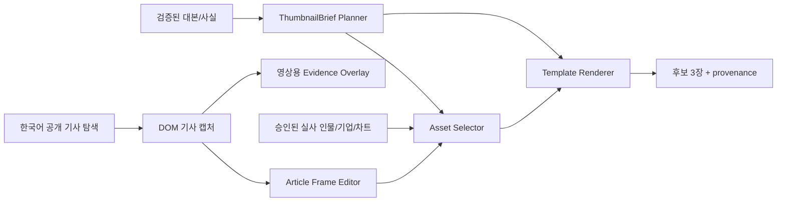

# 썸네일·기사 강조 재구현 전 기술 검토

작성일: 2026-07-23  
상태: **재구현 보류 — 설계 합의 필요**

## 1. 결론

현재 구현은 레퍼런스 채널의 제작 문법을 재현하지 못한다. 결과물은 다음 두 종류의 요구를 혼합했다.

1. 최종 영상에서 실제 사용한 장면만 썸네일에 사용한다는 **출처 일관성** 요구
2. 실사 인물·기사·강한 한글 카피를 조합하는 **클릭형 금융 썸네일** 요구

첫 번째는 일부 충족했지만, 두 번째의 입력 선택·레이아웃·타이포그래피·품질 제어가 없었다. 따라서 현 상태에서 프롬프트만 다듬거나 마스코트 크기만 조정하는 방식은 충분하지 않다. **썸네일 전용 기획 및 합성 파이프라인을 별도 설계해야 한다.**

## 2. 레퍼런스와 현재 산출물의 차이

| 영역 | 레퍼런스의 실제 문법 | 현재 구현 | 결과 |
| --- | --- | --- | --- |
| 메인 이미지 | 실사 인물, 뉴스 사진, 종목/차트 중 한 가지가 선명한 주 피사체 | 최종 영상 씬을 점수화해 그대로 커버 크롭 | 기사 본문 캡처가 선택되면 텍스트가 잘린 배경이 됨 |
| 텍스트 | 검은 패널 위 2~4줄의 초대형 한글, 흰색/노랑/빨강만 사용 | `keyword` + 고정 문구를 한 줄씩 렌더링 | 클릭을 유도하는 카피 계층과 줄 수가 없음 |
| 인물/캐릭터 | 실사 인물이 주연, 캐릭터는 상황 보조 | 승인된 실사 인물이 없으면 캐릭터를 자동 배치 | 썸네일마다 캐릭터가 불필요하게 등장 가능 |
| 기사 장면 | 화면에 실제 기사 문장을 크게 보여주고 문장/숫자를 강조 | 브라우저 캡처를 그대로 사용하고 후처리 오버레이 | 메뉴·여백이 많이 남고 ‘편집된 기사 장면’처럼 보이지 않음 |
| 강조 | 선택한 문장만 빨간 밑줄/상자/동그라미, 자막과 겹치지 않음 | DOM 좌표로 밑줄·상자를 그릴 수 있음 | 기반 기능은 있으나 자동 선택·안전영역·프레이밍 정책이 부족 |
| 언어/소스 | 한국 시청자 대상이면 한국어 기사 및 한국어 화면 | 기사 URL/언어 선택 정책이 없음 | 영어 기사 화면이 선택될 수 있음 |

## 3. 이번 예시가 실패한 직접 원인

### 3.1 기사 언어를 보장하지 않았다

`EvidenceCaptureRequest`는 URL과 인용문을 그대로 받는다. 캡처 단계에 `language`, `preferred_locale`, `publisher_country` 같은 계약이 없다.

```python
# backend/fastapi-workers/app/models/article_evidence.py
class EvidenceCaptureRequest(BaseModel):
    job_id: int
    source_url: str
    quote: str
```

따라서 호출자가 영어 연합뉴스 URL을 넘기면 영어 화면을 충실하게 캡처한다. 이는 DOM 캡처 기능의 오류가 아니라, **소스 선택 정책의 부재**다.

### 3.2 썸네일 후보 선택기가 ‘썸네일에 적합한 이미지’를 판별하지 않는다

현재 점수는 대비·엣지·밝기·요청 씬 ID 위주다.

```python
# backend/fastapi-workers/app/services/thumbnail/generator.py
return requested_bonus + min(contrast, 110.0) * .35 \
    + min(edge, 2200.0) / 45.0 + exposure + article_penalty
```

이 기준은 “최종 영상에서 사용된 유효 이미지”는 찾지만, 다음을 구분하지 못한다.

- 실사 인물 사진인지
- 기사 본문/브라우저 메뉴가 과도하게 들어갔는지
- 인물의 얼굴이 큰지
- 차트가 한눈에 읽히는지
- 텍스트를 놓을 여백이 있는지

그래서 기사 본문 스크린샷이 16:9로 무작정 확대·크롭될 수 있다.

### 3.3 카피 기획이 고정 문구 수준이다

```python
# backend/fastapi-workers/app/workers/script_worker.py
hook = str(keyword or "시장 핵심 이슈").strip()
punch = "{y:지금 확인할 핵심}"
```

`keyword`와 고정 문구만으로는 레퍼런스의 “사건 → 긴장/효익 → 시청 이유” 2~3단 카피를 만들 수 없다. 실제 제목, 검증된 숫자, 인물, 감정 톤, 금지 표현이 포함된 `ThumbnailBrief` 계약이 필요하다.

### 3.4 기사 캡처는 편집 프레임이 아니라 브라우저 크롭이다

현재 캡처는 인용문의 Range 좌표를 구한 뒤 그 주변을 자른다.

```python
# backend/fastapi-workers/app/services/evidence_capture.py
left = max(0, round((min_x - 110) * sx))
top = max(0, round((min_y - 120) * sy))
right = min(image.width, round((max_x + 110) * sx))
bottom = min(image.height, round((max_y + 130) * sy))
cropped = image.crop((left, top, right, bottom))
```

좌표 정확도에는 유리하지만, 사이트의 메뉴·공유 버튼·광고·여백까지 남을 수 있다. 레퍼런스처럼 ‘기사의 핵심 행만 큼직하게 보여 주는’ 편집 프레임에는 부족하다.

### 3.5 기존 레이아웃 추가는 템플릿 시스템이 아니다

현재 하단 검은 패널은 단일 조건문이다.

```python
# backend/fastapi-workers/app/services/thumbnail/generator.py
shade.rectangle((0, shelf_start, size[0], size[1]), fill=(0, 0, 0, 238))
```

하지만 레퍼런스는 주제별로 최소 네 가지 다른 패턴을 쓴다.

1. 실사 인물 + 하단 2줄 헤드라인
2. 차트 + 작은 캐릭터 + 위험 구간 원형 강조
3. 기사 캡처 + 밑줄/상자 + 자막
4. 기업 로고·제품 사진 + 실적/수치 헤드라인

단일 패널만으로는 구성·피사체·텍스트 충돌을 제어할 수 없다.

## 4. 기사 빨간 강조 기능의 현재 검증 결과

### 이미 가능한 것

- 공개 HTTP(S) 기사에서 특정 문구를 DOM Range로 찾는다.
- 여러 줄로 줄바꿈된 인용문도 `quote_bboxes`로 반환한다.
- 정규화 좌표로 빨간 밑줄, 사각형, 원, 점선 원, 화살표를 렌더링한다.
- 자막·기사 장면의 최종 영상 조립 시 해당 오버레이를 얹는다.
- 별도 주석이 없으면, DOM에서 찾은 인용문에 빨간 밑줄과 테두리를 기본으로 적용하도록 보강했다.

```python
# backend/fastapi-workers/app/workers/longform_worker.py
if capture and not raw_annotations:
    raw_annotations.extend(_default_capture_annotations(capture))
```

### 실제 검증

| 검증 | 결과 | 의미 |
| --- | --- | --- |
| 워커 전체 테스트 | `87 passed, 1 skipped` | 기존 파이프라인 회귀 없음 |
| Docker Chromium 기사 캡처 통합 테스트 | `3 passed` | 한글 인용문, 멀티라인 DOM 좌표, 기사 캡처가 워커 이미지에서 동작 |
| 실제 공개 기사 수동 호출 | 성공 | 공개 연합뉴스 기사에서 2개 줄 좌표를 추출 |
| 밑줄/테두리 합성 | 성공 | 추출 좌표에 빨간 밑줄과 상자를 합성 |

### 아직 불가능하거나 불완전한 것

- “한국어 기사만” 자동으로 우선 선택하는 정책
- 기사 레이아웃을 분석해 메뉴·광고를 제거하고 본문 행만 보기 좋게 재프레이밍하는 기능
- 영상 대본에서 어떤 문장을 강조할지 자동 결정하는 편집 규칙
- 인용문/강조 위치를 사용자 UI에서 수정하는 도구
- 기사 본문 전체를 자막처럼 노출하지 않도록 하는 길이·저작권 안전 정책

## 5. 재구현 권장 아키텍처



### 5.1 `ThumbnailBrief`를 강한 계약으로 교체

```json
{
  "template": "person_headline | chart_warning | article_evidence | product_earnings",
  "language": "ko-KR",
  "headline": [
    {"text": "코스피, 장중 하락 전환", "tone": "red"},
    {"text": "AI·중동 리스크 재점검", "tone": "yellow"}
  ],
  "primary_subject": {"kind": "person | article | chart | product", "asset_id": "..."},
  "secondary_subject": {"kind": "mascot", "allowed": false},
  "evidence": {"source_url": "...", "quote": "...", "source_ref": "verified_facts[0]"},
  "emphasis": {"kind": "circle | underline | rect", "target": "..."}
}
```

원칙:

- 텍스트는 모델 이미지가 아닌 Pillow/Canvas/Skia로 렌더링한다.
- 숫자·인용문은 `source_ref`가 없으면 표시하지 않는다.
- 실사 인물은 승인된 인물 레지스트리만 쓴다.
- 마스코트는 `secondary_subject.allowed=true`일 때만 배치한다.

### 5.2 템플릿을 명시적으로 분리

| 템플릿 | 주 피사체 | 텍스트 위치 | 강조 |
| --- | --- | --- | --- |
| `person_headline` | 실사 인물 1명 | 하단 검은 패널 | 얼굴 반대쪽 여백 |
| `chart_warning` | 검증 차트 | 하단 2~3줄 | 빨간 원·화살표 |
| `article_evidence` | 기사 행 캡처 | 하단 자막/상단 라벨 | DOM 밑줄·상자 |
| `product_earnings` | 로고/제품/기업 자료 | 하단 검은 패널 | 수치 배지 |

### 5.3 기사 프레임 편집 단계 추가

DOM 좌표는 유지하되, 썸네일/영상용 프레임을 별도로 만든다.

- 기사 제목·인용문을 포함하는 본문 컨테이너를 먼저 찾는다.
- 내비게이션/공유/광고 선택자는 제외한다.
- 인용문 상하에 최소 여백을 두고, 16:9·9:16에 맞춘 프레임을 만든다.
- 원문 인용은 필요한 한두 문장으로 제한하고 출처를 표시한다.
- 강조 위치는 `quote_bboxes`에서만 생성한다. OCR 추정으로 숫자/문장을 강조하지 않는다.

## 6. 재구현 순서

1. 현재 `ThumbnailGenerator`에 덧댄 기본 레이아웃을 기능 플래그 뒤로 옮기고, 새 템플릿 렌더러를 별도 모듈로 작성한다.
2. `ThumbnailBrief Planner`를 추가해 대본·검증 사실·채널 스타일에서 템플릿과 카피를 생성한다. 결과는 사용자 승인 전 편집 가능해야 한다.
3. 한국어 우선 기사 탐색 및 `Article Frame Editor`를 구현한다.
4. `article_evidence` 영상 씬에 기본 강조를 적용하되, UI에서 밑줄/상자/원/화살표를 수정할 수 있게 한다.
5. 실사 인물 등록·권리 검토 상태를 템플릿 선택에 연결한다.
6. 레퍼런스별 고정 샘플(인물, 차트, 기사, 실적) 4종에 대한 이미지 스냅샷 테스트를 추가한다.
7. 실제 한국어 공개 기사에 대한 Playwright 통합 테스트를 추가한다. 테스트용 HTML만으로 품질을 승인하지 않는다.

## 7. 개발 합의가 필요한 질문

1. 뉴스 소스는 국내 언론사만 허용할지, 해외 원문을 한국어 ‘인용 카드’로 변환하는 것도 허용할지?
2. 실사 인물은 사용자가 권리 확인 후 등록한 라이브러리만 쓸지, 공식 보도자료/프레스킷도 자동 후보로 제시할지?
3. 썸네일 헤드라인은 AI 초안 후 사용자 승인 방식인지, 채널별 고정 카피 규칙을 우선할지?
4. 레퍼런스 채널의 워터마크·고유 마스코트·문구를 모방하지 않고, 우리 채널의 독자적 브랜드 요소는 무엇으로 할지?
5. 기사 강조 장면은 모든 영상에 1개 이상 강제할지, 근거가 강한 주제에서만 선택적으로 넣을지?

## 8. 관련 코드

- 썸네일 렌더러: `backend/fastapi-workers/app/services/thumbnail/generator.py`
- 기사 캡처: `backend/fastapi-workers/app/services/evidence_capture.py`
- 강조 프리미티브: `backend/fastapi-workers/app/services/annotate.py`
- 영상 오버레이 결합: `backend/fastapi-workers/app/workers/longform_worker.py`
- 썸네일 브리프 생성: `backend/fastapi-workers/app/workers/script_worker.py`
- 검증: `backend/fastapi-workers/tests/test_evidence_capture.py`, `test_annotate.py`, `test_thumbnail_generator.py`
