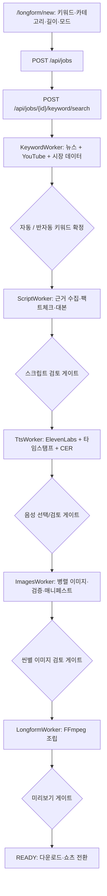
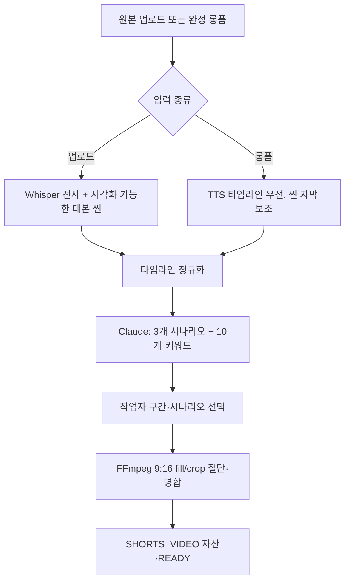

# 영상 제작 파이프라인 구현 가이드

이 문서는 현재 저장소의 실제 구현을 기준으로, 롱폼과 쇼츠가 어떤 API·서비스·워커·파일을 거쳐 완성되는지 설명한다. 개발팀 인수인계와 장애 분석을 위한 문서이며, 화면 설명이 아니라 코드의 책임 경계를 중심으로 작성한다.

## 공통 구성

| 계층 | 책임 | 주요 코드 |
|---|---|---|
| React | 작업 입력, 단계별 검토, 씬·쇼츠 구간 편집 | `frontend/src/pages/JobNew.jsx`, `JobDetail.jsx`, `Shorts.jsx` |
| Spring | 작업/자산/비용/게이트 상태 저장, Temporal 오케스트레이션 | `KeywordService.java`, `ScriptService.java`, `TtsService.java`, `ImagesService.java`, `LongformService.java` |
| Temporal | 자동 모드의 단계 순서·재시작 이력 | `VideoPipelineWorkflowImpl.java`, `VideoPipelineActivitiesImpl.java` |
| FastAPI | 외부 API 호출, LLM/TTS/이미지/FFmpeg 작업 | `backend/fastapi-workers/app/main.py` 및 `app/workers/*.py` |
| 저장소 | PostgreSQL 작업·자산 메타데이터, 공유 볼륨의 MP3/PNG/MP4 | `video_job`, `asset`, `/app/data/jobs/{jobId}` |

### 공통 원칙

- `Asset`의 `metaJson`이 단계 간 계약이다. 브라우저 재진입 시 Spring이 자산을 읽어 화면을 복원한다.
- **자동 모드**는 Temporal이 각 게이트를 즉시 승인한다. **반자동 모드**는 후보·스크립트·음성·이미지·미리보기 게이트에서 사용자의 승인 신호를 기다린다.
- 외부 API 실패와 논리/검증 실패를 구분한다. 429·503·timeout은 제한된 재시도 대상이며, 주제 근거 부족·입력 검증 실패·프로그래밍 오류는 재시도해도 해결되지 않으므로 즉시 사용자 조치 상태로 안내해야 한다.
- 공개 YouTube API로 타 채널의 평균 시청 시간·CTR은 얻을 수 없다. 화면에는 `unavailable`로 표시하며 추정 수치를 만들지 않는다.

---

## 1. 롱폼 전체 과정



### 1-1. 작업 생성과 상태

1. `frontend/src/pages/JobNew.jsx`가 제목/입력 키워드, 카테고리, 목표 길이, 자동·반자동 모드를 전송한다.
2. `JobService`가 `VideoJob`을 만들고 `DRAFT` 상태로 저장한다.
3. 키워드 탐색 뒤 상태는 `KEYWORD_PENDING`, 스크립트 확정 뒤 `TTS_PENDING`, TTS 확정 뒤 `IMAGES_PENDING`, 영상 조립 중 `ASSEMBLING`, 미리보기는 `PREVIEW_PENDING`, 완료는 `READY`다.
4. 상태와 자산은 PostgreSQL에 영속화된다. 화면 새로고침은 진행 자체를 다시 실행하는 것이 아니라 이 자산/상태를 다시 읽는다.

### 1-2. 키워드 후보 선정

**호출 경로**

`JobNew.jsx` → `POST /api/jobs/{id}/keyword/search` → `KeywordController` → `KeywordService.search()` → `FastApiClient.searchKeywords()` → `POST /workers/keyword/search` → `KeywordWorker.search()`.

**실제 근거 수집**

- `NewsKeywordExtractor.extract_kr_keywords()` 또는 `extract_us_keywords()`가 뉴스 RSS/검색 데이터를 이용해 후보와 헤드라인을 만든다.
- `get_trending_video_analyzer().collect()`가 YouTube Data API 기반 최근 공개 영상을 모은다.
- `MarketDataCollector.collect_for_category()`가 카테고리 시장 스냅샷을 가져온다.
- `_score_yt_videos()`는 조회수, 구독자 대비 조회수, 채널 평균 대비 성과, 시간당 조회수, 좋아요·댓글을 공개 가능한 범위에서 점수화한다.
- `_rank_with_claude()`가 뉴스·YouTube·시장 스냅샷을 근거로 후보를 정렬한다. `_filter_ungrounded_candidates()`가 근거 없는 수치가 들어간 후보를 제거한다.

**입력 키워드 우선 규칙**

`KeywordWorker._enforce_seed_priority()`와 `KeywordService`의 이중 방어가 적용된다.

- 입력값 `seed`는 편집 주제의 경계다. `KOSPI` 같은 카테고리는 분석 렌즈일 뿐 주제를 바꿀 수 없다.
- 후보 1번은 입력 키워드 그대로다.
- 후보 2~5는 입력 키워드의 고유어를 최소 두 개 유지한 세부 관점만 사용한다.
- YouTube 쿼터가 없거나 뉴스가 부족해도 일반 코스피 후보로 대체하지 않는다. 이때 후보는 `공개 YouTube 지표 없음`으로 명시한다.
- Spring의 자동 선택 직전에도 1위 후보가 입력 키워드와 무관하면 원래 `seed`로 강제 복귀한다.

핵심 Spring 방어 코드 (`KeywordService.java`):

```java
if (!hasPreselectedKeyword && isSpecificSeed(seedKeyword)
        && !isSeedRelated(selectedKeyword, seedKeyword)) {
    selectedKeyword = normalizeKeyword(seedKeyword);
}
```

핵심 FastAPI 방어 코드 (`keyword_worker.py`):

```python
# Claude 순위화·폴백 뒤에도 seed와 무관한 후보는 제거한다.
candidates = self._enforce_seed_priority(candidates, seed, limit)
```

**자동과 반자동**

- 자동: 이미 일일 리서치에서 확정된 `job.keyword`가 있으면 이를 사용하고, 없으면 입력 키워드(후보 1번)를 확정한다.
- 반자동: `KEYWORD_PENDING`에서 후보·근거 영상·태그·지표를 표시하고 사용자가 하나를 선택한다. 선택값만 `job.keyword`가 된다.

### 1-3. 스크립트 생성과 사실 검증

**호출 경로**

`ScriptService.generate()` → `FastApiClient.generateScript()` → `POST /workers/script/generate` → `ScriptWorker.generate()`.

**처리**

1. `ScriptWorker._collect_keyword_news()`가 선택 키워드로 7일 이내의 최신 근거를 다시 수집한다.
2. `_multi_round_fact_check()`이 시장 데이터와 뉴스 근거에서 사실을 추출·교차 검토·확정한다.
3. `_generate_with_verified_facts()`가 검증된 사실만 사용하여 대사·한국어 비주얼 설명·영문 이미지 프롬프트·메타데이터를 생성한다.
4. `script_length.make_length_contract()`가 목표 영상 길이, 선택 음성의 분당 문자 수, TTS 속도를 바탕으로 **대사 분량만** 계산한다. 이미지 프롬프트·메타데이터는 분량에 포함하지 않는다.
5. `_split_sections_for_visual_pacing()`가 대사를 씬으로 분할한다. 다운로드용 대본은 `_narration_from_sections()`로 대사만 보존한다.
6. `_validate_keyword_coverage()`가 선택 주제의 고유어·시간 조건을 확인하고, `_validate_unit_usage()`가 퍼센트/포인트 단위 혼동을 차단한다.

핵심 검증 코드 (`script_worker.py`):

```python
keyword_validation = _validate_keyword_coverage(full_script, selected_terms)
if not keyword_validation["passed"]:
    raise ScriptResearchRequiredError(
        "선택 키워드 반영 검증에 실패했습니다: "
        + ", ".join(keyword_validation["missing_terms"])
    )
```

**중요한 실패 정책**

선택 주제의 최신 검증 근거가 없으면 일반 코스피 대본으로 폴백하지 않는다. `ScriptResearchRequiredError`로 멈추고 키워드 또는 근거 자료 보완을 요구한다. 무관한 대본을 TTS로 넘기는 것보다 안전하다.

### 1-4. TTS, 타임라인, 자막

**호출 경로**

`TtsService.generate()` → `POST /workers/tts/generate` → `TtsWorker.synthesize()`.

**처리**

- `extract_narration()`으로 이미지 프롬프트·메타데이터를 제거한 대사만 ElevenLabs에 보낸다.
- ElevenLabs `/v1/text-to-speech/{voice_id}/with-timestamps`의 문자별 시작/끝 시각을 우선 사용한다.
- 문단 단위 생성, 문장 사이 pause 삽입, 인트로 음성 지시, v3 모델 설정을 적용한다.
- 타임스탬프가 없거나 불완전하면 forced alignment → stable-ts → Whisper → 글자수 비례 순서로 폴백한다.
- `_validate_cer()`은 생성 음성을 Whisper로 다시 읽어 CER(문자 오류율)을 계산하고, 기준 초과 시 재생성 품질 게이트로 사용한다.
- 최종 MP3, 청크별 `start/duration/text`, 품질 보고서는 `TTS_AUDIO` 자산에 저장된다. 이 타임라인이 자막과 이미지 씬의 시간 기준이다.

ElevenLabs 호출은 문자별 정렬 데이터를 함께 받는 엔드포인트를 사용한다 (`tts_worker.py`):

```python
url = (
  f"https://api.elevenlabs.io/v1/text-to-speech/{voice_id}"
  "/with-timestamps?apply_text_normalization=off"
)
```

### 1-5. 이미지 생성·검토

**호출 경로**

`ImagesService.generate()` → `POST /workers/images/generate` → `ImagesWorker.generate()`.

**처리**

1. `SCRIPT`의 씬 대사·한국어/영문 프롬프트와 `TTS_AUDIO`의 시간 정보를 합쳐 씬 작업을 만든다.
2. `direct_scenes()`와 `enrich_scene_plans()`이 섹션별 아트 디렉션·포즈·구도 다양성을 배정한다.
3. `ImagesWorker._generate_parallel_scenes()`가 `gemini_max_concurrency` 세마포어 범위에서 병렬로 생성한다.
4. 성공 결과는 manifest에 기록한다. 재실행 시 유효 PNG와 manifest가 있는 씬은 재사용한다.
5. 파일 크기와 이미지 디코딩을 검증한 뒤에만 씬 완료 처리한다.
6. 429/503/timeout만 지수 백오프 재시도한다. TypeError·KeyError·설정 오류 같은 프로그래밍 오류는 재시도 대상이 아니다.
7. 반자동 화면에서는 씬별로 원문 대사, 영문 프롬프트, 이미지와 함께 `자막만 수정`, `이미지만 재생성`, `텍스트 기반 이미지 재생성`을 제공한다.

병렬 진입점은 `images_worker.py`의 `_generate_parallel_scenes()`다. 씬별 결과는 manifest를 통해 확인되므로, 이미 정상 생성된 파일을 다시 결제·생성하지 않는다.

**수치/차트 씬**

`market_charts.py`와 데이터 카드 유틸리티는 검증된 데이터를 별도 그래픽 레이어로 만든다. 차트 캔버스는 삽입 표면과 동일한 픽셀 계약을 사용하고, 제목·핵심 수치·축 라벨 크기는 표면 높이에 비례한다. AI가 만든 배경의 빈 정보 표면에는 가로 16:9 보드를 요구하며, 정확한 수치·문구는 렌더된 레이어에서 보장한다.

### 1-6. 롱폼 조립

**호출 경로**

`LongformService.generate()` → `POST /workers/longform/generate` → `LongformWorker.generate()`.

**처리**

- 이미지와 TTS 청크 타임라인을 읽어 씬 길이를 결정한다.
- FFmpeg가 이미지의 Ken Burns/전환, 자막, TTS, 필요 시 BGM/SFX를 하나의 MP4로 조립한다.
- 조립 결과의 경로·길이·메타데이터를 `LONGFORM_VIDEO` 자산으로 저장한다.
- `PREVIEW_PENDING`에서 재생·재조립 검토가 가능하며, 승인 후 `READY`가 된다.
- 생성된 롱폼의 TTS 타임라인/씬은 쇼츠 시나리오 자동 탐색의 원본으로 재사용된다.

조립 전에는 `LongformWorker.assemble()`이 전체 씬 집합을 검사한다. 누락 씬이 있으면 부분 영상을 배포하지 않고 조립을 멈춘다.

---

## 2. 쇼츠 전체 과정

쇼츠는 두 경로가 있다. 업로드 영상을 분석해 쇼츠를 뽑는 경로와, 완성된 롱폼에서 쇼츠 후보를 뽑는 경로다.



### 2-1. 업로드 영상의 전사와 AI 구간 추천

**호출 경로**

`Shorts.jsx` → `POST /api/jobs/{id}/shorts/analyze` → `ShortsService.analyze()` → `FastApiClient.analyzeShorts()` → `POST /workers/shorts/analyze` → `ShortsWorker.analyze()`.

**처리**

1. 업로드 MP4를 `/app/data/jobs/{id}`에 저장한다.
2. `app/providers/mock/transcript.py`의 `WhisperTranscriptProvider`(faster-whisper CPU int8)가 음성 전사와 원본 시간 구간을 만든다.
3. `ShortsWorker.enhance_scene_script()`이 Whisper 구간을 약 8~20초의 읽기 쉬운 대본 씬으로 묶는다. LLM은 문장/제목만 다듬으며 시간값은 Whisper가 소유한다.
4. `_extract()`은 금융 고관심 키워드 점수와 시간 창을 사용해 겹치지 않는 추천 구간을 만든다.
5. Spring은 `ShortsJob`, `TRANSCRIPT`, `SOURCE_VIDEO` 자산을 저장하고 작업 상태를 `SHORTS_SEGMENTS_PENDING`으로 바꾼다.

시간값 보호 규칙 (`shorts_worker.py`):

```python
# LLM은 문장/제목만 다듬고, index/start/end/duration은 Whisper가 소유한다.
analysis["transcript_segments"] = get_shorts_worker().enhance_scene_script(
    analysis["transcript_segments"]
)
```

### 2-2. 롱폼에서 AI 시나리오·키워드 추출

**호출 경로**

`POST /api/jobs/{id}/shorts/extract-scenarios` → `ShortsService.extractScenarios()` → `POST /workers/shorts/normalize-scenes` → `POST /workers/shorts/extract-scenarios` → `ShortsWorker.extract_scenarios()`.

**처리**

- 완성 롱폼은 `TTS_AUDIO`의 정확한 청크 시간을 우선 사용한다. 이미지 씬의 추정 시간이 있어도 TTS 타임라인이 있으면 이를 덮어쓴다.
- 업로드 영상은 `TRANSCRIPT` 자산의 Whisper 세그먼트를 사용한다.
- `cleanNarrationScenes()`가 영문 이미지 프롬프트·해시태그·비한국어 텍스트를 제거한다.
- `normalize-scenes`가 실제 원본 영상 길이에 맞도록 씬 구간을 정규화한다.
- `extract_scenarios()`가 Claude로 세 가지 연속 구간을 고른다.
  - `performance`: 실적·판매·긍정 데이터
  - `risk`: 경고·하락·리스크 관리
  - `upside`: 호재·모멘텀·기회
- 각 시나리오는 30~60초, 연속된 씬 인덱스여야 한다. `_normalize_scenario_ranges()`가 LLM의 잘못된/너무 긴 범위를 실제 연속 타임라인으로 보정한다.
- `_ensure_ten_keywords()`가 정확히 10개 키워드와 해당 씬 인덱스를 보장한다.
- 결과는 `SHORTS_SCENARIO` 자산에 저장돼 화면 재진입 후에도 복원된다.

시나리오 프롬프트의 핵심 계약은 다음과 같다.

```text
- 각 시나리오는 연속된 scene index만 선택
- 선택된 전체 길이는 30~60초
- 시나리오 3개(performance/risk/upside)와 키워드 10개를 JSON으로 반환
```

### 2-3. 사용자 선택과 쇼츠 MP4 생성

**호출 경로**

- 일반 확정: `POST /api/jobs/{id}/shorts/confirm`
- 여러 선택 구간 병합: `POST /api/jobs/{id}/shorts/confirm-merge`
- 직접 지정: `POST /api/jobs/{id}/shorts/cut-direct`

`ShortsService.confirm()` 또는 `confirmMerge()` → `FastApiClient.cutShorts()`/`cutMergeShorts()` → FastAPI `ShortsWorker.cut()`/`cut_merge()`.

**처리**

- 최종 선택 전 작업자는 시나리오, 키워드 연결 씬, 시작/끝 시각을 검토·수정한다.
- `ShortsWorker.cut()`은 FFmpeg `scale/crop` 필터로 9:16(1080×1920)을 빈 여백 없이 채운다.
- 길이는 최대 60초로 제한한다. 인코딩 실패 시 단순 인코더로 한 번 폴백한다.
- `ShortClipInfo`와 출력 경로를 `SHORTS_VIDEO` 자산/`ShortsJob`에 저장하고 작업을 `READY`로 전환한다.

---

## 3. 운영 점검 체크리스트

1. **입력 키워드 확인:** 자동 선택된 `job.keyword`가 입력 seed와 고유어 두 개 이상 겹치는가?
2. **YouTube API:** 쿼터 소진이면 지표가 0처럼 보이지 않고 unavailable로 표시되는가?
3. **스크립트:** 선택 주제 근거가 없을 때 일반 시장 대본으로 폴백하지 않는가?
4. **TTS:** ElevenLabs 타임스탬프와 최종 MP3 길이가 일치하는가? CER 품질 결과가 저장됐는가?
5. **이미지:** 프로그래밍 오류가 429/503처럼 재시도되지 않는가? 성공 씬 manifest가 재사용되는가?
6. **조립:** 모든 씬 이미지·TTS·자막 타임라인이 검증된 뒤에만 FFmpeg 조립을 시작하는가?
7. **쇼츠:** Whisper/TTS 시간값을 유지한 채 LLM이 대본 문구만 편집하는가? 선택 구간이 30~60초 연속 범위인가?

## 4. 126번 장애 사례

- 입력/작업 제목: `삼성전자 3분기 반도체 실적`
- 카테고리: `KOSPI`
- 당시 자동 확정값: `코스피 글로벌 바로미터`
- 직접 실패: FastAPI ScriptWorker가 `선택 키워드 반영 검증에 실패했습니다: 코스피 글로벌 바로미터`로 HTTP 422 응답
- 근본 원인: 입력 `seed`가 키워드 후보 순위화의 힌트로만 취급돼, 뉴스 빈도가 높은 일반 코스피 후보가 1위가 됨
- 수정: FastAPI `KeywordWorker._enforce_seed_priority()`와 Spring `KeywordService` 자동 확정의 이중 seed-우선 방어. 이후 같은 입력은 입력 주제 자체가 자동 확정되며, 일반 코스피 후보가 들어와도 Spring 단계에서 차단·대체된다.
