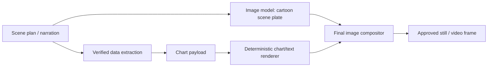

# Team Brief: v2.2 Image, Character Style, and Verified Data Overlays

## Current Style Decision

We rolled the approved visual direction back to the earlier `v22_showcase` stage.
That stage is the version where the scene, mascot, background, and overall cartoon tone were generated together, while Korean text, numbers, bars, axes, and graph marks were added later by deterministic code.

Approved sample outputs:

| Asset | Path |
| --- | --- |
| Thumbnail | `artifacts/v22_approved_showcase/01-thumbnail.png` |
| Text explainer | `artifacts/v22_approved_showcase/02-text-explainer.png` |
| Line chart | `artifacts/v22_approved_showcase/03-line-chart.png` |
| Bar comparison chart | `artifacts/v22_approved_showcase/04-comparison-bars.png` |

The newer Goldie sprite based sample is not the style target for this discussion. It can remain as a technical experiment, but the approved visual taste is the prior `v22_showcase` family.

## Why Those Images Worked Well

They worked because the pipeline separated two jobs that should not be handled by the same system.

1. The image model handled only the visual atmosphere: cartoon character, background, lighting, props, and channel mood.
2. Our code handled every readable fact: Korean copy, numbers, graph values, bars, labels, axes, colors, and placement.

This is the key reason. The model is good at drawing a coherent cartoon scene, but unreliable at exact Korean typography and exact numeric graphics. Our deterministic renderer is boring in the best possible way: the same input data produces the same text, the same coordinates, and the same chart geometry every time.

## Showcase Composer

For the four discussion images, the simple reproducible tool is:

- `tools/compose_v22_showcase_images.py`

It follows this rule:

- Input: generated scene plates.
- Output: four finished PNGs.
- Implementation: Pillow `ImageDraw` places text and chart primitives directly onto the image.

Important responsibilities in that file:

| Code | Responsibility |
| --- | --- |
| `FONT_CANDIDATES` | Chooses a Korean-capable display font. |
| `center(...)` | Measures the rendered text box and centers it inside a target rectangle. |
| `thumbnail(...)` | Draws the thumbnail title panel and exact Korean headline. |
| `copy_explainer(...)` | Draws explainer copy inside the planned board area. |
| `line_chart(...)` | Converts numeric values into line-chart coordinates. |
| `comparison_chart(...)` | Converts comparison values into bar heights, labels, and summary text. |

The important pattern is that text and numbers are never requested from the image model. They are attached after the image exists.

## Production Data Graphics

The production version of the same idea lives mainly in:

- `backend/fastapi-workers/app/utils/market_charts.py`
- `backend/fastapi-workers/app/services/info_surface/*`
- `backend/fastapi-workers/app/workers/images_worker.py`
- `backend/fastapi-workers/app/services/overlay/editorial_overlay.py`
- `backend/fastapi-workers/app/services/bubble_overlay.py`
- `backend/fastapi-workers/app/utils/number_format.py`

### `market_charts.py`

`extract_market_chart(scene)` builds a chart payload only when the data can be traced to collected market data. It does not invent a time series from narration text. If the scene does not have enough verified points, it returns `None`.

`render_market_chart(chart, output_path)` chooses the actual chart renderer:

- trend dashboard
- chalkboard explainer
- change arrow
- pie composition
- market-cap comparison
- indexed comparison
- supply flow
- stock movers

The chart renderer is responsible for:

- exact numeric labels
- graph scale
- bar height
- axis bounds
- chart title
- Korean font
- color palette
- stable canvas size

Important detail: `_make_canvas(...)` creates a fixed-size canvas from the intended final surface size. It does not use tight cropping. That means a chart does not randomly shift when saved, resized, or composited.

### `number_format.py`

`format_verified_value(...)` formats values only after they are already verified. The supported display formats are intentionally strict:

- `numeral_grouped`
- `korean_compact`
- `percent`
- `point`
- `date_ym`

This prevents a point value from being mislabeled as a percentage, or a decimal ratio from being displayed as an absolute number.

## Attaching Data to the Image

The v2.2 information-surface code is the part that makes statistics feel like they belong inside the image instead of floating as a generic UI card.

Core files:

- `backend/fastapi-workers/app/services/info_surface/contracts.py`
- `backend/fastapi-workers/app/services/info_surface/channel_chart_style.py`
- `backend/fastapi-workers/app/services/info_surface/warp_compositor.py`

### `contracts.py`

`SurfaceContract` describes the physical place where information can be attached:

- surface kind
- planar geometry
- marker color
- preferred region
- area constraints
- inset ratio

`InfoSurfacePlan` describes the requested rendering mode:

- `DIEGETIC_WARP`: put verified chart ink onto a detected in-scene surface.
- `DATA_CUTAWAY`: replace the scene with a full-frame data insert when the surface is not safe.
- `GRAPHIC_LAYER` / `METRIC_SUMMARY`: safer fallback modes for simpler metric displays.

`plan_from_scene(scene)` is the gate. It only creates a plan when the scene has a verified `market_chart`.

### `channel_chart_style.py`

`render_chart_content(chart, size)` renders transparent chart ink. It deliberately avoids a generic dashboard look:

- dark navy ink
- warm yellow highlight
- red warning color
- restrained gray support marks
- bundled Korean font

This function creates only the content layer: text, numbers, bars, lines, and labels. The physical background remains the generated cartoon prop.

### `warp_compositor.py`

`composite_planar(...)` is the “cling to the image” step.

It:

1. Renders chart content larger than the final surface.
2. Computes a perspective transform from the chart rectangle to the detected board or paper quad.
3. Warps the chart into that physical surface with OpenCV.
4. Masks pixels outside the surface.
5. Removes chart ink from detected occluders so foreground objects can stay in front.
6. Adds a little surface texture back over the ink so it feels printed or chalked onto the prop.

This is why the data can look attached to a signboard, monitor, paper, or poster instead of pasted as a flat app screenshot.

## Worker Integration

`backend/fastapi-workers/app/workers/images_worker.py` connects the pieces.

Important methods:

| Method | Responsibility |
| --- | --- |
| `_apply_image_overlays(scene, img_path)` | Finalizes a still before video motion starts. |
| `_apply_info_surface_plan(scene, img_path)` | Creates or reuses the info-surface plan, detects the target surface, renders/warps/falls back, and records provenance. |
| `_compose_layered_scene(...)` | In layered mode, creates the order `clean background -> verified surface -> character foreground`. |
| `_resume_layered_scene(...)` | On resume, rebuilds from the saved surface plate rather than painting over an already composited frame. |

The most important operational rule is this:

> A chart is applied before Ken Burns/video composition, so the chart moves together with the image instead of floating at fixed screen coordinates.

That was one of the main v2.2 fixes.

## Text Overlays and Speech Bubbles

Readable Korean overlay copy is handled by:

- `backend/fastapi-workers/app/services/overlay/editorial_overlay.py`
- `backend/fastapi-workers/app/services/bubble_overlay.py`

`OverlaySlot` is the contract. It defines:

- overlay kind
- exact text
- claim type
- source references for grounded claims
- target bbox for target-bound overlays
- anchor
- tone
- max area ratio

`render_editorial_overlay(...)` measures text, wraps Korean copy, chooses a safe candidate position, avoids protected regions, and returns the exact bounding box. If the overlay would collide with protected regions, it returns a skipped reason instead of forcing a bad layout.

`bubble_overlay.py` is now a compatibility wrapper that routes speech bubbles through the shared editorial overlay renderer. That keeps speech bubbles, bursts, clouds, and caption chips under one placement grammar.

## Why This Beats Prompt-Only Generation

Prompt-only generation fails in exactly the places we care about:

- Korean text can become unreadable.
- Numbers can change.
- Axis labels can be invented.
- Bar heights may not match the values.
- Graphs can look like generic UI instead of a channel-native cartoon prop.
- Re-rendering may change a fact that should be stable.

Our current approach avoids that by making the image model responsible for art direction, not facts. The facts are rendered by code from verified payloads.

## v3 Cartoon Ink Renderer (Current P0 Implementation)

The renderer now has a second responsibility after v2.2 solves placement: it
draws the facts in the channel's poster-like cartoon language instead of the
former generic dashboard language.

| Code | What it now owns |
| --- | --- |
| `app/services/info_surface/hero_stat.py` | Builds a `HeroStatPlan`: one large verified value, direction, one meaning line, at most two support marks, comparison basis, and source references. |
| `app/services/info_surface/channel_typography.py` | Uses the bundled, OFL-licensed Black Han Sans display face and draws double-outline Korean display copy at minimum role sizes. |
| `app/services/info_surface/ink_primitives.py` | Seeded wobble paths, ink bars, arrows, and underlines. The same scene seed produces the same geometry on resume. |
| `app/services/info_surface/channel_chart_style.py` | Uses the poster grammar: headline, underline, hero number, directional arrow, concise meaning line, and only optional supporting marks. It does not draw a date/tick/grid dashboard. |
| `app/services/info_surface/material_fx.py` | Adds deterministic chalk grain, paper ink bleed, or monitor glow after factual glyph geometry is fixed. |
| `app/utils/market_charts.py` | Routes the old FFmpeg compatibility path through the same v3 poster renderer, so resumed/legacy jobs do not fall back to a different visual language. |

### Indexed values are now fail-closed

An indexed value such as `107.0` is ambiguous unless its reference is visible.
For `indexed_comparison`, both the planner and the direct image renderer now
require `comparison_basis` (for example `2026-07-21 = 100`) and a verified
source reference. A missing basis raises a validation error; it is never
rendered as if it were an absolute KOSPI quote. `app/utils/number_format.py`
contains `indexed_basis(...)` so the visible label is formatted from the same
verified payload.

### Script-to-image contract

`script_worker.py` creates `market_chart.hero_stat` and `embedded_copy` from
the verified chart payload before image generation. The image model receives a
blank physical prop only. The deterministic renderer later attaches that
pre-approved copy and data to the prop. This is why the voice script, source
references, numbers, bars, and displayed meaning cannot silently drift apart.

## Tests That Protect This Logic

Relevant tests:

- `backend/fastapi-workers/tests/test_data_graphics_and_motion.py`
- `backend/fastapi-workers/tests/test_info_surface_compositor.py`
- `backend/fastapi-workers/tests/test_scene_layers.py`
- `backend/fastapi-workers/tests/test_image_worker_stability.py`
- `backend/fastapi-workers/tests/test_phase2_cartoon_contract.py`
- `backend/fastapi-workers/tests/test_cartoon_ink_renderer.py`

The tests check things like:

- verified charts render successfully
- indexed comparisons use bounded axes
- unrelated time series are not used for comparisons
- final info surfaces replace the old fixed overlay behavior
- surface compositing can warp chart content into a detected quad
- fallback cutaways exist when physical surface rendering is unsafe
- foreground character layers can stay above verified info surfaces in layered mode
- a normalized value cannot render without a visible comparison basis
- cartoon ink output is deterministic for the same verified payload and scene seed

## Discussion Points for the Team

1. Keep the approved visual target as the earlier `v22_showcase` cartoon family.
2. Do not ask the image model to render Korean text, exact numbers, bars, or axis labels.
3. Treat every chart as a verified payload first, a drawing second.
4. Prefer physical information surfaces when detection is safe.
5. Use explicit cutaway or metric-summary fallback when surface geometry is unsafe.
6. Keep text placement collision-aware and allow overlays to be skipped when a safe position does not exist.
7. Use the deterministic renderer as the final authority for statistics, indicators, bars, graphs, numbers, and Korean text.
