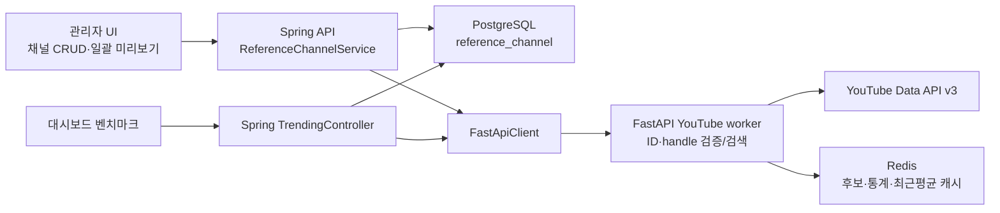

# WO-7F 개발자 구현서: YouTube 레퍼런스 채널 무결성·CRUD·성과 임계값 개편

- 작성일: 2026-08-15 (KST)
- 기준 저장소: `video_pipeline`
- 진단 기준 HEAD: `c1da785` (`feat(wo7c): enforce long-form YouTube duration contract`)
- 진단 기준 테스트: `546 passed, 13 warnings`
- 선행 작업: WO-7A~7C 완료, WO-7D는 medium second call 병합 작업과 순서 조율 필요
- 문서 성격: **개발자가 그대로 구현할 수 있는 코드 수준 작업지시서**
- 이번 문서 작성으로 제품 코드는 수정하지 않는다.
- Part A·A-2 승인: 2026-08-15
- 사용자 확정 채널: `https://www.youtube.com/@3protv` → `UChlv4GSd7OQl3js-jkLOnFA`
- 제외 확정: `주식하는형`은 신규 ID를 찾거나 등록하지 않고 작업 범위에서 제외

---

## 1. 최종 목표

다음 문제를 서로 분리된 게이트로 해결한다.

1. 잘못된 하드코딩 채널 ID 때문에 삼프로TV가 사라지고, 과거 `주식하는 형` 229명 채널이 표시됐던 데이터 무결성 문제를 해결한다.
2. 채널 조회 실패를 조용히 누락하지 않고 API와 UI에 명시적으로 표시한다.
3. Spring/PostgreSQL에 레퍼런스 채널 CRUD와 soft delete를 구현한다.
4. 채널 ID 또는 `@handle`을 실제 YouTube API로 검증한 뒤에만 저장한다.
5. 48개 후보 채널은 자동 저장하지 않고 `검색 후보 → 사람 확인 → 확정 저장` 흐름으로 일괄 등록한다.
6. 대형 채널에 불리한 flat 1% 성과 기준을 `채널 최근 평균 × 1.5` 우선, 규모별 임계값 fallback으로 교체한다.
7. 라이브·7일 이전·4분 미만 영상 제외 계약을 실제 백엔드와 프론트 양쪽에서 유지한다.

이 작업은 YouTube 연구·채널 관리 영역만 변경한다. 대본, TTS, 이미지, Fal/Kling, 자막, 영상 조립, 썸네일 단계는 실행하거나 수정하지 않는다.

---

## 2. 절대 준수 사항

1. LLM 모델 `claude-sonnet-4-6` 설정을 변경하지 않는다.
2. `YOUTUBE_API_KEY`, JWT secret, DB 비밀번호를 코드·테스트 fixture·로그·응답에 노출하지 않는다.
3. YouTube API는 FastAPI worker만 호출한다. Spring이 API 키를 새로 소유하지 않는다.
4. Spring/JPA가 레퍼런스 채널 DB의 단일 소유자다. FastAPI에서 PostgreSQL을 직접 읽지 않는다.
5. 채널명 검색 결과 첫 번째를 자동 확정하지 않는다. 반드시 사람 확인 후 저장한다.
6. 삭제는 물리 삭제가 아니라 `is_active=false` soft delete다.
7. 유효하지 않은 채널과 API 실패 채널을 결과에서 조용히 제거하지 않는다.
8. 조회 실패를 `subscriber_count=0`으로 표현하지 않는다. `null`과 상태 코드를 사용한다.
9. 기존 캐시를 수동 삭제하지 않는다. 새 캐시 버전 또는 채널별 키로 자연스럽게 분리한다.
10. 각 하위 WO는 독립 테스트와 전체 회귀 통과 후에만 다음 단계로 이동한다.
11. 기존 dirty 파일 `frontend/src/pages/Admin.jsx`, `logs/pipeline-autostart.log`가 남아 있다면 사용자 변경을 보존하고 덮어쓰지 않는다.
12. WO-7D가 먼저 병합되면 그 기준 HEAD와 테스트 수를 새 기준선으로 기록한다. `546`이라는 숫자를 무조건 강제하지 말고 `기준선 + 신규 테스트 수`로 검증한다.
13. 삼프로TV의 ID는 사용자가 확인했더라도 코드 fallback이나 자동 seed로 등록하지 않는다. CRUD의 `@handle 조회 → 미리보기 → 사람 확정 → 저장` 경로를 실제로 통과시킨다.
14. `주식하는형`은 대체 채널 검색·추정·seed·fallback·DB pending row를 모두 만들지 않는다.
15. FastAPI→Spring 역방향 호출을 추가하지 않는다. 채널 목록 전달 방향은 항상 `Spring DB → FastApiClient → FastAPI worker`다.

---

## 3. 확정된 진단 결과

### 3.1 하드코딩 ID 실검증

| 등록명 | 기존 ID | 공식 API·브라우저 결과 | 판정 |
|---|---|---|---|
| 경제사냥꾼 | `UC7usMJDHmtbs_oegmzQKKMA` | 경제사냥꾼, 구독자 약 643,000명 | 정상 |
| 삼프로TV | `UC86s17Zc-V7vP7zL6Z-Yd4g` | `channels.list.items=[]`, 브라우저에서 존재하지 않는 채널 | 잘못되거나 폐기된 ID |
| 주식하는형 | `UCpAyogfL8-YzmKf3-wTfEBg` | `주식하는 형`, 구독자 229명, 영상 35개 | 유효하지만 의도한 벤치마크 채널이 아님 |

검증된 삼프로TV 실제 채널:

```text
title:                  삼프로TV 3PROTV
handle:                 @3protv
channel_id:             UChlv4GSd7OQl3js-jkLOnFA
subscriber_count:       약 2,900,000~3,040,000 (조회 시점에 따라 변동)
hiddenSubscriberCount:  false
```

사용자가 `https://www.youtube.com/@3protv`를 실제 삼프로TV로 확인했다. 다만 이 확인값도 코드에 자동 등록하지 않고 CRUD 검증 흐름의 기대 후보로만 사용한다.

`주식하는 형`의 의도 채널은 이름만으로 확정할 수 없으며 사용자가 제외를 확정했다. 기존 229명 ID를 다른 추정 ID로 자동 치환하지 말고 초기 활성 목록·검색 대상·seed에서 모두 제외한다.

### 3.2 Redis·직접 호출 결과

기존 캐시 키:

```text
youtube:benchmark:UC7usMJDHmtbs_oegmzQKKMA_UC86s17Zc-V7vP7zL6Z-Yd4g_UCpAyogfL8-YzmKf3-wTfEBg
```

캐시와 `_redis=None` 직접 실행 모두 다음 2개 채널만 반환했다.

```json
[
  {"channel_id":"UC7usMJDHmtbs_oegmzQKKMA","title":"경제사냥꾼","subscriber_count":643000},
  {"channel_id":"UCpAyogfL8-YzmKf3-wTfEBg","title":"주식하는 형","subscriber_count":229}
]
```

따라서 원인은 캐시 오염이나 프론트 포맷팅이 아니다. 잘못된 소스 ID와 빈 API 응답을 `continue`하는 오류 표현 방식이다.

### 3.3 현재 코드의 조용한 누락

현재 `backend/fastapi-workers/app/providers/real/trending.py`는 다음 조건에서 결과를 추가하지 않고 넘어간다.

```python
if ch_resp.status_code != 200:
    continue
ch_json = ch_resp.json()
if not ch_json.get("items"):
    continue
```

존재하지 않는 채널은 예외가 발생하지 않으므로 `[BenchmarkError]` 로그도 남지 않는다. 이 때문에 UI에서는 삼프로TV 카드가 사라진다.

### 3.4 프론트 포맷팅은 정상

`frontend/src/components/dashboard/ChannelBenchmark.jsx`의 `formatSubscribers(229)`는 `~229명`을 반환한다. 229명 표시는 API 값의 정확한 표현이며 숫자 포맷 버그가 아니다.

---

## 4. Part A-2 실데이터 결론

2026-08-15 KST 진단 시점에 상위 5개·하위 5개 채널의 최신 50개 업로드에서 다음 조건을 적용했다.

- 4분 이상 일반영상
- 라이브·라이브 다시보기 제외
- 최근 7일
- 자기평균은 최대 최근 일반영상 30개 평균

| 채널 | 구독자 | 최신 표본 조회수/비율 | 7일 표본 | flat 1% | 구간별 | 자기평균 1.5배 |
|---|---:|---:|---:|---:|---:|---:|
| 슈카월드 | 372만 | 344,991 / 9.27% | 5 | 5 | 5 | 0 |
| 삼프로TV | 304만 | 4,148 / 0.14% | 42 | 11 | 36 | 10 |
| 김작가 TV | 272만 | 3,815 / 0.14% | 17 | 10 | 15 | 2 |
| 삼성증권 | 322만 | 91,318 / 2.84% | 2 | 1 | 2 | 1 |
| 신사임당 | 280만 | 2,302 / 0.08% | 38 | 9 | 21 | 11 |
| 슈퍼개미 이세무사TV | 27.2만 | 9,447 / 3.47% | 10 | 10 | 10 | 2 |
| 미국주식에 미치다 TV | 19.7만 | 5,322 / 2.70% | 2 | 2 | 2 | 0 |
| 압권 Apkwon | 22.4만 | 53,696 / 23.97% | 4 | 4 | 4 | 2 |
| Daniel Yoo¹ | 8.47만 | 최근 7일 표본 없음 | 0 | 0 | 0 | 0 |
| 체슬리TV | 17.3만 | 9,782 / 5.65% | 22 | 22 | 22 | 4 |

¹ `유동원의 성공투자` 검색 후보다. 채널명이 다르므로 일괄 등록에서 사람 확인이 필요하다.

집계:

| 방식 | 상위 5개 | 하위 5개 | 전체 |
|---|---:|---:|---:|
| flat 1% | 36/104, 34.6% | 38/38, 100% | 74/142, 52.1% |
| 구간별 임계값 | 79/104, 76.0% | 38/38, 100% | 117/142, 82.4% |
| 자기평균 1.5배 | 24/104, 23.1% | 8/38, 21.1% | 32/142, 22.5% |

확정 정책:

1. 기준 영상이 10개 이상이면 `최근 일반영상 평균 × 1.5`를 우선 사용한다.
2. 기준 영상이 10개 미만이면 구독자 규모별 조회율을 fallback으로 사용한다.
3. 절대 조회수 500, 최근 7일, 비라이브, 4분 이상 조건은 유지한다.
4. 자동 탐색 채널 하한선은 설정값으로 3천→3만명을 잠정 상향한다.
5. 3만명은 하드코딩하지 않고 runtime config로 관리해 1만/3만 A/B 조정이 가능해야 한다.
6. 사람이 승인한 레퍼런스 채널 목록은 탐색 하한선과 별개로 벤치마크 화면에 노출한다.

---

## 5. 목표 아키텍처



소유권 원칙:

- 레퍼런스 채널 저장·정렬·활성 여부: Spring/PostgreSQL
- YouTube API 키·쿼터·외부 호출·YouTube 응답 해석: FastAPI worker
- 통계·후보·최근 평균 캐시: Redis
- 사용자 확정과 오류 표시: React UI

FastAPI가 Spring DB를 직접 읽거나 Spring이 `YOUTUBE_API_KEY`를 소유하는 구조는 금지한다.

### 5.1 호출 방향 사전 확인 결과

프로덕션 FastAPI 코드에서 `SPRING_*_URL`, `spring.*url`, `localhost:8080` 또는 Spring API 호출 패턴은 발견되지 않았다. `backend/fastapi-workers/app/test_pipeline_run.py`만 로컬 E2E 유틸리티로 `http://localhost:8080`을 사용하며 제품 런타임 경로가 아니다.

기존 제품 호출 방향은 다음과 같다.

```text
Spring FastApiClient → FastAPI worker
```

이번 Part B도 같은 방향을 유지한다.

```text
React → Spring ReferenceChannelService → PostgreSQL
React → Spring TrendingController
              ├─ PostgreSQL에서 active channel ID 조회
              └─ FastApiClient → FastAPI benchmark worker → YouTube API
```

**FastAPI→Spring 역방향 호출은 신규로 만들지 않는다.** 따라서 역방향 호출용 URL·인증·timeout·fallback도 필요하지 않다. 구현 diff에 `SPRING_API_URL`, `SPRING_BASE_URL` 또는 FastAPI 내부의 `:8080` 호출이 생기면 범위 위반으로 반려한다.

### 5.2 장애 시 동작

| 장애 | 기대 동작 |
|---|---|
| PostgreSQL 조회 실패 | Spring이 503을 반환하고 UI가 “레퍼런스 채널 저장소 연결 실패” 표시 |
| 활성 채널 0개 | worker를 호출하지 않고 `200 {status:ok, channels:[]}` |
| FastAPI worker 연결 실패 | Spring이 502를 반환하고 UI가 “YouTube 통계 서비스 연결 실패” 표시 |
| YouTube 개별 채널 실패 | 전체 요청을 버리지 않고 해당 채널만 오류 row로 반환 |
| YouTube 전체 API 실패 | 채널별 오류 또는 명시적 502, 하드코딩 fallback 금지 |
| Redis 실패 | 기존 정책처럼 캐시 없이 진행하되 쿼터 카운터 불가 경고 기록 |

장애 시 과거의 250만·15만 가짜 카드나 정적 fallback 채널을 되살리지 않는다.

---

## 6. 하위 WO 분리

한 번에 전체를 구현하지 않는다.

### WO-7F-B1 — ID 교정·실패 명시 계약

- FastAPI의 정적 `BENCHMARK_CHANNELS` fallback 제거
- worker는 Spring이 전달한 명시적 channel ID만 조회
- `channel_ids=None`과 `channel_ids=[]` 의미 분리
- 실패 채널도 결과에 `status/error_code`로 포함
- `hiddenSubscriberCount` 처리
- 프론트의 가짜 fallback 카드 제거
- DB CRUD는 아직 구현하지 않음

### WO-7F-B2 — Spring DB CRUD·검증 연결

- `reference_channel` 테이블·Entity·Repository·Service
- 관리자 CRUD·soft delete
- ID·handle 저장 전 FastAPI 검증
- Spring 벤치마크 엔드포인트가 활성 ID 목록을 worker에 전달

### WO-7F-B3 — 관리자 UI·48개 일괄 미리보기

- CRUD 화면
- 이름 검색 후보 3개 미리보기
- 사람 선택 후 bulk confirm
- 검색 첫 결과 자동 저장 금지

### WO-7F-B4 — 자기평균 기반 성과 정책

- 채널 최근 일반영상 최대 30개 평균 캐시
- 기준 표본 10개 이상이면 1.5배
- 미만이면 규모별 비율 fallback
- 자동 탐색 최소 구독자 runtime config 30,000

각 WO는 별도 커밋·별도 승인으로 진행한다.

---

## 7. 수정·추가 파일 계획

### FastAPI

```text
backend/fastapi-workers/app/providers/real/trending.py
backend/fastapi-workers/app/main.py
backend/fastapi-workers/app/config.py
backend/fastapi-workers/app/runtime_config.py
backend/fastapi-workers/app/providers/base.py                 # 최근 평균 필드가 필요할 때만
backend/fastapi-workers/tests/test_youtube_channel_resolution.py
backend/fastapi-workers/tests/test_youtube_benchmark_integrity.py
backend/fastapi-workers/tests/test_youtube_outperformer_policy.py
```

### Spring

```text
backend/spring-app/src/main/resources/schema.sql
backend/spring-app/src/main/java/com/pipeline/video/domain/ReferenceChannel.java
backend/spring-app/src/main/java/com/pipeline/video/domain/ReferenceChannelTier.java
backend/spring-app/src/main/java/com/pipeline/video/domain/ReferenceChannelStatus.java
backend/spring-app/src/main/java/com/pipeline/video/repository/ReferenceChannelRepository.java
backend/spring-app/src/main/java/com/pipeline/video/service/ReferenceChannelService.java
backend/spring-app/src/main/java/com/pipeline/video/controller/ReferenceChannelController.java
backend/spring-app/src/main/java/com/pipeline/video/controller/TrendingController.java
backend/spring-app/src/main/java/com/pipeline/video/service/FastApiClient.java
backend/spring-app/src/test/java/com/pipeline/video/service/ReferenceChannelServiceTest.java
backend/spring-app/src/test/java/com/pipeline/video/controller/ReferenceChannelControllerTest.java
```

### Frontend

```text
frontend/src/components/dashboard/ChannelBenchmark.jsx
frontend/src/components/admin/ReferenceChannelManager.jsx
frontend/src/pages/Admin.jsx                              # 기존 dirty 변경과 수동 병합
```

별도 `/settings` 페이지를 새로 만들지 않고 기존 관리자 페이지에 `레퍼런스 채널` 탭을 추가하는 방향을 기본안으로 한다. `Admin.jsx` 충돌이 크면 새 컴포넌트를 먼저 만들고 탭 연결은 마지막 작은 diff로 수행한다.

---

## 8. WO-7F-B1 핵심 구현

### 8.1 정적 fallback 제거와 명시적 ID 계약

`backend/fastapi-workers/app/providers/real/trending.py`

```python
def get_channel_benchmarks(self, channel_ids: list[str]) -> list[dict]:
    # 채널 목록의 단일 기준은 Spring/PostgreSQL이다.
    # worker 내부에서 정적 채널을 되살리지 않는다.
    targets = channel_ids or []
    targets = list(dict.fromkeys(cid.strip() for cid in targets if cid and cid.strip()))
    if not targets:
        return []
```

`BENCHMARK_CHANNELS` 상수와 `targets = channel_ids or fallback`을 제거한다. 활성 채널이 없거나 Spring이 ID를 전달하지 않은 경우 빈 결과를 반환하며, FastAPI HTTP endpoint는 query 누락을 400으로 처리해 호출자 오류를 명확히 한다.

```python
@app.get("/workers/youtube/channels/benchmark")
async def youtube_channel_benchmark(channel_ids: str | None = None):
    if channel_ids is None:
        raise HTTPException(400, "channel_ids가 필요합니다.")
    ids = [value.strip() for value in channel_ids.split(",") if value.strip()]
    return {
        "status": "ok",
        "channels": YouTubeTrendingAnalyzer().get_channel_benchmarks(ids),
    }
```

삼프로TV `@3protv`와 ID는 진단 기대값과 CRUD 미리보기 검증 테스트에만 사용한다. 제품 fallback·기본 채널 상수에는 넣지 않는다.

### 8.2 성공·실패 공통 응답

```python
def _benchmark_error(channel_id: str, code: str, message: str) -> dict:
    return {
        "channel_id": channel_id,
        "status": "error",
        "error_code": code,
        "error_message": message,
        "title": None,
        "subscriber_count": None,
        "subscriber_count_available": False,
        "hidden_subscriber_count": None,
        "total_view_count": None,
        "video_count": None,
        "avg_views_recent_10": None,
        "upload_gap_days": None,
        "recent_videos": [],
    }
```

채널 처리 핵심:

```python
ch_resp = requests.get(..., timeout=15)
if ch_resp.status_code != 200:
    results.append(_benchmark_error(
        channel_id,
        "youtube_api_error",
        f"YouTube 채널 조회 실패({ch_resp.status_code})",
    ))
    continue

ch_json = ch_resp.json()
if not ch_json.get("items"):
    results.append(_benchmark_error(
        channel_id,
        "channel_not_found",
        "존재하지 않거나 사용할 수 없는 채널 ID입니다.",
    ))
    continue

ch = ch_json["items"][0]
stats = ch.get("statistics", {})
hidden = bool(stats.get("hiddenSubscriberCount", False))
subscriber_count = None if hidden or "subscriberCount" not in stats else int(stats["subscriberCount"])

results.append({
    "channel_id": channel_id,
    "status": "ok",
    "error_code": None,
    "error_message": None,
    "title": ch.get("snippet", {}).get("title", ""),
    "subscriber_count": subscriber_count,
    "subscriber_count_available": subscriber_count is not None,
    "hidden_subscriber_count": hidden,
    # 기존 공개 통계·recent_videos 필드는 유지
})
```

예외 처리도 누락 대신 오류 row를 추가한다.

```python
except Exception as exc:
    logger.warning("[BenchmarkError] channel_id=%s: %s", channel_id, exc)
    results.append(_benchmark_error(
        channel_id,
        "fetch_failed",
        "채널 통계를 일시적으로 불러오지 못했습니다.",
    ))
```

사용자에게 내부 exception 문자열이나 API 키가 포함된 URL을 반환하지 않는다.

### 8.3 캐시 버전

기존 캐시를 삭제하지 않고 v2 키로 분리한다.

```python
import hashlib

def _benchmark_cache_key(channel_ids: list[str]) -> str:
    ordered = "|".join(channel_ids)
    digest = hashlib.sha256(ordered.encode("utf-8")).hexdigest()[:20]
    return f"youtube:benchmark:v2:{digest}"
```

정렬 순서가 UI 표시 순서이므로 digest 입력에 현재 순서를 보존한다.

성공 결과는 6시간 캐시한다. `channel_not_found`는 잘못된 ID 반복 호출을 막기 위해 최대 10분 negative cache를 허용하되, CRUD 저장 검증은 캐시를 우회해 재확인한다.

### 8.4 프론트 오류 표시

`ChannelBenchmark.jsx`에서 다음 하드코딩 fallback을 제거한다.

```jsx
const channels = data?.channels ?? []
```

렌더링 계약:

```jsx
{channels.map(channel => channel.status === 'error' ? (
  <div key={channel.channel_id} className="rounded-lg border border-amber-200 bg-amber-50 p-3">
    <p className="font-semibold text-slate-800">{channel.channel_id}</p>
    <p className="mt-1 text-xs text-amber-700">
      {channel.error_code === 'channel_not_found'
        ? '등록된 채널 ID를 다시 확인해 주세요.'
        : '채널 통계를 일시적으로 불러오지 못했습니다.'}
    </p>
  </div>
) : (
  <ChannelCard key={channel.channel_id} channel={channel} />
))}
```

`channels=[]`이면 “등록된 활성 레퍼런스 채널이 없습니다.”를 표시한다. 가짜 64만/250만/15만 fallback 데이터는 표시하지 않는다.

---

## 9. WO-7F-B2 Spring DB·CRUD 핵심 구현

### 9.1 PostgreSQL schema

`backend/spring-app/src/main/resources/schema.sql`에 idempotent SQL을 추가한다.

```sql
CREATE TABLE IF NOT EXISTS reference_channel (
    id                          BIGSERIAL PRIMARY KEY,
    display_name                VARCHAR(120) NOT NULL,
    channel_id                  VARCHAR(50) NOT NULL UNIQUE,
    youtube_title               VARCHAR(200),
    youtube_handle              VARCHAR(120),
    thumbnail_url               TEXT,
    subscriber_count            BIGINT,
    subscriber_count_hidden     BOOLEAN NOT NULL DEFAULT FALSE,
    tier                        VARCHAR(20) NOT NULL DEFAULT 'MEDIUM',
    validation_status           VARCHAR(20) NOT NULL DEFAULT 'VALID',
    is_active                   BOOLEAN NOT NULL DEFAULT TRUE,
    display_order               INTEGER NOT NULL DEFAULT 0,
    last_validated_at           TIMESTAMP,
    created_by                  VARCHAR(100),
    created_at                  TIMESTAMP NOT NULL DEFAULT NOW(),
    updated_at                  TIMESTAMP NOT NULL DEFAULT NOW()
);

CREATE INDEX IF NOT EXISTS idx_reference_channel_active_order
    ON reference_channel (is_active, display_order, id);

INSERT INTO reference_channel (
    display_name, channel_id, youtube_title, tier, validation_status,
    is_active, display_order, created_by
) VALUES
    ('경제사냥꾼', 'UC7usMJDHmtbs_oegmzQKKMA', '경제사냥꾼', 'LARGE', 'VALID', TRUE, 10, 'system_seed')
ON CONFLICT (channel_id) DO NOTHING;
```

초기 schema seed에는 기존부터 유효성이 확인된 경제사냥꾼만 둔다.

- 삼프로TV: seed하지 않는다. 관리자 UI에서 `@3protv` 입력 → 실제 채널 미리보기 → 사람 확정 후 저장한다.
- 주식하는형: 229명 ID와 어떤 대체 후보도 seed하지 않는다.

사용자가 삼프로TV handle을 확인했다는 사실은 “예상 후보가 맞는지 검증할 근거”이지, CRUD 검증 경로를 우회할 권한이 아니다.

### 9.2 Entity·Enum

```java
public enum ReferenceChannelTier {
    MEGA,    // 100만 이상
    LARGE,   // 30만 이상
    MEDIUM,  // 5만 이상
    SMALL    // 5만 미만
}

public enum ReferenceChannelStatus {
    VALID,
    INVALID,
    FETCH_FAILED
}
```

```java
@Entity
@Table(name = "reference_channel")
@Getter
@Setter
@NoArgsConstructor
@AllArgsConstructor
@Builder
public class ReferenceChannel {
    @Id
    @GeneratedValue(strategy = GenerationType.IDENTITY)
    private Long id;

    @Column(name = "display_name", nullable = false, length = 120)
    private String displayName;

    @Column(name = "channel_id", nullable = false, unique = true, length = 50)
    private String channelId;

    @Column(name = "youtube_title", length = 200)
    private String youtubeTitle;

    @Column(name = "youtube_handle", length = 120)
    private String youtubeHandle;

    @Column(name = "thumbnail_url", columnDefinition = "TEXT")
    private String thumbnailUrl;

    @Column(name = "subscriber_count")
    private Long subscriberCount;

    @Builder.Default
    @Column(name = "subscriber_count_hidden", nullable = false)
    private boolean subscriberCountHidden = false;

    @Enumerated(EnumType.STRING)
    @Column(nullable = false, length = 20)
    private ReferenceChannelTier tier;

    @Enumerated(EnumType.STRING)
    @Column(name = "validation_status", nullable = false, length = 20)
    private ReferenceChannelStatus validationStatus;

    @Builder.Default
    @Column(name = "is_active", nullable = false)
    private boolean active = true;

    @Builder.Default
    @Column(name = "display_order", nullable = false)
    private int displayOrder = 0;

    private LocalDateTime lastValidatedAt;
    private String createdBy;
    private LocalDateTime createdAt;
    private LocalDateTime updatedAt;

    @PrePersist
    void onCreate() {
        LocalDateTime now = LocalDateTime.now();
        createdAt = now;
        updatedAt = now;
    }

    @PreUpdate
    void onUpdate() {
        updatedAt = LocalDateTime.now();
    }
}
```

### 9.3 Repository

```java
public interface ReferenceChannelRepository extends JpaRepository<ReferenceChannel, Long> {
    List<ReferenceChannel> findAllByOrderByDisplayOrderAscIdAsc();
    List<ReferenceChannel> findByActiveTrueOrderByDisplayOrderAscIdAsc();
    Optional<ReferenceChannel> findByChannelId(String channelId);
    boolean existsByChannelId(String channelId);
}
```

### 9.4 DTO 계약

요청·응답을 `Map<String,Object>`로 구현하지 말고 명시적 DTO/record를 사용한다.

```java
public record ReferenceChannelCreateRequest(
        @NotBlank String displayName,
        @NotBlank String channelRef,
        ReferenceChannelTier tier,
        Integer displayOrder
) {}

public record ReferenceChannelUpdateRequest(
        @NotBlank String displayName,
        ReferenceChannelTier tier,
        Integer displayOrder,
        Boolean active
) {}

public record ReferenceChannelConfirmItem(
        @NotBlank String displayName,
        @NotBlank String channelId,
        Integer displayOrder
) {}
```

`channelRef`는 `UC...` 채널 ID 또는 `@handle`만 직접 저장 요청에서 허용한다. 일반 채널명은 bulk preview를 거친다.

### 9.5 Service 핵심

```java
@Service
@RequiredArgsConstructor
public class ReferenceChannelService {
    private final ReferenceChannelRepository repository;
    private final FastApiClient fastApiClient;

    @Transactional(readOnly = true)
    public List<ReferenceChannel> list(boolean activeOnly) {
        return activeOnly
                ? repository.findByActiveTrueOrderByDisplayOrderAscIdAsc()
                : repository.findAllByOrderByDisplayOrderAscIdAsc();
    }

    @Transactional
    public ReferenceChannel create(ReferenceChannelCreateRequest request, String username) {
        ChannelCandidate verified = fastApiClient.resolveChannel(request.channelRef(), false)
                .orElseThrow(() -> new IllegalArgumentException("존재하는 YouTube 채널을 확인할 수 없습니다."));

        if (repository.existsByChannelId(verified.channelId())) {
            throw new IllegalArgumentException("이미 등록된 YouTube 채널입니다.");
        }

        ReferenceChannel entity = ReferenceChannel.builder()
                .displayName(request.displayName().trim())
                .channelId(verified.channelId())
                .youtubeTitle(verified.title())
                .youtubeHandle(verified.handle())
                .thumbnailUrl(verified.thumbnailUrl())
                .subscriberCount(verified.subscriberCount())
                .subscriberCountHidden(verified.hiddenSubscriberCount())
                .tier(request.tier() != null ? request.tier() : tierFor(verified.subscriberCount()))
                .validationStatus(ReferenceChannelStatus.VALID)
                .active(true)
                .displayOrder(request.displayOrder() != null ? request.displayOrder() : 0)
                .lastValidatedAt(LocalDateTime.now())
                .createdBy(username)
                .build();
        return repository.save(entity);
    }

    @Transactional
    public ReferenceChannel softDelete(long id) {
        ReferenceChannel channel = requireChannel(id);
        channel.setActive(false);
        return repository.save(channel);
    }
}
```

`bulkConfirm()`은 선택된 모든 ID를 다시 `channels.list(id=...)`로 batch 검증한 뒤 유효한 항목만 저장한다. preview 응답을 신뢰해 바로 저장하지 않는다.

### 9.6 관리자 API

```java
@RestController
@RequestMapping("/api/admin/reference-channels")
@RequiredArgsConstructor
@PreAuthorize("hasRole('ADMIN')")
public class ReferenceChannelController {
    private final ReferenceChannelService service;

    @GetMapping
    public List<ReferenceChannel> list(
            @RequestParam(defaultValue = "false") boolean activeOnly) {
        return service.list(activeOnly);
    }

    @PostMapping
    public ResponseEntity<ReferenceChannel> create(
            @Valid @RequestBody ReferenceChannelCreateRequest request,
            Authentication authentication) {
        return ResponseEntity.ok(service.create(request, authentication.getName()));
    }

    @PutMapping("/{id}")
    public ReferenceChannel update(
            @PathVariable long id,
            @Valid @RequestBody ReferenceChannelUpdateRequest request) {
        return service.update(id, request);
    }

    @DeleteMapping("/{id}")
    public ReferenceChannel delete(@PathVariable long id) {
        return service.softDelete(id);
    }

    @PostMapping("/bulk-preview")
    public BulkPreviewResponse preview(@Valid @RequestBody BulkPreviewRequest request) {
        return service.preview(request);
    }

    @PostMapping("/bulk-confirm")
    public BulkConfirmResponse confirm(
            @Valid @RequestBody BulkConfirmRequest request,
            Authentication authentication) {
        return service.confirm(request, authentication.getName());
    }

    @PostMapping("/{id}/revalidate")
    public ReferenceChannel revalidate(@PathVariable long id) {
        return service.revalidate(id);
    }
}
```

### 9.7 벤치마크 요청 연결

`TrendingController`는 활성 채널 ID를 Spring DB에서 조회해 worker에 전달한다.

```java
@GetMapping({"/api/youtube/channels/benchmark", "/api/trending/youtube/channels/benchmark"})
public ResponseEntity<Object> channelBenchmark() {
    List<String> ids = referenceChannelService.list(true).stream()
            .map(ReferenceChannel::getChannelId)
            .toList();
    if (ids.isEmpty()) {
        return ResponseEntity.ok(Map.of("status", "ok", "channels", List.of()));
    }
    return ResponseEntity.ok(fastApiClient.getChannelBenchmarks(ids));
}
```

`FastApiClient`는 문자열 직접 연결 대신 `UriComponentsBuilder`로 query를 인코딩한다.

```java
public Map<String, Object> getChannelBenchmarks(List<String> channelIds) {
    String url = UriComponentsBuilder
            .fromHttpUrl(fastApiUrl + "/workers/youtube/channels/benchmark")
            .queryParam("channel_ids", String.join(",", channelIds))
            .encode()
            .toUriString();
    return readMap(restTemplate.getForObject(url, String.class));
}
```

Spring 전체 호출 실패는 기존처럼 HTTP 200 빈 배열로 숨기지 않는다. controller가 구분할 수 있는 예외를 던져 502 또는 명시적 `status=error`를 반환한다.

---

## 10. FastAPI 채널 검증 API

### 10.1 ID·handle 검증

공식 `channels.list`는 `id`와 `forHandle`을 지원하며 호출당 공유 버킷 1 unit이다. ID·handle 검증에 `search.list`를 사용하지 않는다.

```python
def _channel_lookup_params(channel_ref: str) -> dict[str, str]:
    value = channel_ref.strip()
    if value.startswith("UC"):
        return {"id": value}
    if value.startswith("@"):
        return {"forHandle": value}
    raise ValueError("채널 ID 또는 @handle 형식이 필요합니다.")

def resolve_channel(self, channel_ref: str) -> dict | None:
    lookup = _channel_lookup_params(channel_ref)
    if not _consume_quota(self._redis, 1, "channels.list"):
        raise RuntimeError("YouTube 공유 쿼터를 사용할 수 없습니다.")

    response = requests.get(
        f"{self.base_url}/channels",
        params={
            "part": "snippet,statistics",
            **lookup,
            "key": self.api_key,
        },
        timeout=15,
    )
    response.raise_for_status()
    items = response.json().get("items", [])
    if not items:
        return None
    return _channel_candidate(items[0])
```

응답:

```json
{
  "channel_id": "UChlv4GSd7OQl3js-jkLOnFA",
  "title": "삼프로TV 3PROTV",
  "handle": "@3protv",
  "thumbnail_url": "https://...",
  "subscriber_count": 3040000,
  "hidden_subscriber_count": false,
  "video_count": 12345
}
```

### 10.2 이름 검색 후보

일반 채널명은 `search.list(type=channel,maxResults=3)`로 후보만 반환한다. 호출 전에 반드시 `_consume_search_quota()`를 사용한다.

```python
def search_channel_candidates(self, query: str, limit: int = 3) -> list[dict]:
    if not _consume_search_quota(self._redis):
        raise RuntimeError("오늘의 YouTube 채널 검색 한도에 도달했습니다.")

    search_response = requests.get(
        f"{self.base_url}/search",
        params={
            "part": "snippet",
            "q": query,
            "type": "channel",
            "maxResults": min(max(limit, 1), 3),
            "regionCode": "KR",
            "relevanceLanguage": "ko",
            "key": self.api_key,
        },
        timeout=15,
    )
    search_response.raise_for_status()
    ids = [
        item.get("id", {}).get("channelId")
        for item in search_response.json().get("items", [])
        if item.get("id", {}).get("channelId")
    ]
    return self.resolve_channel_ids(ids)
```

동일 query의 preview 결과는 Redis에 24시간 캐시한다.

```text
youtube:channel-candidate:v1:<sha256(normalized_query)>
```

48개 이름을 검색하면 최대 48회의 전용 Search Queries 버킷을 사용한다. 재시도·페이지 추가 호출도 각각 1회이므로 자동 pagination을 금지한다.

### 10.3 worker endpoint

```python
@app.get("/workers/youtube/channels/resolve")
def resolve_youtube_channel(channel_ref: str):
    candidate = YouTubeTrendingAnalyzer().resolve_channel(channel_ref)
    if candidate is None:
        raise HTTPException(404, "존재하는 YouTube 채널을 찾지 못했습니다.")
    return {"status": "ok", "channel": candidate}

@app.post("/workers/youtube/channels/search-candidates")
def search_youtube_channel_candidates(request: ChannelCandidateSearchRequest):
    return {
        "status": "ok",
        "query": request.query,
        "candidates": YouTubeTrendingAnalyzer().search_channel_candidates(request.query),
    }
```

---

## 11. WO-7F-B3 관리자 UI·일괄 등록

### 11.1 관리자 탭

`ReferenceChannelManager.jsx` 구성:

```text
레퍼런스 채널 관리
├─ 활성/비활성 필터
├─ 현재 채널 목록
│  ├─ 표시명
│  ├─ 실제 YouTube 제목·handle
│  ├─ 구독자·비공개 여부
│  ├─ tier·표시 순서·검증 상태
│  └─ 수정 / 비활성화 / 재검증
├─ 단일 추가
│  ├─ 표시명
│  ├─ 채널 ID 또는 @handle
│  └─ 실제 채널 미리보기 후 확정
└─ 일괄 등록
   ├─ 48개 이름 입력
   ├─ 각 이름 후보 최대 3개
   ├─ 사용자 radio 선택
   └─ 선택된 항목만 bulk-confirm
```

React Query 키:

```jsx
['admin-reference-channels']
['youtube-channel-benchmark']
['reference-channel-bulk-preview', normalizedNames]
```

mutation 성공 후 두 목록을 함께 무효화한다.

```jsx
onSuccess: () => {
  queryClient.invalidateQueries({ queryKey: ['admin-reference-channels'] })
  queryClient.invalidateQueries({ queryKey: ['youtube-channel-benchmark'] })
}
```

### 11.2 UI 필수 안전장치

1. 검색 중인 이름과 실제 YouTube 제목을 나란히 보여준다.
2. 썸네일·구독자 수·handle·channel ID를 모두 표시한다.
3. `hiddenSubscriberCount=true`면 “구독자 비공개”로 표시한다.
4. 후보가 없으면 저장 버튼을 비활성화한다.
5. OCR 불확실 19번·31번은 기본 미선택 상태로 둔다.
6. `유동원의 성공투자 → Daniel Yoo`처럼 이름이 다른 결과는 경고 배지를 표시한다.
7. 삭제 버튼 문구는 “비활성화”로 표시한다.
8. API 실패를 빈 카드나 0명으로 표시하지 않는다.

---

## 12. 48개 일괄 미리보기 입력

아래 목록은 검색 query seed일 뿐 자동 저장 데이터가 아니다.

| # | 채널명(OCR) | 구독자 추정(만) | # | 채널명(OCR) | 구독자 추정(만) |
|---|---|---:|---|---|---:|
| 1 | 슈카월드 | 347 | 25 | 기럿의 주식노트 | 45 |
| 2 | 삼프로TV 3PROTV | 261 | 26 | 오션의 미국증시 라이브 | 45 |
| 3 | 김작가 TV | 238 | 27 | 힐링여행자 | 42 |
| 4 | [삼성증권] Samsung POP | 215 | 28 | 창읽개미TV | 41 |
| 5 | 신사임당 | 189 | 29 | 선대인 TV | 40 |
| 6 | 열급쟁이부자들TV | 185 | 30 | 할 수 있다! 알고 투자 | 39 |
| 7 | 미래에셋 스마트머니 | 173 | 31 | OCR 불확실 — 재확인 필요 | 36 |
| 8 | 채널K by 키움증권 | 172 | 32 | 부자회사원 | 36 |
| 9 | 달란트투자 | 120 | 33 | 시운주식 | 35 |
| 10 | 한국경제TV | 116 | 34 | 홍춘욱의 경제강의노트 | 35 |
| 11 | 재테크읽어주는파일럿 | 111 | 35 | 이효석아카데미 | 34 |
| 12 | 슈카월드 코믹스 | 110 | 36 | 미국주식으로 은퇴하기 | 33 |
| 13 | 전인구경제연구소 | 105 | 37 | 미국주식으로 부자되기 | 33 |
| 14 | 언더스탠딩: 세상의모든지식 | 100 | 38 | 부자티비 | 33 |
| 15 | 815머니톡 | 99.9 | 39 | 경제 읽어주는 남자 김광석TV | 32 |
| 16 | 웅달책방 | 81 | 40 | 김영익의 경제스쿨 | 30 |
| 17 | 소수몽키 | 79 | 41 | 뉴욕주민 | 29 |
| 18 | 박곰희TV | 75 | 42 | 부자아빠주식학교 | 25 |
| 19 | OCR 불확실 — 재확인 필요 | 71 | 43 | 설명왕_테이버 | 23 |
| 20 | 와이스트릿 Ystreet | 66 | 44 | 슈퍼개미 이세무사TV | 22 |
| 21 | 한경글로벌마켓 | 56 | 45 | 미국주식에 미치다 TV | 18 |
| 22 | 박종훈의 지식한방 | 56 | 46 | 압권 | 13 |
| 23 | 돈깡 | 51 | 47 | 유동원의 성공투자 | 9 |
| 24 | 내일은 투자왕 김단테 | 45 | 48 | 박세익 체슬리TV | 8 |

스크린샷 시점 구독자 수는 현재 API 값과 다를 수 있다. 후보 매칭은 구독자 수만으로 자동 확정하지 않는다.

---

## 13. WO-7F-B4 자기평균 성과 정책

### 13.1 config

`app/config.py`와 `runtime_config.py`에 추가한다.

```python
KEYWORD_MIN_SOURCE_SUBSCRIBERS = int(os.getenv("KEYWORD_MIN_SOURCE_SUBSCRIBERS", "30000"))
KEYWORD_MIN_SOURCE_VIEWS = int(os.getenv("KEYWORD_MIN_SOURCE_VIEWS", "500"))
KEYWORD_OUTPERFORMER_RECENT_MULTIPLE = float(
    os.getenv("KEYWORD_OUTPERFORMER_RECENT_MULTIPLE", "1.5")
)
KEYWORD_OUTPERFORMER_MIN_BASELINE_COUNT = int(
    os.getenv("KEYWORD_OUTPERFORMER_MIN_BASELINE_COUNT", "10")
)
```

기존 `KEYWORD_MIN_SOURCE_VIEWER_MULTIPLE=0.01`은 fallback·호환 설정으로 남겨 즉시 삭제하지 않는다.

### 13.2 구간별 fallback

```python
def _viewer_ratio_threshold(subscriber_count: int) -> float:
    if subscriber_count >= 1_000_000:
        return 0.003
    if subscriber_count >= 300_000:
        return 0.006
    if subscriber_count >= 50_000:
        return 0.01
    return 0.02
```

경계 계약:

```text
1,000,000 → 0.003
999,999   → 0.006
300,000   → 0.006
299,999   → 0.010
50,000    → 0.010
49,999    → 0.020
```

### 13.3 최근 평균 데이터

현재 `channel_avg_views`는 채널 총조회수/영상수 또는 검색 결과 sample 평균이라 “최근 일반영상 30개 평균”이 아니다. 기존 필드를 자기평균으로 재해석하지 않는다.

`TrendingVideo`에 명시적 필드를 추가한다.

```python
channel_recent_avg_views: int | None = None
channel_recent_sample_size: int = 0
outperformer_basis: str = "tiered_ratio"
```

채널별 baseline 캐시:

```text
youtube:channel-baseline:v1:<channel_id>
TTL: 6시간
```

payload:

```json
{
  "channel_id": "UChlv4GSd7OQl3js-jkLOnFA",
  "average_views": 25992,
  "sample_size": 30,
  "criteria": "duration>=240, non-live",
  "calculated_at": "2026-08-15T00:00:00Z"
}
```

기준 영상 수집:

1. `channels.list(part=contentDetails)`로 uploads playlist 확보
2. `playlistItems.list(maxResults=50)`
3. `videos.list(part=snippet,statistics,contentDetails,liveStreamingDetails)`
4. 4분 미만과 라이브·라이브 다시보기 제외
5. 최신순 최대 30개 평균
6. sample size와 계산 시각을 함께 캐시

채널마다 2회의 추가 shared-quota 호출이 필요하므로 검색 요청마다 무제한 실행하지 않는다. 캐시 miss 채널만 채우고, 한 요청의 baseline 신규 계산 채널 수에 상한을 둔다. 권장 상한은 10개이며 나머지는 tiered fallback을 사용한다.

자기평균×1.5 채택으로 발생하는 추가 비용은 운영 로그와 기존 공유 쿼터 원장에 남긴다.

```python
logger.info(
    "YouTube recent baseline: channel_id=%s source=%s sample_size=%d "
    "playlist_calls=%d videos_calls=%d shared_units=%d",
    channel_id,
    "cache" if cache_hit else "api",
    sample_size,
    playlist_calls,
    videos_calls,
    playlist_calls + videos_calls,
)
```

로그에 API key, 전체 요청 URL, Redis 인증정보를 포함하지 않는다. cache hit이면 `playlist_calls=0`, `videos_calls=0`, `shared_units=0`이어야 한다.

### 13.4 최종 판정 함수

```python
def _is_high_response_video(video: TrendingVideo) -> tuple[bool, str]:
    views = int(video.views or 0)
    subscribers = int(video.subscribers or 0)
    if views < int(runtime_config.value("keyword_min_source_views")):
        return False, "minimum_views"

    baseline_count = int(video.channel_recent_sample_size or 0)
    baseline_avg = int(video.channel_recent_avg_views or 0)
    required_count = int(runtime_config.value("keyword_outperformer_min_baseline_count"))

    if baseline_count >= required_count and baseline_avg > 0:
        multiple = float(runtime_config.value("keyword_outperformer_recent_multiple"))
        return views >= baseline_avg * multiple, "recent_average_1_5x"

    threshold = _viewer_ratio_threshold(subscribers)
    return views / max(subscribers, 1) >= threshold, "tiered_ratio"
```

`large_channel` 탭은 연구용이므로 기존처럼 탭별 최소 구독자·7일·비라이브 조건만 적용한다. 자기평균 판정은 `evidence`와 `outperformer`에 적용하되, 실제 자동 추천 변경은 신규 테스트와 결과 샘플 승인 후 활성화한다.

### 13.5 라이브·기간·길이 계약 유지

다음 기존 조건을 제거하지 않는다.

```python
0 < video.hours_since_publish <= 24 * 7
not video.is_live
video.duration_seconds >= 240
```

현재 `is_live`는 아래 둘 중 하나면 참이다.

```python
snippet.get("liveBroadcastContent") in {"live", "upcoming"}
or bool(item.get("liveStreamingDetails"))
```

이는 현재 방송뿐 아니라 라이브 다시보기도 제외하는 강한 정책이다. 이번 WO에서는 유지한다.

WO-7D 완료 전 HEAD는 `videoDuration=long`이라 20분 초과만 검색한다. B4는 WO-7D의 `medium + long` 결과 병합 뒤 적용하거나, 두 duration 호출 모두에 동일 필터가 적용됨을 테스트해야 한다.

---

## 14. 테스트 요구사항

### 14.1 FastAPI B1

`test_youtube_benchmark_integrity.py`

1. 제품 코드에 `BENCHMARK_CHANNELS` 정적 fallback이 존재하지 않는다.
2. HTTP endpoint에서 `channel_ids` 누락은 400이다.
3. service의 `channel_ids=[]`는 `[]`를 반환하고 YouTube API를 호출하지 않는다.
4. 존재하지 않는 ID는 `channel_not_found` row를 반환한다.
5. HTTP 403/500은 `youtube_api_error` row를 반환한다.
6. 네트워크 예외는 `fetch_failed` row를 반환한다.
7. 실패 row도 입력 순서를 유지한다.
8. `hiddenSubscriberCount=true`면 구독자 수는 `None`이다.
9. UI가 0명으로 오해할 수 있는 값이 생성되지 않는다.
10. v2 캐시 키가 채널 순서를 반영하고 API 키를 포함하지 않는다.
11. `@3protv` 후보 검증 결과가 `UChlv4GSd7OQl3js-jkLOnFA`로 mock 계약과 일치한다.
12. 삼프로TV가 제품 fallback이나 schema 자동 seed로 등록되지 않는다.
13. 229명 주식하는형 ID가 fallback·seed·기본 요청에 포함되지 않는다.

### 14.2 FastAPI 채널 검증

`test_youtube_channel_resolution.py`

1. `UC...`는 `channels.list(id=...)`를 사용한다.
2. `@handle`은 `channels.list(forHandle=...)`을 사용한다.
3. ID·handle 검증은 search bucket을 사용하지 않는다.
4. 일반 이름 후보 검색만 `_consume_search_quota()`를 사용한다.
5. `type=channel`, `maxResults=3`을 검증한다.
6. 후보 검색 후 `channels.list`로 실제 통계를 보강한다.
7. 검색 한도 초과 시 외부 HTTP 호출을 하지 않는다.
8. API 키가 응답·exception·로그에 포함되지 않는다.

### 14.3 Spring

`ReferenceChannelServiceTest`

1. 유효한 ID 검증 후 저장한다.
2. 존재하지 않는 ID는 저장하지 않는다.
3. 중복 channel ID를 거부한다.
4. delete가 row 삭제가 아니라 `active=false`로 바뀐다.
5. 업데이트로 display name·tier·order만 변경된다.
6. bulk preview는 DB를 수정하지 않는다.
7. bulk confirm은 선택 ID를 다시 검증한다.
8. 일부 실패 시 성공·실패 항목을 분리해 반환한다.
9. 활성 채널이 0개면 벤치마크 worker를 호출하지 않는다.
10. 활성 채널 순서가 worker 입력 순서와 일치한다.

`ReferenceChannelControllerTest`

1. ADMIN은 CRUD 가능
2. EDITOR는 CRUD 403
3. 미인증은 401
4. 잘못된 request는 400과 한국어 메시지

### 14.4 임계값

`test_youtube_outperformer_policy.py`

1. tier 경계 6개를 모두 테스트한다.
2. sample size 10이면 recent average 경로를 사용한다.
3. sample size 9이면 tiered fallback을 사용한다.
4. 평균 10,000에서 14,999는 실패, 15,000은 통과한다.
5. 조회수 499는 어떤 경로에서도 실패한다.
6. 168시간은 포함, 168시간 초과는 제외한다.
7. live/upcoming/live replay를 제외한다.
8. 239초 제외, 240초 포함을 유지한다.
9. `large_channel` 탭은 성과 임계값으로 제거되지 않는다.
10. baseline cache hit에서는 playlist/videos API를 재호출하지 않는다.
11. baseline cache miss의 추가 shared unit 수가 로그와 쿼터 원장에 일치한다.
12. cache hit 로그의 추가 shared unit 수는 0이다.

### 14.5 프론트

현재 frontend에는 자동 테스트 프레임워크가 없으므로 이번 WO에서 테스트 도구를 새로 도입하지 않는다.

필수 검증:

```bash
npm run build
```

브라우저 수동 확인:

1. 정상 채널 카드
2. 존재하지 않는 ID 오류 카드
3. 구독자 비공개 카드
4. 활성 채널 0개 empty state
5. CRUD 후 대시보드 즉시 반영
6. bulk preview에서 후보 미선택 시 confirm 불가
7. 19·31번 OCR 불확실 항목 기본 미선택

---

## 15. 실행 순서와 검증 게이트

### 15.1 공통 preflight

```powershell
git status --short
git rev-parse --short HEAD

Set-Location backend/fastapi-workers
python -m pytest tests/ -q --tb=short
```

기존 사용자 변경과 전체 기준선을 기록한다.

### 15.2 B1

```powershell
python -m pytest tests/test_youtube_benchmark_integrity.py -v
python -m pytest tests/test_youtube_channel_resolution.py -v
python -m pytest tests/test_youtube_quota_bucket_separation.py -v
python -m pytest tests/ -q --tb=short
git diff --check
```

B1 승인 전 B2 착수 금지.

### 15.3 B2

```powershell
Set-Location backend/spring-app
.\gradlew.bat test

Set-Location ../fastapi-workers
python -m pytest tests/ -q --tb=short
```

DB row 확인은 SELECT만 사용한다.

```sql
SELECT id, display_name, channel_id, validation_status, is_active, display_order
FROM reference_channel
ORDER BY display_order, id;
```

B2 승인 전 B3 착수 금지.

### 15.4 B3

```powershell
Set-Location frontend
npm run build
```

실제 48개 search preview는 검색 버킷을 사용하므로 단위 테스트에서는 HTTP를 mock한다. 운영 키로 전체 48개를 반복 실행하지 않는다.

### 15.5 B4

```powershell
Set-Location backend/fastapi-workers
python -m pytest tests/test_youtube_outperformer_policy.py -v
python -m pytest tests/test_youtube_trending_recent_window.py -v
python -m pytest tests/test_youtube_duration_filter.py -v
python -m pytest tests/test_youtube_quota_bucket_separation.py -v
python -m pytest tests/ -q --tb=short
```

실제 추천 결과는 기존 정책과 신규 정책을 동일 입력으로 비교해 다음을 제출한다.

```text
keyword
legacy selected count
new selected count
각 영상의 basis(recent_average_1_5x / tiered_ratio)
제외 이유
추가 YouTube API 호출 수
Redis cache hit/miss 수
```

---

## 16. 완료 수용 기준

| 항목 | 필수 결과 |
|---|---|
| 경제사냥꾼 | 정상 표시 |
| 삼프로TV | 초기 자동 등록 없음. UI에서 `@3protv` 확인·확정 후 `UChlv4GSd7OQl3js-jkLOnFA`로 표시 |
| 229명 채널 | 기본 활성 목록·검색 과제·seed에서 제거, 자동 대체 금지 |
| 정적 fallback | FastAPI·프론트 모두 제거 |
| 호출 방향 | Spring→FastAPI만 존재, FastAPI→Spring 신규 호출 없음 |
| 잘못된 ID | 카드가 사라지지 않고 `channel_not_found` 표시 |
| API 장애 | `fetch_failed` 또는 `youtube_api_error` 표시 |
| 구독자 비공개 | 0명이 아니라 `구독자 비공개` 표시 |
| CRUD | 생성·수정·soft delete·재활성화 동작 |
| 저장 검증 | ID·handle은 `channels.list`로 실채널 검증 |
| bulk import | 후보 미리보기 → 사람 선택 → 재검증 → 저장 |
| 48개 목록 | 자동 확정 없음, OCR 불확실 항목 미선택 |
| 검색 쿼터 | `search.list` 전용 카운터만 사용 |
| 공유 쿼터 | `channels.list`, `playlistItems.list`, `videos.list` 기록 |
| 성과 정책 | 표본 10+ 자기평균 1.5배, 미만 tier fallback |
| 추가 쿼터 | baseline cache miss/hit별 추가 shared unit 로그·원장 일치 |
| 최소 구독자 | runtime config 기본 30,000 |
| 기간 | 168시간 경계 포함, 초과 제외 |
| 라이브 | live/upcoming/live replay 제외 |
| 길이 | 240초 포함, 미만 제외 |
| large_channel | 성과 임계값으로 제거하지 않음 |
| 회귀 | FastAPI 전체 0 failed, Spring 전체 0 failed, frontend build 성공 |
| 미디어 파이프라인 | 대본·TTS·이미지·Fal/Kling·영상 재생성 없음 |

---

## 17. 실패·롤백 원칙

1. B1 실패 시 v2 코드만 되돌리고 기존 v1 캐시는 삭제하지 않는다.
2. B2 실패 시 seed row를 hard delete하지 않는다. `is_active=false`로 비활성화한다.
3. B3 실패 시 DB와 API는 유지하고 관리자 탭 연결만 되돌릴 수 있어야 한다.
4. B4 추천 품질이 악화되면 runtime config로 기존 flat 정책 또는 tier fallback만 사용하도록 전환한다.
5. 테스트 실패를 고치기 위해 기존 546개 테스트의 기대값을 임의로 변경하지 않는다.
6. WO-7D의 medium/long 계약을 B4가 다시 덮어쓰지 않는다.

---

## 18. 공식 API 근거

- `channels.list`는 `id`와 `forHandle`을 지원하고 호출 비용은 공유 버킷 1 unit이다.  
  https://developers.google.com/youtube/v3/docs/channels/list
- `search.list(type=channel)`은 채널 후보 검색에 사용할 수 있으며 2026-06-01 이후 Search Queries 전용 버킷에서 호출당 1 unit, 기본 100회/일이다.  
  https://developers.google.com/youtube/v3/docs/search/list
- 페이지 추가 요청과 실패 요청도 각각 쿼터를 소비하므로 bulk preview는 3개 후보·1페이지로 제한한다.  
  https://developers.google.com/youtube/v3/determine_quota_cost

---

## 19. 개발자 완료 보고 형식

각 하위 WO 완료 시 다음을 빠짐없이 제출한다.

```text
1. 기준 HEAD와 완료 커밋 해시
2. git show --stat
3. 실제 전체 diff
4. 수정 파일 목록
5. 신규 테스트 목록과 통과 수
6. 인접 회귀 결과
7. FastAPI 전체 회귀 결과
8. Spring 전체 테스트 결과(B2 이후)
9. frontend build 결과(B3 이후)
10. 외부 YouTube API 실제 호출 여부와 호출 수
11. search/shared quota 카운터 변화
12. 제품·테스트 범위 외 파일 수정 여부
13. 영상·이미지·TTS 재생성 없음 확인
```

diff가 없는 완료 보고는 승인하지 않는다.
