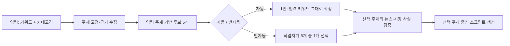

# 입력 키워드 우선: 후보 5개 → 선택 → 스크립트 생성

## 목적

작업자가 **입력 키워드**와 **카테고리**를 지정하면, 시스템은 그 주제를 바꾸지 않고 근거를 수집해 세부 기획 후보 5개를 제시한다. 카테고리는 분석 범위(렌즈)이며 입력 키워드를 일반 시장 이슈로 대체하는 값이 아니다.

예시 입력:

- 입력 키워드: `삼성전자 3분기 반도체 실적`
- 카테고리: `KOSPI`

금지 결과: `코스피 글로벌 바로미터`처럼 삼성전자·반도체·실적이 사라진 일반 지수 영상.

## 사용자 흐름

### 1. 새 롱폼 작업

1. 작업자는 제목/입력 키워드, 카테고리, 영상 길이, 자동 또는 반자동 모드를 입력한다.
2. 프론트엔드는 입력 키워드를 `seed`로 키워드 탐색 API에 전달한다.
3. Spring은 `job.keyword`를 아직 확정하지 않고 `KEYWORD_PENDING` 상태와 탐색 결과 자산을 저장한다.

### 2. 주제 고정 및 근거 수집

FastAPI KeywordWorker는 아래 순서로 실행한다.

1. `seed`에서 구체어를 추출한다. 예: `삼성전자`, `3분기`, `반도체`, `실적`.
2. 해당 `seed`로 최근 뉴스와 YouTube 공개 지표를 수집한다.
3. Claude는 **입력 키워드와 최소 두 개 이상 겹치는** 세부 주제만 순위화한다.
4. 뉴스/YouTube API가 부족하거나 쿼터가 소진되어도, 일반 코스피 뉴스로 주제를 바꾸지 않는다.
5. 입력 키워드 자체를 1번 후보로 항상 넣고, 부족한 후보는 사실을 덧붙이지 않는 세부 관점으로 채운다.

후보 예시:

1. `삼성전자 3분기 반도체 실적` — 입력 키워드 우선
2. `삼성전자 3분기 반도체 실적 핵심 쟁점`
3. `삼성전자 3분기 반도체 실적 시장 영향`
4. `삼성전자 3분기 반도체 실적 확인할 지표`
5. `삼성전자 3분기 반도체 실적 투자자 체크포인트`

이들은 사실을 새로 주장하는 제목이 아니다. 실제 수치·회사 사실·등락률은 이후 뉴스/시장 데이터 검증을 통과한 경우에만 스크립트에 사용한다.

### 3. 후보 선택

- **자동 모드:** 후보 1번(입력 키워드 그대로)을 확정한다. 기존에 리서치 화면에서 확정한 `job.keyword`가 있으면 그것을 그대로 유지한다.
- **반자동 모드:** 후보 5개와 각 후보의 근거·원본 영상·태그·공개 지표를 보여주고, 작업자가 하나를 선택한 뒤 다음 단계로 진행한다.
- 화면에는 `입력 키워드 우선`, `공개 YouTube 지표 없음`, `뉴스 근거`를 구분해 표시한다. 값이 없는 지표를 0점 성공 지표처럼 표시하면 안 된다.

### 4. 스크립트 생성

1. 선택된 후보를 `job.keyword`로 저장한다.
2. ScriptWorker는 선택 주제 자체로 최신 뉴스 근거를 다시 찾고, 일반 KOSPI 스냅샷은 보조 맥락으로만 쓴다.
3. 팩트체크와 스크립트 프롬프트는 선택 주제의 모든 고유어를 필수 주제로 취급한다.
4. 생성 후 검증은 문장 전체의 정확한 문자열 일치가 아니라, `삼성전자`·`3분기`·`반도체`·`실적`처럼 **고유어/시간 조건이 모두 등장**하고 충분한 문장이 그 주제를 다루는지 확인한다.
5. 최신 근거가 없으면 일반 코스피 대본으로 폴백하지 않는다. `주제 근거 부족` 상태로 멈추고, 작업자가 키워드 또는 자료를 보완하도록 안내한다.

## 역할 분리

| 값 | 역할 | 절대 하면 안 되는 일 |
|---|---|---|
| 입력 키워드 (`seed`) | 영상의 주제 경계와 후보 생성의 강제 조건 | 카테고리/뉴스 빈도 때문에 대체 |
| 카테고리 | 시장 범위와 분석 렌즈 | 영상의 메인 주제로 승격 |
| YouTube 공개 지표 | 후보 근거와 비교 우선순위 | 미수집/쿼터 소진 시 추정값 생성 |
| 뉴스/시장 데이터 | 사실과 수치의 검증 근거 | 입력 주제와 무관한 일반 대본의 근거 |
| 선택 후보 (`job.keyword`) | 스크립트·TTS·이미지 단계의 단일 기준 | 후속 단계에서 다른 키워드로 교체 |

## 오류 처리 및 상태

| 상황 | 처리 |
|---|---|
| YouTube 쿼터 소진 또는 공개 지표 없음 | 후보는 입력 키워드 중심으로 유지, UI에 `공개 YouTube 지표 없음` 표시 |
| 입력 키워드 관련 뉴스 없음 | `TOPIC_EVIDENCE_REQUIRED` 성격의 사용자 조치 상태로 중단. 일반 코스피 대본 생성 금지 |
| Claude가 일반 시장 후보 반환 | seed-overlap 검증에서 제거하고 입력 키워드 중심 후보로 교체 |
| 스크립트가 핵심어를 누락 | 핵심어 검증 실패로 중단, 누락 항목을 표시. 무관한 대본을 다음 TTS 단계로 넘기지 않음 |

## 수용 기준

- `삼성전자 3분기 반도체 실적` + `KOSPI` 요청의 자동 선택값은 정확히 `삼성전자 3분기 반도체 실적`이다.
- 5개 후보 어느 것도 `삼성전자`/`반도체`/`실적` 중 두 개 미만으로 구성된 일반 시장 주제가 아니다.
- 반자동 모드에서는 작업자가 후보 하나를 확정하기 전 스크립트 생성으로 넘어가지 않는다.
- 스크립트는 선택 주제의 고유어와 시간 조건을 반영하며, `KOSPI`는 보조 시장 맥락으로만 사용한다.
- YouTube API 데이터가 없을 때 조회수·구독자·조회수 대비 구독자 수를 지어내지 않는다.
- 최신 검증 근거가 없을 때 무관한 스크립트를 만들지 않고, 사용자에게 근거 부족을 명확히 알린다.
