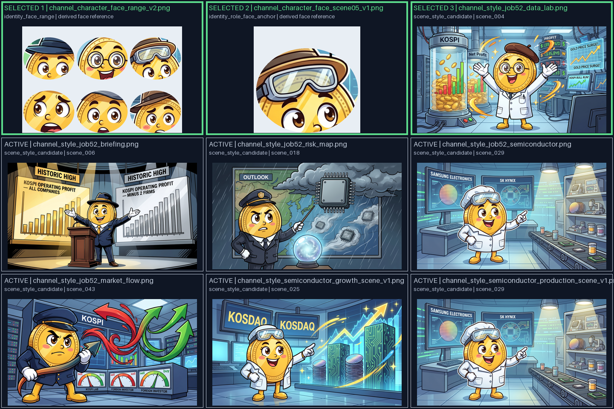

# WO-IMG-01-G — 승인 스크립트 → 레퍼런스 → Gemini 프롬프트 → 이미지 계보 감사

- 작성일: 2026-08-28 KST
- 대표 재현: Job52 scene07 보존 입력
- 범위: 읽기 전용 재구성 + 확인된 공통 결함 2건 최소 수정
- 외부 API 호출: 0회
- 새 이미지 생성: 0장
- 핵심 증거: `docs/evidence/wo_img01_g_script_reference_prompt_lineage_20260828/`

## 1. 결론

현재 이미지 생성은 단순히 대본 한 줄을 Gemini에 보내는 구조가 아니다. 실제 순서는 다음과 같다.

```text
승인 장면 내레이션·검증 사실
  → Claude가 만든 장면 프롬프트와 art direction
  → 장면 로컬 화면 문구 계약
  → 비승인/수치 문자 지시 제거
  → 결정론 표면·캐릭터 해부학 계약 추가
  → 프롬프트 의미에 따라 활성 참조 9개 중 최대 3개 선택
  → 참조별 역할 계약을 최종 프롬프트 앞에 추가
  → [참조 이미지 1, 2, 3, 최종 텍스트 프롬프트] 순으로 Gemini POST
  → 원본 PNG 문자/OCR 검사
  → Pillow 결정론 문자·수치 합성
  → 최종 OCR 정확 일치와 전체 시각 QA
  → 사용자 canary 육안 확인
  → 모든 정지 이미지 게이트를 통과한 장면만 Fal 후보
```

이번 감사에서 확인한 핵심은 세 가지다.

1. scene07의 실제 선택 참조는 얼굴 v2, 고글 얼굴 확대, Job52 scene04 데이터 연구실의 정확히 3장이다.
2. 결정론 문자를 넣을 모니터에 동시에 `non-linguistic shapes`를 그리도록 하던 공통 프롬프트 충돌이 있었다. 이 충돌은 공통 이미지 생성 경계에서 제거했다.
3. scene07 파일럿 계약은 `삼성전자`, `SK하이닉스`, `코스피`, `143조 원`을 전부 하나의 중앙 보드에 배치한다. 이는 “두 기업 용기는 옆으로 제외하고, 중앙 화면에는 코스피 영업이익을 표시한다”는 대본 의미와 맞지 않는다. 이 네 칸 계획 자체는 파일럿 래퍼가 만든 것이지만, 공통 운영 경로도 임의 스크립트의 문구를 오브젝트별 물리 표면에 자동 연결하는 계약이 아직 없다.

따라서 현재 상태를 “레퍼런스와 프롬프트가 모두 올바르다”라고 완료 선언할 수 없다. 이번 수정은 확인된 충돌 두 건을 공통 경로에서 막았고, 다음 작업은 **장면 오브젝트와 정확 문구 표면을 의미적으로 바인딩하는 공통 계약**이다.

## 2. 현재 활성 레퍼런스 9개

활성 여부는 `gemini_provider.py::_load_default_references()`가 실제로 존재를 강제하는 파일을 기준으로 했다. 디렉터리에 남아 있는 구형 `character_reference*`, `style_reference*`, `layout_reference*`, 얼굴 v1 등은 현재 기본 Gemini 요청 후보가 아니다.

| 순서 | 파일 | 역할 | Job52 원본 | scene07 선택 |
|---:|---|---|---|---|
| 1 | `channel_character_face_range_v2.png` | 얼굴 정체성 범위: scene03/04/05/09/13/14 얼굴 6개 | 파생 크롭 시트 | **1번 참조** |
| 2 | `channel_character_face_scene05_v1.png` | 고글·연구원 장면용 확대 얼굴 앵커 | scene05 파생 크롭 | **2번 참조** |
| 3 | `channel_style_job52_data_lab.png` | 데이터 연구실 화풍·정보 밀도 | scene004 바이트 동일 | **3번 참조** |
| 4 | `channel_style_job52_briefing.png` | 브리핑/무대 | scene006 바이트 동일 | 후보지만 상한 때문에 제외 |
| 5 | `channel_style_job52_risk_map.png` | 위험·날씨 지도 | scene018 바이트 동일 | 미선택 |
| 6 | `channel_style_job52_semiconductor.png` | 반도체 생산 | scene029 바이트 동일 | 미선택 |
| 7 | `channel_style_job52_market_flow.png` | 시장 수급 | scene043 바이트 동일 | 미선택 |
| 8 | `channel_style_semiconductor_growth_scene_v1.png` | 반도체 성장 | scene025 바이트 동일 | 미선택 |
| 9 | `channel_style_semiconductor_production_scene_v1.png` | 반도체 생산 | scene029 바이트 동일 | 미선택 |

scene029 기반 6번과 9번은 SHA-256까지 같은 중복 파일이다. 정상 문맥 선택에서는 두 파일을 동시에 보내지 않지만, 활성 후보 목록과 Git 보존 감사에는 중복으로 존재한다.

참조 전체 콘택트시트:



### 2.1 레퍼런스에서 실제로 얻는 것과 함께 딸려오는 위험

얼굴 v2와 scene05 확대 크롭은 얼굴만 마스킹되어 있어 역할이 비교적 명확하다. 반면 화풍 참조 7개는 “화풍만 추출한 시트”가 아니라 Job52 완성 장면이다.

모델이 얻어야 하는 신호:

- 굵은 가변 잉크 외곽선
- 2D 셀 셰이딩
- 금융 주제에 맞는 높은 정보 밀도
- 장면별로 달라지는 색감·의상·구도
- 금색 동전 마스코트와 배경 소품의 통합 방식

같이 들어가는 불필요하거나 상충 가능한 신호:

- 원본 장면의 영문·수치·차트 글자
- 장면마다 다른 팔다리 길이와 몸통 인상
- 현재 대본과 무관한 소품·구도
- 일부 장면의 강한 눈썹/직업적 인상

최종 프롬프트가 “레퍼런스의 실제 글자·수치·소품·구도를 복사하지 말라”고 명시하지만, 텍스트 지시가 시각 픽셀의 상충 신호를 물리적으로 제거하지는 않는다. 이번 scene07 회귀에서 얼굴 정량 계약만으로 해부학·전체 화풍 이탈을 막지 못했던 이유를 설명하는 유력한 구조적 위험이다. 다만 이것만으로 공급자 출력과의 인과가 확정된 것은 아니다.

## 3. scene07 단계별 실제 재구성

### 3.1 승인 스크립트와 검증 사실

승인 원문:

> 삼성전자와 SK하이닉스를 제외해도요. 코스피 영업이익이 143조 원에 달했죠.

- 내레이션 SHA-256: `143e208a9e08b8b0cd335b3084dd9bf88af17b6ac68576af0ae206ed147a6d23`
- 수치 근거: `verified_facts[3]`
- 근거 내용: 삼전닉스를 제외하더라도 코스피 영업이익 143조 원
- 출처: 이데일리(마켓인) 2026-08-19
- 신뢰도: 0.7
- 교차 검증: `false`, 단일 출처

즉 모델이 임의로 만든 143조가 아니다. 다만 “23개 언론사 복수 교차검증 완료 수치”라고 확대해서도 안 된다. 현재 보존 데이터상 이 수치는 단일 출처이며, 화면 합성 시에도 이 계보를 유지해야 한다.

### 3.2 원래 장면 프롬프트

원본은 다음 요소를 직접 요구했다.

- 흰 실험복과 고글의 Goldie
- 데이터 연구실
- 중앙 모니터의 `KOSPI Operating Profit: 143조`
- `Samsung Electronics`, `SK Hynix` 라벨 용기 두 개를 옆으로 제외
- 굵은 잉크와 셀 셰이딩

이 프롬프트는 대본 의미 연결은 좋지만 Gemini가 금융 수치와 회사명을 직접 쓰게 한다. Job52의 의사문자·오탈자 위험이 여기서 생긴다.

### 3.3 공통 문자·해부학 경계 통과 후 프롬프트

현재 코드는 원본 장면을 없애지 않고 문자 지시만 다음처럼 바꾼다.

- 중앙 수치 모니터 → 장면 안에 원래 존재하는 차분하고 균일한 물리 모니터 표면
- 회사명이 붙은 용기 → 문자 없는 용기 정확히 두 개
- “옆으로 제외됨”이라는 행동 관계는 보존
- 마스코트 → 하나의 동전 원판이 머리와 몸통 전체를 이루고, 짧은 팔 2개·다리 2개
- 의상 → 이 장면의 흰 실험복·데이터 고글 유지

공급자 전 단계 프롬프트:

- 파일: `bounded-pre-provider-prompt.txt`
- SHA-256: `7630d5f5697b20de4f10c67a972b2f39d06345014afba459f47dc62e49a3f984`
- 길이: 3,306자

이번 수정 전에는 중앙 모니터를 `non-linguistic shapes`로 채우라는 문구와, 같은 내부를 `no marks, symbols, line art` 상태로 비우라는 문구가 동시에 존재했다. 실제 canary에서 모니터가 장식 그래프로 빽빽해져 결정론 표면이 사라진 현상과 방향이 일치한다. 수정 후 이 상충 표현은 0건이다.

### 3.4 참조 선택 이유

선택 함수는 프롬프트의 의미 토큰을 읽는다.

- `data laboratory`, `lab coat` → `data_lab` 그룹
- `goggles` → 고글 얼굴 앵커 추가
- 최대 참조 수 → 3

따라서 실제 순서는 다음과 같다.

1. 얼굴 v2 6분할 정체성 시트
2. scene05 고글 얼굴 확대
3. Job52 scene04 데이터 연구실

두 얼굴 참조가 먼저 두 슬롯을 사용하므로 `data_lab` 그룹의 두 번째 후보인 scene06 브리핑은 이번 요청에서 제외된다. 이는 “후보가 활성 상태”와 “이번 POST에 실제 첨부됨”을 구분해야 하는 이유다.

### 3.5 Gemini POST 직전 최종 프롬프트

공급자 어댑터가 세 참조의 역할을 설명하는 `FINAL GEMINI REFERENCE CONTRACT [job52-range-v2-operational-v2]`를 프롬프트 맨 앞에 붙인다.

최종 POST의 `contents[0].parts` 순서:

1. 얼굴 v2 PNG inlineData
2. scene05 얼굴 PNG inlineData
3. scene04 데이터 연구실 PNG inlineData
4. 최종 텍스트 프롬프트

최종 텍스트:

- 파일: `final-gemini-prompt.txt`
- SHA-256: `5be5bc1982ea2ceed15301a858569634ae17173ee25f785fb8972555dd2ebdec`
- 길이: 6,282자

이것은 **현재 코드가 같은 입력에 보낼 프롬프트의 재구성**이다. Job52 당시의 실제 요청 원문이라고 소급 주장하지 않는다. 이번 감사에서는 외부 POST를 하지 않았다.

### 3.6 생성 이후

Gemini 원본 PNG가 반환되면 다음을 순서대로 통과해야 한다.

1. 생성 원본의 비승인 문자·금융 수치 OCR 차단
2. 승인 문구를 Pillow로 물리 표면에 합성
3. 최종 프레임 OCR의 정확 문자열·위치 검증
4. 캐릭터 해부학·얼굴·화풍·대본 의미 전체 QA
5. 유료 canary는 실제 이미지 첨부 후 사용자 육안 승인 전까지 보류
6. 정지 이미지가 모두 통과한 뒤에만 Fal 적격성 판정

따라서 Gemini HTTP 200은 이미지 승인과 동의어가 아니다.

## 4. 새로 확인한 의미 연결 결함

### 4.1 파일럿에서 실제로 잘못 연결된 표면

scene07의 파일럿 `screen_text_plan`은 다음 네 문구를 모두 `surface="main"` 보드의 네 사분면에 넣는다.

- 삼성전자
- SK하이닉스
- 코스피
- 143조 원

하지만 대본 의미에 맞는 연결은 최소 두 종류다.

```text
삼성전자 / SK하이닉스 → 옆으로 제외된 두 개의 개별 용기 표면
코스피 / 143조 원       → 중앙 영업이익 모니터 표면
```

현재 계획대로면 Gemini가 용기 두 개를 정확히 그려도, 후처리 문자는 중앙 보드에 몰린다. 그러면 “두 기업을 제외해도”라는 인과가 시각적으로 약해진다. 이 문제는 이미지 한 장 재생성으로 해결되지 않는다. 렌더 입력 계약을 고쳐야 한다.

### 4.2 파일럿 전용 오류와 공통 경로의 미완성을 구분

- 네 문구를 무조건 `main`에 넣은 직접 원인: `run_gemini_eight_scene_pilot.py::prepare_pilot_scene`
- 일반 영상 생성 버튼 경로: 동일한 네 칸 래퍼를 자동 실행하지 않는다.
- 공통 경로에 남은 문제: `attach_scene_screen_texts()`는 대본에서 문자열을 뽑지만, 그 문자열이 어떤 오브젝트의 어떤 표면에 속하는지 자동 계획하지 않는다.

따라서 “파일럿만 고치면 끝”도 아니고 “모든 운영 영상이 지금 네 칸으로 생성된다”도 아니다. 다음 공통 작업은 `text → semantic object → physical surface → renderer/OCR` 계보를 장면마다 명시하는 것이다.

## 5. 이번에 공통 경로에 반영한 수정

### 5.1 결정론 표면 프롬프트 충돌 제거

수정 전:

- 문자 제거기: 같은 모니터에 비언어적 도형을 그리라고 함
- 결정론 표면 계약: 같은 모니터 내부에 선·기호·장식이 없어야 한다고 함

수정 후:

- 장면의 모니터/보드/용기 자체는 보존
- 나중에 정확 문자를 합성할 한 물리 표면 내부만 `calm uniform interior`로 통일
- 별도 빈 카드나 거대 보드를 추가하지 않음

이 수정은 scene07 조건문이 아니라 `_bounded_text_generation_prompt()`를 타는 모든 결정론 문자 장면에 적용된다.

### 5.2 활성 얼굴 역할 참조의 Git 보존 감사 누락 수정

실제 로더는 `channel_character_face_scene05_v1.png`를 사용했지만, 역사 정리 화이트리스트 파서는 얼굴 범위와 화풍 목록만 읽었다. 그대로 Git 이력 정리를 진행하면 운영에서 쓰는 고글 얼굴 앵커를 정리 후보로 오분류할 수 있었다.

수정 후 `_FACE_ROLE_REF_NAMES` 값도 활성 자산으로 읽는다. 활성 수는 8개가 아니라 9개이며, 생성 선택과 자산 보존 감사가 같은 집합을 본다.

## 6. 아직 반영하지 않은 항목

다음은 이번 관찰로 확정했지만 설계를 더 해야 하므로 성급하게 자동 수정하지 않았다.

1. 오브젝트별 의미 표면 바인딩
   - 회사명은 개별 용기, 지수명·수치는 중앙 화면처럼 연결해야 한다.
   - 특정 회사명/scene07 하드코딩이 아니라 임의 주제의 `label/value/object relation` 계약이어야 한다.
2. 화풍 참조와 해부학 참조 분리
   - 현재 화풍 장면은 유용한 스타일과 불필요한 글자·상이한 신체 비례를 함께 담는다.
   - 어떤 Job52 전신 장면을 승인 실루엣 범위로 쓸지는 사용자 판정 없이 임의 선택하지 않는다.
3. 활성 scene029 중복 파일 정리
   - 현재 기능 오류는 아니지만 동일 바이트를 두 이름으로 관리한다.
   - 과거 증거·롤백 경로를 확인한 뒤 별도 정리한다.
4. 일반 운영 장면의 비수치 문구 전략
   - 공통 운영은 승인된 비수치 문구를 Gemini가 직접 쓸 수 있고 금융 수치만 결정론 렌더한다.
   - 이번 파일럿은 정확도 측정을 위해 네 문구 모두 결정론 렌더로 보낸 별도 레인이다.
   - 파일럿의 더 엄격한 정책을 모든 영상에 무조건 전역 적용하지 않는다.

## 7. 3대 목표와의 연결

| 목표 | 이번 감사의 연결 | 현재 판정 |
|---|---|---|
| 1. YouTube·스크립트 품질/시간 | 승인 문장과 `verified_facts`가 이미지 의미와 수치 표면의 원천인지 확인했다. 단일 출처 143조를 복수 교차검증처럼 과장하지 않았다. 자막 청크와 장면 의미가 같아야 한다는 계보의 이미지 구간을 구체화했다. | 시간·TTS 계약은 이번에 변경하지 않음. 이미지 의미 연결은 진행 중. |
| 2. Fal/Kling 모션 | 텍스트·수치·물리 표면·해부학·화풍을 모두 통과하기 전에는 Fal로 넘기지 않는다. 향후 움직일 대상은 문자/수치가 아니라 캐릭터 팔·표정, 용기 이동, 조명 등으로 분리할 수 있는 장면 구조가 필요하다. | 안전 게이트 유지. 이번에는 Fal 실행 안 함. |
| 3. 이미지 오탈자·이탈자/내용 정확도 | 실제 레퍼런스·프롬프트·후처리 표면을 하나의 계보로 대조했다. 상충 프롬프트 1건을 공통 수정했고, 문구가 잘못된 오브젝트에 붙는 상류 의미 바인딩 결함을 새로 특정했다. | 핵심 진행 영역. 완료 아님. |

Job52에서 만족했던 굵은 선·셀 셰이딩·정보 밀도·장면 다양성은 현재 7개 실제 장면 참조로 공통 선택기에 반영되어 있다. Job52에서 불만족했던 임의 문자·오탈자·말풍선·해부학·화풍 이탈은 문자 계약, OCR, 얼굴 v2, 전체 시각 QA로 차단 중이다. 이번 감사로 “좋은 화풍 참조 자체에도 글자와 신체 비례 변동이 섞여 있다”는 새로운 경계를 확인했으므로, 진행률을 과장하지 않는다.

## 8. 검증과 커밋 계보

선행 실패:

- 활성 역할 얼굴 참조가 보존 화이트리스트에서 누락
- 결정론 표면 프롬프트에 `non-linguistic shapes`와 `no marks`가 동시 존재

수정 후 집중 회귀:

- `tests/test_reference_cleanup_audit.py`
- `tests/test_generated_image_text_gate.py`
- `tests/test_script_reference_prompt_lineage_audit.py`

결과:

- 선행 격리: 2 failed, 18 passed — `red.xml`
- 수정 후 집중: 22 passed — `focused-green.xml`
- Docker 소켓 차단 전체 오프라인: 1,124 passed, 1 deselected, 22 warnings — `full-offline-green.xml`

전체 검사에서 제외한 한 건은 기존 Google RSS 실접속 테스트다. 호스트 Python은
`faster_whisper`, `cv2`가 없어 전체 수집 기준으로 사용할 수 없었고, 실제 FastAPI
의존성이 있는 Docker 이미지와 읽기 전용 저장소 마운트, `--network none`으로 재검증했다.

커밋:

- `209e3ea` — 선행 실패 테스트
- `9fc4a10` — 활성 참조·결정론 표면 최소 수정
- `4e603e1` — 대본→레퍼런스→Gemini 계보 감사 도구와 회귀

## 9. 다음 구현 순서

1. 일반 장면에 쓸 `semantic_object_id`, `surface_id`, `text_role(label/value)` 계약 설계
2. 대본/장면 프롬프트에서 오브젝트 관계를 보존한 표면 계획 생성
3. 한 문구가 다른 오브젝트 표면으로 라우팅되면 Gemini 호출 전에 fail-closed
4. 결정론 렌더와 OCR manifest가 같은 `surface_id`를 사용하도록 연결
5. Job52 scene07은 회귀 fixture로만 사용하고, 회사·산업·주제가 다른 합성 fixture로 일반성 검증
6. 오프라인 통과 뒤 한 장 canary → 실제 이미지 첨부 → 사용자 육안 판정

이 순서를 통과해야 “스크립트 내용 확인 → 레퍼런스 확인 → 실제 Gemini 프롬프트 → 생성 이미지”의 각 연결을 한 장면뿐 아니라 영상 생성 버튼이 만드는 모든 새 장면에서 검증할 수 있다.
