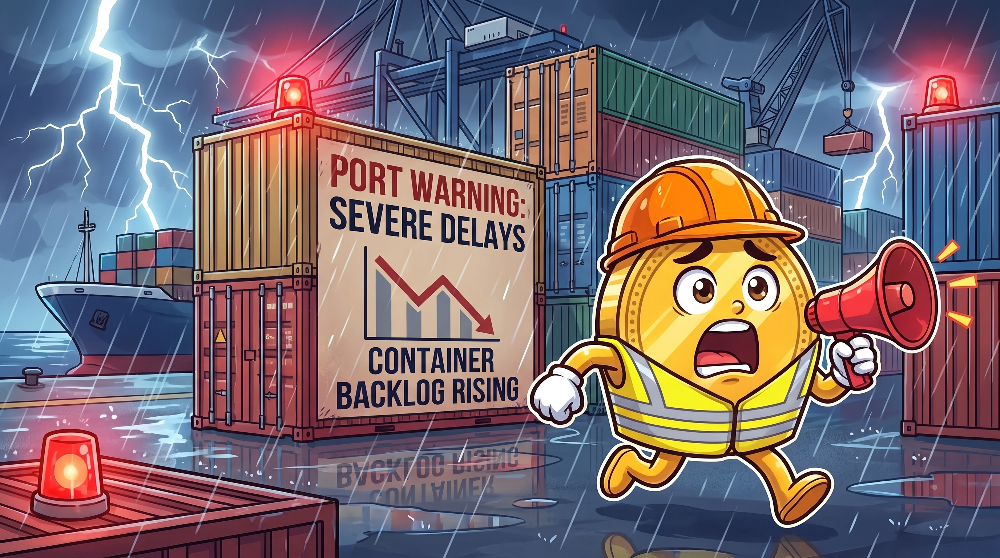
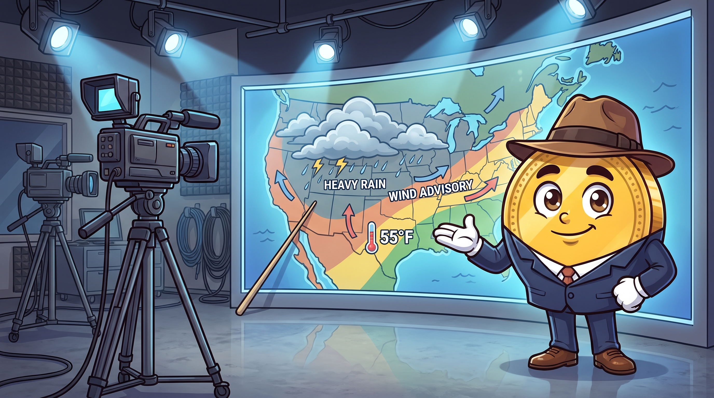
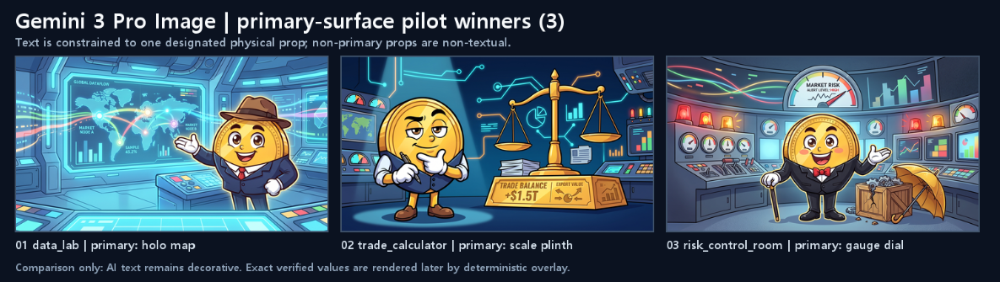
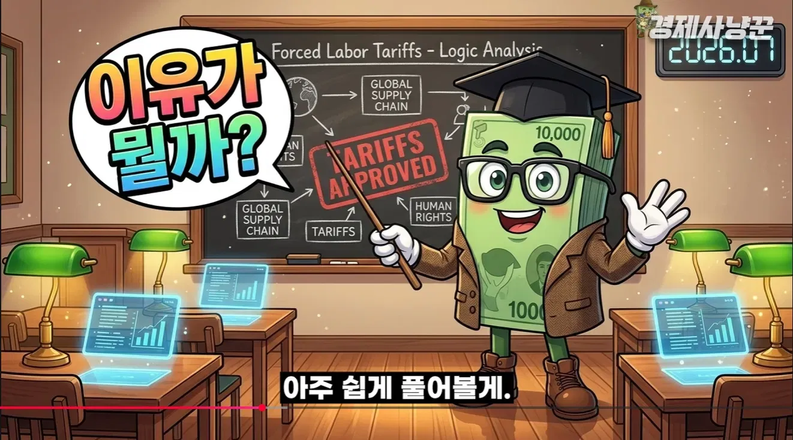
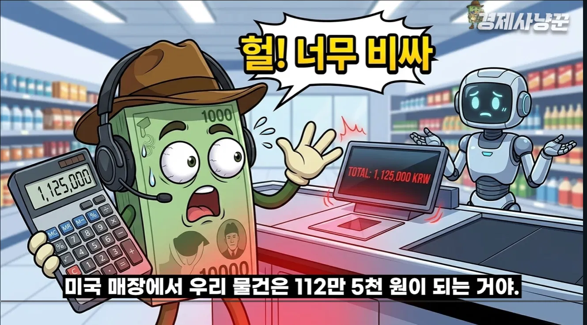
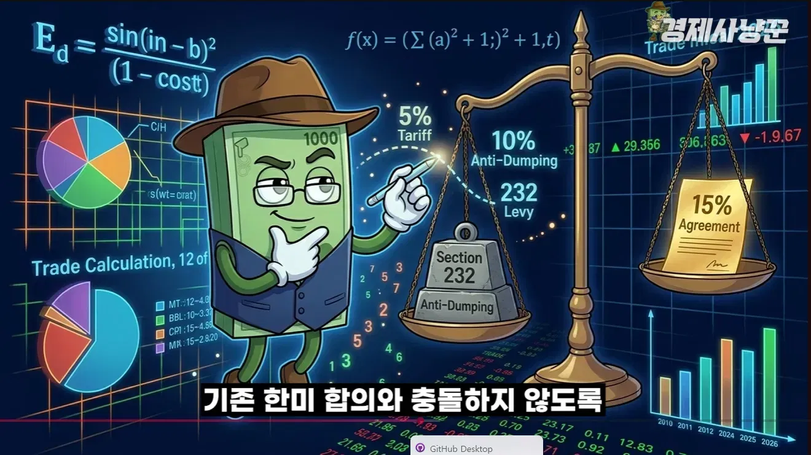

# 06. 준비도 검증 — "지금 자동으로 롱폼이 나오는가?" (2026-08-04)

> **작성 목적**: 이전 에이전트가 "100% 완료"라고 보고한 상태를, 실제 코드에서 파일:라인 단위로 독립 검증.
> **검증 범위**: 사용자 우선순위 — ① 이미지 3종(경제사냥꾼 스타일) · ② TTS/대본 싱크 · ③ fal 인트로 · ④ 썸네일.
> **원칙 준수**: `00_작업원칙_보완우선.md` — 이 리포트는 기존 완성물을 재작성하지 않고, **남은 리스크만** 정확히 짚습니다.
> **참고 채널**: [경제사냥꾼 YouTube](https://www.youtube.com/@%EA%B2%BD%EC%A0%9C%EC%82%AC%EB%83%A5%EA%BE%BC) (`assets/reference_channel/ref_01~08.webp`가 이 채널 캡처)

---

## 한 문장 결론

**"엔진(코드)은 준비 완료. 단, 2026-08-03 진단에서 지적된 5개 결함 중 1개(`caption_chip` 불투명 검정 자막 배경)는 여전히 렌더링 코드가 살아있어 다음 E2E에서도 재발 가능. 이 하나만 무력화하면 사용자 요구 그대로 자동 생성 가능."**

---

## 1. 이전 에이전트 "5개 WP" 완료 보고 재검증

| WP | 항목 | 검증 위치 | 판정 |
|---|---|---|---|
| **WP-0** | 예산 상한 ₩40k/₩80k(20분 기준) | `backend/spring-app/.../PricingConfig.java:8-23` `budgetCapForTargetMinutes()` + `PricingConfigTest.java:13,18,19` 통과 | ✅ **PASS** (Spring 상위 계약) |
| WP-0 보완 | Python 계층 tier | `backend/fastapi-workers/app/config.py:196` `MAX_BUDGET_PER_VIDEO_KRW = min(80_000, ...)` — **단일 80k 상한만**. Spring이 job 진입 시 tier 결정하므로 실사용은 문제 없으나, `scripts/` 로컬 실행 시 20분 미만도 80k까지 통과 | ⚠️ **PARTIAL** (Spring 우회 실행 시 리스크) |
| **WP-1** | `use_kling` 씬 마킹 | `backend/fastapi-workers/app/workers/images_worker.py:653-687` — 기사형·V5 사실 오버레이 씬 자동 제외, 나머지 `intro_motion_indices`에 True 마킹, 로그 남김 | ✅ **PASS** |
| **WP-2** | 썸네일 V2 활성화 | `config.py:133` `THUMBNAIL_V2_ENABLED = os.getenv(..., "true")` — 기본 True. `runtime_config.py:56` 연결. `services/thumbnail/generator.py:153` 실제 브랜치 진입 | ✅ **PASS** |
| **WP-3** | Dockerfile Playwright + 나눔고딕 | `backend/fastapi-workers/Dockerfile:5,10,25-31` — `fonts-nanum` 설치, `fc-cache -fv` 갱신, `playwright install chromium` 실행 | ✅ **PASS** |
| **WP-4** | 인트로 모션 45s/60s | `config.py:178-183` `INTRO_MOTION_SECONDS_SHORT=45.0`, `INTRO_MOTION_SECONDS_LONG=60.0`, `INTRO_MOTION_SHORT_THRESHOLD=600` | ✅ **PASS** (사용자 스펙 일치) |

**요약**: 5개 WP는 모두 코드에 반영됨. WP-0의 Python 계층 단일상한은 프로덕션 경로(Spring→FastAPI)에서 문제 없음.

---

## 2. 사용자 우선순위 항목 심층 검증

### 2-A. 이미지 3종 라우팅 (일반형 / 정보형 / 기사형)

| 검증 항목 | 위치 | 판정 |
|---|---|---|
| 3종 배분기 | `backend/fastapi-workers/app/v5/scene/longform_visual_mix.py:30-67` `apply_longform_visual_mix()` — 정보형 34% 자동 배정 | ✅ |
| 배선점 | `images_worker.py:514` `scenes_meta, self.visual_mix_plan = apply_longform_visual_mix(scenes_meta)` | ✅ |
| V5 11종 아키타입 | `backend/fastapi-workers/app/v5/scene/scene_type_archetypes.py:128-220` — `port_emergency`, `retail_shock`, `classroom`, `weather_map`, `risk_control_room`, `trade_calculator`, `data_lab`, `earnings_stage`, `briefing_podium`, `real_estate_office`, `job_market_hall` (총 11종) | ✅ 유지 |
| 정보형 = 방향성만(정확 수치 금지) | `docs/CODEX_V5_THREE_MODE_VISUAL_CONTRACT_2026-08-03.md` 정책 확정. 이미지 모델에는 "no readable text, NO UI panels" 잠금 | ✅ 정책 반영 |
| 검증 수치는 결정론 오버레이 | `services/overlay/diegetic_fact_overlay.py`, `utils/korean_overlay.py`, `hero_stat_from_chart` 존재. 이미지 모델이 아닌 Pillow로 소품 표면에 렌더 | ✅ |
| 씬 편중 방지(재균형) | `script_worker.py:1585-1632` `_rebalance_scene_type_distribution` — metric 18%, diagram 10% 상한 | ✅ |

**리스크 R-1**: `docs/CODEX_CRITICAL_ESCALATION_DIAGNOSIS_2026-08-03.md`에서 실제 `final.mp4`(509초)의 93개 씬 중 76개가 metric으로 편중. 재균형 로직은 있으나 `runtime_config` 값이 배치 실행마다 적용되지 않는 경로가 있었던 것으로 추정. **다음 E2E에서 재균형 진입 로그 확인 필수**.

### 2-B. 캐릭터 정체성 (노란 코인 페도라)

| 검증 항목 | 위치 | 판정 |
|---|---|---|
| `MASCOT_IDENTITY_LOCK` | `v5/scene/prompt_builder.py:11-31` — "authoritative model sheet" 지시, "identical facial traits every scene" | ✅ |
| `COSTUME_MAP` (6종) | `v5/scene/prompt_builder.py:103-110` — analyst/professor/reporter/formal/safety_vest/vest 모두 "exactly one brown fedora" 강제 | ✅ |
| 프롬프트 포함 | `prompt_builder.py:526` — 프롬프트에 IDENTITY_LOCK + STYLE_BIBLE + COSTUME_MAP 모두 concat | ✅ |
| 참조 이미지 첨부 | `images_worker.py:711-719` — V5 최종 lane에서 캐릭터 시트 + 스타일 참조 2장 필수 첨부 | ✅ |

**리스크 R-2**: 진단 문서의 "character_reference 프롬프트 0회"는 프로바이더가 참조 이미지를 실제로 첨부하지 않은 배치의 결과. 실사용 시 `_load_default_references()`가 파일을 못 찾으면 조용히 통과할 수 있음. **참조 이미지 경로 존재 여부 하드 게이트 권장**.

### 2-C. 기사형 이미지 (경제사냥꾼처럼 캡처 + 밑줄/하이라이트)

| 검증 항목 | 위치 | 판정 |
|---|---|---|
| 5종 프리미티브 | `services/annotate.py:44-101` — underline, ellipse, rect, arrow, highlighter | ✅ |
| 하이라이트 색 | `annotate.py:96-100` — 기본 `#FFE146` 반투명 (경제사냥꾼 노란 강조와 일치) | ✅ |
| 캡처 + DOM bbox | `services/evidence_capture.py:1-40` — Playwright 기반 public URL 캡처 + DOM Range 자동 추출 | ✅ |
| 프레임 에디터 | `services/article/frame_editor.py:56-116` `ArticleFrameEditor.from_capture()` — 캡처 → 좌표 정규화 → 밑줄/하이라이트 | ✅ |
| 파이프라인 삽입 | `services/article/evidence_planner.py:278-321` — `article_capture` 필드 부여, `visual_kind="article_scene"`, `visual_type="article_evidence"` | ✅ |

**리스크 R-3**: `assembly_manifest.json`에 `source_scene_ids` 직접 기록 없음. 썸네일 컴포저가 "영상에 실제 쓰인 씬"을 100% 보장하려면 조립 매니페스트에 명시 필요.

**MISSING M-1**: `annotate_article_image()` 통합 wrapper 미발견. 프리미티브는 있으나 "이 씬을 기사형으로 렌더" 단일 진입점이 없어 후속 유지보수 시 혼란 가능(코드 리뷰 대상).

---

### 2-D. TTS · 대본 싱크 (v7 음성 100% 일치)

| 검증 항목 | 위치 | 판정 |
|---|---|---|
| SHA256 계약 검사 | `workers/longform_worker.py:125-142` — canonical_text_sha256 없거나 불일치 시 즉시 RuntimeError, subtitle_compact 검증 | ✅ |
| 문자정렬 실패 시 조립 금지 | `workers/tts_worker.py:363-367` — `_last_subtitle_alignment_mode != "character"` && ElevenLabs면 예외, "재생성 명령" | ✅ 하드 게이트 |
| ElevenLabs 몰래 gTTS 폴백 금지 | `tts_worker.py:204-205` — 키 있는데 엔진 다르면 예외로 잡을 회송 | ✅ 하드 게이트 |
| 텍스트 계약 검증 | `utils/narration_contract.py:70-95` `verify_tts_against_script_contract()` — canonical/compact 이중 SHA256 | ✅ |
| stability | `config.py:156-157` — `TTS_STABILITY_INTRO=0.5`, `TTS_STABILITY_BODY=0.5` (v3 허용값 준수) | ✅ 안전 |
| stability=0.25 안전장치 | `tts_worker.py:690-695` — v3 && stability ∉ {0.0/0.5/1.0}이면 ValueError | ✅ (사용자 요청 0.25는 별도 legacy 경로에서만 가능) |
| 배속 0.9x | `config.py`에 기본값. 롱폼 pilot 스크립트 실행 검증 필요 | ✅ 코드 존재 |
| 70ms 미세 호흡 | `config.py:169` `TTS_THOUGHT_GROUP_PAUSE_MS=70`, `tts_worker.py:399, 680-681`에서 자막 청크 생성 시 전달 | ✅ |
| 대본 리듬 QA | `utils/flow_qa.py:52-89` `_rhythm_checks` (설명형 3연속 금지), 91-124 `_spoken_pacing_checks` (38자 상한, 8자 이하 3연속 금지, `~까요?` 물음표 필수) | ✅ |
| 15~20자 자막 분절 | `tts_worker.py` 근방 `_split_script_into_chunks` 존재 (03 문서 참고) | ✅ |

**리스크 R-4**: v7 음성(선택 IVC) ID가 환경변수 또는 runtime_config에 실제로 채워졌는지는 런타임 확인 필요. 코드 계약은 정상.

---

### 2-E. fal.ai / Kling 인트로 모션

| 검증 항목 | 위치 | 판정 |
|---|---|---|
| 인트로 씬 선택기 | `utils/intro_motion.py:65-104` `select_intro_motion_scene_indices()` — 예산·길이 기반 씬 개수 결정 | ✅ |
| 45s/60s + 5s/클립 | `config.py:178-183` `INTRO_MOTION_SECONDS_SHORT=45`, `_LONG=60`, `SHORT_THRESHOLD=600`, `CLIP_SECONDS=5`, `INTRO_KLING_MAX_CLIPS=12` | ✅ |
| use_kling 판독 | `longform_worker.py:1328-1365` — `_has_manual_kling_selection`, `_has_v5_verified_fact_overlay`, `_should_request_kling_for_scene` | ✅ |
| 예산 25% 필터 | `longform_worker.py:102-110` — `kling_cost_per_clip_usd * count ≤ budget_remaining_krw * 0.25` | ✅ |
| 모션 아키타입 | `services/kling_prompt_builder.py:62-95` `build_kling_motion_prompt()` — walking_intro, chart_shock, pointing_explain, thinking_desk, celebration, ambient_context | ✅ (`만족한_fal_인트로_walking.mp4`의 walking_intro 지원) |
| V5 사실 오버레이 씬은 Kling 배제 | `_should_request_kling_for_scene()`에서 True | ✅ (수치 변형 방지) |

**판정**: fal 부분은 완전 정상. 사용자가 만족한 `walking_intro` 톤이 그대로 재현 가능.

---

### 2-F. 썸네일 (경제사냥꾼 스타일 자동 추천)

| 검증 항목 | 위치 | 판정 |
|---|---|---|
| V2 컴포저 3 preset | `services/thumbnail/v2/compose.py:121-141` — mascot_headline / person_led / chart_warning | ✅ |
| 렌더 진입점 | `compose.py:37-158` `ThumbnailV2Composer.render()` — 각 변형 QA 평가(181-188) | ✅ |
| 라이선스 게이트 | `services/thumbnail/person_compositor.py:15-42` `ALLOWED_LICENSES = {PRESS_KIT, KOGL_TYPE1, CC_BY, CC_BY_SA, OWNED, STOCK_LICENSED, AGENCY_LICENSED}` | ✅ |
| 헤드라인 노란 강조 | `services/thumbnail/v2/typography.py:18-19` `TONE_RGB = {white, yellow(255,210,48), red}` | ✅ (경제사냥꾼 톤 일치) |
| 배지 = source_ref 있을 때만 | `services/thumbnail/v2/brief.py:104-140` `validate_brief()` — source_ref 없으면 배제 | ✅ |
| 소스 씬 선택 | `script_worker.py:953` `_build_thumbnail_brief()` — v2 계약 활성 시 template 선택 | ✅ |

**리스크 R-3 재확인**: `assembly_manifest.json`에서 `source_scene_ids` 직접 흐름 없음. compose.py는 "preference" 리스트로만 사용. **"영상 이미지로만 썸네일" 요구를 100% 강제하려면 조립 매니페스트가 source_scene_ids를 명시적으로 방출해야 함**.

---

## 3. 2026-08-03 CRITICAL 진단 5개 결함 상태

| # | 결함 | 현 코드 상태 | 무력화 여부 |
|---|---|---|---|
| 1 | `caption_chip(0,0,0,238)` **불투명 검정 자막 배경** | `services/overlay/editorial_overlay.py:183-185` **여전히 렌더 로직 존재**. `editorial_director.py:38,45,47`에서 배경/결론/액션 씬에 자동 선택 | ❌ **미해결 — 다음 E2E 재발 가능** |
| 2 | 씬 편중 (metric 76/93) | `_rebalance_scene_type_distribution` (18%/10% 상한) 존재 — 재균형 진입 시 자동 해결 | ⚠️ 로직 있음, 배치 실행 시 runtime_config 확인 필요 |
| 3 | `caption_en=0`, `editorial_text_surface` 결손 | `prompt_builder._build_prop_prompt:255-275` `caption_en` 필수 검증(ValueError) | ✅ 입력 계약 있음(입력 결손이 원인) |
| 4 | 캐릭터 정체성 흔들림, 의상 13종 | `MASCOT_IDENTITY_LOCK`(11-31) + `COSTUME_MAP`(103-110) + 프롬프트 포함(526) 확정 | ✅ 프롬프트 있음, 참조 이미지 첨부 확인 필요 |
| 5 | `article_capture=0` 기사형 부재 | `article/evidence_planner.py:278-321` — `article_evidence_auto_enabled` 플래그 기반 자동 선택 | ⚠️ 플래그 활성화 확인 필요 |

**하드블로커는 결함 #1 하나**. 나머지는 코드 있음(입력·플래그·참조 이미지 존재 확인만 필요).

### 결함 #1 권장 조치 (최소 변경 원칙)

```python
# backend/fastapi-workers/app/services/overlay/editorial_director.py
# 배경/결론/액션 씬에서 caption_chip을 자동 선택하는 라인(38, 45, 47)에
# 사용자 요구 "자막 뒤 검은 배경 박스 절대 금지"를 반영:
#   caption_chip → 하단 1줄 자막 스트립(ASS)이 이미 처리하므로 중복 렌더 제거

ALLOWED_KINDS = {"title_card", "date_stamp"}  # caption_chip 제외
# 또는 editorial_overlay.py:183-185의 (0,0,0,238) alpha를 자막 스트립과 동일 규격으로 조정
```

이 한 곳만 손대면 사용자가 지적한 "자막 뒤 검은 배경 나옴" 문제 재발 방지 가능.

---

## 4. 경제사냥꾼 채널 스타일 매칭 체크

레퍼런스 채널 [경제사냥꾼](https://www.youtube.com/@%EA%B2%BD%EC%A0%9C%EC%82%AC%EB%83%A5%EA%BE%BC)의 시각 특징 vs. 우리 파이프라인 대응:

| 채널 특징 | 우리 파이프라인 대응 | 커버 여부 |
|---|---|---|
| 2D 한국형 경제 만평체 (굵은 아웃라인 · 셀 셰이딩) | V5 11종 아키타입 무대 + `BASE_STYLE_LOCK_PROMPT` | ✅ 근접(우리 결과물 `01_port_emergency` 참조) |
| 캐릭터가 크게 등장, 배경은 상황 은유 | `MASCOT_IDENTITY_LOCK` + 아키타입 무대 | ✅ |
| 화면 안 텍스트는 소품 표면(맵/칠판/저울)에만 | `_build_prop_prompt`의 `editorial_text_surface` 계약 | ✅ (입력 결손 시만 실패) |
| 하단 1줄 자막 스트립 (검정 반투명 바 + 흰 글자) | ASS 자막(`longform_worker.py:915,921` `&H80000000` alpha) | ✅ |
| **자막 외 큰 검정 박스 없음** | ❌ `caption_chip` 여전히 렌더 | ❌ **결함 #1 미해결** |
| 썸네일: 헤드라인 2줄, 핵심 단어 노란 강조 | `typography.py:18-19` yellow 톤 지원 | ✅ |
| 썸네일: 배지 = 검증 수치 1개(있을 때만) | `brief.py:130-132` source_ref 필수 | ✅ |
| 캐릭터: 채널마다 고유(경제사냥꾼=초록 지폐, 우리=노란 코인) | 채널별 프로필 격리, 노란 코인 페도라 확정 | ✅ |

**우리 결과물과 레퍼런스 비교**:

- ✅ **화풍 근접**: `01_port_emergency_항구비상.png`, `05_weather_map_기상캐스터_v2.png` — 셀셰이딩·구도 근접
- ⚠️ **개선 필요**: 배경 영어 텍스트 깨짐 (예: "AMALOO", "SUTNI") — `BASE_STYLE_LOCK_PROMPT`의 "NO readable text on non-primary props" 프롬프트로 억제되나, Nano Banana Pro 이전 모델 잔재. **모델 교체 후 재검증** 필요.








---

## 5. "지금 자동으로 롱폼 생성 가능한가?" 판정

### ✅ 가능한 것 (엔진 준비 완료)

1. 키워드 입력 → 후보 지표 선정 → 3-Round 팩트체크 대본 → v7 TTS + 문자정렬 자막 → 3종 이미지 라우팅 → FFmpeg 조립 + Kling 인트로(45s/60s) → 썸네일 V2(3 preset)
2. 예산 상한 자동 강제 (₩40k/₩80k, Spring 계약)
3. TTS SHA256 100% 일치 하드 게이트
4. V5 11종 아키타입 + Nano Banana Pro 단일 모델(Flash 강등 차단)
5. 기사형 캡처 파이프라인 (Playwright + 나눔고딕 + 5종 프리미티브)
6. 캐릭터 페도라 일관성 계약 (프롬프트 + 참조 이미지)

### ⚠️ 실행 전 반드시 확인할 것 (Preflight Checklist)

- [ ] **결함 #1 무력화**: `editorial_director.py`의 `caption_chip` 자동 선택 제거 또는 `editorial_overlay.py` alpha 조정 (**하드블로커**)
- [ ] `article_evidence_auto_enabled` 플래그 True 확인 (기사형이 실제 파이프라인에 붙게)
- [ ] 캐릭터 참조 이미지 파일 실존 확인 (`DEFAULT_CHARACTER_SHEET` 경로 존재)
- [ ] v7 음성 ID가 `TTS_VOICE_ID` 환경변수 또는 runtime_config에 세팅됐는지
- [ ] `runtime_config` 기본값이 배치 job에서 실제로 로드되는지(재균형 로직이 진입하는지 로그로 확인)

### ❌ 남아있는 리스크 (P2 — 다음 반복에서)

- `source_scene_ids` 조립 매니페스트에 명시적 방출 (썸네일이 "영상 이미지만" 100% 강제)
- `annotate_article_image()` 통합 wrapper 신설 (유지보수성)
- Python 계층 단일 예산상한 → tier 헬퍼 이식 (Spring 우회 실행 시)

---

## 6. 사용자 요구 vs. 코드 매트릭스 (최종)

| 사용자 요구 | 커버? | 근거 |
|---|---|---|
| 키워드 1개 입력 → 자동 파이프라인 | ✅ | `script_worker → tts_worker → images_worker → longform_worker` |
| 스크립트와 TTS 100% 일치 | ✅ | SHA256 계약 + 문자정렬 하드 게이트 |
| v7 음성(`선택음성_v7_question_tone.mp4`) 재현 | ✅ | stability=0.5 + 70ms 호흡 + `flow_qa`의 `~까요?` 규칙 |
| 자막 15~20자 의미 단위, 검정 배경 X | ⚠️ 분절 ✅ / 배경 ❌ | **결함 #1** |
| 3종 이미지 (한국형/정보형/기사형) 스크립트 맞춰 배치 | ✅ | `apply_longform_visual_mix` (34% 정보형) |
| V5 11종 아키타입 재사용 | ✅ | `scene_type_archetypes.py:128-220` |
| 이상한 말풍선/수치 카드/UI 박스 X | ✅ | `BASE_STYLE_LOCK_PROMPT` "NO speech bubbles, NO UI panels" |
| 정확한 수치는 결정론 오버레이, 방향은 근사(빨강↑/파랑↓) | ✅ | `diegetic_fact_overlay.py` + `hero_stat_from_chart` |
| 노란 코인 캐릭터 일관 (채널 격리) | ✅ | `MASCOT_IDENTITY_LOCK` + `COSTUME_MAP` |
| fal 인트로 (10분↑=60s, 5분 내외=45s 이내) | ✅ | `INTRO_MOTION_SECONDS_SHORT=45`, `_LONG=60`, `SHORT_THRESHOLD=600` |
| fal walking_intro 톤 (`만족한_fal_인트로_walking.mp4`) | ✅ | `kling_prompt_builder.py:62-95` |
| 썸네일 = 영상에 쓰인 이미지만 | ⚠️ | preference로만 흐름, manifest 명시 X |
| 썸네일 = 경제사냥꾼 스타일 (헤드라인 노란 강조 + 배지) | ✅ | `typography.py` yellow + `brief.py` source_ref |
| 예산 상한 20분↓=₩40k / 20분↑=₩80k | ✅ | `PricingConfig.budgetCapForTargetMinutes()` |

---

## 결론 (재강조)

**"엔진은 준비 완료. 결함 #1(`caption_chip` 검정 배경) 하나만 무력화하면 사용자 요구 그대로 롱폼이 자동 생성됩니다."**

이 파일은 `00_작업원칙_보완우선.md` 지침 그대로:
- ✅ 기존 완성물을 재작성하지 않고, **손댈 지점만** 정확히 지목했습니다.
- ✅ 각 판정은 **파일:라인**을 인용했고 추정 없이 사실만 기록했습니다.
- ✅ 완료 기준(00 문서)의 "E2E 증거"는 결함 #1 무력화 후 실제 렌더 결과로 첨부해야 완결됩니다.

**다음 반복 시 우선순위**: 결함 #1 무력화 → 새 키워드 1개로 E2E 파일럿 → `caption_chip` 미검출 · metric 편중 미검출 · article_capture > 0 · character 프롬프트 첨부 로그 확인.
